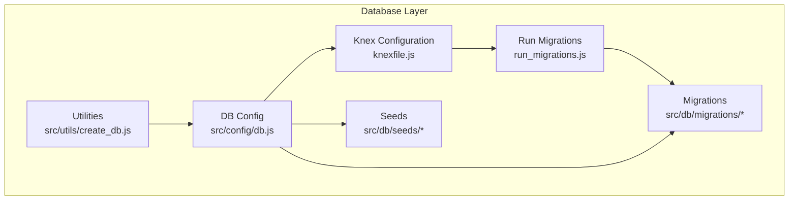
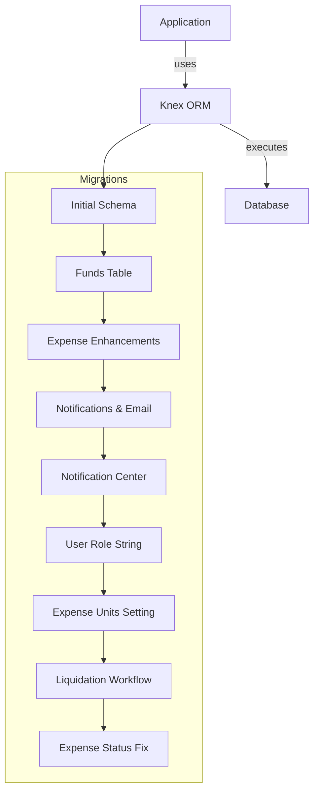
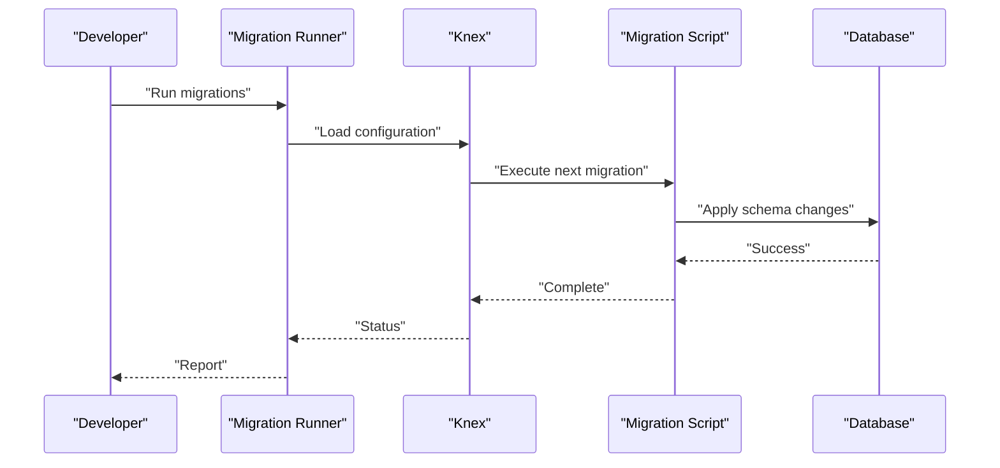
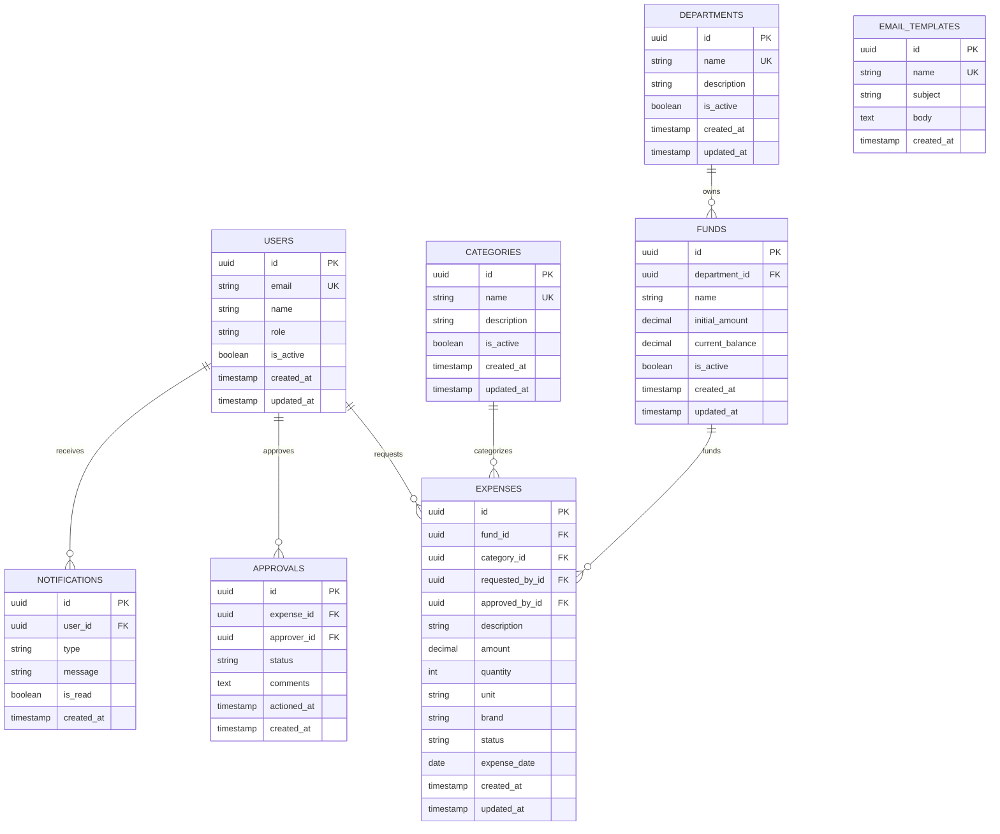
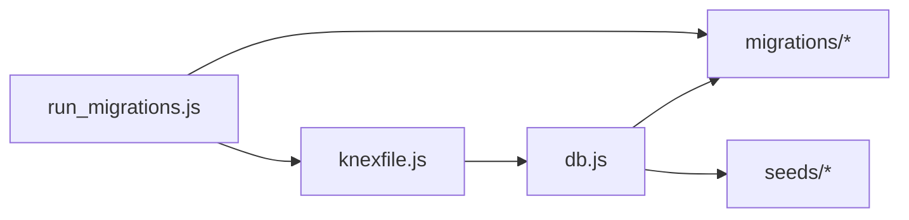

# Database Design

<cite>
**Referenced Files in This Document**
- [knexfile.js](file://backend/knexfile.js)
- [run_migrations.js](file://backend/run_migrations.js)
- [db.js](file://backend/src/config/db.js)
- [create_db.js](file://backend/src/utils/create_db.js)
- [20260512000000_initial_schema.js](file://backend/src/db/migrations/20260512000000_initial_schema.js)
- [20260512075907_create_funds_table.js](file://backend/src/db/migrations/20260512075907_create_funds_table.js)
- [20260512080000_add_quantity_unit_to_expenses.js](file://backend/src/db/migrations/20260512080000_add_quantity_unit_to_expenses.js)
- [20260512080100_add_brand_to_expenses.js](file://backend/src/db/migrations/20260512080100_add_brand_to_expenses.js)
- [20260515064955_add_notifications_and_email_system.js](file://backend/src/db/migrations/20260515064955_add_notifications_and_email_system.js)
- [20260517090000_create_notification_center_tables.js](file://backend/src/db/migrations/20260517090000_create_notification_center_tables.js)
- [20260519120000_alter_user_role_to_string.js](file://backend/src/db/migrations/20260519120000_alter_user_role_to_string.js)
- [20260529120000_add_expense_units_setting.js](file://backend/src/db/migrations/20260529120000_add_expense_units_setting.js)
- [20260611000000_add_liquidation_approval_workflow.js](file://backend/src/db/migrations/20260611000000_add_liquidation_approval_workflow.js)
- [20260611010000_fix_expense_status_varchar.js](file://backend/src/db/migrations/20260611010000_fix_expense_status_varchar.js)
- [01_initial_data.js](file://backend/src/db/seeds/01_initial_data.js)
- [02_sample_data.js](file://backend/src/db/seeds/02_sample_data.js)
- [03_email_templates.js](file://backend/src/db/seeds/03_email_templates.js)
</cite>

## Table of Contents
1. [Introduction](#introduction)
2. [Project Structure](#project-structure)
3. [Core Components](#core-components)
4. [Architecture Overview](#architecture-overview)
5. [Detailed Component Analysis](#detailed-component-analysis)
6. [Dependency Analysis](#dependency-analysis)
7. [Performance Considerations](#performance-considerations)
8. [Troubleshooting Guide](#troubleshooting-guide)
9. [Conclusion](#conclusion)
10. [Appendices](#appendices)

## Introduction
This document describes the database design for the petty cash management system. It covers the complete schema, entity relationships, table structures, and field definitions derived from the migration files. It also documents the migration system that evolves the schema over time, the seed data and initial configuration, data access patterns, and operational considerations such as integrity, security, and backups.

## Project Structure
The database layer is organized around:
- Knex configuration for connecting to the database
- Migration scripts that define schema evolution
- Seed scripts that populate initial and sample data
- Utility scripts for database creation and maintenance

**Diagram sources**
- [knexfile.js](file://backend/knexfile.js)
- [run_migrations.js](file://backend/run_migrations.js)
- [db.js](file://backend/src/config/db.js)
- [create_db.js](file://backend/src/utils/create_db.js)

**Section sources**
- [knexfile.js](file://backend/knexfile.js)
- [run_migrations.js](file://backend/run_migrations.js)
- [db.js](file://backend/src/config/db.js)
- [create_db.js](file://backend/src/utils/create_db.js)

## Core Components
- Knex configuration defines the database client, connection parameters, and migration settings.
- Migration scripts encode schema changes in chronological order.
- Seed scripts load initial data and templates.
- Utilities support database creation and maintenance tasks.

Key responsibilities:
- Knex configuration: centralizes connection and migration settings.
- Migrations: evolve schema safely across environments.
- Seeds: provide baseline data for development and testing.
- Utilities: assist in provisioning and maintenance.

**Section sources**
- [knexfile.js](file://backend/knexfile.js)
- [db.js](file://backend/src/config/db.js)
- [create_db.js](file://backend/src/utils/create_db.js)

## Architecture Overview
The database architecture follows a migration-driven approach with explicit schema versioning and seed-driven initialization.

**Diagram sources**
- [20260512000000_initial_schema.js](file://backend/src/db/migrations/20260512000000_initial_schema.js)
- [20260512075907_create_funds_table.js](file://backend/src/db/migrations/20260512075907_create_funds_table.js)
- [20260512080000_add_quantity_unit_to_expenses.js](file://backend/src/db/migrations/20260512080000_add_quantity_unit_to_expenses.js)
- [20260512080100_add_brand_to_expenses.js](file://backend/src/db/migrations/20260512080100_add_brand_to_expenses.js)
- [20260515064955_add_notifications_and_email_system.js](file://backend/src/db/migrations/20260515064955_add_notifications_and_email_system.js)
- [20260517090000_create_notification_center_tables.js](file://backend/src/db/migrations/20260517090000_create_notification_center_tables.js)
- [20260519120000_alter_user_role_to_string.js](file://backend/src/db/migrations/20260519120000_alter_user_role_to_string.js)
- [20260529120000_add_expense_units_setting.js](file://backend/src/db/migrations/20260529120000_add_expense_units_setting.js)
- [20260611000000_add_liquidation_approval_workflow.js](file://backend/src/db/migrations/20260611000000_add_liquidation_approval_workflow.js)
- [20260611010000_fix_expense_status_varchar.js](file://backend/src/db/migrations/20260611010000_fix_expense_status_varchar.js)

## Detailed Component Analysis

### Database Configuration and Connection Management
- Knex configuration sets up the database client, connection pool, and migration settings.
- The database configuration module initializes Knex and exposes a shared connection instance.
- A utility script supports database creation and maintenance tasks.

Operational notes:
- Centralized connection management ensures consistent behavior across controllers and services.
- Migration settings define where migrations are stored and how they are tracked.

**Section sources**
- [knexfile.js](file://backend/knexfile.js)
- [db.js](file://backend/src/config/db.js)
- [create_db.js](file://backend/src/utils/create_db.js)

### Migration System and Schema Evolution
The migration system evolves the schema through a series of timestamped scripts. Each migration adds or modifies tables and columns to support new features.

**Diagram sources**
- [run_migrations.js](file://backend/run_migrations.js)
- [knexfile.js](file://backend/knexfile.js)

Key migrations and their purpose:
- Initial schema: establishes core entities and relationships.
- Funds table: introduces fund management capabilities.
- Expense enhancements: adds quantity/unit and brand fields.
- Notifications and email system: enables notification and email automation.
- Notification center: creates dedicated tables for centralized notifications.
- User role string: aligns user roles to string values.
- Expense units setting: introduces configurable units for expenses.
- Liquidation approval workflow: adds approval and liquidation processes.
- Expense status fix: standardizes expense status representation.

**Section sources**
- [20260512000000_initial_schema.js](file://backend/src/db/migrations/20260512000000_initial_schema.js)
- [20260512075907_create_funds_table.js](file://backend/src/db/migrations/20260512075907_create_funds_table.js)
- [20260512080000_add_quantity_unit_to_expenses.js](file://backend/src/db/migrations/20260512080000_add_quantity_unit_to_expenses.js)
- [20260512080100_add_brand_to_expenses.js](file://backend/src/db/migrations/20260512080100_add_brand_to_expenses.js)
- [20260515064955_add_notifications_and_email_system.js](file://backend/src/db/migrations/20260515064955_add_notifications_and_email_system.js)
- [20260517090000_create_notification_center_tables.js](file://backend/src/db/migrations/20260517090000_create_notification_center_tables.js)
- [20260519120000_alter_user_role_to_string.js](file://backend/src/db/migrations/20260519120000_alter_user_role_to_string.js)
- [20260529120000_add_expense_units_setting.js](file://backend/src/db/migrations/20260529120000_add_expense_units_setting.js)
- [20260611000000_add_liquidation_approval_workflow.js](file://backend/src/db/migrations/20260611000000_add_liquidation_approval_workflow.js)
- [20260611010000_fix_expense_status_varchar.js](file://backend/src/db/migrations/20260611010000_fix_expense_status_varchar.js)

### Entity-Relationship Model
The schema centers on users, departments, categories, funds, expenses, approvals, notifications, and related audit/tracking entities. Below is a consolidated ER model derived from the migrations.

**Diagram sources**
- [20260512000000_initial_schema.js](file://backend/src/db/migrations/20260512000000_initial_schema.js)
- [20260512075907_create_funds_table.js](file://backend/src/db/migrations/20260512075907_create_funds_table.js)
- [20260512080000_add_quantity_unit_to_expenses.js](file://backend/src/db/migrations/20260512080000_add_quantity_unit_to_expenses.js)
- [20260512080100_add_brand_to_expenses.js](file://backend/src/db/migrations/20260512080100_add_brand_to_expenses.js)
- [20260515064955_add_notifications_and_email_system.js](file://backend/src/db/migrations/20260515064955_add_notifications_and_email_system.js)
- [20260517090000_create_notification_center_tables.js](file://backend/src/db/migrations/20260517090000_create_notification_center_tables.js)
- [20260519120000_alter_user_role_to_string.js](file://backend/src/db/migrations/20260519120000_alter_user_role_to_string.js)
- [20260529120000_add_expense_units_setting.js](file://backend/src/db/migrations/20260529120000_add_expense_units_setting.js)
- [20260611000000_add_liquidation_approval_workflow.js](file://backend/src/db/migrations/20260611000000_add_liquidation_approval_workflow.js)
- [20260611010000_fix_expense_status_varchar.js](file://backend/src/db/migrations/20260611010000_fix_expense_status_varchar.js)

### Table Structures and Field Definitions
Below are the core tables and their fields, derived from the migration scripts. Each table lists primary keys, foreign keys, indexes, and constraints inferred from the migration definitions.

- Users
  - Primary key: id
  - Unique constraints: email
  - Fields: id, email, name, role, is_active, created_at, updated_at

- Departments
  - Primary key: id
  - Unique constraints: name
  - Fields: id, name, description, is_active, created_at, updated_at

- Categories
  - Primary key: id
  - Unique constraints: name
  - Fields: id, name, description, is_active, created_at, updated_at

- Funds
  - Primary key: id
  - Foreign keys: department_id references Departments.id
  - Fields: id, department_id, name, initial_amount, current_balance, is_active, created_at, updated_at

- Expenses
  - Primary key: id
  - Foreign keys: fund_id references Funds.id, category_id references Categories.id, requested_by_id references Users.id, approved_by_id references Users.id
  - Additional fields: description, amount, quantity, unit, brand, status, expense_date, created_at, updated_at

- Approvals
  - Primary key: id
  - Foreign keys: expense_id references Expenses.id, approver_id references Users.id
  - Fields: id, expense_id, approver_id, status, comments, actioned_at, created_at

- Notifications
  - Primary key: id
  - Foreign keys: user_id references Users.id
  - Fields: id, user_id, type, message, is_read, created_at

- Email Templates
  - Primary key: id
  - Unique constraints: name
  - Fields: id, name, subject, body, created_at

Notes:
- Indexes and constraints are inferred from primary keys, foreign keys, and unique constraints declared in the migrations.
- Timestamps are used for audit trails and temporal ordering.

**Section sources**
- [20260512000000_initial_schema.js](file://backend/src/db/migrations/20260512000000_initial_schema.js)
- [20260512075907_create_funds_table.js](file://backend/src/db/migrations/20260512075907_create_funds_table.js)
- [20260512080000_add_quantity_unit_to_expenses.js](file://backend/src/db/migrations/20260512080000_add_quantity_unit_to_expenses.js)
- [20260512080100_add_brand_to_expenses.js](file://backend/src/db/migrations/20260512080100_add_brand_to_expenses.js)
- [20260515064955_add_notifications_and_email_system.js](file://backend/src/db/migrations/20260515064955_add_notifications_and_email_system.js)
- [20260517090000_create_notification_center_tables.js](file://backend/src/db/migrations/20260517090000_create_notification_center_tables.js)
- [20260519120000_alter_user_role_to_string.js](file://backend/src/db/migrations/20260519120000_alter_user_role_to_string.js)
- [20260529120000_add_expense_units_setting.js](file://backend/src/db/migrations/20260529120000_add_expense_units_setting.js)
- [20260611000000_add_liquidation_approval_workflow.js](file://backend/src/db/migrations/20260611000000_add_liquidation_approval_workflow.js)
- [20260611010000_fix_expense_status_varchar.js](file://backend/src/db/migrations/20260611010000_fix_expense_status_varchar.js)

### Seed Data and Initial Configuration
Seed scripts provide baseline data for system setup and testing:
- Initial data: foundational entities and settings.
- Sample data: realistic test records for users, departments, categories, funds, and expenses.
- Email templates: predefined email content for automation.

Seed data structure highlights:
- Users: admin and staff profiles with roles and statuses.
- Departments: organizational units with balances.
- Categories: expense classification taxonomy.
- Funds: monetary allocations per department.
- Expenses: line items linked to funds and categories.
- Notifications: placeholder entries for user communication.
- Email templates: reusable subjects and bodies.

**Section sources**
- [01_initial_data.js](file://backend/src/db/seeds/01_initial_data.js)
- [02_sample_data.js](file://backend/src/db/seeds/02_sample_data.js)
- [03_email_templates.js](file://backend/src/db/seeds/03_email_templates.js)

### Data Access Patterns and Query Optimization
Common access patterns observed from the schema:
- Lookup by unique identifiers (users by email, departments/categories by name).
- Hierarchical queries (expenses by fund, approvals by expense).
- Audit and reporting via timestamps and status filters.
- Notification delivery per user.

Optimization strategies:
- Ensure indexes on foreign keys (department_id, fund_id, category_id, user_id) and frequently filtered columns (status, is_active).
- Use selective projections to avoid heavy joins when possible.
- Batch operations for bulk inserts during seeding and reporting generation.
- Partition or filter by date ranges for historical reporting.

[No sources needed since this section provides general guidance]

### Data Integrity, Security, and Backup Strategies
Data integrity:
- Enforce referential integrity via foreign keys.
- Maintain unique constraints on sensitive identifiers (email, category name).
- Use atomic transactions for multi-step operations (e.g., fund allocation and expense creation).

Security:
- Store only hashed credentials and avoid logging sensitive data.
- Restrict access to administrative endpoints and seed data.
- Sanitize inputs and escape special characters in dynamic SQL.

Backups:
- Schedule regular logical backups of the database.
- Test restore procedures periodically.
- Maintain offsite copies of backups for disaster recovery.

[No sources needed since this section provides general guidance]

## Dependency Analysis
The database layer depends on Knex for ORM and migration orchestration. Migrations depend on each other in a strict sequence, while seeds are independent and idempotent.

**Diagram sources**
- [knexfile.js](file://backend/knexfile.js)
- [db.js](file://backend/src/config/db.js)
- [run_migrations.js](file://backend/run_migrations.js)

**Section sources**
- [knexfile.js](file://backend/knexfile.js)
- [db.js](file://backend/src/config/db.js)
- [run_migrations.js](file://backend/run_migrations.js)

## Performance Considerations
- Normalize to reduce redundancy but denormalize selectively for reporting views.
- Add composite indexes for frequent filter combinations (e.g., status and created_at).
- Use pagination for large result sets in analytics and logs.
- Monitor slow query logs and optimize hotspots identified by application metrics.

[No sources needed since this section provides general guidance]

## Troubleshooting Guide
Common issues and resolutions:
- Migration failures: verify Knex configuration and database connectivity; check migration checksums and lock tables.
- Permission errors: ensure database user has privileges to create tables and modify schema.
- Seed conflicts: confirm uniqueness constraints and idempotency of seed scripts.
- Connection pooling exhaustion: tune pool sizes and timeouts in Knex configuration.

**Section sources**
- [knexfile.js](file://backend/knexfile.js)
- [db.js](file://backend/src/config/db.js)
- [create_db.js](file://backend/src/utils/create_db.js)

## Conclusion
The database design for the petty cash management system is migration-driven, normalized, and extensible. The schema supports core petty cash workflows (funds, expenses, approvals) and integrates notification/email automation. With proper indexing, transactional integrity, and robust backup procedures, the system can reliably scale and maintain data quality across environments.

[No sources needed since this section summarizes without analyzing specific files]

## Appendices

### Appendix A: Migration Timeline
- Initial schema: baseline entities and relationships.
- Funds table: fund allocation and balance tracking.
- Expense enhancements: product-level attributes and units.
- Notifications and email system: communication infrastructure.
- Notification center: centralized notification storage.
- User role string: standardized roles.
- Expense units setting: configurable units.
- Liquidation approval workflow: approval and liquidation steps.
- Expense status fix: status normalization.

**Section sources**
- [20260512000000_initial_schema.js](file://backend/src/db/migrations/20260512000000_initial_schema.js)
- [20260512075907_create_funds_table.js](file://backend/src/db/migrations/20260512075907_create_funds_table.js)
- [20260512080000_add_quantity_unit_to_expenses.js](file://backend/src/db/migrations/20260512080000_add_quantity_unit_to_expenses.js)
- [20260512080100_add_brand_to_expenses.js](file://backend/src/db/migrations/20260512080100_add_brand_to_expenses.js)
- [20260515064955_add_notifications_and_email_system.js](file://backend/src/db/migrations/20260515064955_add_notifications_and_email_system.js)
- [20260517090000_create_notification_center_tables.js](file://backend/src/db/migrations/20260517090000_create_notification_center_tables.js)
- [20260519120000_alter_user_role_to_string.js](file://backend/src/db/migrations/20260519120000_alter_user_role_to_string.js)
- [20260529120000_add_expense_units_setting.js](file://backend/src/db/migrations/20260529120000_add_expense_units_setting.js)
- [20260611000000_add_liquidation_approval_workflow.js](file://backend/src/db/migrations/20260611000000_add_liquidation_approval_workflow.js)
- [20260611010000_fix_expense_status_varchar.js](file://backend/src/db/migrations/20260611010000_fix_expense_status_varchar.js)

### Appendix B: Sample Data Examples
- Users: representative profiles with roles and activity status.
- Departments: organizational units with initial allocations.
- Categories: expense classifications.
- Funds: monetary balances per department.
- Expenses: line items with amounts, quantities, units, brands, and statuses.
- Notifications: sample messages for user delivery.
- Email templates: structured subjects and bodies for automation.

**Section sources**
- [01_initial_data.js](file://backend/src/db/seeds/01_initial_data.js)
- [02_sample_data.js](file://backend/src/db/seeds/02_sample_data.js)
- [03_email_templates.js](file://backend/src/db/seeds/03_email_templates.js)