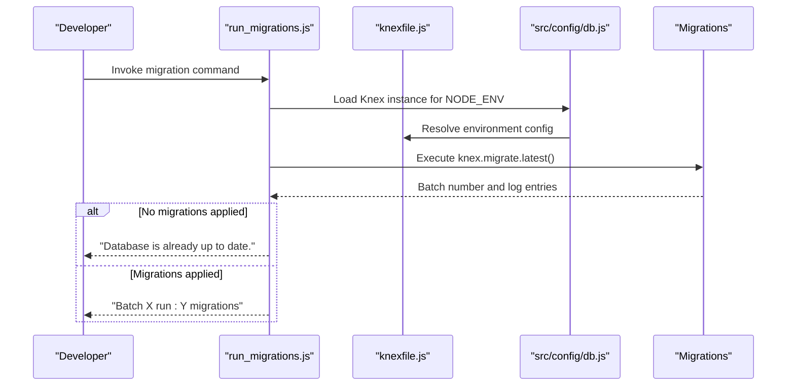
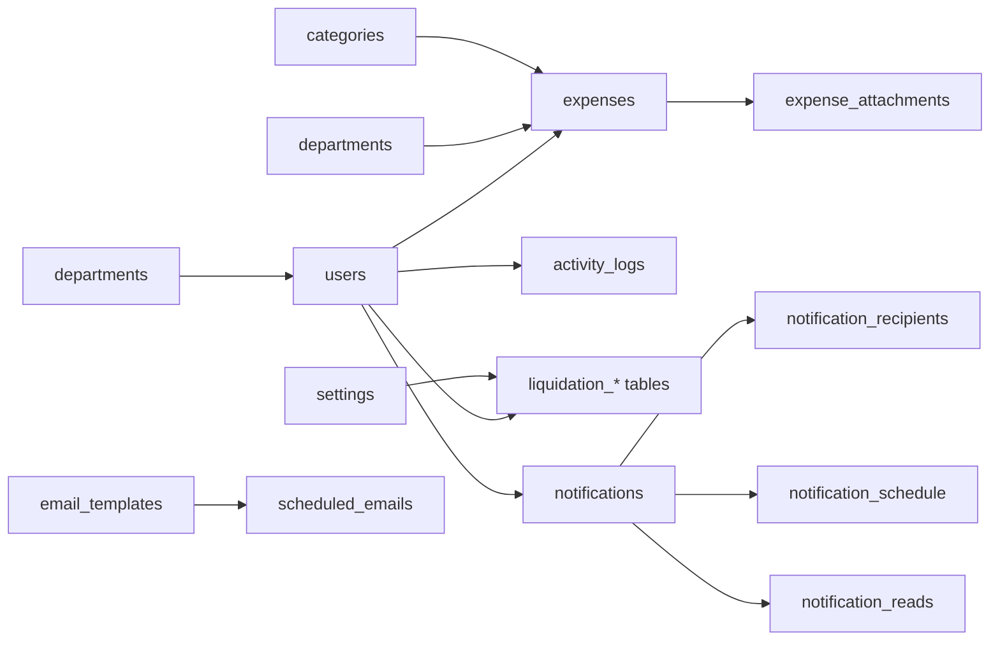

# Migration System & Schema Evolution

<cite>
**Referenced Files in This Document**
- [knexfile.js](file://backend/knexfile.js)
- [db.js](file://backend/src/config/db.js)
- [run_migrations.js](file://backend/run_migrations.js)
- [20260512000000_initial_schema.js](file://backend/src/db/migrations/20260512000000_initial_schema.js)
- [20260512075907_create_funds_table.js](file://backend/src/db/migrations/20260512075907_create_funds_table.js)
- [20260512080000_add_quantity_unit_to_expenses.js](file://backend/src/db/migrations/20260512080000_add_quantity_unit_to_expenses.js)
- [20260512080100_add_brand_to_expenses.js](file://backend/src/db/migrations/20260512080100_add_brand_to_expenses.js)
- [20260515064955_add_notifications_and_email_system.js](file://backend/src/db/migrations/20260515064955_add_notifications_and_email_system.js)
- [20260517090000_create_notification_center_tables.js](file://backend/src/db/migrations/20260517090000_create_notification_center_tables.js)
- [20260519120000_alter_user_role_to_string.js](file://backend/src/db/migrations/20260519120000_alter_user_role_to_string.js)
- [20260529120000_add_expense_units_setting.js](file://backend/src/db/migrations/20260529120000_add_expense_units_setting.js)
- [20260611000000_add_liquidation_approval_workflow.js](file://backend/src/db/migrations/20260611000000_add_liquidation_approval_workflow.js)
- [20260611010000_fix_expense_status_varchar.js](file://backend/src/db/migrations/20260611010000_fix_expense_status_varchar.js)
- [approvalSchemaRepair.js](file://backend/src/utils/approvalSchemaRepair.js)
</cite>

## Table of Contents
1. [Introduction](#introduction)
2. [Project Structure](#project-structure)
3. [Core Components](#core-components)
4. [Architecture Overview](#architecture-overview)
5. [Detailed Component Analysis](#detailed-component-analysis)
6. [Dependency Analysis](#dependency-analysis)
7. [Performance Considerations](#performance-considerations)
8. [Troubleshooting Guide](#troubleshooting-guide)
9. [Conclusion](#conclusion)
10. [Appendices](#appendices)

## Introduction
This document explains the database migration system built with Knex.js and outlines how schema and data evolve across environments. It covers the migration execution lifecycle, rollback procedures, version control strategy, and best practices for writing robust migrations. It also documents each migration’s purpose and changes, and provides guidance for complex scenarios such as schema modifications, data seeding, troubleshooting, and conflict resolution.

## Project Structure
The migration system is organized under the backend with the following key elements:
- Knex configuration defines environment-specific connections, migration directories, and seed directories.
- A dedicated migration runner script executes migrations against the current environment.
- Migrations are timestamped and stored under the migrations directory.
- Utility helpers support schema repair and maintenance tasks.

```mermaid
graph TB
subgraph "Environment Config"
KF["knexfile.js"]
DB["src/config/db.js"]
end
subgraph "Runtime"
RM["run_migrations.js"]
end
subgraph "Migrations"
M1["20260512000000_initial_schema.js"]
M2["20260512075907_create_funds_table.js"]
M3["20260512080000_add_quantity_unit_to_expenses.js"]
M4["20260512080100_add_brand_to_expenses.js"]
M5["20260515064955_add_notifications_and_email_system.js"]
M6["20260517090000_create_notification_center_tables.js"]
M7["20260519120000_alter_user_role_to_string.js"]
M8["20260529120000_add_expense_units_setting.js"]
M9["20260611000000_add_liquidation_approval_workflow.js"]
M10["20260611010000_fix_expense_status_varchar.js"]
end
KF --> DB
RM --> DB
RM --> M1
RM --> M2
RM --> M3
RM --> M4
RM --> M5
RM --> M6
RM --> M7
RM --> M8
RM --> M9
RM --> M10
```

**Diagram sources**
- [knexfile.js:1-37](file://backend/knexfile.js#L1-L37)
- [db.js:1-8](file://backend/src/config/db.js#L1-L8)
- [run_migrations.js:1-21](file://backend/run_migrations.js#L1-L21)
- [20260512000000_initial_schema.js:1-159](file://backend/src/db/migrations/20260512000000_initial_schema.js#L1-L159)
- [20260512075907_create_funds_table.js:1-44](file://backend/src/db/migrations/20260512075907_create_funds_table.js#L1-L44)
- [20260512080000_add_quantity_unit_to_expenses.js:1-23](file://backend/src/db/migrations/20260512080000_add_quantity_unit_to_expenses.js#L1-L23)
- [20260512080100_add_brand_to_expenses.js:1-23](file://backend/src/db/migrations/20260512080100_add_brand_to_expenses.js#L1-L23)
- [20260515064955_add_notifications_and_email_system.js:1-110](file://backend/src/db/migrations/20260515064955_add_notifications_and_email_system.js#L1-L110)
- [20260517090000_create_notification_center_tables.js:1-119](file://backend/src/db/migrations/20260517090000_create_notification_center_tables.js#L1-L119)
- [20260519120000_alter_user_role_to_string.js:1-14](file://backend/src/db/migrations/20260519120000_alter_user_role_to_string.js#L1-L14)
- [20260529120000_add_expense_units_setting.js:1-34](file://backend/src/db/migrations/20260529120000_add_expense_units_setting.js#L1-L34)
- [20260611000000_add_liquidation_approval_workflow.js:1-179](file://backend/src/db/migrations/20260611000000_add_liquidation_approval_workflow.js#L1-L179)
- [20260611010000_fix_expense_status_varchar.js:1-10](file://backend/src/db/migrations/20260611010000_fix_expense_status_varchar.js#L1-L10)

**Section sources**
- [knexfile.js:1-37](file://backend/knexfile.js#L1-L37)
- [db.js:1-8](file://backend/src/config/db.js#L1-L8)
- [run_migrations.js:1-21](file://backend/run_migrations.js#L1-L21)

## Core Components
- Knex configuration: Defines clients, connection parameters, and migration/seeding directories per environment.
- Environment-aware database client: Selects the active environment and exposes a Knex instance.
- Migration runner: Executes latest migrations and prints batch and log information.

Key behaviors:
- Environment selection defaults to development if unset.
- Migrations are executed via a single command that applies all unapplied migrations in order.
- Rollbacks are handled per-migration via the down function.

**Section sources**
- [knexfile.js:3-36](file://backend/knexfile.js#L3-L36)
- [db.js:4-7](file://backend/src/config/db.js#L4-L7)
- [run_migrations.js:3-18](file://backend/run_migrations.js#L3-L18)

## Architecture Overview
The migration lifecycle spans configuration, runtime execution, and schema/data updates. The following diagram maps the flow from environment selection to migration execution and rollback.

**Diagram sources**
- [run_migrations.js:1-21](file://backend/run_migrations.js#L1-L21)
- [db.js:1-8](file://backend/src/config/db.js#L1-L8)
- [knexfile.js:1-37](file://backend/knexfile.js#L1-L37)

## Detailed Component Analysis

### Initial Schema Migration
Purpose:
- Establishes foundational tables and columns for departments, categories, users, expenses, attachments, activity logs, and settings.
- Includes defensive repair logic to handle partial upgrades or re-runs.

Key changes:
- Creates tables with primary keys, timestamps, enums, and foreign keys.
- Adds columns conditionally to repair existing schemas.

Rollback:
- Drops tables in reverse dependency order to safely remove schema elements.

Best practices demonstrated:
- Use hasTable/hasColumn checks to avoid destructive errors.
- Apply default values and constraints consistently.

**Section sources**
- [20260512000000_initial_schema.js:1-159](file://backend/src/db/migrations/20260512000000_initial_schema.js#L1-L159)

### Funds Table Creation
Purpose:
- Introduces a new funds table to track financial inflows/outflows with audit-friendly timestamps.

Key changes:
- Creates funds table with amount, reference, remarks, and authorship tracking.
- Applies defensive repair steps to add missing columns if the table already exists.

Rollback:
- Drops the funds table.

Notes:
- Foreign key creation is wrapped in a try/catch to tolerate environments where FKs cannot be added immediately.

**Section sources**
- [20260512075907_create_funds_table.js:1-44](file://backend/src/db/migrations/20260512075907_create_funds_table.js#L1-L44)

### Expense Quantity and Unit Columns
Purpose:
- Extends expenses with quantity and unit fields to support itemized accounting.

Key changes:
- Conditionally adds quantity and unit columns to expenses.

Rollback:
- Drops both columns.

**Section sources**
- [20260512080000_add_quantity_unit_to_expenses.js:1-23](file://backend/src/db/migrations/20260512080000_add_quantity_unit_to_expenses.js#L1-L23)

### Brand Column Addition
Purpose:
- Adds optional brand metadata to expense items.

Key changes:
- Adds nullable brand column.

Rollback:
- Drops brand column.

**Section sources**
- [20260512080100_add_brand_to_expenses.js:1-23](file://backend/src/db/migrations/20260512080100_add_brand_to_expenses.js#L1-L23)

### Notifications and Email System
Purpose:
- Introduces comprehensive email and notification infrastructure including templates, logs, scheduling, rules, and fallback job queues.

Key changes:
- Creates email_templates, email_logs, scheduled_emails, notification_rules, notifications, notification_preferences, and queue_fallback_jobs.
- Ensures proper foreign keys and indexes.

Rollback:
- Drops tables in reverse dependency order.

**Section sources**
- [20260515064955_add_notifications_and_email_system.js:1-110](file://backend/src/db/migrations/20260515064955_add_notifications_and_email_system.js#L1-L110)

### Notification Center Tables
Purpose:
- Evolves the notifications model with richer attributes, recipient tracking, read/acknowledge tracking, and scheduling capabilities.

Key changes:
- Adds priority, sender_id, attachment_url, task_link, acknowledged, archived, and category to notifications.
- Creates notification_recipients, notification_reads, and notification_schedule tables.
- Adds indexes for performance.

Rollback:
- Drops schedule and reads/recipients tables, then removes added columns from notifications, and drops templates.

**Section sources**
- [20260517090000_create_notification_center_tables.js:1-119](file://backend/src/db/migrations/20260517090000_create_notification_center_tables.js#L1-L119)

### User Role Type Change
Purpose:
- Migrates user role from ENUM to VARCHAR for greater flexibility and reduced risk of ENUM alteration failures.

Key changes:
- Alters role column to string with default.

Rollback:
- Reverts role column to ENUM with original values.

**Section sources**
- [20260519120000_alter_user_role_to_string.js:1-14](file://backend/src/db/migrations/20260519120000_alter_user_role_to_string.js#L1-L14)

### Expense Units Setting and Departments
Purpose:
- Seeds default expense units and ensures presence of key departments.

Key changes:
- Inserts default units into settings if missing.
- Upserts extra departments into departments table.

Rollback:
- Deletes the units setting.

**Section sources**
- [20260529120000_add_expense_units_setting.js:1-34](file://backend/src/db/migrations/20260529120000_add_expense_units_setting.js#L1-L34)

### Liquidation Approval Workflow
Purpose:
- Implements a multi-level approval workflow for petty cash liquidations with tokens, audit trails, and email templates.

Key changes:
- Converts expenses.status to VARCHAR for stability.
- Adds current_approval_level, submitted_by, submitted_at, and approval_context to expenses.
- Creates liquidation_approvers, liquidation_approval_tokens, and liquidation_approval_audit tables.
- Seeds default settings and email templates for approvals.

Rollback:
- Drops approval-related tables, removes added columns from expenses, deletes settings and email templates, and restores ENUM status.

Notes:
- Uses raw SQL to convert ENUM to VARCHAR when detected.

**Section sources**
- [20260611000000_add_liquidation_approval_workflow.js:1-179](file://backend/src/db/migrations/20260611000000_add_liquidation_approval_workflow.js#L1-L179)

### Expense Status VARCHAR Fix
Purpose:
- Ensures expenses.status is VARCHAR by invoking a repair utility.

Key changes:
- Calls ensureApprovalSchema to normalize status type.

Rollback:
- No-op (non-destructive).

**Section sources**
- [20260611010000_fix_expense_status_varchar.js:1-10](file://backend/src/db/migrations/20260611010000_fix_expense_status_varchar.js#L1-L10)
- [approvalSchemaRepair.js](file://backend/src/utils/approvalSchemaRepair.js)

## Dependency Analysis
The migrations form a directed acyclic sequence of schema and data changes. Dependencies are primarily temporal (timestamped order) and relational (foreign keys between tables). The following diagram highlights inter-table dependencies and the direction of data flow.

**Diagram sources**
- [20260512000000_initial_schema.js:38-136](file://backend/src/db/migrations/20260512000000_initial_schema.js#L38-L136)
- [20260512075907_create_funds_table.js:1-44](file://backend/src/db/migrations/20260512075907_create_funds_table.js#L1-L44)
- [20260515064955_add_notifications_and_email_system.js:1-110](file://backend/src/db/migrations/20260515064955_add_notifications_and_email_system.js#L1-L110)
- [20260517090000_create_notification_center_tables.js:1-119](file://backend/src/db/migrations/20260517090000_create_notification_center_tables.js#L1-L119)
- [20260611000000_add_liquidation_approval_workflow.js:1-179](file://backend/src/db/migrations/20260611000000_add_liquidation_approval_workflow.js#L1-L179)

## Performance Considerations
- Prefer conditional checks (hasTable/hasColumn) to avoid redundant operations and preserve performance during repeated runs.
- Add indexes on foreign keys and frequently queried columns (as seen in notification tables) to improve join performance.
- Use transactions for multi-step operations when supported by the underlying driver to maintain atomicity.
- Keep migrations idempotent so they can be safely re-run without side effects.

## Troubleshooting Guide
Common issues and resolutions:
- Foreign key constraint failures:
  - Some environments restrict immediate FK creation; wrap in try/catch and defer constraints if necessary.
  - Verify referential integrity after applying dependent migrations.
- ENUM alterations on shared hosting:
  - Convert ENUM to VARCHAR when detected and apply appropriate defaults.
  - Restore ENUM in rollback only when safe.
- Partial or interrupted migrations:
  - Rerun migrations; Knex tracks migration state and will skip applied ones.
  - Use the down function of the last failing migration to partially revert.
- Permission errors:
  - Ensure the database user has sufficient privileges for DDL operations.
- Large data migrations:
  - Break into smaller batches and add indexes incrementally.
- Validation failures:
  - Use repair utilities to normalize schema inconsistencies before applying dependent migrations.

**Section sources**
- [20260512075907_create_funds_table.js:29-33](file://backend/src/db/migrations/20260512075907_create_funds_table.js#L29-L33)
- [20260611000000_add_liquidation_approval_workflow.js:3-10](file://backend/src/db/migrations/20260611000000_add_liquidation_approval_workflow.js#L3-L10)
- [20260611010000_fix_expense_status_varchar.js:1-10](file://backend/src/db/migrations/20260611010000_fix_expense_status_varchar.js#L1-L10)

## Conclusion
The migration system follows a disciplined, timestamped, and reversible approach to schema and data evolution. By leveraging conditional DDL, careful rollback definitions, and environment-aware configuration, it supports reliable deployments across development and production. Adhering to the best practices outlined here will help maintain a predictable and testable migration lifecycle.

## Appendices

### Migration Execution and Rollback Procedures
- Execute migrations:
  - Run the migration script to apply all unapplied migrations for the current environment.
  - Review batch number and logs printed by the runner.
- Rollback:
  - Use the down function of the target migration to revert changes.
  - For partial rollbacks, apply down functions in reverse chronological order.

**Section sources**
- [run_migrations.js:3-18](file://backend/run_migrations.js#L3-L18)
- [20260512000000_initial_schema.js:149-158](file://backend/src/db/migrations/20260512000000_initial_schema.js#L149-L158)
- [20260611000000_add_liquidation_approval_workflow.js:146-178](file://backend/src/db/migrations/20260611000000_add_liquidation_approval_workflow.js#L146-L178)

### Version Control Strategy
- Naming:
  - Use timestamp prefixes to ensure deterministic ordering.
- Idempotency:
  - Guard all DDL with existence checks to allow safe reruns.
- Down actions:
  - Provide reversible down functions for all migrations.
- Documentation:
  - Include comments explaining purpose, dependencies, and rationale for each migration.

**Section sources**
- [20260512000000_initial_schema.js:1-159](file://backend/src/db/migrations/20260512000000_initial_schema.js#L1-L159)
- [20260515064955_add_notifications_and_email_system.js:1-110](file://backend/src/db/migrations/20260515064955_add_notifications_and_email_system.js#L1-L110)

### Best Practices for Writing Migrations
- Always check for table/column existence before altering.
- Use default values and constraints to prevent future anomalies.
- Add indexes early for performance-sensitive columns.
- Keep migrations small and focused on a single concern.
- Test migrations on a copy of production data before applying to live systems.
- Use transactions for multi-step operations when supported.

### Complex Migration Examples
- Schema modifications:
  - Converting ENUM to VARCHAR for compatibility and safety.
  - Adding multi-level approval columns and related audit tables.
- Data seeding:
  - Inserting default settings and ensuring seed data integrity.

**Section sources**
- [20260611000000_add_liquidation_approval_workflow.js:1-179](file://backend/src/db/migrations/20260611000000_add_liquidation_approval_workflow.js#L1-L179)
- [20260529120000_add_expense_units_setting.js:17-34](file://backend/src/db/migrations/20260529120000_add_expense_units_setting.js#L17-L34)

### Testing Strategies
- Local testing:
  - Run migrations against a local database instance.
  - Verify schema and data integrity after each migration.
- Staging verification:
  - Apply migrations to staging and validate workflows.
- Rollback validation:
  - Confirm down functions restore previous state accurately.
- Regression checks:
  - Execute representative queries and API tests after applying changes.