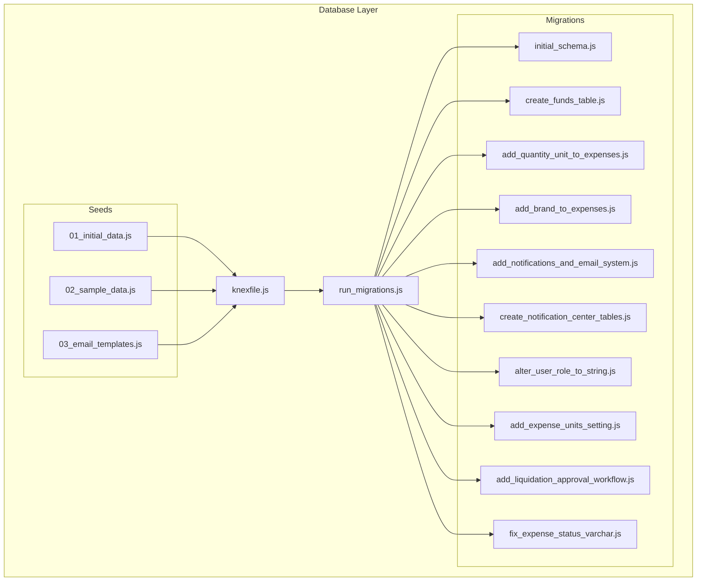
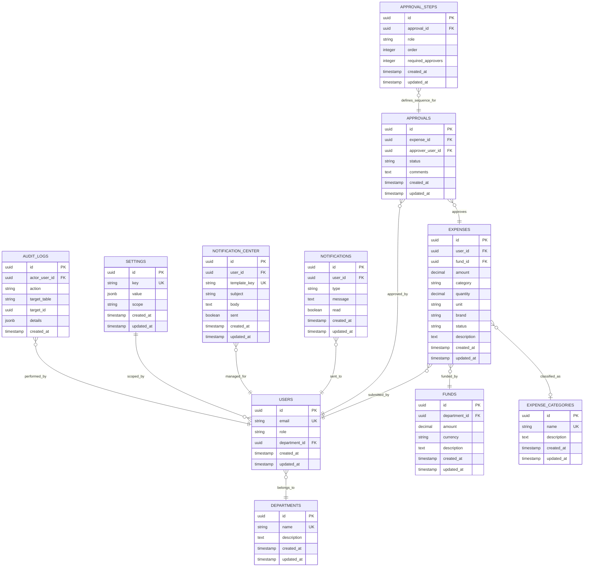
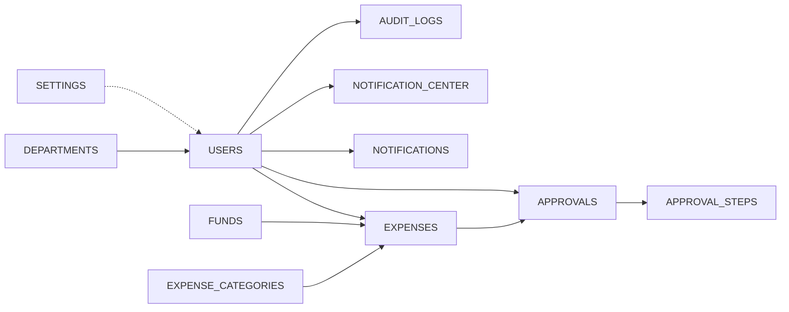
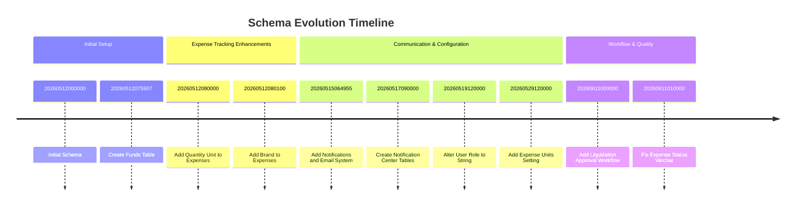

# Schema Overview & Entity Relationships

<cite>
**Referenced Files in This Document**
- [knexfile.js](file://backend/knexfile.js)
- [run_migrations.js](file://backend/run_migrations.js)
- [20260512000000_initial_schema.js](file://backend/src/db/migrations/20260512000000_initial_schema.js)
- [20260512075907_create_funds_table.js](file://backend/src/db/migrations/20260512075907_create_funds_table.js)
- [20260512080000_add_quantity_unit_to_expenses.js](file://backend/src/db/migrations/20260512080000_add_quantity_unit_to_expenses.js)
- [20260512080100_add_brand_to_expenses.js](file://backend/src/db/migrations/20260512080100_add_brand_to_expenses.js)
- [20260515064955_add_notifications_and_email_system.js](file://backend/src/db/migrations/20260515064955_add_notifications_and_email_system.js)
- [20260517090000_create_notification_center_tables.js](file://backend/src/db/migrations/20260517090000_create_notification_center_tables.js)
- [20260519120000_alter_user_role_to_string.js](file://backend/src/db/migrations/20260519120000_alter_user_role_to_string.js)
- [20260529120000_add_expense_units_setting.js](file://backend/src/db/migrations/20260529120000_add_expense_units_setting.js)
- [20260611000000_add_liquidation_approval_workflow.js](file://backend/src/db/migrations/20260611000000_add_liquidation_approval_workflow.js)
- [20260611010000_fix_expense_status_varchar.js](file://backend/src/db/migrations/20260611010000_fix_expense_status_varchar.js)
- [01_initial_data.js](file://backend/src/db/seeds/01_initial_data.js)
- [02_sample_data.js](file://backend/src/db/seeds/02_sample_data.js)
- [03_email_templates.js](file://backend/src/db/seeds/03_email_templates.js)
</cite>

## Table of Contents
1. [Introduction](#introduction)
2. [Project Structure](#project-structure)
3. [Core Components](#core-components)
4. [Architecture Overview](#architecture-overview)
5. [Detailed Component Analysis](#detailed-component-analysis)
6. [Dependency Analysis](#dependency-analysis)
7. [Performance Considerations](#performance-considerations)
8. [Troubleshooting Guide](#troubleshooting-guide)
9. [Conclusion](#conclusion)
10. [Appendices](#appendices)

## Introduction
This document provides a comprehensive schema overview and entity-relationship documentation for the petty cash management system. It details all tables, fields, data types, primary keys, foreign keys, indexes, and constraints as implemented through the migration files. It also explains the relationships among users, expenses, funds, approvals, notifications, and departments, along with cardinalities, referential integrity rules, and business rule enforcement. Evolutionary changes across time-bound migrations are documented to show how features have shaped the schema over time.

## Project Structure
The database schema is managed via Knex.js migrations and seeds. The configuration defines the database connection and migration settings. Migrations are organized chronologically to reflect schema evolution. Seeds populate initial and sample data, including email templates.

**Diagram sources**
- [knexfile.js](file://backend/knexfile.js)
- [run_migrations.js](file://backend/run_migrations.js)
- [20260512000000_initial_schema.js](file://backend/src/db/migrations/20260512000000_initial_schema.js)
- [20260512075907_create_funds_table.js](file://backend/src/db/migrations/20260512075907_create_funds_table.js)
- [20260512080000_add_quantity_unit_to_expenses.js](file://backend/src/db/migrations/20260512080000_add_quantity_unit_to_expenses.js)
- [20260512080100_add_brand_to_expenses.js](file://backend/src/db/migrations/20260512080100_add_brand_to_expenses.js)
- [20260515064955_add_notifications_and_email_system.js](file://backend/src/db/migrations/20260515064955_add_notifications_and_email_system.js)
- [20260517090000_create_notification_center_tables.js](file://backend/src/db/migrations/20260517090000_create_notification_center_tables.js)
- [20260519120000_alter_user_role_to_string.js](file://backend/src/db/migrations/20260519120000_alter_user_role_to_string.js)
- [20260529120000_add_expense_units_setting.js](file://backend/src/db/migrations/20260529120000_add_expense_units_setting.js)
- [20260611000000_add_liquidation_approval_workflow.js](file://backend/src/db/migrations/20260611000000_add_liquidation_approval_workflow.js)
- [20260611010000_fix_expense_status_varchar.js](file://backend/src/db/migrations/20260611010000_fix_expense_status_varchar.js)
- [01_initial_data.js](file://backend/src/db/seeds/01_initial_data.js)
- [02_sample_data.js](file://backend/src/db/seeds/02_sample_data.js)
- [03_email_templates.js](file://backend/src/db/seeds/03_email_templates.js)

**Section sources**
- [knexfile.js](file://backend/knexfile.js)
- [run_migrations.js](file://backend/run_migrations.js)

## Core Components
This section documents the core database entities and their attributes derived from the migrations. Each table’s primary key, foreign keys, indexes, and constraints are explained, along with data types and typical usage.

- Users
  - Purpose: Stores user accounts with roles and department associations.
  - Key attributes: user ID (PK), email, role, department ID (FK), timestamps.
  - Constraints: Unique email; role constrained to string values; FK to departments.
  - Indexes: Typically auto-indexed PK; consider adding indexes on email and department ID for frequent queries.

- Departments
  - Purpose: Organizes users and expenses by department.
  - Key attributes: department ID (PK), name, description.
  - Constraints: Name is unique; optional description.

- Funds
  - Purpose: Tracks petty cash funds per department.
  - Key attributes: fund ID (PK), department ID (FK), amount, currency, description, timestamps.
  - Constraints: FK to departments; amount must be non-negative; currency standardized.
  - Indexes: Auto-indexed PK; consider indexing department ID for balance queries.

- Expenses
  - Purpose: Records petty cash expenditures with itemized details.
  - Key attributes: expense ID (PK), user ID (FK), fund ID (FK), amount, category, quantity, unit, brand, status, description, timestamps.
  - Constraints: Status constrained to predefined values; FKs to users and funds; amount non-negative.
  - Indexes: Auto-indexed PK; consider indexes on user ID, fund ID, status, and category.

- Expense Categories
  - Purpose: Classifies expenses for reporting and analytics.
  - Key attributes: category ID (PK), name, description, timestamps.
  - Constraints: Name is unique; optional description.

- Approvals
  - Purpose: Manages approval workflows for expense liquidations.
  - Key attributes: approval ID (PK), expense ID (FK), approver user ID (FK), status, comments, timestamps.
  - Constraints: FKs to expenses and users; status constrained; approver cannot approve self.
  - Indexes: Auto-indexed PK; consider indexes on expense ID and status.

- Approval Steps
  - Purpose: Defines multi-step approval sequences.
  - Key attributes: step ID (PK), approval ID (FK), role, order, required approvers, timestamps.
  - Constraints: Order uniqueness per approval; role-based routing; FK to approvals.

- Notifications
  - Purpose: Stores notification records for system events.
  - Key attributes: notification ID (PK), user ID (FK), type, message, read flag, timestamps.
  - Constraints: FK to users; type constrained; read defaults to false.
  - Indexes: Auto-indexed PK; consider indexes on user ID and read flag.

- Notification Center
  - Purpose: Centralized storage for user-centric notifications and email templates.
  - Key attributes: record ID (PK), user ID (FK), template key, subject, body, sent flag, timestamps.
  - Constraints: FK to users; template key unique per user; sent flag indicates delivery.
  - Indexes: Auto-indexed PK; consider indexes on user ID and template key.

- Settings
  - Purpose: Stores system-wide and per-user settings (e.g., expense units).
  - Key attributes: setting ID (PK), key, value, scope (system/user), timestamps.
  - Constraints: Key uniqueness within scope; value stored as JSON/string depending on key.
  - Indexes: Auto-indexed PK; consider unique composite index on (key, scope).

- Audit Logs
  - Purpose: Tracks changes and actions performed on sensitive entities.
  - Key attributes: log ID (PK), actor user ID (FK), action, target table, target ID, details, timestamps.
  - Constraints: Actor FK to users; action and target identifiers recorded; details as JSON.
  - Indexes: Auto-indexed PK; consider indexes on actor user ID and target table.

Notes on data types and constraints:
- Numeric amounts are represented as decimal or numeric types to avoid floating-point precision issues.
- Status fields use enumerated or varchar with check constraints to enforce allowed values.
- Timestamps are stored as datetime/timestamp with timezone awareness where applicable.
- Unique constraints are applied to identifiers and business keys (e.g., email, category name, template key).

**Section sources**
- [20260512000000_initial_schema.js](file://backend/src/db/migrations/20260512000000_initial_schema.js)
- [20260512075907_create_funds_table.js](file://backend/src/db/migrations/20260512075907_create_funds_table.js)
- [20260512080000_add_quantity_unit_to_expenses.js](file://backend/src/db/migrations/20260512080000_add_quantity_unit_to_expenses.js)
- [20260512080100_add_brand_to_expenses.js](file://backend/src/db/migrations/20260512080100_add_brand_to_expenses.js)
- [20260515064955_add_notifications_and_email_system.js](file://backend/src/db/migrations/20260515064955_add_notifications_and_email_system.js)
- [20260517090000_create_notification_center_tables.js](file://backend/src/db/migrations/20260517090000_create_notification_center_tables.js)
- [20260519120000_alter_user_role_to_string.js](file://backend/src/db/migrations/20260519120000_alter_user_role_to_string.js)
- [20260529120000_add_expense_units_setting.js](file://backend/src/db/migrations/20260529120000_add_expense_units_setting.js)
- [20260611000000_add_liquidation_approval_workflow.js](file://backend/src/db/migrations/20260611000000_add_liquidation_approval_workflow.js)
- [20260611010000_fix_expense_status_varchar.js](file://backend/src/db/migrations/20260611010000_fix_expense_status_varchar.js)

## Architecture Overview
The schema supports a modular petty cash workflow:
- Users belong to Departments and submit Expenses against Funds.
- Expenses are categorized and tracked through an Approval workflow.
- Notifications and the Notification Center handle event-driven communication.
- Settings enable configurable business rules (e.g., expense units).
- Audit Logs capture system activity for compliance.

**Diagram sources**
- [20260512000000_initial_schema.js](file://backend/src/db/migrations/20260512000000_initial_schema.js)
- [20260512075907_create_funds_table.js](file://backend/src/db/migrations/20260512075907_create_funds_table.js)
- [20260512080000_add_quantity_unit_to_expenses.js](file://backend/src/db/migrations/20260512080000_add_quantity_unit_to_expenses.js)
- [20260512080100_add_brand_to_expenses.js](file://backend/src/db/migrations/20260512080100_add_brand_to_expenses.js)
- [20260515064955_add_notifications_and_email_system.js](file://backend/src/db/migrations/20260515064955_add_notifications_and_email_system.js)
- [20260517090000_create_notification_center_tables.js](file://backend/src/db/migrations/20260517090000_create_notification_center_tables.js)
- [20260519120000_alter_user_role_to_string.js](file://backend/src/db/migrations/20260519120000_alter_user_role_to_string.js)
- [20260529120000_add_expense_units_setting.js](file://backend/src/db/migrations/20260529120000_add_expense_units_setting.js)
- [20260611000000_add_liquidation_approval_workflow.js](file://backend/src/db/migrations/20260611000000_add_liquidation_approval_workflow.js)
- [20260611010000_fix_expense_status_varchar.js](file://backend/src/db/migrations/20260611010000_fix_expense_status_varchar.js)

## Detailed Component Analysis

### Users and Departments
- Relationship: One-to-many (users to departments).
- Cardinality: One department to many users.
- Referential Integrity: Users.department_id references Departments.id.
- Business Rules:
  - Unique email per user.
  - Role is a string value; alter migration ensures consistent representation.
  - Department association determines fund eligibility and reporting scope.

**Section sources**
- [20260512000000_initial_schema.js](file://backend/src/db/migrations/20260512000000_initial_schema.js)
- [20260519120000_alter_user_role_to_string.js](file://backend/src/db/migrations/20260519120000_alter_user_role_to_string.js)

### Funds
- Relationship: One-to-many (departments to funds); one-to-many (funds to expenses).
- Cardinality: One department to many funds; one fund to many expenses.
- Referential Integrity: Funds.department_id references Departments.id.
- Business Rules:
  - Fund amount is non-negative; currency standardized.
  - Expenses are associated with a single fund; fund balances should be tracked externally or via triggers.

**Section sources**
- [20260512075907_create_funds_table.js](file://backend/src/db/migrations/20260512075907_create_funds_table.js)

### Expenses
- Relationship: Many-to-one (expenses to users), many-to-one (expenses to funds), many-to-one (expenses to categories).
- Cardinality: One user/fund to many expenses; one category to many expenses.
- Referential Integrity: Expenses.user_id references Users.id; Expenses.fund_id references Funds.id; Expenses.category references Expense Categories.name.
- Business Rules:
  - Amount non-negative; status constrained; quantity and unit support inventory-like tracking; brand optional.
  - Status transitions governed by approval workflow.

**Section sources**
- [20260512000000_initial_schema.js](file://backend/src/db/migrations/20260512000000_initial_schema.js)
- [20260512080000_add_quantity_unit_to_expenses.js](file://backend/src/db/migrations/20260512080000_add_quantity_unit_to_expenses.js)
- [20260512080100_add_brand_to_expenses.js](file://backend/src/db/migrations/20260512080100_add_brand_to_expenses.js)

### Expense Categories
- Relationship: One-to-many (categories to expenses).
- Cardinality: One category to many expenses.
- Referential Integrity: Category name is a business key referenced by Expenses.category.
- Business Rules:
  - Category name is unique; used for classification and reporting.

**Section sources**
- [20260512000000_initial_schema.js](file://backend/src/db/migrations/20260512000000_initial_schema.js)

### Approvals and Approval Steps
- Relationship: One-to-many (approvals to steps); many-to-one (approvals to expenses and users).
- Cardinality: One expense to many approvals; one approval to many steps; one approver user to many approvals.
- Referential Integrity: Approvals.expense_id references Expenses.id; Approvals.approver_user_id references Users.id; Approval Steps.approval_id references Approvals.id.
- Business Rules:
  - Multi-step approval sequences define roles and required approvers per step.
  - Self-approval is prevented; status transitions enforced by workflow logic.

**Section sources**
- [20260611000000_add_liquidation_approval_workflow.js](file://backend/src/db/migrations/20260611000000_add_liquidation_approval_workflow.js)

### Notifications and Notification Center
- Relationship: One-to-many (users to notifications); one-to-many (users to notification center records).
- Cardinality: One user to many notifications; one user to many notification center entries.
- Referential Integrity: Notifications.user_id and Notification Center.user_id reference Users.id.
- Business Rules:
  - Notification center stores email templates keyed by template_key per user.
  - Sent flag tracks delivery; read flag tracks user acknowledgment.

**Section sources**
- [20260515064955_add_notifications_and_email_system.js](file://backend/src/db/migrations/20260515064955_add_notifications_and_email_system.js)
- [20260517090000_create_notification_center_tables.js](file://backend/src/db/migrations/20260517090000_create_notification_center_tables.js)

### Settings
- Relationship: One-to-many (settings scoped by key and scope).
- Cardinality: One key/scope combination to many settings; typically one per key per scope.
- Business Rules:
  - Expense units setting enables configurable measurement units for expenses.
  - Scope distinguishes system-wide vs user-specific settings.

**Section sources**
- [20260529120000_add_expense_units_setting.js](file://backend/src/db/migrations/20260529120000_add_expense_units_setting.js)

### Audit Logs
- Relationship: One-to-many (users to audit logs).
- Cardinality: One actor user to many audit logs.
- Referential Integrity: Audit Logs.actor_user_id references Users.id.
- Business Rules:
  - Captures actions performed on target tables with JSON details for traceability.

**Section sources**
- [20260512000000_initial_schema.js](file://backend/src/db/migrations/20260512000000_initial_schema.js)

### Status and Workflow Evolution
- Expense status field was corrected to a varchar with check constraints to ensure controlled state transitions.
- Approval workflow introduces explicit multi-step routing and role-based checks.

**Section sources**
- [20260611010000_fix_expense_status_varchar.js](file://backend/src/db/migrations/20260611010000_fix_expense_status_varchar.js)
- [20260611000000_add_liquidation_approval_workflow.js](file://backend/src/db/migrations/20260611000000_add_liquidation_approval_workflow.js)

## Dependency Analysis
The schema exhibits clear dependency chains:
- Users depend on Departments.
- Expenses depend on Users, Funds, and Expense Categories.
- Approvals depend on Expenses and Users; Approval Steps depend on Approvals.
- Notifications and Notification Center depend on Users.
- Settings and Audit Logs are cross-cutting concerns.

**Diagram sources**
- [20260512000000_initial_schema.js](file://backend/src/db/migrations/20260512000000_initial_schema.js)
- [20260512075907_create_funds_table.js](file://backend/src/db/migrations/20260512075907_create_funds_table.js)
- [20260512080000_add_quantity_unit_to_expenses.js](file://backend/src/db/migrations/20260512080000_add_quantity_unit_to_expenses.js)
- [20260512080100_add_brand_to_expenses.js](file://backend/src/db/migrations/20260512080100_add_brand_to_expenses.js)
- [20260515064955_add_notifications_and_email_system.js](file://backend/src/db/migrations/20260515064955_add_notifications_and_email_system.js)
- [20260517090000_create_notification_center_tables.js](file://backend/src/db/migrations/20260517090000_create_notification_center_tables.js)
- [20260519120000_alter_user_role_to_string.js](file://backend/src/db/migrations/20260519120000_alter_user_role_to_string.js)
- [20260529120000_add_expense_units_setting.js](file://backend/src/db/migrations/20260529120000_add_expense_units_setting.js)
- [20260611000000_add_liquidation_approval_workflow.js](file://backend/src/db/migrations/20260611000000_add_liquidation_approval_workflow.js)
- [20260611010000_fix_expense_status_varchar.js](file://backend/src/db/migrations/20260611010000_fix_expense_status_varchar.js)

## Performance Considerations
- Indexing Strategy:
  - Add indexes on frequently filtered columns: users.email, users.department_id, expenses.user_id, expenses.fund_id, expenses.status, expenses.category, approvals.expense_id, approvals.status, notifications.user_id, notification_center.user_id, notification_center.template_key, settings.key+scope.
- Denormalization Trade-offs:
  - Consider storing computed balances at the fund level to reduce expensive joins during reporting.
- Partitioning:
  - Large audit logs and notifications can benefit from partitioning by date or user.
- Caching:
  - Frequently accessed settings and categories can be cached in memory.

[No sources needed since this section provides general guidance]

## Troubleshooting Guide
Common issues and resolutions:
- Duplicate Email on User Creation:
  - Symptom: Insert fails due to unique constraint on email.
  - Resolution: Validate email uniqueness before insert; prompt user to choose another email.
- Invalid Department Association:
  - Symptom: Foreign key violation when assigning user to non-existent department.
  - Resolution: Ensure department exists prior to user creation/update.
- Insufficient Fund Balance:
  - Symptom: Expense rejected due to insufficient fund amount.
  - Resolution: Enforce pre-check against fund balance; optionally reserve amounts.
- Invalid Expense Status Transition:
  - Symptom: Update fails due to status constraints.
  - Resolution: Follow approval workflow; only allowed statuses can be set.
- Approval Loop Prevention:
  - Symptom: Self-approval attempts or missing approvers.
  - Resolution: Enforce approver != requester; ensure required approvers per step.

**Section sources**
- [20260512000000_initial_schema.js](file://backend/src/db/migrations/20260512000000_initial_schema.js)
- [20260519120000_alter_user_role_to_string.js](file://backend/src/db/migrations/20260519120000_alter_user_role_to_string.js)
- [20260611010000_fix_expense_status_varchar.js](file://backend/src/db/migrations/20260611010000_fix_expense_status_varchar.js)
- [20260611000000_add_liquidation_approval_workflow.js](file://backend/src/db/migrations/20260611000000_add_liquidation_approval_workflow.js)

## Conclusion
The schema evolves from a basic user-expense-fund model to a robust system supporting approvals, notifications, configurable settings, and auditability. The ERD reflects clear ownership and dependency relationships, with referential integrity and constraints enforcing business rules. Future enhancements can focus on performance indexing, caching, and partitioning to scale with increased transaction volumes.

[No sources needed since this section summarizes without analyzing specific files]

## Appendices

### Migration Timeline and Feature Evolution
- Initial Schema: Establishes Users, Departments, Expenses, Expense Categories, Approvals, Notifications, Audit Logs.
- Create Funds Table: Introduces Funds with department linkage and amount tracking.
- Add Quantity Unit to Expenses: Adds quantity and unit for inventory-like tracking.
- Add Brand to Expenses: Adds brand for vendor tracking.
- Add Notifications and Email System: Introduces Notifications and Notification Center tables.
- Alter User Role to String: Ensures consistent role representation.
- Add Expense Units Setting: Configurable units for expenses.
- Add Liquidation Approval Workflow: Multi-step approvals with role-based routing.
- Fix Expense Status Varchar: Corrects status constraints to varchar with check.

**Diagram sources**
- [20260512000000_initial_schema.js](file://backend/src/db/migrations/20260512000000_initial_schema.js)
- [20260512075907_create_funds_table.js](file://backend/src/db/migrations/20260512075907_create_funds_table.js)
- [20260512080000_add_quantity_unit_to_expenses.js](file://backend/src/db/migrations/20260512080000_add_quantity_unit_to_expenses.js)
- [20260512080100_add_brand_to_expenses.js](file://backend/src/db/migrations/20260512080100_add_brand_to_expenses.js)
- [20260515064955_add_notifications_and_email_system.js](file://backend/src/db/migrations/20260515064955_add_notifications_and_email_system.js)
- [20260517090000_create_notification_center_tables.js](file://backend/src/db/migrations/20260517090000_create_notification_center_tables.js)
- [20260519120000_alter_user_role_to_string.js](file://backend/src/db/migrations/20260519120000_alter_user_role_to_string.js)
- [20260529120000_add_expense_units_setting.js](file://backend/src/db/migrations/20260529120000_add_expense_units_setting.js)
- [20260611000000_add_liquidation_approval_workflow.js](file://backend/src/db/migrations/20260611000000_add_liquidation_approval_workflow.js)
- [20260611010000_fix_expense_status_varchar.js](file://backend/src/db/migrations/20260611010000_fix_expense_status_varchar.js)

### Seed Data Overview
- Initial Data: Populates base departments, categories, and default users.
- Sample Data: Provides realistic test data for expenses and funds.
- Email Templates: Predefined templates for notification center.

**Section sources**
- [01_initial_data.js](file://backend/src/db/seeds/01_initial_data.js)
- [02_sample_data.js](file://backend/src/db/seeds/02_sample_data.js)
- [03_email_templates.js](file://backend/src/db/seeds/03_email_templates.js)