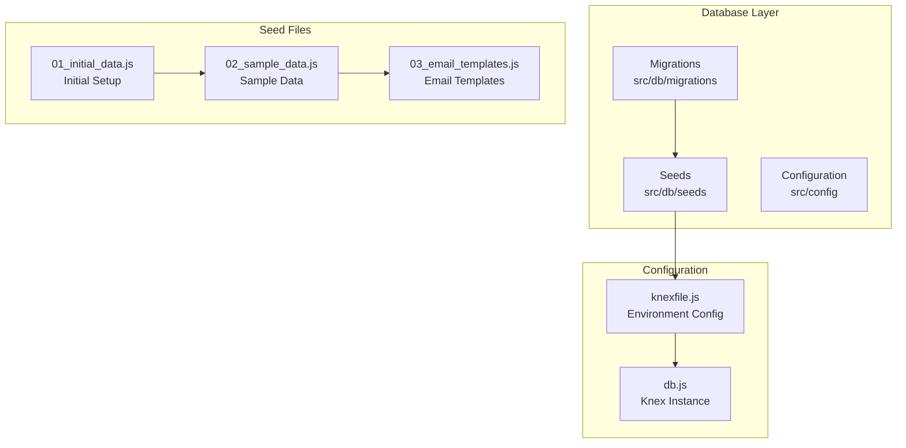
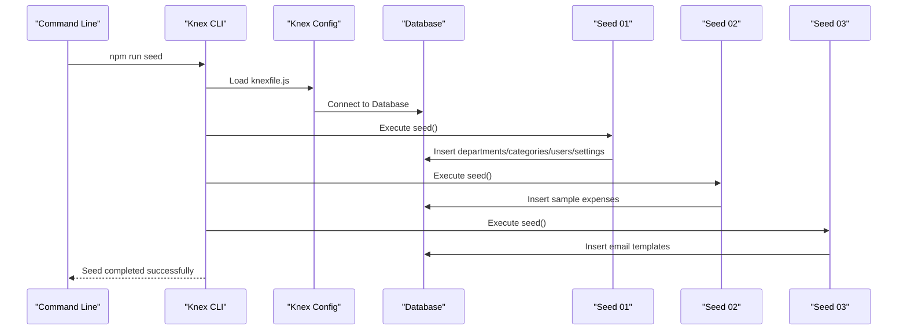
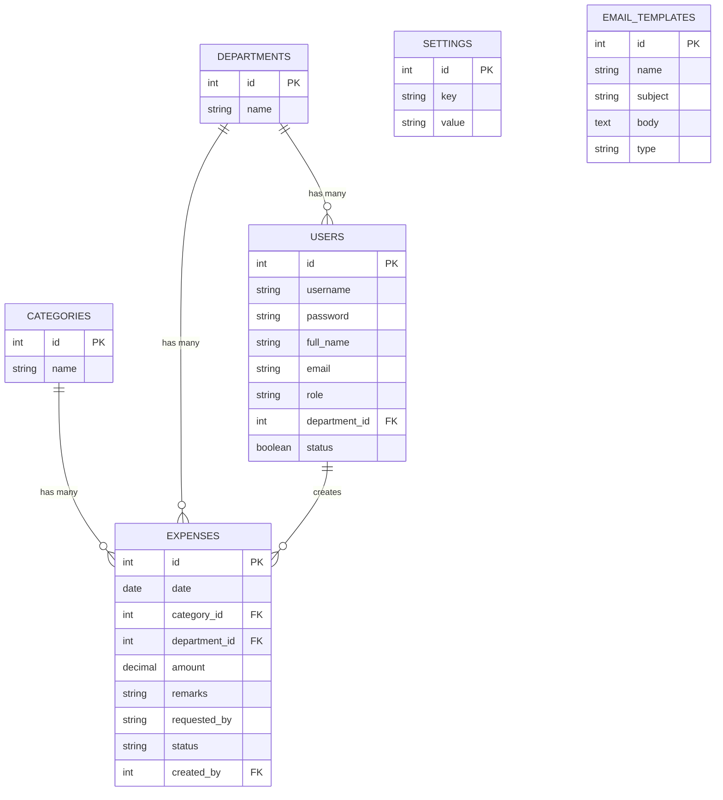
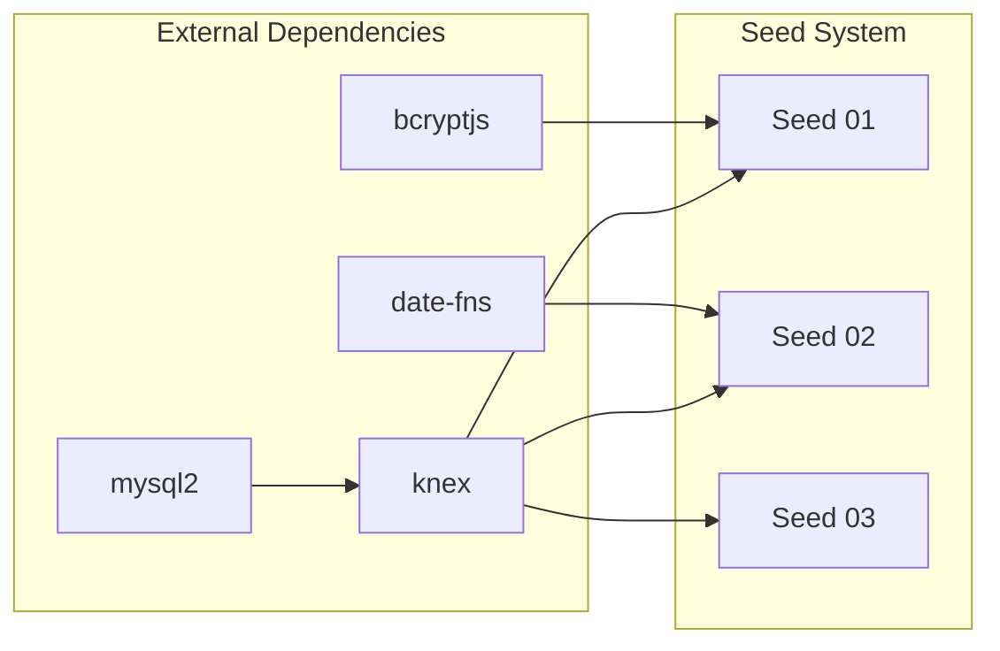

# Seed Data & Initial Configuration

<cite>
**Referenced Files in This Document**
- [01_initial_data.js](file://backend/src/db/seeds/01_initial_data.js)
- [02_sample_data.js](file://backend/src/db/seeds/02_sample_data.js)
- [03_email_templates.js](file://backend/src/db/seeds/03_email_templates.js)
- [knexfile.js](file://backend/knexfile.js)
- [db.js](file://backend/src/config/db.js)
- [run_migrations.js](file://backend/run_migrations.js)
- [20260515064955_add_notifications_and_email_system.js](file://backend/src/db/migrations/20260515064955_add_notifications_and_email_system.js)
- [20260517090000_create_notification_center_tables.js](file://backend/src/db/migrations/20260517090000_create_notification_center_tables.js)
- [emailAutomationController.js](file://backend/src/controllers/emailAutomationController.js)
- [emailAutomation.js](file://backend/src/routes/emailAutomation.js)
- [package.json](file://backend/package.json)
- [README.md](file://README.md)
</cite>

## Table of Contents
1. [Introduction](#introduction)
2. [Project Structure](#project-structure)
3. [Core Components](#core-components)
4. [Architecture Overview](#architecture-overview)
5. [Detailed Component Analysis](#detailed-component-analysis)
6. [Dependency Analysis](#dependency-analysis)
7. [Performance Considerations](#performance-considerations)
8. [Troubleshooting Guide](#troubleshooting-guide)
9. [Conclusion](#conclusion)

## Introduction
This document provides comprehensive documentation for the database seed system used to initialize the NKB Petty Cash Expense Monitoring System. The seed system automates the creation of essential baseline data including users, departments, categories, system settings, and email templates. It serves as the foundation for development environments, testing scenarios, and system demonstrations by providing realistic sample data and pre-configured notification templates.

The seed system consists of three primary seed files that establish the initial state of the application database. These files work in conjunction with the Knex.js migration framework to ensure consistent and reproducible database initialization across different environments.

## Project Structure
The seed system is organized within the backend's database layer, specifically under the `src/db/seeds` directory. The structure follows a chronological numbering convention (01_, 02_, 03_) to define the execution order during database initialization.

**Diagram sources**
- [knexfile.js:1-37](file://backend/knexfile.js#L1-L37)
- [db.js:1-8](file://backend/src/config/db.js#L1-L8)

**Section sources**
- [knexfile.js:1-37](file://backend/knexfile.js#L1-L37)
- [db.js:1-8](file://backend/src/config/db.js#L1-L8)

## Core Components
The seed system comprises three distinct seed files, each serving a specific purpose in establishing the application's baseline data:

### Seed File Organization and Execution Order
The seed files are executed in a predetermined sequence to maintain referential integrity and logical data dependencies:

1. **01_initial_data.js**: Establishes core master data including departments, categories, default administrator account, and system settings
2. **02_sample_data.js**: Generates realistic sample expense records for demonstration and testing
3. **03_email_templates.js**: Creates predefined email templates for various system notification scenarios

### Seed Data Management Architecture
Each seed file implements a standardized structure featuring:
- Complete data cleanup using table deletion
- Bulk insert operations for optimal performance
- Return ID handling for cross-table relationships
- Environment-aware configuration through Knex.js

**Section sources**
- [01_initial_data.js:1-73](file://backend/src/db/seeds/01_initial_data.js#L1-L73)
- [02_sample_data.js:1-56](file://backend/src/db/seeds/02_sample_data.js#L1-L56)
- [03_email_templates.js:1-111](file://backend/src/db/seeds/03_email_templates.js#L1-L111)

## Architecture Overview
The seed system operates within the broader database initialization framework, integrating seamlessly with the migration system and application configuration.

**Diagram sources**
- [package.json:6-12](file://backend/package.json#L6-L12)
- [knexfile.js:16-18](file://backend/knexfile.js#L16-L18)
- [01_initial_data.js:3-72](file://backend/src/db/seeds/01_initial_data.js#L3-L72)

### Seed Data Dependencies and Relationships
The seed system establishes a hierarchical dependency structure that ensures data integrity:

**Diagram sources**
- [01_initial_data.js:13-51](file://backend/src/db/seeds/01_initial_data.js#L13-L51)
- [02_sample_data.js:4-6](file://backend/src/db/seeds/02_sample_data.js#L4-L6)
- [03_email_templates.js:4-109](file://backend/src/db/seeds/03_email_templates.js#L4-L109)

**Section sources**
- [01_initial_data.js:13-51](file://backend/src/db/seeds/01_initial_data.js#L13-L51)
- [02_sample_data.js:4-6](file://backend/src/db/seeds/02_sample_data.js#L4-L6)
- [03_email_templates.js:4-109](file://backend/src/db/seeds/03_email_templates.js#L4-L109)

## Detailed Component Analysis

### Initial Data Seed (01_initial_data.js)
The initial data seed establishes the foundational structure for the application by creating essential master data and system configuration.

#### Department Management
The seed creates 14 standardized departments representing typical organizational structures:
- Core administrative departments (Accounting, HR, Administration)
- Production and operational units (Production, Maintenance, Warehouse)
- Specialized divisions (IT, R&D, Quality Control)
- Support functions (Logistics, Purchasing)

Each department receives a unique identifier that becomes the foreign key reference for user assignments and expense categorization.

#### Category Classification System
The system establishes 18 expense categories covering common business expense types:
- Transportation and logistics (GAS, TRANSPO, TOLL)
- Office supplies and equipment (ICT, LAB, OTHER)
- Utilities and services (MERALCO, BANK, FDA)
- Production-related expenses (PRODUCTION, RAW PAYMENTS)
- Personal and miscellaneous items (PERSONAL, PANTRY)

#### User Account Creation
The seed establishes a default Super Admin account with predefined credentials:
- Username: admin
- Password: admin123 (hashed using bcrypt)
- Role: Super Admin with full system access
- Department assignment: Accounting
- Email: admin@nkbmanufacturing.com

#### System Configuration
The seed initializes essential system settings:
- Company branding and currency configuration
- Theme preferences for user interface
- Expense unit measurements for inventory tracking
- Customizable measurement units for different business contexts

**Section sources**
- [01_initial_data.js:13-71](file://backend/src/db/seeds/01_initial_data.js#L13-L71)

### Sample Data Generator (02_sample_data.js)
The sample data seed generates realistic expense records spanning 60 days to support testing and demonstration scenarios.

#### Data Generation Strategy
The generator employs sophisticated algorithms to create believable expense patterns:
- **Temporal Distribution**: 60-day timeline with random daily expense counts (1-4 per day)
- **Randomized Attributes**: Categories, departments, amounts, and requesters selected randomly
- **Status Distribution**: Recent expenses reflect current workflow states (Pending/Approved/Liquidated)

#### Sample Expense Characteristics
Generated expenses include realistic attributes:
- **Amount Range**: PHP 150-5,150 with logarithmic distribution favoring lower amounts
- **Requester Pool**: 8 representative employees from diverse departments
- **Remark Variability**: Contextual descriptions for different expense types
- **Department Mix**: Balanced representation across all organizational units

#### Conditional Data Loading
The seed implements safety checks to prevent data conflicts:
- Verifies presence of base data before generation
- Skips execution if required master data is missing
- Provides clear logging for successful data injection

**Section sources**
- [02_sample_data.js:3-55](file://backend/src/db/seeds/02_sample_data.js#L3-L55)

### Email Template System (03_email_templates.js)
The email template seed provides comprehensive notification infrastructure supporting the complete expense approval workflow.

#### Template Categories and Purposes
The system includes six specialized email templates covering all major workflow scenarios:

**Administrative Notifications**
- `expense_request_admin`: Alerts administrators to new expense submissions
- `liquidation_approval_request`: Requests approval for high-value liquidations

**Requester Updates**
- `expense_status_update`: Notifies requesters of status changes
- `liquidation_approved_requester`: Confirms approved liquidations
- `liquidation_declined_requester`: Communicates declined requests

**System Alerts**
- `fund_replenished`: Notifies stakeholders of fund additions

#### Template Design and Variables
Each template incorporates dynamic variables for personalized communication:
- **Basic Information**: Amount, requester name, reference numbers
- **Contextual Details**: Department, category, remarks, approver information
- **Action Links**: Secure URLs for system navigation and approvals
- **Visual Styling**: Color-coded themes reflecting status (blue for requests, green for approvals, red for declines)

#### Notification Types and Classification
Templates are categorized by notification type:
- **Approval**: Administrative workflow actions requiring user intervention
- **Expense Status**: Status updates for requester visibility
- **Finance**: Financial system alerts and notifications

**Section sources**
- [03_email_templates.js:4-109](file://backend/src/db/seeds/03_email_templates.js#L4-L109)

## Dependency Analysis
The seed system maintains careful dependency management to ensure data integrity and logical relationships.

### Migration-Seed Integration
The seed system integrates with the migration framework through shared database connections and transaction boundaries. Each seed file operates within the same Knex.js instance, ensuring consistent data handling and rollback capabilities.

### Cross-Seed Dependencies
The seed files establish interdependent relationships:
- **Seed 1** provides foundational data for subsequent seeds
- **Seed 2** depends on master data from Seed 1
- **Seed 3** operates independently but relies on established user and system structure

### External Dependencies
The seed system relies on several external libraries and services:
- **bcryptjs**: Password hashing for secure user credential storage
- **date-fns**: Date manipulation and temporal calculations
- **MySQL2**: Database connectivity and query execution
- **Knex.js**: Database abstraction and migration orchestration

**Diagram sources**
- [01_initial_data.js:1](file://backend/src/db/seeds/01_initial_data.js#L1)
- [02_sample_data.js:1](file://backend/src/db/seeds/02_sample_data.js#L1)
- [knexfile.js:5](file://backend/knexfile.js#L5)

**Section sources**
- [01_initial_data.js:1](file://backend/src/db/seeds/01_initial_data.js#L1)
- [02_sample_data.js:1](file://backend/src/db/seeds/02_sample_data.js#L1)
- [knexfile.js:5](file://backend/knexfile.js#L5)

## Performance Considerations
The seed system implements several performance optimization strategies:

### Bulk Operations
All seed files utilize bulk insert operations to minimize database round trips and improve initialization speed. The initial data seed performs single bulk operations for departments, categories, and settings, while the sample data generator batches 60 days of expense records.

### Memory Efficiency
The sample data generator employs iterative generation with controlled memory usage, avoiding excessive RAM consumption during large-scale data creation. The generator processes data in manageable chunks and writes directly to the database.

### Database Optimization
The seed system leverages database-native operations for optimal performance:
- Bulk insert operations for master data
- Single-table deletions for clean data refresh
- Efficient query patterns for cross-reference resolution

## Troubleshooting Guide

### Common Seed Issues and Solutions

#### Seed Execution Failures
**Problem**: Seed fails during execution
**Solution**: Verify database connectivity and ensure all dependencies are installed. Check the seed file for syntax errors and validate database permissions.

#### Data Integrity Issues
**Problem**: Referential integrity violations during seeding
**Solution**: Ensure seeds are executed in the correct order (01 → 02 → 03). Verify that prerequisite data exists before attempting to create dependent records.

#### Password Hashing Errors
**Problem**: User account creation fails due to password hashing
**Solution**: Confirm bcryptjs is properly installed and the bcrypt hash function is available. Verify the password length meets security requirements.

#### Email Template Issues
**Problem**: Email templates not loading or displaying incorrectly
**Solution**: Check template syntax and validate HTML structure. Ensure all required variables are properly formatted and accessible.

### Seed Data Management Procedures

#### Updating Seed Data
To modify seed data:
1. Edit the relevant seed file in `src/db/seeds/`
2. Run `npm run seed` to apply changes
3. Verify data integrity and relationships
4. Test with sample data generation if applicable

#### Conditional Seeding
The seed system supports conditional execution:
- Seeds check for existing data before insertion
- Dependencies are validated before data generation
- Safety mechanisms prevent duplicate entries

#### Seed Data Validation
After seed execution, validate data integrity:
- Check table counts match expected values
- Verify referential integrity constraints
- Test user authentication with seed credentials
- Validate email template functionality

**Section sources**
- [01_initial_data.js:3-11](file://backend/src/db/seeds/01_initial_data.js#L3-L11)
- [02_sample_data.js:8](file://backend/src/db/seeds/02_sample_data.js#L8)
- [03_email_templates.js:2](file://backend/src/db/seeds/03_email_templates.js#L2)

## Conclusion
The seed data system provides a robust foundation for the NKB Petty Cash Expense Monitoring System, enabling rapid development setup, comprehensive testing, and realistic demonstration scenarios. Through its structured approach to data initialization, the system ensures consistent application state across different environments while maintaining flexibility for customization and extension.

The three-seed architecture effectively balances completeness with maintainability, providing essential baseline data, realistic sample datasets, and comprehensive notification infrastructure. This foundation supports both development workflows and production system initialization, making it an integral component of the application's overall data management strategy.

The seed system's integration with the migration framework and its adherence to dependency management principles ensure reliable and repeatable database initialization processes. As the application evolves, the seed system provides a reliable mechanism for introducing new baseline data while preserving existing configurations and sample datasets.