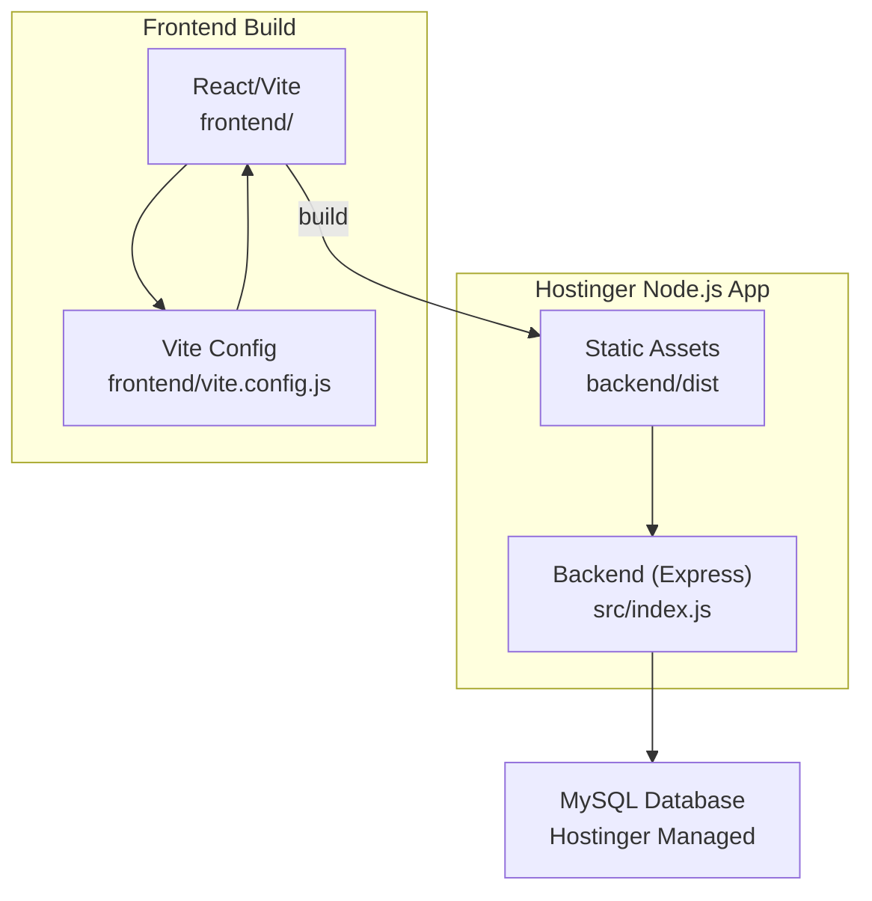
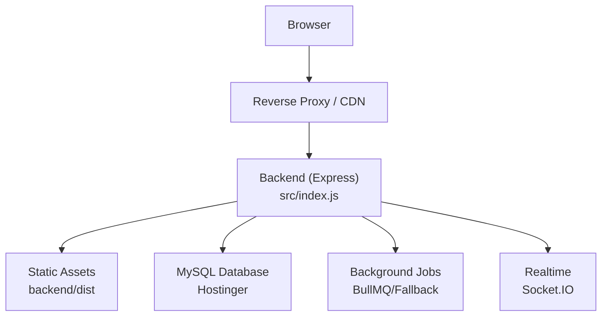
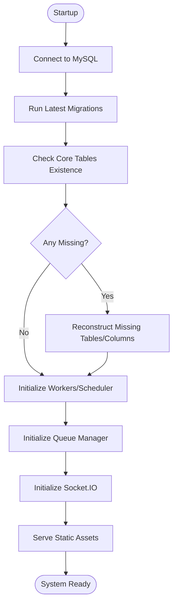
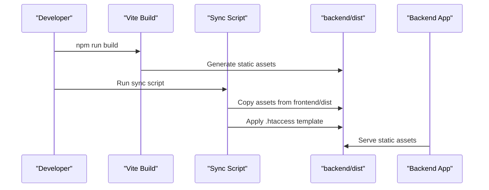
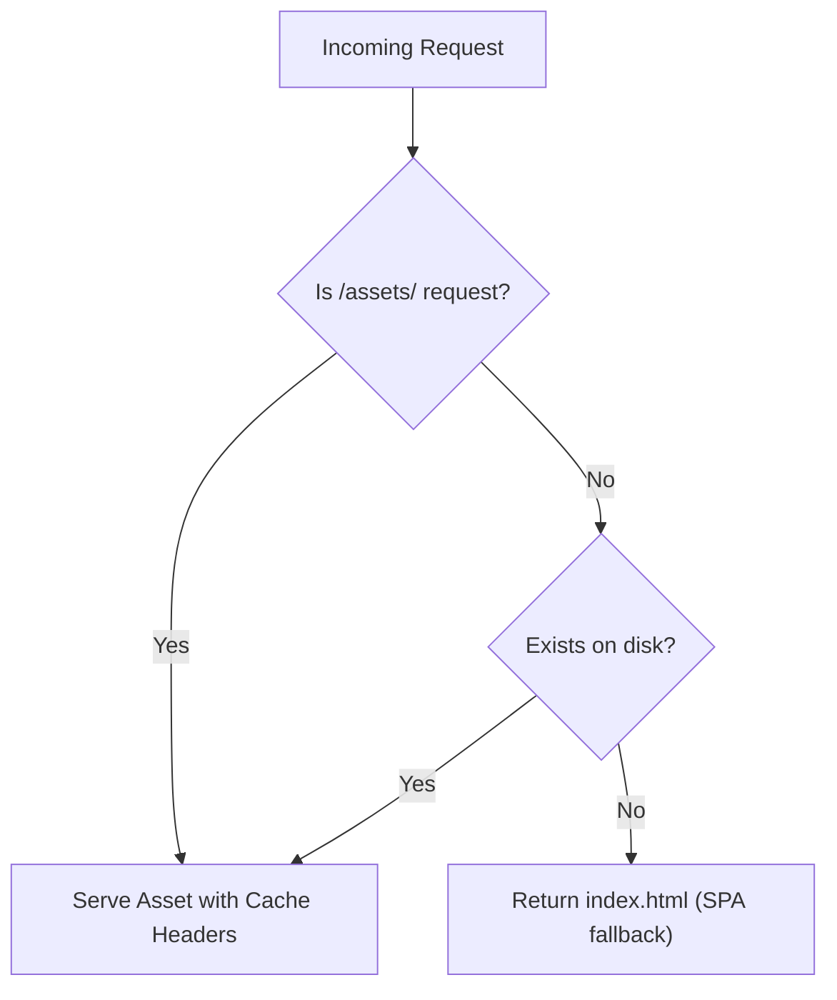
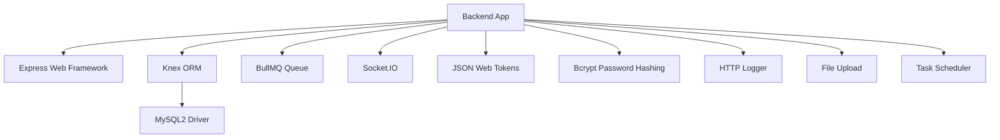

# Deployment Guide

<cite>
**Referenced Files in This Document**
- [deployment_guide.md](file://deployment_guide.md)
- [deployment_progress.md](file://deployment_progress.md)
- [backend/package.json](file://backend/package.json)
- [frontend/package.json](file://frontend/package.json)
- [backend/knexfile.js](file://backend/knexfile.js)
- [backend/index.js](file://backend/index.js)
- [backend/src/index.js](file://backend/src/index.js)
- [backend/run_migrations.js](file://backend/run_migrations.js)
- [backend/scripts/sync-dist.js](file://backend/scripts/sync-dist.js)
- [backend/scripts/htaccess.template](file://backend/scripts/htaccess.template)
- [backend/init_logs.js](file://backend/init_logs.js)
- [frontend/vite.config.js](file://frontend/vite.config.js)
</cite>

## Table of Contents
1. [Introduction](#introduction)
2. [Project Structure](#project-structure)
3. [Core Components](#core-components)
4. [Architecture Overview](#architecture-overview)
5. [Detailed Component Analysis](#detailed-component-analysis)
6. [Dependency Analysis](#dependency-analysis)
7. [Performance Considerations](#performance-considerations)
8. [Troubleshooting Guide](#troubleshooting-guide)
9. [Conclusion](#conclusion)
10. [Appendices](#appendices)

## Introduction
This document provides comprehensive deployment guidance for the NKB Petty Cash System, focusing on production deployment to Hostinger using MySQL. It covers environment preparation, server configuration, database setup, frontend-backend integration, reverse proxy considerations, SSL and security hardening, monitoring and logging, performance optimization, rollback and hotfix procedures, and CI/CD automation strategies.

## Project Structure
The system consists of:
- Backend: Node.js/Express application serving APIs and static frontend assets
- Frontend: React/Vite application built into static assets
- Database: MySQL managed via Hostinger with Knex migrations and seeds
- Build pipeline: Automated sync of frontend dist into backend dist for production

**Diagram sources**
- [backend/src/index.js:184-226](file://backend/src/index.js#L184-L226)
- [frontend/vite.config.js:1-31](file://frontend/vite.config.js#L1-L31)
- [backend/scripts/sync-dist.js:1-41](file://backend/scripts/sync-dist.js#L1-L41)

**Section sources**
- [deployment_guide.md:1-70](file://deployment_guide.md#L1-L70)
- [deployment_progress.md:1-60](file://deployment_progress.md#L1-L60)

## Core Components
- Backend entry point and application bootstrap
  - Entry point wrapper delegates to the actual application
  - Application initializes database, runs migrations, repairs schema, starts workers and scheduler, and serves static assets
- Database configuration and migrations
  - Knex configuration supports development and production environments
  - Migration runner script for targeted execution
- Frontend build and distribution
  - Vite build with deterministic chunk naming for shared hosting compatibility
  - Sync script copies built assets into backend dist and applies Apache directives
- Reverse proxy and static asset serving
  - Static serving with cache headers and MIME type corrections
  - SPA fallback routing with explicit asset exclusion

**Section sources**
- [backend/index.js:1-4](file://backend/index.js#L1-L4)
- [backend/src/index.js:27-149](file://backend/src/index.js#L27-L149)
- [backend/knexfile.js:1-37](file://backend/knexfile.js#L1-L37)
- [backend/run_migrations.js:1-21](file://backend/run_migrations.js#L1-L21)
- [frontend/vite.config.js:1-31](file://frontend/vite.config.js#L1-L31)
- [backend/scripts/sync-dist.js:1-41](file://backend/scripts/sync-dist.js#L1-L41)

## Architecture Overview
The deployment architecture integrates frontend and backend tightly for production delivery. The backend serves both APIs and static assets, while the database is managed externally. The system includes robust schema initialization and repair mechanisms, background job processing, and real-time communication via sockets.

**Diagram sources**
- [backend/src/index.js:12-17](file://backend/src/index.js#L12-L17)
- [backend/src/index.js:184-226](file://backend/src/index.js#L184-L226)
- [backend/src/index.js:237-239](file://backend/src/index.js#L237-L239)

## Detailed Component Analysis

### Database Setup and Management
- Hostinger MySQL provisioning
  - Create database and user with appropriate privileges
  - Use 127.0.0.1 as DB_HOST for stability
- Environment variables
  - NODE_ENV, PORT, DB_HOST, DB_USER, DB_NAME, DB_PASSWORD, JWT_SECRET, JWT_EXPIRE
  - Email automation settings for notifications
- Knex configuration
  - Supports both development and production connections
  - Migration and seed directories defined
- Migration and repair workflow
  - Automatic migrations on startup
  - Schema repair engine checks and reconstructs missing tables/columns
  - Optional dedicated migration runner script for controlled execution

**Diagram sources**
- [backend/src/index.js:31-118](file://backend/src/index.js#L31-L118)
- [backend/run_migrations.js:3-18](file://backend/run_migrations.js#L3-L18)

**Section sources**
- [deployment_guide.md:5-33](file://deployment_guide.md#L5-L33)
- [backend/knexfile.js:1-37](file://backend/knexfile.js#L1-L37)
- [backend/src/index.js:31-118](file://backend/src/index.js#L31-L118)
- [backend/run_migrations.js:1-21](file://backend/run_migrations.js#L1-L21)

### Frontend Build and Distribution
- Build process
  - Vite build generates static assets with deterministic chunk names suitable for shared hosting
  - Base path configured for root serving
- Distribution synchronization
  - Sync script copies frontend/dist to backend/dist
  - Applies Apache .htaccess template for MIME types, compression, and SPA fallback
- Asset caching and MIME types
  - Assets receive long-term caching headers
  - JavaScript and CSS MIME types corrected for ES modules

**Diagram sources**
- [frontend/vite.config.js:18-30](file://frontend/vite.config.js#L18-L30)
- [backend/scripts/sync-dist.js:8-41](file://backend/scripts/sync-dist.js#L8-L41)
- [backend/src/index.js:184-205](file://backend/src/index.js#L184-L205)

**Section sources**
- [deployment_progress.md:35-51](file://deployment_progress.md#L35-L51)
- [frontend/vite.config.js:1-31](file://frontend/vite.config.js#L1-L31)
- [backend/scripts/sync-dist.js:1-41](file://backend/scripts/sync-dist.js#L1-L41)
- [backend/src/index.js:184-205](file://backend/src/index.js#L184-L205)

### Reverse Proxy, SSL, and Security Hardening
- Reverse proxy considerations
  - Force HTTP/1.1 to avoid protocol errors on certain servers
  - Correct MIME types for JavaScript and CSS
- Compression and caching
  - Enable Gzip compression for text-based assets
  - Long-term caching for immutable assets
- SPA fallback
  - Prevent rewriting missing asset requests to index.html
  - Route all other unmatched requests to index.html
- Security hardening
  - Use HTTPS/TLS at the reverse proxy level
  - Enforce secure cookies and HSTS headers at the proxy
  - Restrict file uploads and sanitize attachments
  - Rate limit API endpoints and enforce CORS policies

**Diagram sources**
- [backend/scripts/htaccess.template:25-34](file://backend/scripts/htaccess.template#L25-L34)
- [backend/src/index.js:189-201](file://backend/src/index.js#L189-L201)

**Section sources**
- [backend/scripts/htaccess.template:1-35](file://backend/scripts/htaccess.template#L1-L35)
- [backend/src/index.js:189-201](file://backend/src/index.js#L189-L201)

### Monitoring, Logging, and Performance Optimization
- Health checks
  - Implement /health endpoint for load balancer and monitoring systems
- Logging
  - Morgan access logs for API traffic
  - Structured error logging with stack traces
  - Activity logs table for audit trails
- Performance optimization
  - Static asset caching with immutable headers
  - Gzip compression for text-based assets
  - Efficient database queries and connection pooling
  - Background job queue with retry and dead-letter handling

**Section sources**
- [backend/src/index.js:180-182](file://backend/src/index.js#L180-L182)
- [backend/src/index.js:228-235](file://backend/src/index.js#L228-L235)
- [backend/init_logs.js:1-19](file://backend/init_logs.js#L1-L19)

### Rollback Procedures, Hot Fixes, and Maintenance Windows
- Controlled deployments
  - Use migration runner script for isolated schema changes
  - Maintain application entry point switching during maintenance
- Rollback strategy
  - Keep previous backend/dist artifacts for quick rollback
  - Use database version control with reversible migrations
- Hot fixes
  - Deploy frontend-only changes via sync script
  - Validate with health checks before promoting to production
- Maintenance windows
  - Schedule migrations during low-traffic periods
  - Communicate planned downtime to stakeholders

**Section sources**
- [deployment_guide.md:53-59](file://deployment_guide.md#L53-L59)
- [backend/run_migrations.js:1-21](file://backend/run_migrations.js#L1-L21)

### CI/CD Pipeline Integration and Automated Deployment
- Build automation
  - Automate frontend build and backend packaging
  - Integrate sync script into CI pipeline
- Deployment automation
  - Use Git-based deployment to Hostinger Node.js app
  - Configure environment variables per environment
- Quality gates
  - Run migrations automatically after deployment
  - Execute smoke tests against /health and key API endpoints
- Environment management
  - Separate .env files for development, staging, and production
  - Use secrets management for sensitive configuration

**Section sources**
- [backend/package.json:6-12](file://backend/package.json#L6-L12)
- [deployment_guide.md:44-49](file://deployment_guide.md#L44-L49)

## Dependency Analysis
The backend depends on several key libraries for functionality, security, and performance. Understanding these dependencies is crucial for deployment and maintenance.

**Diagram sources**
- [backend/package.json:17-38](file://backend/package.json#L17-L38)

**Section sources**
- [backend/package.json:1-50](file://backend/package.json#L1-L50)

## Performance Considerations
- Database optimization
  - Use prepared statements and connection pooling
  - Index frequently queried columns (user_id, created_at, status)
  - Monitor slow query logs and optimize accordingly
- Caching strategy
  - Leverage browser caching for static assets
  - Implement server-side caching for expensive API responses
  - Use CDN for global distribution of static content
- Background processing
  - Offload heavy tasks to queue workers
  - Implement retry policies and dead-letter queues
- Real-time features
  - Scale WebSocket connections horizontally
  - Use connection pooling for Socket.IO adapters

## Troubleshooting Guide
Common deployment issues and resolutions:
- 500 Internal Server Error
  - Check stderr.log in application root for runtime errors
  - Verify database connectivity and credentials
- Access Denied (Database)
  - Ensure DB_HOST is 127.0.0.1 and user has proper grants
- Frontend Not Loading
  - Confirm backend/dist exists and contains built assets
  - Verify static asset serving configuration
- ERR_HTTP2_PROTOCOL_ERROR
  - Clear browser cache (Ctrl+F5)
  - Force HTTP/1.1 via .htaccess template
  - Check asset chunking and compression settings

**Section sources**
- [deployment_guide.md:62-67](file://deployment_guide.md#L62-L67)
- [backend/scripts/htaccess.template:1-4](file://backend/scripts/htaccess.template#L1-L4)

## Conclusion
This deployment guide provides a complete blueprint for running the NKB Petty Cash System in production on Hostinger. By following the outlined procedures for environment setup, database management, frontend-backend integration, reverse proxy configuration, security hardening, monitoring, and CI/CD automation, teams can achieve reliable, scalable, and maintainable deployments.

## Appendices
- Environment variable reference
  - NODE_ENV: production
  - PORT: 5000
  - DB_HOST: 127.0.0.1
  - DB_USER, DB_NAME, DB_PASSWORD: Database credentials
  - JWT_SECRET: Secure random string
  - JWT_EXPIRE: Token expiration (e.g., 24h)
  - EMAIL_*: SMTP configuration for notifications
- Database schema overview
  - Core tables: users, departments, categories, funds, expenses, activity_logs
  - Notification system: notifications, notification_preferences, templates
  - Queue fallback: queue_fallback_jobs
- Default admin credentials
  - Username: admin
  - Password: admin123
  - Bcrypt hash: $2b$10$/wk24PG3qrpFLv7lChhrxuFsXrAtW2oML6BDgBYe7LdlPbuTwq2UC