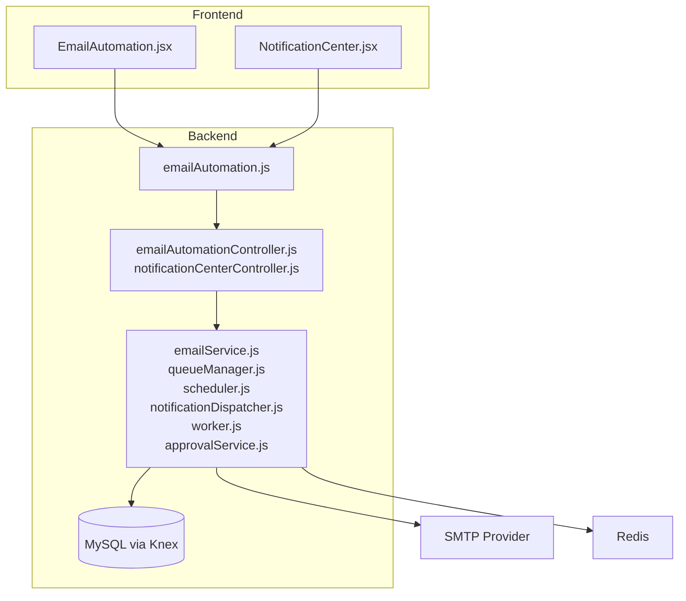
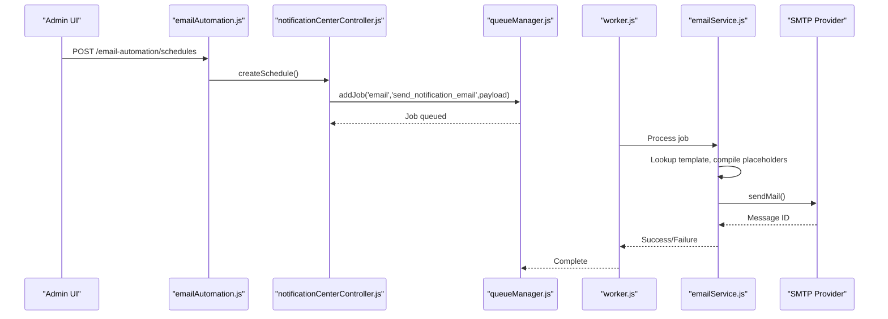
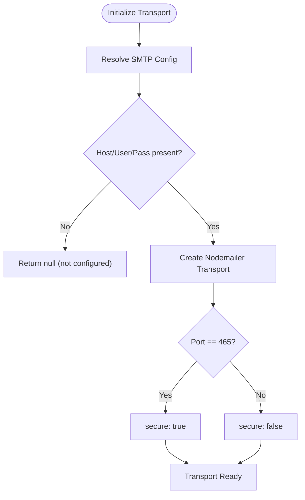
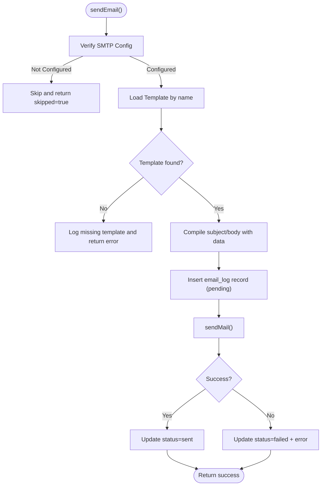
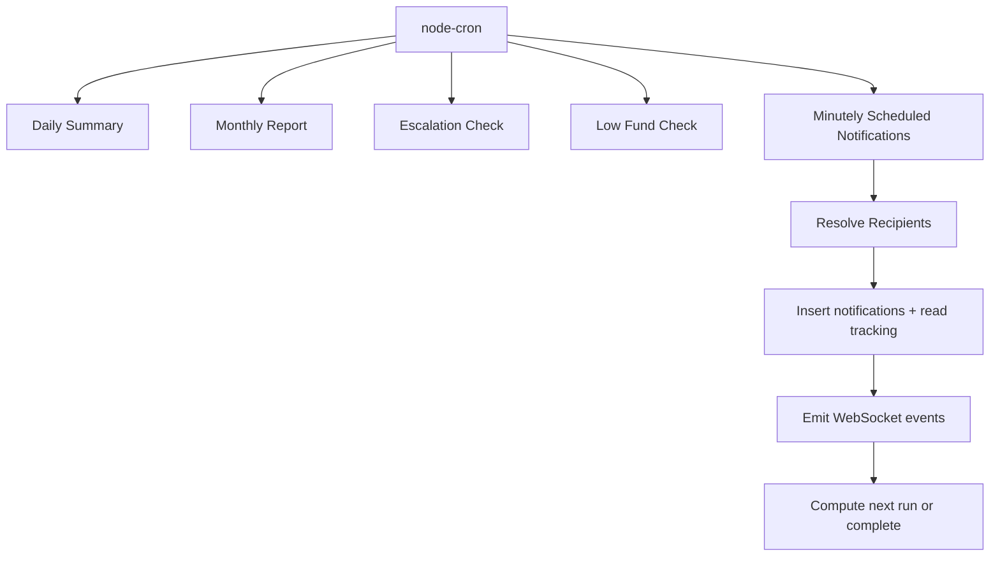
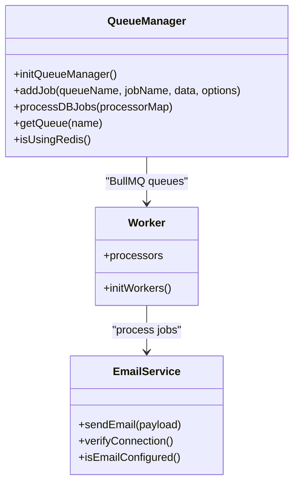
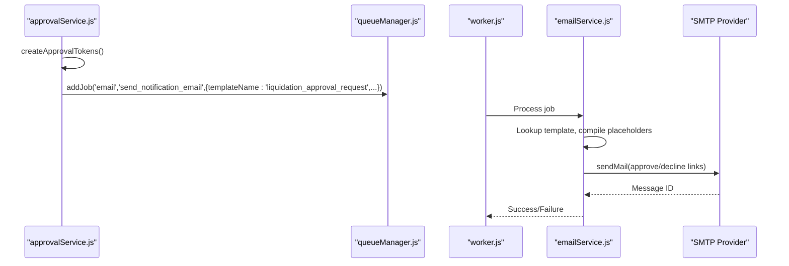
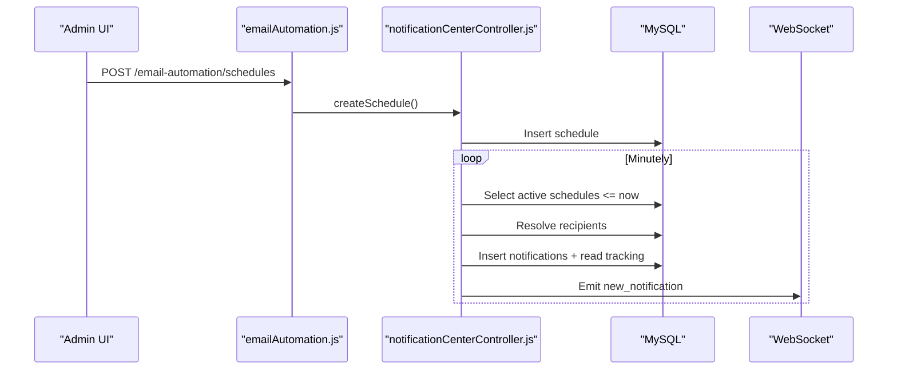
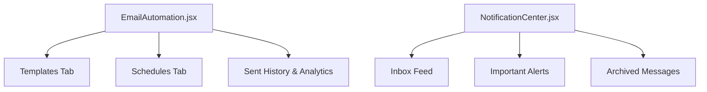
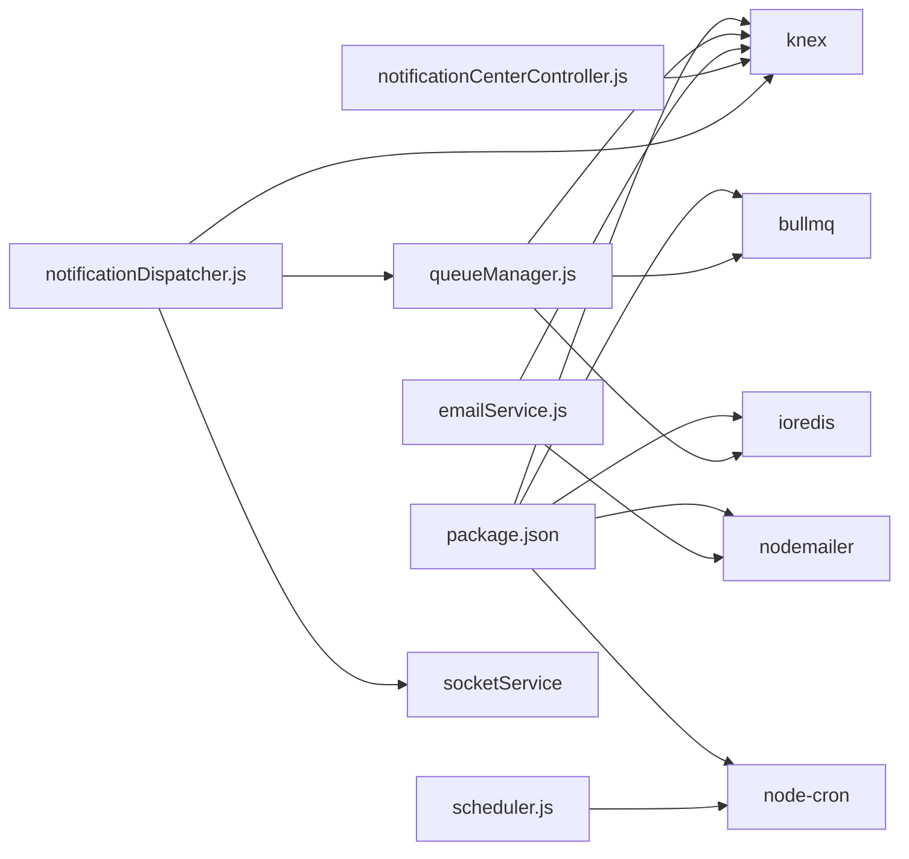

# Email Automation System

<cite>
**Referenced Files in This Document**
- [emailAutomationController.js](file://backend/src/controllers/emailAutomationController.js)
- [emailService.js](file://backend/src/services/emailService.js)
- [queueManager.js](file://backend/src/services/queueManager.js)
- [scheduler.js](file://backend/src/services/scheduler.js)
- [add_notifications_and_email_system.js](file://backend/src/db/migrations/20260515064955_add_notifications_and_email_system.js)
- [03_email_templates.js](file://backend/src/db/seeds/03_email_templates.js)
- [emailAutomation.js](file://backend/src/routes/emailAutomation.js)
- [notificationDispatcher.js](file://backend/src/services/notificationDispatcher.js)
- [notificationCenterController.js](file://backend/src/controllers/notificationCenterController.js)
- [worker.js](file://backend/src/services/worker.js)
- [EmailAutomation.jsx](file://frontend/src/pages/EmailAutomation.jsx)
- [NotificationCenter.jsx](file://frontend/src/components/NotificationCenter.jsx)
- [approvalService.js](file://backend/src/services/approvalService.js)
- [package.json](file://backend/package.json)
</cite>

## Table of Contents
1. [Introduction](#introduction)
2. [Project Structure](#project-structure)
3. [Core Components](#core-components)
4. [Architecture Overview](#architecture-overview)
5. [Detailed Component Analysis](#detailed-component-analysis)
6. [Dependency Analysis](#dependency-analysis)
7. [Performance Considerations](#performance-considerations)
8. [Troubleshooting Guide](#troubleshooting-guide)
9. [Conclusion](#conclusion)
10. [Appendices](#appendices)

## Introduction
This document describes the email automation system for the Petty Cash application. It covers SMTP configuration, template management, automated notification triggers, approval email workflows, scheduling, delivery tracking, queue management, retry mechanisms, error handling, analytics, and compliance considerations. The system integrates with approval workflows and notification centers, supporting robust enterprise-grade communication with real-time tracking and audit capabilities.

## Project Structure
The email automation system spans backend services, database migrations and seeds, controllers, routes, workers, and frontend UI components. The backend leverages BullMQ for queuing, Redis for persistence, and Nodemailer for SMTP transport. Frontend provides dashboards for administrators to manage templates, schedules, and analytics.



**Diagram sources**
- [emailAutomation.js:1-24](file://backend/src/routes/emailAutomation.js#L1-L24)
- [emailAutomationController.js:1-78](file://backend/src/controllers/emailAutomationController.js#L1-L78)
- [notificationCenterController.js:1-370](file://backend/src/controllers/notificationCenterController.js#L1-L370)
- [emailService.js:1-122](file://backend/src/services/emailService.js#L1-L122)
- [queueManager.js:1-126](file://backend/src/services/queueManager.js#L1-L126)
- [scheduler.js:1-155](file://backend/src/services/scheduler.js#L1-L155)
- [worker.js:1-43](file://backend/src/services/worker.js#L1-L43)
- [approvalService.js:252-278](file://backend/src/services/approvalService.js#L252-L278)

**Section sources**
- [emailAutomation.js:1-24](file://backend/src/routes/emailAutomation.js#L1-L24)
- [emailAutomationController.js:1-78](file://backend/src/controllers/emailAutomationController.js#L1-L78)
- [notificationCenterController.js:1-370](file://backend/src/controllers/notificationCenterController.js#L1-L370)
- [emailService.js:1-122](file://backend/src/services/emailService.js#L1-L122)
- [queueManager.js:1-126](file://backend/src/services/queueManager.js#L1-L126)
- [scheduler.js:1-155](file://backend/src/services/scheduler.js#L1-L155)
- [worker.js:1-43](file://backend/src/services/worker.js#L1-L43)
- [approvalService.js:252-278](file://backend/src/services/approvalService.js#L252-L278)

## Core Components
- SMTP Configuration and Transport: Centralized SMTP settings resolution and Nodemailer transport creation with secure defaults based on port.
- Email Template Engine: Template lookup by name, dynamic content insertion using placeholder replacement, and optional attachments.
- Queue Management: BullMQ-backed queues with Redis, plus database fallback for resilience and retry/backoff strategies.
- Scheduler: Cron-based automation for recurring tasks, escalation checks, and notification dispatching.
- Notification Dispatcher: Orchestrates in-app and email notifications based on user preferences and template availability.
- Approval Workflows: Secure approval emails with signed tokens and dedicated templates for liquidation requests.
- Frontend Dashboards: Administrative UI for managing templates, schedules, and analytics.

**Section sources**
- [emailService.js:4-39](file://backend/src/services/emailService.js#L4-L39)
- [queueManager.js:61-85](file://backend/src/services/queueManager.js#L61-L85)
- [scheduler.js:5-40](file://backend/src/services/scheduler.js#L5-L40)
- [notificationDispatcher.js:5-63](file://backend/src/services/notificationDispatcher.js#L5-L63)
- [approvalService.js:252-278](file://backend/src/services/approvalService.js#L252-L278)
- [EmailAutomation.jsx:1-1237](file://frontend/src/pages/EmailAutomation.jsx#L1-L1237)
- [NotificationCenter.jsx:1-183](file://frontend/src/components/NotificationCenter.jsx#L1-L183)

## Architecture Overview
The system follows a layered architecture:
- Presentation Layer: Frontend dashboards for administrators and users.
- API Layer: Express routes delegating to controllers.
- Service Layer: Business logic for email sending, queueing, scheduling, and notification dispatch.
- Persistence Layer: MySQL via Knex with migrations and seeds for templates, logs, schedules, and queues.
- Infrastructure: Redis for queueing, SMTP provider for delivery.



**Diagram sources**
- [emailAutomation.js:15-18](file://backend/src/routes/emailAutomation.js#L15-L18)
- [notificationCenterController.js:255-276](file://backend/src/controllers/notificationCenterController.js#L255-L276)
- [queueManager.js:61-85](file://backend/src/services/queueManager.js#L61-L85)
- [worker.js:22-37](file://backend/src/services/worker.js#L22-L37)
- [emailService.js:41-103](file://backend/src/services/emailService.js#L41-L103)

## Detailed Component Analysis

### SMTP Configuration and Transport
- Environment-driven configuration supports SMTP_HOST/PORT/USER/PASS with fallbacks and secure mode selection based on port.
- Connection verification ensures operational readiness before sending.
- Transport is lazily initialized and reused per process.



**Diagram sources**
- [emailService.js:4-30](file://backend/src/services/emailService.js#L4-L30)

**Section sources**
- [emailService.js:4-30](file://backend/src/services/emailService.js#L4-L30)
- [emailService.js:105-115](file://backend/src/services/emailService.js#L105-L115)

### Email Template System and Dynamic Content
- Templates stored in the database with unique names, subjects, HTML bodies, and types.
- Dynamic content insertion replaces placeholders using a simple regex-based compiler.
- Attachments supported via structured metadata.



**Diagram sources**
- [emailService.js:41-103](file://backend/src/services/emailService.js#L41-L103)
- [add_notifications_and_email_system.js:1-110](file://backend/src/db/migrations/20260515064955_add_notifications_and_email_system.js#L1-L110)

**Section sources**
- [emailService.js:32-39](file://backend/src/services/emailService.js#L32-L39)
- [03_email_templates.js:1-111](file://backend/src/db/seeds/03_email_templates.js#L1-L111)
- [add_notifications_and_email_system.js:1-110](file://backend/src/db/migrations/20260515064955_add_notifications_and_email_system.js#L1-L110)

### Automated Notification Triggers and Scheduling
- Cron-based scheduler runs daily/monthly reports, escalation checks, low fund alerts, and scheduled notifications.
- Scheduled notifications resolve recipients dynamically (all, department, specific users) and persist read tracking.
- Frequency handling supports one-time and recurring dispatches.



**Diagram sources**
- [scheduler.js:5-149](file://backend/src/services/scheduler.js#L5-L149)

**Section sources**
- [scheduler.js:5-149](file://backend/src/services/scheduler.js#L5-L149)
- [notificationCenterController.js:243-286](file://backend/src/controllers/notificationCenterController.js#L243-L286)

### Queue Management, Retry Mechanisms, and Delivery Tracking
- BullMQ queues with exponential backoff and retry attempts when Redis is available.
- Database fallback queue persists jobs when Redis is unavailable, with polling-based processing and exponential backoff.
- Email logs track status transitions, errors, and retry counts for auditing.



**Diagram sources**
- [queueManager.js:1-126](file://backend/src/services/queueManager.js#L1-L126)
- [worker.js:1-43](file://backend/src/services/worker.js#L1-L43)
- [emailService.js:41-103](file://backend/src/services/emailService.js#L41-L103)

**Section sources**
- [queueManager.js:9-126](file://backend/src/services/queueManager.js#L9-L126)
- [worker.js:22-42](file://backend/src/services/worker.js#L22-L42)
- [emailService.js:63-98](file://backend/src/services/emailService.js#L63-L98)

### Approval Email Workflows
- Approval emails generated for liquidation requests with secure approve/decline links.
- Tokens created with expiration and hashed storage; email includes formatted amounts and references.
- Dedicated templates for requester notifications upon approval or decline.



**Diagram sources**
- [approvalService.js:252-278](file://backend/src/services/approvalService.js#L252-L278)
- [queueManager.js:61-85](file://backend/src/services/queueManager.js#L61-L85)
- [worker.js:5-13](file://backend/src/services/worker.js#L5-L13)
- [emailService.js:41-103](file://backend/src/services/emailService.js#L41-L103)

**Section sources**
- [approvalService.js:252-278](file://backend/src/services/approvalService.js#L252-L278)
- [03_email_templates.js:40-94](file://backend/src/db/seeds/03_email_templates.js#L40-L94)

### Notification Scheduling and Delivery Tracking
- Admins configure schedules with recipients type and frequency; system resolves targets and emits real-time updates.
- Read-state tracking maintained per user with sent/read/acknowledged statuses.
- Frontend displays analytics including read rates and per-user timestamps.



**Diagram sources**
- [emailAutomation.js:15-18](file://backend/src/routes/emailAutomation.js#L15-L18)
- [notificationCenterController.js:255-286](file://backend/src/controllers/notificationCenterController.js#L255-L286)
- [scheduler.js:42-147](file://backend/src/services/scheduler.js#L42-L147)

**Section sources**
- [notificationCenterController.js:211-238](file://backend/src/controllers/notificationCenterController.js#L211-L238)
- [scheduler.js:42-147](file://backend/src/services/scheduler.js#L42-L147)
- [EmailAutomation.jsx:529-717](file://frontend/src/pages/EmailAutomation.jsx#L529-L717)

### Frontend Administration and Analytics
- Admin dashboard allows creating, editing, and deleting templates; scheduling notifications; viewing sent history and analytics.
- Real-time notification center with priority badges, read/acknowledge actions, and filtering.



**Diagram sources**
- [EmailAutomation.jsx:1-1237](file://frontend/src/pages/EmailAutomation.jsx#L1-L1237)
- [NotificationCenter.jsx:1-183](file://frontend/src/components/NotificationCenter.jsx#L1-L183)

**Section sources**
- [EmailAutomation.jsx:14-1237](file://frontend/src/pages/EmailAutomation.jsx#L14-L1237)
- [NotificationCenter.jsx:1-183](file://frontend/src/components/NotificationCenter.jsx#L1-L183)

## Dependency Analysis
- External libraries include BullMQ, ioredis, nodemailer, node-cron, and Knex for MySQL.
- Internal dependencies connect controllers to services, services to database, and workers to processors.



**Diagram sources**
- [package.json:17-38](file://backend/package.json#L17-L38)
- [emailService.js:1-2](file://backend/src/services/emailService.js#L1-L2)
- [queueManager.js:1-3](file://backend/src/services/queueManager.js#L1-L3)
- [scheduler.js:1-3](file://backend/src/services/scheduler.js#L1-L3)
- [notificationDispatcher.js:1-3](file://backend/src/services/notificationDispatcher.js#L1-L3)

**Section sources**
- [package.json:17-38](file://backend/package.json#L17-L38)

## Performance Considerations
- Queue Backpressure: BullMQ with Redis provides efficient concurrency; fallback DB queue prevents data loss but processes slower.
- Retry Strategy: Exponential backoff reduces load spikes during transient failures.
- Template Compilation: Regex-based replacement is O(n*m) per key; keep templates concise and limit placeholder count.
- Scheduling Granularity: Minutely scheduler scans active schedules; ensure recipient resolution is efficient and avoid heavy queries.
- SMTP Throttling: Configure provider limits and consider batching to prevent rate limiting.

[No sources needed since this section provides general guidance]

## Troubleshooting Guide
Common issues and resolutions:
- SMTP Not Configured: Verify environment variables and connection verification returns true.
- Template Not Found: Ensure template name matches exactly and is seeded.
- Redis Unavailable: System falls back to DB queue; monitor fallback logs and consider enabling Redis.
- Email Delivery Failures: Check email_logs for error messages and retry attempts.
- Scheduling Delays: Confirm cron expressions and system clock timezone alignment.

**Section sources**
- [emailService.js:41-103](file://backend/src/services/emailService.js#L41-L103)
- [emailService.js:105-115](file://backend/src/services/emailService.js#L105-L115)
- [queueManager.js:9-52](file://backend/src/services/queueManager.js#L9-L52)
- [scheduler.js:42-147](file://backend/src/services/scheduler.js#L42-L147)

## Conclusion
The email automation system provides a robust, scalable foundation for enterprise notifications. It combines configurable templates, resilient queuing, intelligent scheduling, and comprehensive analytics. Integration with approval workflows ensures secure, auditable communications while maintaining high deliverability and compliance readiness.

[No sources needed since this section summarizes without analyzing specific files]

## Appendices

### Database Schema Overview
Key tables for email automation and notifications:
- email_templates: Stores reusable HTML templates with placeholders.
- email_logs: Tracks sent/delivery status, retries, and errors.
- scheduled_emails: Predefined email dispatches with recipients and frequency.
- notification_rules: Event-driven rules linking events to templates and preferences.
- notifications: In-app notifications with read tracking.
- notification_preferences: Per-user preference toggles.
- queue_fallback_jobs: DB-backed job queue when Redis is unavailable.

```mermaid
erDiagram
EMAIL_TEMPLATES {
int id PK
string name UK
string subject
text body
string type
timestamp created_at
timestamp updated_at
}
EMAIL_LOGS {
int id PK
string recipient
string subject
text body
enum status
text error_message
int retry_count
jsonb attachments
timestamp sent_at
timestamp created_at
}
SCHEDULED_EMAILS {
int id PK
int template_id FK
string recipient
timestamp schedule_time
string frequency
jsonb data
enum status
timestamp last_run
timestamp created_at
}
NOTIFICATION_RULES {
int id PK
string event_type
boolean email_enabled
boolean in_app_enabled
int template_id FK
jsonb config
timestamp created_at
}
NOTIFICATIONS {
int id PK
int user_id FK
string title
text message
enum type
boolean is_read
string link
timestamp created_at
}
NOTIFICATION_PREFERENCES {
int id PK
int user_id FK UK
boolean email_enabled
boolean in_app_enabled
timestamp updated_at
}
QUEUE_FALLBACK_JOBS {
int id PK
string queue_name
string job_name
jsonb data
int priority
int attempts
enum status
timestamp next_run_at
timestamp created_at
}
EMAIL_TEMPLATES ||--o{ EMAIL_LOGS : "referenced by"
EMAIL_TEMPLATES ||--o{ SCHEDULED_EMAILS : "referenced by"
EMAIL_TEMPLATES ||--o{ NOTIFICATION_RULES : "referenced by"
```

**Diagram sources**
- [add_notifications_and_email_system.js:1-110](file://backend/src/db/migrations/20260515064955_add_notifications_and_email_system.js#L1-L110)

### Multi-Language Support
- Current templates use hardcoded strings; to enable multi-language, introduce locale-aware template variants and dynamic subject/body selection based on user preferences or request locale.

[No sources needed since this section provides general guidance]

### Security Measures and Deliverability
- Tokenized Approvals: Use hashed tokens with expirations for secure approval links.
- SMTP Hardening: Prefer TLS-enabled connections, strong credentials, and provider-specific authentication.
- Content Security: Sanitize dynamic content and avoid inline scripts; use trusted CDN for attachments.
- Compliance: Implement opt-out mechanisms, retention policies for logs, and audit trails for sensitive approvals.

[No sources needed since this section provides general guidance]