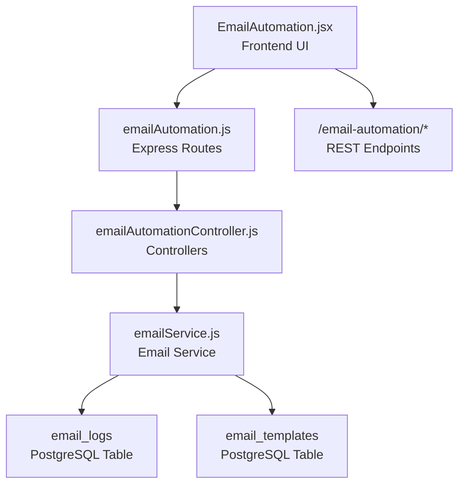
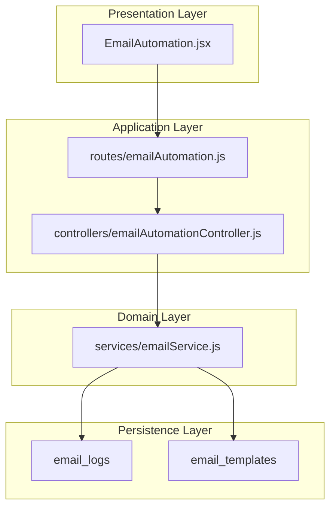
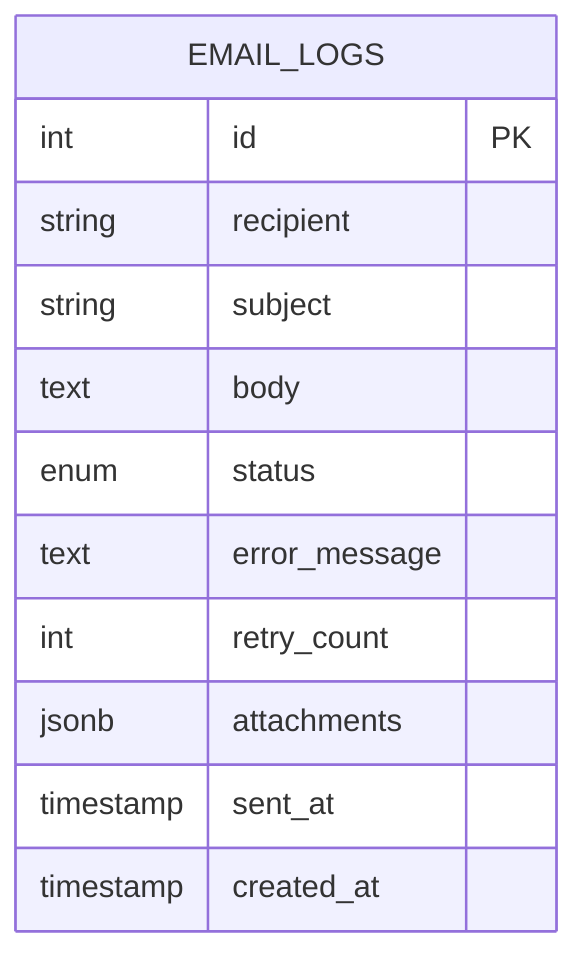
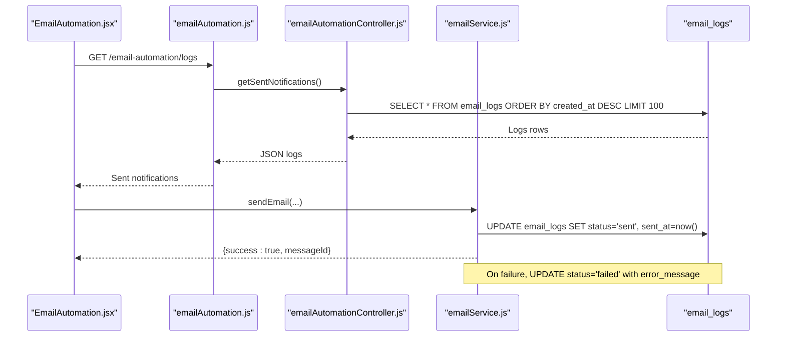
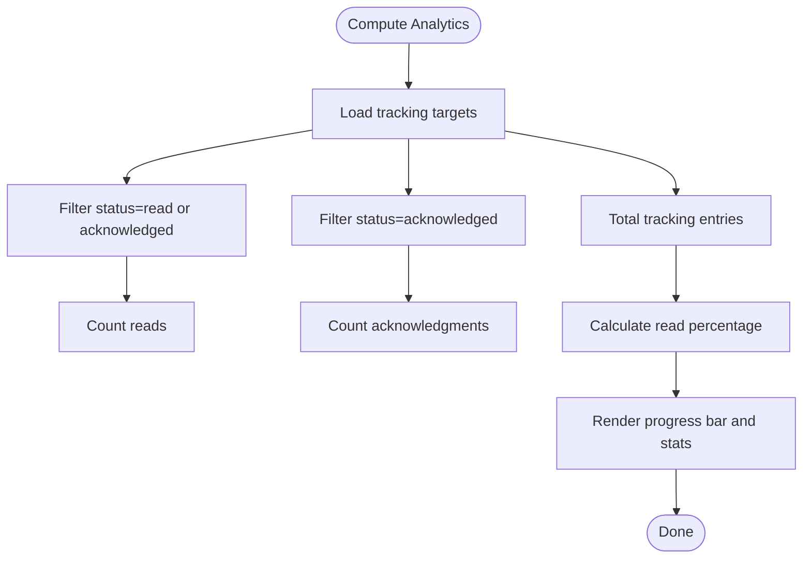
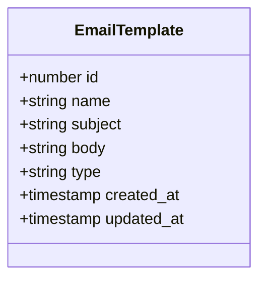
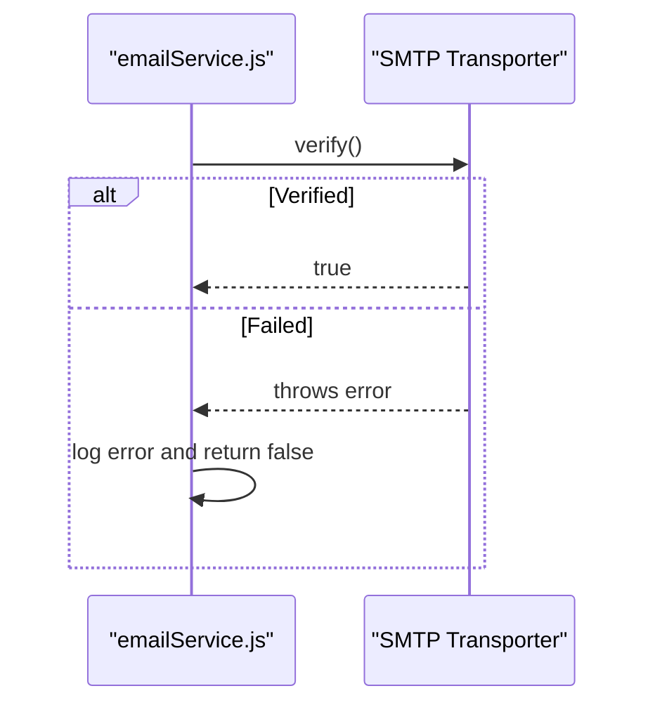
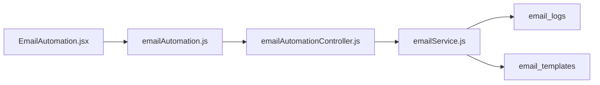

# Email Logging and Analytics

<cite>
**Referenced Files in This Document**
- [emailAutomation.js](file://backend/src/routes/emailAutomation.js)
- [emailAutomationController.js](file://backend/src/controllers/emailAutomationController.js)
- [emailService.js](file://backend/src/services/emailService.js)
- [20260515064955_add_notifications_and_email_system.js](file://backend/src/db/migrations/20260515064955_add_notifications_and_email_system.js)
- [03_email_templates.js](file://backend/src/db/seeds/03_email_templates.js)
- [EmailAutomation.jsx](file://frontend/src/pages/EmailAutomation.jsx)
</cite>

## Table of Contents
1. [Introduction](#introduction)
2. [Project Structure](#project-structure)
3. [Core Components](#core-components)
4. [Architecture Overview](#architecture-overview)
5. [Detailed Component Analysis](#detailed-component-analysis)
6. [Dependency Analysis](#dependency-analysis)
7. [Performance Considerations](#performance-considerations)
8. [Troubleshooting Guide](#troubleshooting-guide)
9. [Conclusion](#conclusion)
10. [Appendices](#appendices)

## Introduction
This document explains the email logging, delivery tracking, and analytics capabilities implemented in the system. It covers the email_log table structure, status tracking lifecycle, error logging mechanisms, delivery analytics, open/bounce handling, and unsubscribe management. It also documents email verification processes, connection health monitoring, delivery failure analysis, and provides query examples for statistics and troubleshooting. Finally, it addresses compliance, GDPR considerations, and data retention policies.

## Project Structure
The email system spans backend routes, controllers, services, database migrations, and frontend UI components:
- Backend routes expose endpoints for templates, schedules, and logs.
- Controllers manage CRUD operations for templates and retrieval of sent notifications.
- Services encapsulate email sending, status updates, and SMTP connection verification.
- Migrations define the email_logs and email_templates tables.
- Frontend provides admin dashboards for monitoring sent notifications and analytics.

**Diagram sources**
- [emailAutomation.js:1-23](file://backend/src/routes/emailAutomation.js#L1-L23)
- [emailAutomationController.js:1-56](file://backend/src/controllers/emailAutomationController.js#L1-L56)
- [emailService.js:84-121](file://backend/src/services/emailService.js#L84-L121)
- [20260515064955_add_notifications_and_email_system.js:15-28](file://backend/src/db/migrations/20260515064955_add_notifications_and_email_system.js#L15-L28)

**Section sources**
- [emailAutomation.js:1-23](file://backend/src/routes/emailAutomation.js#L1-L23)
- [emailAutomationController.js:1-56](file://backend/src/controllers/emailAutomationController.js#L1-L56)
- [emailService.js:84-121](file://backend/src/services/emailService.js#L84-L121)
- [20260515064955_add_notifications_and_email_system.js:1-109](file://backend/src/db/migrations/20260515064955_add_notifications_and_email_system.js#L1-L109)
- [EmailAutomation.jsx:93-261](file://frontend/src/pages/EmailAutomation.jsx#L93-L261)

## Core Components
- Email logging and status tracking via email_logs table with pending, sent, failed, and cancelled statuses.
- Template management for reusable email content via email_templates table.
- Email service orchestrating send operations, status updates, and SMTP verification.
- Frontend dashboard for viewing sent notifications and read-rate analytics.

Key implementation references:
- Status transitions and error logging during send operations.
- Template CRUD endpoints and retrieval of recent logs.
- Frontend fetches sent notifications and computes read percentages.

**Section sources**
- [emailService.js:84-121](file://backend/src/services/emailService.js#L84-L121)
- [emailAutomationController.js:47-56](file://backend/src/controllers/emailAutomationController.js#L47-L56)
- [20260515064955_add_notifications_and_email_system.js:15-28](file://backend/src/db/migrations/20260515064955_add_notifications_and_email_system.js#L15-L28)
- [EmailAutomation.jsx:93-261](file://frontend/src/pages/EmailAutomation.jsx#L93-L261)

## Architecture Overview
The email system follows a layered architecture:
- Presentation: EmailAutomation.jsx renders analytics and interacts with backend APIs.
- Application: Routes and controllers handle requests for templates, schedules, and logs.
- Domain: Email service manages sending, status updates, and connection verification.
- Persistence: PostgreSQL tables store logs and templates.

**Diagram sources**
- [emailAutomation.js:1-23](file://backend/src/routes/emailAutomation.js#L1-L23)
- [emailAutomationController.js:1-56](file://backend/src/controllers/emailAutomationController.js#L1-L56)
- [emailService.js:84-121](file://backend/src/services/emailService.js#L84-L121)
- [20260515064955_add_notifications_and_email_system.js:15-28](file://backend/src/db/migrations/20260515064955_add_notifications_and_email_system.js#L15-L28)

## Detailed Component Analysis

### Email Log Table Structure
The email_logs table captures essential metadata for each email transaction:
- Primary key id
- Recipient email address
- Subject and body
- Status enum with values pending, sent, failed, cancelled
- Optional error_message for failures
- retry_count for retry attempts
- attachments stored as JSONB
- sent_at timestamp upon successful delivery
- created_at timestamp for record creation

Status tracking lifecycle:
- Initial state: pending
- On successful send: status becomes sent, sent_at populated
- On send failure: status becomes failed, error_message recorded
- Cancelled state indicates intentional cancellation

**Diagram sources**
- [20260515064955_add_notifications_and_email_system.js:15-28](file://backend/src/db/migrations/20260515064955_add_notifications_and_email_system.js#L15-L28)

**Section sources**
- [20260515064955_add_notifications_and_email_system.js:15-28](file://backend/src/db/migrations/20260515064955_add_notifications_and_email_system.js#L15-L28)

### Email Sending and Status Updates
The email service performs the following actions:
- Send emails and update status to sent upon success.
- Capture errors and update status to failed with error_message.
- Verify SMTP connectivity to monitor connection health.

**Diagram sources**
- [emailAutomation.js:20-21](file://backend/src/routes/emailAutomation.js#L20-L21)
- [emailAutomationController.js:47-56](file://backend/src/controllers/emailAutomationController.js#L47-L56)
- [emailService.js:84-121](file://backend/src/services/emailService.js#L84-L121)

**Section sources**
- [emailService.js:84-121](file://backend/src/services/emailService.js#L84-L121)
- [emailAutomationController.js:47-56](file://backend/src/controllers/emailAutomationController.js#L47-L56)

### Delivery Analytics and Open Rates
The frontend calculates read rate and acknowledgment metrics from tracking data:
- Reads: count of entries with status read or acknowledged
- Acknowledgments: count of entries with status acknowledged
- Read percentage computed as reads divided by total tracked recipients

**Diagram sources**
- [EmailAutomation.jsx:596-610](file://frontend/src/pages/EmailAutomation.jsx#L596-L610)

**Section sources**
- [EmailAutomation.jsx:596-610](file://frontend/src/pages/EmailAutomation.jsx#L596-L610)

### Email Templates Management
Templates support reusable email content with placeholders:
- Fields: name, subject, body (HTML), type
- Operations: list, create, update, delete
- Seeded templates demonstrate approval and status update scenarios

**Diagram sources**
- [20260515064955_add_notifications_and_email_system.js:2-12](file://backend/src/db/migrations/20260515064955_add_notifications_and_email_system.js#L2-L12)
- [03_email_templates.js:1-28](file://backend/src/db/seeds/03_email_templates.js#L1-L28)

**Section sources**
- [emailAutomationController.js:3-44](file://backend/src/controllers/emailAutomationController.js#L3-L44)
- [20260515064955_add_notifications_and_email_system.js:2-12](file://backend/src/db/migrations/20260515064955_add_notifications_and_email_system.js#L2-L12)
- [03_email_templates.js:1-28](file://backend/src/db/seeds/03_email_templates.js#L1-L28)

### Connection Health Monitoring
SMTP verification ensures the email transport is reachable:
- verifyConnection attempts to verify the configured transporter
- Returns true on success, false on failure
- Errors are logged for diagnostics

**Diagram sources**
- [emailService.js:105-115](file://backend/src/services/emailService.js#L105-L115)

**Section sources**
- [emailService.js:105-115](file://backend/src/services/emailService.js#L105-L115)

### Unsubscribe Management
The current implementation does not include explicit unsubscribe handling. To implement unsubscribe:
- Add an unsubscribe link in email bodies that points to a backend endpoint.
- Track unsubscribed recipients in a dedicated table or flag within users.
- Honor opt-out requests by preventing further marketing emails to those addresses.

[No sources needed since this section provides implementation guidance]

### Bounce Handling
The current implementation does not include inbound bounce processing. To implement bounce handling:
- Configure an inbound email address for bounces.
- Parse bounce notifications and update recipient status accordingly.
- Maintain a bounce log table with reasons and timestamps.

[No sources needed since this section provides implementation guidance]

## Dependency Analysis
The email system exhibits clear separation of concerns:
- Routes depend on controllers for request handling.
- Controllers depend on the database layer via Knex.
- Services encapsulate business logic and external integrations (SMTP).
- Frontend depends on backend REST endpoints for data.

**Diagram sources**
- [emailAutomation.js:1-23](file://backend/src/routes/emailAutomation.js#L1-L23)
- [emailAutomationController.js:1-56](file://backend/src/controllers/emailAutomationController.js#L1-L56)
- [emailService.js:84-121](file://backend/src/services/emailService.js#L84-L121)
- [20260515064955_add_notifications_and_email_system.js:15-28](file://backend/src/db/migrations/20260515064955_add_notifications_and_email_system.js#L15-L28)

**Section sources**
- [emailAutomation.js:1-23](file://backend/src/routes/emailAutomation.js#L1-L23)
- [emailAutomationController.js:1-56](file://backend/src/controllers/emailAutomationController.js#L1-L56)
- [emailService.js:84-121](file://backend/src/services/emailService.js#L84-L121)

## Performance Considerations
- Limit log retrieval to recent entries (as implemented) to avoid heavy queries.
- Index email_logs by status and created_at for efficient filtering and sorting.
- Batch processing for scheduled emails to reduce peak load.
- Asynchronous sending with retry logic to improve throughput and resilience.

[No sources needed since this section provides general guidance]

## Troubleshooting Guide
Common issues and resolutions:
- SMTP connection failures: Use verifyConnection to check transport availability and review logs for detailed error messages.
- Send failures: Inspect email_logs for failed records with error_message populated.
- Slow analytics rendering: Ensure frontend pagination and limit queries to recent logs.
- Template mismatches: Validate placeholder usage against template seeds and ensure correct type mapping.

Query examples for statistics and troubleshooting:
- Recent sent emails:
  - SELECT * FROM email_logs WHERE status='sent' ORDER BY created_at DESC LIMIT 100;
- Failed deliveries:
  - SELECT recipient, subject, error_message, created_at FROM email_logs WHERE status='failed' ORDER BY created_at DESC;
- Delivery rate by day:
  - SELECT DATE(created_at) AS date, COUNT(*) AS total, SUM(CASE WHEN status='sent' THEN 1 ELSE 0 END) AS delivered FROM email_logs GROUP BY DATE(created_at);
- Unsubscribe tracking (conceptual):
  - SELECT u.email, u.unsubscribe_date FROM users u WHERE u.is_unsubscribed=true;

**Section sources**
- [emailService.js:105-115](file://backend/src/services/emailService.js#L105-L115)
- [emailAutomationController.js:47-56](file://backend/src/controllers/emailAutomationController.js#L47-L56)
- [20260515064955_add_notifications_and_email_system.js:15-28](file://backend/src/db/migrations/20260515064955_add_notifications_and_email_system.js#L15-L28)

## Conclusion
The system provides robust email logging, status tracking, and basic analytics for delivered notifications. It supports template management, SMTP verification, and a frontend dashboard for monitoring. Enhancements for bounce handling, unsubscribe management, and advanced analytics would further strengthen the platform’s email capabilities while maintaining compliance and performance.

## Appendices

### Compliance, GDPR, and Data Retention
- Data minimization: Store only necessary fields in email_logs and templates.
- Consent and transparency: Include privacy notices and opt-out links in emails.
- Right to erasure: Implement deletion procedures for user data upon request.
- Data retention: Define policy for purging old email_logs after a retention period (e.g., 90–180 days) with automatic cleanup jobs.
- Security: Encrypt sensitive fields if required and restrict access to logs.

[No sources needed since this section provides general guidance]