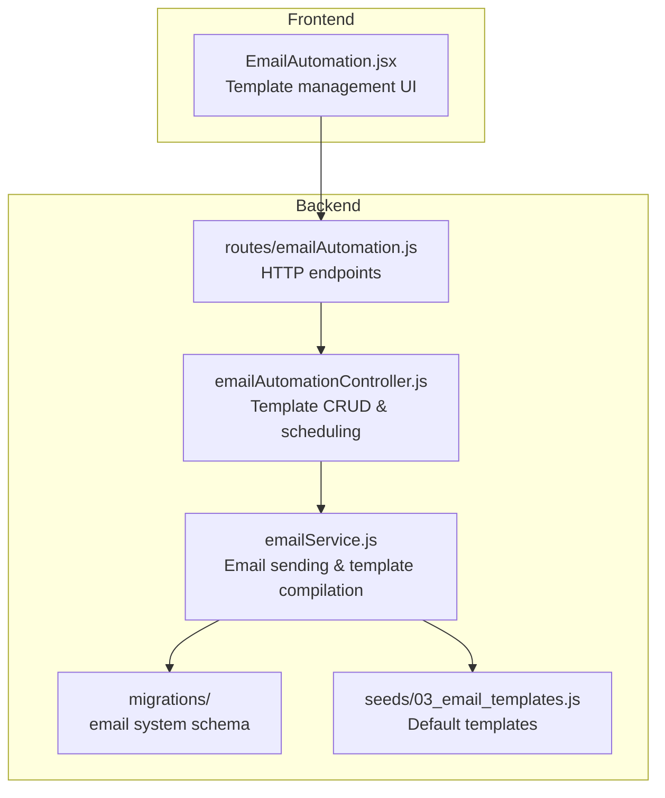
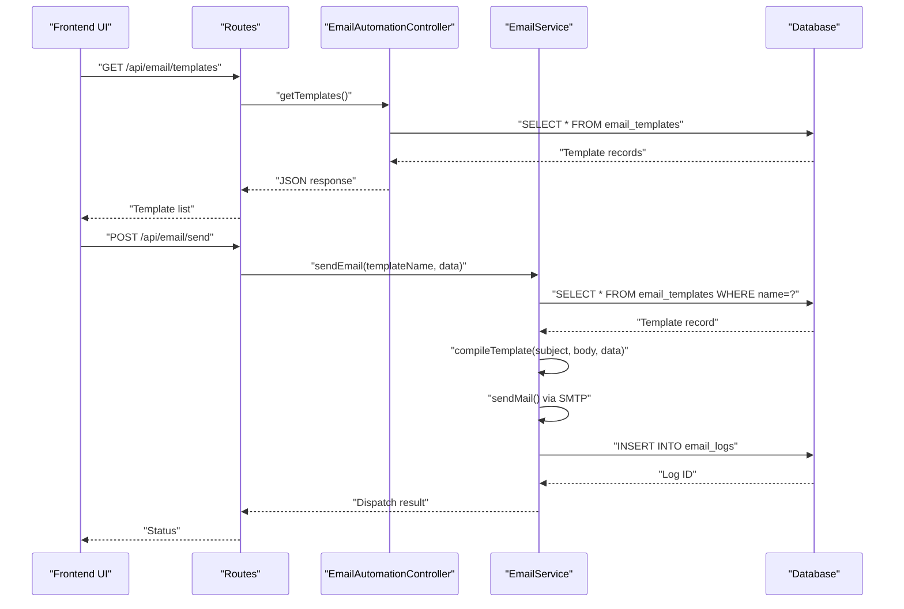
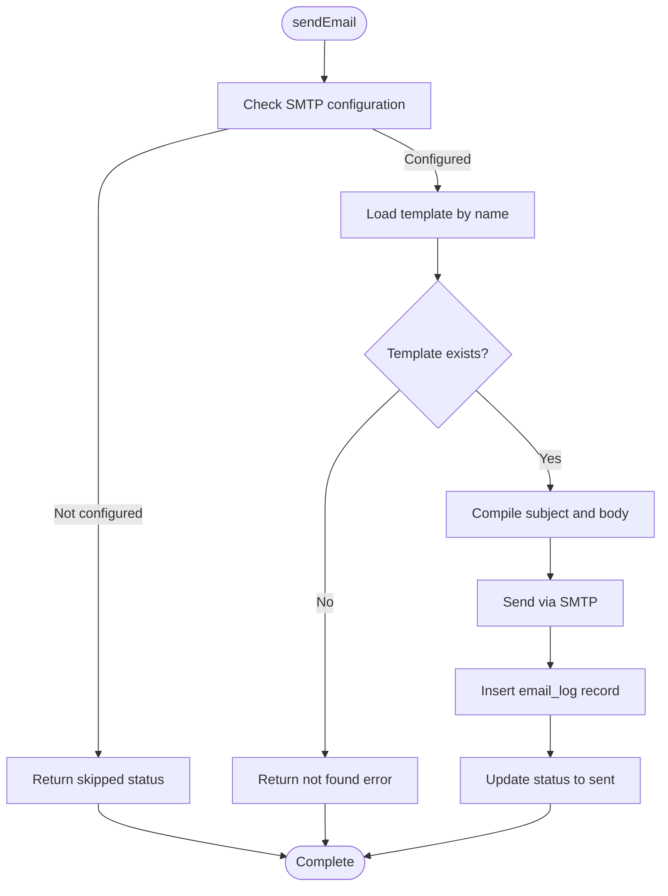
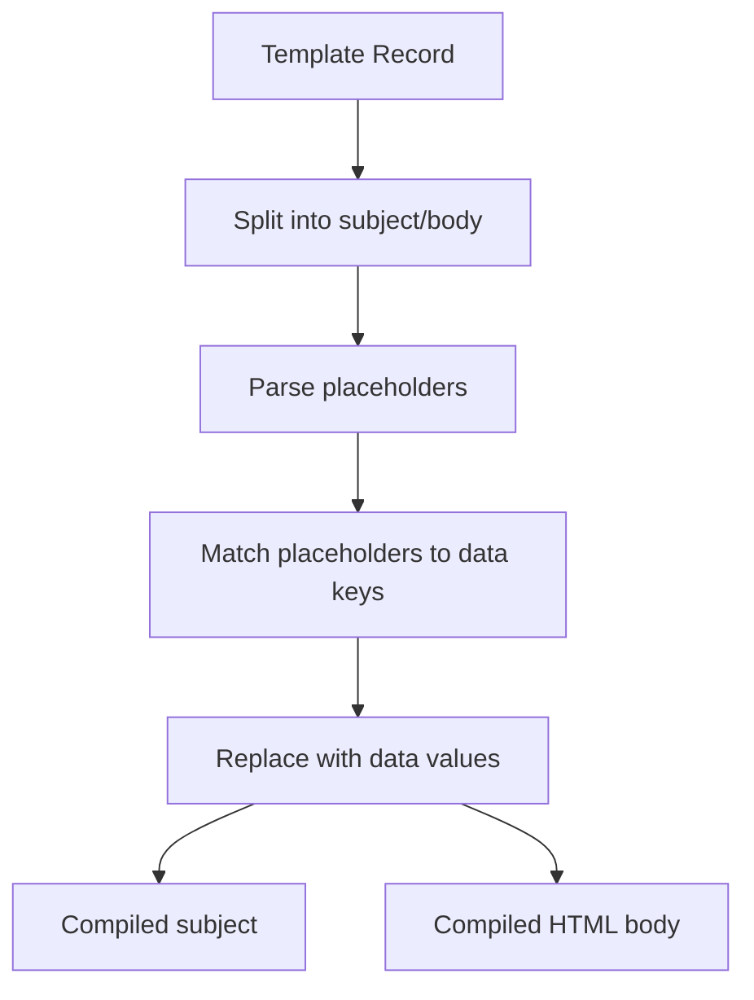

# Email Template System

<cite>
**Referenced Files in This Document**
- [emailService.js](file://backend/src/services/emailService.js)
- [emailAutomationController.js](file://backend/src/controllers/emailAutomationController.js)
- [emailAutomation.js](file://backend/src/routes/emailAutomation.js)
- [03_email_templates.js](file://backend/src/db/seeds/03_email_templates.js)
- [20260515064955_add_notifications_and_email_system.js](file://backend/src/db/migrations/20260515064955_add_notifications_and_email_system.js)
- [EmailAutomation.jsx](file://frontend/src/pages/EmailAutomation.jsx)
</cite>

## Table of Contents
1. [Introduction](#introduction)
2. [Project Structure](#project-structure)
3. [Core Components](#core-components)
4. [Architecture Overview](#architecture-overview)
5. [Detailed Component Analysis](#detailed-component-analysis)
6. [Template Management](#template-management)
7. [Template Compilation and Data Binding](#template-compilation-and-data-binding)
8. [Template Seed System](#template-seed-system)
9. [Template Naming Conventions](#template-naming-conventions)
10. [HTML Structure Requirements](#html-structure-requirements)
11. [Variable Substitution Syntax](#variable-substitution-syntax)
12. [Conditional Content Rendering](#conditional-content-rendering)
13. [Template Versioning](#template-versioning)
14. [Testing Procedures](#testing-procedures)
15. [Preview Functionality](#preview-functionality)
16. [Examples](#examples)
17. [Troubleshooting Guide](#troubleshooting-guide)
18. [Conclusion](#conclusion)

## Introduction
This document provides comprehensive documentation for the email template system, covering template structure, dynamic content insertion, template management, and operational workflows. It explains how templates are stored, compiled, and rendered, along with naming conventions, HTML requirements, variable substitution syntax, and practical examples for approval requests, notifications, and system-generated emails.

## Project Structure
The email template system spans backend services, database schema, seed data, and a frontend management interface:

**Diagram sources**
- [emailService.js](file://backend/src/services/emailService.js)
- [emailAutomationController.js](file://backend/src/controllers/emailAutomationController.js)
- [emailAutomation.js](file://backend/src/routes/emailAutomation.js)
- [03_email_templates.js](file://backend/src/db/seeds/03_email_templates.js)
- [20260515064955_add_notifications_and_email_system.js](file://backend/src/db/migrations/20260515064955_add_notifications_and_email_system.js)
- [EmailAutomation.jsx](file://frontend/src/pages/EmailAutomation.jsx)

**Section sources**
- [emailService.js](file://backend/src/services/emailService.js)
- [emailAutomationController.js](file://backend/src/controllers/emailAutomationController.js)
- [emailAutomation.js](file://backend/src/routes/emailAutomation.js)
- [03_email_templates.js](file://backend/src/db/seeds/03_email_templates.js)
- [20260515064955_add_notifications_and_email_system.js](file://backend/src/db/migrations/20260515064955_add_notifications_and_email_system.js)
- [EmailAutomation.jsx](file://frontend/src/pages/EmailAutomation.jsx)

## Core Components
- Email Service: Handles SMTP transport configuration, template retrieval, compilation, and dispatch with logging.
- Email Automation Controller: Manages template CRUD operations and scheduled email queries.
- Routes: Exposes REST endpoints for template management and email scheduling.
- Database Schema: Defines email_templates, email_logs, and scheduled_emails tables.
- Seed Data: Provides default templates for system workflows.
- Frontend Management: Offers UI for editing subjects and bodies of templates.

Key responsibilities:
- Template storage and retrieval
- Dynamic variable substitution
- Email logging and status tracking
- Scheduled email orchestration

**Section sources**
- [emailService.js](file://backend/src/services/emailService.js)
- [emailAutomationController.js](file://backend/src/controllers/emailAutomationController.js)
- [emailAutomation.js](file://backend/src/routes/emailAutomation.js)
- [03_email_templates.js](file://backend/src/db/seeds/03_email_templates.js)
- [20260515064955_add_notifications_and_email_system.js](file://backend/src/db/migrations/20260515064955_add_notifications_and_email_system.js)
- [EmailAutomation.jsx](file://frontend/src/pages/EmailAutomation.jsx)

## Architecture Overview
The system follows a layered architecture with clear separation of concerns:

**Diagram sources**
- [emailAutomation.js](file://backend/src/routes/emailAutomation.js)
- [emailAutomationController.js](file://backend/src/controllers/emailAutomationController.js)
- [emailService.js](file://backend/src/services/emailService.js)

## Detailed Component Analysis

### Email Service
Responsibilities:
- Retrieve template by name
- Compile subject and body using provided data
- Send email via configured SMTP transport
- Log email dispatch with status tracking

Processing logic:
- Validates SMTP configuration
- Retrieves template from database
- Compiles subject and body using template engine
- Sends email and updates log status

**Diagram sources**
- [emailService.js](file://backend/src/services/emailService.js)

**Section sources**
- [emailService.js](file://backend/src/services/emailService.js)

### Email Automation Controller
Endpoints:
- GET /api/email/templates: List all templates
- POST /api/email/templates: Create new template
- PUT /api/email/templates/:id: Update existing template
- GET /api/email/logs: View email dispatch logs
- GET /api/email/scheduled: List scheduled emails joined with template names

Operational behavior:
- Performs database queries for templates and logs
- Joins scheduled_emails with email_templates for display

**Section sources**
- [emailAutomationController.js](file://backend/src/controllers/emailAutomationController.js)

### Routes
Defines REST endpoints for email automation:
- Template management endpoints
- Email logging and scheduling endpoints

Integration:
- Delegates to controller methods
- Returns structured JSON responses

**Section sources**
- [emailAutomation.js](file://backend/src/routes/emailAutomation.js)

### Frontend Template Management
The frontend page exposes:
- Default subject line input bound to template form
- Default message body textarea bound to template form
- Form controls for editing template content

Usage:
- Enables administrators to modify template subjects and bodies
- Integrates with backend endpoints for persistence

**Section sources**
- [EmailAutomation.jsx](file://frontend/src/pages/EmailAutomation.jsx)

## Template Management
Template lifecycle:
- Creation: Templates are inserted into the email_templates table with name, subject, body, and type.
- Retrieval: Templates are fetched by name for compilation and dispatch.
- Updates: Templates can be modified via the management UI and persisted to the database.
- Deletion: Not exposed in current controller; consider adding for maintenance.

Storage schema:
- email_templates: Stores template metadata and content
- email_logs: Tracks dispatched emails with status and timestamps
- scheduled_emails: Supports future dispatch coordination

**Section sources**
- [emailAutomationController.js](file://backend/src/controllers/emailAutomationController.js)
- [20260515064955_add_notifications_and_email_system.js](file://backend/src/db/migrations/20260515064955_add_notifications_and_email_system.js)

## Template Compilation and Data Binding
Compilation process:
- Template subject and body are compiled independently
- Variables are substituted using a template engine
- Compiled content is used for email subject and HTML body

Data binding:
- Provided data object supplies values for placeholders
- Placeholders are replaced with corresponding data values
- Escaping and sanitization should be considered during engine implementation

**Diagram sources**
- [emailService.js](file://backend/src/services/emailService.js)

**Section sources**
- [emailService.js](file://backend/src/services/emailService.js)

## Template Seed System
Default templates:
- expense_request_admin: Used for notifying admins about new petty cash requests
- expense_status_update: Used for notifying requesters about status changes

Seed data structure:
- name: Unique identifier for the template
- subject: Template subject with placeholders
- body: HTML template with placeholders
- type: Categorization (e.g., approval)

Customization:
- Modify seed values to adjust default messages
- Add new templates via seeds or admin UI

**Section sources**
- [03_email_templates.js](file://backend/src/db/seeds/03_email_templates.js)

## Template Naming Conventions
Recommended naming pattern:
- Descriptive and lowercase with underscores
- Includes functional context (e.g., expense_request_admin)
- Avoid spaces and special characters
- Group related templates by domain (approval, notification, system)

Benefits:
- Predictable lookup by name
- Easy identification and maintenance

**Section sources**
- [03_email_templates.js](file://backend/src/db/seeds/03_email_templates.js)

## HTML Structure Requirements
Template body requirements:
- Valid HTML structure
- Inline styles for broad client compatibility
- Accessible markup with semantic elements where appropriate
- Proper anchor tags for action links

Best practices:
- Use div containers for layout
- Apply inline colors and fonts
- Ensure responsive-friendly widths
- Include unsubscribe or informational footers as needed

**Section sources**
- [03_email_templates.js](file://backend/src/db/seeds/03_email_templates.js)

## Variable Substitution Syntax
Placeholder syntax:
- Enclosed in double curly braces: {{key}}
- Keys correspond to data object properties
- Supports nested keys if engine supports dot notation

Examples of placeholders present in default templates:
- requested_by, amount, remarks, link, status

Validation:
- Ensure all referenced keys exist in the data object
- Handle missing keys gracefully (empty string or placeholder)

**Section sources**
- [03_email_templates.js](file://backend/src/db/seeds/03_email_templates.js)
- [emailService.js](file://backend/src/services/emailService.js)

## Conditional Content Rendering
Current implementation:
- Templates are static with placeholders
- No built-in conditional logic in the provided code

Recommendations:
- Extend template engine to support conditionals and loops
- Use engine directives for conditional blocks
- Maintain backward compatibility with existing templates

[No sources needed since this section provides recommendations based on current implementation gaps]

## Template Versioning
Current state:
- No explicit version field in schema
- No migration strategy for template changes

Proposed approach:
- Add version column to email_templates
- Implement migration procedure for template updates
- Maintain backward compatibility during transitions

[No sources needed since this section proposes enhancements]

## Testing Procedures
Recommended testing steps:
- Unit tests for template compilation with various data sets
- Integration tests for sendEmail flow with mocked SMTP
- End-to-end tests for template management UI
- Load tests for bulk email dispatch scenarios

Validation criteria:
- Correct placeholder replacement
- HTML validity and rendering
- Email log creation and status updates
- Error handling for missing templates and SMTP failures

[No sources needed since this section provides general testing guidance]

## Preview Functionality
Available capabilities:
- Frontend allows editing of subject and body
- No dedicated preview endpoint in current controller

Enhancement ideas:
- Add preview endpoint returning compiled HTML
- Implement live preview in management UI
- Support test recipients for preview emails

[No sources needed since this section suggests improvements]

## Examples

### Approval Request Template
Purpose:
- Notify administrators about new petty cash requests requiring approval

Template characteristics:
- Subject includes requester and amount
- Body contains requester details, amount, remarks, and action link
- Type: approval

Usage scenario:
- Triggered when a new expense request is created
- Sends to admin recipients

**Section sources**
- [03_email_templates.js](file://backend/src/db/seeds/03_email_templates.js)

### Status Update Template
Purpose:
- Inform requesters about approval decisions or status changes

Template characteristics:
- Subject reflects current status
- Body communicates outcome and next steps

Usage scenario:
- Triggered upon approval or rejection actions

**Section sources**
- [03_email_templates.js](file://backend/src/db/seeds/03_email_templates.js)

### System-Generated Notification Template
Purpose:
- General system notifications to users

Template characteristics:
- Subject indicates notification topic
- Body provides details and links

Usage scenario:
- Administrative alerts or system events

[No sources needed since this example is conceptual]

## Troubleshooting Guide
Common issues and resolutions:
- Template not found: Verify template name matches exactly
- SMTP not configured: Check environment variables and transport settings
- Missing data keys: Ensure all placeholders have corresponding data values
- Email logging errors: Review email_logs table for failed dispatches
- Frontend save issues: Confirm route endpoints and CORS configuration

Diagnostic steps:
- Check email logs for status and timestamps
- Validate template syntax and placeholder completeness
- Test SMTP connectivity separately
- Review controller error responses

**Section sources**
- [emailService.js](file://backend/src/services/emailService.js)
- [emailAutomationController.js](file://backend/src/controllers/emailAutomationController.js)

## Conclusion
The email template system provides a robust foundation for managing dynamic email content with configurable templates, logging, and scheduling. Current implementation focuses on template storage, compilation, and dispatch, with room for enhancements in conditional rendering, versioning, and preview functionality. Following the documented conventions and best practices ensures maintainable and reliable email communications across the application.