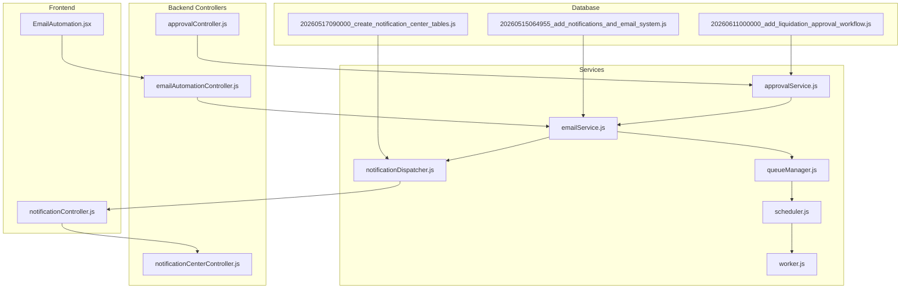
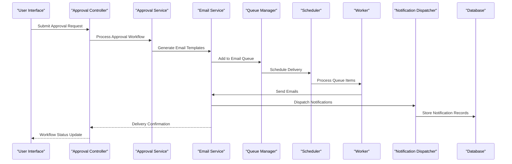
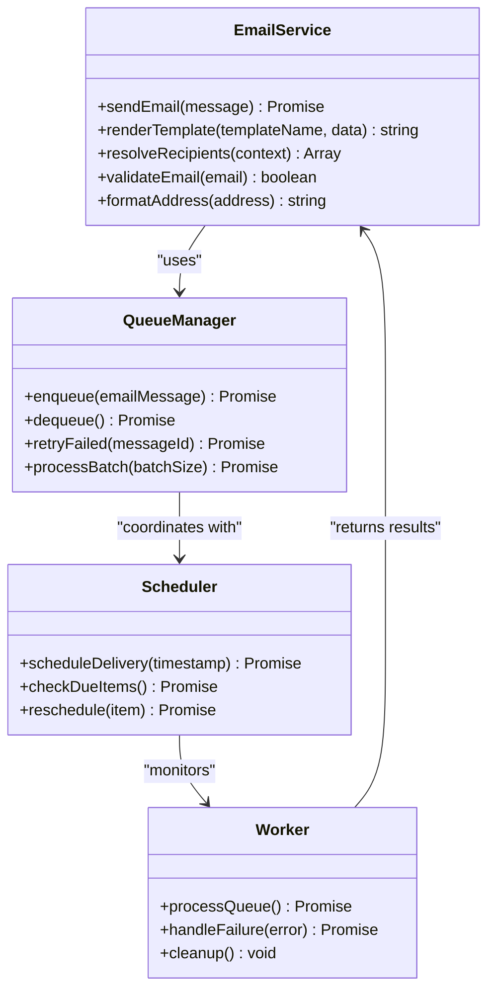
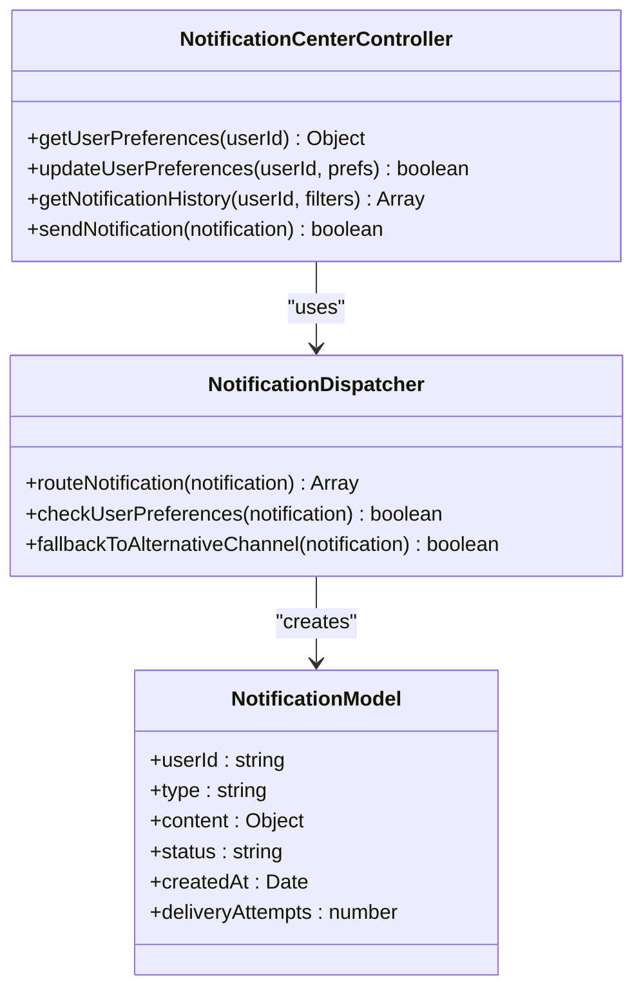
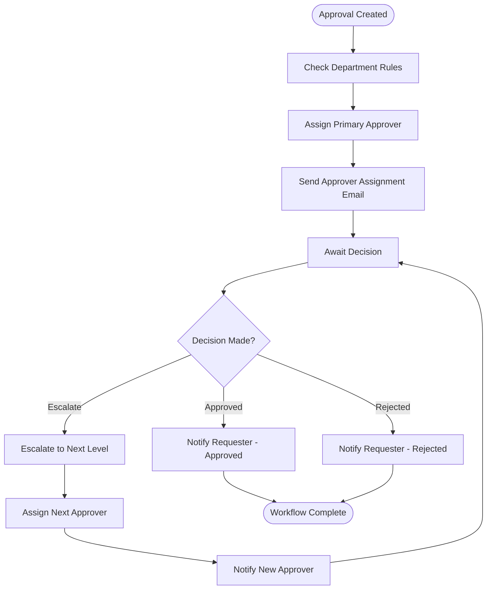
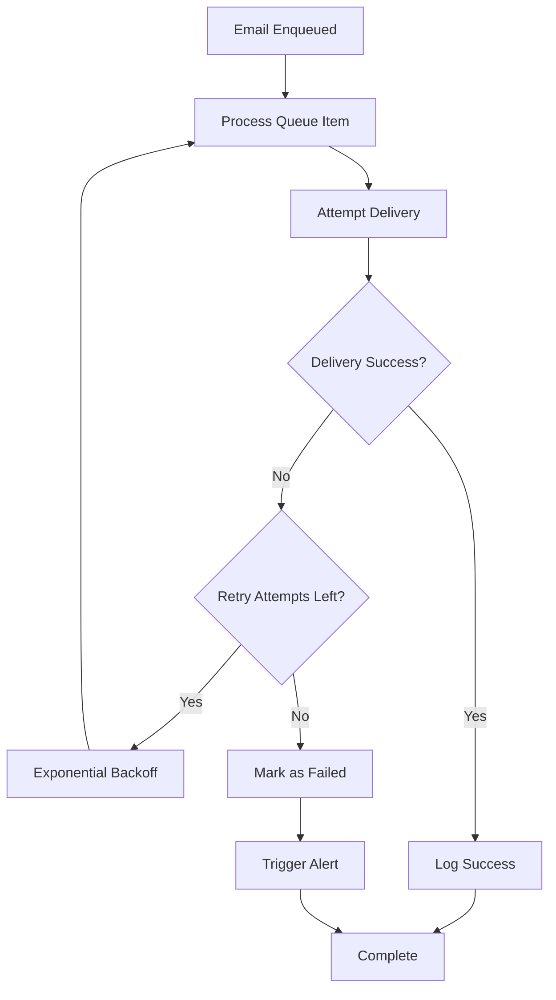
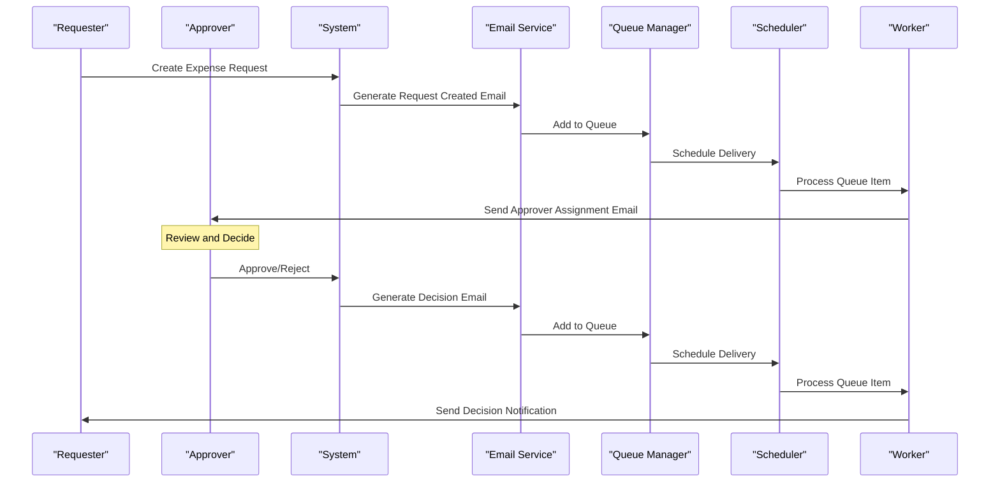
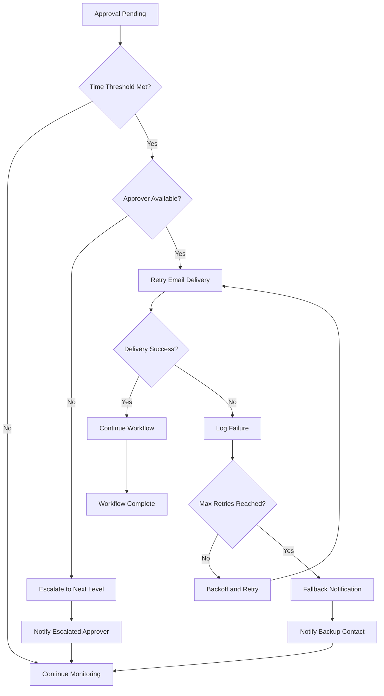

# Email Workflow Integration

<cite>
**Referenced Files in This Document**
- [emailAutomationController.js](file://backend/src/controllers/emailAutomationController.js)
- [approvalController.js](file://backend/src/controllers/approvalController.js)
- [notificationCenterController.js](file://backend/src/controllers/notificationCenterController.js)
- [notificationController.js](file://backend/src/controllers/notificationController.js)
- [approvalService.js](file://backend/src/services/approvalService.js)
- [emailService.js](file://backend/src/services/emailService.js)
- [notificationDispatcher.js](file://backend/src/services/notificationDispatcher.js)
- [queueManager.js](file://backend/src/services/queueManager.js)
- [scheduler.js](file://backend/src/services/scheduler.js)
- [worker.js](file://backend/src/services/worker.js)
- [20260515064955_add_notifications_and_email_system.js](file://backend/src/db/migrations/20260515064955_add_notifications_and_email_system.js)
- [20260517090000_create_notification_center_tables.js](file://backend/src/db/migrations/20260517090000_create_notification_center_tables.js)
- [20260611000000_add_liquidation_approval_workflow.js](file://backend/src/db/migrations/20260611000000_add_liquidation_approval_workflow.js)
- [20260611010000_fix_expense_status_varchar.js](file://backend/src/db/migrations/20260611010000_fix_expense_status_varchar.js)
- [emailAutomation.jsx](file://frontend/src/pages/EmailAutomation.jsx)
- [NotificationCenter.jsx](file://frontend/src/components/NotificationCenter.jsx)
</cite>

## Table of Contents
1. [Introduction](#introduction)
2. [Project Structure](#project-structure)
3. [Core Components](#core-components)
4. [Architecture Overview](#architecture-overview)
5. [Detailed Component Analysis](#detailed-component-analysis)
6. [Approval Workflow Integration](#approval-workflow-integration)
7. [Email Delivery Mechanisms](#email-delivery-mechanisms)
8. [Notification Routing Strategies](#notification-routing-strategies)
9. [Queue Management and Retry Logic](#queue-management-and-retry-logic)
10. [Department-Based Routing](#department-based-routing)
11. [User Preferences and Fallback Strategies](#user-preferences-and-fallback-strategies)
12. [Workflow Diagrams](#workflow-diagrams)
13. [Performance Considerations](#performance-considerations)
14. [Troubleshooting Guide](#troubleshooting-guide)
15. [Conclusion](#conclusion)

## Introduction
This document provides comprehensive documentation for the email workflow integration within the petty cash management system. The integration encompasses approval email triggers, notification routing, automated email sequences, and robust delivery mechanisms. The system supports department-based routing, user notification preferences, and fallback strategies to ensure reliable communication throughout the approval lifecycle.

## Project Structure
The email workflow integration spans both backend services and frontend interfaces, with dedicated controllers, services, and database migrations supporting the complete workflow.

**Diagram sources**
- [emailAutomationController.js](file://backend/src/controllers/emailAutomationController.js)
- [approvalController.js](file://backend/src/controllers/approvalController.js)
- [notificationCenterController.js](file://backend/src/controllers/notificationCenterController.js)
- [emailService.js](file://backend/src/services/emailService.js)
- [approvalService.js](file://backend/src/services/approvalService.js)
- [queueManager.js](file://backend/src/services/queueManager.js)
- [scheduler.js](file://backend/src/services/scheduler.js)
- [worker.js](file://backend/src/services/worker.js)

**Section sources**
- [emailAutomationController.js](file://backend/src/controllers/emailAutomationController.js)
- [approvalController.js](file://backend/src/controllers/approvalController.js)
- [notificationCenterController.js](file://backend/src/controllers/notificationCenterController.js)
- [emailService.js](file://backend/src/services/emailService.js)
- [approvalService.js](file://backend/src/services/approvalService.js)
- [queueManager.js](file://backend/src/services/queueManager.js)
- [scheduler.js](file://backend/src/services/scheduler.js)
- [worker.js](file://backend/src/services/worker.js)

## Core Components
The email workflow integration consists of several interconnected components working together to manage approval notifications and automated email sequences.

### Email Automation Controller
The primary interface for managing email automation workflows, handling approval triggers and notification routing.

### Approval Service Integration
Coordinates with the approval system to trigger appropriate email notifications based on workflow states and user assignments.

### Notification Dispatcher
Manages the distribution of notifications across multiple channels, with email as the primary delivery mechanism.

### Queue Management System
Handles asynchronous email processing with retry mechanisms and failure recovery strategies.

### Database Schema Support
Comprehensive database migrations supporting notification storage, email templates, and approval workflow tracking.

**Section sources**
- [emailAutomationController.js](file://backend/src/controllers/emailAutomationController.js)
- [approvalService.js](file://backend/src/services/approvalService.js)
- [notificationDispatcher.js](file://backend/src/services/notificationDispatcher.js)
- [queueManager.js](file://backend/src/services/queueManager.js)

## Architecture Overview
The email workflow architecture follows a service-oriented pattern with clear separation of concerns between approval processing, email generation, queue management, and delivery mechanisms.

**Diagram sources**
- [approvalController.js](file://backend/src/controllers/approvalController.js)
- [approvalService.js](file://backend/src/services/approvalService.js)
- [emailService.js](file://backend/src/services/emailService.js)
- [queueManager.js](file://backend/src/services/queueManager.js)
- [scheduler.js](file://backend/src/services/scheduler.js)
- [worker.js](file://backend/src/services/worker.js)
- [notificationDispatcher.js](file://backend/src/services/notificationDispatcher.js)

## Detailed Component Analysis

### Email Service Implementation
The email service handles template rendering, recipient resolution, and SMTP transport coordination. It integrates with the nodemailer library for reliable email delivery.

**Diagram sources**
- [emailService.js](file://backend/src/services/emailService.js)
- [queueManager.js](file://backend/src/services/queueManager.js)
- [scheduler.js](file://backend/src/services/scheduler.js)
- [worker.js](file://backend/src/services/worker.js)

### Notification Center Architecture
The notification center manages user preferences, delivery channels, and notification history tracking.

**Diagram sources**
- [notificationCenterController.js](file://backend/src/controllers/notificationCenterController.js)
- [notificationController.js](file://backend/src/controllers/notificationController.js)
- [notificationDispatcher.js](file://backend/src/services/notificationDispatcher.js)

**Section sources**
- [emailService.js](file://backend/src/services/emailService.js)
- [queueManager.js](file://backend/src/services/queueManager.js)
- [scheduler.js](file://backend/src/services/scheduler.js)
- [worker.js](file://backend/src/services/worker.js)
- [notificationCenterController.js](file://backend/src/controllers/notificationCenterController.js)
- [notificationDispatcher.js](file://backend/src/services/notificationDispatcher.js)

## Approval Workflow Integration
The approval workflow triggers email notifications at critical stages, ensuring stakeholders receive timely updates throughout the process.

### Approval Trigger Points
Email notifications are automatically triggered during key approval milestones:
- New approval request creation
- Approver assignment notifications
- Requester status updates
- Approval/rejection completion alerts
- Escalation notifications

### Department-Based Assignment
The system automatically assigns approvers based on department hierarchy and predefined approval chains, triggering appropriate notifications to designated stakeholders.

**Diagram sources**
- [approvalController.js](file://backend/src/controllers/approvalController.js)
- [approvalService.js](file://backend/src/services/approvalService.js)

**Section sources**
- [approvalController.js](file://backend/src/controllers/approvalController.js)
- [approvalService.js](file://backend/src/services/approvalService.js)

## Email Delivery Mechanisms
The email delivery system implements robust mechanisms for reliable message transmission with comprehensive error handling and recovery capabilities.

### Template Management
The system supports dynamic email templating with context-aware content generation, allowing personalized messages based on workflow state and user roles.

### Address Resolution
Automatic recipient address resolution ensures emails are sent to the correct stakeholders while maintaining privacy and compliance with data protection regulations.

### Delivery Tracking
Comprehensive delivery tracking enables monitoring of email status, bounce handling, and retry mechanisms for failed deliveries.

**Section sources**
- [emailService.js](file://backend/src/services/emailService.js)
- [emailAutomationController.js](file://backend/src/controllers/emailAutomationController.js)

## Notification Routing Strategies
The notification system employs intelligent routing strategies to ensure messages reach the appropriate recipients through preferred channels.

### Multi-Channel Support
While email serves as the primary delivery channel, the system supports fallback mechanisms to alternative notification channels when email delivery fails.

### Preference-Based Routing
User notification preferences are respected, allowing recipients to specify preferred contact methods and frequency of communications.

### Hierarchical Routing
Department and organizational hierarchy influence notification routing, ensuring approvals follow established chain of command protocols.

**Section sources**
- [notificationDispatcher.js](file://backend/src/services/notificationDispatcher.js)
- [notificationCenterController.js](file://backend/src/controllers/notificationCenterController.js)

## Queue Management and Retry Logic
The queue management system handles asynchronous email processing with sophisticated retry mechanisms and failure recovery strategies.

### Queue Architecture
Email messages are queued for asynchronous processing, enabling the system to handle high volumes of notifications without impacting user experience.

### Retry Strategy
Intelligent retry mechanisms automatically attempt delivery failures with exponential backoff, preventing system overload during peak periods.

### Failure Handling
Comprehensive failure handling includes detailed logging, alerting, and manual intervention capabilities for persistent delivery issues.

**Diagram sources**
- [queueManager.js](file://backend/src/services/queueManager.js)
- [scheduler.js](file://backend/src/services/scheduler.js)
- [worker.js](file://backend/src/services/worker.js)

**Section sources**
- [queueManager.js](file://backend/src/services/queueManager.js)
- [scheduler.js](file://backend/src/services/scheduler.js)
- [worker.js](file://backend/src/services/worker.js)

## Department-Based Routing
The system implements sophisticated department-based routing to ensure approvals follow organizational hierarchy and authority structures.

### Hierarchical Approval Chains
Department configurations define approval chains that automatically route requests to appropriate authority levels based on expense amounts and categories.

### Dynamic Recipient Resolution
Recipient lists are dynamically resolved based on current department structure, role assignments, and predefined escalation rules.

### Compliance and Audit
All routing decisions are logged for compliance auditing, providing complete traceability of approval workflows and notification delivery.

**Section sources**
- [approvalService.js](file://backend/src/services/approvalService.js)
- [20260611000000_add_liquidation_approval_workflow.js](file://backend/src/db/migrations/20260611000000_add_liquidation_approval_workflow.js)

## User Preferences and Fallback Strategies
The system respects user notification preferences while implementing robust fallback strategies to ensure critical communications are delivered.

### Preference Management
Users can configure notification preferences including preferred contact methods, frequency limits, and opt-out options for non-critical notifications.

### Fallback Mechanisms
When primary delivery methods fail, the system automatically attempts alternative channels including SMS, in-app notifications, or escalation to backup contacts.

### Privacy and Compliance
Notification preferences support privacy controls and compliance requirements, allowing users to manage their communication preferences while maintaining audit trails.

**Section sources**
- [notificationCenterController.js](file://backend/src/controllers/notificationCenterController.js)
- [notificationDispatcher.js](file://backend/src/services/notificationDispatcher.js)

## Workflow Diagrams

### Complete Approval Email Workflow
This diagram illustrates the complete email workflow from approval initiation to final notification delivery.

**Diagram sources**
- [approvalController.js](file://backend/src/controllers/approvalController.js)
- [emailService.js](file://backend/src/services/emailService.js)
- [queueManager.js](file://backend/src/services/queueManager.js)
- [scheduler.js](file://backend/src/services/scheduler.js)
- [worker.js](file://backend/src/services/worker.js)

### Escalation and Retry Flow
This diagram shows how the system handles escalation scenarios and retry mechanisms for failed deliveries.

**Diagram sources**
- [approvalService.js](file://backend/src/services/approvalService.js)
- [emailService.js](file://backend/src/services/emailService.js)
- [queueManager.js](file://backend/src/services/queueManager.js)

## Performance Considerations
The email workflow integration is designed for high performance and reliability under various load conditions.

### Asynchronous Processing
Email processing occurs asynchronously to prevent blocking user interactions and maintain responsive application performance.

### Scalable Architecture
The queue-based architecture scales horizontally to handle increased email volumes during peak approval periods.

### Resource Optimization
Efficient resource utilization through connection pooling, batch processing, and intelligent retry scheduling minimizes system overhead.

## Troubleshooting Guide
Common issues and their resolution strategies for the email workflow integration.

### Email Delivery Failures
- Verify SMTP configuration and credentials
- Check recipient email addresses for validity
- Review queue logs for delivery errors
- Monitor retry attempts and failure patterns

### Approval Workflow Issues
- Validate department configurations and approval chains
- Check user role assignments and permissions
- Review workflow state transitions and triggers
- Examine notification preferences and routing rules

### System Performance Problems
- Monitor queue length and processing rates
- Check scheduler and worker health status
- Review database connection pools and query performance
- Analyze memory usage and garbage collection patterns

**Section sources**
- [emailService.js](file://backend/src/services/emailService.js)
- [queueManager.js](file://backend/src/services/queueManager.js)
- [scheduler.js](file://backend/src/services/scheduler.js)
- [worker.js](file://backend/src/services/worker.js)

## Conclusion
The email workflow integration provides a comprehensive solution for managing approval notifications and automated email sequences within the petty cash management system. The architecture ensures reliable communication throughout the approval lifecycle while supporting department-based routing, user preferences, and robust fallback mechanisms. The scalable design accommodates growing email volumes and complex approval workflows, making it suitable for enterprise-scale deployments.