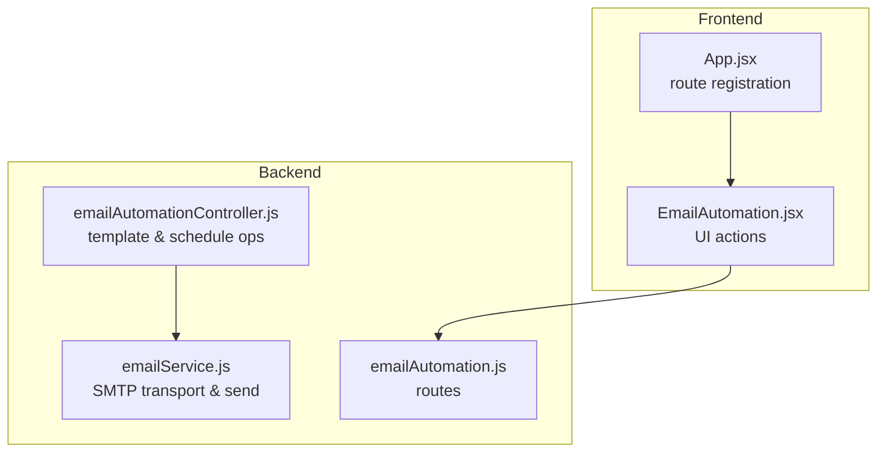
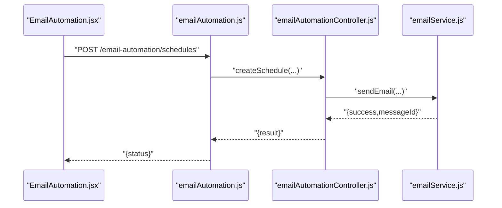
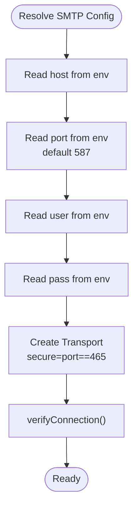
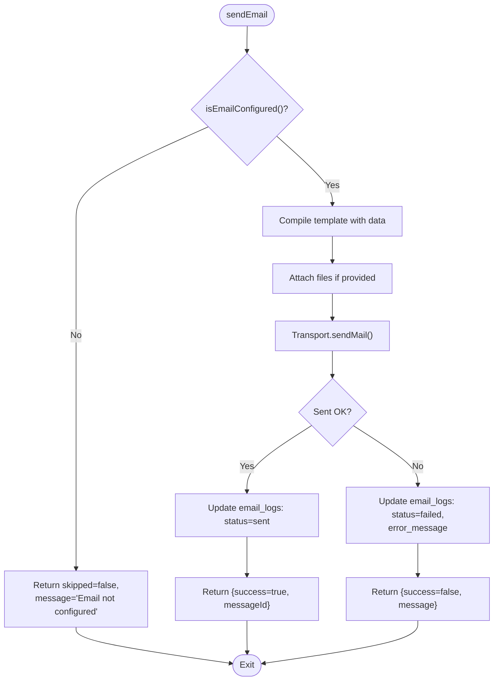
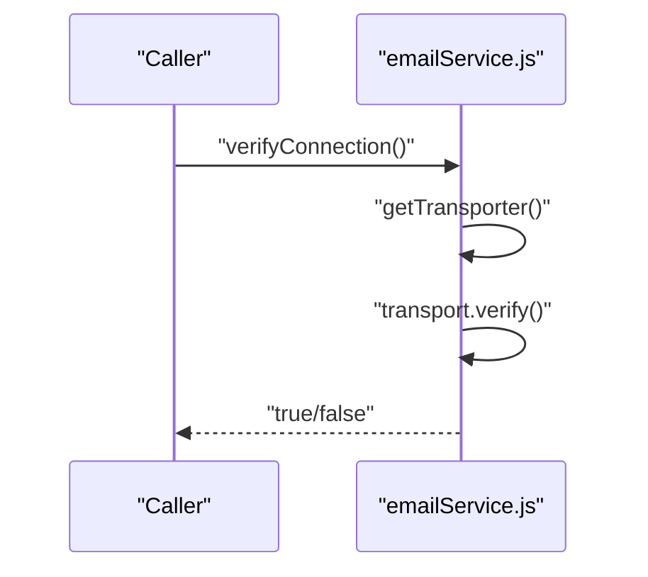
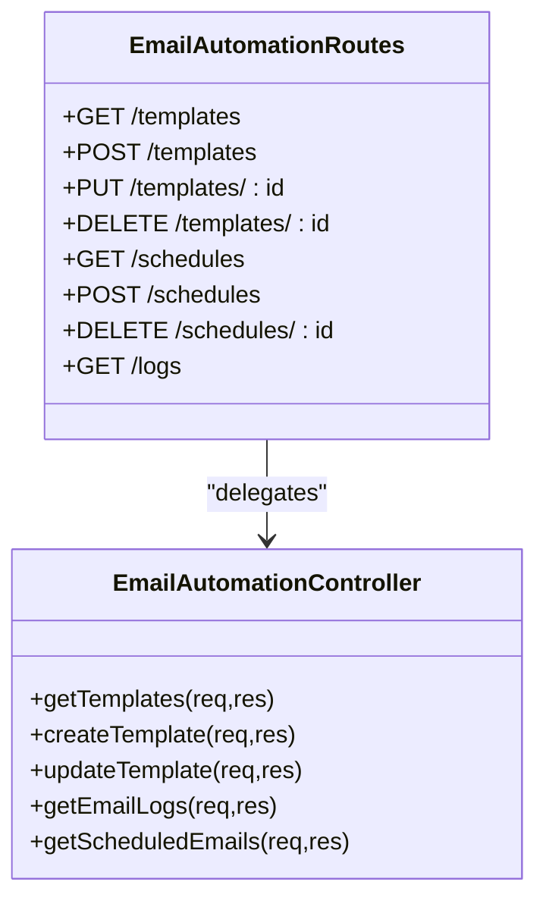
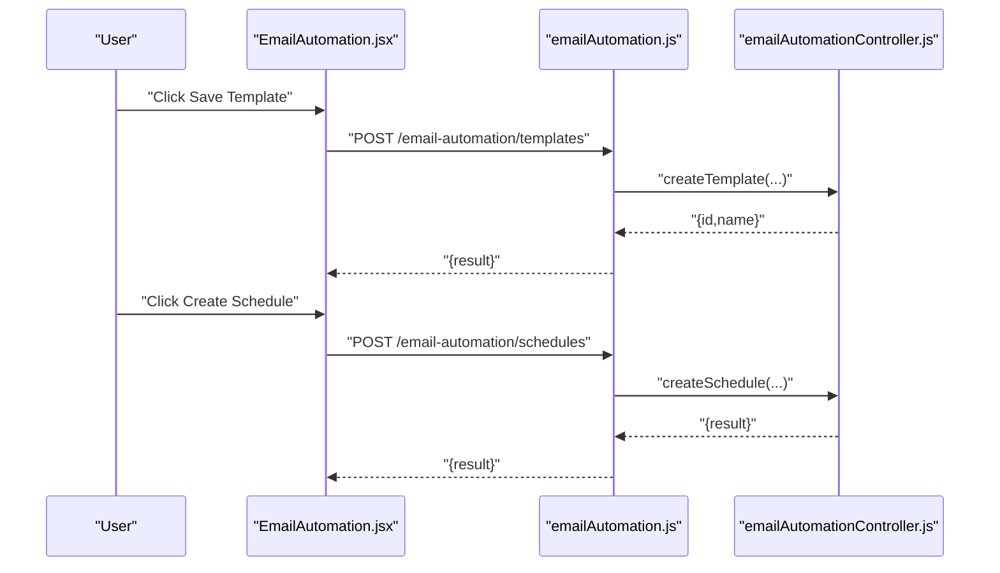
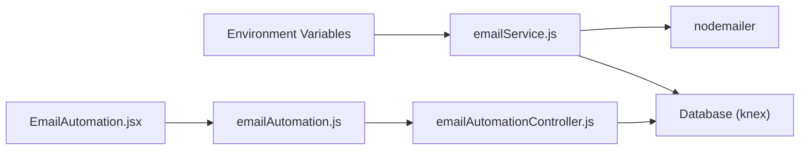

# SMTP Configuration

<cite>
**Referenced Files in This Document**
- [emailService.js](file://backend/src/services/emailService.js)
- [emailAutomationController.js](file://backend/src/controllers/emailAutomationController.js)
- [emailAutomation.js](file://backend/src/routes/emailAutomation.js)
- [EmailAutomation.jsx](file://frontend/src/pages/EmailAutomation.jsx)
- [App.jsx](file://frontend/src/App.jsx)
</cite>

## Table of Contents
1. [Introduction](#introduction)
2. [Project Structure](#project-structure)
3. [Core Components](#core-components)
4. [Architecture Overview](#architecture-overview)
5. [Detailed Component Analysis](#detailed-component-analysis)
6. [Dependency Analysis](#dependency-analysis)
7. [Performance Considerations](#performance-considerations)
8. [Troubleshooting Guide](#troubleshooting-guide)
9. [Conclusion](#conclusion)
10. [Appendices](#appendices)

## Introduction
This document provides comprehensive SMTP configuration guidance for the project’s email automation system. It covers environment variables, connection parameters, secure connection modes, authentication, provider-specific examples, and operational best practices. It also documents how the backend verifies connectivity and how the frontend exposes email automation features.

## Project Structure
The email automation feature spans backend services and frontend UI:
- Backend service module constructs the SMTP transport and sends emails.
- Backend controllers and routes expose endpoints for managing templates and schedules.
- Frontend page provides UI for creating and managing email templates and schedules.

**Diagram sources**
- [emailService.js:1-121](file://backend/src/services/emailService.js#L1-L121)
- [emailAutomationController.js:1-77](file://backend/src/controllers/emailAutomationController.js#L1-L77)
- [emailAutomation.js:1-23](file://backend/src/routes/emailAutomation.js#L1-L23)
- [EmailAutomation.jsx:168-261](file://frontend/src/pages/EmailAutomation.jsx#L168-L261)
- [App.jsx:80-126](file://frontend/src/App.jsx#L80-L126)

**Section sources**
- [emailService.js:1-121](file://backend/src/services/emailService.js#L1-L121)
- [emailAutomationController.js:1-77](file://backend/src/controllers/emailAutomationController.js#L1-L77)
- [emailAutomation.js:1-23](file://backend/src/routes/emailAutomation.js#L1-L23)
- [EmailAutomation.jsx:168-261](file://frontend/src/pages/EmailAutomation.jsx#L168-L261)
- [App.jsx:80-126](file://frontend/src/App.jsx#L80-L126)

## Core Components
- SMTP configuration resolution and transport creation
- Email sending pipeline with logging and error handling
- Connection verification routine
- Template and schedule management via backend controllers and routes
- Frontend UI for broadcasting, saving templates, scheduling, and viewing logs

Key behaviors:
- Environment variables are read for host, port, username, and password.
- Secure mode is automatically enabled when the port equals 465.
- Connection verification uses the underlying transport’s verify method.
- Email logs track sent and failed attempts.

**Section sources**
- [emailService.js:4-27](file://backend/src/services/emailService.js#L4-L27)
- [emailService.js:41-103](file://backend/src/services/emailService.js#L41-L103)
- [emailService.js:105-115](file://backend/src/services/emailService.js#L105-L115)
- [emailAutomationController.js:4-77](file://backend/src/controllers/emailAutomationController.js#L4-L77)
- [emailAutomation.js:1-23](file://backend/src/routes/emailAutomation.js#L1-L23)
- [EmailAutomation.jsx:168-261](file://frontend/src/pages/EmailAutomation.jsx#L168-L261)

## Architecture Overview
The email automation architecture integrates frontend UI actions with backend routes, controllers, and the email service.

**Diagram sources**
- [EmailAutomation.jsx:168-261](file://frontend/src/pages/EmailAutomation.jsx#L168-L261)
- [emailAutomation.js:15-18](file://backend/src/routes/emailAutomation.js#L15-L18)
- [emailAutomationController.js:58-69](file://backend/src/controllers/emailAutomationController.js#L58-L69)
- [emailService.js:41-103](file://backend/src/services/emailService.js#L41-L103)

## Detailed Component Analysis

### SMTP Configuration Resolution and Transport Creation
The backend resolves SMTP settings from environment variables and creates a reusable transport. It determines secure mode based on the configured port.

**Diagram sources**
- [emailService.js:4-27](file://backend/src/services/emailService.js#L4-L27)
- [emailService.js:105-115](file://backend/src/services/emailService.js#L105-L115)

**Section sources**
- [emailService.js:4-27](file://backend/src/services/emailService.js#L4-L27)
- [emailService.js:105-115](file://backend/src/services/emailService.js#L105-L115)

### Email Sending Pipeline and Logging
The email sending function validates configuration, compiles templates, attaches files, and records outcomes in the database.

**Diagram sources**
- [emailService.js:41-103](file://backend/src/services/emailService.js#L41-L103)

**Section sources**
- [emailService.js:41-103](file://backend/src/services/emailService.js#L41-L103)

### Connection Verification Routine
A dedicated function tests the SMTP connection using the transport’s verify method.

**Diagram sources**
- [emailService.js:105-115](file://backend/src/services/emailService.js#L105-L115)

**Section sources**
- [emailService.js:105-115](file://backend/src/services/emailService.js#L105-L115)

### Template and Schedule Management
Backend routes and controllers support CRUD operations for email templates and scheduled emails.

**Diagram sources**
- [emailAutomation.js:1-23](file://backend/src/routes/emailAutomation.js#L1-L23)
- [emailAutomationController.js:1-77](file://backend/src/controllers/emailAutomationController.js#L1-L77)

**Section sources**
- [emailAutomation.js:1-23](file://backend/src/routes/emailAutomation.js#L1-L23)
- [emailAutomationController.js:1-77](file://backend/src/controllers/emailAutomationController.js#L1-L77)

### Frontend UI Integration
The frontend provides actions for broadcasting messages, saving templates, creating schedules, and deleting items.

**Diagram sources**
- [EmailAutomation.jsx:168-261](file://frontend/src/pages/EmailAutomation.jsx#L168-L261)
- [emailAutomation.js:10-18](file://backend/src/routes/emailAutomation.js#L10-L18)
- [emailAutomationController.js:13-44](file://backend/src/controllers/emailAutomationController.js#L13-L44)

**Section sources**
- [EmailAutomation.jsx:168-261](file://frontend/src/pages/EmailAutomation.jsx#L168-L261)
- [emailAutomation.js:10-18](file://backend/src/routes/emailAutomation.js#L10-L18)
- [emailAutomationController.js:13-44](file://backend/src/controllers/emailAutomationController.js#L13-L44)

## Dependency Analysis
- emailService.js depends on environment variables for SMTP configuration and uses nodemailer for transport creation.
- Controllers depend on the database client to manage templates and schedules.
- Routes enforce authentication and role-based authorization before delegating to controllers.
- Frontend UI interacts with backend routes to manage templates and schedules.

**Diagram sources**
- [emailService.js:1-3](file://backend/src/services/emailService.js#L1-L3)
- [emailAutomationController.js:1](file://backend/src/controllers/emailAutomationController.js#L1)
- [emailAutomation.js:1-4](file://backend/src/routes/emailAutomation.js#L1-L4)
- [EmailAutomation.jsx:168-261](file://frontend/src/pages/EmailAutomation.jsx#L168-L261)

**Section sources**
- [emailService.js:1-3](file://backend/src/services/emailService.js#L1-L3)
- [emailAutomationController.js:1](file://backend/src/controllers/emailAutomationController.js#L1)
- [emailAutomation.js:1-4](file://backend/src/routes/emailAutomation.js#L1-L4)
- [EmailAutomation.jsx:168-261](file://frontend/src/pages/EmailAutomation.jsx#L168-L261)

## Performance Considerations
- Reuse the transport instance to avoid repeated connection overhead.
- Prefer port 587 with STARTTLS when compatibility is required; use port 465 only when TLS termination occurs at the server boundary.
- Limit attachment sizes and count to reduce latency and memory usage during send operations.
- Batch or queue scheduled emails to prevent spikes in outbound connections.

## Troubleshooting Guide
Common issues and resolutions:
- Missing credentials or host: The service checks for host, user, and pass; if absent, sending is skipped with a warning. Ensure environment variables are set.
- Wrong port selection: If using port 465, secure mode is enabled automatically. For port 587, STARTTLS is used. Adjust port according to provider requirements.
- Authentication failures: Verify username and password; some providers require app-specific passwords or OAuth tokens.
- Certificate errors: If using self-signed certificates or outdated CA bundles, configure appropriate TLS settings or update trust stores.
- Network restrictions: Some networks block port 25 or 587; switch to 465 or use provider-specific SMTP relays.
- Connection verification failures: Use the built-in verification routine to diagnose connectivity issues.

Operational tips:
- Use the connection verification endpoint to test SMTP availability.
- Inspect email logs for detailed failure reasons and timestamps.
- Enable debug logging in the transport for deeper diagnostics.

**Section sources**
- [emailService.js:41-103](file://backend/src/services/emailService.js#L41-L103)
- [emailService.js:105-115](file://backend/src/services/emailService.js#L105-L115)

## Conclusion
The project’s email automation relies on a straightforward SMTP configuration resolved from environment variables, with automatic secure mode selection based on port. The backend provides robust logging and verification capabilities, while the frontend offers intuitive controls for managing templates and schedules. Following the provider-specific guidelines and best practices outlined below will help ensure reliable email delivery.

## Appendices

### Environment Variables Reference
- SMTP_HOST or EMAIL_HOST: SMTP server hostname or IP address.
- SMTP_PORT or EMAIL_PORT: SMTP server port; defaults to 587 if unspecified.
- SMTP_USER or EMAIL_USER: Username for SMTP authentication.
- SMTP_PASS or EMAIL_PASS: Password for SMTP authentication.

Notes:
- If any of host, user, or pass are missing, email sending is skipped.
- secure is enabled when port equals 465; otherwise STARTTLS is used for port 587.

**Section sources**
- [emailService.js:4-27](file://backend/src/services/emailService.js#L4-L27)

### Provider Configuration Examples
- Gmail
  - Host: smtp.gmail.com
  - Port: 587 (STARTTLS) or 465 (SMTPS)
  - Username: your full Gmail address
  - Password: App password (not your regular account password)
- Outlook/Hotmail
  - Host: smtp-mail.outlook.com
  - Port: 587 (STARTTLS)
  - Username: your Outlook email address
  - Password: your account password or app password
- Custom SMTP Server
  - Host: your-smtp.example.com
  - Port: typically 587 or 465
  - Username and Password: credentials provided by your SMTP provider

Guidelines:
- Prefer 587 with STARTTLS for broad compatibility.
- Use 465 only when your provider mandates it or when TLS termination is handled by the server.
- Ensure firewall and network policies allow outbound SMTP traffic on the chosen port.

**Section sources**
- [emailService.js:4-27](file://backend/src/services/emailService.js#L4-L27)

### Security Best Practices
- Store SMTP credentials in environment variables; never commit secrets to version control.
- Rotate credentials periodically and revoke unused access keys.
- Use app-specific passwords or OAuth tokens when supported by providers.
- Restrict SMTP access to trusted networks and enable two-factor authentication for admin accounts.
- Monitor email logs for anomalies and unauthorized sending attempts.

**Section sources**
- [emailService.js:41-103](file://backend/src/services/emailService.js#L41-L103)

### Frontend Access and Permissions
- The Email Automation page is protected and accessible to Super Admin and Accounting roles.
- UI actions include saving templates, creating schedules, broadcasting alerts, and deleting items.

**Section sources**
- [App.jsx:88-92](file://frontend/src/App.jsx#L88-L92)
- [EmailAutomation.jsx:168-261](file://frontend/src/pages/EmailAutomation.jsx#L168-L261)