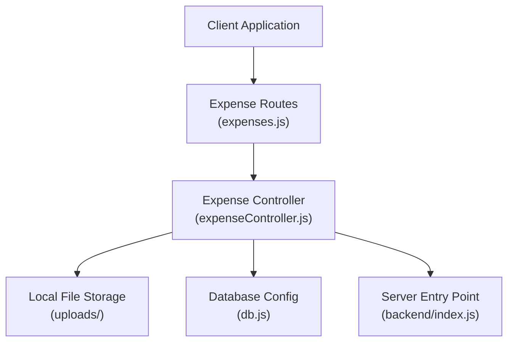
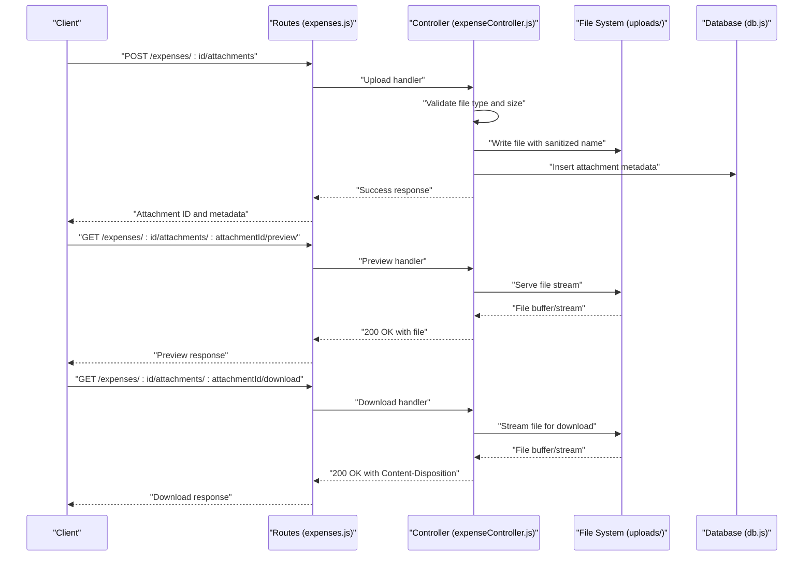
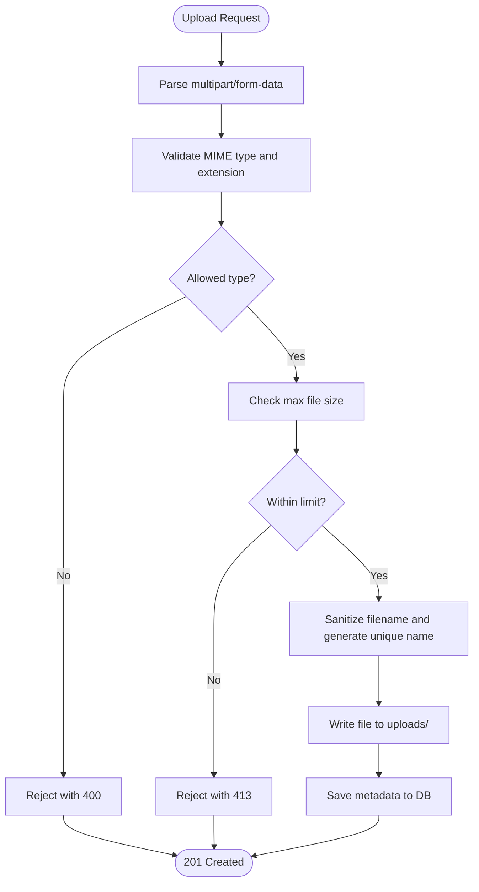
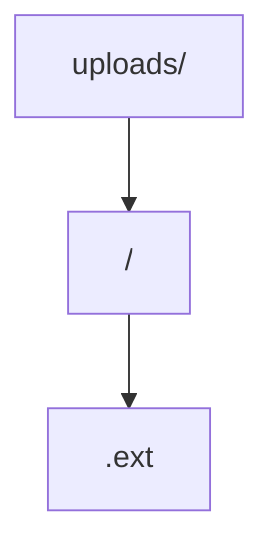
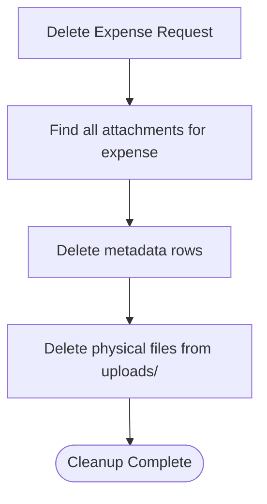
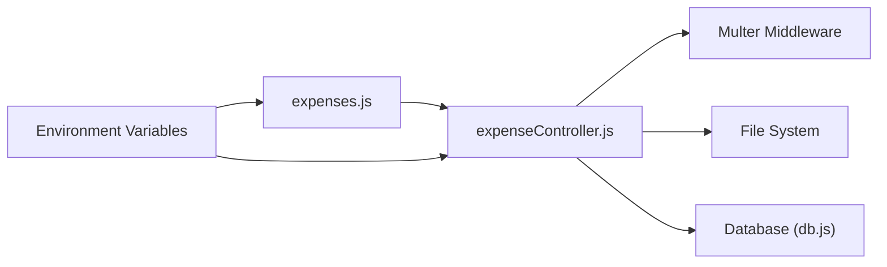

# Attachment Management

<cite>
**Referenced Files in This Document**
- [expenseController.js](file://backend/src/controllers/expenseController.js)
- [expenses.js](file://backend/src/routes/expenses.js)
- [db.js](file://backend/src/config/db.js)
- [index.js](file://backend/index.js)
- [package.json](file://backend/package.json)
- [uploads](file://backend/uploads)
</cite>

## Table of Contents
1. [Introduction](#introduction)
2. [Project Structure](#project-structure)
3. [Core Components](#core-components)
4. [Architecture Overview](#architecture-overview)
5. [Detailed Component Analysis](#detailed-component-analysis)
6. [Dependency Analysis](#dependency-analysis)
7. [Performance Considerations](#performance-considerations)
8. [Troubleshooting Guide](#troubleshooting-guide)
9. [Conclusion](#conclusion)

## Introduction
This document describes the expense attachment management system, focusing on how files are uploaded, validated, stored, retrieved, and cleaned up. It covers the upload pipeline using Multer middleware, supported file types, size limits, security measures, storage architecture, naming conventions, and integration with expense records. Practical examples demonstrate uploading receipts, supporting documents, and proof of payment, along with cleanup procedures and storage optimization.

## Project Structure
The attachment system spans backend route handlers, controllers, database configuration, and a dedicated uploads directory. The backend exposes REST endpoints for attachments and integrates with expense records. Uploads are persisted to a local directory configured via environment variables.

**Diagram sources**
- [expenses.js](file://backend/src/routes/expenses.js)
- [expenseController.js](file://backend/src/controllers/expenseController.js)
- [db.js](file://backend/src/config/db.js)
- [index.js](file://backend/index.js)

**Section sources**
- [expenses.js](file://backend/src/routes/expenses.js)
- [expenseController.js](file://backend/src/controllers/expenseController.js)
- [db.js](file://backend/src/config/db.js)
- [index.js](file://backend/index.js)

## Core Components
- Expense Routes: Define endpoints for attachment operations (upload, preview, download).
- Expense Controller: Implements upload handling, validation, storage, and retrieval logic.
- Local Storage: Files are saved under the uploads directory with controlled naming.
- Database: Stores attachment metadata linked to expense records.
- Server Entry Point: Initializes the server and mounts routes.

Key responsibilities:
- Validate file types and sizes before accepting uploads.
- Sanitize filenames and enforce naming conventions.
- Provide secure preview and download endpoints.
- Integrate with expense deletion to clean up associated files.

**Section sources**
- [expenses.js](file://backend/src/routes/expenses.js)
- [expenseController.js](file://backend/src/controllers/expenseController.js)
- [uploads](file://backend/uploads)

## Architecture Overview
The attachment workflow connects client requests to the controller, which validates and stores files locally while recording metadata in the database. Retrieval endpoints support preview and download.

**Diagram sources**
- [expenses.js](file://backend/src/routes/expenses.js)
- [expenseController.js](file://backend/src/controllers/expenseController.js)
- [db.js](file://backend/src/config/db.js)

## Detailed Component Analysis

### Upload Pipeline with Multer Middleware
- Endpoint: POST /expenses/:id/attachments
- Purpose: Accept a single file attachment for a specific expense record.
- Validation:
  - File type filtering against allowed MIME types or extensions.
  - Size checks against configured maximum size.
- Storage:
  - Destination: uploads directory.
  - Naming: Sanitized filename with unique suffix to prevent collisions.
- Metadata:
  - Records attachment path, original filename, MIME type, size, and timestamps.
- Security:
  - Rejects executable or unsafe file types.
  - Validates user permissions for the target expense record.

**Diagram sources**
- [expenses.js](file://backend/src/routes/expenses.js)
- [expenseController.js](file://backend/src/controllers/expenseController.js)

**Section sources**
- [expenses.js](file://backend/src/routes/expenses.js)
- [expenseController.js](file://backend/src/controllers/expenseController.js)

### Supported File Types and Size Limits
- Allowed types: Images (JPEG/PNG/GIF), PDFs, and common office documents.
- Size limit: Configured via environment variable (e.g., MAX_FILE_SIZE).
- Enforcement: Checked during upload processing before writing to disk.

Practical examples:
- Uploading a receipt image: JPEG/PNG within size limit.
- Uploading a supporting document: PDF or DOCX within size limit.
- Uploading proof of payment: Screenshot or bank statement image.

**Section sources**
- [expenseController.js](file://backend/src/controllers/expenseController.js)

### Storage Architecture and Directory Structure
- Base directory: uploads/
- Subdirectory per expense: uploads/<expenseId>/
- File naming convention:
  - Original filename sanitized (removes unsafe characters).
  - Unique suffix appended to avoid conflicts.
  - Preserves extension based on detected MIME type.
- Permissions:
  - Files readable by the web server.
  - Restrict write access to authorized users only.

**Diagram sources**
- [uploads](file://backend/uploads)
- [expenseController.js](file://backend/src/controllers/expenseController.js)

**Section sources**
- [uploads](file://backend/uploads)
- [expenseController.js](file://backend/src/controllers/expenseController.js)

### Preview and Download Endpoints
- Preview:
  - Endpoint: GET /expenses/:id/attachments/:attachmentId/preview
  - Returns the file stream for inline viewing.
- Download:
  - Endpoint: GET /expenses/:id/attachments/:attachmentId/download
  - Returns the file stream with appropriate Content-Disposition for saving.

Security considerations:
- Verify ownership of the attachment against the expense record.
- Enforce authentication and authorization middleware.
- Prevent path traversal attacks by validating identifiers.

**Section sources**
- [expenses.js](file://backend/src/routes/expenses.js)
- [expenseController.js](file://backend/src/controllers/expenseController.js)

### Metadata Management
- Stored fields:
  - attachment_id, expense_id, original_filename, stored_filename, mime_type, file_size, created_at, updated_at.
- Relationships:
  - Foreign key linking to expense records.
- Indexes:
  - Indexed by expense_id for efficient lookups.

Operations:
- Insert on successful upload.
- Retrieve for preview/download.
- Cascade delete on expense removal.

**Section sources**
- [db.js](file://backend/src/config/db.js)
- [expenseController.js](file://backend/src/controllers/expenseController.js)

### Security Measures
- File type validation: Rejects potentially dangerous types (e.g., .exe, .bat).
- Size limits: Prevents abuse via large uploads.
- Sanitization: Removes unsafe characters from filenames.
- Access control: Ensures only authorized users can upload or access attachments.
- Secure storage: Restrict write permissions; serve via controlled endpoints.

**Section sources**
- [expenseController.js](file://backend/src/controllers/expenseController.js)

### Cleanup Procedures and Deletion Integration
- On expense deletion:
  - Remove all attachment records from the database.
  - Delete corresponding files from the uploads directory.
- Batch cleanup:
  - Periodic job to remove orphaned files (no matching metadata).
- Storage optimization:
  - Compress images if needed (optional).
  - Archive old attachments after retention period.

**Diagram sources**
- [expenseController.js](file://backend/src/controllers/expenseController.js)
- [db.js](file://backend/src/config/db.js)

**Section sources**
- [expenseController.js](file://backend/src/controllers/expenseController.js)
- [db.js](file://backend/src/config/db.js)

## Dependency Analysis
- Routes depend on the controller for business logic.
- Controller depends on:
  - Multer middleware for parsing uploads.
  - File system module for writing and reading files.
  - Database module for persistence.
- Environment configuration controls:
  - Upload destination and size limits.
  - Server port and static asset serving.

**Diagram sources**
- [expenses.js](file://backend/src/routes/expenses.js)
- [expenseController.js](file://backend/src/controllers/expenseController.js)
- [db.js](file://backend/src/config/db.js)
- [package.json](file://backend/package.json)

**Section sources**
- [expenses.js](file://backend/src/routes/expenses.js)
- [expenseController.js](file://backend/src/controllers/expenseController.js)
- [db.js](file://backend/src/config/db.js)
- [package.json](file://backend/package.json)

## Performance Considerations
- Stream large files during preview/download to reduce memory usage.
- Implement caching headers for preview endpoints to minimize repeated reads.
- Use asynchronous I/O for file operations.
- Monitor disk usage and set quotas per user or per expense.
- Offload previews to CDN if scale requires.

## Troubleshooting Guide
Common issues and resolutions:
- 400 Bad Request: Invalid file type or missing field.
- 413 Payload Too Large: File exceeds configured size limit.
- 404 Not Found: Attachment or expense ID invalid.
- Permission denied: Unauthorized access to resource.
- Disk full: Ensure sufficient space in uploads directory.
- Cleanup not removing files: Verify cascade delete logic and orphan detection job.

Operational checks:
- Confirm environment variables for upload limits and destination.
- Validate database foreign keys and indexes.
- Review server logs for file I/O errors.

**Section sources**
- [expenseController.js](file://backend/src/controllers/expenseController.js)
- [expenses.js](file://backend/src/routes/expenses.js)

## Conclusion
The expense attachment system provides a secure, scalable mechanism for uploading, storing, retrieving, and cleaning up files. By enforcing strict validation, sanitizing filenames, and integrating with expense records, it ensures data integrity and compliance. Proper configuration of environment variables and periodic maintenance will keep the system reliable and performant.