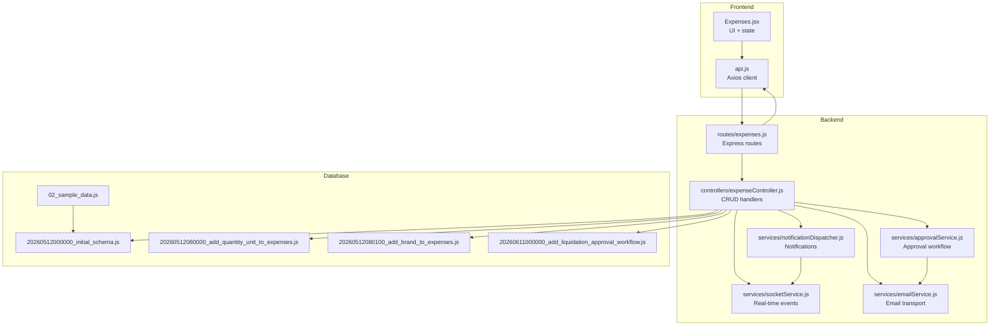
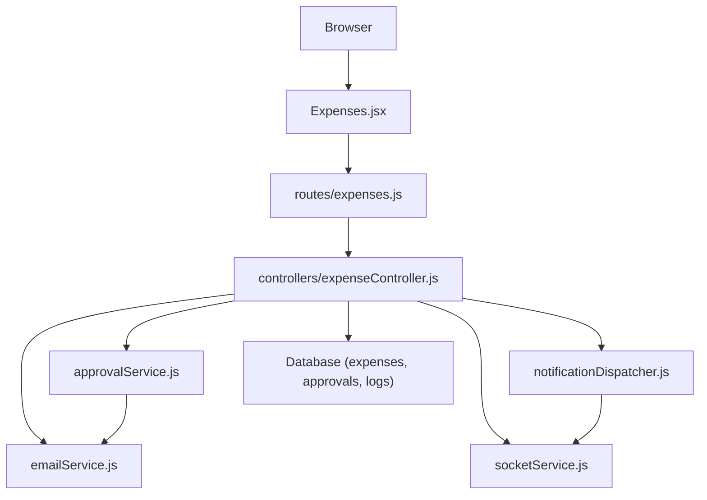
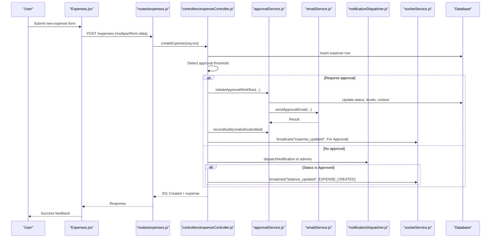
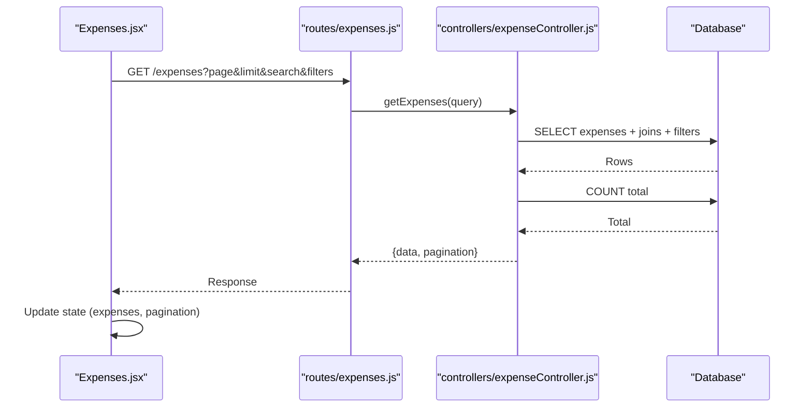
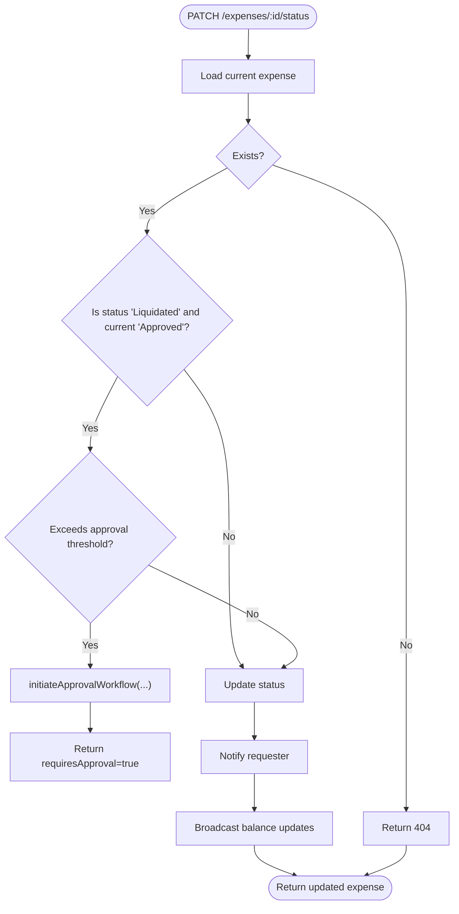
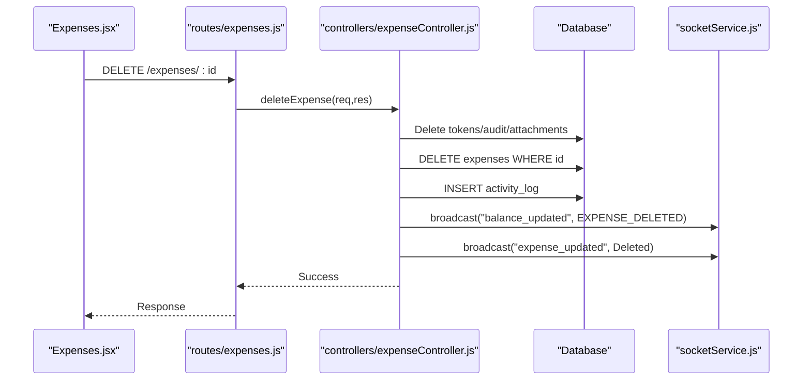
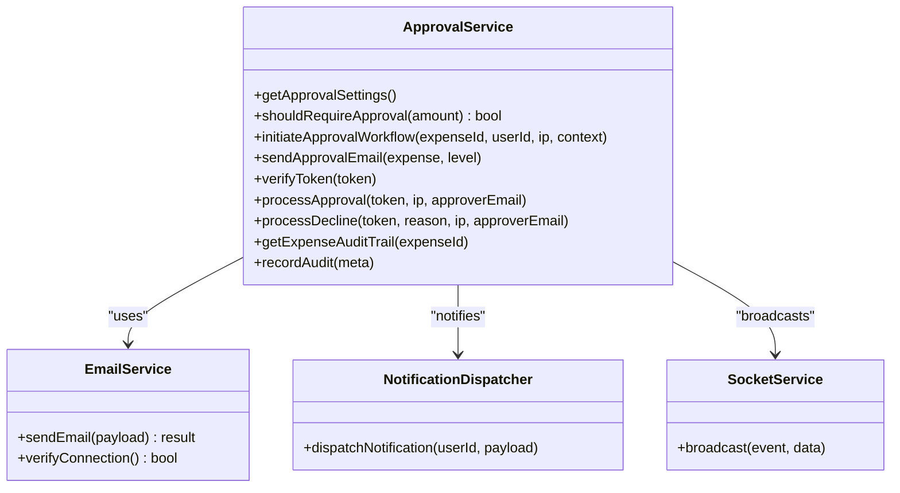
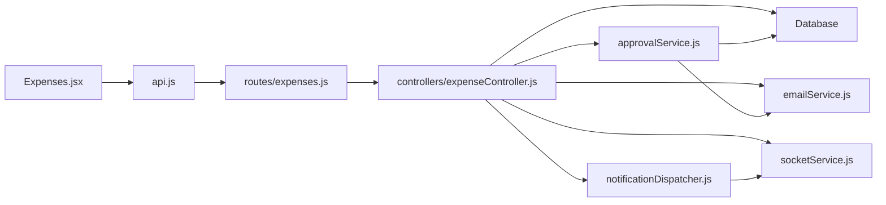

# Expense CRUD Operations

<cite>
**Referenced Files in This Document**
- [expenseController.js](file://backend/src/controllers/expenseController.js)
- [expenses.js](file://backend/src/routes/expenses.js)
- [Expenses.jsx](file://frontend/src/pages/Expenses.jsx)
- [api.js](file://frontend/src/services/api.js)
- [approvalService.js](file://backend/src/services/approvalService.js)
- [notificationDispatcher.js](file://backend/src/services/notificationDispatcher.js)
- [socketService.js](file://backend/src/services/socketService.js)
- [emailService.js](file://backend/src/services/emailService.js)
- [20260512000000_initial_schema.js](file://backend/src/db/migrations/20260512000000_initial_schema.js)
- [20260512080000_add_quantity_unit_to_expenses.js](file://backend/src/db/migrations/20260512080000_add_quantity_unit_to_expenses.js)
- [20260512080100_add_brand_to_expenses.js](file://backend/src/db/migrations/20260512080100_add_brand_to_expenses.js)
- [20260611000000_add_liquidation_approval_workflow.js](file://backend/src/db/migrations/20260611000000_add_liquidation_approval_workflow.js)
- [02_sample_data.js](file://backend/src/db/seeds/02_sample_data.js)
</cite>

## Table of Contents
1. [Introduction](#introduction)
2. [Project Structure](#project-structure)
3. [Core Components](#core-components)
4. [Architecture Overview](#architecture-overview)
5. [Detailed Component Analysis](#detailed-component-analysis)
6. [Dependency Analysis](#dependency-analysis)
7. [Performance Considerations](#performance-considerations)
8. [Troubleshooting Guide](#troubleshooting-guide)
9. [Conclusion](#conclusion)

## Introduction
This document explains the complete expense CRUD lifecycle in the petty cash system, covering creation, retrieval, updates, and deletion. It details form validation, data binding, error handling, automatic approval detection, status assignment, approval context handling, pagination, filtering, search, modification workflows, status updates, and impacts on fund balances and notifications. Practical examples and integration points with the approval workflow are included for common scenarios.

## Project Structure
The expense feature spans backend controllers, routes, services, and frontend pages, with database migrations defining the schema and seed data supporting testing.

**Diagram sources**
- [expenses.js:1-49](file://backend/src/routes/expenses.js#L1-L49)
- [expenseController.js:1-358](file://backend/src/controllers/expenseController.js#L1-L358)
- [approvalService.js:1-590](file://backend/src/services/approvalService.js#L1-L590)
- [notificationDispatcher.js:1-68](file://backend/src/services/notificationDispatcher.js#L1-L68)
- [socketService.js:1-102](file://backend/src/services/socketService.js#L1-L102)
- [emailService.js:1-122](file://backend/src/services/emailService.js#L1-L122)
- [20260512000000_initial_schema.js:1-159](file://backend/src/db/migrations/20260512000000_initial_schema.js#L1-L159)
- [20260512080000_add_quantity_unit_to_expenses.js:1-23](file://backend/src/db/migrations/20260512080000_add_quantity_unit_to_expenses.js#L1-L23)
- [20260512080100_add_brand_to_expenses.js:1-23](file://backend/src/db/migrations/20260512080100_add_brand_to_expenses.js#L1-L23)
- [20260611000000_add_liquidation_approval_workflow.js:1-179](file://backend/src/db/migrations/20260611000000_add_liquidation_approval_workflow.js#L1-L179)
- [02_sample_data.js:1-56](file://backend/src/db/seeds/02_sample_data.js#L1-L56)

**Section sources**
- [expenses.js:1-49](file://backend/src/routes/expenses.js#L1-L49)
- [expenseController.js:1-358](file://backend/src/controllers/expenseController.js#L1-L358)
- [Expenses.jsx:1-856](file://frontend/src/pages/Expenses.jsx#L1-L856)
- [api.js:1-29](file://frontend/src/services/api.js#L1-L29)

## Core Components
- Backend routes define endpoints for listing, viewing, creating, updating, deleting, and status updates with appropriate middleware for authentication and authorization.
- Controllers implement business logic for expense CRUD, including automatic approval detection, status assignment, attachment handling, activity logging, notifications, and real-time broadcasts.
- Services encapsulate approval workflow, notifications, sockets, and email sending.
- Frontend pages manage UI state, search/filtering, pagination, and user actions, integrating with backend APIs.

Key responsibilities:
- Expense listing with pagination, search, and filters
- Expense creation with approval threshold checks and email notifications
- Expense updates and status transitions with notifications and balance updates
- Expense deletion with cleanup and balance restoration
- Real-time updates and notifications for stakeholders

**Section sources**
- [expenses.js:1-49](file://backend/src/routes/expenses.js#L1-L49)
- [expenseController.js:1-358](file://backend/src/controllers/expenseController.js#L1-L358)
- [Expenses.jsx:1-856](file://frontend/src/pages/Expenses.jsx#L1-L856)

## Architecture Overview
The system follows a layered architecture:
- Presentation layer (frontend) handles user interactions and state.
- API layer (Express routes) validates roles and delegates to controllers.
- Business logic layer (controllers) orchestrates services and database operations.
- Persistence layer (migrations and seeds) defines schema and test data.
- Integration services (approval, notifications, sockets, email) coordinate cross-cutting concerns.

**Diagram sources**
- [expenses.js:1-49](file://backend/src/routes/expenses.js#L1-L49)
- [expenseController.js:1-358](file://backend/src/controllers/expenseController.js#L1-L358)
- [approvalService.js:1-590](file://backend/src/services/approvalService.js#L1-L590)
- [notificationDispatcher.js:1-68](file://backend/src/services/notificationDispatcher.js#L1-L68)
- [socketService.js:1-102](file://backend/src/services/socketService.js#L1-L102)
- [emailService.js:1-122](file://backend/src/services/emailService.js#L1-L122)

## Detailed Component Analysis

### Expense Creation Workflow
The creation endpoint accepts multipart form data, performs automatic approval detection, inserts the record, optionally creates approval tokens, sends email notifications, and broadcasts real-time updates.

**Diagram sources**
- [expenses.js:43](file://backend/src/routes/expenses.js#L43)
- [expenseController.js:105-211](file://backend/src/controllers/expenseController.js#L105-L211)
- [approvalService.js:292-327](file://backend/src/services/approvalService.js#L292-L327)
- [emailService.js:41-103](file://backend/src/services/emailService.js#L41-L103)
- [notificationDispatcher.js:5-63](file://backend/src/services/notificationDispatcher.js#L5-L63)
- [socketService.js:88-94](file://backend/src/services/socketService.js#L88-L94)

Practical example scenarios:
- Threshold-triggered email approval: When amount meets or exceeds the configured threshold, the system sets status to "For Approval", creates approval tokens, emails approvers, and broadcasts updates.
- Direct approval: When below threshold, the system notifies admins and may immediately update balances if status is "Approved".

Validation and data binding:
- Frontend binds form fields to state and submits multipart data including attachments.
- Backend enforces role-based authorization for updates and status changes.

**Section sources**
- [expenses.js:15-37](file://backend/src/routes/expenses.js#L15-L37)
- [expenses.js:43](file://backend/src/routes/expenses.js#L43)
- [expenseController.js:105-211](file://backend/src/controllers/expenseController.js#L105-L211)
- [Expenses.jsx:176-208](file://frontend/src/pages/Expenses.jsx#L176-L208)

### Expense Retrieval System
The listing endpoint supports pagination, filtering, and search with robust query construction and left joins for related metadata.

**Diagram sources**
- [expenses.js:41](file://backend/src/routes/expenses.js#L41)
- [expenseController.js:7-76](file://backend/src/controllers/expenseController.js#L7-L76)

Capabilities:
- Pagination: page and limit with bounds checking and computed offset.
- Filtering: category, department, status, requestedBy, date range.
- Search: free-text search across remarks and requested_by.
- Sorting: default descending by date.
- Related data: joins for category, department, and creator name.

**Section sources**
- [expenseController.js:7-76](file://backend/src/controllers/expenseController.js#L7-L76)
- [Expenses.jsx:78-125](file://frontend/src/pages/Expenses.jsx#L78-L125)

### Expense Modification and Status Updates
The update endpoint modifies expense attributes, while the status patch endpoint manages approval thresholds and multi-level approvals.

**Diagram sources**
- [expenseController.js:291-357](file://backend/src/controllers/expenseController.js#L291-L357)
- [approvalService.js:292-327](file://backend/src/services/approvalService.js#L292-L327)

Impact on related systems:
- Notifications: Requester receives status updates via in-app and email.
- Fund balances: Balance update broadcasts triggered on approval/rejection/liquidation.
- Real-time UI: Clients receive "expense_updated" events to refresh views.

**Section sources**
- [expenseController.js:213-253](file://backend/src/controllers/expenseController.js#L213-L253)
- [expenseController.js:291-357](file://backend/src/controllers/expenseController.js#L291-L357)
- [notificationDispatcher.js:5-63](file://backend/src/services/notificationDispatcher.js#L5-L63)
- [socketService.js:88-94](file://backend/src/services/socketService.js#L88-L94)

### Expense Deletion
The delete endpoint removes attachments and approval-related records, then deletes the expense and logs activity.

**Diagram sources**
- [expenses.js:46](file://backend/src/routes/expenses.js#L46)
- [expenseController.js:255-289](file://backend/src/controllers/expenseController.js#L255-L289)
- [socketService.js:88-94](file://backend/src/services/socketService.js#L88-L94)

**Section sources**
- [expenseController.js:255-289](file://backend/src/controllers/expenseController.js#L255-L289)

### Approval Workflow Integration
The approval service manages thresholds, email notifications, multi-level approvals, audit trails, and token-based actions.

**Diagram sources**
- [approvalService.js:23-590](file://backend/src/services/approvalService.js#L23-L590)
- [emailService.js:41-122](file://backend/src/services/emailService.js#L41-L122)
- [notificationDispatcher.js:5-63](file://backend/src/services/notificationDispatcher.js#L5-L63)
- [socketService.js:88-101](file://backend/src/services/socketService.js#L88-L101)

**Section sources**
- [approvalService.js:114-117](file://backend/src/services/approvalService.js#L114-L117)
- [approvalService.js:292-327](file://backend/src/services/approvalService.js#L292-L327)
- [approvalService.js:427-509](file://backend/src/services/approvalService.js#L427-L509)
- [approvalService.js:511-555](file://backend/src/services/approvalService.js#L511-L555)

## Dependency Analysis
- Routes depend on controllers and middleware for auth and file uploads.
- Controllers depend on approval service, notification dispatcher, socket service, and database.
- Approval service depends on email service, notification dispatcher, and database.
- Frontend depends on API service and local state management.

**Diagram sources**
- [expenses.js:1-49](file://backend/src/routes/expenses.js#L1-L49)
- [expenseController.js:1-358](file://backend/src/controllers/expenseController.js#L1-L358)
- [Expenses.jsx:1-856](file://frontend/src/pages/Expenses.jsx#L1-L856)
- [api.js:1-29](file://frontend/src/services/api.js#L1-L29)

**Section sources**
- [expenses.js:1-49](file://backend/src/routes/expenses.js#L1-L49)
- [expenseController.js:1-358](file://backend/src/controllers/expenseController.js#L1-L358)
- [Expenses.jsx:1-856](file://frontend/src/pages/Expenses.jsx#L1-L856)
- [api.js:1-29](file://frontend/src/services/api.js#L1-L29)

## Performance Considerations
- Pagination limits: The backend caps page size to prevent excessive loads; frontend respects pagination boundaries.
- Debounced search: Frontend delays search updates to reduce API calls.
- Efficient queries: Backend uses indexed joins and selective column selection; adds indexes for approval tokens and audit trails.
- Real-time updates: Socket broadcasting minimizes polling and keeps UI synchronized.
- File uploads: Multer restricts file types and sizes; attachments are stored separately to keep main table lean.

[No sources needed since this section provides general guidance]

## Troubleshooting Guide
Common issues and resolutions:
- Approval email failures: The system logs and continues; verify SMTP configuration and templates.
- Token invalid/expired: Multi-level approvals rely on hashed tokens; ensure links are used within the expiry window.
- Insufficient permissions: Update and status endpoints require authorized roles; confirm user role.
- Duplicate or missing units: Units can be added dynamically; ensure settings persistence.
- Real-time updates not appearing: Confirm socket connection and event listeners in the UI.

**Section sources**
- [emailService.js:42-103](file://backend/src/services/emailService.js#L42-L103)
- [approvalService.js:398-425](file://backend/src/services/approvalService.js#L398-L425)
- [expenses.js:44-46](file://backend/src/routes/expenses.js#L44-L46)
- [Expenses.jsx:133-153](file://frontend/src/pages/Expenses.jsx#L133-L153)
- [socketService.js:29-72](file://backend/src/services/socketService.js#L29-L72)

## Conclusion
The expense CRUD system integrates frontend UX with robust backend controllers and services. Automatic approval detection, multi-level workflows, real-time notifications, and balance updates provide a complete lifecycle from creation to deletion. The modular design and clear separation of concerns enable maintainability and scalability.