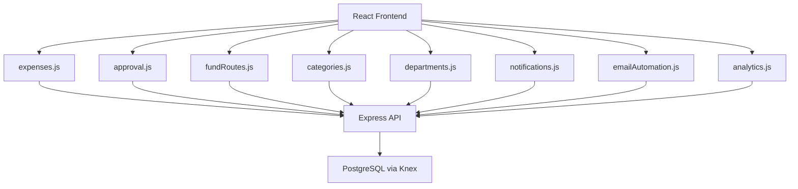
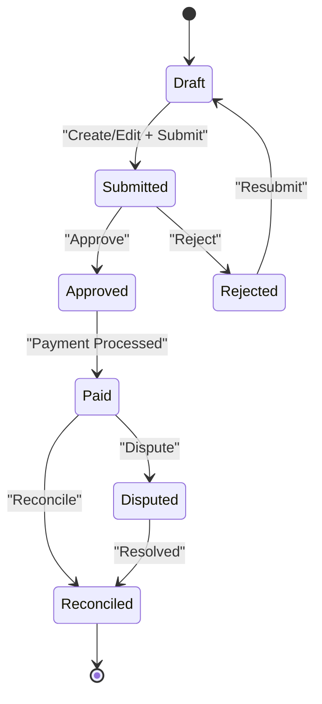
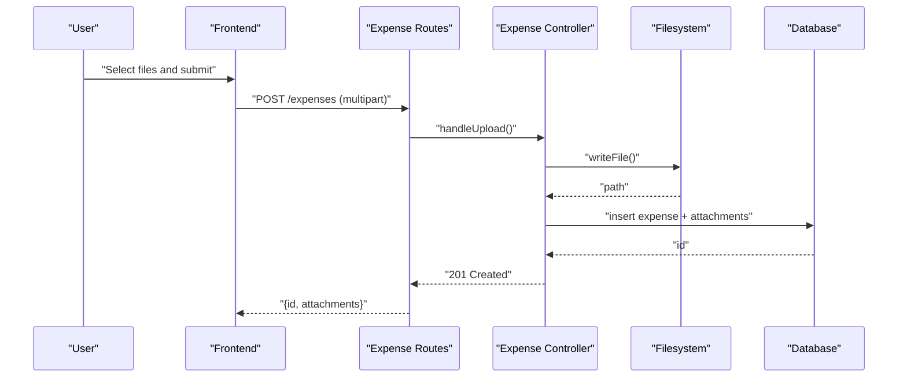
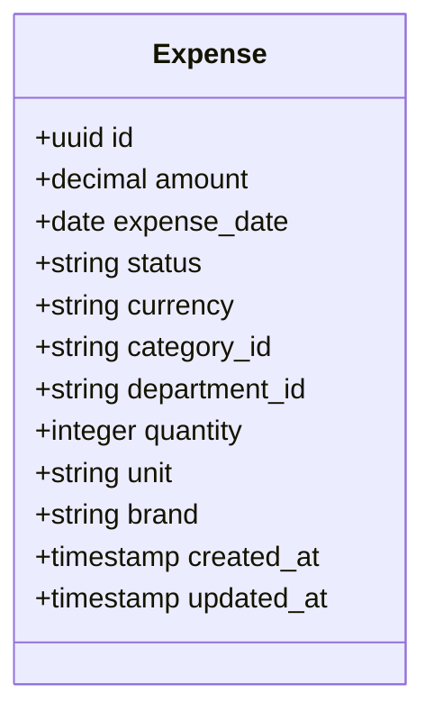
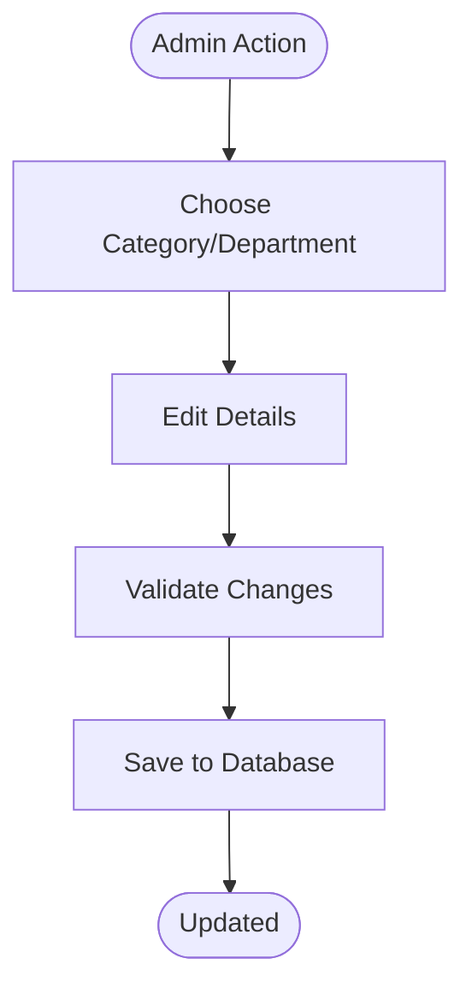
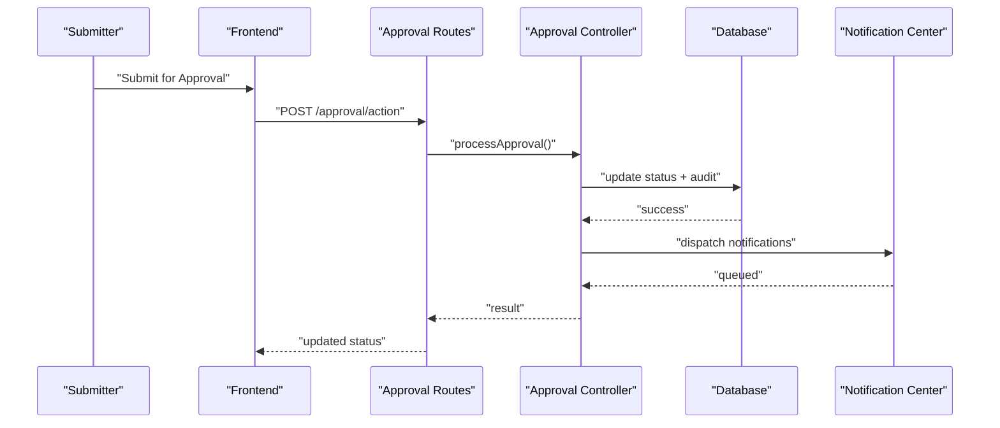
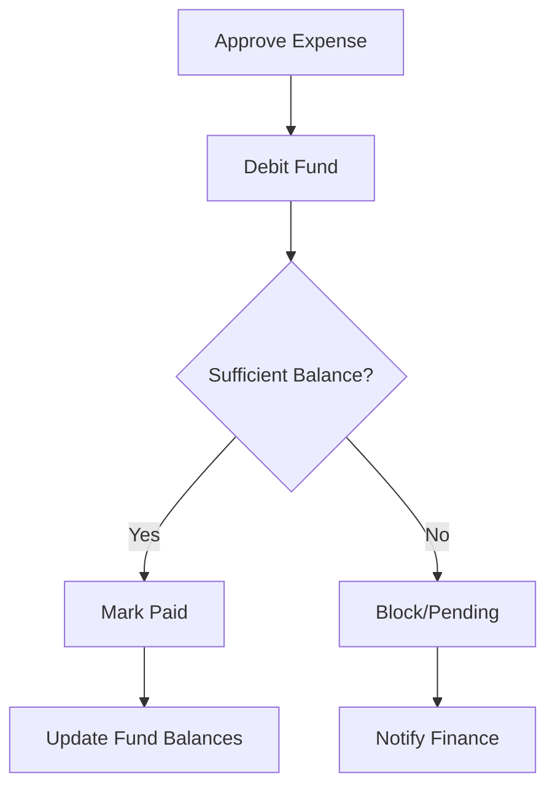
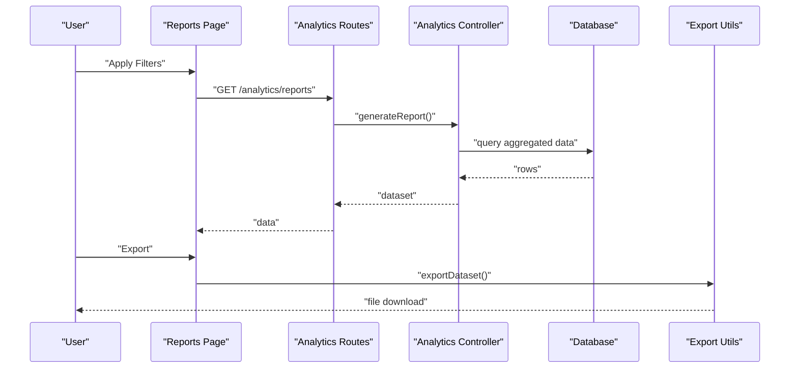
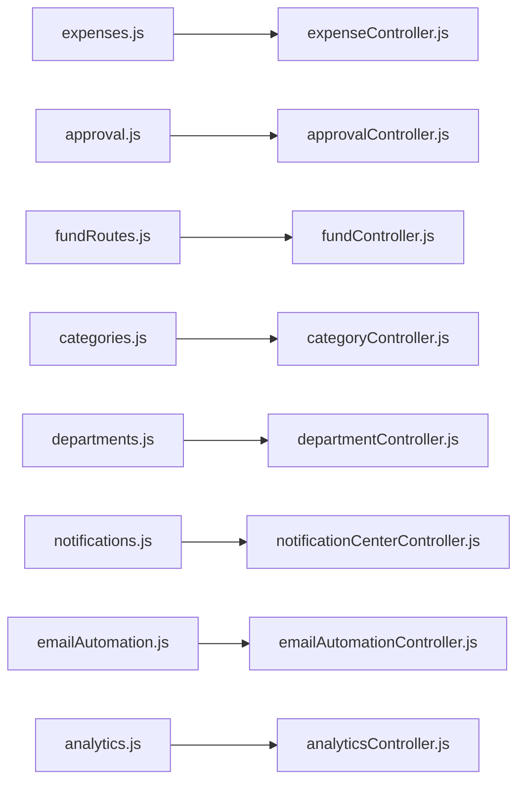

# Expense Management System

<cite>
**Referenced Files in This Document**
- [expenseController.js](file://backend/src/controllers/expenseController.js)
- [expenses.js](file://backend/src/routes/expenses.js)
- [approvalController.js](file://backend/src/controllers/approvalController.js)
- [approval.js](file://backend/src/routes/approval.js)
- [fundController.js](file://backend/src/controllers/fundController.js)
- [fundRoutes.js](file://backend/src/routes/fundRoutes.js)
- [categoryController.js](file://backend/src/controllers/categoryController.js)
- [categories.js](file://backend/src/routes/categories.js)
- [departmentController.js](file://backend/src/controllers/departmentController.js)
- [departments.js](file://backend/src/routes/departments.js)
- [emailAutomationController.js](file://backend/src/controllers/emailAutomationController.js)
- [emailAutomation.js](file://backend/src/routes/emailAutomation.js)
- [notificationCenterController.js](file://backend/src/controllers/notificationCenterController.js)
- [notifications.js](file://backend/src/routes/notifications.js)
- [analyticsController.js](file://backend/src/controllers/analyticsController.js)
- [analytics.js](file://backend/src/routes/analytics.js)
- [20260512080000_add_quantity_unit_to_expenses.js](file://backend/src/db/migrations/20260512080000_add_quantity_unit_to_expenses.js)
- [20260512080100_add_brand_to_expenses.js](file://backend/src/db/migrations/20260512080100_add_brand_to_expenses.js)
- [20260529120000_add_expense_units_setting.js](file://backend/src/db/migrations/20260529120000_add_expense_units_setting.js)
- [20260611010000_fix_expense_status_varchar.js](file://backend/src/db/migrations/20260611010000_fix_expense_status_varchar.js)
- [20260611000000_add_liquidation_approval_workflow.js](file://backend/src/db/migrations/20260611000000_add_liquidation_approval_workflow.js)
- [20260515064955_add_notifications_and_email_system.js](file://backend/src/db/migrations/20260515064955_add_notifications_and_email_system.js)
- [20260517090000_create_notification_center_tables.js](file://backend/src/db/migrations/20260517090000_create_notification_center_tables.js)
- [20260512000000_initial_schema.js](file://backend/src/db/migrations/20260512000000_initial_schema.js)
- [Expenses.jsx](file://frontend/src/pages/Expenses.jsx)
- [Reports.jsx](file://frontend/src/pages/Reports.jsx)
- [Funds.jsx](file://frontend/src/pages/Funds.jsx)
- [Categories.jsx](file://frontend/src/pages/Categories.jsx)
- [Departments.jsx](file://frontend/src/pages/Departments.jsx)
- [ApprovalAction.jsx](file://frontend/src/pages/ApprovalAction.jsx)
- [Analytics.jsx](file://frontend/src/pages/Analytics.jsx)
- [exportUtils.js](file://frontend/src/utils/exportUtils.js)
- [api.js](file://frontend/src/services/api.js)
- [AuthContext.jsx](file://frontend/src/context/AuthContext.jsx)
- [NotificationCenter.jsx](file://frontend/src/components/NotificationCenter.jsx)
- [index.js](file://backend/src/index.js)
- [knexfile.js](file://backend/knexfile.js)
- [README.md](file://README.md)
- [USER_MANUAL.md](file://USER_MANUAL.md)
- [deployment_guide.md](file://deployment_guide.md)
</cite>

## Table of Contents
1. [Introduction](#introduction)
2. [Project Structure](#project-structure)
3. [Core Components](#core-components)
4. [Architecture Overview](#architecture-overview)
5. [Detailed Component Analysis](#detailed-component-analysis)
6. [Dependency Analysis](#dependency-analysis)
7. [Performance Considerations](#performance-considerations)
8. [Troubleshooting Guide](#troubleshooting-guide)
9. [Conclusion](#conclusion)
10. [Appendices](#appendices)

## Introduction
This document describes a comprehensive expense management system built with a modern backend API and a React-based frontend. It covers expense creation, editing, deletion, and status tracking; attachment handling and document management; search and filtering; bulk operations; validation; status lifecycle and approvals; audit trails; quantity/unit support; brand tracking; categorization; reporting and export; and fund management integration. Practical scenarios and administrative workflows are included to guide both users and administrators.

## Project Structure
The system follows a layered architecture:
- Backend: Node.js with Express, database via Knex.js, modular controllers, routes, services, and migrations.
- Frontend: React SPA with page components, shared services, utilities, and context providers.
- Shared concerns: Authentication, notifications, email automation, and analytics.

```mermaid
graph TB
subgraph "Backend"
IDX["index.js"]
CFG["knexfile.js"]
ROUTE_EXP["routes/expenses.js"]
CTRL_EXP["controllers/expenseController.js"]
ROUTE_APP["routes/approval.js"]
CTRL_APP["controllers/approvalController.js"]
ROUTE_FUND["routes/fundRoutes.js"]
CTRL_FUND["controllers/fundController.js"]
ROUTE_CAT["routes/categories.js"]
CTRL_CAT["controllers/categoryController.js"]
ROUTE_DEPT["routes/departments.js"]
CTRL_DEPT["controllers/departmentController.js"]
ROUTE_NOTIF["routes/notifications.js"]
CTRL_NOTIF["controllers/notificationCenterController.js"]
ROUTE_EMAIL["routes/emailAutomation.js"]
CTRL_EMAIL["controllers/emailAutomationController.js"]
ROUTE_ANALYTICS["routes/analytics.js"]
CTRL_ANALYTICS["controllers/analyticsController.js"]
end
subgraph "Frontend"
FE_EXP["pages/Expenses.jsx"]
FE_REPORT["pages/Reports.jsx"]
FE_FUNDS["pages/Funds.jsx"]
FE_CATEGORIES["pages/Categories.jsx"]
FE_DEPARTMENTS["pages/Departments.jsx"]
FE_APPROVAL["pages/ApprovalAction.jsx"]
FE_ANALYTICS["pages/Analytics.jsx"]
FE_API["services/api.js"]
FE_CTX["context/AuthContext.jsx"]
FE_NOTIF["components/NotificationCenter.jsx"]
FE_EXPORT["utils/exportUtils.js"]
end
FE_EXP --> FE_API
FE_REPORT --> FE_API
FE_FUNDS --> FE_API
FE_CATEGORIES --> FE_API
FE_DEPARTMENTS --> FE_API
FE_APPROVAL --> FE_API
FE_ANALYTICS --> FE_API
FE_API --> IDX
ROUTE_EXP --> CTRL_EXP
ROUTE_APP --> CTRL_APP
ROUTE_FUND --> CTRL_FUND
ROUTE_CAT --> CTRL_CAT
ROUTE_DEPT --> CTRL_DEPT
ROUTE_NOTIF --> CTRL_NOTIF
ROUTE_EMAIL --> CTRL_EMAIL
ROUTE_ANALYTICS --> CTRL_ANALYTICS
```

**Diagram sources**
- [index.js](file://backend/src/index.js)
- [expenses.js](file://backend/src/routes/expenses.js)
- [expenseController.js](file://backend/src/controllers/expenseController.js)
- [approval.js](file://backend/src/routes/approval.js)
- [approvalController.js](file://backend/src/controllers/approvalController.js)
- [fundRoutes.js](file://backend/src/routes/fundRoutes.js)
- [fundController.js](file://backend/src/controllers/fundController.js)
- [categories.js](file://backend/src/routes/categories.js)
- [categoryController.js](file://backend/src/controllers/categoryController.js)
- [departments.js](file://backend/src/routes/departments.js)
- [departmentController.js](file://backend/src/controllers/departmentController.js)
- [notifications.js](file://backend/src/routes/notifications.js)
- [notificationCenterController.js](file://backend/src/controllers/notificationCenterController.js)
- [emailAutomation.js](file://backend/src/routes/emailAutomation.js)
- [emailAutomationController.js](file://backend/src/controllers/emailAutomationController.js)
- [analytics.js](file://backend/src/routes/analytics.js)
- [analyticsController.js](file://backend/src/controllers/analyticsController.js)
- [Expenses.jsx](file://frontend/src/pages/Expenses.jsx)
- [Reports.jsx](file://frontend/src/pages/Reports.jsx)
- [Funds.jsx](file://frontend/src/pages/Funds.jsx)
- [Categories.jsx](file://frontend/src/pages/Categories.jsx)
- [Departments.jsx](file://frontend/src/pages/Departments.jsx)
- [ApprovalAction.jsx](file://frontend/src/pages/ApprovalAction.jsx)
- [Analytics.jsx](file://frontend/src/pages/Analytics.jsx)
- [api.js](file://frontend/src/services/api.js)
- [AuthContext.jsx](file://frontend/src/context/AuthContext.jsx)
- [NotificationCenter.jsx](file://frontend/src/components/NotificationCenter.jsx)
- [exportUtils.js](file://frontend/src/utils/exportUtils.js)

**Section sources**
- [index.js](file://backend/src/index.js)
- [knexfile.js](file://backend/knexfile.js)

## Core Components
- Expense Management: CRUD operations, status transitions, attachments, search/filter, bulk actions, validation.
- Approvals: Liquidation workflow, approval routing, notifications.
- Fund Management: Budget allocation, spending tracking, liquidation.
- Categorization & Departments: Classification and organizational units.
- Reporting & Analytics: Insights, filters, exports.
- Notifications & Email Automation: Audit trails, reminders, and automated emails.
- Frontend Pages: Expense list, reports, funds, categories, departments, approvals, analytics.

**Section sources**
- [expenseController.js](file://backend/src/controllers/expenseController.js)
- [expenses.js](file://backend/src/routes/expenses.js)
- [approvalController.js](file://backend/src/controllers/approvalController.js)
- [approval.js](file://backend/src/routes/approval.js)
- [fundController.js](file://backend/src/controllers/fundController.js)
- [fundRoutes.js](file://backend/src/routes/fundRoutes.js)
- [categoryController.js](file://backend/src/controllers/categoryController.js)
- [categories.js](file://backend/src/routes/categories.js)
- [departmentController.js](file://backend/src/controllers/departmentController.js)
- [departments.js](file://backend/src/routes/departments.js)
- [notificationCenterController.js](file://backend/src/controllers/notificationCenterController.js)
- [notifications.js](file://backend/src/routes/notifications.js)
- [emailAutomationController.js](file://backend/src/controllers/emailAutomationController.js)
- [emailAutomation.js](file://backend/src/routes/emailAutomation.js)
- [analyticsController.js](file://backend/src/controllers/analyticsController.js)
- [analytics.js](file://backend/src/routes/analytics.js)
- [Expenses.jsx](file://frontend/src/pages/Expenses.jsx)
- [Reports.jsx](file://frontend/src/pages/Reports.jsx)
- [Funds.jsx](file://frontend/src/pages/Funds.jsx)
- [Categories.jsx](file://frontend/src/pages/Categories.jsx)
- [Departments.jsx](file://frontend/src/pages/Departments.jsx)
- [ApprovalAction.jsx](file://frontend/src/pages/ApprovalAction.jsx)
- [Analytics.jsx](file://frontend/src/pages/Analytics.jsx)
- [exportUtils.js](file://frontend/src/utils/exportUtils.js)
- [api.js](file://frontend/src/services/api.js)

## Architecture Overview
The backend exposes REST endpoints grouped by domain (expenses, approvals, funds, categories, departments, notifications, analytics). Controllers handle requests, enforce validation, and orchestrate service logic. Migrations define evolving schemas including quantity/unit and brand fields, plus approval workflow and notification infrastructure. The frontend consumes the API through a shared service layer, rendering domain-specific pages and providing export utilities.

**Diagram sources**
- [expenses.js](file://backend/src/routes/expenses.js)
- [approval.js](file://backend/src/routes/approval.js)
- [fundRoutes.js](file://backend/src/routes/fundRoutes.js)
- [categories.js](file://backend/src/routes/categories.js)
- [departments.js](file://backend/src/routes/departments.js)
- [notifications.js](file://backend/src/routes/notifications.js)
- [emailAutomation.js](file://backend/src/routes/emailAutomation.js)
- [analytics.js](file://backend/src/routes/analytics.js)
- [index.js](file://backend/src/index.js)

## Detailed Component Analysis

### Expense Lifecycle and Status Tracking
- Creation: POST endpoint accepts expense payload including amount, date, category, department, optional quantity/unit, brand, and attachments.
- Editing: PUT endpoint updates mutable fields with validation.
- Deletion: DELETE endpoint removes records with cascade considerations for attachments and audit entries.
- Status tracking: Enumerated statuses evolve through submission, approval, payment, and reconciliation stages. A migration adjusts status storage type for consistency.
- Attachments: Files uploaded via multipart/form-data; stored under a configured uploads directory; metadata persisted with the expense record.
- Search and filtering: Query parameters enable filtering by status, date range, category, department, amount thresholds, and free-text search.
- Bulk operations: Batch update endpoints adjust statuses or categories in bulk with validation and audit logging.
- Validation: Server-side checks ensure required fields, numeric bounds, date ranges, and attachment constraints; client-side helpers improve UX.
- Audit trail: All mutations logged with timestamps, actor identifiers, and change descriptions.

**Diagram sources**
- [20260611010000_fix_expense_status_varchar.js](file://backend/src/db/migrations/20260611010000_fix_expense_status_varchar.js)
- [20260611000000_add_liquidation_approval_workflow.js](file://backend/src/db/migrations/20260611000000_add_liquidation_approval_workflow.js)

**Section sources**
- [expenseController.js](file://backend/src/controllers/expenseController.js)
- [expenses.js](file://backend/src/routes/expenses.js)
- [20260611010000_fix_expense_status_varchar.js](file://backend/src/db/migrations/20260611010000_fix_expense_status_varchar.js)
- [20260611000000_add_liquidation_approval_workflow.js](file://backend/src/db/migrations/20260611000000_add_liquidation_approval_workflow.js)

### Attachment Handling and Document Management
- Upload process: Multipart form submission with file parts; server validates MIME types and sizes; stores files and persists metadata (filename, path, MIME, size).
- Retrieval: Download endpoints serve stored files with appropriate headers; access controlled by authentication and authorization.
- Deletion: On expense removal, associated documents are cleaned up; soft-deleted records maintain referential integrity for audit.
- Security: Uploads restricted to authenticated users; filename sanitization prevents path traversal; configurable max size and allowed types.

**Diagram sources**
- [expenses.js](file://backend/src/routes/expenses.js)
- [expenseController.js](file://backend/src/controllers/expenseController.js)

**Section sources**
- [expenses.js](file://backend/src/routes/expenses.js)
- [expenseController.js](file://backend/src/controllers/expenseController.js)

### Quantity, Units, and Brand Support
- Fields: Expenses support quantity and unit-of-measure, plus brand information for tracking procurement specifics.
- Settings: Unit preferences can be configured centrally to standardize reporting.
- Validation: Quantity must be numeric; units validated against configured settings; brand is optional but tracked.

**Diagram sources**
- [20260512080000_add_quantity_unit_to_expenses.js](file://backend/src/db/migrations/20260512080000_add_quantity_unit_to_expenses.js)
- [20260512080100_add_brand_to_expenses.js](file://backend/src/db/migrations/20260512080100_add_brand_to_expenses.js)
- [20260529120000_add_expense_units_setting.js](file://backend/src/db/migrations/20260529120000_add_expense_units_setting.js)

**Section sources**
- [20260512080000_add_quantity_unit_to_expenses.js](file://backend/src/db/migrations/20260512080000_add_quantity_unit_to_expenses.js)
- [20260512080100_add_brand_to_expenses.js](file://backend/src/db/migrations/20260512080100_add_brand_to_expenses.js)
- [20260529120000_add_expense_units_setting.js](file://backend/src/db/migrations/20260529120000_add_expense_units_setting.js)

### Categorization and Department Organization
- Categories: Hierarchical or flat classification; used for reporting and budgeting alignment.
- Departments: Organizational units; expenses linked to departments for cost-center accounting.
- Maintenance: Separate admin endpoints for managing categories and departments; cascading effects considered during deletions.

**Diagram sources**
- [categories.js](file://backend/src/routes/categories.js)
- [categoryController.js](file://backend/src/controllers/categoryController.js)
- [departments.js](file://backend/src/routes/departments.js)
- [departmentController.js](file://backend/src/controllers/departmentController.js)

**Section sources**
- [categories.js](file://backend/src/routes/categories.js)
- [categoryController.js](file://backend/src/controllers/categoryController.js)
- [departments.js](file://backend/src/routes/departments.js)
- [departmentController.js](file://backend/src/controllers/departmentController.js)

### Approvals and Audit Trail
- Workflow: Submission triggers approval routing; approvers receive notifications; decisions update status and log changes.
- Audit: Every mutation captures actor, timestamp, and change details; notifications dispatched per policy.
- Liquidation: Specialized workflow supports expense settlement and fund reconciliation.

**Diagram sources**
- [approval.js](file://backend/src/routes/approval.js)
- [approvalController.js](file://backend/src/controllers/approvalController.js)
- [20260611000000_add_liquidation_approval_workflow.js](file://backend/src/db/migrations/20260611000000_add_liquidation_approval_workflow.js)
- [20260515064955_add_notifications_and_email_system.js](file://backend/src/db/migrations/20260515064955_add_notifications_and_email_system.js)
- [20260517090000_create_notification_center_tables.js](file://backend/src/db/migrations/20260517090000_create_notification_center_tables.js)

**Section sources**
- [approval.js](file://backend/src/routes/approval.js)
- [approvalController.js](file://backend/src/controllers/approvalController.js)
- [20260611000000_add_liquidation_approval_workflow.js](file://backend/src/db/migrations/20260611000000_add_liquidation_approval_workflow.js)
- [20260515064955_add_notifications_and_email_system.js](file://backend/src/db/migrations/20260515064955_add_notifications_and_email_system.js)
- [20260517090000_create_notification_center_tables.js](file://backend/src/db/migrations/20260517090000_create_notification_center_tables.js)

### Fund Management Integration
- Budget tracking: Funds allocated per category/department; expenses consume budgets upon approval.
- Liquidation: Settlement process reconciles paid expenses against available funds; remaining balances reported.
- Reporting: Fund utilization dashboards and alerts for overruns.

**Diagram sources**
- [fundRoutes.js](file://backend/src/routes/fundRoutes.js)
- [fundController.js](file://backend/src/controllers/fundController.js)
- [20260611000000_add_liquidation_approval_workflow.js](file://backend/src/db/migrations/20260611000000_add_liquidation_approval_workflow.js)

**Section sources**
- [fundRoutes.js](file://backend/src/routes/fundRoutes.js)
- [fundController.js](file://backend/src/controllers/fundController.js)

### Reporting, Export, and Analytics
- Reports: By category, department, time range, status, and fund utilization.
- Export: CSV/Excel via frontend utilities; includes filtered datasets and computed summaries.
- Analytics: Trends, spend patterns, top vendors (brand), and budget variance.

**Diagram sources**
- [analytics.js](file://backend/src/routes/analytics.js)
- [analyticsController.js](file://backend/src/controllers/analyticsController.js)
- [Reports.jsx](file://frontend/src/pages/Reports.jsx)
- [exportUtils.js](file://frontend/src/utils/exportUtils.js)

**Section sources**
- [analytics.js](file://backend/src/routes/analytics.js)
- [analyticsController.js](file://backend/src/controllers/analyticsController.js)
- [Reports.jsx](file://frontend/src/pages/Reports.jsx)
- [exportUtils.js](file://frontend/src/utils/exportUtils.js)

### Frontend Pages and Workflows
- Expenses: List, create, edit, delete, approve/reject actions, search/filter, bulk operations.
- Reports: Filtered views and export.
- Funds: View balances, allocations, and liquidation status.
- Categories/Departments: Manage classifications and organizational units.
- Approval Action: Dedicated page for approvers to review and act on pending items.
- Analytics: Visualizations and trend analysis.
- Notifications: Central inbox for system messages and alerts.
- Authentication: Protected routes and context-aware rendering.

**Section sources**
- [Expenses.jsx](file://frontend/src/pages/Expenses.jsx)
- [Reports.jsx](file://frontend/src/pages/Reports.jsx)
- [Funds.jsx](file://frontend/src/pages/Funds.jsx)
- [Categories.jsx](file://frontend/src/pages/Categories.jsx)
- [Departments.jsx](file://frontend/src/pages/Departments.jsx)
- [ApprovalAction.jsx](file://frontend/src/pages/ApprovalAction.jsx)
- [Analytics.jsx](file://frontend/src/pages/Analytics.jsx)
- [NotificationCenter.jsx](file://frontend/src/components/NotificationCenter.jsx)
- [AuthContext.jsx](file://frontend/src/context/AuthContext.jsx)
- [api.js](file://frontend/src/services/api.js)

## Dependency Analysis
- Controllers depend on route handlers and internal services.
- Routes define HTTP contracts and delegate to controllers.
- Migrations evolve the schema; careful ordering ensures backward compatibility.
- Frontend pages depend on the shared API service and context providers.

**Diagram sources**
- [expenses.js](file://backend/src/routes/expenses.js)
- [expenseController.js](file://backend/src/controllers/expenseController.js)
- [approval.js](file://backend/src/routes/approval.js)
- [approvalController.js](file://backend/src/controllers/approvalController.js)
- [fundRoutes.js](file://backend/src/routes/fundRoutes.js)
- [fundController.js](file://backend/src/controllers/fundController.js)
- [categories.js](file://backend/src/routes/categories.js)
- [categoryController.js](file://backend/src/controllers/categoryController.js)
- [departments.js](file://backend/src/routes/departments.js)
- [departmentController.js](file://backend/src/controllers/departmentController.js)
- [notifications.js](file://backend/src/routes/notifications.js)
- [notificationCenterController.js](file://backend/src/controllers/notificationCenterController.js)
- [emailAutomation.js](file://backend/src/routes/emailAutomation.js)
- [emailAutomationController.js](file://backend/src/controllers/emailAutomationController.js)
- [analytics.js](file://backend/src/routes/analytics.js)
- [analyticsController.js](file://backend/src/controllers/analyticsController.js)

**Section sources**
- [expenses.js](file://backend/src/routes/expenses.js)
- [expenseController.js](file://backend/src/controllers/expenseController.js)
- [approval.js](file://backend/src/routes/approval.js)
- [approvalController.js](file://backend/src/controllers/approvalController.js)
- [fundRoutes.js](file://backend/src/routes/fundRoutes.js)
- [fundController.js](file://backend/src/controllers/fundController.js)
- [categories.js](file://backend/src/routes/categories.js)
- [categoryController.js](file://backend/src/controllers/categoryController.js)
- [departments.js](file://backend/src/routes/departments.js)
- [departmentController.js](file://backend/src/controllers/departmentController.js)
- [notifications.js](file://backend/src/routes/notifications.js)
- [notificationCenterController.js](file://backend/src/controllers/notificationCenterController.js)
- [emailAutomation.js](file://backend/src/routes/emailAutomation.js)
- [emailAutomationController.js](file://backend/src/controllers/emailAutomationController.js)
- [analytics.js](file://backend/src/routes/analytics.js)
- [analyticsController.js](file://backend/src/controllers/analyticsController.js)

## Performance Considerations
- Indexes: Add database indexes on frequently queried columns (status, date, category_id, department_id) to optimize search/filter queries.
- Pagination: Implement server-side pagination for large lists to reduce payload sizes.
- File storage: Use cloud storage for attachments to offload filesystem I/O; implement CDN caching for downloads.
- Caching: Cache static configurations (units, categories) and recent report results with TTL.
- Background jobs: Move heavy export generation and notification dispatch to background workers.

## Troubleshooting Guide
- Authentication failures: Verify tokens and session state; check protected routes and context provider.
- Upload errors: Confirm allowed MIME types and sizes; inspect filesystem permissions and disk space.
- Approval issues: Review notification delivery and workflow steps; check audit logs for missing transitions.
- Report discrepancies: Validate filters, date ranges, and currency conversions; confirm aggregation logic.
- Database connectivity: Check Knex configuration and connection pool settings.

**Section sources**
- [AuthContext.jsx](file://frontend/src/context/AuthContext.jsx)
- [api.js](file://frontend/src/services/api.js)
- [20260515064955_add_notifications_and_email_system.js](file://backend/src/db/migrations/20260515064955_add_notifications_and_email_system.js)
- [20260517090000_create_notification_center_tables.js](file://backend/src/db/migrations/20260517090000_create_notification_center_tables.js)

## Conclusion
This system provides a robust foundation for managing expenses end-to-end, from creation and approval to fund reconciliation and reporting. Its modular backend and React frontend enable extensibility, while migrations and notifications ensure operational reliability. Administrators can configure categories, departments, units, and approval workflows, while end users benefit from intuitive forms, powerful search/filter, and timely notifications.

## Appendices

### Practical Scenarios and Administrative Workflows
- Creating an expense with attachments:
  - Navigate to the Expenses page, fill in vendor, amount, date, category, and department; optionally set quantity/unit and brand; attach receipts; submit for approval.
- Bulk approval:
  - Select multiple pending expenses, choose approve or reject, and apply; system updates statuses and notifies stakeholders.
- Managing categories and departments:
  - Use dedicated admin pages to add/update/remove classifications and organizational units; ensure no orphaned expenses remain.
- Fund liquidation:
  - After approval, reconcile paid expenses against allocated funds; monitor remaining balances and set alerts for overruns.
- Generating reports:
  - Apply filters (time range, category, department), run analytics, and export to CSV/Excel for stakeholder review.
- Email and notification policies:
  - Configure templates and recipients; ensure timely reminders for pending approvals and audit trail notifications.

**Section sources**
- [Expenses.jsx](file://frontend/src/pages/Expenses.jsx)
- [Reports.jsx](file://frontend/src/pages/Reports.jsx)
- [Funds.jsx](file://frontend/src/pages/Funds.jsx)
- [Categories.jsx](file://frontend/src/pages/Categories.jsx)
- [Departments.jsx](file://frontend/src/pages/Departments.jsx)
- [ApprovalAction.jsx](file://frontend/src/pages/ApprovalAction.jsx)
- [Analytics.jsx](file://frontend/src/pages/Analytics.jsx)
- [emailAutomationController.js](file://backend/src/controllers/emailAutomationController.js)
- [notificationCenterController.js](file://backend/src/controllers/notificationCenterController.js)

### Schema Evolution Highlights
- Initial schema establishes core entities and relationships.
- Quantity/unit and brand fields enhance procurement tracking.
- Expense units setting centralizes unit configuration.
- Status storage normalized for reliable workflow transitions.
- Approval workflow and notification infrastructure integrated.

**Section sources**
- [20260512000000_initial_schema.js](file://backend/src/db/migrations/20260512000000_initial_schema.js)
- [20260512080000_add_quantity_unit_to_expenses.js](file://backend/src/db/migrations/20260512080000_add_quantity_unit_to_expenses.js)
- [20260512080100_add_brand_to_expenses.js](file://backend/src/db/migrations/20260512080100_add_brand_to_expenses.js)
- [20260529120000_add_expense_units_setting.js](file://backend/src/db/migrations/20260529120000_add_expense_units_setting.js)
- [20260611010000_fix_expense_status_varchar.js](file://backend/src/db/migrations/20260611010000_fix_expense_status_varchar.js)
- [20260611000000_add_liquidation_approval_workflow.js](file://backend/src/db/migrations/20260611000000_add_liquidation_approval_workflow.js)
- [20260515064955_add_notifications_and_email_system.js](file://backend/src/db/migrations/20260515064955_add_notifications_and_email_system.js)
- [20260517090000_create_notification_center_tables.js](file://backend/src/db/migrations/20260517090000_create_notification_center_tables.js)