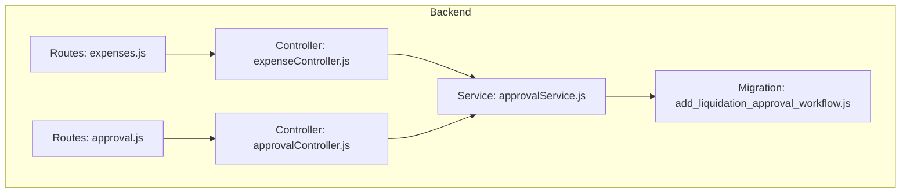
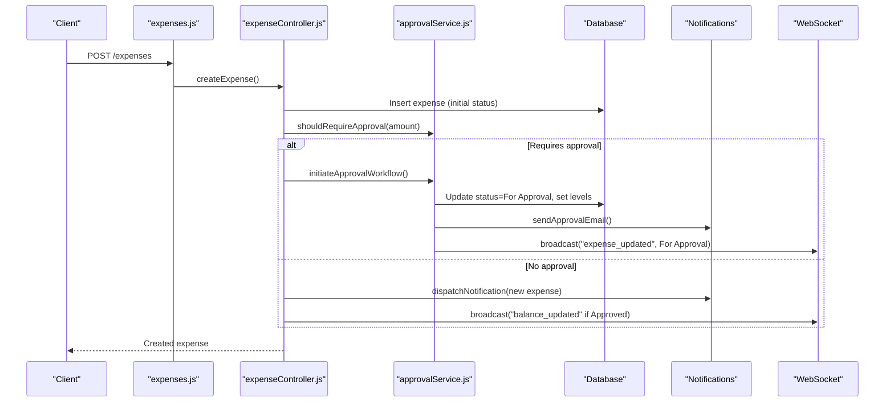
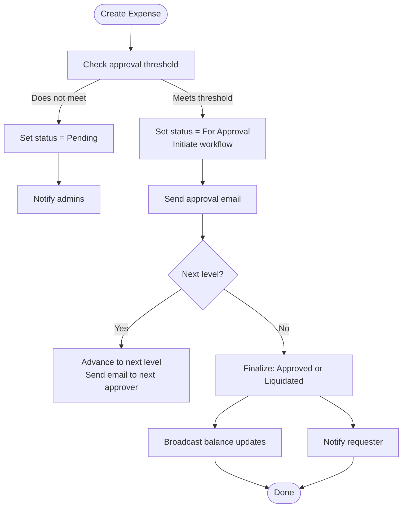
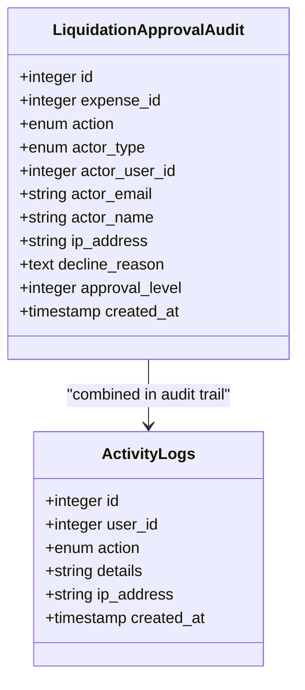
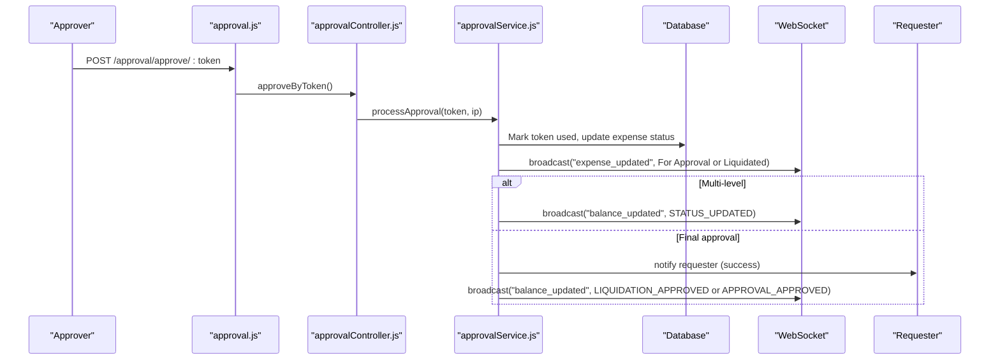
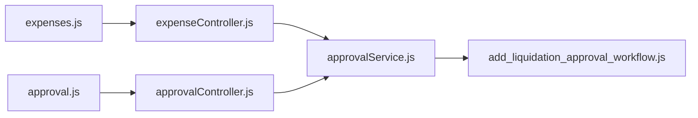

# Expense Status Tracking

<cite>
**Referenced Files in This Document**
- [expenseController.js](file://backend/src/controllers/expenseController.js)
- [approvalController.js](file://backend/src/controllers/approvalController.js)
- [approvalService.js](file://backend/src/services/approvalService.js)
- [expenses.js](file://backend/src/routes/expenses.js)
- [approval.js](file://backend/src/routes/approval.js)
- [20260611000000_add_liquidation_approval_workflow.js](file://backend/src/db/migrations/20260611000000_add_liqudation_approval_workflow.js)
</cite>

## Table of Contents
1. [Introduction](#introduction)
2. [Project Structure](#project-structure)
3. [Core Components](#core-components)
4. [Architecture Overview](#architecture-overview)
5. [Detailed Component Analysis](#detailed-component-analysis)
6. [Dependency Analysis](#dependency-analysis)
7. [Performance Considerations](#performance-considerations)
8. [Troubleshooting Guide](#troubleshooting-guide)
9. [Conclusion](#conclusion)

## Introduction
This document describes the expense status tracking and lifecycle management system. It covers all expense states (Pending, For Approval, Approved, Rejected, Liquidated), status transition rules, approval threshold enforcement, automatic status changes, audit trails, notifications, and real-time updates via WebSocket broadcasts. It also documents status-dependent workflows, fund balance adjustments, and practical examples of transitions and system responses.

## Project Structure
The expense lifecycle spans controllers, services, routes, and database migrations that define the approval workflow and status management.

**Diagram sources**
- [expenses.js:1-49](file://backend/src/routes/expenses.js#L1-L49)
- [approval.js:1-36](file://backend/src/routes/approval.js#L1-L36)
- [expenseController.js:1-358](file://backend/src/controllers/expenseController.js#L1-L358)
- [approvalController.js:1-108](file://backend/src/controllers/approvalController.js#L1-L108)
- [approvalService.js:1-590](file://backend/src/services/approvalService.js#L1-L590)
- [20260611000000_add_liquidation_approval_workflow.js:1-179](file://backend/src/db/migrations/20260611000000_add_liquidation_approval_workflow.js#L1-L179)

**Section sources**
- [expenses.js:1-49](file://backend/src/routes/expenses.js#L1-L49)
- [approval.js:1-36](file://backend/src/routes/approval.js#L1-L36)
- [expenseController.js:1-358](file://backend/src/controllers/expenseController.js#L1-L358)
- [approvalController.js:1-108](file://backend/src/controllers/approvalController.js#L1-L108)
- [approvalService.js:1-590](file://backend/src/services/approvalService.js#L1-L590)
- [20260611000000_add_liquidation_approval_workflow.js:1-179](file://backend/src/db/migrations/20260611000000_add_liquidation_approval_workflow.js#L1-L179)

## Core Components
- Expense controller handles creation, retrieval, updates, deletion, and status changes for expenses, including automatic approval initiation and broadcasting.
- Approval controller exposes endpoints for token verification and processing approvals/declines, plus admin settings and approver management.
- Approval service encapsulates approval thresholds, multi-level approval workflows, token generation and validation, audit logging, email dispatch, and WebSocket broadcasts.
- Routes define protected and public endpoints for expenses and approvals.
- Migration defines schema changes for status tracking, approval tokens, approvers, and audit tables.

Key responsibilities:
- Enforce approval thresholds and initiate multi-level approval workflows.
- Record audit trail entries for created/submitted/approved/declined actions.
- Send notifications and emails to requesters and approvers.
- Broadcast real-time updates for balance changes and status updates.
- Support liquidation-specific approval context and transitions.

**Section sources**
- [expenseController.js:105-211](file://backend/src/controllers/expenseController.js#L105-L211)
- [approvalController.js:61-98](file://backend/src/controllers/approvalController.js#L61-L98)
- [approvalService.js:114-117](file://backend/src/services/approvalService.js#L114-L117)
- [expenses.js:41-46](file://backend/src/routes/expenses.js#L41-L46)
- [approval.js:17-21](file://backend/src/routes/approval.js#L17-L21)

## Architecture Overview
The system integrates REST endpoints, approval workflows, notifications, and real-time updates.

**Diagram sources**
- [expenses.js:41-46](file://backend/src/routes/expenses.js#L41-L46)
- [expenseController.js:105-211](file://backend/src/controllers/expenseController.js#L105-L211)
- [approvalService.js:292-327](file://backend/src/services/approvalService.js#L292-L327)

## Detailed Component Analysis

### Expense States and Transitions
Supported states:
- Pending
- For Approval
- Approved
- Rejected
- Liquidated

Transition rules:
- Creation:
  - If amount meets or exceeds threshold → status becomes For Approval; approval workflow initiated.
  - Otherwise → status remains Pending; admin notifications dispatched.
- Manual status update:
  - Approved/Rejected/Liquidated transitions trigger notifications and balance updates.
  - Liquidation requests from Approved state that exceed threshold are intercepted and sent for email approval.
- Deletion:
  - Removes related tokens/audit and broadcasts balance and status updates.

**Diagram sources**
- [expenseController.js:105-211](file://backend/src/controllers/expenseController.js#L105-L211)
- [approvalService.js:292-509](file://backend/src/services/approvalService.js#L292-L509)

**Section sources**
- [expenseController.js:105-211](file://backend/src/controllers/expenseController.js#L105-L211)
- [approvalService.js:114-117](file://backend/src/services/approvalService.js#L114-L117)
- [20260611000000_add_liquidation_approval_workflow.js:1-179](file://backend/src/db/migrations/20260611000000_add_liquidation_approval_workflow.js#L1-L179)

### Approval Threshold Enforcement
- Threshold is stored in settings and compared against expense amount during creation and liquidation status changes.
- When threshold is met, the system initiates a multi-level approval workflow and sends email tokens to the appropriate approver(s).

Practical example:
- An expense with amount equal to or greater than the threshold is created → automatically set to For Approval and an approval email is sent to the current level’s approver.

**Section sources**
- [approvalService.js:114-117](file://backend/src/services/approvalService.js#L114-L117)
- [approvalService.js:292-327](file://backend/src/services/approvalService.js#L292-L327)
- [expenseController.js:105-135](file://backend/src/controllers/expenseController.js#L105-L135)

### Audit Trail Functionality
- Tracks created, submitted, approved, and declined actions with actor type, IP address, approval level, and optional decline reason.
- Retrieves combined audit trail including activity logs for creation and dedicated approval audit records.

**Diagram sources**
- [20260611000000_add_liquidation_approval_workflow.js:47-62](file://backend/src/db/migrations/20260611000000_add_liquidation_approval_workflow.js#L47-L62)
- [approvalService.js:161-214](file://backend/src/services/approvalService.js#L161-L214)

**Section sources**
- [approvalService.js:119-143](file://backend/src/services/approvalService.js#L119-L143)
- [approvalService.js:161-214](file://backend/src/services/approvalService.js#L161-L214)

### Status Change Notifications and Real-Time Updates
- Notification dispatch:
  - On manual status updates, requester receives a notification reflecting Approved/Rejected/Liquidated.
  - On creation without approval, admins receive notifications.
- WebSocket broadcasts:
  - Balance updates broadcast on creation/update/deletion and status changes to Approved/Rejected/Liquidated.
  - Expense status updates broadcast on creation, approval progression, and finalization.

**Diagram sources**
- [approval.js:17-21](file://backend/src/routes/approval.js#L17-L21)
- [approvalController.js:73-87](file://backend/src/controllers/approvalController.js#L73-L87)
- [approvalService.js:427-509](file://backend/src/services/approvalService.js#L427-L509)

**Section sources**
- [expenseController.js:337-351](file://backend/src/controllers/expenseController.js#L337-L351)
- [approvalService.js:427-509](file://backend/src/services/approvalService.js#L427-L509)

### Fund Balance Adjustments and Status-Dependent Workflows
- Balance updates are broadcast on:
  - EXPENSE_CREATED when initial status is Approved.
  - EXPENSE_UPDATED on any update.
  - EXPENSE_DELETED on deletion.
  - STATUS_UPDATED when status changes to Approved/Rejected/Liquidated.
  - LIQUIDATION_APPROVED and APPROVAL_APPROVED on finalization of respective contexts.
- Liquidation workflow:
  - If an Approved expense’s liquidation exceeds threshold, the system initiates email-based approval workflow instead of direct Liquidation.

**Section sources**
- [expenseController.js:201-204](file://backend/src/controllers/expenseController.js#L201-L204)
- [expenseController.js:246-248](file://backend/src/controllers/expenseController.js#L246-L248)
- [expenseController.js:291-357](file://backend/src/controllers/expenseController.js#L291-L357)
- [approvalService.js:477-504](file://backend/src/services/approvalService.js#L477-L504)

### Practical Examples of Status Transitions
- Example 1: New expense under threshold
  - Status starts as Pending.
  - Admins notified; no approval workflow.
  - If later manually set to Approved, balance is updated and requester notified.
- Example 2: New expense over threshold
  - Status set to For Approval; email sent to current level approver.
  - After multi-level approvals, status becomes Liquidated; requester notified and balance updated.
- Example 3: Liquidation from Approved over threshold
  - System intercepts and initiates email approval workflow; status remains For Approval until finalized.

**Section sources**
- [expenseController.js:105-211](file://backend/src/controllers/expenseController.js#L105-L211)
- [expenseController.js:291-357](file://backend/src/controllers/expenseController.js#L291-L357)
- [approvalService.js:292-327](file://backend/src/services/approvalService.js#L292-L327)
- [approvalService.js:427-509](file://backend/src/services/approvalService.js#L427-L509)

### Status Validation, Workflow Integrity Checks, and Rollback Procedures
- Validation:
  - Token verification ensures only valid, unexpired, unused tokens are processed.
  - Expense must be in For Approval state for approval/decline actions.
- Integrity:
  - Tokens invalidated per expense upon use.
  - Audit records capture actor identity, IP, and approval level.
- Rollback:
  - Decline sets status to Rejected; requester is notified with reason.
  - No automatic reversal of fund adjustments; administrators can delete expenses to restore balances.

**Section sources**
- [approvalService.js:398-425](file://backend/src/services/approvalService.js#L398-L425)
- [approvalService.js:511-555](file://backend/src/services/approvalService.js#L511-L555)
- [approvalService.js:216-221](file://backend/src/services/approvalService.js#L216-L221)

## Dependency Analysis
The expense lifecycle depends on controllers, services, routes, and database schema supporting approvals and auditing.

**Diagram sources**
- [expenseController.js:1-6](file://backend/src/controllers/expenseController.js#L1-L6)
- [approvalController.js](file://backend/src/controllers/approvalController.js#L1)
- [expenses.js:1-12](file://backend/src/routes/expenses.js#L1-L12)
- [approval.js:1-15](file://backend/src/routes/approval.js#L1-L15)
- [approvalService.js:1-5](file://backend/src/services/approvalService.js#L1-L5)

**Section sources**
- [expenseController.js:1-6](file://backend/src/controllers/expenseController.js#L1-L6)
- [approvalController.js](file://backend/src/controllers/approvalController.js#L1)
- [expenses.js:1-12](file://backend/src/routes/expenses.js#L1-L12)
- [approval.js:1-15](file://backend/src/routes/approval.js#L1-L15)
- [approvalService.js:1-5](file://backend/src/services/approvalService.js#L1-L5)

## Performance Considerations
- Token and audit queries use indexed columns to minimize overhead.
- Broadcasting occurs after database writes to ensure eventual consistency.
- Email sending is asynchronous via the email service; failures are logged and do not block transactional updates.

## Troubleshooting Guide
Common issues and resolutions:
- Approval email not sent:
  - Verify email settings and recipient configuration.
  - Check migration-created email templates and settings presence.
- Invalid or expired token:
  - Tokens expire after seven days; regenerate and resend.
- Expense not found or already processed:
  - Ensure the expense exists and is still in For Approval state.
- Notifications not received:
  - Confirm notification dispatcher availability and requester/admin accounts exist.

**Section sources**
- [approvalService.js:252-290](file://backend/src/services/approvalService.js#L252-L290)
- [approvalService.js:398-425](file://backend/src/services/approvalService.js#L398-L425)
- [approvalService.js:511-555](file://backend/src/services/approvalService.js#L511-L555)

## Conclusion
The system provides a robust, auditable, and real-time expense lifecycle with configurable approval thresholds, multi-level email-based approvals, comprehensive audit trails, notifications, and WebSocket broadcasts. Administrators can manage approvers and thresholds, while requesters and approvers receive timely updates throughout the process.