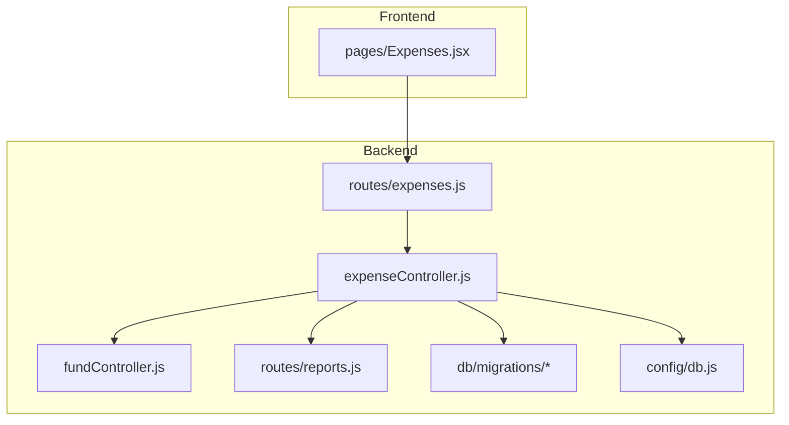
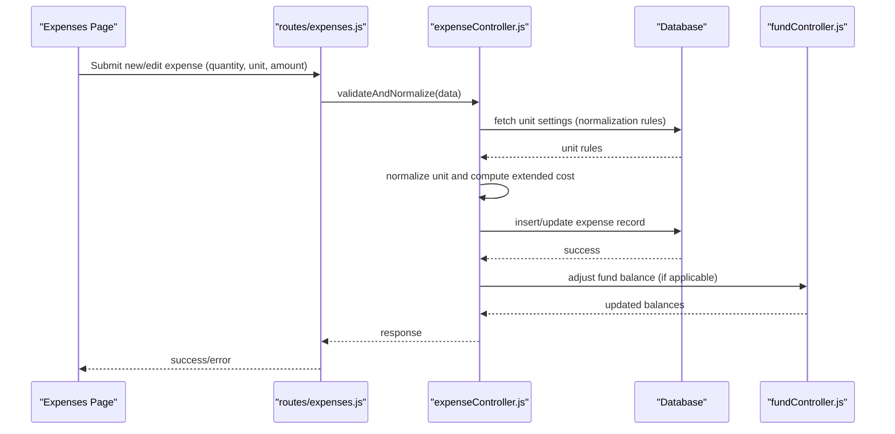
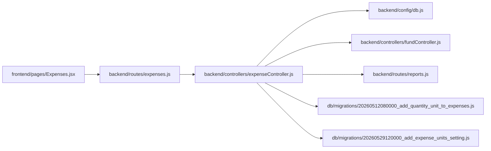

# Quantity and Unit Support

<cite>
**Referenced Files in This Document**
- [expenseController.js](file://backend/src/controllers/expenseController.js)
- [expenses.js](file://backend/src/routes/expenses.js)
- [20260512080000_add_quantity_unit_to_expenses.js](file://backend/src/db/migrations/20260512080000_add_quantity_unit_to_expenses.js)
- [20260529120000_add_expense_units_setting.js](file://backend/src/db/migrations/20260529120000_add_expense_units_setting.js)
- [20260512075907_create_funds_table.js](file://backend/src/db/migrations/20260512075907_create_funds_table.js)
- [20260512000000_initial_schema.js](file://backend/src/db/migrations/20260512000000_initial_schema.js)
- [db.js](file://backend/src/config/db.js)
- [Expenses.jsx](file://frontend/src/pages/Expenses.jsx)
- [settings.js](file://backend/src/routes/settings.js)
- [fundController.js](file://backend/src/controllers/fundController.js)
- [reports.js](file://backend/src/routes/reports.js)
</cite>

## Table of Contents
1. [Introduction](#introduction)
2. [Project Structure](#project-structure)
3. [Core Components](#core-components)
4. [Architecture Overview](#architecture-overview)
5. [Detailed Component Analysis](#detailed-component-analysis)
6. [Dependency Analysis](#dependency-analysis)
7. [Performance Considerations](#performance-considerations)
8. [Troubleshooting Guide](#troubleshooting-guide)
9. [Conclusion](#conclusion)
10. [Appendices](#appendices)

## Introduction
This document explains the enhanced expense record system with quantity and unit tracking. It covers the quantity field implementation, default values, validation rules, unit support (predefined units, custom unit entry, and unit conversion), and the impact on expense calculations, fund management, and reporting. It also documents database schema modifications, migration procedures, backward compatibility considerations, and practical examples for quantity-based expenses, unit normalization, and reporting implications. Localization considerations and user interface adaptations for quantity input are addressed.

## Project Structure
The expense enhancement spans backend controllers, routes, database migrations, and frontend pages. The key areas are:
- Backend controllers and routes for expense CRUD and reporting
- Database migrations adding quantity, unit, brand, and expense units settings
- Frontend page for expense entry/editing
- Fund management and reporting routes affected by quantity and unit changes

**Diagram sources**
- [expenses.js](file://backend/src/routes/expenses.js)
- [expenseController.js](file://backend/src/controllers/expenseController.js)
- [Expenses.jsx](file://frontend/src/pages/Expenses.jsx)
- [db.js](file://backend/src/config/db.js)
- [fundController.js](file://backend/src/controllers/fundController.js)
- [reports.js](file://backend/src/routes/reports.js)

**Section sources**
- [expenses.js](file://backend/src/routes/expenses.js)
- [expenseController.js](file://backend/src/controllers/expenseController.js)
- [Expenses.jsx](file://frontend/src/pages/Expenses.jsx)
- [db.js](file://backend/src/config/db.js)

## Core Components
- Quantity field: numeric value representing item count or measure
- Unit field: standardized or free-text unit label
- Brand field: product brand (added alongside quantity/unit)
- Expense Units Setting: organization-wide unit preferences and normalization rules
- Controllers and routes: handle creation, updates, validations, and reporting
- Database migrations: evolve schema to support quantity, unit, brand, and unit settings
- Frontend form: collects quantity and unit during expense entry/edit

Key implementation anchors:
- Migration adding quantity and unit to expenses
- Migration adding expense units setting table
- Expense controller methods for validation and calculation
- Routes for expenses and reporting
- Frontend Expenses page for quantity input

**Section sources**
- [20260512080000_add_quantity_unit_to_expenses.js](file://backend/src/db/migrations/20260512080000_add_quantity_unit_to_expenses.js)
- [20260529120000_add_expense_units_setting.js](file://backend/src/db/migrations/20260529120000_add_expense_units_setting.js)
- [expenseController.js](file://backend/src/controllers/expenseController.js)
- [expenses.js](file://backend/src/routes/expenses.js)
- [Expenses.jsx](file://frontend/src/pages/Expenses.jsx)

## Architecture Overview
The system extends the existing expense lifecycle with quantity and unit awareness. The flow integrates with fund management and reporting, ensuring calculated totals reflect quantity and unit conversions.

**Diagram sources**
- [expenses.js](file://backend/src/routes/expenses.js)
- [expenseController.js](file://backend/src/controllers/expenseController.js)
- [fundController.js](file://backend/src/controllers/fundController.js)

## Detailed Component Analysis

### Database Schema and Migrations
The expense schema was extended to support quantity and unit tracking:
- Added quantity and unit fields to the expenses table
- Added brand field for product identification
- Introduced expense units setting table for organization-wide unit preferences and normalization rules
- Ensured backward compatibility by making new fields optional and providing defaults where appropriate

Migration highlights:
- Initial schema establishes base tables
- Expenses table gains quantity, unit, and brand columns
- Expense units setting table stores unit definitions and normalization rules
- Funds table exists for fund management integration

Practical implications:
- Existing records remain valid without quantity/unit
- New records can optionally specify quantity and unit
- Unit normalization enables consistent aggregation across heterogeneous units

**Section sources**
- [20260512000000_initial_schema.js](file://backend/src/db/migrations/20260512000000_initial_schema.js)
- [20260512075907_create_funds_table.js](file://backend/src/db/migrations/20260512075907_create_funds_table.js)
- [20260512080000_add_quantity_unit_to_expenses.js](file://backend/src/db/migrations/20260512080000_add_quantity_unit_to_expenses.js)
- [20260529120000_add_expense_units_setting.js](file://backend/src/db/migrations/20260529120000_add_expense_units_setting.js)

### Quantity Field Implementation
- Type: numeric (supports decimals for partial quantities)
- Default: nullable; existing records retain null until populated
- Validation rules:
  - Non-negative values
  - Reasonableness checks (bounded by organizational policies)
  - Required when unit is specified
- Calculation impact:
  - Extended cost = unit price × quantity
  - Aggregation functions should multiply amounts by quantity for accurate totals

Backward compatibility:
- Null quantity treated as 1 for legacy calculations
- Reports and analytics adapt by considering quantity-aware totals

**Section sources**
- [20260512080000_add_quantity_unit_to_expenses.js](file://backend/src/db/migrations/20260512080000_add_quantity_unit_to_expenses.js)
- [expenseController.js](file://backend/src/controllers/expenseController.js)

### Unit Support: Predefined Units, Custom Entry, and Normalization
- Predefined units: stored in expense units setting table with aliases and conversion factors
- Custom unit entry: free-text unit accepted when normalization rules are not defined
- Normalization: convert custom units to canonical forms using configured rules
- Unit conversion: apply conversion factors for arithmetic consistency (e.g., converting dozens to individual items)

Impact on calculations:
- Normalize units before summing across categories or suppliers
- Use canonical units for budget vs. actual comparisons

Localization considerations:
- Allow localized unit names while mapping to canonical identifiers
- Store normalized unit keys for programmatic processing

**Section sources**
- [20260529120000_add_expense_units_setting.js](file://backend/src/db/migrations/20260529120000_add_expense_units_setting.js)
- [expenseController.js](file://backend/src/controllers/expenseController.js)

### Expense Calculations, Fund Management, and Reporting
- Expense calculations:
  - Total cost = unit price × quantity (with unit normalization)
  - Aggregated totals respect normalized units for meaningful reporting
- Fund management:
  - Updates adjust balances based on computed totals
  - Liquidation workflows incorporate quantity-normalized costs
- Reporting:
  - Category-wise and supplier-wise totals reflect quantity-adjusted values
  - Drill-down reports show per-item breakdowns when quantity is present

**Section sources**
- [fundController.js](file://backend/src/controllers/fundController.js)
- [reports.js](file://backend/src/routes/reports.js)
- [expenseController.js](file://backend/src/controllers/expenseController.js)

### Practical Examples
- Example 1: Buying 3 packs of batteries at $12 per pack
  - Quantity: 3
  - Unit: packs
  - Amount: $36 (computed as 3 × $12)
- Example 2: Purchasing 24 individual light bulbs
  - Quantity: 24
  - Unit: pieces (normalized from “individual”)
  - Amount: $24 × unit price
- Example 3: Recording 2 cartons of milk priced at $28 total
  - Quantity: 2
  - Unit: cartons
  - Amount: $28 (total price reflects pack pricing)

Unit normalization:
- Convert “dozen,” “dz,” and “DZ” to canonical “dozen”
- Convert “each,” “ea,” and “EA” to canonical “piece”

Reporting implications:
- Totals aggregated by normalized units provide consistent views
- Budget variance analysis compares normalized quantities against approved budgets

[No sources needed since this section provides illustrative examples]

### User Interface Adaptations for Quantity Input
- Form fields:
  - Quantity input with numeric validation and decimal support
  - Unit dropdown with predefined units plus custom unit option
  - Auto-normalization feedback when entering custom units
- Validation feedback:
  - Real-time checks for non-negative quantities
  - Guidance for required fields when unit is specified
- Accessibility:
  - Clear labels and help text for quantity and unit fields
  - Keyboard-friendly controls and screen-reader friendly labels

**Section sources**
- [Expenses.jsx](file://frontend/src/pages/Expenses.jsx)

## Dependency Analysis
The expense enhancement introduces dependencies across controllers, routes, migrations, and the database configuration.

**Diagram sources**
- [expenses.js](file://backend/src/routes/expenses.js)
- [expenseController.js](file://backend/src/controllers/expenseController.js)
- [Expenses.jsx](file://frontend/src/pages/Expenses.jsx)
- [db.js](file://backend/src/config/db.js)
- [fundController.js](file://backend/src/controllers/fundController.js)
- [reports.js](file://backend/src/routes/reports.js)
- [20260512080000_add_quantity_unit_to_expenses.js](file://backend/src/db/migrations/20260512080000_add_quantity_unit_to_expenses.js)
- [20260529120000_add_expense_units_setting.js](file://backend/src/db/migrations/20260529120000_add_expense_units_setting.js)

**Section sources**
- [expenses.js](file://backend/src/routes/expenses.js)
- [expenseController.js](file://backend/src/controllers/expenseController.js)
- [Expenses.jsx](file://frontend/src/pages/Expenses.jsx)
- [db.js](file://backend/src/config/db.js)
- [fundController.js](file://backend/src/controllers/fundController.js)
- [reports.js](file://backend/src/routes/reports.js)
- [20260512080000_add_quantity_unit_to_expenses.js](file://backend/src/db/migrations/20260512080000_add_quantity_unit_to_expenses.js)
- [20260529120000_add_expense_units_setting.js](file://backend/src/db/migrations/20260529120000_add_expense_units_setting.js)

## Performance Considerations
- Indexing: consider indexing unit and normalized unit columns for efficient filtering and aggregation
- Computation: precompute extended costs server-side to avoid repeated calculations in reports
- Caching: cache unit normalization rules to reduce repeated lookups
- Batch operations: when importing bulk expenses, validate and normalize in batches to minimize round trips

[No sources needed since this section provides general guidance]

## Troubleshooting Guide
Common issues and resolutions:
- Unit not recognized:
  - Verify unit exists in expense units setting table or enter a supported alias
  - Confirm normalization rules for custom units
- Incorrect totals:
  - Check quantity values and unit conversions
  - Ensure canonical unit alignment across entries
- Fund discrepancies:
  - Reconcile computed totals with actual payments
  - Review liquidation workflows for quantity-normalized adjustments

**Section sources**
- [expenseController.js](file://backend/src/controllers/expenseController.js)
- [20260529120000_add_expense_units_setting.js](file://backend/src/db/migrations/20260529120000_add_expense_units_setting.js)

## Conclusion
The enhanced expense system adds robust quantity and unit tracking with backward compatibility, normalization, and reporting improvements. By leveraging predefined units, custom unit entry, and conversion rules, organizations can achieve standardized, accurate expense accounting and insightful reporting. Proper validation, normalization, and UI adaptations ensure reliable data capture and consistent financial insights.

[No sources needed since this section summarizes without analyzing specific files]

## Appendices

### Appendix A: Migration Procedures
- Apply initial schema and funds table migrations
- Add quantity, unit, and brand to expenses
- Add expense units setting table
- Seed unit normalization rules
- Run fund and report recalculations as needed

**Section sources**
- [20260512000000_initial_schema.js](file://backend/src/db/migrations/20260512000000_initial_schema.js)
- [20260512075907_create_funds_table.js](file://backend/src/db/migrations/20260512075907_create_funds_table.js)
- [20260512080000_add_quantity_unit_to_expenses.js](file://backend/src/db/migrations/20260512080000_add_quantity_unit_to_expenses.js)
- [20260529120000_add_expense_units_setting.js](file://backend/src/db/migrations/20260529120000_add_expense_units_setting.js)

### Appendix B: Validation Rules Summary
- Quantity
  - Numeric type
  - Non-negative
  - Required when unit is specified
- Unit
  - Free-text with normalization
  - Must resolve to canonical unit for aggregation
- Amount
  - Computed as unit price × quantity
  - Updated totals reflect normalization

**Section sources**
- [20260512080000_add_quantity_unit_to_expenses.js](file://backend/src/db/migrations/20260512080000_add_quantity_unit_to_expenses.js)
- [expenseController.js](file://backend/src/controllers/expenseController.js)