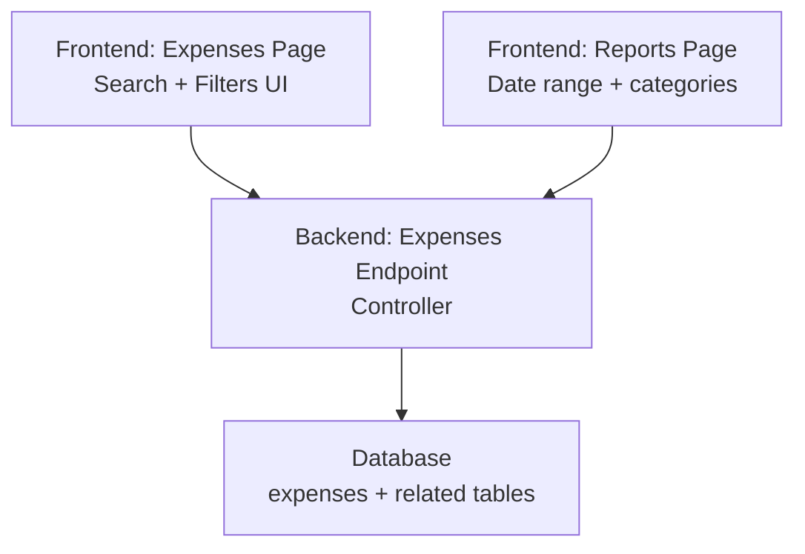
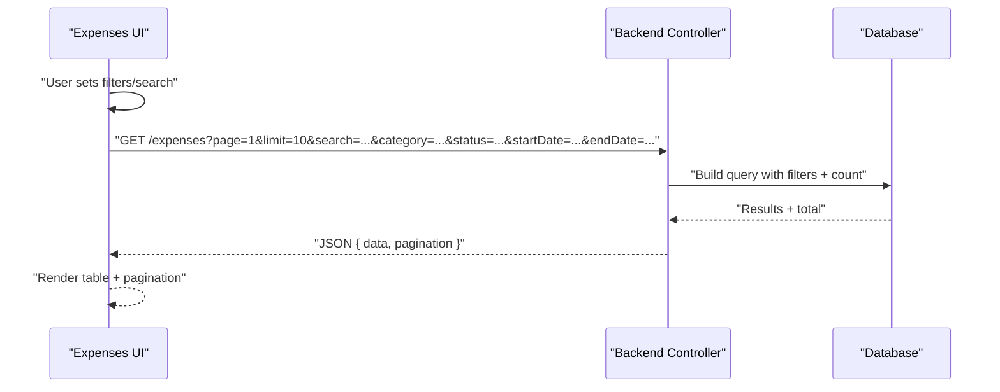
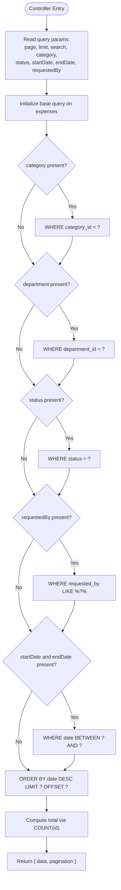
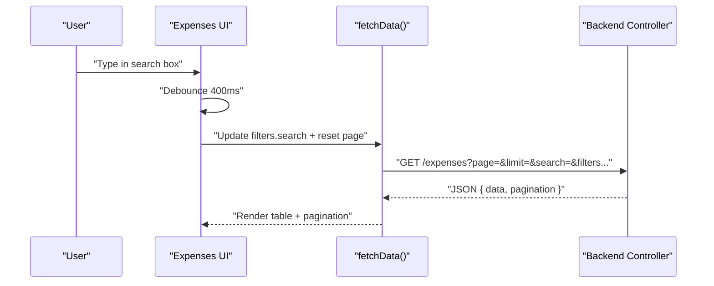
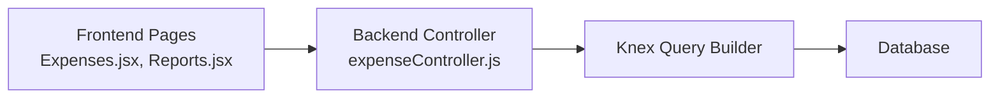

# Search and Filtering

<cite>
**Referenced Files in This Document**
- [expenseController.js](file://backend/src/controllers/expenseController.js)
- [Expenses.jsx](file://frontend/src/pages/Expenses.jsx)
- [Reports.jsx](file://frontend/src/pages/Reports.jsx)
</cite>

## Table of Contents
1. [Introduction](#introduction)
2. [Project Structure](#project-structure)
3. [Core Components](#core-components)
4. [Architecture Overview](#architecture-overview)
5. [Detailed Component Analysis](#detailed-component-analysis)
6. [Dependency Analysis](#dependency-analysis)
7. [Performance Considerations](#performance-considerations)
8. [Troubleshooting Guide](#troubleshooting-guide)
9. [Conclusion](#conclusion)

## Introduction
This document explains the comprehensive search and filtering system for expense records. It covers multi-field search (remarks, requester names, and custom search terms), filter options (categories, departments, statuses, date ranges, requesters), pagination, sorting, result limiting, query building, SQL injection prevention, and performance optimization. It also includes practical examples, complex filter combinations, and user experience considerations for large datasets.

## Project Structure
The search and filtering system spans the backend controller and the frontend pages:
- Backend: Expense retrieval endpoint builds dynamic queries based on filters and returns paginated results.
- Frontend: Expense ledger page provides interactive controls for search and filters, debounced input handling, and pagination UI.

**Diagram sources**
- [expenseController.js:44-76](file://backend/src/controllers/expenseController.js#L44-L76)
- [Expenses.jsx:50-125](file://frontend/src/pages/Expenses.jsx#L50-L125)
- [Reports.jsx:153-180](file://frontend/src/pages/Reports.jsx#L153-L180)

**Section sources**
- [expenseController.js:44-76](file://backend/src/controllers/expenseController.js#L44-L76)
- [Expenses.jsx:50-125](file://frontend/src/pages/Expenses.jsx#L50-L125)
- [Reports.jsx:153-180](file://frontend/src/pages/Reports.jsx#L153-L180)

## Core Components
- Backend controller constructs a Knex query with optional conditions for category, department, status, requester name, and date range. It computes total count for pagination and applies ordering and limits.
- Frontend ledger page manages filters in state, debounces search input, sends requests with abort signals, and renders pagination controls.

Key implementation highlights:
- Dynamic query building with conditional WHERE clauses.
- Pagination via offset/limit and total count calculation.
- Sorting by date descending by default.
- Debounced search input and cancellation of stale requests.

**Section sources**
- [expenseController.js:44-76](file://backend/src/controllers/expenseController.js#L44-L76)
- [Expenses.jsx:50-125](file://frontend/src/pages/Expenses.jsx#L50-L125)

## Architecture Overview
The system follows a standard request-response flow:
- Frontend composes filters and sends GET /expenses with query parameters.
- Backend controller builds a database query, counts total results, and returns a paginated dataset.
- Frontend displays results and pagination UI.

**Diagram sources**
- [expenseController.js:44-76](file://backend/src/controllers/expenseController.js#L44-L76)
- [Expenses.jsx:89-125](file://frontend/src/pages/Expenses.jsx#L89-L125)

## Detailed Component Analysis

### Backend Controller: Expense Retrieval and Query Building
The controller reads query parameters and conditionally adds filters to the Knex query. It computes total count and returns ordered, limited results.

- Filters applied:
  - Category: equality filter on category_id
  - Department: equality filter on department_id
  - Status: equality filter on status
  - Requester: LIKE filter on requested_by
  - Date range: BETWEEN on date
- Pagination:
  - Uses limit and offset derived from page and limit
  - Computes total via a separate count query
- Sorting:
  - Orders by date descending by default
- Response:
  - Returns data array and pagination metadata

**Diagram sources**
- [expenseController.js:44-76](file://backend/src/controllers/expenseController.js#L44-L76)

**Section sources**
- [expenseController.js:44-76](file://backend/src/controllers/expenseController.js#L44-L76)

### Frontend: Expense Ledger UI and Search Behavior
The frontend manages filters and search input, debouncing user input to reduce network requests. It supports:
- Real-time search term updates with a 400ms debounce
- Category, status, and date range filters
- Reset filters button
- Pagination controls with page navigation and total display
- Abortable requests to cancel stale fetches

**Diagram sources**
- [Expenses.jsx:70-125](file://frontend/src/pages/Expenses.jsx#L70-L125)

**Section sources**
- [Expenses.jsx:50-125](file://frontend/src/pages/Expenses.jsx#L50-L125)

### Frontend: Reports Page Filters
The Reports page demonstrates date-range and categorical filtering that feed into backend summaries and exports.

**Section sources**
- [Reports.jsx:153-180](file://frontend/src/pages/Reports.jsx#L153-L180)

## Dependency Analysis
- Backend depends on Knex for query construction and database access.
- Frontend uses a cancellable fetch mechanism to avoid race conditions and stale results.
- Both sides coordinate around shared query parameter names for filters and pagination.

**Diagram sources**
- [expenseController.js:44-76](file://backend/src/controllers/expenseController.js#L44-L76)
- [Expenses.jsx:89-125](file://frontend/src/pages/Expenses.jsx#L89-L125)
- [Reports.jsx:153-180](file://frontend/src/pages/Reports.jsx#L153-L180)

**Section sources**
- [expenseController.js:44-76](file://backend/src/controllers/expenseController.js#L44-L76)
- [Expenses.jsx:89-125](file://frontend/src/pages/Expenses.jsx#L89-L125)
- [Reports.jsx:153-180](file://frontend/src/pages/Reports.jsx#L153-L180)

## Performance Considerations
- Indexing recommendations:
  - Add indexes on expenses(category_id), expenses(department_id), expenses(status), expenses(date), and expenses(requested_by) to accelerate filtering and sorting.
- Query optimization:
  - Use selective projections and limit results to reduce payload size.
  - Prefer exact equality filters (category, department, status) over LIKE for requester names to leverage indexes.
- Pagination:
  - Use offset/limit carefully; for very large datasets, consider keyset pagination (cursor-based) to avoid expensive OFFSET operations.
- Caching:
  - Cache frequently accessed static lists (categories, departments) in the frontend to reduce repeated requests.
  - Consider short-lived caches for summary endpoints (e.g., Reports) to reduce repeated computation.
- Debouncing:
  - Debounced search input reduces redundant requests and improves responsiveness.
- Sorting:
  - Keep default sort on indexed column (date) to minimize sorting overhead.

[No sources needed since this section provides general guidance]

## Troubleshooting Guide
Common issues and resolutions:
- Empty or unexpected results:
  - Verify filters are correctly encoded and passed as query parameters.
  - Confirm date range boundaries and requester name casing.
- Slow performance:
  - Ensure database indexes exist on filtered columns.
  - Reduce limit or switch to keyset pagination for large datasets.
- Stale or overlapping requests:
  - Use abort signals to cancel previous requests when new ones start.
- Pagination inconsistencies:
  - Confirm total count matches actual rows after applying filters.

**Section sources**
- [Expenses.jsx:89-125](file://frontend/src/pages/Expenses.jsx#L89-L125)
- [expenseController.js:53-71](file://backend/src/controllers/expenseController.js#L53-L71)

## Conclusion
The system combines a flexible backend controller with robust frontend controls to deliver efficient, user-friendly expense search and filtering. By leveraging proper indexing, pagination strategies, and frontend request management, it scales effectively for large datasets while maintaining a responsive user experience.