# Frontend Components & Pages

<cite>
**Referenced Files in This Document**
- [App.jsx](file://frontend/src/App.jsx)
- [main.jsx](file://frontend/src/main.jsx)
- [DashboardLayout.jsx](file://frontend/src/layouts/DashboardLayout.jsx)
- [ThemeContext.jsx](file://frontend/src/context/ThemeContext.jsx)
- [AuthContext.jsx](file://frontend/src/context/AuthContext.jsx)
- [SocketContext.jsx](file://frontend/src/context/SocketContext.jsx)
- [NotificationCenter.jsx](file://frontend/src/components/NotificationCenter.jsx)
- [Dashboard.jsx](file://frontend/src/pages/Dashboard.jsx)
- [Login.jsx](file://frontend/src/pages/Login.jsx)
- [api.js](file://frontend/src/services/api.js)
- [index.css](file://frontend/src/index.css)
- [tailwind.config.js](file://frontend/tailwind.config.js)
- [vite.config.js](file://frontend/vite.config.js)
- [package.json](file://frontend/package.json)
</cite>

## Table of Contents
1. [Introduction](#introduction)
2. [Project Structure](#project-structure)
3. [Core Components](#core-components)
4. [Architecture Overview](#architecture-overview)
5. [Detailed Component Analysis](#detailed-component-analysis)
6. [Dependency Analysis](#dependency-analysis)
7. [Performance Considerations](#performance-considerations)
8. [Troubleshooting Guide](#troubleshooting-guide)
9. [Conclusion](#conclusion)
10. [Appendices](#appendices)

## Introduction
This document describes the React frontend architecture and component system for the petty cash management application. It covers the page-based routing structure, reusable UI components, layout systems, and state management via context providers. It also documents the theme system (including dark mode and system preference), responsive design implementation, accessibility considerations, and component composition patterns. Finally, it provides guidelines for extending the UI system and integrating new features.

## Project Structure
The frontend is organized around a React application with:
- A single-page app shell with route-based page lazy-loading
- A dashboard layout with sidebar navigation and header controls
- Context providers for authentication, theming, and real-time notifications
- Reusable UI components and page-specific views
- Tailwind CSS for styling and animations via Framer Motion

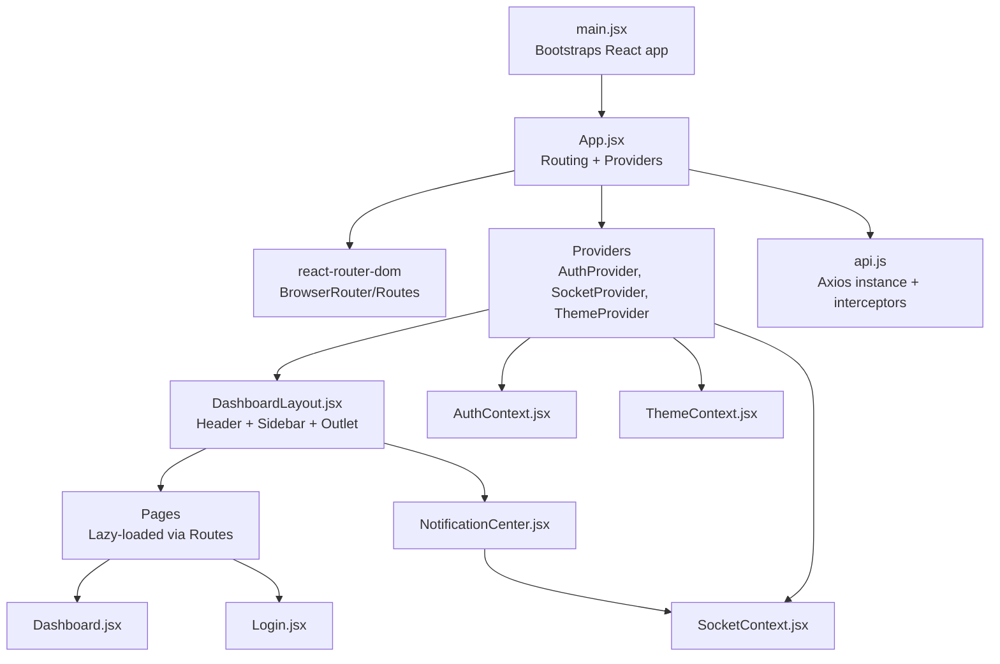

**Diagram sources**
- [main.jsx:1-11](file://frontend/src/main.jsx#L1-L11)
- [App.jsx:45-124](file://frontend/src/App.jsx#L45-L124)
- [DashboardLayout.jsx:51-335](file://frontend/src/layouts/DashboardLayout.jsx#L51-L335)
- [AuthContext.jsx:6-51](file://frontend/src/context/AuthContext.jsx#L6-L51)
- [ThemeContext.jsx:5-27](file://frontend/src/context/ThemeContext.jsx#L5-L27)
- [SocketContext.jsx:130-375](file://frontend/src/context/SocketContext.jsx#L130-L375)
- [NotificationCenter.jsx:8-183](file://frontend/src/components/NotificationCenter.jsx#L8-L183)
- [Dashboard.jsx:76-479](file://frontend/src/pages/Dashboard.jsx#L76-L479)
- [Login.jsx:8-156](file://frontend/src/pages/Login.jsx#L8-L156)
- [api.js:3-29](file://frontend/src/services/api.js#L3-L29)

**Section sources**
- [main.jsx:1-11](file://frontend/src/main.jsx#L1-L11)
- [App.jsx:1-127](file://frontend/src/App.jsx#L1-L127)
- [DashboardLayout.jsx:1-335](file://frontend/src/layouts/DashboardLayout.jsx#L1-L335)
- [index.css:1-131](file://frontend/src/index.css#L1-L131)
- [tailwind.config.js:1-29](file://frontend/tailwind.config.js#L1-L29)
- [vite.config.js:1-31](file://frontend/vite.config.js#L1-L31)
- [package.json:1-49](file://frontend/package.json#L1-L49)

## Core Components
- Authentication provider: Manages user session, token persistence, and login/logout lifecycle.
- Theme provider: Controls dark mode state, persists preference, and toggles CSS classes on the root element.
- Socket provider: Establishes real-time connections, manages notifications, critical alerts, and audio feedback across tabs.
- Dashboard layout: Provides responsive navigation, header controls, and a content outlet for routed pages.
- Notification center: Dropdown panel for notifications with read/unread states and actions.
- Page components: Feature pages such as Dashboard and Login, each encapsulating domain logic and UI.

Key responsibilities:
- Routing and lazy loading are centralized in the app shell.
- Layout composes navigation and header elements and delegates content rendering to nested routes.
- Contexts decouple state from components and enable cross-cutting concerns like theming and notifications.

**Section sources**
- [AuthContext.jsx:1-54](file://frontend/src/context/AuthContext.jsx#L1-L54)
- [ThemeContext.jsx:1-30](file://frontend/src/context/ThemeContext.jsx#L1-L30)
- [SocketContext.jsx:1-376](file://frontend/src/context/SocketContext.jsx#L1-L376)
- [DashboardLayout.jsx:1-335](file://frontend/src/layouts/DashboardLayout.jsx#L1-L335)
- [NotificationCenter.jsx:1-183](file://frontend/src/components/NotificationCenter.jsx#L1-L183)
- [Dashboard.jsx:1-479](file://frontend/src/pages/Dashboard.jsx#L1-L479)
- [Login.jsx:1-156](file://frontend/src/pages/Login.jsx#L1-L156)

## Architecture Overview
The app initializes React, wraps the routing tree with providers, and renders a layout that hosts feature pages. Real-time updates are handled via Socket.IO, while Axios handles HTTP requests with automatic token injection and 401 handling.

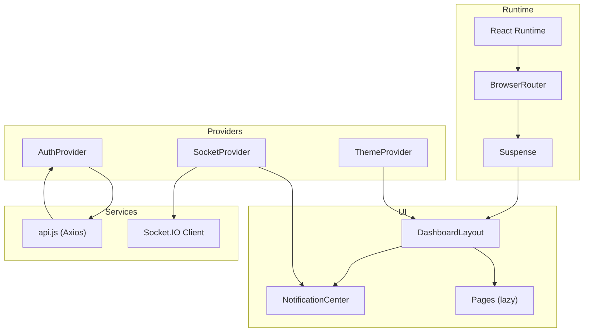

**Diagram sources**
- [App.jsx:45-124](file://frontend/src/App.jsx#L45-L124)
- [DashboardLayout.jsx:51-335](file://frontend/src/layouts/DashboardLayout.jsx#L51-L335)
- [NotificationCenter.jsx:8-183](file://frontend/src/components/NotificationCenter.jsx#L8-L183)
- [AuthContext.jsx:6-51](file://frontend/src/context/AuthContext.jsx#L6-L51)
- [ThemeContext.jsx:5-27](file://frontend/src/context/ThemeContext.jsx#L5-L27)
- [SocketContext.jsx:130-375](file://frontend/src/context/SocketContext.jsx#L130-L375)
- [api.js:3-29](file://frontend/src/services/api.js#L3-L29)

## Detailed Component Analysis

### Routing and Protected Routes
- The app uses React Router v7 with lazy-loaded pages and Suspense for loading states.
- A custom ProtectedRoute enforces authentication and role-based access checks.
- The layout is rendered under a protected wrapper for authenticated routes except login and approval action routes.

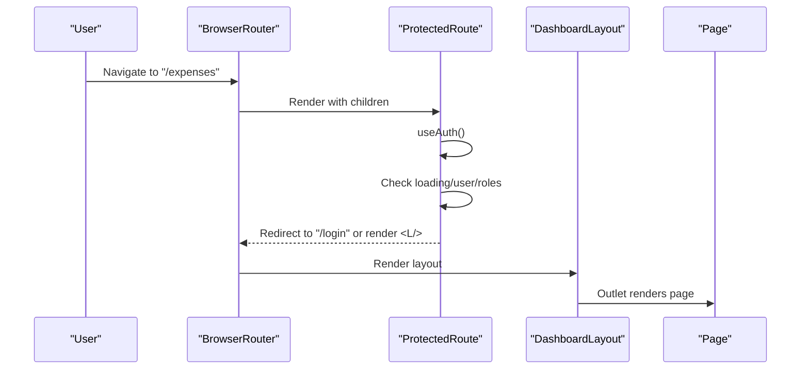

**Diagram sources**
- [App.jsx:26-43](file://frontend/src/App.jsx#L26-L43)
- [App.jsx:63-114](file://frontend/src/App.jsx#L63-L114)
- [DashboardLayout.jsx:51-335](file://frontend/src/layouts/DashboardLayout.jsx#L51-L335)

**Section sources**
- [App.jsx:26-43](file://frontend/src/App.jsx#L26-L43)
- [App.jsx:52-124](file://frontend/src/App.jsx#L52-L124)

### Authentication Provider
- Stores and restores token from localStorage.
- Validates token on startup by calling a user endpoint.
- Exposes login, logout, user, token, and loading state.
- Axios interceptor injects Authorization header automatically.

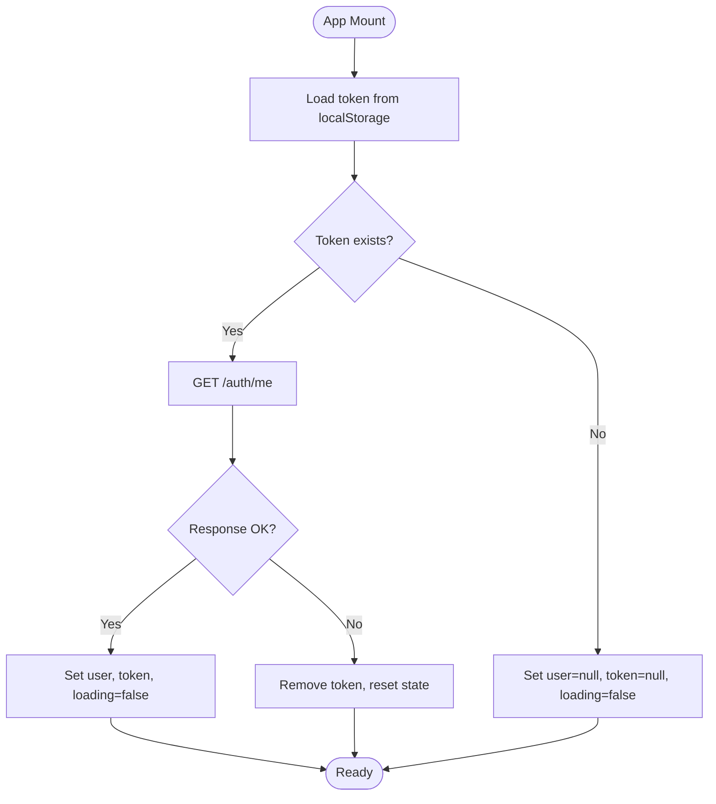

**Diagram sources**
- [AuthContext.jsx:6-51](file://frontend/src/context/AuthContext.jsx#L6-L51)
- [api.js:7-14](file://frontend/src/services/api.js#L7-L14)

**Section sources**
- [AuthContext.jsx:1-54](file://frontend/src/context/AuthContext.jsx#L1-L54)
- [api.js:1-29](file://frontend/src/services/api.js#L1-L29)

### Theme Provider (Dark Mode and System Themes)
- Reads user preference from localStorage or system preference.
- Applies a CSS class to the root element to drive Tailwind’s dark mode.
- Persists toggled state to localStorage.

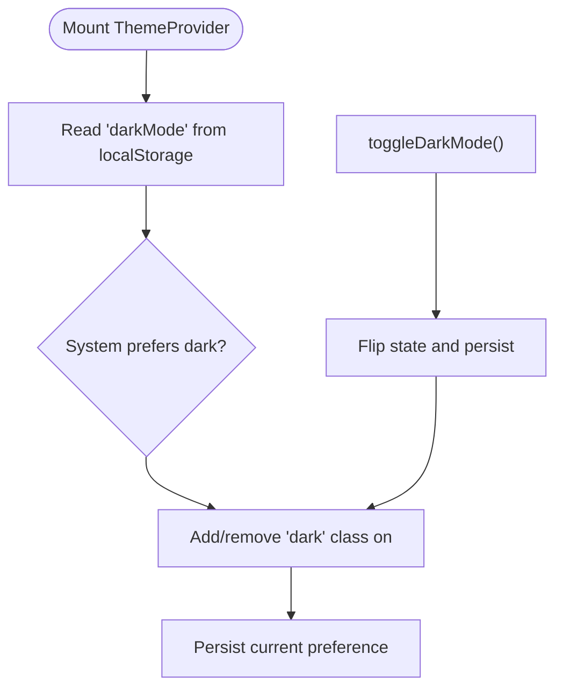

**Diagram sources**
- [ThemeContext.jsx:5-27](file://frontend/src/context/ThemeContext.jsx#L5-L27)
- [tailwind.config.js:7](file://frontend/tailwind.config.js#L7)

**Section sources**
- [ThemeContext.jsx:1-30](file://frontend/src/context/ThemeContext.jsx#L1-L30)
- [tailwind.config.js:1-29](file://frontend/tailwind.config.js#L1-L29)
- [index.css:23-37](file://frontend/src/index.css#L23-L37)

### Socket Provider (Real-time Notifications and Critical Alerts)
- Establishes a Socket.IO connection with auth token and robust reconnection.
- Manages notifications, unread counts, and critical alerts.
- Implements a tab-safe audio engine with Web Audio API and cross-tab synchronization.
- Emits DOM events for balance and expense updates to support live UI refresh.

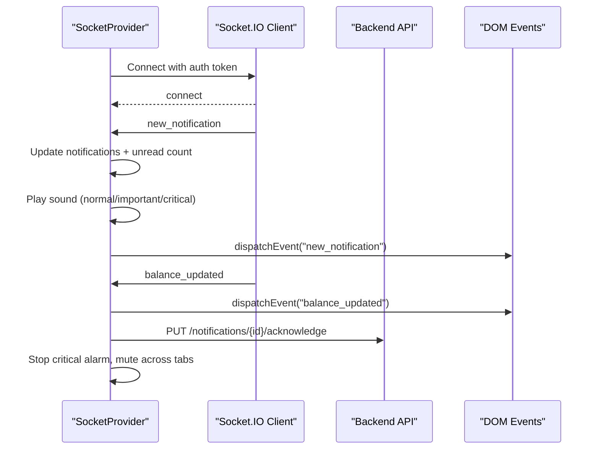

**Diagram sources**
- [SocketContext.jsx:130-375](file://frontend/src/context/SocketContext.jsx#L130-L375)
- [NotificationCenter.jsx:8-183](file://frontend/src/components/NotificationCenter.jsx#L8-L183)

**Section sources**
- [SocketContext.jsx:1-376](file://frontend/src/context/SocketContext.jsx#L1-L376)
- [NotificationCenter.jsx:1-183](file://frontend/src/components/NotificationCenter.jsx#L1-L183)

### Dashboard Layout
- Desktop and mobile responsive sidebar with collapsible menu and tooltips.
- Header with search, date, user profile, and notification center.
- Real-time balance display and critical alert modal overlay.
- Role-filtered navigation items and logout flow.

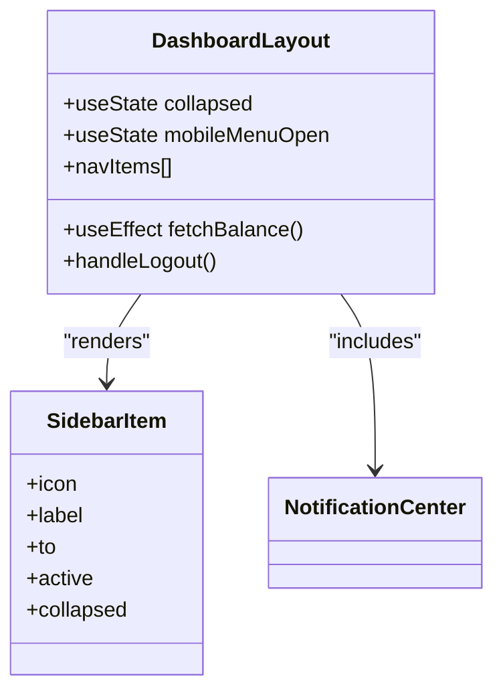

**Diagram sources**
- [DashboardLayout.jsx:51-335](file://frontend/src/layouts/DashboardLayout.jsx#L51-L335)
- [DashboardLayout.jsx:32-47](file://frontend/src/layouts/DashboardLayout.jsx#L32-L47)
- [NotificationCenter.jsx:8-183](file://frontend/src/components/NotificationCenter.jsx#L8-L183)

**Section sources**
- [DashboardLayout.jsx:1-335](file://frontend/src/layouts/DashboardLayout.jsx#L1-L335)

### Dashboard Page
- Composed of stat cards, charts (area, pie), recent activity table, and quick actions.
- Uses Recharts for responsive charts and Framer Motion for animations.
- Downloads charts as images via html2canvas and jspdf utilities.
- Subscribes to real-time balance updates via window events and socket.

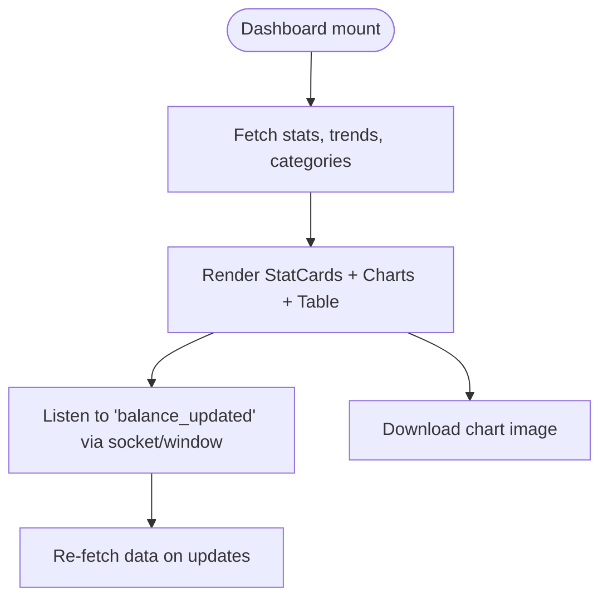

**Diagram sources**
- [Dashboard.jsx:76-479](file://frontend/src/pages/Dashboard.jsx#L76-L479)

**Section sources**
- [Dashboard.jsx:1-479](file://frontend/src/pages/Dashboard.jsx#L1-L479)

### Login Page
- Minimal form with username/password, show/hide password, and submission handling.
- Integrates with AuthContext.login and redirects on success.

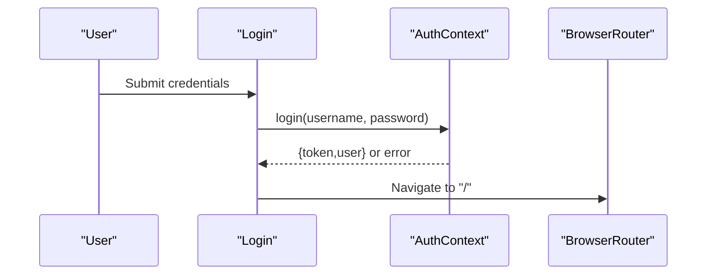

**Diagram sources**
- [Login.jsx:8-156](file://frontend/src/pages/Login.jsx#L8-L156)
- [AuthContext.jsx:32-44](file://frontend/src/context/AuthContext.jsx#L32-L44)

**Section sources**
- [Login.jsx:1-156](file://frontend/src/pages/Login.jsx#L1-L156)

### Notification Center Component
- Dropdown panel showing notifications with read/unread indicators and timestamps.
- Supports marking as read, marking all read, and acknowledging critical alerts.
- Integrates with SocketContext for live updates and audio feedback.

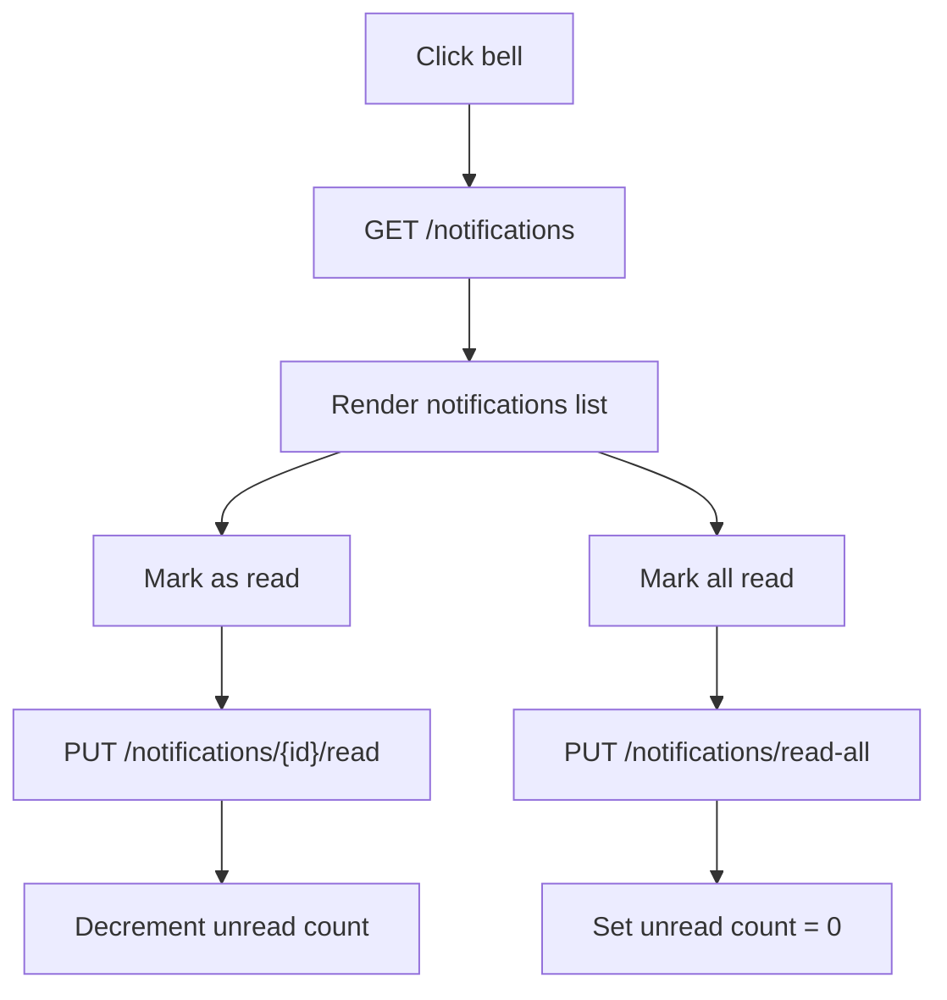

**Diagram sources**
- [NotificationCenter.jsx:8-183](file://frontend/src/components/NotificationCenter.jsx#L8-L183)
- [SocketContext.jsx:130-375](file://frontend/src/context/SocketContext.jsx#L130-L375)

**Section sources**
- [NotificationCenter.jsx:1-183](file://frontend/src/components/NotificationCenter.jsx#L1-L183)

## Dependency Analysis
- React and ecosystem: React, React Router, Axios, Socket.IO client, Recharts, Framer Motion, Lucide icons, Tailwind CSS v4.
- Build tooling: Vite with React plugin and custom chunk naming for hosting compatibility.
- Styling: Tailwind v4 with dark mode enabled; CSS custom properties and layered utilities for consistent design tokens.

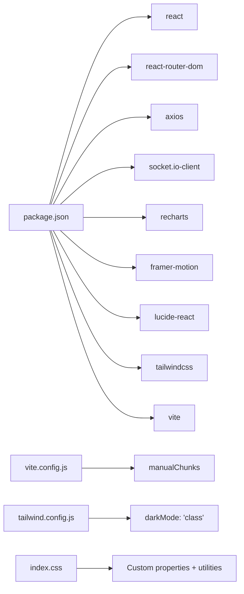

**Diagram sources**
- [package.json:12-27](file://frontend/package.json#L12-L27)
- [vite.config.js:18-30](file://frontend/vite.config.js#L18-L30)
- [tailwind.config.js:7](file://frontend/tailwind.config.js#L7)
- [index.css:4-21](file://frontend/src/index.css#L4-L21)

**Section sources**
- [package.json:1-49](file://frontend/package.json#L1-L49)
- [vite.config.js:1-31](file://frontend/vite.config.js#L1-L31)
- [tailwind.config.js:1-29](file://frontend/tailwind.config.js#L1-L29)
- [index.css:1-131](file://frontend/src/index.css#L1-L131)

## Performance Considerations
- Lazy loading pages reduces initial bundle size; keep future pages similarly deferred.
- Prefer lightweight chart libraries and avoid unnecessary re-renders; memoize heavy computations.
- Debounce or throttle real-time listeners where appropriate; the current implementation listens to balance updates efficiently.
- Use CSS transforms and opacity for animations; avoid layout thrashing.
- Optimize images and assets; ensure Tailwind purging is configured for production builds.

## Troubleshooting Guide
Common issues and resolutions:
- Authentication failures: 401 responses remove token and redirect to login automatically via the Axios interceptor.
- Real-time updates not appearing: Verify Socket.IO connection status and that the server emits events; ensure the page listens to DOM events or socket listeners.
- Critical alerts not audible: Confirm audio permission and tab lock mechanism; acknowledge critical alerts to mute across tabs.
- Dark mode not applying: Ensure the 'dark' class is present on the root element and Tailwind dark mode is enabled.

**Section sources**
- [api.js:16-26](file://frontend/src/services/api.js#L16-L26)
- [SocketContext.jsx:209-290](file://frontend/src/context/SocketContext.jsx#L209-L290)
- [ThemeContext.jsx:11-18](file://frontend/src/context/ThemeContext.jsx#L11-L18)
- [SocketContext.jsx:334-356](file://frontend/src/context/SocketContext.jsx#L334-L356)

## Conclusion
The frontend follows a clean separation of concerns with route-based pages, a reusable dashboard layout, and three core contexts for authentication, theming, and real-time notifications. The design leverages modern React patterns, responsive layout primitives, and a cohesive styling system. Extensibility is achieved through small, focused components, shared utilities, and consistent context APIs.

## Appendices

### Props, Events, and Customization Options
- DashboardLayout
  - Props: None (consumes Auth and Socket contexts)
  - Events: None (exposes handlers for logout and navigation)
  - Customization: Adjust navItems array to add or restrict menu entries by role; customize branding assets and colors via CSS variables.
- StatCard (Dashboard)
  - Props: title, value, icon, trend, trendLabel, color, delay, isCurrency
  - Events: None (self-contained card)
  - Customization: Extend color palette and animation delays per card.
- NotificationCenter
  - Props: None (consumes Socket context)
  - Events: Dispatches DOM events for new notifications and balance updates
  - Customization: Add new notification types and priority levels; adjust audio profiles.
- Login
  - Props: None (uses AuthContext)
  - Events: On submit, invokes login and navigates on success
  - Customization: Add multi-factor or external auth integrations by extending the handler.

### Accessibility Compliance
- Semantic HTML and proper labeling for inputs and buttons.
- Focus management in modals and dropdowns; ensure keyboard navigation.
- Sufficient color contrast; leverage dark mode variants.
- ARIA roles and labels where dynamic overlays are introduced.
- Screen reader-friendly announcements for critical alerts and status changes.

### Responsive Design Implementation
- Breakpoints and spacing derived from Tailwind utilities; layout adapts from mobile to desktop.
- Collapsible sidebar with tooltip-based navigation cues.
- Responsive charts using Recharts’ ResponsiveContainer.
- Mobile-first header controls and overlay navigation.

### Theming and Dark Mode
- ThemeContext toggles a 'dark' class on the root element.
- Tailwind dark mode activated via class strategy.
- CSS custom properties define brand and component tokens for consistent theming.

### Extending the UI System and Adding Features
- Add new pages as lazy-loaded routes under the main Routes block.
- Wrap pages in ProtectedRoute when access control is required.
- Introduce new context providers for domain-specific state if needed.
- Create reusable components following existing patterns (props, events, customization).
- Integrate real-time features by emitting and listening to socket events or DOM events.
- Maintain design consistency using shared CSS utilities and tokens.