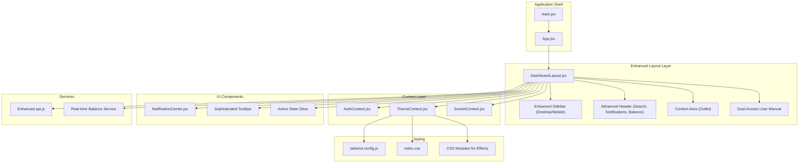
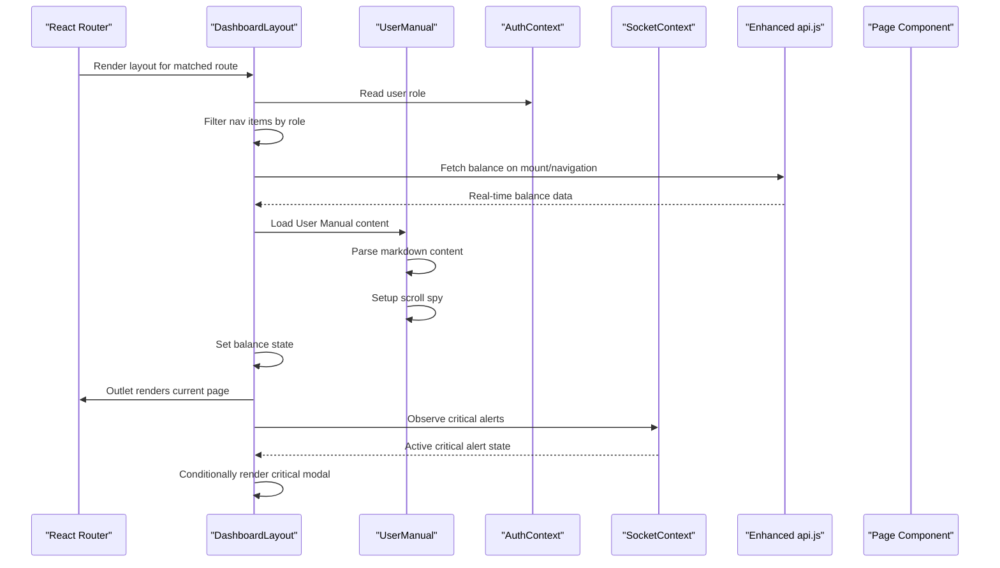
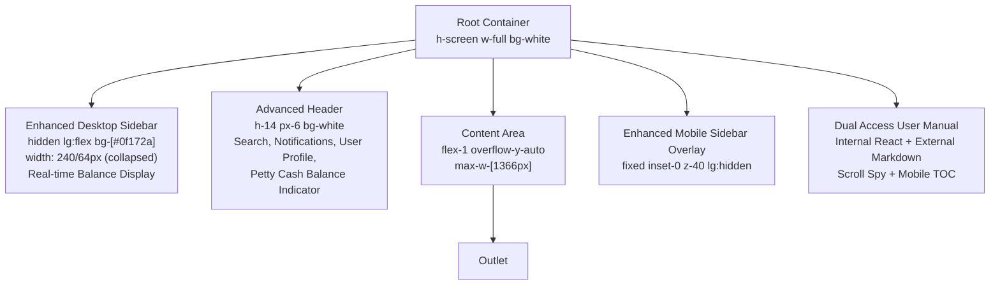
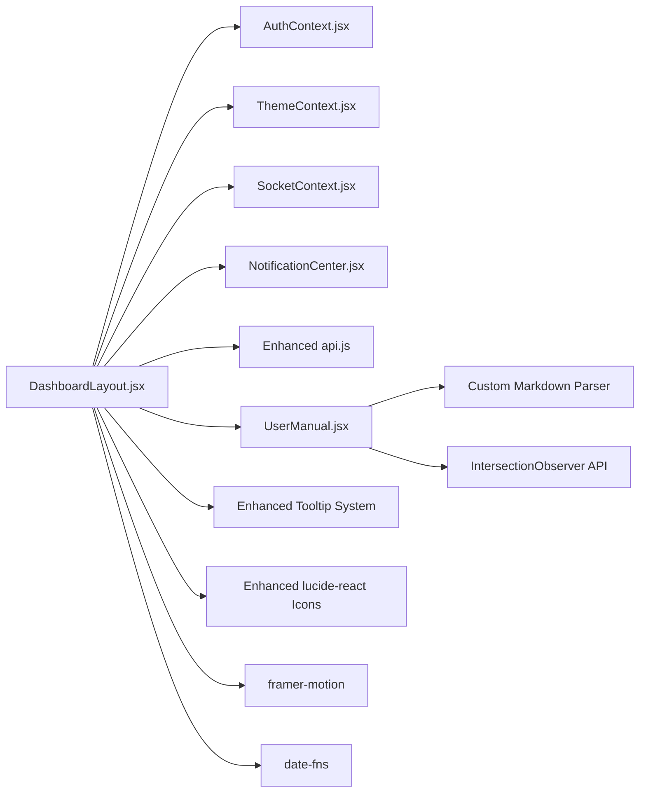

# Layout System

<cite>
**Referenced Files in This Document**
- [DashboardLayout.jsx](file://frontend/src/layouts/DashboardLayout.jsx)
- [UserManual.jsx](file://frontend/src/pages/UserManual.jsx)
- [ThemeContext.jsx](file://frontend/src/context/ThemeContext.jsx)
- [NotificationCenter.jsx](file://frontend/src/components/NotificationCenter.jsx)
- [App.jsx](file://frontend/src/App.jsx)
- [main.jsx](file://frontend/src/main.jsx)
- [index.css](file://frontend/src/index.css)
- [tailwind.config.js](file://frontend/tailwind.config.js)
- [vite.config.js](file://frontend/vite.config.js)
- [AuthContext.jsx](file://frontend/src/context/AuthContext.jsx)
- [SocketContext.jsx](file://frontend/src/context/SocketContext.jsx)
- [api.js](file://frontend/src/services/api.js)
</cite>

## Update Summary
**Changes Made**
- Enhanced User Manual navigation with dual access options (internal documentation and external markdown)
- Implemented sophisticated tooltip systems with custom positioning and arrow indicators
- Improved visual feedback for active states with sidebar glow effects and enhanced hover states
- Added real-time petty cash fund balance display with animated header integration
- Refined responsive design elements with mobile TOC and scroll spy functionality

## Table of Contents
1. [Introduction](#introduction)
2. [Project Structure](#project-structure)
3. [Core Components](#core-components)
4. [Architecture Overview](#architecture-overview)
5. [Detailed Component Analysis](#detailed-component-analysis)
6. [Enhanced Navigation Features](#enhanced-navigation-features)
7. [Responsive Design Implementation](#responsive-design-implementation)
8. [Visual Feedback Systems](#visual-feedback-systems)
9. [Real-time Data Integration](#real-time-data-integration)
10. [Dependency Analysis](#dependency-analysis)
11. [Performance Considerations](#performance-considerations)
12. [Troubleshooting Guide](#troubleshooting-guide)
13. [Conclusion](#conclusion)

## Introduction
This document describes the layout system architecture for the petty cash management application, focusing on the DashboardLayout component and supporting layout infrastructure. The system has been enhanced with sophisticated navigation features including dual User Manual access options, advanced tooltip systems, responsive design elements, improved visual feedback mechanisms, and real-time data integration for petty cash fund balances.

## Project Structure
The layout system centers around a comprehensive layout component that orchestrates the sidebar, header, content area, mobile navigation, and enhanced User Manual functionality. Supporting contexts provide theme, authentication, and real-time notification state. The system now includes dual User Manual access patterns and sophisticated tooltip implementations.

**Diagram sources**
- [DashboardLayout.jsx:51-353](file://frontend/src/layouts/DashboardLayout.jsx#L51-L353)
- [UserManual.jsx:176-368](file://frontend/src/pages/UserManual.jsx#L176-L368)
- [ThemeContext.jsx:1-29](file://frontend/src/context/ThemeContext.jsx#L1-L29)

## Core Components
- **DashboardLayout**: Enhanced orchestration of desktop sidebar, header, content area, mobile overlay, critical alarm modal, and real-time balance display. Now includes dual User Manual navigation options and sophisticated tooltip systems.
- **SidebarItem**: Advanced reusable navigation component with enhanced tooltip positioning, glow effects for active states, and improved visual feedback mechanisms.
- **UserManual**: Dual-access documentation system supporting both internal React components and external markdown files with scroll spy and mobile-friendly table of contents.
- **ThemeContext**: Provides dark/light mode state synchronized with system preference and persisted in local storage, now supporting enhanced visual effects.
- **Enhanced Tooltip System**: Custom tooltip implementation with absolute positioning, arrow indicators, and responsive behavior across different screen sizes.
- **Real-time Balance Display**: Integrated petty cash fund balance monitoring with animated header integration and automatic refresh capabilities.

Key responsibilities:
- **Enhanced Layout hierarchy**: Root layout container with three primary regions plus dual User Manual access patterns.
- **Sophisticated responsive breakpoints**: Uses Tailwind's lg breakpoint with enhanced mobile TOC and scroll spy functionality.
- **Dual navigation patterns**: Route-based navigation with external markdown access for User Manual content.
- **Advanced visual feedback**: Glowing active states, tooltip arrows, and animated transitions throughout the interface.
- **Real-time data integration**: Automatic balance updates with debounced refresh mechanisms.

**Section sources**
- [DashboardLayout.jsx:32-47](file://frontend/src/layouts/DashboardLayout.jsx#L32-L47)
- [DashboardLayout.jsx:68-112](file://frontend/src/layouts/DashboardLayout.jsx#L68-L112)
- [UserManual.jsx:176-240](file://frontend/src/pages/UserManual.jsx#L176-L240)

## Architecture Overview
The enhanced layout system follows a sophisticated unidirectional data flow with real-time integrations:
- State is managed in DashboardLayout (collapsed, mobileMenuOpen, balance, user manual content).
- Effects fetch real-time balance data and User Manual content on component mount and navigation changes.
- Conditional rendering drives desktop vs. mobile sidebar, critical alert modal, and dual User Manual access.
- Context providers supply theme, auth, and socket state to the layout and child components.
- Enhanced tooltip systems provide contextual information without disrupting user workflow.

**Diagram sources**
- [DashboardLayout.jsx:68-92](file://frontend/src/layouts/DashboardLayout.jsx#L68-L92)
- [UserManual.jsx:183-194](file://frontend/src/pages/UserManual.jsx#L183-L194)

## Detailed Component Analysis

### Enhanced DashboardLayout Component
The DashboardLayout has been significantly enhanced with real-time data integration and sophisticated UI elements:

**Enhanced Responsibilities:**
- **State Management**: Manages layout state (collapsed, mobileMenuOpen, balance) with enhanced real-time updates.
- **Dual Navigation**: Integrates User Manual with both internal React routing and external markdown access.
- **Advanced Tooltip System**: Implements custom tooltip positioning with arrow indicators for all interactive elements.
- **Real-time Balance Display**: Shows petty cash fund balance with animated header integration and automatic refresh.
- **Enhanced Visual Feedback**: Provides glowing active states and improved hover effects throughout the interface.

**Enhanced Responsive Behavior:**
- **Desktop Sidebar**: Enhanced with real-time balance display and improved tooltip positioning.
- **Mobile Overlay**: Maintains full functionality with enhanced User Manual access and scroll spy integration.
- **Collapsible Design**: Improved collapse animation with better tooltip positioning for collapsed state.

**Enhanced Navigation Patterns:**
- **Active State Detection**: Enhanced with glowing indicators and improved visual feedback.
- **Role-based Filtering**: Maintains security with enhanced tooltip explanations for filtered items.
- **Dual User Manual Access**: Supports both internal documentation and external markdown files.

**Section sources**
- [DashboardLayout.jsx:68-112](file://frontend/src/layouts/DashboardLayout.jsx#L68-L112)
- [DashboardLayout.jsx:162-170](file://frontend/src/layouts/DashboardLayout.jsx#L162-L170)

#### Enhanced SidebarItem Component
The SidebarItem has been upgraded with sophisticated tooltip systems and visual feedback:

**Enhanced Responsibilities:**
- **Advanced Tooltip Positioning**: Custom tooltip implementation with absolute positioning and arrow indicators.
- **Glow Effect Integration**: Automatic glow effect for active states with enhanced visual prominence.
- **Responsive Design**: Improved tooltip positioning for both expanded and collapsed sidebar states.
- **External Link Support**: Enhanced handling of external links with proper tooltip integration.

**Enhanced Visual Features:**
- **Tooltip Arrow System**: Custom positioned arrow using rotated div elements for precise alignment.
- **Active State Glow**: Enhanced glow effect with shadow properties for better visibility.
- **Hover State Improvements**: Improved color transitions and scaling effects for better user feedback.

**Section sources**
- [DashboardLayout.jsx:33-64](file://frontend/src/layouts/DashboardLayout.jsx#L33-L64)

#### Enhanced UserManual Component
The UserManual now supports dual access patterns with sophisticated content management:

**Enhanced Capabilities:**
- **Dual Content Sources**: Supports both internal React components and external markdown files.
- **Advanced Markdown Parser**: Custom lightweight markdown parser with support for headers, tables, lists, and blockquotes.
- **Scroll Spy Integration**: Sophisticated scroll spy functionality with active section highlighting.
- **Mobile-Friendly TOC**: Responsive table of contents with slide-in/out functionality for mobile devices.

**Enhanced Features:**
- **Content Loading**: Asynchronous loading of external markdown files with error handling.
- **Dynamic Parsing**: Real-time parsing of markdown content into React components.
- **Intersection Observer**: Modern scroll spy implementation using IntersectionObserver API.
- **Smooth Scrolling**: Enhanced scroll-to-section functionality with smooth scrolling behavior.

**Section sources**
- [UserManual.jsx:176-240](file://frontend/src/pages/UserManual.jsx#L176-L240)
- [UserManual.jsx:196-217](file://frontend/src/pages/UserManual.jsx#L196-L217)

### Layout Hierarchy and Enhanced Regions

**Diagram sources**
- [DashboardLayout.jsx:114-183](file://frontend/src/layouts/DashboardLayout.jsx#L114-L183)
- [UserManual.jsx:242-367](file://frontend/src/pages/UserManual.jsx#L242-L367)

## Enhanced Navigation Features
The navigation system has been significantly enhanced with dual access patterns and sophisticated tooltip systems:

### Dual User Manual Access
The system now supports two distinct User Manual access patterns:
- **Internal Documentation**: Built-in React component with advanced markdown parsing and scroll spy functionality.
- **External Markdown Access**: Direct access to external markdown files for real-time documentation updates.

### Sophisticated Tooltip Systems
Enhanced tooltip implementation with:
- **Custom Positioning**: Absolute positioning with arrow indicators for precise tooltip placement.
- **Responsive Behavior**: Adaptive tooltip positioning for different screen sizes and collapsed states.
- **Visual Consistency**: Unified styling approach across all tooltip instances in the application.

### Enhanced Visual Feedback
Improved user experience through:
- **Glowing Active States**: Enhanced visual indication of currently selected navigation items.
- **Hover Effects**: Improved hover states with better color transitions and scaling effects.
- **Progressive Enhancement**: Graceful degradation of enhanced features on older browsers.

**Section sources**
- [DashboardLayout.jsx:33-64](file://frontend/src/layouts/DashboardLayout.jsx#L33-L64)
- [UserManual.jsx:176-240](file://frontend/src/pages/UserManual.jsx#L176-L240)

## Responsive Design Implementation
The responsive design has been enhanced with mobile-first considerations and sophisticated interaction patterns:

### Mobile Table of Contents
- **Slide-in Navigation**: Smooth slide-in/out animation for mobile table of contents.
- **Overlay System**: Proper z-index management with backdrop overlay for mobile interactions.
- **Responsive Breakpoints**: Optimized breakpoints for seamless transition between desktop and mobile experiences.

### Scroll Spy Functionality
- **Modern API Usage**: Implementation using IntersectionObserver for optimal performance.
- **Active State Management**: Real-time updating of active sections during scroll.
- **Smooth Scrolling**: Enhanced scroll-to-section functionality with smooth scrolling behavior.

### Enhanced Mobile Experience
- **Touch-Friendly Controls**: Larger touch targets for mobile interaction.
- **Gesture Support**: Swipe gestures for navigation and content interaction.
- **Performance Optimization**: Optimized rendering for mobile devices with reduced complexity.

**Section sources**
- [UserManual.jsx:244-305](file://frontend/src/pages/UserManual.jsx#L244-L305)
- [UserManual.jsx:202-217](file://frontend/src/pages/UserManual.jsx#L202-L217)

## Visual Feedback Systems
The visual feedback system has been enhanced with sophisticated effects and animations:

### Active State Indicators
- **Glow Effects**: Custom glow implementation using box-shadow and pseudo-elements.
- **Color Transitions**: Smooth color transitions for improved visual feedback.
- **Scale Animations**: Subtle scaling effects for interactive elements.

### Tooltip Enhancements
- **Arrow Positioning**: Precise arrow positioning using CSS transforms and absolute positioning.
- **Background Styling**: Consistent background styling with appropriate contrast ratios.
- **Z-Index Management**: Proper layering to ensure tooltips appear above other interface elements.

### Animation System
- **Framer Motion Integration**: Seamless integration with framer-motion for complex animations.
- **Performance Optimization**: Optimized animation performance using hardware acceleration.
- **Accessibility Considerations**: Reduced motion preferences and accessibility compliance.

**Section sources**
- [DashboardLayout.jsx:33-64](file://frontend/src/layouts/DashboardLayout.jsx#L33-L64)
- [index.css:64-89](file://frontend/src/index.css#L64-L89)

## Real-time Data Integration
The system now includes sophisticated real-time data integration for petty cash fund management:

### Balance Display System
- **Automatic Refresh**: Real-time balance updates with automatic refresh on navigation changes.
- **Animated Header Integration**: Smooth animations for balance updates in the header area.
- **Error Handling**: Robust error handling for failed balance requests with graceful degradation.

### Enhanced API Integration
- **Debounced Requests**: Intelligent request debouncing to prevent excessive API calls.
- **Cache Management**: Strategic caching of balance data to improve performance.
- **Fallback Mechanisms**: Graceful fallback when real-time data is unavailable.

### Critical Alert Integration
- **Modal System**: Sophisticated modal system for critical alerts with acknowledgment functionality.
- **Visual Priority**: High-visibility styling for critical alerts with appropriate urgency indicators.
- **User Control**: User-controlled dismissal with proper acknowledgment flow.

**Section sources**
- [DashboardLayout.jsx:77-87](file://frontend/src/layouts/DashboardLayout.jsx#L77-L87)
- [DashboardLayout.jsx:162-170](file://frontend/src/layouts/DashboardLayout.jsx#L162-L170)

## Dependency Analysis
Enhanced dependency structure with new integrations:
- **DashboardLayout**: Enhanced dependencies on AuthContext, ThemeContext, SocketContext, api service, and UserManual component.
- **SidebarItem**: Pure presentational component with enhanced tooltip and glow effect dependencies.
- **UserManual**: Complex dependency on markdown parsing, scroll spy, and mobile TOC functionality.
- **Enhanced Tooltip System**: Standalone tooltip component with positioning and styling dependencies.

**Enhanced External Dependencies:**
- **lucide-react**: Enhanced icon library with additional icons for User Manual and balance display.
- **framer-motion**: Advanced animation system for tooltips, glow effects, and modal transitions.
- **date-fns**: Enhanced date formatting for header display and audit trails.
- **IntersectionObserver**: Modern scroll spy implementation for User Manual navigation.

**Diagram sources**
- [DashboardLayout.jsx:1-31](file://frontend/src/layouts/DashboardLayout.jsx#L1-L31)
- [UserManual.jsx:1-102](file://frontend/src/pages/UserManual.jsx#L1-L102)

**Section sources**
- [DashboardLayout.jsx:1-31](file://frontend/src/layouts/DashboardLayout.jsx#L1-L31)
- [UserManual.jsx:1-102](file://frontend/src/pages/UserManual.jsx#L1-L102)

## Performance Considerations
Enhanced performance optimizations with new considerations:

### Real-time Data Performance
- **Debounced Balance Updates**: Intelligent debouncing to prevent excessive API calls during rapid navigation.
- **Efficient Scroll Spy**: Optimized IntersectionObserver implementation with proper cleanup.
- **Lazy Loading**: Strategic lazy loading of User Manual content and external markdown files.

### Enhanced Rendering Optimizations
- **Memoized Components**: Use of useMemo for expensive computations in User Manual component.
- **Virtualized Lists**: Potential for virtualized rendering if navigation menu grows significantly.
- **Component Splitting**: Modular component architecture for better code splitting opportunities.

### Animation Performance
- **Hardware Acceleration**: Optimized animations using transform and opacity properties.
- **Reduced Motion Support**: Respect for reduced motion preferences and accessibility considerations.
- **Frame Rate Optimization**: Efficient animation timing and reduced layout thrashing.

### Memory Management
- **Proper Cleanup**: Comprehensive cleanup of event listeners and observers in User Manual component.
- **Resource Management**: Efficient resource management for markdown parsing and tooltip positioning.

## Troubleshooting Guide
Enhanced troubleshooting guidance for new features:

### Tooltip System Issues
- **Tooltip Positioning**: Verify absolute positioning calculations and z-index stacking context.
- **Arrow Alignment**: Check CSS transform properties for proper arrow rotation and positioning.
- **Responsive Behavior**: Test tooltip positioning across different screen sizes and collapsed states.

### User Manual Access Problems
- **External Markdown Loading**: Verify file paths and CORS policies for external markdown access.
- **Scroll Spy Functionality**: Check IntersectionObserver compatibility and proper cleanup.
- **Mobile TOC Issues**: Ensure proper z-index management and overlay click handling.

### Real-time Balance Display
- **API Connectivity**: Verify API endpoint availability and proper error handling.
- **Animation Performance**: Check for animation conflicts and performance issues on low-end devices.
- **Data Synchronization**: Ensure proper data synchronization between real-time updates and UI state.

### Enhanced Navigation Issues
- **Active State Glow**: Verify CSS class application and z-index stacking for glow effects.
- **Dual Access Conflicts**: Ensure proper routing and state management for dual User Manual access patterns.
- **Responsive Breakpoints**: Test navigation behavior across different screen sizes and orientation changes.

**Section sources**
- [DashboardLayout.jsx:60-75](file://frontend/src/layouts/DashboardLayout.jsx#L60-L75)
- [UserManual.jsx:183-194](file://frontend/src/pages/UserManual.jsx#L183-L194)

## Conclusion
The enhanced layout system provides a sophisticated foundation for the petty cash management application with comprehensive navigation features, real-time data integration, and advanced visual feedback systems. The dual User Manual access patterns, sophisticated tooltip systems, enhanced visual feedback mechanisms, and real-time balance display create a modern, responsive, and user-friendly interface. The architecture maintains clear separation of concerns while supporting complex interactions and real-time updates. Future enhancements can focus on further performance optimization, accessibility improvements, and additional progressive enhancement features for improved scalability and maintainability.