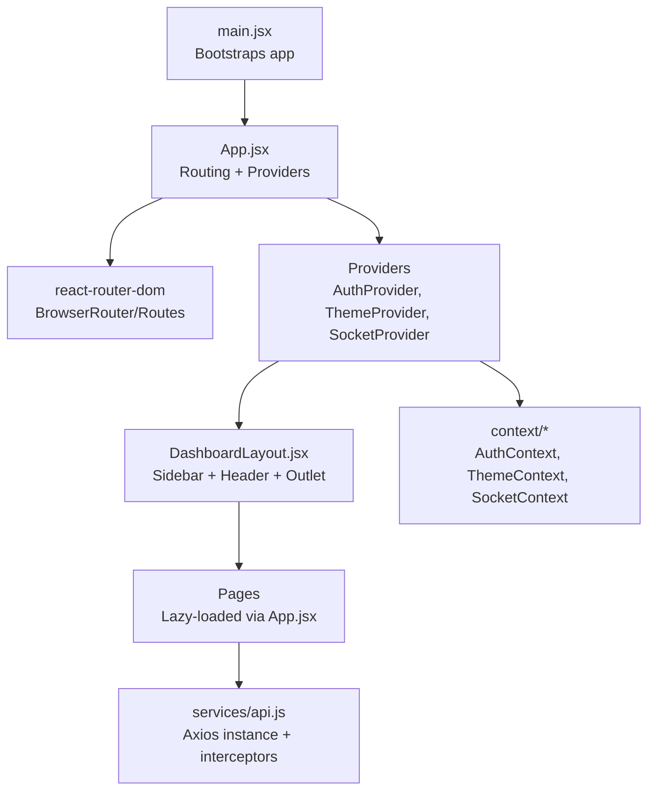
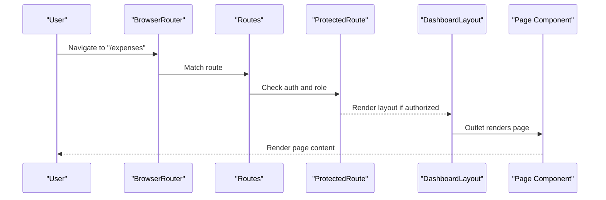
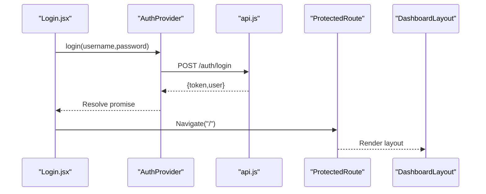
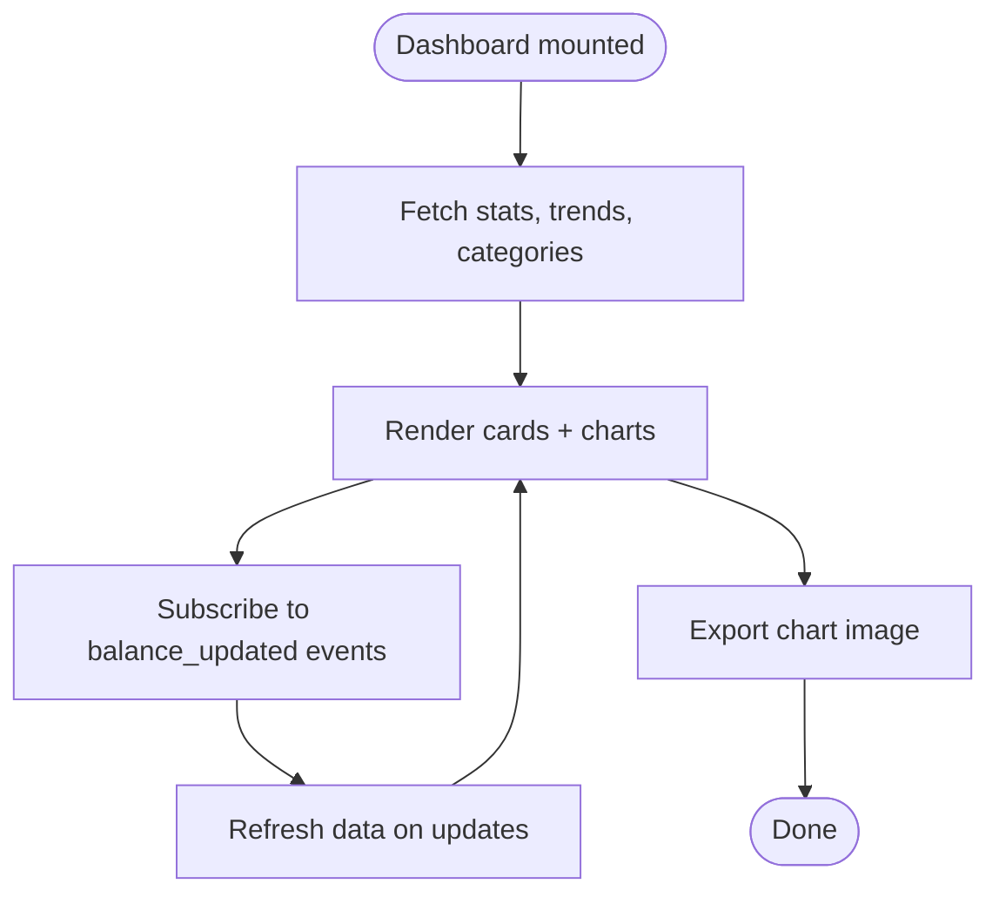
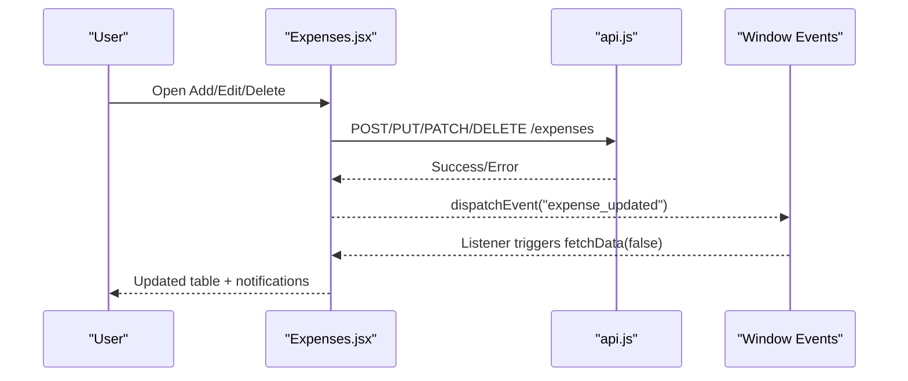
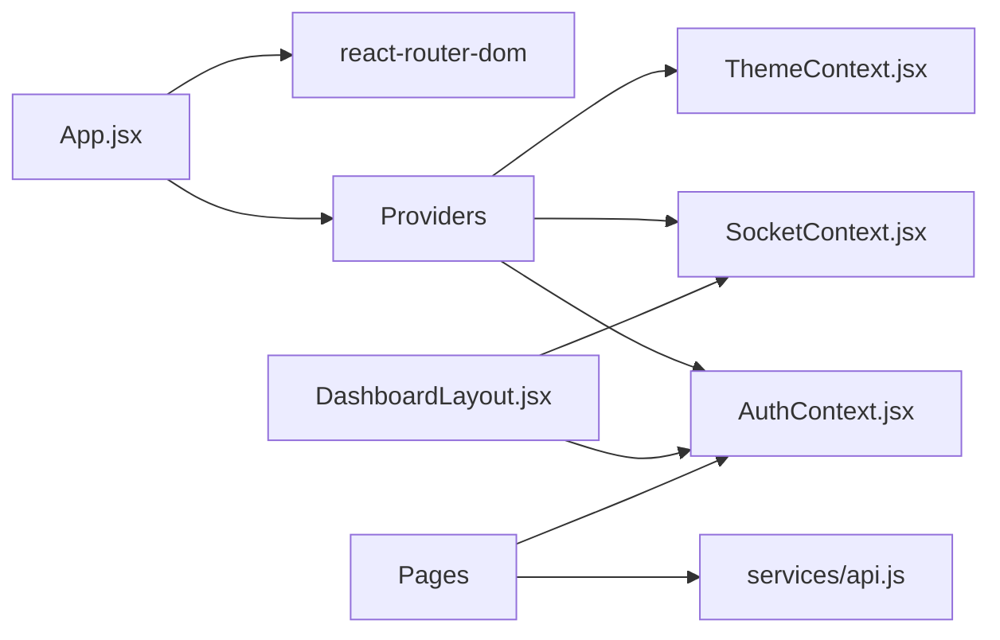

# Page Components

<cite>
**Referenced Files in This Document**
- [App.jsx](file://frontend/src/App.jsx)
- [main.jsx](file://frontend/src/main.jsx)
- [DashboardLayout.jsx](file://frontend/src/layouts/DashboardLayout.jsx)
- [Login.jsx](file://frontend/src/pages/Login.jsx)
- [Dashboard.jsx](file://frontend/src/pages/Dashboard.jsx)
- [Expenses.jsx](file://frontend/src/pages/Expenses.jsx)
- [Users.jsx](file://frontend/src/pages/Users.jsx)
- [Funds.jsx](file://frontend/src/pages/Funds.jsx)
- [Analytics.jsx](file://frontend/src/pages/Analytics.jsx)
- [Reports.jsx](file://frontend/src/pages/Reports.jsx)
- [api.js](file://frontend/src/services/api.js)
- [AuthContext.jsx](file://frontend/src/context/AuthContext.jsx)
</cite>

## Table of Contents
1. [Introduction](#introduction)
2. [Project Structure](#project-structure)
3. [Core Components](#core-components)
4. [Architecture Overview](#architecture-overview)
5. [Detailed Component Analysis](#detailed-component-analysis)
6. [Dependency Analysis](#dependency-analysis)
7. [Performance Considerations](#performance-considerations)
8. [Troubleshooting Guide](#troubleshooting-guide)
9. [Conclusion](#conclusion)

## Introduction
This document describes the React page components and routing system for the Petty Cash application. It covers routing configuration, protected routes, page lifecycle, and data fetching patterns. It also documents component props/state, integration with context providers, and page-specific features such as forms, data tables, charts, and exports. Guidance is included for navigation, route protection, dynamic content loading, and responsive/mobile-first design.

## Project Structure
The frontend is structured around a single-page application with client-side routing, lazy-loaded pages, and a dashboard layout. Providers for authentication, theme, and sockets wrap the routing tree. Pages are organized under a dedicated folder and integrate with shared services and contexts.

**Diagram sources**
- [main.jsx:1-11](file://frontend/src/main.jsx#L1-L11)
- [App.jsx:45-127](file://frontend/src/App.jsx#L45-L127)
- [DashboardLayout.jsx:51-335](file://frontend/src/layouts/DashboardLayout.jsx#L51-L335)
- [api.js:1-29](file://frontend/src/services/api.js#L1-L29)
- [AuthContext.jsx:1-54](file://frontend/src/context/AuthContext.jsx#L1-L54)

**Section sources**
- [main.jsx:1-11](file://frontend/src/main.jsx#L1-L11)
- [App.jsx:45-127](file://frontend/src/App.jsx#L45-L127)
- [DashboardLayout.jsx:51-335](file://frontend/src/layouts/DashboardLayout.jsx#L51-L335)
- [api.js:1-29](file://frontend/src/services/api.js#L1-L29)
- [AuthContext.jsx:1-54](file://frontend/src/context/AuthContext.jsx#L1-L54)

## Core Components
- Routing and Protection
  - Single-page routing with react-router-dom.
  - ProtectedRoute enforces authentication and role-based access.
  - Lazy loading for all pages except Login.
- Providers
  - AuthProvider manages user session and token persistence.
  - ThemeProvider and SocketProvider wrap the routing tree.
- Layout
  - DashboardLayout renders sidebar, header, and outlet; handles real-time balance updates and mobile menu.

**Section sources**
- [App.jsx:26-43](file://frontend/src/App.jsx#L26-L43)
- [App.jsx:45-127](file://frontend/src/App.jsx#L45-L127)
- [DashboardLayout.jsx:51-335](file://frontend/src/layouts/DashboardLayout.jsx#L51-L335)
- [AuthContext.jsx:1-54](file://frontend/src/context/AuthContext.jsx#L1-L54)

## Architecture Overview
The routing tree defines public and protected routes. Protected routes enforce authentication and optional role checks. Pages are rendered inside the layout, which provides navigation and global UI.

**Diagram sources**
- [App.jsx:58-117](file://frontend/src/App.jsx#L58-L117)
- [App.jsx:26-43](file://frontend/src/App.jsx#L26-L43)
- [DashboardLayout.jsx:231-233](file://frontend/src/layouts/DashboardLayout.jsx#L231-L233)

## Detailed Component Analysis

### Authentication and Routing
- ProtectedRoute
  - Uses AuthContext to guard routes.
  - Redirects unauthenticated users to Login.
  - Enforces allowedRoles for admin-only pages.
- Login
  - Handles credentials submission, error display, and navigation after successful login.
- AuthProvider
  - Persists token in localStorage, loads user on startup, exposes login/logout.
- API Interceptor
  - Adds Authorization header for requests.
  - Handles 401 globally by removing token and redirecting to Login.

**Diagram sources**
- [Login.jsx:17-30](file://frontend/src/pages/Login.jsx#L17-L30)
- [AuthContext.jsx:32-38](file://frontend/src/context/AuthContext.jsx#L32-L38)
- [api.js:7-26](file://frontend/src/services/api.js#L7-L26)
- [App.jsx:26-43](file://frontend/src/App.jsx#L26-L43)
- [DashboardLayout.jsx:231-233](file://frontend/src/layouts/DashboardLayout.jsx#L231-L233)

**Section sources**
- [App.jsx:26-43](file://frontend/src/App.jsx#L26-L43)
- [App.jsx:58-117](file://frontend/src/App.jsx#L58-L117)
- [Login.jsx:17-30](file://frontend/src/pages/Login.jsx#L17-L30)
- [AuthContext.jsx:32-44](file://frontend/src/context/AuthContext.jsx#L32-L44)
- [api.js:7-26](file://frontend/src/services/api.js#L7-L26)

### Dashboard
- Purpose: Executive overview with charts, recent activity, and quick actions.
- Data Fetching: Parallel fetch for stats, trends, and categories.
- Charts: Area chart (expenses trend), pie chart (category allocation), bar/pie for department breakdown.
- Real-time: Listens to window and socket events to refresh balance and data.
- Export: Chart images via SVG-to-canvas conversion.

**Diagram sources**
- [Dashboard.jsx:88-111](file://frontend/src/pages/Dashboard.jsx#L88-L111)
- [Dashboard.jsx:162-177](file://frontend/src/pages/Dashboard.jsx#L162-L177)

**Section sources**
- [Dashboard.jsx:76-479](file://frontend/src/pages/Dashboard.jsx#L76-L479)

### Expenses
- Purpose: Manage petty cash vouchers with advanced filtering, pagination, and CRUD actions.
- Forms: New expense modal with metadata (category, department, unit), attachments upload, and dynamic unit creation.
- State: Local state for filters, pagination, form data, and modals.
- Data Fetching: Debounced search, controlled filters, abortable fetch with AbortController.
- Actions: Approve/reject/liquidate, view details, edit, delete; emits window events to refresh lists.
- Export: Excel and PDF exports via API and client libraries.

**Diagram sources**
- [Expenses.jsx:176-208](file://frontend/src/pages/Expenses.jsx#L176-L208)
- [Expenses.jsx:255-278](file://frontend/src/pages/Expenses.jsx#L255-L278)
- [Expenses.jsx:127-131](file://frontend/src/pages/Expenses.jsx#L127-L131)

**Section sources**
- [Expenses.jsx:29-856](file://frontend/src/pages/Expenses.jsx#L29-L856)

### Users
- Purpose: Manage user accounts and roles.
- Features: Create/edit/delete users, select role and department, modal form.
- Embedded Mode: Optional embedded rendering for use in other pages.

**Section sources**
- [Users.jsx:11-312](file://frontend/src/pages/Users.jsx#L11-L312)

### Funds
- Purpose: Track petty cash replenishments and compute balances.
- Features: Add/remove fund entries, view history, summary cards.
- Real-time: Dispatches balance_updated event after deletions.

**Section sources**
- [Funds.jsx:9-192](file://frontend/src/pages/Funds.jsx#L9-L192)

### Analytics
- Purpose: Multi-dimensional financial analysis with category and department breakdowns.
- Features: Toggle between active and historical views, filter by category, export charts.

**Section sources**
- [Analytics.jsx:16-327](file://frontend/src/pages/Analytics.jsx#L16-L327)

### Reports
- Purpose: Generate enterprise-grade financial reports with filters and export to Excel/PDF.
- Features: Date range, category, and department filters; summary cards; charts; export to Excel and PDF.

**Section sources**
- [Reports.jsx:14-323](file://frontend/src/pages/Reports.jsx#L14-L323)

### Login
- Purpose: Authenticate users and persist token.
- Features: Form validation, password visibility toggle, error messaging, navigation on success.

**Section sources**
- [Login.jsx:8-156](file://frontend/src/pages/Login.jsx#L8-L156)

## Dependency Analysis
- Routing depends on react-router-dom and App’s route definitions.
- Pages depend on services/api.js for HTTP communication.
- DashboardLayout integrates AuthContext and SocketContext for user info and real-time updates.
- ProtectedRoute composes AuthContext to enforce access control.

**Diagram sources**
- [App.jsx:1-127](file://frontend/src/App.jsx#L1-L127)
- [DashboardLayout.jsx:25-29](file://frontend/src/layouts/DashboardLayout.jsx#L25-L29)
- [api.js:1-29](file://frontend/src/services/api.js#L1-L29)
- [AuthContext.jsx:1-54](file://frontend/src/context/AuthContext.jsx#L1-L54)

**Section sources**
- [App.jsx:1-127](file://frontend/src/App.jsx#L1-L127)
- [DashboardLayout.jsx:25-29](file://frontend/src/layouts/DashboardLayout.jsx#L25-L29)
- [api.js:1-29](file://frontend/src/services/api.js#L1-L29)
- [AuthContext.jsx:1-54](file://frontend/src/context/AuthContext.jsx#L1-L54)

## Performance Considerations
- Lazy loading reduces initial bundle size; pages are imported on demand.
- Expenses page debounces search input and uses AbortController to cancel stale requests.
- Parallel data fetching improves perceived performance (e.g., Dashboard).
- Chart exports use offscreen canvases; avoid repeated exports during animations.

## Troubleshooting Guide
- Authentication failures
  - 401 responses remove token and redirect to Login via API interceptor.
  - Verify token presence in localStorage and server endpoint availability.
- Protected route issues
  - Ensure ProtectedRoute wraps nested routes and allowedRoles match user role.
- Real-time updates
  - Confirm socket connection and window events are registered/unregistered on mount/unmount.
- Chart exports
  - Ensure refs are attached and SVG elements are present before exporting.

**Section sources**
- [api.js:16-26](file://frontend/src/services/api.js#L16-L26)
- [App.jsx:26-43](file://frontend/src/App.jsx#L26-L43)
- [Dashboard.jsx:96-110](file://frontend/src/pages/Dashboard.jsx#L96-L110)
- [Expenses.jsx:89-125](file://frontend/src/pages/Expenses.jsx#L89-L125)

## Conclusion
The application employs a clean separation of concerns: routing and protection handled centrally, pages encapsulate domain logic, and shared services and contexts provide cross-cutting capabilities. The design emphasizes responsive UI, real-time updates, and robust data flows with appropriate safeguards for performance and reliability.