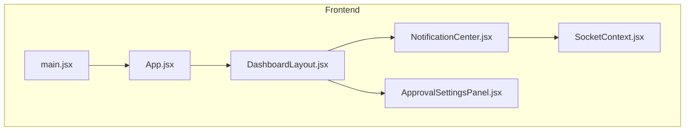
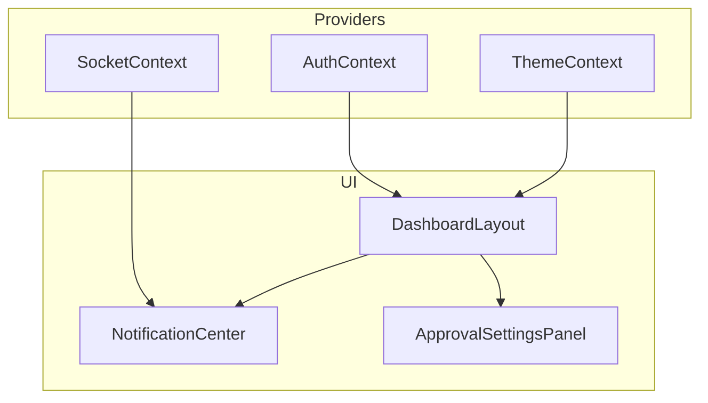
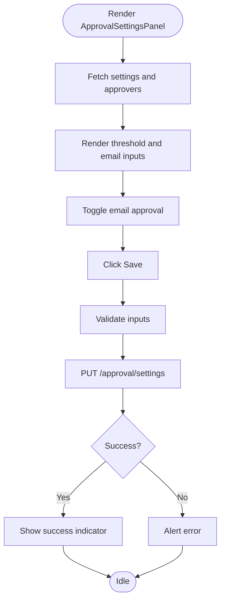
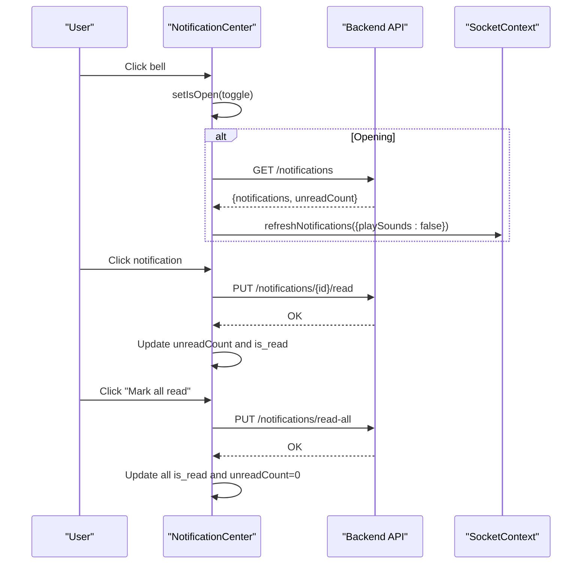
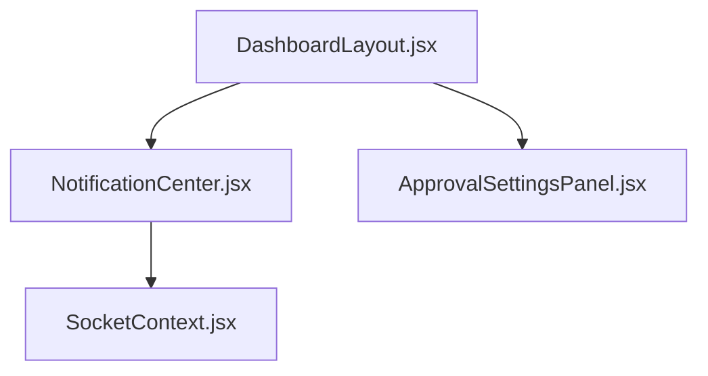
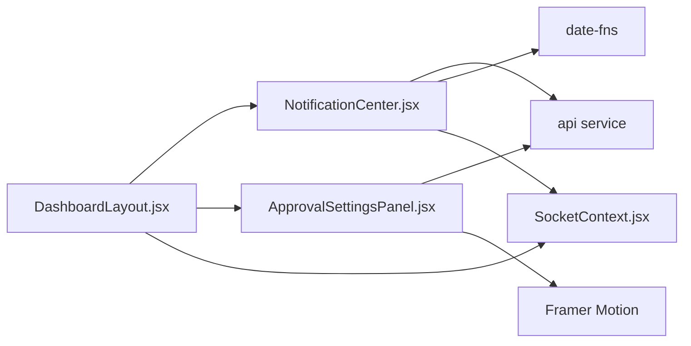

# Reusable UI Components

<cite>
**Referenced Files in This Document**
- [ApprovalSettingsPanel.jsx](file://frontend/src/components/ApprovalSettingsPanel.jsx)
- [NotificationCenter.jsx](file://frontend/src/components/NotificationCenter.jsx)
- [SocketContext.jsx](file://frontend/src/context/SocketContext.jsx)
- [DashboardLayout.jsx](file://frontend/src/layouts/DashboardLayout.jsx)
- [App.jsx](file://frontend/src/App.jsx)
- [main.jsx](file://frontend/src/main.jsx)
</cite>

## Table of Contents
1. [Introduction](#introduction)
2. [Project Structure](#project-structure)
3. [Core Components](#core-components)
4. [Architecture Overview](#architecture-overview)
5. [Detailed Component Analysis](#detailed-component-analysis)
6. [Dependency Analysis](#dependency-analysis)
7. [Performance Considerations](#performance-considerations)
8. [Troubleshooting Guide](#troubleshooting-guide)
9. [Conclusion](#conclusion)
10. [Appendices](#appendices)

## Introduction
This document provides comprehensive documentation for reusable UI components in the frontend, focusing on ApprovalSettingsPanel and NotificationCenter. It explains component props, events, slots, customization options, styling with Tailwind CSS, responsive behavior, accessibility, composition patterns, state management, event handling, data binding, testing strategies, and performance optimization techniques. The goal is to enable developers to integrate, customize, and maintain these components effectively within the application’s layout and workflows.

## Project Structure
The frontend is structured around a React application with routing, context providers, and layout components. ApprovalSettingsPanel and NotificationCenter are standalone components that can be composed within pages or layouts. SocketContext provides real-time notifications and critical alerts, while DashboardLayout integrates NotificationCenter into the header and manages critical alarms.

**Diagram sources**
- [main.jsx:1-11](file://frontend/src/main.jsx#L1-L11)
- [App.jsx:1-127](file://frontend/src/App.jsx#L1-L127)
- [DashboardLayout.jsx:1-335](file://frontend/src/layouts/DashboardLayout.jsx#L1-L335)
- [ApprovalSettingsPanel.jsx:1-252](file://frontend/src/components/ApprovalSettingsPanel.jsx#L1-L252)
- [NotificationCenter.jsx:1-183](file://frontend/src/components/NotificationCenter.jsx#L1-L183)
- [SocketContext.jsx:1-376](file://frontend/src/context/SocketContext.jsx#L1-L376)

**Section sources**
- [main.jsx:1-11](file://frontend/src/main.jsx#L1-L11)
- [App.jsx:1-127](file://frontend/src/App.jsx#L1-L127)
- [DashboardLayout.jsx:1-335](file://frontend/src/layouts/DashboardLayout.jsx#L1-L335)

## Core Components
This section documents the two primary reusable components and their integration points.

- ApprovalSettingsPanel
  - Purpose: Manage liquidation approval thresholds, email approval toggles, and multi-level approver lists.
  - Key state: Loading, success feedback, settings object, approvers list, new approver form.
  - Data binding: Controlled inputs bound to local state; saves to backend via API.
  - Events: Save, add approver, delete approver, toggle email approval.
  - Styling: Tailwind utility classes for spacing, borders, rounded corners, focus rings, and responsive grids.
  - Accessibility: Proper labels, input types, and keyboard-friendly controls.

- NotificationCenter
  - Purpose: Display recent notifications, manage read/unread states, and provide quick actions.
  - Key state: Open/closed dropdown, unread count, notifications list.
  - Integration: Uses SocketContext for real-time updates and critical alerts.
  - Events: Click to open/close, mark as read per item, mark all read, view all activity.
  - Styling: Responsive dropdown with animations, badges, and hover states.
  - Accessibility: Keyboard navigable, focus management, ARIA-friendly structure.

**Section sources**
- [ApprovalSettingsPanel.jsx:1-252](file://frontend/src/components/ApprovalSettingsPanel.jsx#L1-L252)
- [NotificationCenter.jsx:1-183](file://frontend/src/components/NotificationCenter.jsx#L1-L183)
- [SocketContext.jsx:1-376](file://frontend/src/context/SocketContext.jsx#L1-L376)

## Architecture Overview
The components operate within a provider-based architecture. SocketContext supplies real-time notifications and critical alerts to NotificationCenter. DashboardLayout composes NotificationCenter into the header and handles critical alarm modal rendering. ApprovalSettingsPanel operates independently but integrates with backend APIs for approvals.

**Diagram sources**
- [App.jsx:1-127](file://frontend/src/App.jsx#L1-L127)
- [DashboardLayout.jsx:1-335](file://frontend/src/layouts/DashboardLayout.jsx#L1-L335)
- [SocketContext.jsx:1-376](file://frontend/src/context/SocketContext.jsx#L1-L376)

## Detailed Component Analysis

### ApprovalSettingsPanel
- Props: None (self-contained).
- Events:
  - Save settings button triggers save operation.
  - Toggle for enabling/disabling email approval.
  - Add/remove approvers with form inputs.
- Slots: None (static layout).
- Customization:
  - Threshold input supports numeric values with currency-like styling.
  - Email input styled with icon and focus ring.
  - Multi-level approver list with dynamic addition/removal.
- State management:
  - Local state for settings, approvers, and UI feedback.
  - Asynchronous loading and saving with loading flags and success indicators.
- Data binding:
  - Controlled inputs update local state; save persists to backend.
  - Backend endpoints: settings and approvers.
- Styling and responsiveness:
  - Grid layout adapts from single column to two-column on medium screens.
  - Rounded inputs with icons, focus rings, and consistent typography.
- Accessibility:
  - Clear labels, proper input types, and visible focus states.

**Diagram sources**
- [ApprovalSettingsPanel.jsx:17-54](file://frontend/src/components/ApprovalSettingsPanel.jsx#L17-L54)

**Section sources**
- [ApprovalSettingsPanel.jsx:1-252](file://frontend/src/components/ApprovalSettingsPanel.jsx#L1-L252)

### NotificationCenter
- Props: None (self-contained).
- Events:
  - Click bell to open/close dropdown.
  - Click notification to mark as read.
  - Click "Mark all read" to batch mark.
  - Click "View All Activity" to close dropdown.
- Slots: None (static layout).
- Customization:
  - Type-specific styling and icons based on type and priority.
  - Unread dot badge with pulsing animation for critical alerts.
  - Responsive dropdown with scrollable content area.
- State management:
  - Local state for open/closed, unread count, and notifications.
  - Consumes SocketContext for real-time updates and critical alerts.
- Data binding:
  - Reads from backend via API on mount.
  - Updates unread count and marks read via PUT endpoints.
- Styling and responsiveness:
  - Dropdown positioned absolutely with animations.
  - Scrollbar styling via custom class.
  - Hover and active states for interactivity.
- Accessibility:
  - Focus management, keyboard-friendly interactions, and clear visual states.

**Diagram sources**
- [NotificationCenter.jsx:13-55](file://frontend/src/components/NotificationCenter.jsx#L13-L55)
- [SocketContext.jsx:161-193](file://frontend/src/context/SocketContext.jsx#L161-L193)

**Section sources**
- [NotificationCenter.jsx:1-183](file://frontend/src/components/NotificationCenter.jsx#L1-L183)
- [SocketContext.jsx:1-376](file://frontend/src/context/SocketContext.jsx#L1-L376)

### Composition Patterns and Integration
- DashboardLayout integrates NotificationCenter into the navbar and displays a critical alarm modal when active.
- ApprovalSettingsPanel is intended for use within settings pages and does not rely on SocketContext.
- Both components are designed to be self-contained and reusable across different pages.

**Diagram sources**
- [DashboardLayout.jsx:49-210](file://frontend/src/layouts/DashboardLayout.jsx#L49-L210)
- [NotificationCenter.jsx:1-183](file://frontend/src/components/NotificationCenter.jsx#L1-L183)
- [SocketContext.jsx:1-376](file://frontend/src/context/SocketContext.jsx#L1-L376)

**Section sources**
- [DashboardLayout.jsx:1-335](file://frontend/src/layouts/DashboardLayout.jsx#L1-L335)

## Dependency Analysis
- ApprovalSettingsPanel depends on:
  - Local state and effects for data fetching and saving.
  - API service for backend communication.
  - Framer Motion for animations.
- NotificationCenter depends on:
  - SocketContext for real-time notifications and critical alerts.
  - API service for fetching and marking notifications.
  - date-fns for relative time formatting.
- DashboardLayout composes both components and provides context providers.

**Diagram sources**
- [ApprovalSettingsPanel.jsx:1-252](file://frontend/src/components/ApprovalSettingsPanel.jsx#L1-L252)
- [NotificationCenter.jsx:1-183](file://frontend/src/components/NotificationCenter.jsx#L1-L183)
- [SocketContext.jsx:1-376](file://frontend/src/context/SocketContext.jsx#L1-L376)
- [DashboardLayout.jsx:1-335](file://frontend/src/layouts/DashboardLayout.jsx#L1-L335)

**Section sources**
- [ApprovalSettingsPanel.jsx:1-252](file://frontend/src/components/ApprovalSettingsPanel.jsx#L1-L252)
- [NotificationCenter.jsx:1-183](file://frontend/src/components/NotificationCenter.jsx#L1-L183)
- [SocketContext.jsx:1-376](file://frontend/src/context/SocketContext.jsx#L1-L376)
- [DashboardLayout.jsx:1-335](file://frontend/src/layouts/DashboardLayout.jsx#L1-L335)

## Performance Considerations
- Minimize re-renders:
  - Use memoization for derived data and callbacks where appropriate.
  - Keep components small and focused to reduce render overhead.
- Network efficiency:
  - Batch API calls when possible; use concurrent fetching for related data.
  - Debounce user input for settings where applicable.
- Rendering performance:
  - Virtualize long lists if notification counts grow large.
  - Avoid unnecessary animations during rapid state changes.
- Bundle size:
  - Import only required icons and utilities.
  - Lazy-load heavy components if needed.

## Troubleshooting Guide
- ApprovalSettingsPanel
  - Symptom: Settings fail to save.
    - Check network connectivity and API endpoint availability.
    - Verify that the settings payload matches backend expectations.
  - Symptom: Approver list not updating after add/delete.
    - Confirm successful API response and state update.
    - Ensure unique identifiers are present for list keys.
- NotificationCenter
  - Symptom: Notifications not appearing.
    - Verify SocketContext connection and event listeners.
    - Check browser permissions for desktop notifications.
  - Symptom: Unread count incorrect.
    - Ensure read/unread updates are reflected in state and backend.
- General
  - Symptom: Critical alarm not audible across tabs.
    - Confirm multi-tab audio lock mechanism and storage events.
  - Symptom: Dropdown not closing on outside click.
    - Verify click-outside handler is attached and cleaned up.

**Section sources**
- [ApprovalSettingsPanel.jsx:34-75](file://frontend/src/components/ApprovalSettingsPanel.jsx#L34-L75)
- [NotificationCenter.jsx:28-35](file://frontend/src/components/NotificationCenter.jsx#L28-L35)
- [SocketContext.jsx:292-303](file://frontend/src/context/SocketContext.jsx#L292-L303)

## Conclusion
The ApprovalSettingsPanel and NotificationCenter components are designed for reuse, clear separation of concerns, and robust integration with the application’s context providers. They leverage Tailwind CSS for styling, Framer Motion for animations, and SocketContext for real-time updates. Following the guidelines in this document will help ensure consistent behavior, accessibility, and performance across the application.

## Appendices

### Usage Examples (by reference)
- ApprovalSettingsPanel
  - Typical usage: Place inside a settings page component.
  - Reference: [ApprovalSettingsPanel.jsx:1-252](file://frontend/src/components/ApprovalSettingsPanel.jsx#L1-L252)
- NotificationCenter
  - Typical usage: Render in the navbar within a layout.
  - Reference: [DashboardLayout.jsx:209](file://frontend/src/layouts/DashboardLayout.jsx#L209)
- SocketContext integration
  - Real-time notifications and critical alerts.
  - Reference: [SocketContext.jsx:130-376](file://frontend/src/context/SocketContext.jsx#L130-L376)

### Accessibility Checklist
- Ensure labels are associated with inputs.
- Provide keyboard navigation support.
- Maintain sufficient color contrast for badges and indicators.
- Announce critical alerts with screen reader-friendly messages.

### Testing Strategies
- Unit tests
  - Mock API responses for settings and notifications.
  - Simulate user interactions (clicks, toggles, form submissions).
- Integration tests
  - Verify component renders under different contexts (with and without SocketContext).
  - Test real-time updates via mocked socket events.
- Visual regression tests
  - Capture key states (open dropdown, critical alert modal, success feedback).
- Performance tests
  - Measure render times and network latency for data fetching.