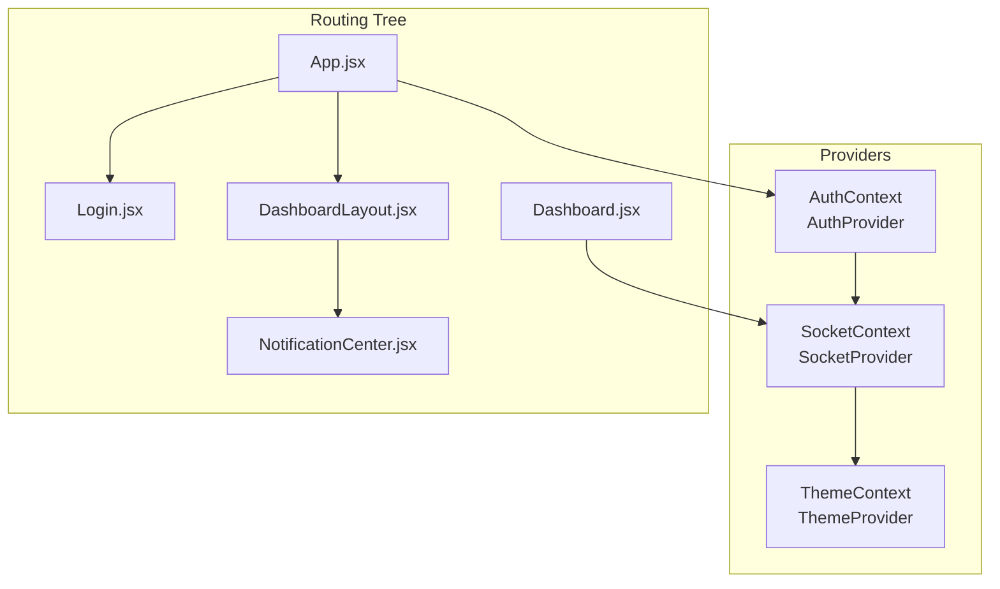
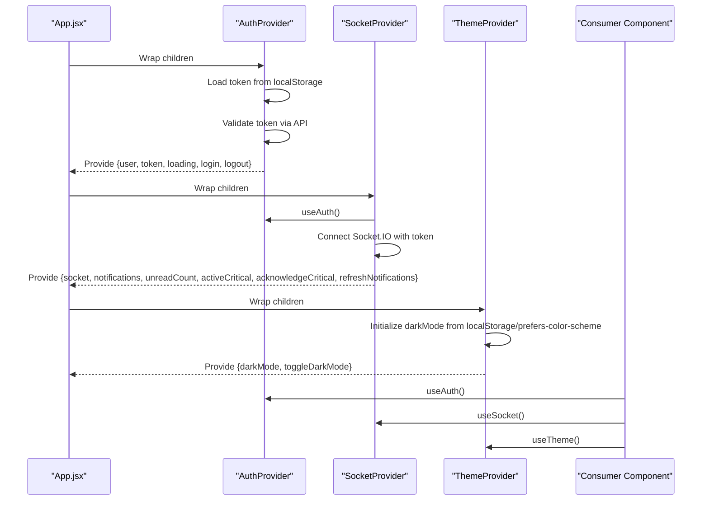
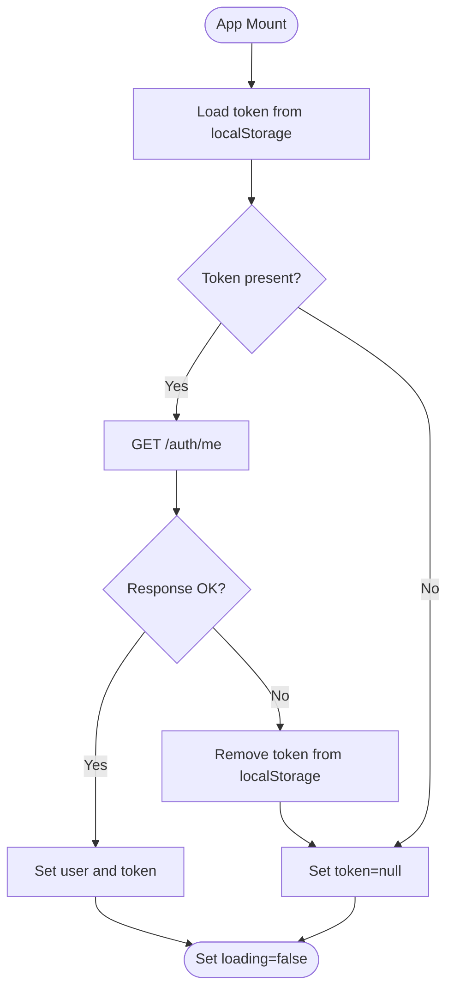
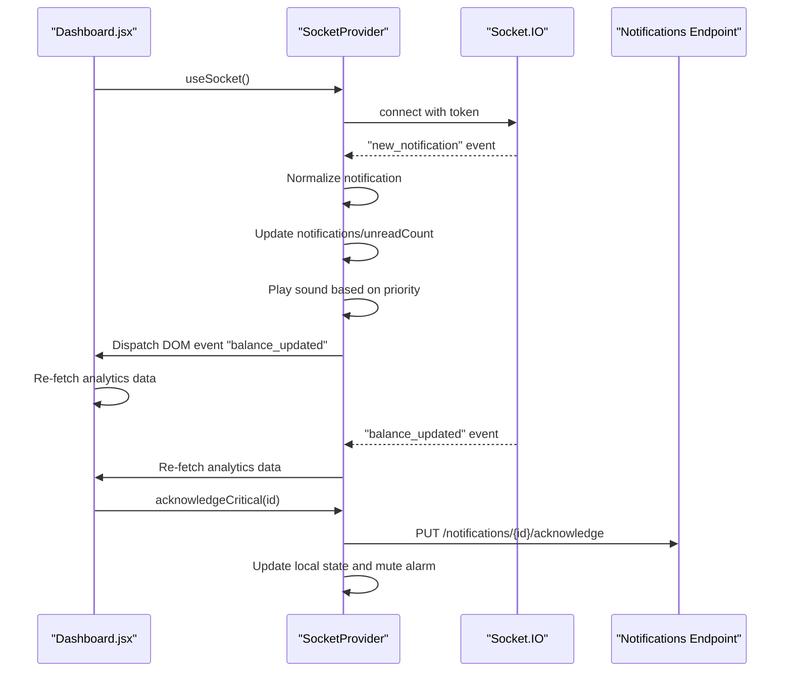
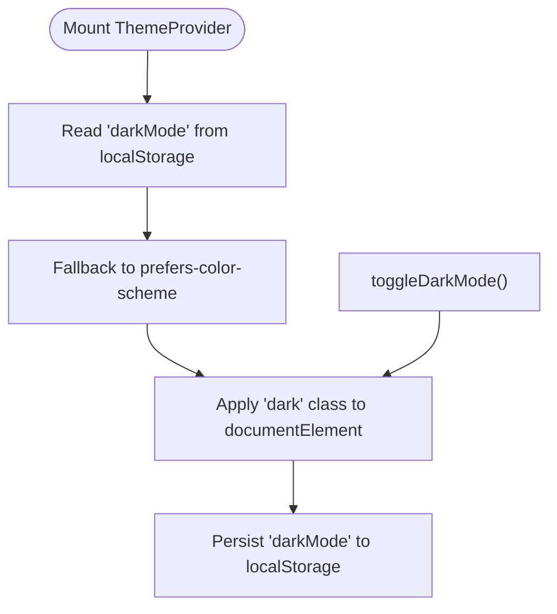
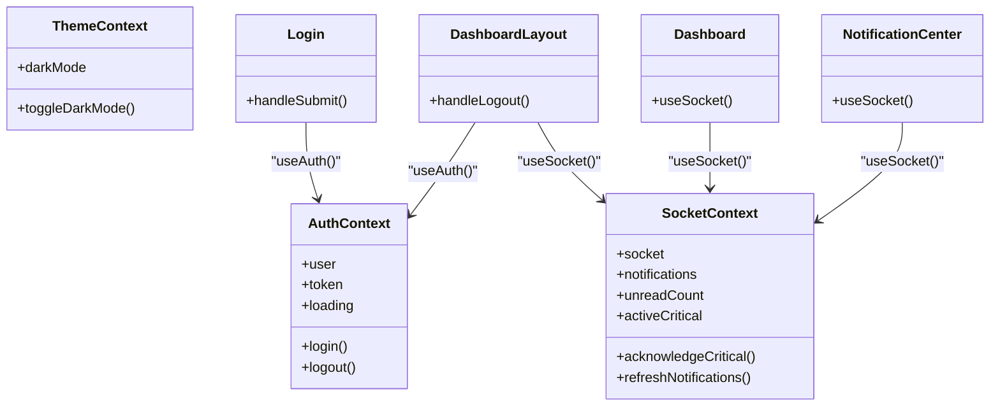
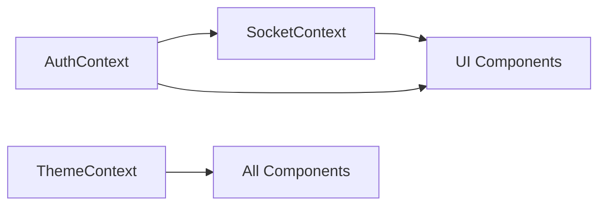
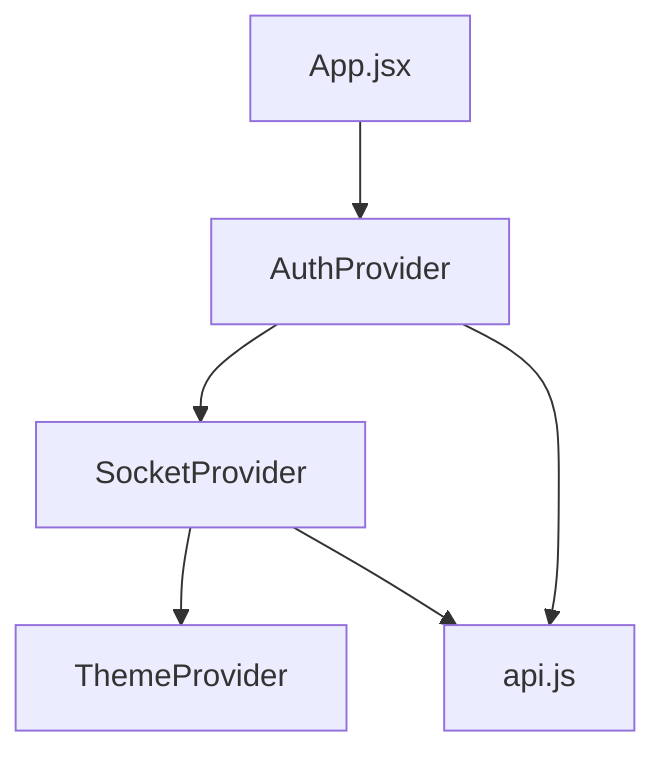

# State Management & Context

<cite>
**Referenced Files in This Document**
- [AuthContext.jsx](file://frontend/src/context/AuthContext.jsx)
- [SocketContext.jsx](file://frontend/src/context/SocketContext.jsx)
- [ThemeContext.jsx](file://frontend/src/context/ThemeContext.jsx)
- [App.jsx](file://frontend/src/App.jsx)
- [main.jsx](file://frontend/src/main.jsx)
- [Login.jsx](file://frontend/src/pages/Login.jsx)
- [DashboardLayout.jsx](file://frontend/src/layouts/DashboardLayout.jsx)
- [Dashboard.jsx](file://frontend/src/pages/Dashboard.jsx)
- [NotificationCenter.jsx](file://frontend/src/components/NotificationCenter.jsx)
- [api.js](file://frontend/src/services/api.js)
</cite>

## Table of Contents
1. [Introduction](#introduction)
2. [Project Structure](#project-structure)
3. [Core Components](#core-components)
4. [Architecture Overview](#architecture-overview)
5. [Detailed Component Analysis](#detailed-component-analysis)
6. [Dependency Analysis](#dependency-analysis)
7. [Performance Considerations](#performance-considerations)
8. [Troubleshooting Guide](#troubleshooting-guide)
9. [Conclusion](#conclusion)

## Introduction
This document explains the React state management architecture built around three primary context providers: AuthContext for authentication, SocketContext for real-time notifications and balance updates, and ThemeContext for theme management. It covers provider implementations, consumer patterns, state update mechanisms, custom hooks, state synchronization, persistence, performance considerations, and memory leak prevention. It also details how contexts coordinate to deliver a cohesive user experience across the application.

## Project Structure
The state management layer is organized under the frontend/src/context directory with three dedicated providers. The App component composes these providers to wrap the routing tree, enabling consumers across the app to access shared state.

**Diagram sources**
- [App.jsx:45-123](file://frontend/src/App.jsx#L45-L123)
- [AuthContext.jsx:6-51](file://frontend/src/context/AuthContext.jsx#L6-L51)
- [SocketContext.jsx:130-375](file://frontend/src/context/SocketContext.jsx#L130-L375)
- [ThemeContext.jsx:5-27](file://frontend/src/context/ThemeContext.jsx#L5-L27)
- [Login.jsx:1-156](file://frontend/src/pages/Login.jsx#L1-L156)
- [DashboardLayout.jsx:51-335](file://frontend/src/layouts/DashboardLayout.jsx#L51-L335)
- [Dashboard.jsx:76-111](file://frontend/src/pages/Dashboard.jsx#L76-L111)
- [NotificationCenter.jsx:8-35](file://frontend/src/components/NotificationCenter.jsx#L8-L35)

**Section sources**
- [App.jsx:45-123](file://frontend/src/App.jsx#L45-L123)
- [main.jsx:1-11](file://frontend/src/main.jsx#L1-L11)

## Core Components
- AuthContext: Manages user session, token lifecycle, and login/logout actions. Persists token in localStorage and hydrates state on app load.
- SocketContext: Orchestrates real-time notifications, critical alerts, and balance updates via Socket.IO. Integrates with AuthContext for token-based authentication and with browser APIs for audio and desktop notifications.
- ThemeContext: Controls dark/light mode preference persisted in localStorage and applies class toggles to the document root.

**Section sources**
- [AuthContext.jsx:6-51](file://frontend/src/context/AuthContext.jsx#L6-L51)
- [SocketContext.jsx:130-375](file://frontend/src/context/SocketContext.jsx#L130-L375)
- [ThemeContext.jsx:5-27](file://frontend/src/context/ThemeContext.jsx#L5-L27)

## Architecture Overview
The providers form a layered composition. AuthContext initializes first, then SocketContext consumes authentication state to establish a secure connection. ThemeContext sits at the top level, independent of authentication and sockets, but available to all components.

**Diagram sources**
- [App.jsx:53-122](file://frontend/src/App.jsx#L53-L122)
- [AuthContext.jsx:11-30](file://frontend/src/context/AuthContext.jsx#L11-L30)
- [SocketContext.jsx:130-290](file://frontend/src/context/SocketContext.jsx#L130-L290)
- [ThemeContext.jsx:5-27](file://frontend/src/context/ThemeContext.jsx#L5-L27)

## Detailed Component Analysis

### AuthContext Provider
- Initialization: Reads token from localStorage and validates it against the backend to hydrate user state. Sets loading to false after completion.
- Authentication flow: login dispatches credentials to the backend, stores the returned token, and updates user/token state. logout removes token and clears user state.
- Persistence: Token is persisted in localStorage to survive page reloads.
- Consumers: Components like Login.jsx use the login function to authenticate and navigate on success.

**Diagram sources**
- [AuthContext.jsx:11-30](file://frontend/src/context/AuthContext.jsx#L11-L30)

**Section sources**
- [AuthContext.jsx:6-51](file://frontend/src/context/AuthContext.jsx#L6-L51)
- [Login.jsx:14-30](file://frontend/src/pages/Login.jsx#L14-L30)
- [api.js:8-14](file://frontend/src/services/api.js#L8-L14)

### SocketContext Provider
- Real-time notifications: Establishes a Socket.IO connection with token-based authentication. Listens for new_notification and receiveNotification events, normalizes them, and updates notifications and unread counts. Plays distinct sounds for normal, important, and critical priorities.
- Critical alerts: Maintains activeCritical state and plays a continuous looping alarm via Web Audio API. Uses localStorage locks to coordinate multi-tab audio playback and acknowledges critical alerts across tabs.
- Fallback polling: Periodically polls notifications endpoint to keep unread counts synchronized when socket events are unavailable.
- Balance updates: Listens for balance_updated events and triggers DOM events for components to refresh data.
- Acknowledgment: Provides acknowledgeCritical to mark critical alerts as read/acknowledged, updating local state and server state.

**Diagram sources**
- [SocketContext.jsx:210-290](file://frontend/src/context/SocketContext.jsx#L210-L290)
- [Dashboard.jsx:96-111](file://frontend/src/pages/Dashboard.jsx#L96-L111)

**Section sources**
- [SocketContext.jsx:130-375](file://frontend/src/context/SocketContext.jsx#L130-L375)
- [Dashboard.jsx:76-111](file://frontend/src/pages/Dashboard.jsx#L76-L111)
- [DashboardLayout.jsx:56-56](file://frontend/src/layouts/DashboardLayout.jsx#L56-L56)

### ThemeContext Provider
- Initialization: Determines initial darkMode from localStorage or prefers-color-scheme media query.
- Persistence: Applies 'dark' class to document.documentElement and persists preference to localStorage.
- Consumer hook: useTheme exposes darkMode and toggleDarkMode for components to switch themes.

**Diagram sources**
- [ThemeContext.jsx:5-18](file://frontend/src/context/ThemeContext.jsx#L5-L18)

**Section sources**
- [ThemeContext.jsx:5-27](file://frontend/src/context/ThemeContext.jsx#L5-L27)

### Consumer Patterns and Custom Hooks
- Custom hooks: useAuth, useSocket, useTheme provide typed access to context values. Components import these hooks to consume state and actions.
- Example usage:
  - Login.jsx: Uses useAuth.login to authenticate and navigate on success.
  - DashboardLayout.jsx: Uses useAuth.logout and useSocket.activeCritical/acknowledgeCritical to manage session and critical alerts.
  - Dashboard.jsx: Uses useSocket.socket to listen for balance updates and refresh analytics.
  - NotificationCenter.jsx: Uses useSocket.notifications, unreadCount, and refreshNotifications to render and manage notifications.

**Diagram sources**
- [AuthContext.jsx:52-54](file://frontend/src/context/AuthContext.jsx#L52-L54)
- [SocketContext.jsx:6-7](file://frontend/src/context/SocketContext.jsx#L6-L7)
- [ThemeContext.jsx:28-29](file://frontend/src/context/ThemeContext.jsx#L28-L29)
- [Login.jsx:14-30](file://frontend/src/pages/Login.jsx#L14-L30)
- [DashboardLayout.jsx:72-75](file://frontend/src/layouts/DashboardLayout.jsx#L72-L75)
- [Dashboard.jsx:76-78](file://frontend/src/pages/Dashboard.jsx#L76-L78)
- [NotificationCenter.jsx:9-10](file://frontend/src/components/NotificationCenter.jsx#L9-L10)

**Section sources**
- [Login.jsx:14-30](file://frontend/src/pages/Login.jsx#L14-L30)
- [DashboardLayout.jsx:54-56](file://frontend/src/layouts/DashboardLayout.jsx#L54-L56)
- [Dashboard.jsx:76-111](file://frontend/src/pages/Dashboard.jsx#L76-L111)
- [NotificationCenter.jsx:9-10](file://frontend/src/components/NotificationCenter.jsx#L9-L10)

### State Synchronization Across Contexts
- AuthContext drives SocketContext: SocketProvider reads user and token from useAuth to establish a secure connection. When user logs out, SocketProvider closes the socket and resets state.
- ThemeContext is independent and does not depend on authentication or sockets, but is available to all components.
- Notifications and critical alerts: SocketProvider updates notifications and unreadCount, while DashboardLayout renders the critical alert modal and handles acknowledgment.

**Diagram sources**
- [SocketContext.jsx:130-290](file://frontend/src/context/SocketContext.jsx#L130-L290)
- [App.jsx:53-122](file://frontend/src/App.jsx#L53-L122)

**Section sources**
- [SocketContext.jsx:130-290](file://frontend/src/context/SocketContext.jsx#L130-L290)
- [App.jsx:53-122](file://frontend/src/App.jsx#L53-L122)

## Dependency Analysis
- Provider composition order: App.jsx composes providers from inside-out. AuthProvider wraps SocketProvider, which wraps ThemeProvider. This ensures SocketProvider can access authentication state while ThemeProvider remains independent.
- Inter-provider dependencies:
  - SocketContext depends on AuthContext for token-based authentication.
  - ThemeContext is standalone and does not depend on other contexts.
- API integration: api.js interceptors inject Authorization headers and handle 401 responses by clearing tokens and redirecting to login.

**Diagram sources**
- [App.jsx:53-122](file://frontend/src/App.jsx#L53-L122)
- [AuthContext.jsx:1-2](file://frontend/src/context/AuthContext.jsx#L1-L2)
- [SocketContext.jsx:1-3](file://frontend/src/context/SocketContext.jsx#L1-L3)
- [ThemeContext.jsx:1-1](file://frontend/src/context/ThemeContext.jsx#L1-L1)
- [api.js:3-26](file://frontend/src/services/api.js#L3-L26)

**Section sources**
- [App.jsx:53-122](file://frontend/src/App.jsx#L53-L122)
- [api.js:8-26](file://frontend/src/services/api.js#L8-L26)

## Performance Considerations
- Efficient re-renders:
  - SocketProvider uses refs for seenNotificationIdsRef to prevent duplicate processing and minimize re-renders.
  - Notifications list updates use prepend and deduplication to avoid unnecessary renders.
- Polling fallback: SocketProvider periodically polls notifications to maintain synchronization when socket events are unavailable.
- Audio engine: Web Audio API oscillators are stopped and cleaned up to prevent resource leaks. A periodic heartbeat maintains active tab awareness.
- DOM events: Components subscribe to window events for balance updates, avoiding redundant socket listeners where appropriate.

[No sources needed since this section provides general guidance]

## Troubleshooting Guide
- Authentication issues:
  - If login fails, verify token presence in localStorage and network requests. The api interceptor automatically attaches Authorization headers and redirects on 401.
- Socket connection problems:
  - Ensure token is present and valid. SocketProvider reconnects with exponential backoff and timeouts. Verify VITE_API_URL environment variable.
- Critical alerts not audible:
  - Confirm Notification permission granted and localStorage keys for multi-tab audio locks. Check that acknowledgeCritical writes to localStorage to mute alarms across tabs.
- Theme not applying:
  - Verify 'dark' class is added to document.documentElement and 'darkMode' is persisted in localStorage.

**Section sources**
- [api.js:8-26](file://frontend/src/services/api.js#L8-L26)
- [SocketContext.jsx:210-290](file://frontend/src/context/SocketContext.jsx#L210-L290)
- [ThemeContext.jsx:11-18](file://frontend/src/context/ThemeContext.jsx#L11-L18)

## Conclusion
The application’s state management relies on three complementary contexts: AuthContext for secure sessions, SocketContext for real-time updates and critical alerts, and ThemeContext for UI preferences. Providers are composed carefully to enable cross-context coordination, with robust persistence, fallback mechanisms, and cleanup strategies to prevent memory leaks. Consumers consistently use custom hooks to access state and actions, resulting in a predictable and maintainable architecture.