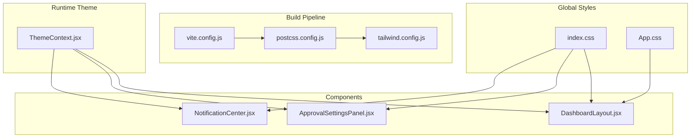
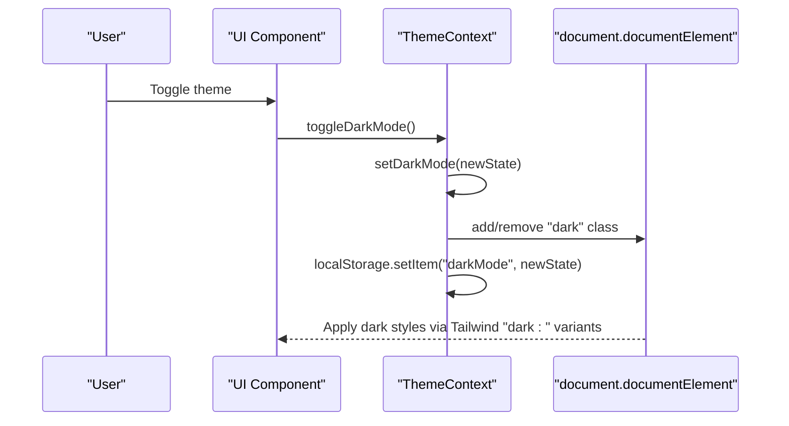
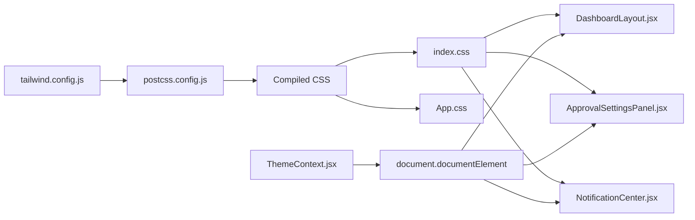

# Styling & Theming System

<cite>
**Referenced Files in This Document**
- [tailwind.config.js](file://frontend/tailwind.config.js)
- [postcss.config.js](file://frontend/postcss.config.js)
- [index.css](file://frontend/src/index.css)
- [App.css](file://frontend/src/App.css)
- [ThemeContext.jsx](file://frontend/src/context/ThemeContext.jsx)
- [DashboardLayout.jsx](file://frontend/src/layouts/DashboardLayout.jsx)
- [ApprovalSettingsPanel.jsx](file://frontend/src/components/ApprovalSettingsPanel.jsx)
- [NotificationCenter.jsx](file://frontend/src/components/NotificationCenter.jsx)
- [App.jsx](file://frontend/src/App.jsx)
- [main.jsx](file://frontend/src/main.jsx)
- [Login.jsx](file://frontend/src/pages/Login.jsx)
- [Settings.jsx](file://frontend/src/pages/Settings.jsx)
</cite>

## Table of Contents
1. [Introduction](#introduction)
2. [Project Structure](#project-structure)
3. [Core Components](#core-components)
4. [Architecture Overview](#architecture-overview)
5. [Detailed Component Analysis](#detailed-component-analysis)
6. [Dependency Analysis](#dependency-analysis)
7. [Performance Considerations](#performance-considerations)
8. [Troubleshooting Guide](#troubleshooting-guide)
9. [Conclusion](#conclusion)

## Introduction
This document describes the styling and theming system built with Tailwind CSS and custom CSS. It covers the Tailwind configuration, custom utility classes, design tokens, dark/light theme switching, system preference detection, theme persistence, responsive design patterns, animations, and browser compatibility considerations. Practical examples demonstrate component styling and layout patterns used across the application.

## Project Structure
The styling system is organized around three pillars:
- Tailwind CSS configuration and PostCSS pipeline
- Global CSS with design tokens and custom utilities
- Theme provider and context for runtime theme switching

**Diagram sources**
- [tailwind.config.js:1-28](file://frontend/tailwind.config.js#L1-L28)
- [postcss.config.js:1-6](file://frontend/postcss.config.js#L1-L6)
- [index.css:1-131](file://frontend/src/index.css#L1-L131)
- [App.css:1-185](file://frontend/src/App.css#L1-L185)
- [ThemeContext.jsx:1-30](file://frontend/src/context/ThemeContext.jsx#L1-L30)
- [DashboardLayout.jsx:1-335](file://frontend/src/layouts/DashboardLayout.jsx#L1-L335)
- [ApprovalSettingsPanel.jsx:1-252](file://frontend/src/components/ApprovalSettingsPanel.jsx#L1-L252)
- [NotificationCenter.jsx:1-183](file://frontend/src/components/NotificationCenter.jsx#L1-L183)

**Section sources**
- [tailwind.config.js:1-28](file://frontend/tailwind.config.js#L1-L28)
- [postcss.config.js:1-6](file://frontend/postcss.config.js#L1-L6)
- [index.css:1-131](file://frontend/src/index.css#L1-L131)
- [App.css:1-185](file://frontend/src/App.css#L1-L185)
- [ThemeContext.jsx:1-30](file://frontend/src/context/ThemeContext.jsx#L1-L30)
- [DashboardLayout.jsx:1-335](file://frontend/src/layouts/DashboardLayout.jsx#L1-L335)
- [ApprovalSettingsPanel.jsx:1-252](file://frontend/src/components/ApprovalSettingsPanel.jsx#L1-L252)
- [NotificationCenter.jsx:1-183](file://frontend/src/components/NotificationCenter.jsx#L1-L183)

## Core Components
- Tailwind configuration extends a primary color palette and enables class-based dark mode.
- PostCSS pipeline integrates Tailwind and autoprefixer.
- Global CSS defines design tokens, base styles, reusable component utilities, animations, and custom scrollbar styling.
- ThemeContext manages theme state, persists preferences, and toggles the dark class on the root element.
- Components apply Tailwind utilities, custom component classes, and animation helpers.

Key implementation references:
- Tailwind extension and dark mode: [tailwind.config.js:7-26](file://frontend/tailwind.config.js#L7-L26)
- PostCSS plugins: [postcss.config.js:1-6](file://frontend/postcss.config.js#L1-L6)
- Design tokens and component utilities: [index.css:4-106](file://frontend/src/index.css#L4-L106)
- Theme provider and persistence: [ThemeContext.jsx:5-18](file://frontend/src/context/ThemeContext.jsx#L5-L18)

**Section sources**
- [tailwind.config.js:7-26](file://frontend/tailwind.config.js#L7-L26)
- [postcss.config.js:1-6](file://frontend/postcss.config.js#L1-L6)
- [index.css:4-106](file://frontend/src/index.css#L4-L106)
- [ThemeContext.jsx:5-18](file://frontend/src/context/ThemeContext.jsx#L5-L18)

## Architecture Overview
The theming architecture combines compile-time CSS generation via Tailwind with runtime theme switching.

**Diagram sources**
- [ThemeContext.jsx:5-18](file://frontend/src/context/ThemeContext.jsx#L5-L18)
- [index.css:33-37](file://frontend/src/index.css#L33-L37)

## Detailed Component Analysis

### Tailwind Configuration and Dark Mode
- Enables class-based dark mode targeting the root element.
- Extends a primary color palette for consistent brand usage.
- Scans HTML and JSX files for utility class usage.

Implementation references:
- Dark mode activation: [tailwind.config.js:7](file://frontend/tailwind.config.js#L7)
- Color extension: [tailwind.config.js:10-24](file://frontend/tailwind.config.js#L10-L24)
- Content scanning: [tailwind.config.js:3-6](file://frontend/tailwind.config.js#L3-L6)

**Section sources**
- [tailwind.config.js:3-26](file://frontend/tailwind.config.js#L3-L26)

### PostCSS Pipeline
- Integrates Tailwind and autoprefixer for vendor prefixing and purging unused styles.
- Ensures cross-browser compatibility and optimized CSS output.

Implementation references:
- Plugins configuration: [postcss.config.js:1-6](file://frontend/postcss.config.js#L1-L6)

**Section sources**
- [postcss.config.js:1-6](file://frontend/postcss.config.js#L1-L6)

### Global CSS and Design Tokens
- Defines CSS custom properties for colors and typography.
- Establishes base layer styles and component utilities.
- Declares reusable classes for cards, buttons, tooltips, and badges.
- Includes keyframe animations and chart-specific overrides.
- Provides custom scrollbar styling for WebKit browsers.

Implementation references:
- Design tokens: [index.css:4-21](file://frontend/src/index.css#L4-L21)
- Base layer: [index.css:33-37](file://frontend/src/index.css#L33-L37)
- Component utilities: [index.css:39-106](file://frontend/src/index.css#L39-L106)
- Animations: [index.css:103-106](file://frontend/src/index.css#L103-L106)
- Scrollbar: [index.css:108-121](file://frontend/src/index.css#L108-L121)
- Chart overrides: [index.css:122-131](file://frontend/src/index.css#L122-L131)

**Section sources**
- [index.css:4-131](file://frontend/src/index.css#L4-L131)

### Theme Provider and Persistence
- Initializes theme state from localStorage or system preference.
- Adds/removes the "dark" class on the root element.
- Persists theme selection to localStorage.

Implementation references:
- Initialization and effect: [ThemeContext.jsx:6-18](file://frontend/src/context/ThemeContext.jsx#L6-L18)
- Toggle function: [ThemeContext.jsx:20](file://frontend/src/context/ThemeContext.jsx#L20)

**Section sources**
- [ThemeContext.jsx:1-30](file://frontend/src/context/ThemeContext.jsx#L1-L30)

### Component Styling Patterns
- DashboardLayout applies sidebar, navbar, and responsive layout utilities; uses tooltip and card classes.
- ApprovalSettingsPanel demonstrates form controls, status badges, and animated feedback.
- NotificationCenter showcases dropdown animations, status styling, and critical alerts.

Implementation references:
- Layout utilities and animations: [DashboardLayout.jsx:96-165](file://frontend/src/layouts/DashboardLayout.jsx#L96-L165), [DashboardLayout.jsx:237-331](file://frontend/src/layouts/DashboardLayout.jsx#L237-L331)
- Form controls and badges: [ApprovalSettingsPanel.jsx:101-176](file://frontend/src/components/ApprovalSettingsPanel.jsx#L101-L176), [ApprovalSettingsPanel.jsx:178-246](file://frontend/src/components/ApprovalSettingsPanel.jsx#L178-L246)
- Notification styling and animations: [NotificationCenter.jsx:74-179](file://frontend/src/components/NotificationCenter.jsx#L74-L179)

**Section sources**
- [DashboardLayout.jsx:96-331](file://frontend/src/layouts/DashboardLayout.jsx#L96-L331)
- [ApprovalSettingsPanel.jsx:101-246](file://frontend/src/components/ApprovalSettingsPanel.jsx#L101-L246)
- [NotificationCenter.jsx:74-179](file://frontend/src/components/NotificationCenter.jsx#L74-L179)

### Responsive Design Patterns
- Breakpoint-driven layout adjustments using media queries in global CSS.
- Component-level responsive behavior with Tailwind responsive modifiers.
- Mobile-first navigation with overlay and animated transitions.

Implementation references:
- Media queries in global CSS: [App.css:67-71](file://frontend/src/App.css#L67-L71), [App.css:139-153](file://frontend/src/App.css#L139-L153)
- Responsive layout utilities: [DashboardLayout.jsx:170-226](file://frontend/src/layouts/DashboardLayout.jsx#L170-L226), [DashboardLayout.jsx:237-282](file://frontend/src/layouts/DashboardLayout.jsx#L237-L282)
- Login page responsive container: [Login.jsx:32-152](file://frontend/src/pages/Login.jsx#L32-L152)

**Section sources**
- [App.css:67-153](file://frontend/src/App.css#L67-L153)
- [DashboardLayout.jsx:170-282](file://frontend/src/layouts/DashboardLayout.jsx#L170-L282)
- [Login.jsx:32-152](file://frontend/src/pages/Login.jsx#L32-L152)

### Animation Implementations
- Framer Motion for entrance/exit animations in panels and dropdowns.
- CSS keyframes for fade-in effects.
- Pulse and bounce animations for critical alerts and interactive states.

Implementation references:
- Motion usage: [ApprovalSettingsPanel.jsx:4](file://frontend/src/components/ApprovalSettingsPanel.jsx#L4), [DashboardLayout.jsx:285-329](file://frontend/src/layouts/DashboardLayout.jsx#L285-L329)
- Fade-in animation: [index.css:103-106](file://frontend/src/index.css#L103-L106)
- Critical alert animations: [DashboardLayout.jsx:287-327](file://frontend/src/layouts/DashboardLayout.jsx#L287-L327)

**Section sources**
- [ApprovalSettingsPanel.jsx:4](file://frontend/src/components/ApprovalSettingsPanel.jsx#L4)
- [DashboardLayout.jsx:285-329](file://frontend/src/layouts/DashboardLayout.jsx#L285-L329)
- [index.css:103-106](file://frontend/src/index.css#L103-L106)

### Color Palette, Typography, and Spacing
- Color palette: primary palette from Tailwind config; additional ERP brand colors in design tokens.
- Typography: Plus Jakarta Sans imported and applied globally; font weights and sizing defined in root.
- Spacing scale: consistent use of Tailwind spacing utilities across components.

Implementation references:
- Primary palette extension: [tailwind.config.js:10-24](file://frontend/tailwind.config.js#L10-L24)
- Brand tokens: [index.css:17-21](file://frontend/src/index.css#L17-L21)
- Typography base: [index.css:23-31](file://frontend/src/index.css#L23-L31)

**Section sources**
- [tailwind.config.js:10-24](file://frontend/tailwind.config.js#L10-L24)
- [index.css:17-31](file://frontend/src/index.css#L17-L31)

### Theme Switching Mechanism and Persistence
- System preference detection via media query.
- LocalStorage persistence for user choice.
- Root "dark" class toggled to activate dark variants.

Implementation references:
- Preference detection and initialization: [ThemeContext.jsx:6-9](file://frontend/src/context/ThemeContext.jsx#L6-L9)
- Root class management: [ThemeContext.jsx:11-18](file://frontend/src/context/ThemeContext.jsx#L11-L18)

**Section sources**
- [ThemeContext.jsx:6-18](file://frontend/src/context/ThemeContext.jsx#L6-L18)

### CSS-in-JS Patterns and Style Composition
- No inline styles or styled-components detected in the analyzed files.
- Style composition relies on Tailwind utilities, custom component classes, and CSS modules imported via index.css.

Evidence:
- Component classes used: [index.css:39-106](file://frontend/src/index.css#L39-L106)
- Utilities applied directly in JSX: [DashboardLayout.jsx:96-165](file://frontend/src/layouts/DashboardLayout.jsx#L96-L165), [ApprovalSettingsPanel.jsx:101-176](file://frontend/src/components/ApprovalSettingsPanel.jsx#L101-L176)

**Section sources**
- [index.css:39-106](file://frontend/src/index.css#L39-L106)
- [DashboardLayout.jsx:96-176](file://frontend/src/layouts/DashboardLayout.jsx#L96-L176)
- [ApprovalSettingsPanel.jsx:101-176](file://frontend/src/components/ApprovalSettingsPanel.jsx#L101-L176)

## Dependency Analysis
The styling system depends on Tailwind and PostCSS for build-time CSS generation, with runtime theme management handled by the ThemeContext provider.

**Diagram sources**
- [tailwind.config.js:1-28](file://frontend/tailwind.config.js#L1-L28)
- [postcss.config.js:1-6](file://frontend/postcss.config.js#L1-L6)
- [index.css:1-131](file://frontend/src/index.css#L1-L131)
- [App.css:1-185](file://frontend/src/App.css#L1-L185)
- [ThemeContext.jsx:1-30](file://frontend/src/context/ThemeContext.jsx#L1-L30)
- [DashboardLayout.jsx:1-335](file://frontend/src/layouts/DashboardLayout.jsx#L1-L335)
- [ApprovalSettingsPanel.jsx:1-252](file://frontend/src/components/ApprovalSettingsPanel.jsx#L1-L252)
- [NotificationCenter.jsx:1-183](file://frontend/src/components/NotificationCenter.jsx#L1-L183)

**Section sources**
- [tailwind.config.js:1-28](file://frontend/tailwind.config.js#L1-L28)
- [postcss.config.js:1-6](file://frontend/postcss.config.js#L1-L6)
- [index.css:1-131](file://frontend/src/index.css#L1-L131)
- [App.css:1-185](file://frontend/src/App.css#L1-L185)
- [ThemeContext.jsx:1-30](file://frontend/src/context/ThemeContext.jsx#L1-L30)
- [DashboardLayout.jsx:1-335](file://frontend/src/layouts/DashboardLayout.jsx#L1-L335)
- [ApprovalSettingsPanel.jsx:1-252](file://frontend/src/components/ApprovalSettingsPanel.jsx#L1-L252)
- [NotificationCenter.jsx:1-183](file://frontend/src/components/NotificationCenter.jsx#L1-L183)

## Performance Considerations
- Tailwind purging: Ensure content globs in Tailwind config include all template locations to remove unused styles.
- CSS custom properties: Prefer CSS variables for theming to avoid reflows and enable runtime updates.
- Animation performance: Use transform and opacity for GPU-accelerated animations; limit expensive properties like layout and paint.
- Font rendering: System fonts fallback ensures fast rendering; Google Fonts loaded via external stylesheet.

[No sources needed since this section provides general guidance]

## Troubleshooting Guide
- Dark mode not applying:
  - Verify the "dark" class is present on the root element after toggling.
  - Confirm dark mode is enabled in Tailwind config.
  - Check local storage value for the theme preference.
  References:
  - [ThemeContext.jsx:11-18](file://frontend/src/context/ThemeContext.jsx#L11-L18)
  - [tailwind.config.js:7](file://frontend/tailwind.config.js#L7)

- Styles not updating after changes:
  - Rebuild the project to regenerate Tailwind CSS.
  - Ensure PostCSS plugins are installed and configured.
  References:
  - [postcss.config.js:1-6](file://frontend/postcss.config.js#L1-L6)

- Responsive breakpoints not working:
  - Confirm media queries and responsive modifiers are correctly applied.
  - Check viewport meta tag and device testing.
  References:
  - [App.css:67-71](file://frontend/src/App.css#L67-L71)
  - [DashboardLayout.jsx:170-226](file://frontend/src/layouts/DashboardLayout.jsx#L170-L226)

**Section sources**
- [ThemeContext.jsx:11-18](file://frontend/src/context/ThemeContext.jsx#L11-L18)
- [tailwind.config.js:7](file://frontend/tailwind.config.js#L7)
- [postcss.config.js:1-6](file://frontend/postcss.config.js#L1-L6)
- [App.css:67-71](file://frontend/src/App.css#L67-L71)
- [DashboardLayout.jsx:170-226](file://frontend/src/layouts/DashboardLayout.jsx#L170-L226)

## Conclusion
The styling and theming system leverages Tailwind CSS for utility-first styling, PostCSS for build-time optimization, and a lightweight ThemeContext provider for runtime theme switching. Design tokens and custom component utilities ensure consistency across components, while responsive patterns and animations deliver a polished user experience. The approach balances developer productivity with performance and maintainability.