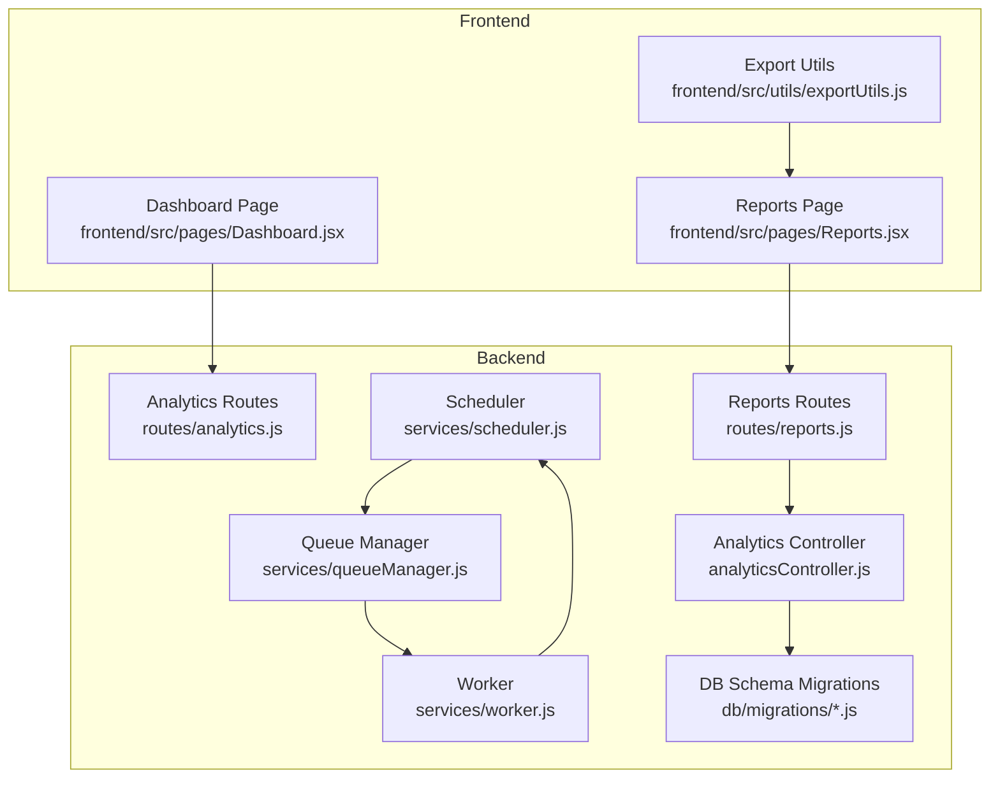
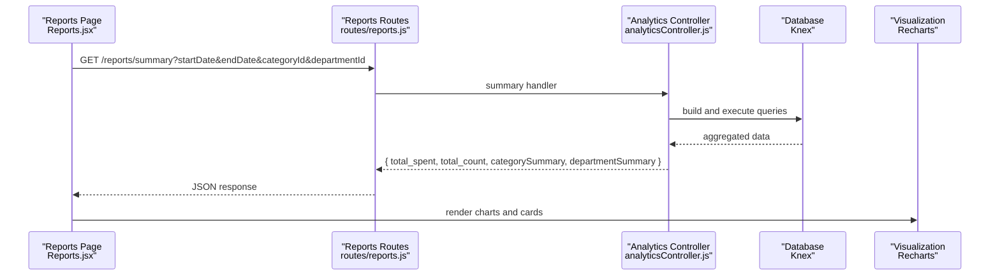
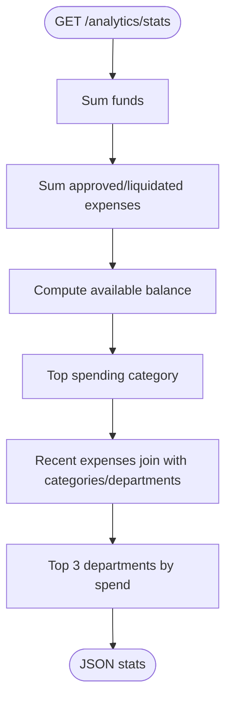
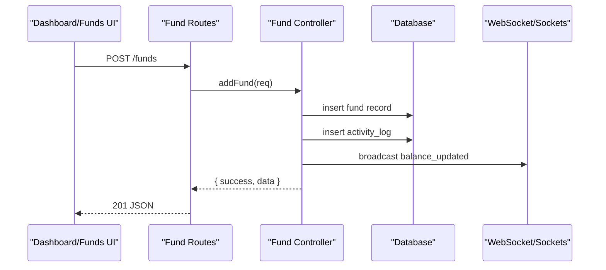
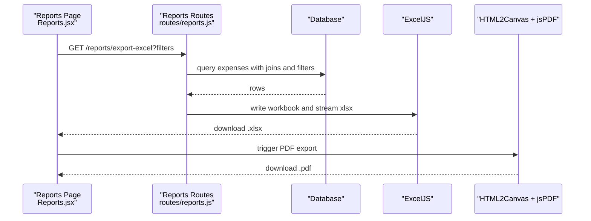
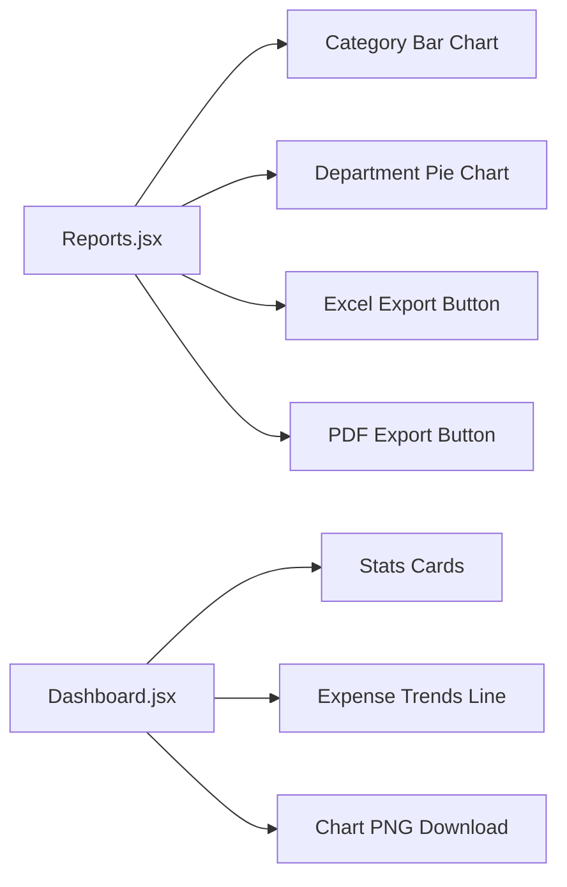
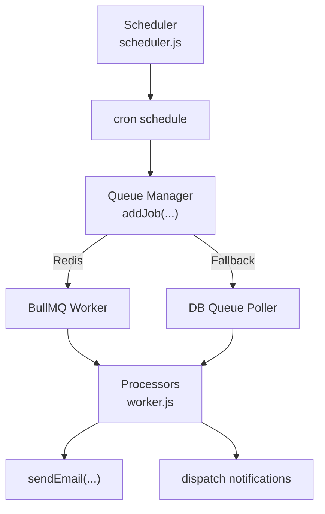
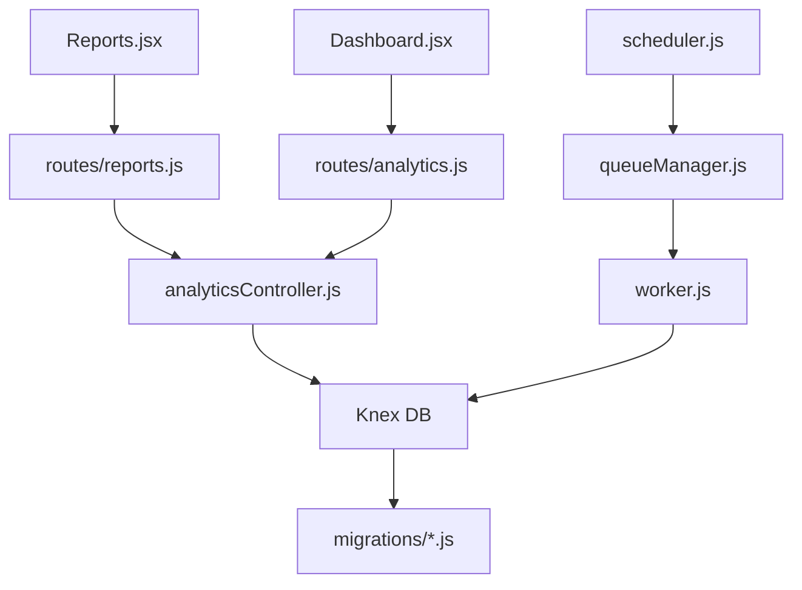
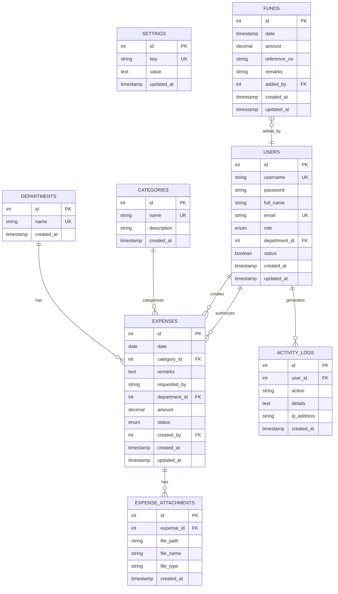

# Financial Reporting

<cite>
**Referenced Files in This Document**
- [analyticsController.js](file://backend/src/controllers/analyticsController.js)
- [analytics.js](file://backend/src/routes/analytics.js)
- [reports.js](file://backend/src/routes/reports.js)
- [Reports.jsx](file://frontend/src/pages/Reports.jsx)
- [Dashboard.jsx](file://frontend/src/pages/Dashboard.jsx)
- [exportUtils.js](file://frontend/src/utils/exportUtils.js)
- [scheduler.js](file://backend/src/services/scheduler.js)
- [queueManager.js](file://backend/src/services/queueManager.js)
- [worker.js](file://backend/src/services/worker.js)
- [emailAutomationController.js](file://backend/src/controllers/emailAutomationController.js)
- [notificationCenterController.js](file://backend/src/controllers/notificationCenterController.js)
- [20260512000000_initial_schema.js](file://backend/src/db/migrations/20260512000000_initial_schema.js)
- [20260512075907_create_funds_table.js](file://backend/src/db/migrations/20260512075907_create_funds_table.js)
- [backend index.js](file://backend/src/index.js)
</cite>

## Table of Contents
1. [Introduction](#introduction)
2. [Project Structure](#project-structure)
3. [Core Components](#core-components)
4. [Architecture Overview](#architecture-overview)
5. [Detailed Component Analysis](#detailed-component-analysis)
6. [Dependency Analysis](#dependency-analysis)
7. [Performance Considerations](#performance-considerations)
8. [Troubleshooting Guide](#troubleshooting-guide)
9. [Conclusion](#conclusion)
10. [Appendices](#appendices)

## Introduction
This document explains the financial reporting capabilities within the fund management system. It covers fund performance metrics, spending patterns, and balance trend analysis. It also documents report generation, data visualization, and export functionality, including fund utilization reports, expense categorization by fund sources, and comparative analysis. Practical examples demonstrate how to generate fund reports, customize report parameters, and export financial data. Finally, it addresses report scheduling, automated reporting, and stakeholder dashboards.

## Project Structure
The financial reporting system spans backend controllers and routes, frontend pages and utilities, and supporting services for scheduling and background processing. The database schema defines the foundational tables for funds, expenses, categories, and departments.

**Diagram sources**
- [analyticsController.js:1-144](file://backend/src/controllers/analyticsController.js#L1-L144)
- [analytics.js:1-12](file://backend/src/routes/analytics.js#L1-L12)
- [reports.js:1-101](file://backend/src/routes/reports.js#L1-L101)
- [scheduler.js:1-155](file://backend/src/services/scheduler.js#L1-L155)
- [queueManager.js:1-125](file://backend/src/services/queueManager.js#L1-L125)
- [worker.js:1-42](file://backend/src/services/worker.js#L1-L42)
- [20260512000000_initial_schema.js:1-159](file://backend/src/db/migrations/20260512000000_initial_schema.js#L1-L159)
- [20260512075907_create_funds_table.js:1-44](file://backend/src/db/migrations/20260512075907_create_funds_table.js#L1-L44)
- [Reports.jsx:1-323](file://frontend/src/pages/Reports.jsx#L1-L323)
- [Dashboard.jsx:1-200](file://frontend/src/pages/Dashboard.jsx#L1-L200)
- [exportUtils.js:1-77](file://frontend/src/utils/exportUtils.js#L1-L77)

**Section sources**
- [analyticsController.js:1-144](file://backend/src/controllers/analyticsController.js#L1-L144)
- [reports.js:1-101](file://backend/src/routes/reports.js#L1-L101)
- [Reports.jsx:1-323](file://frontend/src/pages/Reports.jsx#L1-L323)
- [Dashboard.jsx:1-200](file://frontend/src/pages/Dashboard.jsx#L1-L200)
- [exportUtils.js:1-77](file://frontend/src/utils/exportUtils.js#L1-L77)
- [20260512000000_initial_schema.js:1-159](file://backend/src/db/migrations/20260512000000_initial_schema.js#L1-L159)
- [20260512075907_create_funds_table.js:1-44](file://backend/src/db/migrations/20260512075907_create_funds_table.js#L1-L44)

## Core Components
- Analytics and dashboard metrics: Provides dashboard statistics, expense trends, and breakdowns by category and department.
- Fund management: Retrieves funds, adds/removes fund entries, and computes balances.
- Reporting engine: Generates summary reports and exports to Excel and PDF.
- Frontend visualization: Renders charts, summaries, and export controls.
- Scheduling and automation: Runs daily/monthly financial reports and manages notifications.

**Section sources**
- [analyticsController.js:3-144](file://backend/src/controllers/analyticsController.js#L3-L144)
- [Reports.jsx:1-323](file://frontend/src/pages/Reports.jsx#L1-L323)
- [reports.js:1-101](file://backend/src/routes/reports.js#L1-L101)
- [scheduler.js:1-155](file://backend/src/services/scheduler.js#L1-L155)

## Architecture Overview
The system integrates frontend dashboards and reporting pages with backend analytics and reporting endpoints. Background tasks are scheduled and processed via a queue manager and worker. Real-time updates propagate through sockets to keep dashboards current.

**Diagram sources**
- [reports.js:70-98](file://backend/src/routes/reports.js#L70-L98)
- [analyticsController.js:105-143](file://backend/src/controllers/analyticsController.js#L105-L143)
- [Reports.jsx:48-58](file://frontend/src/pages/Reports.jsx#L48-L58)

## Detailed Component Analysis

### Analytics and Dashboard Metrics
The analytics controller exposes endpoints for:
- Dashboard statistics: total expenses, daily/monthly totals, available balance, pending approvals, and recent activity.
- Expense trends: pivot daily totals by category for charting.
- Category and department breakdowns: aggregated spending per category and department.

**Diagram sources**
- [analyticsController.js:3-67](file://backend/src/controllers/analyticsController.js#L3-L67)

**Section sources**
- [analyticsController.js:3-67](file://backend/src/controllers/analyticsController.js#L3-L67)
- [analytics.js:1-12](file://backend/src/routes/analytics.js#L1-L12)

### Fund Management and Balance
The fund controller supports:
- Listing funds with added-by user info.
- Adding funds with activity logging and admin notifications.
- Deleting funds with audit logging.
- Computing total inflows, outflows, and current balance.

**Diagram sources**
- [fundController.js:17-56](file://backend/src/controllers/fundController.js#L17-L56)
- [20260512075907_create_funds_table.js:4-12](file://backend/src/db/migrations/20260512075907_create_funds_table.js#L4-L12)

**Section sources**
- [fundController.js:5-107](file://backend/src/controllers/fundController.js#L5-L107)
- [20260512075907_create_funds_table.js:1-44](file://backend/src/db/migrations/20260512075907_create_funds_table.js#L1-L44)

### Reporting Engine and Export
The reporting routes support:
- Summary endpoint: total spent, transaction count, category and department breakdowns.
- Excel export: filtered expense ledger with date formatting and currency formatting.
- PDF export: visual PDF rendering via HTML-to-Canvas and jsPDF.

**Diagram sources**
- [reports.js:9-68](file://backend/src/routes/reports.js#L9-L68)
- [Reports.jsx:62-111](file://frontend/src/pages/Reports.jsx#L62-L111)
- [exportUtils.js:2-76](file://frontend/src/utils/exportUtils.js#L2-L76)

**Section sources**
- [reports.js:1-101](file://backend/src/routes/reports.js#L1-L101)
- [Reports.jsx:62-111](file://frontend/src/pages/Reports.jsx#L62-L111)
- [exportUtils.js:1-77](file://frontend/src/utils/exportUtils.js#L1-L77)

### Frontend Visualization and Dashboards
The Reports page renders:
- Summary cards for total spend and transaction volume.
- Category distribution bar chart and department allocation pie chart.
- Export buttons for Excel and visual PDF.

The Dashboard page fetches analytics and trends, and supports downloading charts as images.

**Diagram sources**
- [Reports.jsx:182-323](file://frontend/src/pages/Reports.jsx#L182-L323)
- [Dashboard.jsx:162-177](file://frontend/src/pages/Dashboard.jsx#L162-L177)

**Section sources**
- [Reports.jsx:1-323](file://frontend/src/pages/Reports.jsx#L1-L323)
- [Dashboard.jsx:1-200](file://frontend/src/pages/Dashboard.jsx#L1-L200)

### Scheduling, Automated Reporting, and Notifications
The scheduler runs periodic tasks:
- Daily summary report job.
- Monthly financial report job.
- Escalation checks hourly.
- Low fund threshold checks every four hours.
- Scheduled notifications dispatcher every minute.

Background processing uses BullMQ with Redis fallback to a database-backed queue. Workers process email and notification jobs.

**Diagram sources**
- [scheduler.js:5-149](file://backend/src/services/scheduler.js#L5-L149)
- [queueManager.js:61-116](file://backend/src/services/queueManager.js#L61-L116)
- [worker.js:5-20](file://backend/src/services/worker.js#L5-L20)
- [backend index.js:12-25](file://backend/src/index.js#L12-L25)

**Section sources**
- [scheduler.js:1-155](file://backend/src/services/scheduler.js#L1-L155)
- [queueManager.js:1-125](file://backend/src/services/queueManager.js#L1-L125)
- [worker.js:1-42](file://backend/src/services/worker.js#L1-L42)
- [backend index.js:1-25](file://backend/src/index.js#L1-L25)

## Dependency Analysis
- Controllers depend on Knex for SQL queries and on services for notifications and sockets.
- Routes depend on controllers and enforce authentication.
- Frontend pages depend on API endpoints and visualization libraries.
- Scheduling depends on cron, queue manager, and worker processors.
- Database migrations define the schema for funds, expenses, categories, and departments.

**Diagram sources**
- [Reports.jsx:1-323](file://frontend/src/pages/Reports.jsx#L1-L323)
- [reports.js:1-101](file://backend/src/routes/reports.js#L1-L101)
- [analytics.js:1-12](file://backend/src/routes/analytics.js#L1-L12)
- [analyticsController.js:1-144](file://backend/src/controllers/analyticsController.js#L1-L144)
- [scheduler.js:1-155](file://backend/src/services/scheduler.js#L1-L155)
- [queueManager.js:1-125](file://backend/src/services/queueManager.js#L1-L125)
- [worker.js:1-42](file://backend/src/services/worker.js#L1-L42)
- [20260512000000_initial_schema.js:1-159](file://backend/src/db/migrations/20260512000000_initial_schema.js#L1-L159)

**Section sources**
- [analyticsController.js:1-144](file://backend/src/controllers/analyticsController.js#L1-L144)
- [reports.js:1-101](file://backend/src/routes/reports.js#L1-L101)
- [analytics.js:1-12](file://backend/src/routes/analytics.js#L1-L12)
- [scheduler.js:1-155](file://backend/src/services/scheduler.js#L1-L155)
- [queueManager.js:1-125](file://backend/src/services/queueManager.js#L1-L125)
- [worker.js:1-42](file://backend/src/services/worker.js#L1-L42)
- [20260512000000_initial_schema.js:1-159](file://backend/src/db/migrations/20260512000000_initial_schema.js#L1-L159)

## Performance Considerations
- Use pagination and limits for large datasets in summary and export endpoints.
- Apply appropriate database indexes on frequently filtered columns (date, status, category_id, department_id).
- Cache dashboard stats for short intervals to reduce repeated heavy aggregations.
- Stream Excel exports for very large datasets to avoid memory spikes.
- Debounce filter changes in the frontend to minimize frequent API calls.

## Troubleshooting Guide
- Export failures: Verify filters produce data; ensure backend responds with a 200 and a downloadable file; check browser downloads and network tab.
- Empty charts: Confirm date range and filters; ensure backend aggregation returns non-empty arrays.
- Scheduling issues: Check cron expressions and logs; confirm Redis connectivity or fallback to DB queue; review worker initialization.
- Real-time updates: Ensure WebSocket connections are established and balance events are emitted on fund changes.

**Section sources**
- [Reports.jsx:77-81](file://frontend/src/pages/Reports.jsx#L77-L81)
- [reports.js:65-67](file://backend/src/routes/reports.js#L65-L67)
- [scheduler.js:1-155](file://backend/src/services/scheduler.js#L1-L155)
- [queueManager.js:1-125](file://backend/src/services/queueManager.js#L1-L125)

## Conclusion
The system provides robust financial reporting with real-time dashboards, drill-down analytics, and flexible export options. Fund management and balance computation integrate seamlessly with reporting, while scheduling and background processing enable automated, recurring financial communications. The modular architecture supports extensibility for advanced comparative analyses and stakeholder dashboards.

## Appendices

### Database Schema Overview
- Departments, Categories, Users, Expenses, Expense Attachments, Activity Logs, Settings.
- Funds table with amount, reference number, remarks, and timestamps.

**Diagram sources**
- [20260512000000_initial_schema.js:1-159](file://backend/src/db/migrations/20260512000000_initial_schema.js#L1-L159)
- [20260512075907_create_funds_table.js:4-12](file://backend/src/db/migrations/20260512075907_create_funds_table.js#L4-L12)

### Example Workflows

- Generate fund reports with filters:
  - Set start/end dates, category, and department in the Reports page.
  - Trigger summary fetch and observe charts update.
  - Export Excel ledger or generate visual PDF.

- Customize report parameters:
  - Adjust date range and filters; the frontend debounces changes and triggers new requests.

- Export financial data:
  - Excel export streams a downloadable .xlsx file.
  - PDF export captures the report area as an image and saves a PDF.

- Report scheduling and automated reporting:
  - Cron schedules daily and monthly report jobs.
  - Workers process email notifications and scheduled reports.
  - Redis or database fallback ensures reliability.

- Stakeholder dashboards:
  - Dashboard page displays real-time stats and trends.
  - Charts update on WebSocket balance events and manual refresh.

**Section sources**
- [Reports.jsx:16-58](file://frontend/src/pages/Reports.jsx#L16-L58)
- [reports.js:9-68](file://backend/src/routes/reports.js#L9-L68)
- [scheduler.js:6-22](file://backend/src/services/scheduler.js#L6-L22)
- [worker.js:5-20](file://backend/src/services/worker.js#L5-L20)
- [Dashboard.jsx:88-111](file://frontend/src/pages/Dashboard.jsx#L88-L111)