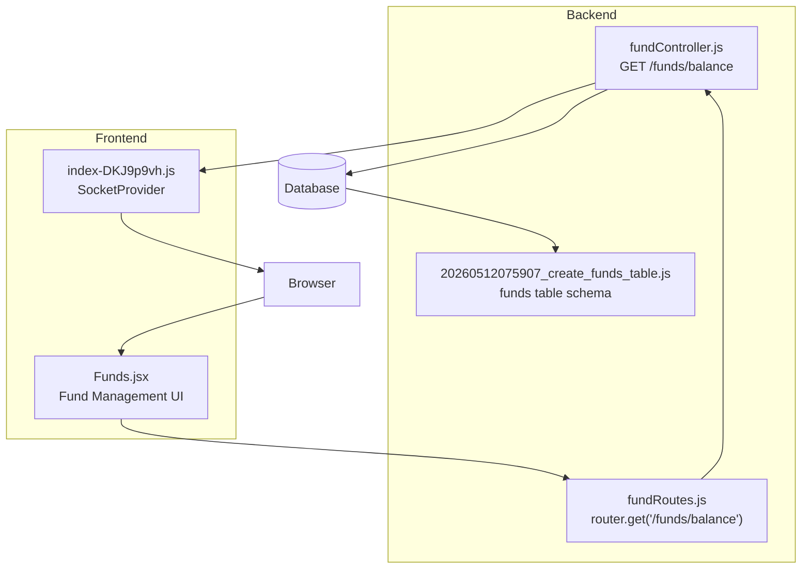
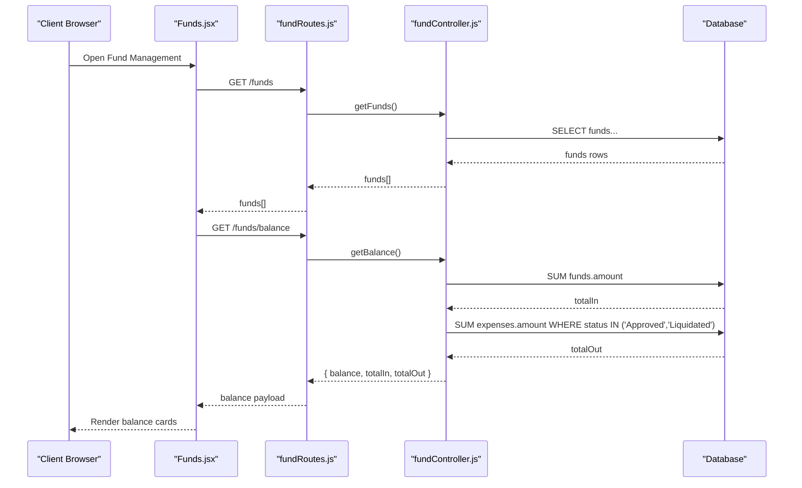
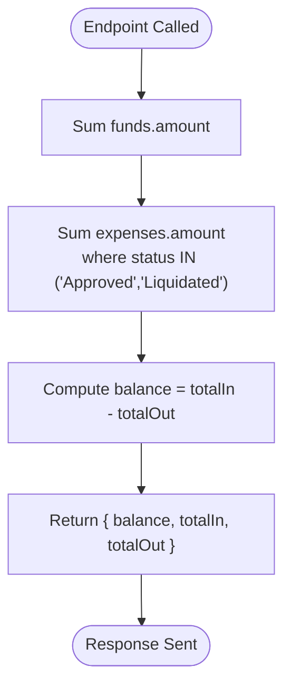
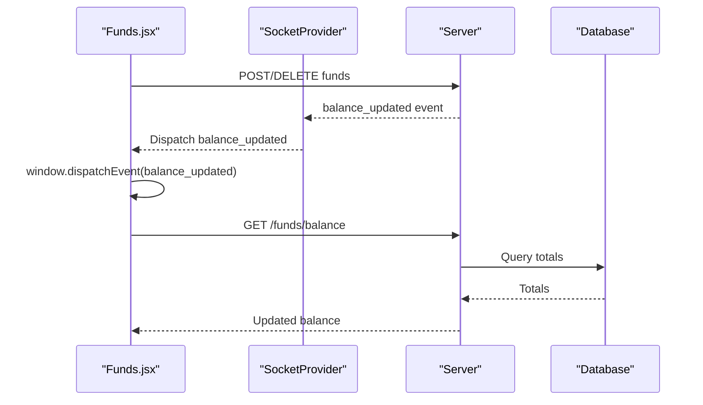
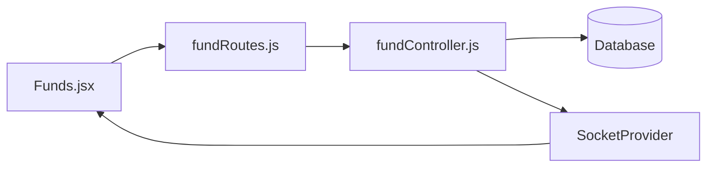

# Fund Balance Tracking

<cite>
**Referenced Files in This Document**
- [fundController.js](file://backend/src/controllers/fundController.js)
- [fundRoutes.js](file://backend/src/routes/fundRoutes.js)
- [20260512075907_create_funds_table.js](file://backend/src/db/migrations/20260512075907_create_funds_table.js)
- [Funds.jsx](file://frontend/src/pages/Funds.jsx)
- [index-DKJ9p9vh.js](file://backend/dist/assets/index-DKJ9p9vh.js)
- [USER_MANUAL.md](file://USER_MANUAL.md)
</cite>

## Table of Contents
1. [Introduction](#introduction)
2. [Project Structure](#project-structure)
3. [Core Components](#core-components)
4. [Architecture Overview](#architecture-overview)
5. [Detailed Component Analysis](#detailed-component-analysis)
6. [Dependency Analysis](#dependency-analysis)
7. [Performance Considerations](#performance-considerations)
8. [Troubleshooting Guide](#troubleshooting-guide)
9. [Conclusion](#conclusion)

## Introduction
This document explains the fund balance tracking system used to monitor petty cash liquidity. It covers how balances are calculated from fund inflows and expense outflows, how the balance endpoint works, how real-time updates propagate via WebSocket, and how to query and monitor balances. It also outlines accuracy, reconciliation, and audit trail practices derived from the system’s implementation.

## Project Structure
The fund balance system spans backend controllers and routes, database migrations defining the funds ledger, frontend pages displaying balances, and a WebSocket provider that broadcasts balance updates.

**Diagram sources**
- [fundController.js:83-107](file://backend/src/controllers/fundController.js#L83-L107)
- [fundRoutes.js:1-13](file://backend/src/routes/fundRoutes.js#L1-L13)
- [20260512075907_create_funds_table.js:1-43](file://backend/src/db/migrations/20260512075907_create_funds_table.js#L1-L43)
- [Funds.jsx:53-78](file://frontend/src/pages/Funds.jsx#L53-L78)
- [index-DKJ9p9vh.js](file://backend/dist/assets/index-DKJ9p9vh.js)

**Section sources**
- [fundController.js:83-107](file://backend/src/controllers/fundController.js#L83-L107)
- [fundRoutes.js:1-13](file://backend/src/routes/fundRoutes.js#L1-L13)
- [20260512075907_create_funds_table.js:1-43](file://backend/src/db/migrations/20260512075907_create_funds_table.js#L1-L43)
- [Funds.jsx:53-78](file://frontend/src/pages/Funds.jsx#L53-L78)
- [index-DKJ9p9vh.js](file://backend/dist/assets/index-DKJ9p9vh.js)

## Core Components
- Balance endpoint controller: Computes total inflows and outflows and returns current balance.
- Route binding: Exposes GET /funds/balance behind role-based authorization.
- Database schema: Defines the funds table storing replenishment entries.
- Frontend page: Renders balance cards and triggers balance refresh after fund changes.
- WebSocket provider: Receives server-side balance updates and notifies clients.

Key implementation references:
- Balance calculation and response shape: [getBalance:83-107](file://backend/src/controllers/fundController.js#L83-L107)
- Endpoint registration: [fundRoutes:1-13](file://backend/src/routes/fundRoutes.js#L1-L13)
- Funds table definition: [create_funds_table migration:1-43](file://backend/src/db/migrations/20260512075907_create_funds_table.js#L1-L43)
- UI balance rendering and refresh: [Funds.jsx:53-78](file://frontend/src/pages/Funds.jsx#L53-L78)
- Real-time update propagation: [SocketProvider](file://backend/dist/assets/index-DKJ9p9vh.js)

**Section sources**
- [fundController.js:83-107](file://backend/src/controllers/fundController.js#L83-L107)
- [fundRoutes.js:1-13](file://backend/src/routes/fundRoutes.js#L1-L13)
- [20260512075907_create_funds_table.js:1-43](file://backend/src/db/migrations/20260512075907_create_funds_table.js#L1-L43)
- [Funds.jsx:53-78](file://frontend/src/pages/Funds.jsx#L53-L78)
- [index-DKJ9p9vh.js](file://backend/dist/assets/index-DKJ9p9vh.js)

## Architecture Overview
The balance computation follows a straightforward aggregation model:
- Total Inflow: Sum of all fund replenishments (funds table).
- Total Outflow: Sum of approved and liquidated expenses.
- Available Balance: Total Inflow minus Total Outflow.

**Diagram sources**
- [fundController.js:83-107](file://backend/src/controllers/fundController.js#L83-L107)
- [fundRoutes.js:1-13](file://backend/src/routes/fundRoutes.js#L1-L13)
- [Funds.jsx:53-78](file://frontend/src/pages/Funds.jsx#L53-L78)

## Detailed Component Analysis

### Balance Calculation Methodology
- Total Inflow: Aggregated sum of the amount column in the funds table.
- Total Outflow: Aggregated sum of the amount column in the expenses table for records with statuses “Approved” and “Liquidated”.
- Available Balance: Difference between total inflow and total outflow.

**Diagram sources**
- [fundController.js:83-107](file://backend/src/controllers/fundController.js#L83-L107)

**Section sources**
- [fundController.js:83-107](file://backend/src/controllers/fundController.js#L83-L107)

### Balance Endpoint Implementation
- Route: GET /funds/balance
- Authentication: Protected by JWT middleware.
- Authorization: Requires Super Admin role.
- Response: JSON object containing success flag, balance, totalIn, and totalOut.

References:
- [Route registration:1-13](file://backend/src/routes/fundRoutes.js#L1-L13)
- [Controller method:83-107](file://backend/src/controllers/fundController.js#L83-L107)

**Section sources**
- [fundRoutes.js:1-13](file://backend/src/routes/fundRoutes.js#L1-L13)
- [fundController.js:83-107](file://backend/src/controllers/fundController.js#L83-L107)

### Real-Time Balance Updates via WebSocket
- Frontend listens for a client-side event named balance_updated.
- The SocketProvider subscribes to a server-sent event called balance_updated and dispatches the client-side event.
- After mutating fund data (e.g., adding or deleting a fund entry), the UI triggers a refresh of both funds and balance.

References:
- [Funds.jsx mutation and refresh:53-78](file://frontend/src/pages/Funds.jsx#L53-L78)
- [SocketProvider event forwarding](file://backend/dist/assets/index-DKJ9p9vh.js)

**Diagram sources**
- [Funds.jsx:53-78](file://frontend/src/pages/Funds.jsx#L53-L78)
- [index-DKJ9p9vh.js](file://backend/dist/assets/index-DKJ9p9vh.js)

**Section sources**
- [Funds.jsx:53-78](file://frontend/src/pages/Funds.jsx#L53-L78)
- [index-DKJ9p9vh.js](file://backend/dist/assets/index-DKJ9p9vh.js)

### Balance Monitoring Workflows
- Manual refresh: The UI calls both GET /funds and GET /funds/balance concurrently on mount and after mutations.
- Real-time refresh: On receiving balance_updated, the UI refreshes the same endpoints.
- Dashboard integration: The executive dashboard also queries analytics endpoints that internally rely on the same underlying totals.

References:
- [Funds.jsx initial fetches:53-78](file://frontend/src/pages/Funds.jsx#L53-L78)
- [Dashboard analytics usage:1-200](file://backend/dist/assets/Dashboard-3toX3meM.js#L1-L200)

**Section sources**
- [Funds.jsx:53-78](file://frontend/src/pages/Funds.jsx#L53-L78)
- [index-DKJ9p9vh.js](file://backend/dist/assets/index-DKJ9p9vh.js)

### Fund Additions and Expense Deductions Impact
- Fund additions increase total inflow and therefore increase the available balance.
- Expense deductions (only when status is Approved or Liquidated) increase total outflow and decrease the available balance.
- Deleting a fund entry reduces total inflow accordingly.

References:
- [Balance calculation:83-107](file://backend/src/controllers/fundController.js#L83-L107)
- [Fund deletion UI trigger:53-78](file://frontend/src/pages/Funds.jsx#L53-L78)

**Section sources**
- [fundController.js:83-107](file://backend/src/controllers/fundController.js#L83-L107)
- [Funds.jsx:53-78](file://frontend/src/pages/Funds.jsx#L53-L78)

### Examples and Queries
- Example: Retrieve current balance and totals
  - Endpoint: GET /funds/balance
  - Response keys: balance, totalIn, totalOut
  - Reference: [getBalance:83-107](file://backend/src/controllers/fundController.js#L83-L107)
- Example: Historical replenishment history
  - Endpoint: GET /funds
  - Reference: [fundRoutes:1-13](file://backend/src/routes/fundRoutes.js#L1-L13)
- Example: Real-time balance refresh
  - UI pattern: After add/delete, call GET /funds and GET /funds/balance
  - Reference: [Funds.jsx:53-78](file://frontend/src/pages/Funds.jsx#L53-L78)

**Section sources**
- [fundController.js:83-107](file://backend/src/controllers/fundController.js#L83-L107)
- [fundRoutes.js:1-13](file://backend/src/routes/fundRoutes.js#L1-L13)
- [Funds.jsx:53-78](file://frontend/src/pages/Funds.jsx#L53-L78)

### Historical Balance Tracking and Audit Trail
- Historical replenishment records are stored in the funds table and surfaced via GET /funds.
- The manual describes the “Audit Log” column in the replenishment history table, indicating audit trail visibility.
- Balance accuracy relies on consistent status transitions for expenses and correct fund entries.

References:
- [Funds table schema:1-43](file://backend/src/db/migrations/20260512075907_create_funds_table.js#L1-L43)
- [Funds page manual:276-299](file://USER_MANUAL.md#L276-L299)

**Section sources**
- [20260512075907_create_funds_table.js:1-43](file://backend/src/db/migrations/20260512075907_create_funds_table.js#L1-L43)
- [USER_MANUAL.md:276-299](file://USER_MANUAL.md#L276-L299)

### Balance Accuracy, Reconciliation, and Alerts
- Accuracy: The balance endpoint sums verified totals from the database, ensuring consistency.
- Reconciliation: Regularly compare system totals against physical petty cash and reconcile differences.
- Alerts: While balance thresholds are not implemented in the balance endpoint itself, the system supports critical notifications via WebSocket and UI alerts. Threshold-based alerts could be introduced by extending the backend to emit threshold events and the frontend to render warnings.

References:
- [SocketProvider critical notifications](file://backend/dist/assets/index-DKJ9p9vh.js)
- [Manual overview of Available Liquidity card:282-288](file://USER_MANUAL.md#L282-L288)

**Section sources**
- [index-DKJ9p9vh.js](file://backend/dist/assets/index-DKJ9p9vh.js)
- [USER_MANUAL.md:282-288](file://USER_MANUAL.md#L282-L288)

## Dependency Analysis
The balance endpoint depends on:
- Database access for aggregating funds and expenses.
- Route layer for authorization and request routing.
- Frontend for rendering and triggering refreshes.
- WebSocket layer for real-time propagation.

**Diagram sources**
- [fundController.js:83-107](file://backend/src/controllers/fundController.js#L83-L107)
- [fundRoutes.js:1-13](file://backend/src/routes/fundRoutes.js#L1-L13)
- [Funds.jsx:53-78](file://frontend/src/pages/Funds.jsx#L53-L78)
- [index-DKJ9p9vh.js](file://backend/dist/assets/index-DKJ9p9vh.js)

**Section sources**
- [fundController.js:83-107](file://backend/src/controllers/fundController.js#L83-L107)
- [fundRoutes.js:1-13](file://backend/src/routes/fundRoutes.js#L1-L13)
- [Funds.jsx:53-78](file://frontend/src/pages/Funds.jsx#L53-L78)
- [index-DKJ9p9vh.js](file://backend/dist/assets/index-DKJ9p9vh.js)

## Performance Considerations
- Aggregation queries: SUM operations on funds and expenses are efficient with appropriate indexing on amount and status columns.
- Concurrency: Balance updates occur after fund mutations; batching multiple fund operations and refreshing once improves UX.
- Real-time updates: Debounce frequent refreshes to avoid redundant network calls.

## Troubleshooting Guide
- 500 Internal Server Error from /funds/balance:
  - Indicates a database error during aggregation. Verify funds and expenses tables exist and accessible.
  - Reference: [getBalance error handling:103-106](file://backend/src/controllers/fundController.js#L103-L106)
- Empty or stale balance:
  - Ensure WebSocket is connected and balance_updated events are being dispatched.
  - Confirm UI refreshes both /funds and /funds/balance after mutations.
  - References: [SocketProvider event handling](file://backend/dist/assets/index-DKJ9p9vh.js), [Funds.jsx refresh:53-78](file://frontend/src/pages/Funds.jsx#L53-L78)
- Discrepancies between reported and physical cash:
  - Reconcile by reviewing funds table entries and expense status transitions.
  - References: [Funds table schema:1-43](file://backend/src/db/migrations/20260512075907_create_funds_table.js#L1-L43), [Manual audit log mention:276-299](file://USER_MANUAL.md#L276-L299)

**Section sources**
- [fundController.js:83-107](file://backend/src/controllers/fundController.js#L83-L107)
- [index-DKJ9p9vh.js](file://backend/dist/assets/index-DKJ9p9vh.js)
- [Funds.jsx:53-78](file://frontend/src/pages/Funds.jsx#L53-L78)
- [20260512075907_create_funds_table.js:1-43](file://backend/src/db/migrations/20260512075907_create_funds_table.js#L1-L43)
- [USER_MANUAL.md:276-299](file://USER_MANUAL.md#L276-L299)

## Conclusion
The fund balance tracking system computes the available petty cash by summing fund inflows and subtracting approved/liquidated expenses. The GET /funds/balance endpoint provides accurate, system-verified totals, while the UI and WebSocket infrastructure enable real-time monitoring. For robust operations, maintain strict reconciliation procedures, keep audit trails visible, and consider implementing configurable balance threshold alerts to further enhance oversight.