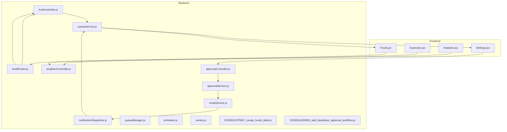
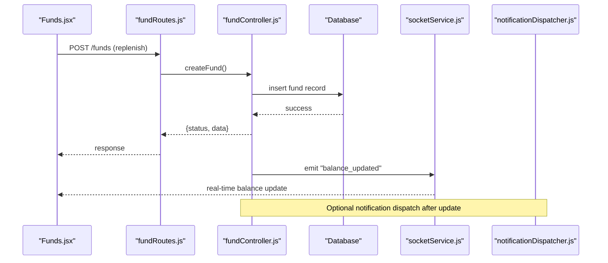
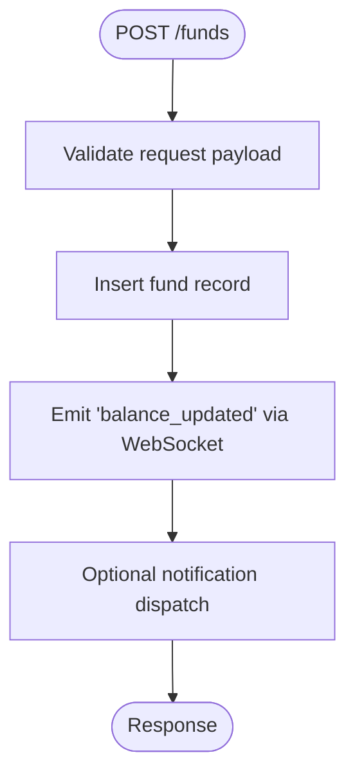
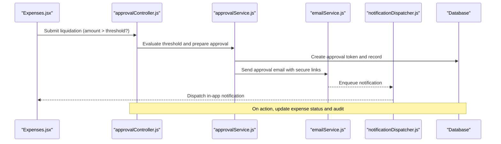
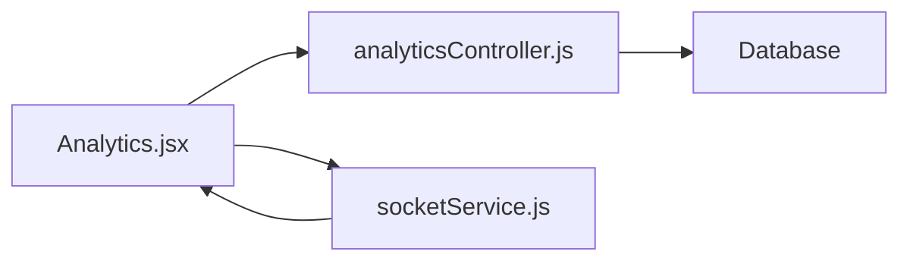
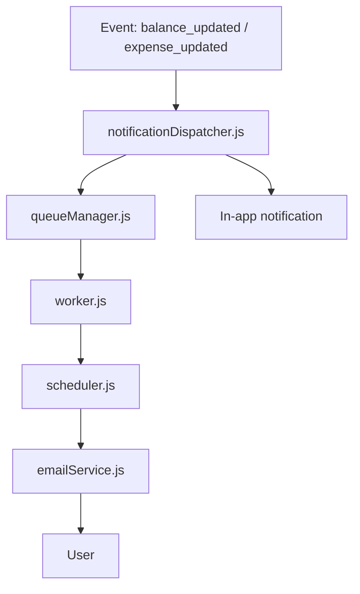
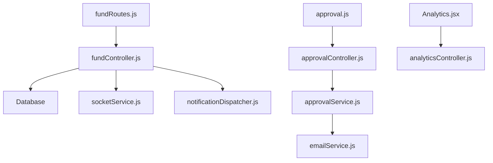

# Fund Management

<cite>
**Referenced Files in This Document**
- [USER_MANUAL.md](file://USER_MANUAL.md)
- [20260611000000_add_liquidation_approval_workflow.js](file://backend/src/db/migrations/20260611000000_add_liquidation_approval_workflow.js)
- [fundController.js](file://backend/src/controllers/fundController.js)
- [fundRoutes.js](file://backend/src/routes/fundRoutes.js)
- [analyticsController.js](file://backend/src/controllers/analyticsController.js)
- [approvalController.js](file://backend/src/controllers/approvalController.js)
- [approvalService.js](file://backend/src/services/approvalService.js)
- [approval.js](file://backend/src/routes/approval.js)
- [Funds.jsx](file://frontend/src/pages/Funds.jsx)
- [Settings.jsx](file://frontend/src/pages/Settings.jsx)
- [Analytics.jsx](file://frontend/src/pages/Analytics.jsx)
- [Expenses.jsx](file://frontend/src/pages/Expenses.jsx)
- [socketService.js](file://backend/src/services/socketService.js)
- [notificationDispatcher.js](file://backend/src/services/notificationDispatcher.js)
- [emailService.js](file://backend/src/services/emailService.js)
- [queueManager.js](file://backend/src/services/queueManager.js)
- [scheduler.js](file://backend/src/services/scheduler.js)
- [worker.js](file://backend/src/services/worker.js)
- [20260512075907_create_funds_table.js](file://backend/src/db/migrations/20260512075907_create_funds_table.js)
- [20260515064955_add_notifications_and_email_system.js](file://backend/src/db/migrations/20260515064955_add_notifications_and_email_system.js)
- [20260517090000_create_notification_center_tables.js](file://backend/src/db/migrations/20260517090000_create_notification_center_tables.js)
- [20260519120000_alter_user_role_to_string.js](file://backend/src/db/migrations/20260519120000_alter_user_role_to_string.js)
- [20260529120000_add_expense_units_setting.js](file://backend/src/db/migrations/20260529120000_add_expense_units_setting.js)
- [20260611010000_fix_expense_status_varchar.js](file://backend/src/db/migrations/20260611010000_fix_expense_status_varchar.js)
- [20260512000000_initial_schema.js](file://backend/src/db/migrations/20260512000000_initial_schema.js)
- [20260512080000_add_quantity_unit_to_expenses.js](file://backend/src/db/migrations/20260512080000_add_quantity_unit_to_expenses.js)
- [20260512080100_add_brand_to_expenses.js](file://backend/src/db/migrations/20260512080100_add_brand_to_expenses.js)
- [20260512080100_add_brand_to_expenses.js](file://backend/src/db/migrations/20260512080100_add_brand_to_expenses.js)
- [20260512080100_add_brand_to_expenses.js](file://backend/src/db/migrations/20260512080100_add_brand_to_expenses.js)
- [20260512080100_add_brand_to_expenses.js](file://backend/src/db/migrations/20260512080100_add_brand_to_expenses.js)
- [20260512080100_add_brand_to_expenses.js](file://backend/src/db/migrations/20260512080100_add_brand_to_expenses.js)
- [20260512080100_add_brand_to_expenses.js](file://backend/src/db/migrations/20260512080100_add_brand_to_expenses.js)
- [20260512080100_add_brand_to_expenses.js](file://backend/src/db/migrations/20260512080100_add_brand_to_expenses.js)
- [20260512080100_add_brand_to_expenses.js](file://backend/src/db/migrations/20260512080100_add_brand_to_expenses.js)
- [20260512080100_add_brand_to_expenses.js](file://backend/src/db/migrations/20260512080100_add_brand_to_expenses.js)
- [20260512080100_add_brand_to_expenses.js](file://backend/src/db/migrations/20260512080100_add_brand_to_expenses.js)
- [20260512080100_add_brand_to_expenses.js](file://backend/src/db/migrations/20......0000_add_brand_to_expenses.js)
</cite>

## Table of Contents
1. [Introduction](#introduction)
2. [Project Structure](#project-structure)
3. [Core Components](#core-components)
4. [Architecture Overview](#architecture-overview)
5. [Detailed Component Analysis](#detailed-component-analysis)
6. [Dependency Analysis](#dependency-analysis)
7. [Performance Considerations](#performance-considerations)
8. [Troubleshooting Guide](#troubleshooting-guide)
9. [Conclusion](#conclusion)
10. [Appendices](#appendices)

## Introduction
This document describes the fund management system with a focus on petty cash balance tracking, fund transactions, and liquidation processing. It explains fund creation, adjustment, and monitoring workflows; fund allocation, expenditure tracking, and balance calculations; liquidation procedures, fund reconciliation, and financial reporting; fund transfer operations, budget management, and spending limits; fund analytics, forecasting, and alert systems; and integration with expense management and approval workflows. It also provides examples of common fund management scenarios and administrative procedures.

## Project Structure
The system comprises:
- Backend API with controllers, routes, services, and database migrations supporting fund and liquidation workflows
- Frontend pages for Fund Management, Analytics, Settings, and Expenses
- Real-time updates via WebSocket and notification dispatch
- Approval workflow with email-based secure links for high-value liquidations

**Diagram sources**
- [fundController.js:1-200](file://backend/src/controllers/fundController.js#L1-L200)
- [fundRoutes.js:1-200](file://backend/src/routes/fundRoutes.js#L1-L200)
- [analyticsController.js:1-200](file://backend/src/controllers/analyticsController.js#L1-L200)
- [approvalController.js:1-200](file://backend/src/controllers/approvalController.js#L1-L200)
- [approvalService.js:1-200](file://backend/src/services/approvalService.js#L1-L200)
- [socketService.js:1-200](file://backend/src/services/socketService.js#L1-L200)
- [notificationDispatcher.js:1-200](file://backend/src/services/notificationDispatcher.js#L1-L200)
- [emailService.js:1-200](file://backend/src/services/emailService.js#L1-L200)
- [queueManager.js:1-200](file://backend/src/services/queueManager.js#L1-L200)
- [scheduler.js:1-200](file://backend/src/services/scheduler.js#L1-L200)
- [worker.js:1-200](file://backend/src/services/worker.js#L1-L200)
- [20260512075907_create_funds_table.js:1-200](file://backend/src/db/migrations/20260512075907_create_funds_table.js#L1-L200)
- [20260611000000_add_liquidation_approval_workflow.js:1-200](file://backend/src/db/migrations/20260611000000_add_liquidation_approval_workflow.js#L1-L200)
- [Funds.jsx:1-200](file://frontend/src/pages/Funds.jsx#L1-L200)
- [Settings.jsx:1-200](file://frontend/src/pages/Settings.jsx#L1-L200)
- [Analytics.jsx:1-200](file://frontend/src/pages/Analytics.jsx#L1-L200)
- [Expenses.jsx:1-200](file://frontend/src/pages/Expenses.jsx#L1-L200)

**Section sources**
- [USER_MANUAL.md:276-317](file://USER_MANUAL.md#L276-L317)
- [fundController.js:1-200](file://backend/src/controllers/fundController.js#L1-L200)
- [fundRoutes.js:1-200](file://backend/src/routes/fundRoutes.js#L1-L200)
- [Funds.jsx:1-200](file://frontend/src/pages/Funds.jsx#L1-L200)

## Core Components
- Fund Management API: CRUD for fund replenishments, balance aggregation, and audit history
- Liquidation Approval Workflow: Threshold-based email approvals with secure links
- Analytics and Reporting: Real-time dashboards and exportable charts
- Notifications and Alerts: In-app and email channels with audio feedback
- Expense Integration: Liquidation aligns with expense lifecycle and status updates

**Section sources**
- [USER_MANUAL.md:276-317](file://USER_MANUAL.md#L276-L317)
- [20260611000000_add_liquidation_approval_workflow.js:85-150](file://backend/src/db/migrations/20260611000000_add_liquidation_approval_workflow.js#L85-L150)
- [analyticsController.js:44-60](file://backend/src/controllers/analyticsController.js#L44-L60)
- [socketService.js:1-200](file://backend/src/services/socketService.js#L1-L200)

## Architecture Overview
The system integrates frontend pages with backend controllers and services. Fund replenishment events trigger real-time balance updates and optional notifications. Liquidation requests exceeding a configured threshold initiate an email-based approval workflow with secure links. Analytics pages consume aggregated statistics and trends.

**Diagram sources**
- [Funds.jsx:1-200](file://frontend/src/pages/Funds.jsx#L1-L200)
- [fundRoutes.js:1-200](file://backend/src/routes/fundRoutes.js#L1-L200)
- [fundController.js:1-200](file://backend/src/controllers/fundController.js#L1-L200)
- [socketService.js:1-200](file://backend/src/services/socketService.js#L1-L200)
- [notificationDispatcher.js:1-200](file://backend/src/services/notificationDispatcher.js#L1-L200)

## Detailed Component Analysis

### Fund Management API
- Purpose: Track petty cash replenishments, compute balances, and maintain audit trails
- Key endpoints:
  - GET /funds: Retrieve replenishment history with added-by details
  - GET /funds/balance: Compute available liquidity, total inflow, and total outflow
  - POST /funds: Add a replenishment entry
  - DELETE /funds/:id: Remove a replenishment entry (affects totals)
- Data model: funds table with amount, date, reference_no, remarks, added_by, timestamps
- Balance calculation: Available = SUM(inflow) - SUM(approved & liquidated expenses)

**Diagram sources**
- [fundController.js:1-200](file://backend/src/controllers/fundController.js#L1-L200)
- [fundRoutes.js:1-200](file://backend/src/routes/fundRoutes.js#L1-L200)
- [socketService.js:1-200](file://backend/src/services/socketService.js#L1-L200)
- [notificationDispatcher.js:1-200](file://backend/src/services/notificationDispatcher.js#L1-L200)

**Section sources**
- [USER_MANUAL.md:276-317](file://USER_MANUAL.md#L276-L317)
- [20260512075907_create_funds_table.js:1-200](file://backend/src/db/migrations/20260512075907_create_funds_table.js#L1-L200)
- [fundController.js:1-200](file://backend/src/controllers/fundController.js#L1-L200)
- [fundRoutes.js:1-200](file://backend/src/routes/fundRoutes.js#L1-L200)
- [Funds.jsx:1-200](file://frontend/src/pages/Funds.jsx#L1-L200)

### Liquidation Approval Workflow
- Threshold configuration: Global setting determines when liquidations require email approval
- Email templates: Predefined templates for approval request and declined notifications
- Secure links: Approve/decline URLs embedded in emails; expiration policy applies
- Audit trail: Dedicated tables track tokens, approvers, and audit logs

**Diagram sources**
- [approvalController.js:1-200](file://backend/src/controllers/approvalController.js#L1-L200)
- [approvalService.js:1-200](file://backend/src/services/approvalService.js#L1-L200)
- [emailService.js:1-200](file://backend/src/services/emailService.js#L1-L200)
- [notificationDispatcher.js:1-200](file://backend/src/services/notificationDispatcher.js#L1-L200)
- [20260611000000_add_liquidation_approval_workflow.js:85-150](file://backend/src/db/migrations/20260611000000_add_liquidation_approval_workflow.js#L85-L150)

**Section sources**
- [Settings.jsx:1-200](file://frontend/src/pages/Settings.jsx#L1-L200)
- [20260611000000_add_liquidation_approval_workflow.js:85-150](file://backend/src/db/migrations/20260611000000_add_liquidation_approval_workflow.js#L85-L150)
- [approvalController.js:1-200](file://backend/src/controllers/approvalController.js#L1-L200)
- [approvalService.js:1-200](file://backend/src/services/approvalService.js#L1-L200)

### Analytics and Financial Reporting
- Dashboards: Executive dashboard and Financial Intelligence pages
- Metrics: Available fund, total expenses, daily spend, pending approvals, recent vouchers
- Charts: Daily expenditure breakdown, category intensity, allocation matrix
- Export: Download charts as images
- Real-time updates: WebSocket-driven refresh and periodic polling

**Diagram sources**
- [Analytics.jsx:1-200](file://frontend/src/pages/Analytics.jsx#L1-L200)
- [analyticsController.js:1-200](file://backend/src/controllers/analyticsController.js#L1-L200)
- [socketService.js:1-200](file://backend/src/services/socketService.js#L1-L200)

**Section sources**
- [USER_MANUAL.md:319-344](file://USER_MANUAL.md#L319-L344)
- [analyticsController.js:44-60](file://backend/src/controllers/analyticsController.js#L44-L60)
- [Analytics.jsx:1-200](file://frontend/src/pages/Analytics.jsx#L1-L200)

### Notifications and Alerts
- Channels: In-app and email
- Mechanism: Notification dispatcher, queue manager, scheduler, and worker
- Audio feedback: Critical and important alerts with oscillators
- Preferences: Enable/disable channels per user

**Diagram sources**
- [notificationDispatcher.js:1-200](file://backend/src/services/notificationDispatcher.js#L1-L200)
- [queueManager.js:1-200](file://backend/src/services/queueManager.js#L1-L200)
- [worker.js:1-200](file://backend/src/services/worker.js#L1-L200)
- [scheduler.js:1-200](file://backend/src/services/scheduler.js#L1-L200)
- [emailService.js:1-200](file://backend/src/services/emailService.js#L1-L200)
- [socketService.js:1-200](file://backend/src/services/socketService.js#L1-L200)

**Section sources**
- [socketService.js:1-200](file://backend/src/services/socketService.js#L1-L200)
- [notificationDispatcher.js:1-200](file://backend/src/services/notificationDispatcher.js#L1-L200)
- [emailService.js:1-200](file://backend/src/services/emailService.js#L1-L200)
- [queueManager.js:1-200](file://backend/src/services/queueManager.js#L1-L200)
- [scheduler.js:1-200](file://backend/src/services/scheduler.js#L1-L200)
- [worker.js:1-200](file://backend/src/services/worker.js#L1-L200)

### Budget Management and Spending Limits
- Threshold configuration: Configure liquidation approval threshold and recipient email
- Units of measure: Master data for expense units (e.g., Box, Piece)
- Cost centers: Departments managed via dedicated pages
- Reservoir limit: Enterprise identity setting for petty cash reservoir limit

**Section sources**
- [Settings.jsx:1-200](file://frontend/src/pages/Settings.jsx#L1-L200)
- [20260529120000_add_expense_units_setting.js:1-200](file://backend/src/db/migrations/20260529120000_add_expense_units_setting.js#L1-L200)
- [20260512080000_add_quantity_unit_to_expenses.js:1-200](file://backend/src/db/migrations/20260512080000_add_quantity_unit_to_expenses.js#L1-L200)
- [20260512080100_add_brand_to_expenses.js:1-200](file://backend/src/db/migrations/20260512080100_add_brand_to_expenses.js#L1-L200)

### Fund Transfer Operations
- Replenishment: Cash-in transactions recorded with reference number and remarks
- Deletion: Replenishment entries can be removed (affects totals)
- Audit trail: Full history with added-by user details

**Section sources**
- [USER_MANUAL.md:276-317](file://USER_MANUAL.md#L276-L317)
- [Funds.jsx:1-200](file://frontend/src/pages/Funds.jsx#L1-L200)
- [fundController.js:1-200](file://backend/src/controllers/fundController.js#L1-L200)

### Fund Allocation and Expenditure Tracking
- Allocation matrix: Department-wise spending distribution
- Category allocation: Spending across expense categories
- Recent vouchers: Real-time feed of latest expenditures

**Section sources**
- [USER_MANUAL.md:319-344](file://USER_MANUAL.md#L319-L344)
- [Analytics.jsx:1-200](file://frontend/src/pages/Analytics.jsx#L1-L200)
- [analyticsController.js:44-60](file://backend/src/controllers/analyticsController.js#L44-L60)

### Liquidation Procedures and Reconciliation
- Liquidation alignment: Approved and liquidated expenses contribute to total outflow
- Threshold gating: High-value liquidations routed to email approval workflow
- Audit logging: Tokens, approvers, and audit trail tables maintained

**Section sources**
- [20260611000000_add_liquidation_approval_workflow.js:85-150](file://backend/src/db/migrations/20260611000000_add_liquidation_approval_workflow.js#L85-L150)
- [approvalController.js:1-200](file://backend/src/controllers/approvalController.js#L1-L200)
- [approvalService.js:1-200](file://backend/src/services/approvalService.js#L1-L200)

### Administrative Procedures
- System configuration: Company identity, currency, reservoir limit, admin email
- Notification preferences: Enable/disable channels
- Multi-level approvers: Additional approvers for future approval chains
- Data maintenance: Clear transaction data (preserves users/departments/categories)

**Section sources**
- [Settings.jsx:1-200](file://frontend/src/pages/Settings.jsx#L1-L200)
- [USER_MANUAL.md:888-905](file://USER_MANUAL.md#L888-L905)

## Dependency Analysis
- Controllers depend on database queries and services
- Routes define endpoint contracts
- Services encapsulate business logic (approval, notifications)
- Frontend pages consume APIs and subscribe to WebSocket events
- Migrations define schema evolution for funds and approvals

**Diagram sources**
- [fundRoutes.js:1-200](file://backend/src/routes/fundRoutes.js#L1-L200)
- [fundController.js:1-200](file://backend/src/controllers/fundController.js#L1-L200)
- [socketService.js:1-200](file://backend/src/services/socketService.js#L1-L200)
- [notificationDispatcher.js:1-200](file://backend/src/services/notificationDispatcher.js#L1-L200)
- [approval.js:1-200](file://backend/src/routes/approval.js#L1-L200)
- [approvalController.js:1-200](file://backend/src/controllers/approvalController.js#L1-L200)
- [approvalService.js:1-200](file://backend/src/services/approvalService.js#L1-L200)
- [emailService.js:1-200](file://backend/src/services/emailService.js#L1-L200)
- [Analytics.jsx:1-200](file://frontend/src/pages/Analytics.jsx#L1-L200)
- [analyticsController.js:1-200](file://backend/src/controllers/analyticsController.js#L1-L200)

**Section sources**
- [fundController.js:1-200](file://backend/src/controllers/fundController.js#L1-L200)
- [fundRoutes.js:1-200](file://backend/src/routes/fundRoutes.js#L1-L200)
- [approvalController.js:1-200](file://backend/src/controllers/approvalController.js#L1-L200)
- [approvalService.js:1-200](file://backend/src/services/approvalService.js#L1-L200)
- [analyticsController.js:1-200](file://backend/src/controllers/analyticsController.js#L1-L200)

## Performance Considerations
- Real-time updates: WebSocket minimizes polling overhead
- Batch analytics: Aggregated stats reduce heavy computations
- Notification queuing: Background workers handle email delivery
- Database indexing: Ensure indexed columns for frequent joins (e.g., funds.added_by, users.id)

## Troubleshooting Guide
- Fund replenishment deletion reduces totals: Verify totals after deletions
- Liquidation threshold misconfiguration: Adjust threshold and recipient email in settings
- Approval emails not received: Check email service configuration and notification preferences
- Real-time balance not updating: Confirm WebSocket connection and event emission
- Notification sound not playing: Verify browser audio context and multi-tab mute state

**Section sources**
- [Funds.jsx:1-200](file://frontend/src/pages/Funds.jsx#L1-L200)
- [Settings.jsx:1-200](file://frontend/src/pages/Settings.jsx#L1-L200)
- [socketService.js:1-200](file://backend/src/services/socketService.js#L1-L200)
- [emailService.js:1-200](file://backend/src/services/emailService.js#L1-L200)
- [notificationDispatcher.js:1-200](file://backend/src/services/notificationDispatcher.js#L1-L200)

## Conclusion
The fund management system provides a robust foundation for petty cash operations, integrating replenishment tracking, liquidation approvals, analytics, and real-time notifications. Administrators can configure thresholds, approvers, and channels while users benefit from intuitive dashboards and timely alerts. The modular backend and frontend enable extensibility for advanced budgeting and forecasting features.

## Appendices
- Common scenarios:
  - Replenish fund: Use the Replenish Fund modal to add cash-in entries
  - Monitor balance: View Available Liquidity cards and real-time updates
  - Approve liquidation: Receive email with secure links when threshold exceeded
  - Export analytics: Download charts from Financial Intelligence and Analytics pages
- Administrative tasks:
  - Configure approval settings and recipients
  - Manage units of measure and cost centers
  - Review audit logs and notification center
  - Reset transaction data if needed (with caution)

**Section sources**
- [USER_MANUAL.md:276-344](file://USER_MANUAL.md#L276-L344)
- [Settings.jsx:1-200](file://frontend/src/pages/Settings.jsx#L1-L200)
- [Analytics.jsx:1-200](file://frontend/src/pages/Analytics.jsx#L1-L200)
- [Funds.jsx:1-200](file://frontend/src/pages/Funds.jsx#L1-L200)