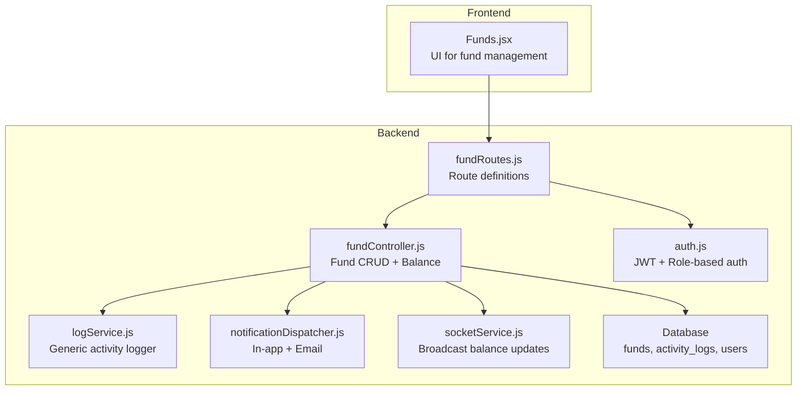
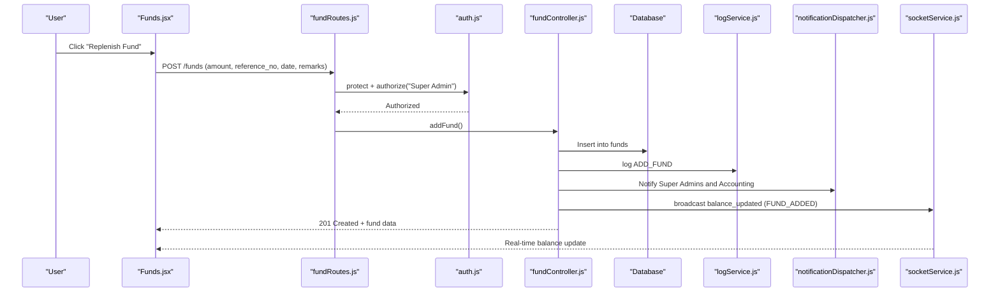
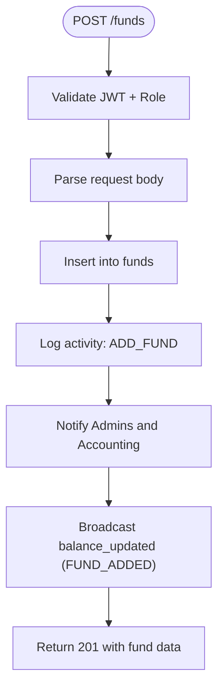
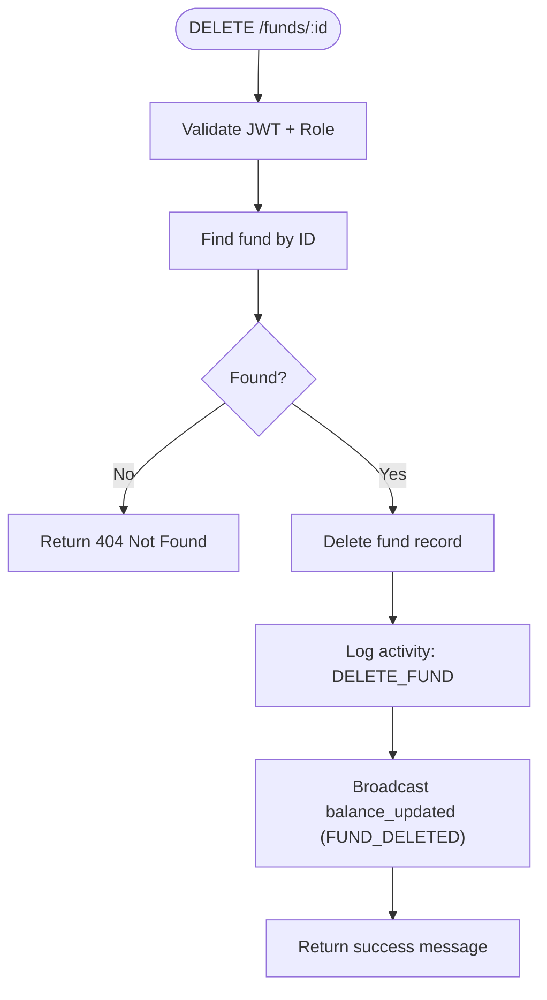
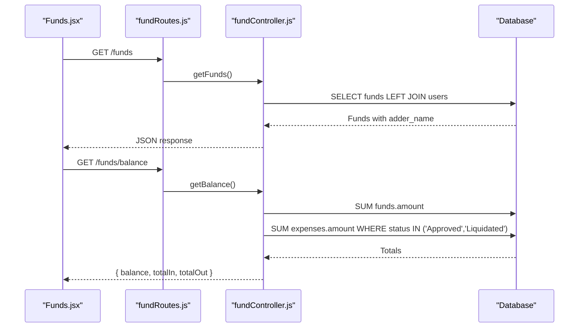
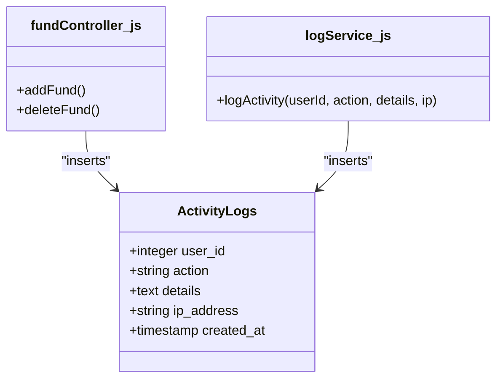
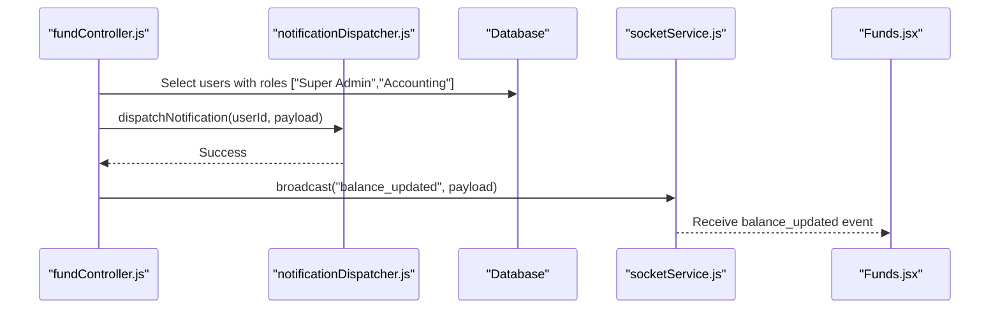
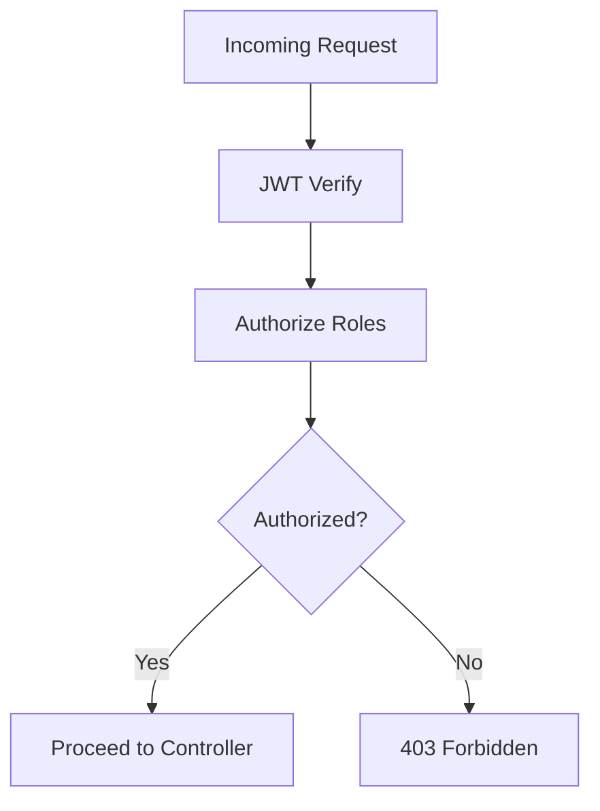
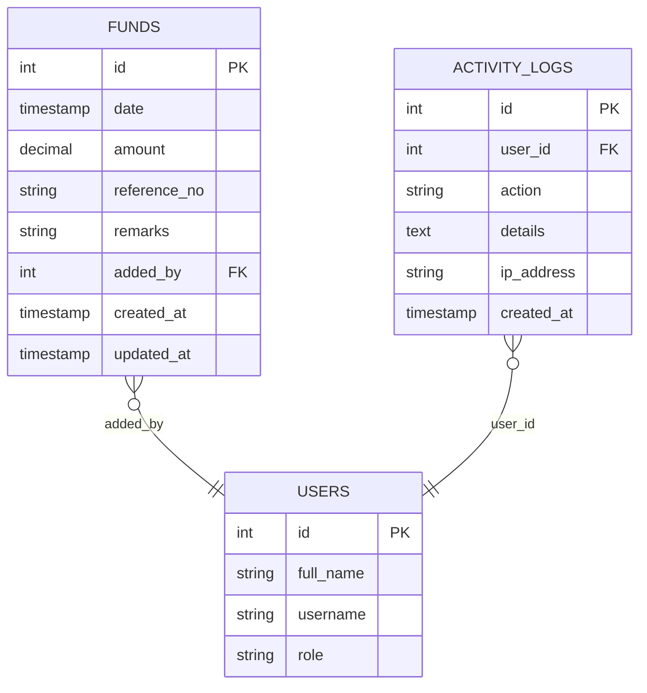
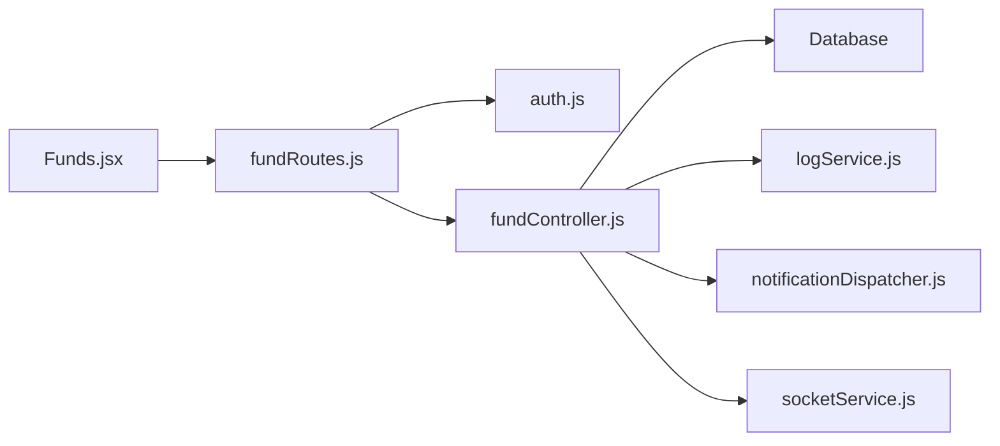

# Fund Transactions

<cite>
**Referenced Files in This Document**
- [fundController.js](file://backend/src/controllers/fundController.js)
- [fundRoutes.js](file://backend/src/routes/fundRoutes.js)
- [create_funds_table.js](file://backend/src/db/migrations/20260512075907_create_funds_table.js)
- [Funds.jsx](file://frontend/src/pages/Funds.jsx)
- [auth.js](file://backend/src/middleware/auth.js)
- [logService.js](file://backend/src/utils/logService.js)
- [notificationDispatcher.js](file://backend/src/services/notificationDispatcher.js)
- [socketService.js](file://backend/src/services/socketService.js)
- [logController.js](file://backend/src/controllers/logController.js)
- [init_logs.js](file://backend/init_logs.js)
- [analyticsController.js](file://backend/src/controllers/analyticsController.js)
- [20260611000000_add_liquidation_approval_workflow.js](file://backend/src/db/migrations/20260611000000_add_liquidation_approval_workflow.js)
- [03_email_templates.js](file://backend/src/db/seeds/03_email_templates.js)
</cite>

## Table of Contents
1. [Introduction](#introduction)
2. [Project Structure](#project-structure)
3. [Core Components](#core-components)
4. [Architecture Overview](#architecture-overview)
5. [Detailed Component Analysis](#detailed-component-analysis)
6. [Dependency Analysis](#dependency-analysis)
7. [Performance Considerations](#performance-considerations)
8. [Troubleshooting Guide](#troubleshooting-guide)
9. [Conclusion](#conclusion)
10. [Appendices](#appendices)

## Introduction
This document explains the fund transaction management system for petty cash replenishments. It covers fund creation (adding funds), fund deletion, and the associated transaction logging, activity tracking, and audit trails. It also documents the balance calculation, real-time updates, and security controls enforced by the backend middleware. Examples illustrate creating a fund entry, deleting a fund entry, and viewing transaction history.

## Project Structure
The fund transaction feature spans backend controllers and routes, database migrations, and frontend pages. The backend enforces role-based access control, records activity logs, and broadcasts real-time balance updates. The frontend renders fund history, displays balances, and triggers fund creation and deletion actions.

**Diagram sources**
- [Funds.jsx:1-192](file://frontend/src/pages/Funds.jsx#L1-L192)
- [fundRoutes.js:1-14](file://backend/src/routes/fundRoutes.js#L1-L14)
- [fundController.js:1-108](file://backend/src/controllers/fundController.js#L1-L108)
- [auth.js:1-36](file://backend/src/middleware/auth.js#L1-L36)
- [logService.js:1-24](file://backend/src/utils/logService.js#L1-L24)
- [notificationDispatcher.js:1-68](file://backend/src/services/notificationDispatcher.js#L1-L68)
- [socketService.js:1-102](file://backend/src/services/socketService.js#L1-L102)

**Section sources**
- [Funds.jsx:1-192](file://frontend/src/pages/Funds.jsx#L1-L192)
- [fundRoutes.js:1-14](file://backend/src/routes/fundRoutes.js#L1-L14)

## Core Components
- Fund Routes: Define protected endpoints for listing funds, adding funds, deleting funds, and retrieving balances.
- Fund Controller: Implements fund retrieval, creation, deletion, and balance computation. Records activity logs and sends notifications.
- Authentication Middleware: Enforces JWT-based protection and role-based authorization.
- Activity Logging: Centralized logging service and dedicated activity logs table.
- Notifications: Dispatches in-app notifications and emails to administrators upon fund replenishment.
- Real-time Updates: Socket-based broadcasting of balance changes.
- Frontend Page: Renders fund history, balance cards, and modals for adding funds.

**Section sources**
- [fundController.js:1-108](file://backend/src/controllers/fundController.js#L1-L108)
- [fundRoutes.js:1-14](file://backend/src/routes/fundRoutes.js#L1-L14)
- [auth.js:1-36](file://backend/src/middleware/auth.js#L1-L36)
- [logService.js:1-24](file://backend/src/utils/logService.js#L1-L24)
- [notificationDispatcher.js:1-68](file://backend/src/services/notificationDispatcher.js#L1-L68)
- [socketService.js:1-102](file://backend/src/services/socketService.js#L1-L102)
- [Funds.jsx:1-192](file://frontend/src/pages/Funds.jsx#L1-L192)

## Architecture Overview
The system follows a layered architecture:
- Presentation Layer: React page handles user interactions and displays data.
- Application Layer: Express routes delegate to controllers after middleware validation.
- Domain Layer: Controllers orchestrate database operations, logging, notifications, and broadcasting.
- Persistence Layer: Knex-managed tables for funds, activity logs, and users.

**Diagram sources**
- [Funds.jsx:41-51](file://frontend/src/pages/Funds.jsx#L41-L51)
- [fundRoutes.js:8-11](file://backend/src/routes/fundRoutes.js#L8-L11)
- [auth.js:3-33](file://backend/src/middleware/auth.js#L3-L33)
- [fundController.js:17-56](file://backend/src/controllers/fundController.js#L17-L56)
- [logService.js:10-21](file://backend/src/utils/logService.js#L10-L21)
- [notificationDispatcher.js:5-63](file://backend/src/services/notificationDispatcher.js#L5-L63)
- [socketService.js:88-94](file://backend/src/services/socketService.js#L88-L94)

## Detailed Component Analysis

### Fund Creation Workflow
- Endpoint: POST /funds (protected and role-restricted)
- Request Body Keys: amount, reference_no, remarks, date (optional)
- Behavior:
  - Inserts a new fund record with current timestamp if date is omitted.
  - Records an activity log entry for the action.
  - Sends in-app notifications to Super Admins and Accounting users.
  - Broadcasts a real-time balance update indicating a fund addition.
  - Returns the created fund record.

**Diagram sources**
- [fundRoutes.js:8-11](file://backend/src/routes/fundRoutes.js#L8-L11)
- [fundController.js:17-56](file://backend/src/controllers/fundController.js#L17-L56)
- [logService.js:10-21](file://backend/src/utils/logService.js#L10-L21)
- [notificationDispatcher.js:5-63](file://backend/src/services/notificationDispatcher.js#L5-L63)
- [socketService.js:88-94](file://backend/src/services/socketService.js#L88-L94)

**Section sources**
- [fundController.js:17-56](file://backend/src/controllers/fundController.js#L17-L56)
- [Funds.jsx:41-51](file://frontend/src/pages/Funds.jsx#L41-L51)

### Fund Deletion Workflow
- Endpoint: DELETE /funds/:id (protected and role-restricted)
- Validation:
  - Fetches the fund by ID; returns 404 if not found.
- Behavior:
  - Deletes the fund record.
  - Records an activity log entry for the deletion.
  - Broadcasts a real-time balance update indicating a fund deletion.
  - Returns a success message.

**Diagram sources**
- [fundRoutes.js:10-11](file://backend/src/routes/fundRoutes.js#L10-L11)
- [fundController.js:58-81](file://backend/src/controllers/fundController.js#L58-L81)
- [logService.js:10-21](file://backend/src/utils/logService.js#L10-L21)
- [socketService.js:88-94](file://backend/src/services/socketService.js#L88-L94)

**Section sources**
- [fundController.js:58-81](file://backend/src/controllers/fundController.js#L58-L81)
- [Funds.jsx:53-62](file://frontend/src/pages/Funds.jsx#L53-L62)

### Fund Listing and Balance Calculation
- GET /funds lists all fund entries ordered by date descending and joins with users to show who added each entry.
- GET /funds/balance computes:
  - Total In: Sum of all fund additions.
  - Total Out: Sum of expenses where status is either Approved or Liquidated.
  - Balance: Total In minus Total Out.

**Diagram sources**
- [Funds.jsx:25-39](file://frontend/src/pages/Funds.jsx#L25-L39)
- [fundRoutes.js:8-11](file://backend/src/routes/fundRoutes.js#L8-L11)
- [fundController.js:5-15](file://backend/src/controllers/fundController.js#L5-L15)
- [fundController.js:83-107](file://backend/src/controllers/fundController.js#L83-L107)

**Section sources**
- [fundController.js:5-15](file://backend/src/controllers/fundController.js#L5-L15)
- [fundController.js:83-107](file://backend/src/controllers/fundController.js#L83-L107)
- [Funds.jsx:25-39](file://frontend/src/pages/Funds.jsx#L25-L39)

### Transaction Logging, Activity Tracking, and Audit Trails
- Activity Logging:
  - Dedicated table for activity logs with fields for user, action, details, and IP.
  - Controllers insert entries for fund add/delete actions.
  - Generic logging utility supports reuse across modules.
- Audit Trail Access:
  - Activity logs can be retrieved via a dedicated endpoint and joined with user details for reporting.

**Diagram sources**
- [init_logs.js:1-18](file://backend/init_logs.js#L1-L18)
- [logService.js:1-24](file://backend/src/utils/logService.js#L1-L24)
- [fundController.js:30-73](file://backend/src/controllers/fundController.js#L30-L73)
- [logController.js:1-20](file://backend/src/controllers/logController.js#L1-L20)

**Section sources**
- [logService.js:1-24](file://backend/src/utils/logService.js#L1-L24)
- [fundController.js:30-73](file://backend/src/controllers/fundController.js#L30-L73)
- [logController.js:1-20](file://backend/src/controllers/logController.js#L1-L20)
- [init_logs.js:1-18](file://backend/init_logs.js#L1-L18)

### Notifications and Real-Time Updates
- Notifications:
  - On fund addition, in-app notifications are sent to Super Admins and Accounting users.
  - Optional email dispatch via a queued job using named templates.
- Real-Time Updates:
  - Socket.IO broadcasts balance_updated events to clients for immediate UI refresh.

**Diagram sources**
- [fundController.js:37-50](file://backend/src/controllers/fundController.js#L37-L50)
- [notificationDispatcher.js:5-63](file://backend/src/services/notificationDispatcher.js#L5-L63)
- [socketService.js:88-94](file://backend/src/services/socketService.js#L88-L94)
- [Funds.jsx:58-58](file://frontend/src/pages/Funds.jsx#L58-L58)

**Section sources**
- [fundController.js:37-50](file://backend/src/controllers/fundController.js#L37-L50)
- [notificationDispatcher.js:1-68](file://backend/src/services/notificationDispatcher.js#L1-L68)
- [socketService.js:1-102](file://backend/src/services/socketService.js#L1-L102)
- [Funds.jsx:58-58](file://frontend/src/pages/Funds.jsx#L58-L58)

### Security and Permissions
- Authentication:
  - All fund routes are protected by a JWT middleware that verifies tokens from Authorization headers.
- Authorization:
  - Route handlers are further restricted to specific roles using an authorization middleware.
- Example Roles:
  - Fund listing and creation are restricted to Super Admin.
  - Fund deletion is restricted to Super Admin.

**Diagram sources**
- [auth.js:3-33](file://backend/src/middleware/auth.js#L3-L33)
- [fundRoutes.js:6-11](file://backend/src/routes/fundRoutes.js#L6-L11)

**Section sources**
- [auth.js:1-36](file://backend/src/middleware/auth.js#L1-L36)
- [fundRoutes.js:6-11](file://backend/src/routes/fundRoutes.js#L6-L11)

### Database Schema: Funds and Related Tables
- Funds Table:
  - Primary key: id
  - Timestamp: date (defaults to now)
  - Decimal: amount (non-null)
  - Strings: reference_no, remarks
  - Foreign key: added_by referencing users.id
  - Timestamps: created_at, updated_at
- Activity Logs Table:
  - Tracks user actions with user_id, action, details, ip_address, created_at.
- Expense Status Consideration:
  - Balance calculation considers expenses with status Approved or Liquidated.

**Diagram sources**
- [create_funds_table.js:4-12](file://backend/src/db/migrations/20260512075907_create_funds_table.js#L4-L12)
- [init_logs.js:6-13](file://backend/init_logs.js#L6-L13)

**Section sources**
- [create_funds_table.js:1-44](file://backend/src/db/migrations/20260512075907_create_funds_table.js#L1-L44)
- [init_logs.js:1-18](file://backend/init_logs.js#L1-L18)
- [fundController.js:86-89](file://backend/src/controllers/fundController.js#L86-L89)

## Dependency Analysis
- Controllers depend on:
  - Database client for queries.
  - Logging utility for audit entries.
  - Notification dispatcher for admin alerts.
  - Socket service for real-time updates.
- Routes depend on:
  - Authentication middleware for JWT verification.
  - Authorization middleware for role checks.
- Frontend depends on:
  - API endpoints for data retrieval and mutations.
  - Socket events for live balance updates.

**Diagram sources**
- [Funds.jsx:1-192](file://frontend/src/pages/Funds.jsx#L1-L192)
- [fundRoutes.js:1-14](file://backend/src/routes/fundRoutes.js#L1-L14)
- [auth.js:1-36](file://backend/src/middleware/auth.js#L1-L36)
- [fundController.js:1-108](file://backend/src/controllers/fundController.js#L1-L108)
- [logService.js:1-24](file://backend/src/utils/logService.js#L1-L24)
- [notificationDispatcher.js:1-68](file://backend/src/services/notificationDispatcher.js#L1-L68)
- [socketService.js:1-102](file://backend/src/services/socketService.js#L1-L102)

**Section sources**
- [Funds.jsx:1-192](file://frontend/src/pages/Funds.jsx#L1-L192)
- [fundRoutes.js:1-14](file://backend/src/routes/fundRoutes.js#L1-L14)
- [fundController.js:1-108](file://backend/src/controllers/fundController.js#L1-L108)

## Performance Considerations
- Database Indexing:
  - Consider indexing funds.added_by and activity_logs.user_id for faster joins and filtering.
- Aggregation Efficiency:
  - Balance calculation performs two separate sums; ensure appropriate indices on funds.amount and expenses.status.
- Notification Scaling:
  - Batch notifications to administrators if volume increases.
- Real-Time Overhead:
  - Limit broadcast payload to essential fields to minimize bandwidth usage.

[No sources needed since this section provides general guidance]

## Troubleshooting Guide
- Authentication Failures:
  - Missing or invalid Authorization header results in 401 responses.
- Authorization Failures:
  - Requests from unauthorized roles receive 403 responses.
- Fund Not Found:
  - Deleting a non-existent fund ID returns 404.
- Database Initialization:
  - Activity logs table is created automatically if missing.
- Notification Delivery:
  - Email dispatch requires a valid template name and user email; otherwise, errors are logged.

**Section sources**
- [auth.js:10-21](file://backend/src/middleware/auth.js#L10-L21)
- [auth.js:23-33](file://backend/src/middleware/auth.js#L23-L33)
- [fundController.js:62-64](file://backend/src/controllers/fundController.js#L62-L64)
- [init_logs.js:1-18](file://backend/init_logs.js#L1-L18)
- [notificationDispatcher.js:42-56](file://backend/src/services/notificationDispatcher.js#L42-L56)

## Conclusion
The fund transaction module provides a secure, auditable, and real-time petty cash replenishment workflow. It enforces role-based access control, maintains activity logs, notifies administrators, and updates balances instantly. The frontend offers intuitive forms and dashboards for managing funds and reviewing history.

[No sources needed since this section summarizes without analyzing specific files]

## Appendices

### Example Workflows

- Creating a Fund Entry
  - Steps:
    - Open the Replenish Fund modal in the Funds page.
    - Enter amount, optional reference number, remarks, and voucher date.
    - Submit to POST /funds.
  - Expected Outcome:
    - Fund entry stored, activity log recorded, administrators notified, and balance updated.

  **Section sources**
  - [Funds.jsx:41-51](file://frontend/src/pages/Funds.jsx#L41-L51)
  - [fundController.js:17-56](file://backend/src/controllers/fundController.js#L17-L56)

- Editing Fund Details
  - Current Implementation:
    - The provided controllers and routes do not expose an edit/update endpoint for fund entries.
  - Recommendation:
    - Add PUT/PATCH /funds/:id with validation and activity logging if editing is required.

  **Section sources**
  - [fundController.js:1-108](file://backend/src/controllers/fundController.js#L1-L108)
  - [fundRoutes.js:1-14](file://backend/src/routes/fundRoutes.js#L1-L14)

- Deleting a Fund Entry
  - Steps:
    - From the Funds page, click the delete button for a fund entry.
    - Confirm the deletion dialog.
    - The system deletes the entry, logs the action, and broadcasts balance updates.
  - Impact:
    - Reduces total cash inflow and recalculates system balance.

  **Section sources**
  - [Funds.jsx:53-62](file://frontend/src/pages/Funds.jsx#L53-L62)
  - [fundController.js:58-81](file://backend/src/controllers/fundController.js#L58-L81)

- Viewing Transaction History
  - Steps:
    - Navigate to the Funds page to view the replenishment history table.
    - The page fetches fund entries and balances concurrently.
  - Audit Trail:
    - Use the Logs page to review activity logs with timestamps and actor details.

  **Section sources**
  - [Funds.jsx:25-39](file://frontend/src/pages/Funds.jsx#L25-L39)
  - [logController.js:1-20](file://backend/src/controllers/logController.js#L1-L20)

### Additional Notes on Approvals and Security
- Liquidation Approval Workflow:
  - Separate approval workflows exist for expense liquidations with thresholds and email templates.
- Email Templates:
  - Notification templates support dynamic placeholders for messages and links.

**Section sources**
- [20260611000000_add_liquidation_approval_workflow.js:85-150](file://backend/src/db/migrations/20260611000000_add_liquidation_approval_workflow.js#L85-L150)
- [03_email_templates.js:24-89](file://backend/src/db/seeds/03_email_templates.js#L24-L89)