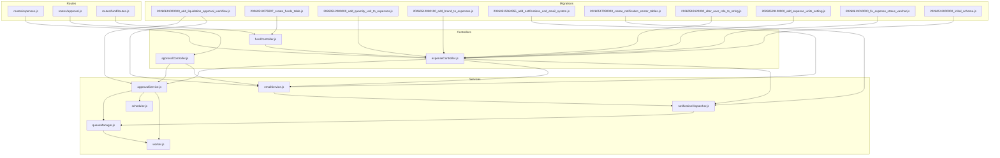
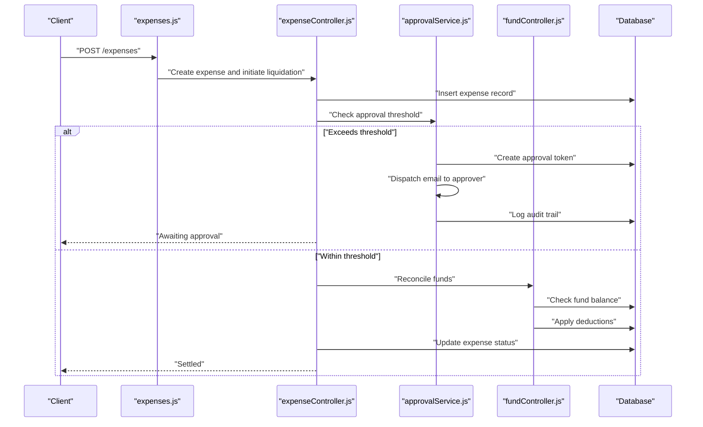
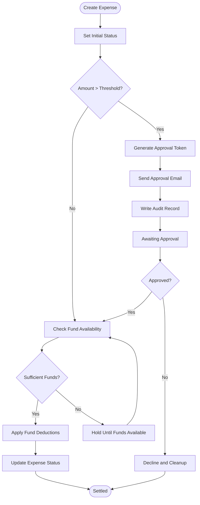
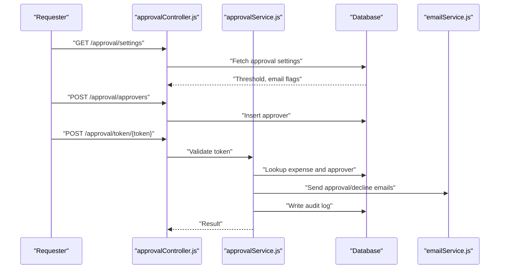
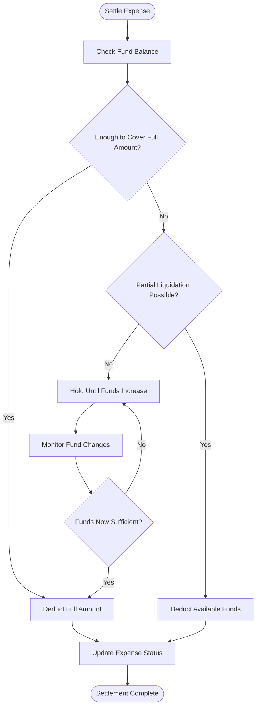
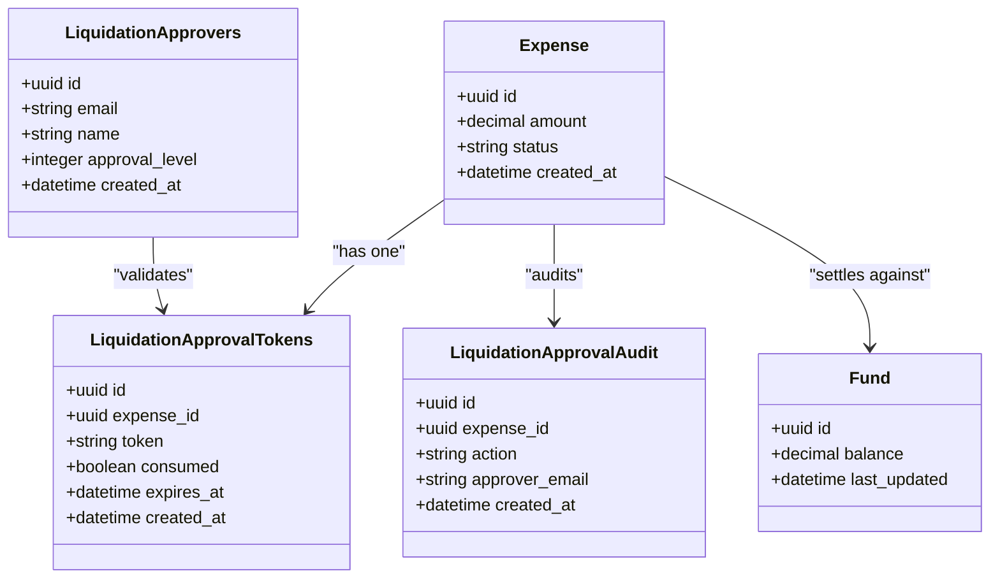
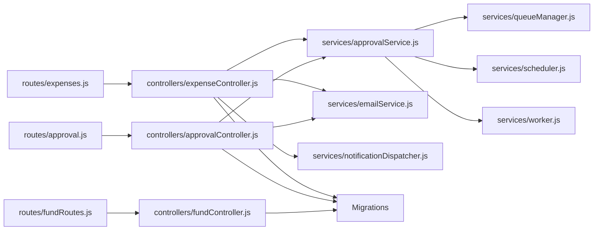

# Liquidation Processing

<cite>
**Referenced Files in This Document**
- [20260611000000_add_liquidation_approval_workflow.js](file://backend/src/db/migrations/20260611000000_add_liquidation_approval_workflow.js)
- [expenseController.js](file://backend/src/controllers/expenseController.js)
- [approvalController.js](file://backend/src/controllers/approvalController.js)
- [approvalService.js](file://backend/src/services/approvalService.js)
- [fundController.js](file://backend/src/controllers/fundController.js)
- [approval.js](file://backend/src/routes/approval.js)
- [expenses.js](file://backend/src/routes/expenses.js)
- [fundRoutes.js](file://backend/src/routes/fundRoutes.js)
- [20260512075907_create_funds_table.js](file://backend/src/db/migrations/20260512075907_create_funds_table.js)
- [20260512080000_add_quantity_unit_to_expenses.js](file://backend/src/db/migrations/20260512080000_add_quantity_unit_to_expenses.js)
- [20260512080100_add_brand_to_expenses.js](file://backend/src/db/migrations/20260512080100_add_brand_to_expenses.js)
- [20260515064955_add_notifications_and_email_system.js](file://backend/src/db/migrations/20260515064955_add_notifications_and_email_system.js)
- [20260517090000_create_notification_center_tables.js](file://backend/src/db/migrations/20260517090000_create_notification_center_tables.js)
- [20260519120000_alter_user_role_to_string.js](file://backend/src/db/migrations/20260519120000_alter_user_role_to_string.js)
- [20260529120000_add_expense_units_setting.js](file://backend/src/db/migrations/20260529120000_add_expense_units_setting.js)
- [20260611000000_add_liquidation_approval_workflow.js](file://backend/src/db/migrations/20260611000000_add_liquidation_approval_workflow.js)
- [20260611010000_fix_expense_status_varchar.js](file://backend/src/db/migrations/20260611010000_fix_expense_status_varchar.js)
- [20260512000000_initial_schema.js](file://backend/src/db/migrations/20260512000000_initial_schema.js)
- [logService.js](file://backend/src/utils/logService.js)
- [emailService.js](file://backend/src/services/emailService.js)
- [notificationDispatcher.js](file://backend/src/services/notificationDispatcher.js)
- [queueManager.js](file://backend/src/services/queueManager.js)
- [scheduler.js](file://backend/src/services/scheduler.js)
- [worker.js](file://backend/src/services/worker.js)
</cite>

## Table of Contents
1. [Introduction](#introduction)
2. [Project Structure](#project-structure)
3. [Core Components](#core-components)
4. [Architecture Overview](#architecture-overview)
5. [Detailed Component Analysis](#detailed-component-analysis)
6. [Dependency Analysis](#dependency-analysis)
7. [Performance Considerations](#performance-considerations)
8. [Troubleshooting Guide](#troubleshooting-guide)
9. [Conclusion](#conclusion)
10. [Appendices](#appendices)

## Introduction
This document describes the liquidation processing system responsible for reconciling employee petty cash expenses against available funds and managing fund deductions. It covers the end-to-end workflow from expense creation and approval to fund settlement, including integration with the approval workflow, expense status tracking, automatic fund adjustments, batch processing capabilities, partial liquidations, and fund balancing. It also documents reporting, audit requirements, and exception handling mechanisms.

## Project Structure
The liquidation system spans database migrations, controllers, services, routes, and supporting utilities. The approval workflow for high-value liquidations is integrated with email notifications and audit logging. Fund reconciliation is handled via dedicated fund management routes and controllers.

**Diagram sources**
- [expenseController.js](file://backend/src/controllers/expenseController.js)
- [approvalController.js](file://backend/src/controllers/approvalController.js)
- [fundController.js](file://backend/src/controllers/fundController.js)
- [approvalService.js](file://backend/src/services/approvalService.js)
- [emailService.js](file://backend/src/services/emailService.js)
- [notificationDispatcher.js](file://backend/src/services/notificationDispatcher.js)
- [queueManager.js](file://backend/src/services/queueManager.js)
- [scheduler.js](file://backend/src/services/scheduler.js)
- [worker.js](file://backend/src/services/worker.js)
- [expenses.js](file://backend/src/routes/expenses.js)
- [approval.js](file://backend/src/routes/approval.js)
- [fundRoutes.js](file://backend/src/routes/fundRoutes.js)
- [20260611000000_add_liquidation_approval_workflow.js](file://backend/src/db/migrations/20260611000000_add_liquidation_approval_workflow.js)
- [20260512075907_create_funds_table.js](file://backend/src/db/migrations/20260512075907_create_funds_table.js)
- [20260512080000_add_quantity_unit_to_expenses.js](file://backend/src/db/migrations/20260512080000_add_quantity_unit_to_expenses.js)
- [20260512080100_add_brand_to_expenses.js](file://backend/src/db/migrations/20260512080100_add_brand_to_expenses.js)
- [20260515064955_add_notifications_and_email_system.js](file://backend/src/db/migrations/20260515064955_add_notifications_and_email_system.js)
- [20260517090000_create_notification_center_tables.js](file://backend/src/db/migrations/20260517090000_create_notification_center_tables.js)
- [20260519120000_alter_user_role_to_string.js](file://backend/src/db/migrations/20260519120000_alter_user_role_to_string.js)
- [20260529120000_add_expense_units_setting.js](file://backend/src/db/migrations/20260529120000_add_expense_units_setting.js)
- [20260611010000_fix_expense_status_varchar.js](file://backend/src/db/migrations/20260611010000_fix_expense_status_varchar.js)
- [20260512000000_initial_schema.js](file://backend/src/db/migrations/20260512000000_initial_schema.js)

**Section sources**
- [expenses.js](file://backend/src/routes/expenses.js)
- [approval.js](file://backend/src/routes/approval.js)
- [fundRoutes.js](file://backend/src/routes/fundRoutes.js)
- [20260611000000_add_liquidation_approval_workflow.js](file://backend/src/db/migrations/20260611000000_add_liquidation_approval_workflow.js)

## Core Components
- Expense controller: Orchestrates liquidation requests, applies approval thresholds, manages status transitions, and triggers fund reconciliation.
- Approval controller and service: Manage secure approval tokens, multi-level approvers, email notifications, and audit trails for high-value liquidations.
- Fund controller: Handles fund balance queries, partial liquidations, and fund deductions upon settlement.
- Routes: Expose endpoints for expenses, approvals, and funds.
- Migrations: Define database schema for liquidation approvals, tokens, audit logs, and related settings.

Key implementation references:
- Liquidation approval workflow migration defines tables and seed data for thresholds and email templates.
- Expense controller integrates approval interception and cleanup of tokens and audit logs.
- Fund controller coordinates fund availability checks and adjustments.

**Section sources**
- [20260611000000_add_liquidation_approval_workflow.js](file://backend/src/db/migrations/20260611000000_add_liquidation_approval_workflow.js)
- [expenseController.js](file://backend/src/controllers/expenseController.js)
- [fundController.js](file://backend/src/controllers/fundController.js)
- [approvalController.js](file://backend/src/controllers/approvalController.js)
- [approvalService.js](file://backend/src/services/approvalService.js)

## Architecture Overview
The liquidation system follows a layered architecture:
- Presentation and routing expose REST endpoints for expenses, approvals, and funds.
- Controllers coordinate business logic, invoking services for approval and fund reconciliation.
- Services handle approval workflows, email notifications, queues, scheduling, and workers.
- Migrations define schema for approvals, tokens, audit logs, and settings.
- Utilities support logging, notifications, and background processing.

**Diagram sources**
- [expenses.js](file://backend/src/routes/expenses.js)
- [expenseController.js](file://backend/src/controllers/expenseController.js)
- [approvalService.js](file://backend/src/services/approvalService.js)
- [fundController.js](file://backend/src/controllers/fundController.js)
- [20260611000000_add_liquidation_approval_workflow.js](file://backend/src/db/migrations/20260611000000_add_liquidation_approval_workflow.js)

## Detailed Component Analysis

### Liquidation Workflow: From Expense Creation to Fund Deduction
- Expense creation sets initial status and amount.
- Approval threshold check determines whether email approval is required.
- For high-value liquidations, secure tokens are generated, approvers notified, and audit logs maintained.
- Once approved, fund reconciliation occurs: available funds are checked and adjusted accordingly.
- Expense status is updated to reflect settlement or pending approval.

**Diagram sources**
- [expenseController.js](file://backend/src/controllers/expenseController.js)
- [approvalService.js](file://backend/src/services/approvalService.js)
- [20260611000000_add_liquidation_approval_workflow.js](file://backend/src/db/migrations/20260611000000_add_liquidation_approval_workflow.js)

**Section sources**
- [expenseController.js](file://backend/src/controllers/expenseController.js)
- [20260611000000_add_liquidation_approval_workflow.js](file://backend/src/db/migrations/20260611000000_add_liquidation_approval_workflow.js)

### Approval Workflow Integration
- Multi-level approvers are supported; primary approver email and enablement flag are configurable.
- Approval tokens are created per expense and cleaned up upon settlement or cancellation.
- Audit logs capture all actions for compliance and tracing.
- Email templates are provided for approval requests, approvals, and declines.

**Diagram sources**
- [approvalController.js](file://backend/src/controllers/approvalController.js)
- [approvalService.js](file://backend/src/services/approvalService.js)
- [emailService.js](file://backend/src/services/emailService.js)
- [20260611000000_add_liquidation_approval_workflow.js](file://backend/src/db/migrations/20260611000000_add_liquidation_approval_workflow.js)

**Section sources**
- [approvalController.js](file://backend/src/controllers/approvalController.js)
- [approvalService.js](file://backend/src/services/approvalService.js)
- [20260611000000_add_liquidation_approval_workflow.js](file://backend/src/db/migrations/20260611000000_add_liquidation_approval_workflow.js)

### Fund Reconciliation and Settlement
- Fund controller validates fund balances before applying deductions.
- Supports partial liquidations when total expense exceeds available funds.
- Maintains fund balance updates and logs for auditability.
- Integrates with expense status updates to reflect settlement outcomes.

**Diagram sources**
- [fundController.js](file://backend/src/controllers/fundController.js)
- [20260512075907_create_funds_table.js](file://backend/src/db/migrations/20260512075907_create_funds_table.js)

**Section sources**
- [fundController.js](file://backend/src/controllers/fundController.js)
- [20260512075907_create_funds_table.js](file://backend/src/db/migrations/20260512075907_create_funds_table.js)

### Batch Processing and Partial Liquidations
- Batch processing can be implemented via scheduled tasks or queue workers to process multiple expenses concurrently.
- Partial liquidations adjust expense status to reflect remaining unpaid amounts while applying available funds.
- Fund balancing ensures reserves meet operational needs after settlements.

Implementation references:
- Scheduler and queue manager support background processing.
- Worker module executes queued tasks.

**Section sources**
- [scheduler.js](file://backend/src/services/scheduler.js)
- [queueManager.js](file://backend/src/services/queueManager.js)
- [worker.js](file://backend/src/services/worker.js)

### Reporting, Audit, and Compliance
- Audit tables capture approval actions and outcomes for compliance review.
- Email templates provide standardized communication for approvals, approvals, and declines.
- Notification dispatcher coordinates in-app and email alerts.

**Diagram sources**
- [20260611000000_add_liquidation_approval_workflow.js](file://backend/src/db/migrations/20260611000000_add_liquidation_approval_workflow.js)

**Section sources**
- [20260611000000_add_liquidation_approval_workflow.js](file://backend/src/db/migrations/20260611000000_add_liquidation_approval_workflow.js)

## Dependency Analysis
- Controllers depend on services for approval and fund reconciliation.
- Services rely on database migrations for schema definitions and on email/notification utilities for alerting.
- Routes delegate to controllers, ensuring separation of concerns.
- Background processing is coordinated via scheduler, queue manager, and worker.

**Diagram sources**
- [expenses.js](file://backend/src/routes/expenses.js)
- [approval.js](file://backend/src/routes/approval.js)
- [fundRoutes.js](file://backend/src/routes/fundRoutes.js)
- [expenseController.js](file://backend/src/controllers/expenseController.js)
- [approvalController.js](file://backend/src/controllers/approvalController.js)
- [fundController.js](file://backend/src/controllers/fundController.js)
- [approvalService.js](file://backend/src/services/approvalService.js)
- [emailService.js](file://backend/src/services/emailService.js)
- [notificationDispatcher.js](file://backend/src/services/notificationDispatcher.js)
- [queueManager.js](file://backend/src/services/queueManager.js)
- [scheduler.js](file://backend/src/services/scheduler.js)
- [worker.js](file://backend/src/services/worker.js)

**Section sources**
- [expenses.js](file://backend/src/routes/expenses.js)
- [approval.js](file://backend/src/routes/approval.js)
- [fundRoutes.js](file://backend/src/routes/fundRoutes.js)
- [expenseController.js](file://backend/src/controllers/expenseController.js)
- [approvalController.js](file://backend/src/controllers/approvalController.js)
- [fundController.js](file://backend/src/controllers/fundController.js)
- [approvalService.js](file://backend/src/services/approvalService.js)
- [emailService.js](file://backend/src/services/emailService.js)
- [notificationDispatcher.js](file://backend/src/services/notificationDispatcher.js)
- [queueManager.js](file://backend/src/services/queueManager.js)
- [scheduler.js](file://backend/src/services/scheduler.js)
- [worker.js](file://backend/src/services/worker.js)

## Performance Considerations
- Use batch processing for high-volume liquidations to avoid blocking operations.
- Index approval tokens and audit tables on expense_id for fast lookups.
- Employ queue workers to offload email dispatch and reconciliation tasks.
- Implement rate limiting for approval token generation to prevent abuse.
- Monitor fund reconciliation queries to ensure they remain efficient as data grows.

## Troubleshooting Guide
Common issues and resolutions:
- Approval link invalid or expired: Verify token existence and expiration; regenerate if needed.
- Insufficient funds for settlement: Trigger partial liquidation or schedule reconciliation when funds increase.
- Approval threshold misconfiguration: Adjust threshold and recipient email settings via approval settings endpoint.
- Audit discrepancies: Review audit logs for missing entries or incorrect actions.
- Email delivery failures: Check notification preferences and retry failed deliveries.

Operational references:
- Approval settings and approver management endpoints.
- Expense status cleanup on deletion or cancellation.
- Audit logging for all approval actions.

**Section sources**
- [approvalController.js](file://backend/src/controllers/approvalController.js)
- [expenseController.js](file://backend/src/controllers/expenseController.js)
- [20260611000000_add_liquidation_approval_workflow.js](file://backend/src/db/migrations/20260611000000_add_liquidation_approval_workflow.js)

## Conclusion
The liquidation processing system integrates expense lifecycle management with approval workflows and fund reconciliation. It supports high-value approvals via secure tokens, maintains comprehensive audit trails, and enables partial settlements and fund balancing. With robust services for notifications, queuing, and scheduling, the system scales to enterprise needs while meeting compliance and reporting requirements.

## Appendices

### Endpoint Reference Summary
- Expenses
  - POST /expenses: Create expense and initiate liquidation
- Approvals
  - GET /approval/settings: Retrieve approval thresholds and flags
  - PUT /approval/settings: Update approval settings
  - POST /approval/approvers: Add approver
  - DELETE /approval/approvers/:id: Remove approver
  - POST /approval/token/:token: Approve/decline liquidation
- Funds
  - GET /funds/balance: Check fund balance
  - POST /funds/settle: Settle expense against funds

**Section sources**
- [expenses.js](file://backend/src/routes/expenses.js)
- [approval.js](file://backend/src/routes/approval.js)
- [fundRoutes.js](file://backend/src/routes/fundRoutes.js)