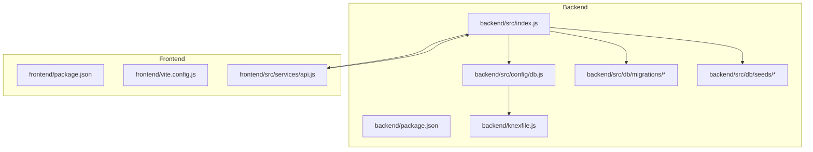
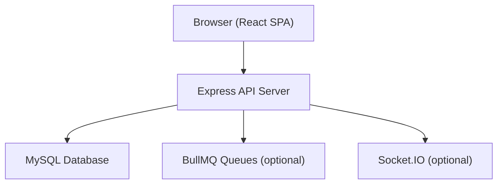
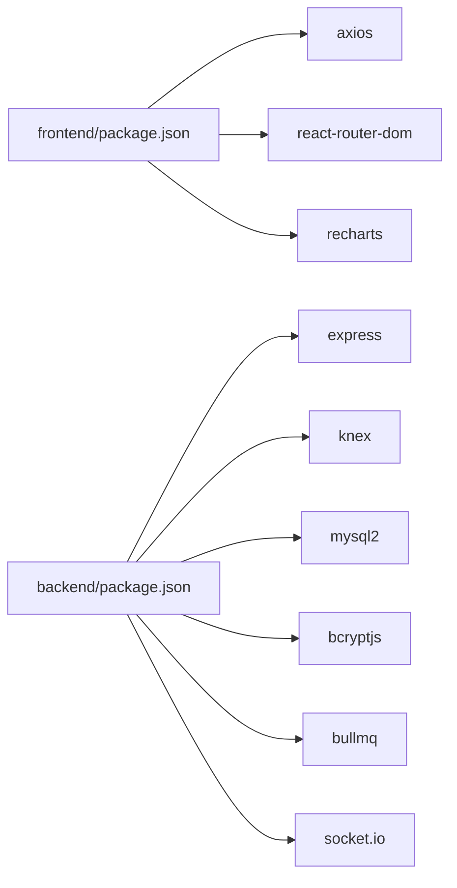
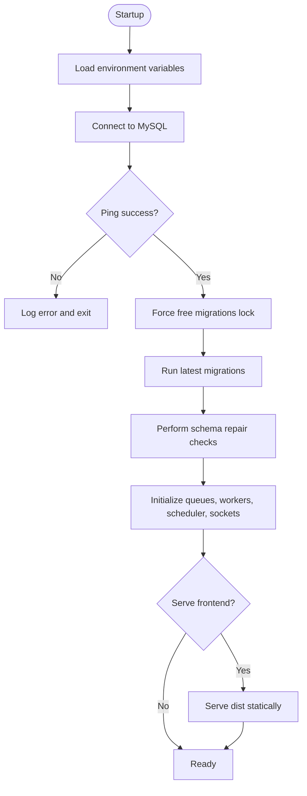

# Getting Started

<cite>
**Referenced Files in This Document**
- [README.md](file://README.md)
- [deployment_guide.md](file://deployment_guide.md)
- [backend/package.json](file://backend/package.json)
- [frontend/package.json](file://frontend/package.json)
- [backend/knexfile.js](file://backend/knexfile.js)
- [backend/src/config/db.js](file://backend/src/config/db.js)
- [backend/src/index.js](file://backend/src/index.js)
- [backend/run_migrations.js](file://backend/run_migrations.js)
- [backend/src/utils/create_db.js](file://backend/src/utils/create_db.js)
- [backend/src/db/migrations/20260512000000_initial_schema.js](file://backend/src/db/migrations/20260512000000_initial_schema.js)
- [backend/src/db/seeds/01_initial_data.js](file://backend/src/db/seeds/01_initial_data.js)
- [frontend/vite.config.js](file://frontend/vite.config.js)
- [frontend/src/services/api.js](file://frontend/src/services/api.js)
</cite>

## Table of Contents
1. [Introduction](#introduction)
2. [Project Structure](#project-structure)
3. [Core Components](#core-components)
4. [Architecture Overview](#architecture-overview)
5. [Detailed Component Analysis](#detailed-component-analysis)
6. [Dependency Analysis](#dependency-analysis)
7. [Performance Considerations](#performance-considerations)
8. [Troubleshooting Guide](#troubleshooting-guide)
9. [Conclusion](#conclusion)
10. [Appendices](#appendices)

## Introduction
This guide helps you install, configure, and run the NKB Petty Cash Expense Monitoring System locally for development and prepare it for production deployment. It covers prerequisites, environment setup, backend and frontend installation, database configuration, migrations and seeding, local development servers, verification steps, and initial user setup. It also includes troubleshooting tips and production deployment notes.

## Project Structure
The project consists of:
- Backend service written in Node.js with Express, Knex.js, and MySQL.
- Frontend built with React, Vite, TailwindCSS, and Recharts.
- Database migrations and seeds under the backend’s src/db directory.
- Deployment instructions for production environments.

**Diagram sources**
- [backend/src/index.js:1-240](file://backend/src/index.js#L1-L240)
- [backend/src/config/db.js:1-8](file://backend/src/config/db.js#L1-L8)
- [backend/knexfile.js:1-37](file://backend/knexfile.js#L1-L37)
- [backend/src/db/migrations/20260512000000_initial_schema.js:1-159](file://backend/src/db/migrations/20260512000000_initial_schema.js#L1-L159)
- [backend/src/db/seeds/01_initial_data.js:53-72](file://backend/src/db/seeds/01_initial_data.js#L53-L72)
- [frontend/src/services/api.js:1-29](file://frontend/src/services/api.js#L1-L29)
- [frontend/vite.config.js:1-31](file://frontend/vite.config.js#L1-L31)

**Section sources**
- [README.md:1-43](file://README.md#L1-L43)
- [backend/package.json:1-50](file://backend/package.json#L1-L50)
- [frontend/package.json:1-49](file://frontend/package.json#L1-L49)

## Core Components
- Backend server: Express-based API with routes, middleware, database initialization, migrations, and optional frontend serving in production.
- Database: MySQL configured via Knex.js with environment-driven connections.
- Frontend: React SPA served by the backend in production; development server runs independently during development.
- Task queues and notifications: Optional Redis-backed BullMQ queues and admin interface.

Key capabilities:
- Authentication and RBAC via JWT.
- Expense lifecycle tracking, approvals, and reporting.
- Email automation and notifications.
- Responsive UI with dark mode support.

**Section sources**
- [README.md:5-18](file://README.md#L5-L18)
- [backend/src/index.js:1-240](file://backend/src/index.js#L1-L240)
- [backend/package.json:17-38](file://backend/package.json#L17-L38)

## Architecture Overview
High-level runtime architecture:
- The backend initializes the database, runs migrations and repairs, starts queues/workers/scheduler, and serves API routes.
- The frontend communicates with the backend API and optionally receives real-time updates via WebSocket.
- In production, the backend serves the built frontend assets from the shared dist folder.

**Diagram sources**
- [backend/src/index.js:1-240](file://backend/src/index.js#L1-L240)
- [backend/src/config/db.js:1-8](file://backend/src/config/db.js#L1-L8)
- [frontend/src/services/api.js:1-29](file://frontend/src/services/api.js#L1-L29)

## Detailed Component Analysis

### Prerequisites and Environment Setup
- Node.js: Install a current LTS version compatible with the project’s engines.
- Database: The project declares MySQL in the backend dependencies and uses Knex.js with mysql2. However, the repository also includes a script that attempts to create a PostgreSQL database. For this system, use MySQL as per the Knex configuration and backend dependencies.
- Operating system: Windows, macOS, or Linux.

Verification steps:
- Confirm Node.js and npm versions meet the project’s requirements.
- Ensure MySQL server is reachable and credentials are ready.

**Section sources**
- [README.md:21-24](file://README.md#L21-L24)
- [backend/package.json:17-38](file://backend/package.json#L17-L38)
- [backend/knexfile.js:1-37](file://backend/knexfile.js#L1-L37)
- [backend/src/utils/create_db.js:1-29](file://backend/src/utils/create_db.js#L1-L29)

### Backend Installation and Configuration
Step-by-step:
1. Navigate to the backend directory and install dependencies.
2. Create the environment file from the example and set required variables.
3. Run migrations to create/update the schema.
4. Seed the database with initial data.
5. Start the development server.

Command sequence:
- cd backend
- npm install
- Create .env from the example and set:
  - NODE_ENV, PORT, DB_HOST, DB_USER, DB_NAME, DB_PASSWORD, JWT_SECRET, JWT_EXPIRE
  - Optional email automation variables if notifications are needed
- npm run migrate
- npm run seed
- npm run dev

Notes:
- The backend automatically runs migrations on startup and performs schema repair checks.
- A dedicated migration runner is available for production deployments.

Expected outputs:
- Migration logs indicating batch number and applied migrations.
- Seed logs inserting default users and settings.
- Server listening on the configured port.

**Section sources**
- [README.md:25-42](file://README.md#L25-L42)
- [backend/package.json:6-12](file://backend/package.json#L6-L12)
- [backend/knexfile.js:1-37](file://backend/knexfile.js#L1-L37)
- [backend/src/index.js:31-125](file://backend/src/index.js#L31-L125)
- [backend/run_migrations.js:1-21](file://backend/run_migrations.js#L1-L21)
- [backend/src/db/seeds/01_initial_data.js:53-72](file://backend/src/db/seeds/01_initial_data.js#L53-L72)

### Frontend Installation and Configuration
Step-by-step:
1. Navigate to the frontend directory and install dependencies.
2. Create the environment file from the example and set the API base URL if needed.
3. Start the development server.

Command sequence:
- cd frontend
- npm install
- Create .env from the example and set VITE_API_URL to point to the backend API if different from default
- npm run dev

Verification:
- Open the development server URL shown in the terminal.
- Confirm the login page loads and network requests reach the backend.

**Section sources**
- [README.md:35-39](file://README.md#L35-L39)
- [frontend/package.json:6-11](file://frontend/package.json#L6-L11)
- [frontend/src/services/api.js:1-29](file://frontend/src/services/api.js#L1-L29)
- [frontend/vite.config.js:18-31](file://frontend/vite.config.js#L18-L31)

### Database Requirements and Schema Management
- Client: mysql2 via Knex.js.
- Environment variables: DB_HOST, DB_USER, DB_NAME, DB_PASSWORD, DB_PORT (optional).
- Migrations: Managed by Knex; run automatically at startup and via CLI.
- Seeds: Initial data and default settings are inserted by the seed scripts.

Initial schema highlights:
- Core entities include departments, categories, users, expenses, activity logs, and settings.
- Additional tables and columns are added progressively through later migrations.

**Section sources**
- [backend/knexfile.js:4-19](file://backend/knexfile.js#L4-L19)
- [backend/src/config/db.js:1-8](file://backend/src/config/db.js#L1-L8)
- [backend/src/db/migrations/20260512000000_initial_schema.js:1-159](file://backend/src/db/migrations/20260512000000_initial_schema.js#L1-L159)

### Local Development Server Startup
- Backend: npm run dev starts the server with hot reload.
- Frontend: npm run dev starts the Vite dev server.
- The backend serves the frontend in production builds; during development, use the frontend dev server.

Logs to watch:
- Database connectivity confirmation.
- Migration summary and repair messages.
- Server listening on the configured port.

**Section sources**
- [backend/package.json:8-8](file://backend/package.json#L8-L8)
- [frontend/package.json:7-7](file://frontend/package.json#L7-L7)
- [backend/src/index.js:237-239](file://backend/src/index.js#L237-L239)

### Verification Steps
After installation:
- Backend health check: GET /health endpoint returns OK.
- Database: Confirm migrations ran and core tables exist.
- Seeding: Verify default Super Admin user and settings are present.
- Frontend: Login page loads and authentication works.
- API: Network tab shows successful responses from /api routes.

**Section sources**
- [backend/src/index.js:180-182](file://backend/src/index.js#L180-L182)
- [backend/src/db/seeds/01_initial_data.js:53-72](file://backend/src/db/seeds/01_initial_data.js#L53-L72)
- [frontend/src/services/api.js:1-29](file://frontend/src/services/api.js#L1-L29)

### Initial User Account Setup
Default credentials:
- Username: admin
- Password: admin123
- Role: Super Admin

Steps:
- Log in via the frontend login page.
- Change the default password immediately.
- Assign roles and manage users as needed.

**Section sources**
- [backend/src/db/seeds/01_initial_data.js:53-63](file://backend/src/db/seeds/01_initial_data.js#L53-L63)

### Production Environment Preparation
Deployment steps:
- Build the frontend: npm run build in the frontend directory.
- Sync assets: Copy frontend/dist contents into backend/dist.
- Set production environment variables in the backend .env.
- Deploy backend to a Node.js hosting provider (e.g., Hostinger).
- Run migrations if needed using the provided migration runner.

Migration runner:
- Temporarily switch the application entry point to run_migrations.js, restart, check logs, then revert to index.js.

**Section sources**
- [deployment_guide.md:1-70](file://deployment_guide.md#L1-L70)
- [backend/run_migrations.js:1-21](file://backend/run_migrations.js#L1-L21)
- [frontend/package.json:8-8](file://frontend/package.json#L8-L8)

## Dependency Analysis
Runtime dependencies:
- Backend depends on Express, Knex.js, mysql2, bcryptjs, BullMQ, Socket.IO, and others.
- Frontend depends on React, Axios, Recharts, TailwindCSS, and Vite.

**Diagram sources**
- [frontend/package.json:12-28](file://frontend/package.json#L12-L28)
- [backend/package.json:17-38](file://backend/package.json#L17-L38)

**Section sources**
- [frontend/package.json:1-49](file://frontend/package.json#L1-L49)
- [backend/package.json:1-50](file://backend/package.json#L1-L50)

## Performance Considerations
- Use production builds for frontend assets and serve them statically.
- Configure caching headers for immutable assets.
- Monitor database queries and indexes as the dataset grows.
- Use Redis-backed queues for asynchronous tasks in production.

[No sources needed since this section provides general guidance]

## Troubleshooting Guide
Common issues and resolutions:
- Database connection denied: Verify DB_HOST, DB_USER, DB_NAME, DB_PASSWORD, and DB_PORT. Use 127.0.0.1 for stability in production.
- Unknown column errors: Run migrations using the migration runner and restart the application.
- Frontend not loading: Ensure the dist folder exists and is synced into the backend dist directory.
- ERR_HTTP2_PROTOCOL_ERROR: Clear browser cache or rebuild with correct base path.
- 500 Internal Server Error: Check stderr.log in the application root for stack traces.

**Section sources**
- [deployment_guide.md:53-67](file://deployment_guide.md#L53-L67)
- [backend/src/index.js:42-44](file://backend/src/index.js#L42-L44)

## Conclusion
You now have the essential steps to install, configure, and run the NKB Petty Cash system locally, as well as prepare it for production. Follow the environment setup, backend/frontend installation, database migrations and seeding, and verification steps to ensure a smooth start. For production, adhere to the deployment guide and use the migration runner when encountering schema inconsistencies.

[No sources needed since this section summarizes without analyzing specific files]

## Appendices

### Environment Variables Reference
Backend (.env):
- NODE_ENV: development or production
- PORT: server port (default 5000)
- DB_HOST, DB_USER, DB_NAME, DB_PASSWORD, DB_PORT: MySQL connection
- JWT_SECRET, JWT_EXPIRE: token configuration
- Optional email automation: EMAIL_HOST, EMAIL_PORT, EMAIL_USER, EMAIL_PASS, EMAIL_FROM

Frontend (.env):
- VITE_API_URL: API base URL (defaults to /api)

**Section sources**
- [deployment_guide.md:17-33](file://deployment_guide.md#L17-L33)
- [frontend/src/services/api.js:3-5](file://frontend/src/services/api.js#L3-L5)

### Database Initialization Flow

**Diagram sources**
- [backend/src/index.js:28-149](file://backend/src/index.js#L28-L149)