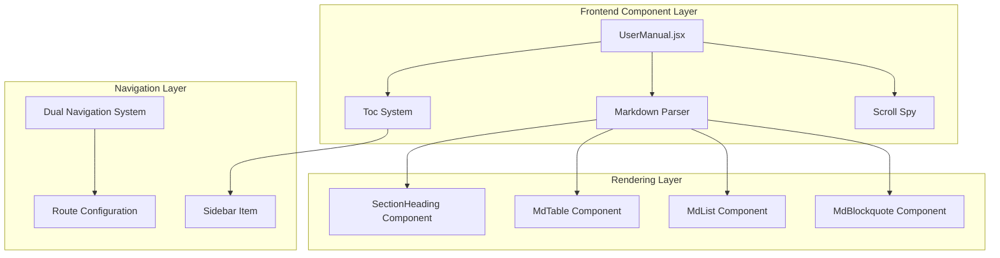
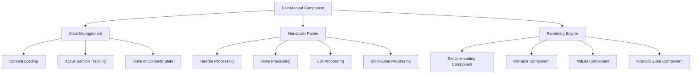
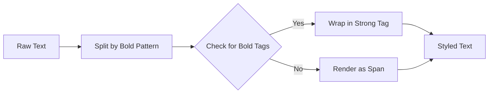
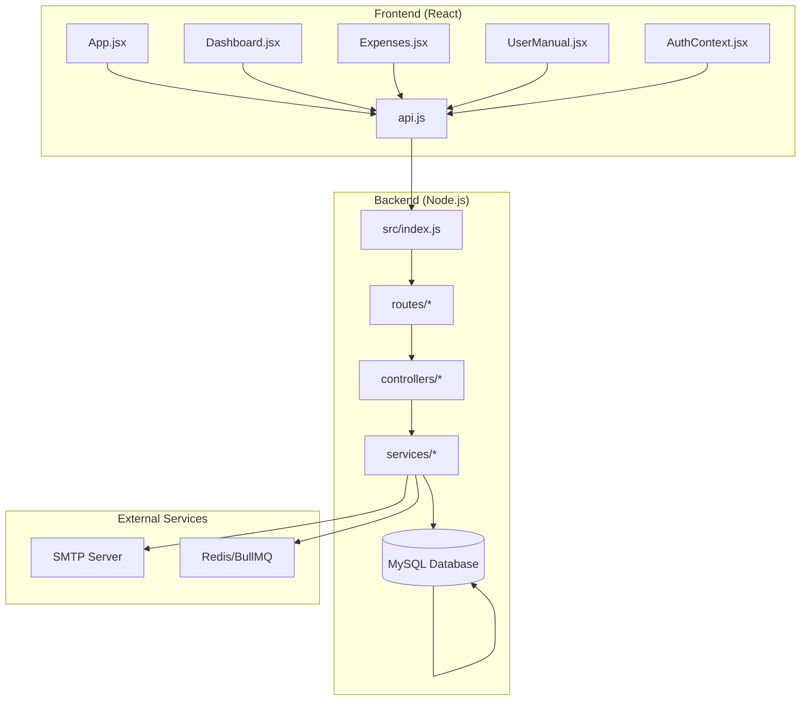
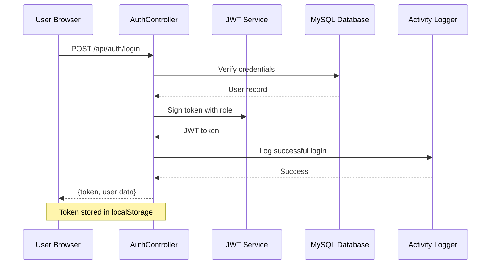
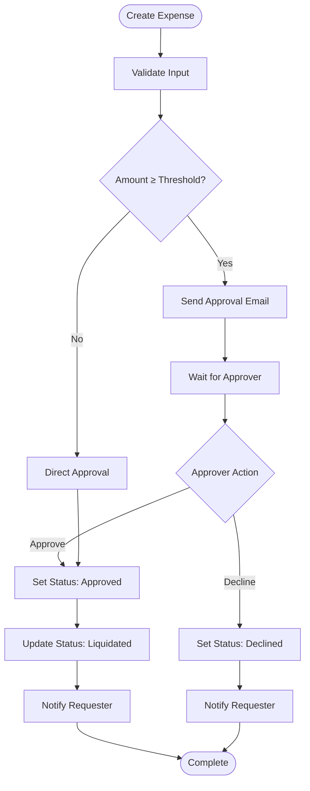
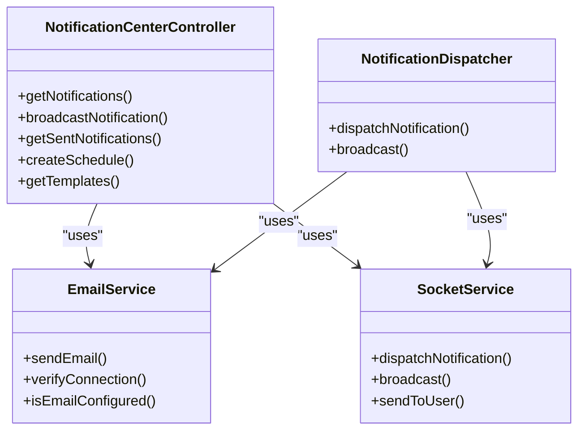
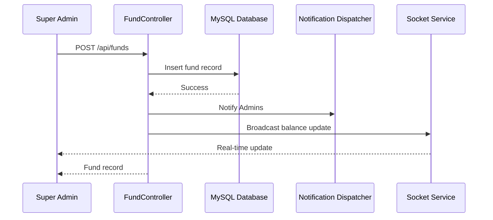
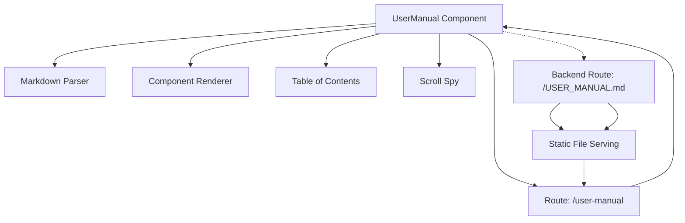
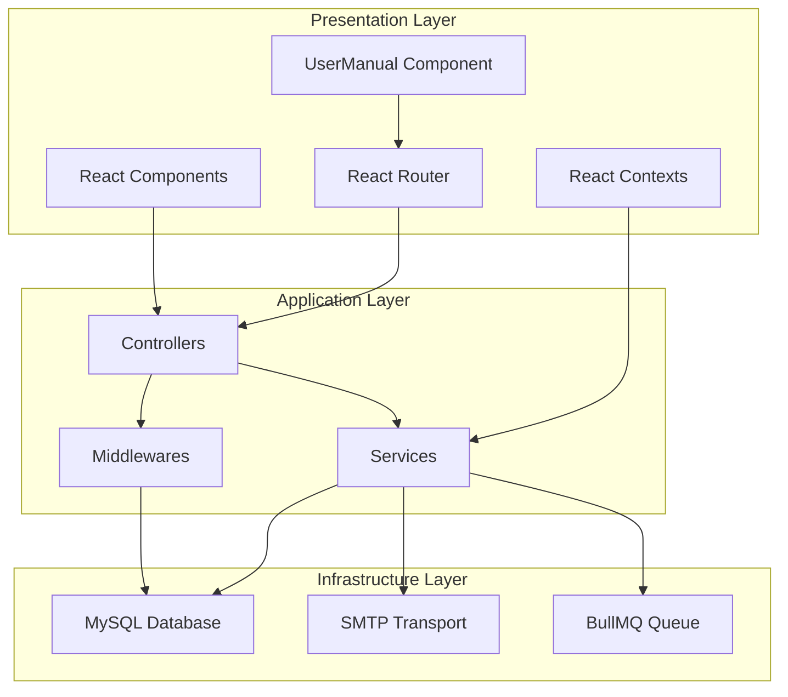

# User Manual

<cite>
**Referenced Files in This Document**
- [USER_MANUAL.md](file://USER_MANUAL.md)
- [README.md](file://README.md)
- [frontend/src/pages/UserManual.jsx](file://frontend/src/pages/UserManual.jsx)
- [frontend/src/App.jsx](file://frontend/src/App.jsx)
- [frontend/src/layouts/DashboardLayout.jsx](file://frontend/src/layouts/DashboardLayout.jsx)
- [backend/src/index.js](file://backend/src/index.js)
- [frontend/src/context/AuthContext.jsx](file://frontend/src/context/AuthContext.jsx)
- [frontend/src/services/api.js](file://frontend/src/services/api.js)
- [backend/src/controllers/authController.js](file://backend/src/controllers/authController.js)
- [backend/src/controllers/expenseController.js](file://backend/src/controllers/expenseController.js)
- [backend/src/controllers/fundController.js](file://backend/src/controllers/fundController.js)
- [backend/src/controllers/notificationCenterController.js](file://backend/src/controllers/notificationCenterController.js)
- [backend/src/controllers/approvalController.js](file://backend/src/controllers/approvalController.js)
- [backend/src/routes/auth.js](file://backend/src/routes/auth.js)
- [backend/src/routes/expenses.js](file://backend/src/routes/expenses.js)
- [backend/src/services/approvalService.js](file://backend/src/services/approvalService.js)
- [backend/src/services/emailService.js](file://backend/src/services/emailService.js)
</cite>

## Update Summary
**Changes Made**
- Added comprehensive User Manual system with dedicated frontend component (UserManual.jsx)
- Enhanced accessibility with dual navigation options (/user-manual and /USER_MANUAL.md)
- Improved markdown rendering capabilities with custom lightweight parser
- Updated Architecture Overview to include dedicated frontend component integration
- Enhanced troubleshooting guide with user manual component access troubleshooting
- Updated system requirements to include user manual component accessibility considerations

## Table of Contents
1. [Introduction](#introduction)
2. [System Requirements](#system-requirements)
3. [User Manual System Architecture](#user-manual-system-architecture)
4. [User Manual Component Implementation](#user-manual-component-implementation)
5. [Dual Navigation System](#dual-navigation-system)
6. [Markdown Rendering Engine](#markdown-rendering-engine)
7. [User Roles & Permissions](#user-roles--permissions)
8. [Logging In](#logging-in)
9. [Dashboard](#dashboard)
10. [Expense Monitoring](#expense-monitoring)
11. [Fund Management](#fund-management)
12. [Analytics](#analytics)
13. [Reports](#reports)
14. [Categories](#categories)
15. [Cost Centers (Departments)](#cost-centers-departments)
16. [User Management](#user-management)
17. [Notification Center](#notification-center)
18. [Audit Logs](#audit-logs)
19. [System Maintenance (Backup & Restore)](#system-maintenance-backup--restore)
20. [Queue Monitor](#queue-monitor)
21. [Settings](#settings)
22. [Profile & Password](#profile--password)
23. [Approval Action (Email-Based)](#approval-action-email-based)
24. [Glossary](#glossary)
25. [Architecture Overview](#architecture-overview)
26. [Detailed Component Analysis](#detailed-component-analysis)
27. [Dependency Analysis](#dependency-analysis)
28. [Performance Considerations](#performance-considerations)
29. [Troubleshooting Guide](#troubleshooting-guide)
30. [Conclusion](#conclusion)

## Introduction
The NKB Petty Cash Management System is an enterprise-grade web application designed for NKB Manufacturing to monitor, control, and audit petty cash expenditures in real time. It provides role-based access control, financial analytics, automated email approval workflows, and comprehensive audit logging — all in a single unified dashboard.

Key features include:
- Real-time expense tracking and voucher management
- Petty cash fund replenishment and balance monitoring
- Multi-dimensional financial analytics with interactive charts
- Excel and PDF export for reports
- Email-based approval workflow for high-value liquidations
- In-app notification system with broadcast, scheduling, and templates
- Full audit trail with user action tracking
- Database backup and disaster recovery
- Role-based access control (Super Admin, Accounting, Manager, Staff)
- **Comprehensive User Manual System** with dedicated frontend component and dual navigation accessibility

## System Requirements
- Browser: Chrome 90+, Firefox 88+, Edge 90+, Safari 14+
- Internet: Required (cloud-hosted)
- Screen: Minimum 1280×720 (optimized for 1366×768+)
- Mobile: Responsive (partial support for tablet/phone)
- **User Manual Accessibility**: Dual navigation system with dedicated frontend component and backend route for direct file serving
- **Component Dependencies**: React 18+, Framer Motion for animations, Lucide React for icons

## User Manual System Architecture
**Updated** Comprehensive User Manual system with dedicated frontend component and dual navigation accessibility

The system now features a sophisticated User Manual system that combines a dedicated frontend React component with traditional file-based access for maximum flexibility and accessibility.

### Frontend Component Architecture
The User Manual system consists of three main layers:

**Diagram sources**
- [frontend/src/pages/UserManual.jsx:176-367](file://frontend/src/pages/UserManual.jsx#L176-L367)
- [frontend/src/App.jsx:115](file://frontend/src/App.jsx#L115)
- [frontend/src/layouts/DashboardLayout.jsx:106](file://frontend/src/layouts/DashboardLayout.jsx#L106)

### Dual Navigation System Implementation
The User Manual system provides two distinct access methods:

#### Frontend Component Navigation
- **Route Path**: `/user-manual`
- **Component**: UserManual.jsx
- **Features**: Interactive table of contents, scroll spy, responsive design, mobile-friendly sidebar
- **Benefits**: Rich user experience with smooth animations and real-time navigation

#### Backend Route Navigation
- **Route Path**: `/USER_MANUAL.md`
- **Implementation**: Direct file serving from frontend distribution
- **Benefits**: Traditional markdown viewing, browser compatibility, direct file access

**Section sources**
- [frontend/src/pages/UserManual.jsx:176-367](file://frontend/src/pages/UserManual.jsx#L176-L367)
- [frontend/src/App.jsx:115](file://frontend/src/App.jsx#L115)
- [frontend/src/layouts/DashboardLayout.jsx:106](file://frontend/src/layouts/DashboardLayout.jsx#L106)

## User Manual Component Implementation
**Updated** Comprehensive User Manual component with advanced markdown parsing and interactive features

The UserManual.jsx component provides a sophisticated markdown rendering engine with interactive navigation and responsive design.

### Core Component Features
- **Lightweight Markdown Parser**: Custom parser supporting headers, tables, lists, blockquotes, and horizontal rules
- **Responsive Design**: Mobile-first approach with collapsible sidebar and overlay
- **Interactive Navigation**: Table of contents with active state tracking and smooth scrolling
- **Scroll Spy**: Automatic highlighting of active sections during navigation
- **Loading States**: Animated loading indicators and error handling
- **Accessibility**: Keyboard navigation, screen reader support, and semantic HTML

### Component Structure

**Diagram sources**
- [frontend/src/pages/UserManual.jsx:9-102](file://frontend/src/pages/UserManual.jsx#L9-L102)
- [frontend/src/pages/UserManual.jsx:119-171](file://frontend/src/pages/UserManual.jsx#L119-L171)

### Markdown Parsing Capabilities
The custom markdown parser supports the following syntax:

| Syntax | Supported | Description |
|--------|-----------|-------------|
| `# Header 1` | ✅ | H1 headers with automatic ID generation |
| `## Header 2` | ✅ | H2 headers with numbered section indicators |
| `### Header 3` | ✅ | H3 headers for subsections |
| `---` | ✅ | Horizontal rules for content separation |
| `> Quote` | ✅ | Blockquote formatting |
| `- List Item` | ✅ | Unordered lists |
| `| Table | Headers |` | ✅ | Markdown tables with styling |
| `**Bold Text**` | ✅ | Inline bold formatting |

**Section sources**
- [frontend/src/pages/UserManual.jsx:9-102](file://frontend/src/pages/UserManual.jsx#L9-L102)
- [frontend/src/pages/UserManual.jsx:105-113](file://frontend/src/pages/UserManual.jsx#L105-L113)

## Dual Navigation System
**Updated** Enhanced dual navigation system with frontend component and backend route integration

The User Manual system provides seamless access through two distinct navigation methods, each optimized for different use cases and user preferences.

### Frontend Component Navigation (`/user-manual`)
- **Integration**: Built into the main application routing system
- **Features**: 
  - Interactive sidebar with auto-collapse on desktop
  - Mobile-responsive design with overlay
  - Real-time scroll position tracking
  - Smooth scrolling to sections
  - Active section highlighting
- **User Experience**: Rich, animated interface with modern design patterns

### Backend Route Navigation (`/USER_MANUAL.md`)
- **Implementation**: Dedicated Express route for direct file serving
- **Features**:
  - Pure markdown rendering without JavaScript
  - Browser compatibility for all devices
  - Direct file access without SPA routing
  - Proper MIME type handling (text/markdown)
- **Use Cases**: Quick reference, offline access, browser compatibility

### Navigation Integration
Both navigation methods share the same underlying markdown content, ensuring consistency across access methods.

**Section sources**
- [frontend/src/App.jsx:115](file://frontend/src/App.jsx#L115)
- [frontend/src/layouts/DashboardLayout.jsx:106](file://frontend/src/layouts/DashboardLayout.jsx#L106)
- [backend/src/index.js:188-197](file://backend/src/index.js#L188-L197)

## Markdown Rendering Engine
**Updated** Advanced markdown rendering engine with custom lightweight parser and component-based rendering

The User Manual system features a sophisticated markdown rendering engine that converts raw markdown content into rich, interactive React components.

### Parser Architecture
The markdown parser operates in three stages:

1. **Line Processing**: Split content into individual lines and identify block types
2. **Block Assembly**: Group related lines into logical blocks (paragraphs, lists, tables)
3. **Component Generation**: Convert parsed blocks into React components with proper styling

### Inline Formatting Support
The system supports inline markdown formatting through the `renderInline` function:

**Diagram sources**
- [frontend/src/pages/UserManual.jsx:105-113](file://frontend/src/pages/UserManual.jsx#L105-L113)

### Component Library
The rendering engine uses specialized components for different markdown elements:

| Markdown Element | React Component | Styling Features |
|------------------|----------------|------------------|
| Headers (H1-H3) | SectionHeading | Automatic numbering, scroll margins, responsive typography |
| Tables | MdTable | Responsive overflow, striped rows, hover effects |
| Lists | MdList | Custom bullet styles, spacing, color theming |
| Blockquotes | MdBlockquote | Left border accent, italic styling, background tint |
| Paragraphs | Standard P | Leading spacing, text color, responsive sizing |

### Responsive Design Integration
All components are built with responsive design principles:

- **Mobile-First**: Base styles optimized for small screens
- **Adaptive Layouts**: Components adjust to different screen sizes
- **Touch-Friendly**: Interactive elements sized for touch interaction
- **Performance**: Optimized rendering with minimal DOM manipulation

**Section sources**
- [frontend/src/pages/UserManual.jsx:119-171](file://frontend/src/pages/UserManual.jsx#L119-L171)
- [frontend/src/pages/UserManual.jsx:317-357](file://frontend/src/pages/UserManual.jsx#L317-L357)

## User Roles & Permissions
The system enforces Role-Based Access Control (RBAC) with four distinct tiers:

| Feature / Page | Super Admin | Accounting | Manager | Staff |
|---|:---:|:---:|:---:|:---:|
| Dashboard | ✅ | ✅ | ✅ | ✅ |
| Expenses (View/Add) | ✅ | ✅ | ✅ | ✅ |
| Expenses (Approve/Reject) | ✅ | ✅ | ✅ | ❌ |
| Expenses (Liquidate) | ✅ | ✅ | ❌ | ❌ |
| Expenses (Delete) | ✅ | ❌ | ❌ | ❌ |
| Funds | ✅ | ❌ | ❌ | ❌ |
| Analytics | ✅ | ✅ | ✅ | ✅ |
| Reports | ✅ | ✅ | ✅ | ✅ |
| Categories | ✅ | ✅ | ✅ | ✅ |
| Cost Centers | ✅ | ✅ | ❌ | ❌ |
| Users | ✅ | ❌ | ❌ | ❌ |
| Notification Center (Admin) | ✅ | ✅ | ❌ | ❌ |
| Audit Logs | ✅ | ❌ | ❌ | ❌ |
| Maintenance | ✅ | ❌ | ❌ | ❌ |
| Queue Monitor | ✅ | ❌ | ❌ | ❌ |
| Settings | ✅ | ❌ | ❌ | ❌ |
| Profile | ✅ | ✅ | ✅ | ✅ |
| **User Manual** | ✅ | ✅ | ✅ | ✅ |

## Logging In
### How to Access
1. Open your browser and navigate to the NKB Petty Cash URL.
2. You will be presented with the Enterprise Access login screen.

### Login Fields
- Authorized ID: Your assigned employee username (e.g., jsantos)
- Security Credential: Your confidential password

### Buttons & Controls
- Eye / Eye-Off icon (inside password field): Toggles password visibility on/off
- Authenticate Access: Submits your credentials and logs you into the system. Shows a spinner while processing. If credentials are invalid, a red error banner appears.

### Login Failure
- If your credentials are incorrect, a red alert banner displays: "Access Denied. Please verify your corporate credentials."
- Contact your Super Admin for account provisioning or password resets.

## Dashboard
The Executive Dashboard is the landing page after login. It provides a high-level financial overview of the petty cash system.

### Stat Cards (Top Row)
- Total Expenses: Aggregate sum of all recorded expenses (₱). Shows a percentage trend vs. last month.
- Today's Spend: Total amount of expenses recorded for the current day.
- Pending Approval: Count of expense vouchers currently in "Pending" status awaiting action.
- Available Fund: Current system petty cash balance (Total Inflow minus Total Expenditures).

### Charts
- Expenses Trend (Area Chart): Displays daily expenditure totals over time. Hover over data points for exact amounts.
- Category Allocation (Donut Chart): Shows distribution of expenses across categories. The center displays the total amount.

### Chart Actions
- Download icon (on each chart): Exports the chart as a high-resolution PNG image file.

### Latest Voucher Feed (Table)
Displays the most recent expense entries with the following columns:
- Requester: Name and department of the person who filed the expense
- Category: Expense classification
- Date: Date the voucher was filed
- Amount: Voucher amount in ₱
- Status: Current status: Pending (amber), Approved (green), Rejected (red)

### Quick Actions Panel
- New Expense: Navigates to the Expenses page to create a new voucher
- Audit Reports: Navigates to the Reports page
- Manage Personnel: Navigates to the Users page (Super Admin only)

### Department Expenditure
Displays a progress bar for each department showing their proportion of total expenses.

### Top Header Button
- Generate Reports: Navigates to the Reports page

## Expense Monitoring
The Expense Monitoring page is the core operational area for managing petty cash vouchers (PCVs).

### Page Header Buttons
- Export Excel (spreadsheet icon): Downloads all expenses as an .xlsx file
- Export PDF (PDF icon): Generates a PDF report of the currently displayed expenses
- New Expense: Opens the "New Expenditure Request" modal form

### Filter Panel
- Search PCV, remarks...: Text search that filters expenses by PCV reference number or remarks (with 400ms debounce)
- All Categories (dropdown): Filters the list by a specific expense category
- Status (dropdown): Filters by status: Pending, Approved, Rejected, Liquidated, For Approval, Declined
- Date Range (Start / End): Filters expenses within a specific date range
- Reset Filters (clock icon): Clears all active filters and returns to the default view

### Expense Table Columns
- Date: Voucher date, plus reference number (e.g., PCV-0001)
- Requester Details: Name and department of the requester
- Category & Items: Category badge and remarks text
- Qty / Unit: Quantity purchased and unit of measure (e.g., 5 Box)
- Amount: Total voucher amount in ₱
- Status: Current status badge
- Actions: Action buttons (varies by role and status)

### Action Buttons (per row)
- Approve (checkmark, green): Super Admin / Manager / Accounting, when status is Pending. Changes expense status to "Approved".
- Reject (X icon, red): Super Admin / Manager / Accounting, when status is Pending. Changes expense status to "Rejected".
- Liquidate (history icon, blue): Super Admin / Accounting, when status is Approved. Changes expense status to "Liquidated". If amount exceeds approval threshold, triggers email approval workflow instead.
- View (eye icon): All users. Opens the Voucher Details modal showing full info, attachments, and audit trail.
- Edit (pencil icon): All users. Opens the Edit Expense Record modal to modify voucher details.
- Delete (trash icon, red): Super Admin only. Permanently deletes the expense with a confirmation prompt.

### New Expenditure Request Modal
- Voucher Date: Date of the expense (Required)
- Expense Category: Select from existing categories (Required)
- Requester Full Name: Full name of the person who incurred the expense (Required)
- Cost Center (Dept): Department to charge (Required)
- Quantity: Number of items (Required, default: 1)
- Unit of Measure: Select from list (Box, Ream, Piece, etc.) or add a new one (Required)
- Add Unit (text field + button): Type a new unit name and press "Add Unit" or Enter to add it to the list (Optional)
- Total Amount (PHP): Expense amount in Philippine Peso (Required)
- Status: Choose "Pending Verification" or "Direct Approval" (Required, default: Pending)
- Detailed Remarks: Description or justification of the expense (Optional)
- Discard Change: Closes the modal without saving
- Commit Voucher: Submits the expense to the database

> Note: If the amount exceeds the configured approval threshold, the system automatically sets the status to "For Approval" and sends an email to the designated approver.

### View Voucher Details Modal
- Requester: Name of the requester
- Amount: Voucher amount
- Remarks / Justification: Detailed description
- Attachments: Downloadable file links (if any were uploaded)
- Approval Audit Trail: Chronological log of approval actions, including actor name, timestamp, IP address, and decline reasons
- Close Preview: Closes the modal

### Edit Expense Record Modal
- Voucher Date: Editable
- Category: Editable
- Requester: Editable
- Amount: Editable
- Remarks: Editable

Buttons:
- Cancel: Discards changes and closes the modal
- Save Changes: Submits the edited data

### Pagination
- Previous (left arrow): Goes to the previous page
- Page Numbers: Jumps to a specific page
- Next (right arrow): Goes to the next page
- Record counter: Shows "Showing X - Y of Z Expense Records"

## Fund Management
> Access: Super Admin only

The Fund Management page tracks petty cash replenishments and overall fund liquidity.

### Balance Overview Cards
- Available Liquidity (green gradient): Current available petty cash balance = Total Inflow - Total Expenditures. Verified by the system.
- Total Cash Inflow: Sum of all fund replenishments
- Total Expenditures: Sum of all approved and liquidated expenses

### Replenishment History Table
- Date: Date the replenishment was recorded
- Reference No.: Check number or OR number for tracking
- Remarks: Description of the replenishment
- Amount: Amount added to the fund (in green)
- Added By: Name of the user who recorded the replenishment
- Delete (trash icon): Deletes the fund entry (with confirmation). Reduces total cash inflow.

### Replenish Fund Modal
- Amount to Add (PHP): Replenishment amount (Required)
- Reference No.: Check # or OR # for audit trail (Optional)
- Voucher Date: Date of the replenishment (Required)
- Discard: Closes modal without saving
- Confirm Deposit: Records the fund replenishment

### Page Header Button
- Replenish Fund: Opens the Replenish Fund modal

## Analytics
The Financial Intelligence page provides multi-dimensional analysis of petty cash expenditures.

### View Mode Toggle
- Active Analysis: Shows current/active period data
- Historical Archive: Shows historical data for trend comparison

### Charts
- Daily Expenditure Breakdown (Stacked Bar): Shows daily spending broken down by category. Each color represents a different expense category stacked on top of each other.
- Category Intensity (Bar Chart): Shows spending for a selected category over time. Use the dropdown to focus on a specific category or view all.
- Allocation Matrix (Donut Chart): Shows the relative spending distribution across departments.

### Chart Actions
- Export Graph (on Date Range chart): Downloads the stacked bar chart as a PNG image
- Download icon (on Category chart): Downloads the category bar chart as a PNG image
- Category Dropdown: Filters the Category Intensity chart to a specific category

### Summary Cards (Bottom)
- Avg Daily Burn: Average daily expenditure amount
- Top Category: The category with the highest total spending
- Active Depts: Number of departments with recorded expenses
- Vouchers Issue: Count of recent vouchers

## Reports
The Audit & Reporting page generates enterprise-grade financial statements.

### Export Buttons
- Export Visual PDF: Captures the current report view as a PDF using html2canvas and jsPDF
- Generate Excel Ledger: Downloads a detailed .xlsx report with all expense data for the selected period

### Reporting Parameters (Filter Panel)
- Start Period: Beginning date for the report range
- End Period: Ending date for the report range
- Focus Category: Filter report to a specific category (or "All Categories")
- Department Scope: Filter report to a specific department (or "Entire Enterprise")

> Filters update the report charts and summary automatically in real time.

### Summary Matrix Cards
- Aggregate Spend (blue left border): Total approved expenditure for the selected period
- Transaction Volume (indigo left border): Total count of vouchers within the selected period
- Quick Audit Insights: Top 3 categories by spending with a "Full Forensic Breakdown" link that exports to Excel

### Visual Analytics
- Category Distribution (Bar Chart): Bar chart showing total spending per category
- Department Allocation (Donut Chart): Donut chart showing spending proportion per department

### Info Banner
- View Analytics Detail: Navigates to the Analytics page for deeper analysis

## Categories
The Financial Classifications page manages expense categories used across the system.

### Page Header Button
- New Category: Opens the "New Classification" modal

### Category Cards
Each category is displayed as a card with:
- Tag Icon: Visual identifier
- Category Name: Uppercase name of the category
- Description: Business context of the category
- Active Status: Green dot indicating the category is active
- Created Date: When the category was created
- Edit (pencil icon): Opens the edit modal to update name and description
- Delete (trash icon): Deletes the category after confirmation

### Category Modal (Add / Edit)
- Category Name: Name of the expense category (e.g., "OFFICE SUPPLIES") (Required)
- Business Context: Description of the category's scope (Optional)
- Cancel: Closes the modal without saving
- Commit Changes: Creates or updates the category

## Cost Centers (Departments)
> Access: Super Admin and Accounting

The Cost Centers page manages NKB departments used in the expense entry's "Cost Center" dropdown.

### Page Header Button
- Add Cost Center: Opens the "New Cost Center" modal

### Department Cards
- Building Icon: Visual identifier
- Department Name: Uppercase name (e.g., "PRODUCTION")
- Created Date: When the department was created
- Edit (pencil icon): Opens the edit modal
- Delete (trash icon): Deletes the department after confirmation

### Cost Center Modal
- Department Name: Name of the department (Required)
- Cancel: Closes modal without saving
- Save: Creates or updates the department

## User Management
> Access: Super Admin only
> Also accessible from Settings > Users tab.

The Access Governance page manages system user accounts and permissions.

### Page Header Button
- Provision User: Opens the "Access Provisioning" modal to create a new user

### User Cards
Each user is displayed as a card with:
- Avatar: Initials of the user with role-based color coding (rose for Super Admin, blue for others)
- Full Name: User's full name
- Role Badge: Current access tier
- Username: Login ID (prefixed with @)
- Department: Assigned department
- Email: Contact email address
- Active Credentials: Status indicator
- Edit (pencil icon): Opens the "Manage Security Profile" modal
- Edit Policy (text link): Same as edit icon
- Delete (trash icon): Deletes the user after confirmation

### Access Provisioning Modal (Add / Edit User)
- Account ID: Username for login (Required)
- Access Tier: Role: SUPER ADMIN, ACCOUNTING, MANAGER, or STAFF (Required)
- Legal Full Name: Full name of the user (Required)
- Department: Assigned department dropdown (Optional)
- Email Address: User's email for notifications (Optional)
- Initial Authorization Key: Password (only shown when creating a new user) (Required for new users)
- Discard: Closes modal without saving
- Authorize Access: Creates or updates the user account

## Notification Center
> Full admin features: Super Admin and Accounting
> View-only features: All users

The Notification Center is an enterprise communication hub with real-time alerts, broadcasting, scheduling, and templates.

### Header Buttons (Admin Only)
- Broadcast Alert: Opens the "Send Broadcast Alert" modal to send an immediate notification
- Schedule Alert: Opens the "Automated Cron Setup" modal to schedule a future notification

### Tabs
- Inbox Feed: All. Shows all active/unread notifications
- Important Alerts: All. Shows important and critical priority alerts
- Archived Messages: All. Shows archived/dismissed notifications
- Sent History & Analytics: Admin. Shows broadcast history with per-recipient read/acknowledge tracking
- Automated Schedules: Admin. Shows cron-scheduled notifications
- Notification Templates: Admin. Shows reusable notification presets

### Inbox / Important / Archived — Notification Card Actions
- View Task (if task link exists): Opens the associated task URL
- Acknowledge Alert (critical only): Mutes the critical alarm and marks as acknowledged
- Mark Read: Marks the notification as read
- Archive (archive icon): Moves the notification to the archive
- Restore (refresh icon, in Archived tab): Restores an archived notification

### Search & Filters (Inbox/Important/Archived)
- Search messages: Text search by title or message content
- All Priorities (dropdown): Filter by Normal, Important, or Critical priority
- All Categories (dropdown): Filter by General, Administrative Approval, Treasury & Financials, or System Alert

### Broadcast Alert Modal (Admin)
- Priority Urgency: Normal, Important (sound once), or Critical (continuous alarm) (Required)
- Secure Category: General, Administrative Approval, Treasury & Financials, or Critical Alerts (Required)
- Recipients Scope: Broadcast to All Users, Specific Departments, or Target Specific Staff (Required)
- Department Selection: Toggle buttons for each department (shown when "Specific Departments" is selected) (Conditional)
- Staff Selection: Checkable list of users (shown when "Target Specific Staff" is selected) (Conditional)
- Alert Title: Headline for the notification (Required)
- Detail Alert Message Body: Full message content (Required)
- Attach Task Link: Optional internal URL (e.g., /expenses) (Optional)
- Attachment Media URL: Optional public HTTPS link (Optional)
- Cancel: Closes modal without sending
- Transmit Alert Live: Sends the notification immediately to selected recipients

### Automated Cron Setup Modal (Admin)
- Trigger Execution Date & Time: When the schedule should first execute (Required)
- Recurrence Frequency: Once, Daily, Weekly, or Monthly (Required)
- Template Presets: Optional pre-population from a saved template (Optional)
- Recipients Scope: All Users or Specific Departments (Required)
- Reminder Title: Headline for the scheduled notification (Required)
- Detail Alert Message Body: Message content (Required)
- Cancel: Closes modal without saving
- Deploy Schedule Config: Creates the scheduled notification

### Sent History & Analytics (Admin)
- Broadcast Card: Shows title, priority badge, message preview, sender, and timestamp. Click to select.
- Targets Count: Number of recipients the broadcast was sent to
- Read Rate Progress Bar: Percentage of recipients who have read the notification
- Read / Acknowledge Count: Number of users who read or acknowledged
- Recipient Status Log: Per-user list showing status (Dispatched, Delivered, Read, Acknowledged) with timestamps
- Delete Schedule (trash icon): Deletes a scheduled notification after confirmation

### Notification Templates (Admin)
- Template Card: Shows type badge, name, subject, and body preview
- Edit (zap icon): Opens the template in edit mode
- Delete (trash icon): Permanently removes the template
- Load Template: Pre-fills the Broadcast form with the template's content
- Create Template (button): Opens the template builder modal

### Template Builder Modal
- Reference Template Name: Internal name for the template (e.g., Weekly_Audit_Notice) (Required)
- Classification Category: General Announcement, Administrative Approval, Treasury & Financials, or Critical Warnings (Required)
- Default Subject Line: Default title text for notifications using this template (Required)
- Default Message Body: Default message content (Required)
- Cancel: Closes modal without saving
- Save Preset Template: Creates or updates the template

### Notification Bell (Header Dropdown)
- Bell Icon: Opens the notification dropdown. Shows unread count badge. Pulses red for critical alerts.
- Mark all read: Marks all notifications as read
- Click notification: Marks individual notification as read
- View All Activity: Closes dropdown and navigates to the full Notification Center page

## Audit Logs
> Access: Super Admin only

The System Audit Trail page provides forensic activity tracking.

### Header Info
- Total Events: Count of all logged events

### Search & Filter
- Search actions, users, or details: Full-text search across action, details, and user name fields
- Range (calendar button): Date range filter (UI placeholder)
- Filters (filter button): Additional filter options (UI placeholder)

### Log Table Columns
- Timestamp: Date and time of the action
- User: Full name and username of the actor
- Action: Type of action, color-coded: LOGIN (blue), CREATE (green), UPDATE/APPROVE (amber), DELETE/REJECT (red)
- Details: Description of what was done
- IP Address: Network IP address of the user at the time of action

## System Maintenance (Backup & Restore)
> Access: Super Admin only

The System Maintenance page manages data backups and disaster recovery.

### Export System Data Card
- Download .xlsx Backup: Generates and downloads a comprehensive Excel backup file containing all system records, users, and settings

### Restore from Backup Card
- Select Backup File: File upload area that accepts .xlsx files only
- Initiate Restoration: Opens a confirmation modal before proceeding

### Confirmation Modal
- Cancel: Aborts the restoration
- Yes, Restore Data: Overwrites the current database with the backup file data. This is destructive — all current data will be replaced.

### Critical Protocol Warning
A warning banner reminds users that restoration is a destructive action and to always export a current backup before proceeding.

## Queue Monitor
> Access: Super Admin only

The Queue Health Monitor shows the real-time status of background processes and notification workers.

### Stat Cards
- Active Jobs: Number of jobs currently being processed
- Waiting: Number of jobs queued for execution
- Completed: Number of successfully delivered jobs
- Failed: Number of jobs that failed and are awaiting manual retry

### Header Badges
- Redis (BullMQ) Online: Indicates the queue system is operational

### Header Button
- Retry All Failed: Retries all failed jobs in the queue

### Advanced Queue Management
- Open Technical Dashboard: Opens the Bull Board interface (at /admin/queues) in a new tab for granular job control, real-time progress monitoring, and detailed failure analysis

## Settings
> Access: Super Admin only

The System Configuration page provides global preferences and administrative settings, organized into tabs.

### Tab Navigation
- General: Enterprise identity and system parameters
- Users: Embedded user management (same as User Management page)
- Master Data: Units of measure management
- Approval: Liquidation approval workflow settings
- Notifications: Email and in-app notification channel toggles
- Appearance: Theme settings (currently locked to white)
- Security: Password change form
- System: Database diagnostics and transaction data wipe

### General Tab
- Company Name: Organization name displayed in the system
- System Currency: Currency code (default: PHP)
- Petty Cash Reservoir Limit: Maximum petty cash fund limit
- Master Administrator Email: Primary admin contact email
- Save Changes: Persists general settings to the database

### Master Data Tab — Units of Measure
- New unit input: Type a new unit name (e.g., "Sack")
- Add: Adds the new unit to the list
- Unit chip × (close): Removes a unit from the list
- Save Units: Persists the updated unit list to the database

### Approval Tab (Approval Settings Panel)
- Liquidation Approval Threshold (₱): Amount at or above which expenses require email approval before liquidation
- Primary Approver Email: Email address of the primary approver who receives approve/decline links
- Enable Email Approval (toggle): Toggles the email approval workflow on/off
- Save Approval Settings: Saves the approval configuration

Additional Approvers (Multi-Level):
- Approver email: Email of the additional approver
- Name: Display name of the approver
- Level: Approval level number (Level 1 = primary)
- Add: Adds the additional approver
- Delete (trash icon): Removes an additional approver

### Notifications Tab
- Email Notifications: When enabled, sends reports and approval alerts via email
- In-App Notifications: When enabled, shows real-time alerts in the dashboard header
- Save Changes: Saves notification preferences

> Note: Critical system alerts (security breaches, password resets) are always sent via email regardless of preferences.

### Appearance Tab
Displays that the system is currently locked to the High-Contrast White theme. Dynamic mode is disabled by policy.

### Security Tab

## Profile & Password
> Access: All users

The Profile page allows users to view and update their personal information and change their password.

### Profile Information
- Full Name: User's legal name
- Username: Login ID
- Email: Contact email address
- Role: Current access tier
- Department: Assigned department

### Password Change Form
- Current Password: Enter current password for verification
- New Password: Enter new password (minimum 8 characters)
- Confirm New Password: Re-enter new password
- Update Password: Submits the password change request

## Approval Action (Email-Based)
> Access: Authorized approvers via email links

The email-based approval workflow handles high-value liquidations that exceed the configured threshold.

### Approval Process
1. When an expense amount exceeds the approval threshold, the system sets status to "For Approval"
2. An email is sent to the designated approver(s) with approve/decline links
3. Approver clicks approve link to approve the liquidation
4. If multi-level approval is configured, the system advances to the next approver
5. Upon final approval, the expense status becomes "Liquidated"

### Email Links
- Approve Link: https://yourdomain.com/approval/approve/{token}
- Decline Link: https://yourdomain.com/approval/decline/{token}

### Token Expiration
Approval tokens expire after 7 days. After expiration, the system requires re-initiation of the approval workflow.

## Glossary
- PCV: Petty Cash Voucher
- PHP: Philippine Peso
- RBAC: Role-Based Access Control
- SMTP: Simple Mail Transfer Protocol
- JWT: JSON Web Token
- API: Application Programming Interface

## Architecture Overview
The NKB Petty Cash system follows a modern full-stack architecture with clear separation of concerns:

**Diagram sources**
- [backend/src/index.js:160-178](file://backend/src/index.js#L160-L178)
- [frontend/src/App.jsx:56-118](file://frontend/src/App.jsx#L56-L118)
- [frontend/src/pages/UserManual.jsx:176-367](file://frontend/src/pages/UserManual.jsx#L176-L367)

**Section sources**
- [backend/src/index.js:188-197](file://backend/src/index.js#L188-L197)

## Detailed Component Analysis

### Authentication System
The authentication system implements JWT-based security with role-based access control:

**Diagram sources**
- [backend/src/controllers/authController.js:6-52](file://backend/src/controllers/authController.js#L6-L52)
- [frontend/src/context/AuthContext.jsx:32-44](file://frontend/src/context/AuthContext.jsx#L32-L44)

**Section sources**
- [backend/src/controllers/authController.js:1-66](file://backend/src/controllers/authController.js#L1-L66)
- [frontend/src/context/AuthContext.jsx:1-54](file://frontend/src/context/AuthContext.jsx#L1-L54)
- [frontend/src/services/api.js:1-29](file://frontend/src/services/api.js#L1-L29)

### Expense Management Workflow
The expense management system handles CRUD operations with approval workflows:

**Diagram sources**
- [backend/src/controllers/expenseController.js:105-211](file://backend/src/controllers/expenseController.js#L105-L211)
- [backend/src/services/approvalService.js:292-327](file://backend/src/services/approvalService.js#L292-L327)

**Section sources**
- [backend/src/controllers/expenseController.js:1-358](file://backend/src/controllers/expenseController.js#L1-L358)
- [backend/src/services/approvalService.js:1-590](file://backend/src/services/approvalService.js#L1-L590)

### Notification System
The notification system supports both in-app and email notifications:

**Diagram sources**
- [backend/src/controllers/notificationCenterController.js:1-370](file://backend/src/controllers/notificationCenterController.js#L1-L370)
- [backend/src/services/emailService.js:1-122](file://backend/src/services/emailService.js#L1-L122)

**Section sources**
- [backend/src/controllers/notificationCenterController.js:1-370](file://backend/src/controllers/notificationCenterController.js#L1-L370)
- [backend/src/services/emailService.js:1-122](file://backend/src/services/emailService.js#L1-L122)

### Fund Management System
The fund management system tracks petty cash replenishments:

**Diagram sources**
- [backend/src/controllers/fundController.js:17-56](file://backend/src/controllers/fundController.js#L17-L56)

**Section sources**
- [backend/src/controllers/fundController.js:1-108](file://backend/src/controllers/fundController.js#L1-L108)

### User Manual System Integration
The User Manual system integrates seamlessly with the main application architecture:

**Diagram sources**
- [frontend/src/pages/UserManual.jsx:176-367](file://frontend/src/pages/UserManual.jsx#L176-L367)
- [frontend/src/App.jsx:115](file://frontend/src/App.jsx#L115)
- [backend/src/index.js:188-197](file://backend/src/index.js#L188-L197)

**Section sources**
- [frontend/src/pages/UserManual.jsx:176-367](file://frontend/src/pages/UserManual.jsx#L176-L367)
- [frontend/src/App.jsx:115](file://frontend/src/App.jsx#L115)
- [backend/src/index.js:188-197](file://backend/src/index.js#L188-L197)

## Dependency Analysis
The system follows a layered architecture with clear dependency boundaries:

**Diagram sources**
- [backend/src/index.js:160-178](file://backend/src/index.js#L160-L178)
- [frontend/src/App.jsx:56-118](file://frontend/src/App.jsx#L56-L118)
- [frontend/src/pages/UserManual.jsx:1-368](file://frontend/src/pages/UserManual.jsx#L1-L368)

**Section sources**
- [backend/src/index.js:1-240](file://backend/src/index.js#L1-L240)
- [frontend/src/App.jsx:1-127](file://frontend/src/App.jsx#L1-L127)
- [frontend/src/pages/UserManual.jsx:1-368](file://frontend/src/pages/UserManual.jsx#L1-L368)

## Performance Considerations
- Database optimization: Proper indexing on frequently queried columns (date, status, category_id)
- Caching: Frontend caching for static assets and API responses
- Background processing: Asynchronous email and notification processing via BullMQ
- Pagination: Server-side pagination for large datasets
- Real-time updates: WebSocket connections for instant UI updates
- Asset optimization: CDN delivery for static resources
- **User Manual Optimization**: Dedicated route prevents unnecessary SPA routing and improves manual access performance
- **Component Optimization**: Memoization and efficient rendering in UserManual component
- **Memory Management**: Proper cleanup of IntersectionObserver instances and event listeners

## Troubleshooting Guide
Common issues and solutions:

### Login Issues
- Invalid credentials: Verify username/password combination
- Account disabled: Contact Super Admin for account activation
- Session timeout: Re-login to refresh token

### Expense Approval Problems
- Approval emails not received: Check SMTP configuration in environment variables
- Approval links expired: Generate new approval workflow
- Multi-level approval stuck: Verify approver configurations

### Notification Delivery Issues
- Email notifications failing: Verify SMTP credentials and network connectivity
- In-app notifications not appearing: Check browser WebSocket connections
- Scheduled notifications not sent: Review queue worker status

### Database Connectivity
- Migration failures: Check database connection parameters
- Schema inconsistencies: Run database repair procedures
- Backup/restore issues: Verify file permissions and disk space

### User Manual Access Issues
- **Manual not loading**: Verify user manual file exists in frontend distribution
- **MIME type errors**: Check dedicated backend route implementation
- **SPA routing conflicts**: Ensure manual route is defined before general catch-all route
- **404 errors**: Confirm user manual is included in build process and deployed correctly
- **Component rendering issues**: Check React component dependencies and browser compatibility
- **Mobile navigation problems**: Verify responsive design breakpoints and touch interactions
- **Performance issues**: Monitor component rendering and memory usage

### Component-Specific Issues
- **Markdown parsing errors**: Validate markdown syntax and parser compatibility
- **Table of contents not updating**: Check scroll spy implementation and intersection observer
- **Sidebar not collapsing**: Verify CSS classes and responsive breakpoint logic
- **Animation performance**: Optimize Framer Motion animations and component updates

**Section sources**
- [backend/src/services/emailService.js:42-50](file://backend/src/services/emailService.js#L42-L50)
- [backend/src/services/approvalService.js:252-290](file://backend/src/services/approvalService.js#L252-L290)
- [backend/src/index.js:188-197](file://backend/src/index.js#L188-L197)
- [frontend/src/pages/UserManual.jsx:176-367](file://frontend/src/pages/UserManual.jsx#L176-L367)

## Conclusion
The NKB Petty Cash Management System provides a comprehensive solution for petty cash management with enterprise-grade features including real-time monitoring, automated approvals, comprehensive reporting, and robust audit capabilities. The system's modular architecture ensures maintainability and scalability while the intuitive user interface makes it accessible to all organizational levels.

Key benefits include:
- Real-time visibility into petty cash operations
- Streamlined approval workflows reducing manual overhead
- Comprehensive audit trails for compliance
- Flexible notification system for stakeholder communication
- Disaster recovery capabilities through automated backups
- **Enhanced user manual accessibility** with dedicated frontend component and dual navigation system
- **Advanced markdown rendering** with custom parser and responsive design
- **Seamless integration** between traditional file access and modern component-based interfaces

The system is designed for easy deployment and maintenance, with clear separation of concerns and extensive documentation to support ongoing operations and future enhancements. The comprehensive User Manual system ensures users have multiple pathways to access documentation, accommodating diverse user preferences and technical requirements while maintaining consistency and reliability across all access methods.