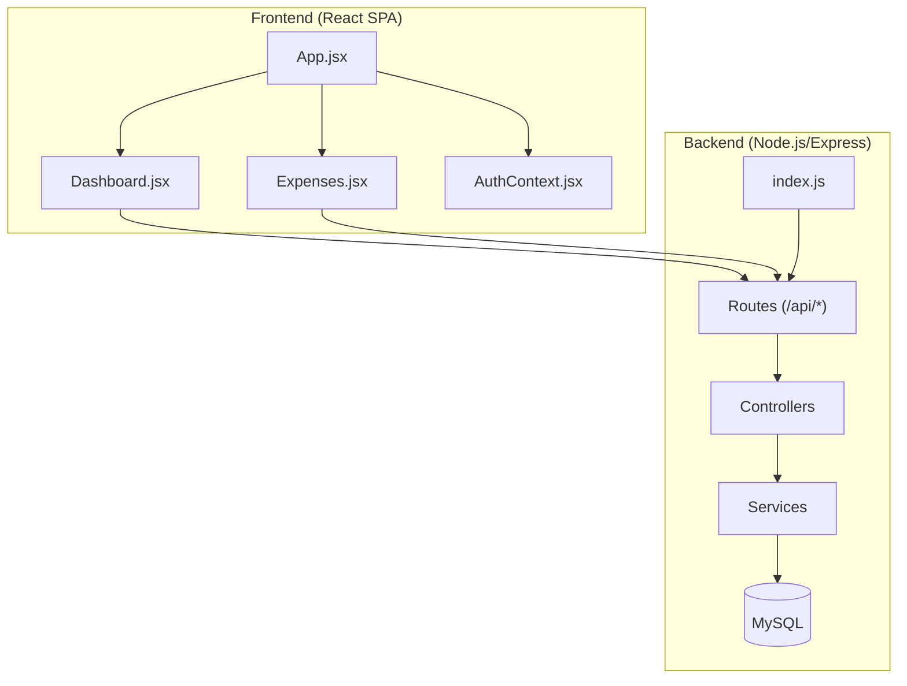
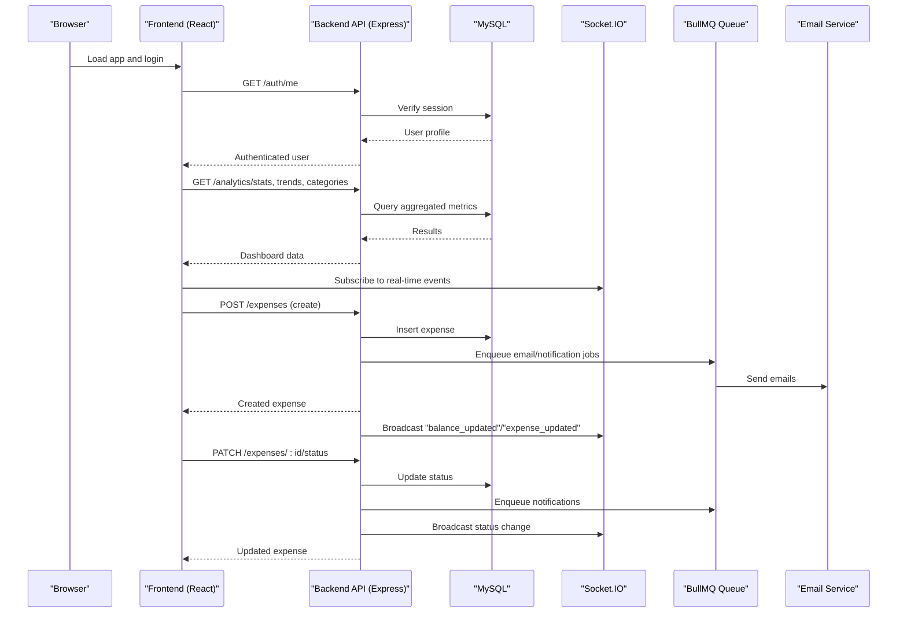
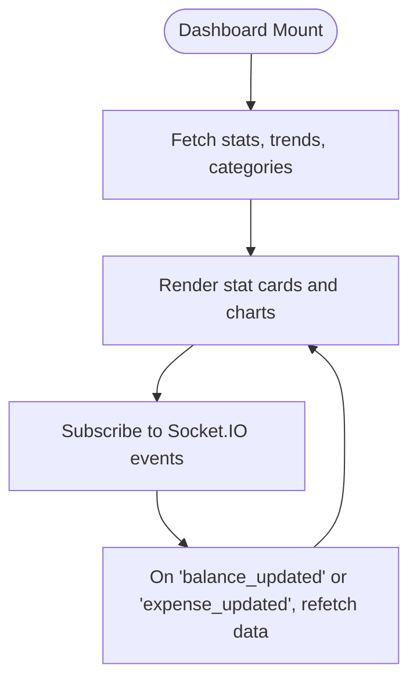
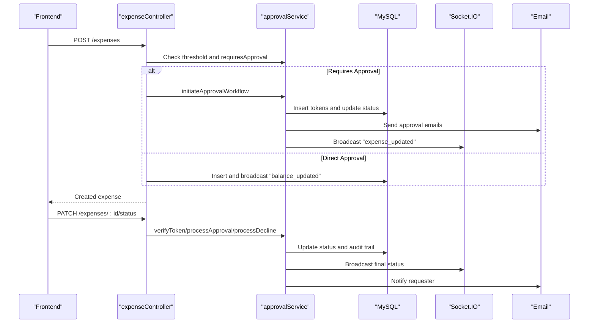
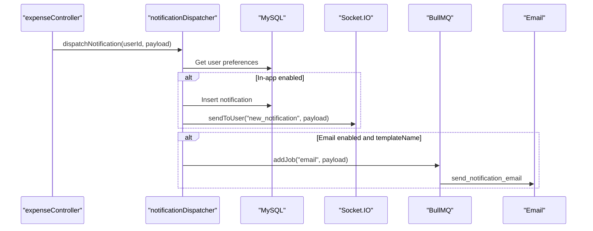
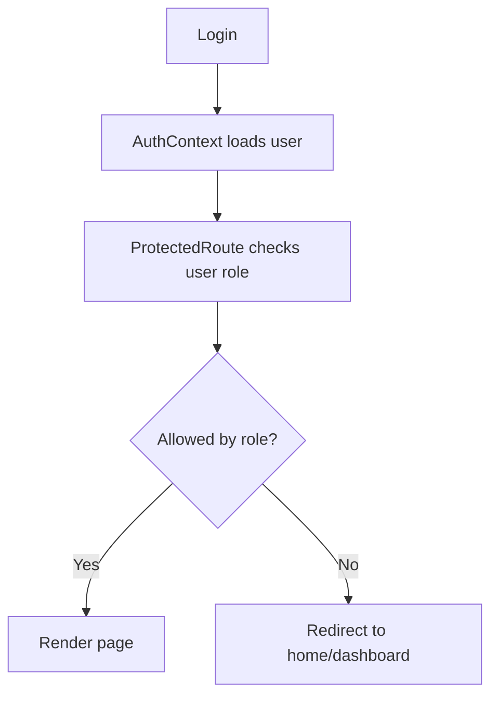
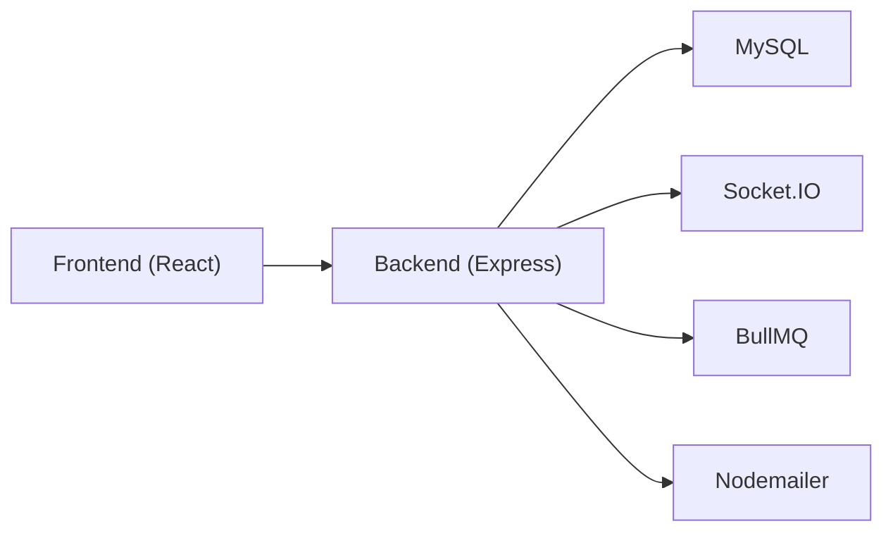

# Project Overview

<cite>
**Referenced Files in This Document**
- [README.md](file://README.md)
- [USER_MANUAL.md](file://USER_MANUAL.md)
- [backend/src/index.js](file://backend/src/index.js)
- [backend/package.json](file://backend/package.json)
- [frontend/package.json](file://frontend/package.json)
- [backend/src/controllers/expenseController.js](file://backend/src/controllers/expenseController.js)
- [backend/src/controllers/approvalController.js](file://backend/src/controllers/approvalController.js)
- [backend/src/controllers/notificationCenterController.js](file://backend/src/controllers/notificationCenterController.js)
- [backend/src/services/approvalService.js](file://backend/src/services/approvalService.js)
- [backend/src/services/notificationDispatcher.js](file://backend/src/services/notificationDispatcher.js)
- [frontend/src/App.jsx](file://frontend/src/App.jsx)
- [frontend/src/pages/Dashboard.jsx](file://frontend/src/pages/Dashboard.jsx)
- [frontend/src/pages/Expenses.jsx](file://frontend/src/pages/Expenses.jsx)
- [frontend/src/context/AuthContext.jsx](file://frontend/src/context/AuthContext.jsx)
</cite>

## Table of Contents
1. [Introduction](#introduction)
2. [Project Structure](#project-structure)
3. [Core Components](#core-components)
4. [Architecture Overview](#architecture-overview)
5. [Detailed Component Analysis](#detailed-component-analysis)
6. [Dependency Analysis](#dependency-analysis)
7. [Performance Considerations](#performance-considerations)
8. [Troubleshooting Guide](#troubleshooting-guide)
9. [Conclusion](#conclusion)

## Introduction
The NKB Petty Cash Expense Monitoring System is a professional, production-ready web application designed for NKB Manufacturing to monitor, control, and audit petty cash expenditures in real time. It centralizes expense tracking, fund replenishment, analytics, and approvals into a unified dashboard with robust security, responsive design, and comprehensive audit logging.

Key capabilities include:
- Executive dashboard with real-time widgets and analytics
- Full expense lifecycle: creation, approval, liquidation, and audit trail
- Multi-level email-based approval workflows for high-value transactions
- Real-time notifications via in-app and email channels
- Exportable reports and backups for compliance and auditing
- Role-based access control (RBAC) tailored to organizational roles

This system improves financial oversight, operational efficiency, and transparency for manufacturing environments requiring strict petty cash controls.

**Section sources**
- [README.md:1-18](file://README.md#L1-L18)
- [USER_MANUAL.md:34-49](file://USER_MANUAL.md#L34-L49)

## Project Structure
The system follows a modern full-stack architecture:
- Frontend: React.js SPA with routing, context providers, and UI components
- Backend: Node.js/Express REST API with database migrations, controllers, services, and background job management
- Database: MySQL with Knex.js migrations and seeds
- Communication: Socket.IO for real-time updates, BullMQ for asynchronous tasks, and Redis for queue persistence

**Diagram sources**
- [frontend/src/App.jsx:45-127](file://frontend/src/App.jsx#L45-L127)
- [frontend/src/pages/Dashboard.jsx:76-479](file://frontend/src/pages/Dashboard.jsx#L76-L479)
- [frontend/src/pages/Expenses.jsx:29-856](file://frontend/src/pages/Expenses.jsx#L29-L856)
- [frontend/src/context/AuthContext.jsx:6-54](file://frontend/src/context/AuthContext.jsx#L6-L54)
- [backend/src/index.js:160-178](file://backend/src/index.js#L160-L178)

**Section sources**
- [README.md:5-18](file://README.md#L5-L18)
- [backend/src/index.js:160-178](file://backend/src/index.js#L160-L178)
- [frontend/package.json:12-28](file://frontend/package.json#L12-L28)
- [backend/package.json:17-38](file://backend/package.json#L17-L38)

## Core Components
- Dashboard: Real-time financial overview with analytics cards, trend charts, category allocation, latest voucher feed, and quick actions.
- Expense Monitoring: Full CRUD with search, filters, pagination, attachments, and status transitions.
- Approval Workflow: Multi-level email-based approvals for high-value liquidations with audit trails and tokenized links.
- Notifications: In-app and email notifications with broadcasting, scheduling, templates, and read tracking.
- Reporting: Export to Excel/PDF and analytical dashboards.
- Fund Management: Track petty cash replenishments and available balance.
- RBAC: Role-based access control across pages and actions.

These components collectively enable transparent, auditable, and efficient petty cash management aligned with NKB’s operational needs.

**Section sources**
- [USER_MANUAL.md:117-173](file://USER_MANUAL.md#L117-L173)
- [USER_MANUAL.md:175-274](file://USER_MANUAL.md#L175-L274)
- [USER_MANUAL.md:276-317](file://USER_MANUAL.md#L276-L317)
- [USER_MANUAL.md:319-355](file://USER_MANUAL.md#L319-L355)
- [USER_MANUAL.md:357-400](file://USER_MANUAL.md#L357-L400)
- [USER_MANUAL.md:402-435](file://USER_MANUAL.md#L402-L435)
- [USER_MANUAL.md:437-467](file://USER_MANUAL.md#L437-L467)
- [USER_MANUAL.md:514-627](file://USER_MANUAL.md#L514-L627)

## Architecture Overview
The system integrates frontend and backend with real-time updates and asynchronous processing:

**Diagram sources**
- [frontend/src/pages/Dashboard.jsx:88-111](file://frontend/src/pages/Dashboard.jsx#L88-L111)
- [frontend/src/pages/Expenses.jsx:89-125](file://frontend/src/pages/Expenses.jsx#L89-L125)
- [backend/src/controllers/expenseController.js:105-211](file://backend/src/controllers/expenseController.js#L105-L211)
- [backend/src/controllers/expenseController.js:291-357](file://backend/src/controllers/expenseController.js#L291-L357)
- [backend/src/services/notificationDispatcher.js:5-63](file://backend/src/services/notificationDispatcher.js#L5-L63)
- [backend/src/index.js:127-149](file://backend/src/index.js#L127-L149)

## Detailed Component Analysis

### Dashboard Analytics
The dashboard presents:
- Stat cards for total expenses, today’s spend, pending approvals, and available fund
- Interactive charts for expenses trend and category allocation
- Latest voucher feed with status badges
- Quick actions and department expenditure bars

**Diagram sources**
- [frontend/src/pages/Dashboard.jsx:88-111](file://frontend/src/pages/Dashboard.jsx#L88-L111)
- [frontend/src/pages/Dashboard.jsx:162-177](file://frontend/src/pages/Dashboard.jsx#L162-L177)

**Section sources**
- [frontend/src/pages/Dashboard.jsx:76-479](file://frontend/src/pages/Dashboard.jsx#L76-L479)

### Expense Lifecycle and Approval Workflows
The expense lifecycle spans creation, approval, liquidation, and audit trail:
- Creation: Validates thresholds and initiates approval workflow when needed
- Approval: Supports multi-level approvals via email tokens
- Liquidation: Updates status and notifies requesters
- Audit: Maintains a chronological audit trail for approvals

**Diagram sources**
- [backend/src/controllers/expenseController.js:105-211](file://backend/src/controllers/expenseController.js#L105-L211)
- [backend/src/controllers/expenseController.js:291-357](file://backend/src/controllers/expenseController.js#L291-L357)
- [backend/src/services/approvalService.js:292-327](file://backend/src/services/approvalService.js#L292-L327)
- [backend/src/services/approvalService.js:427-509](file://backend/src/services/approvalService.js#L427-L509)
- [backend/src/controllers/approvalController.js:61-98](file://backend/src/controllers/approvalController.js#L61-L98)

**Section sources**
- [backend/src/controllers/expenseController.js:105-357](file://backend/src/controllers/expenseController.js#L105-L357)
- [backend/src/services/approvalService.js:114-117](file://backend/src/services/approvalService.js#L114-L117)
- [backend/src/services/approvalService.js:252-290](file://backend/src/services/approvalService.js#L252-L290)
- [backend/src/services/approvalService.js:427-555](file://backend/src/services/approvalService.js#L427-L555)
- [backend/src/controllers/approvalController.js:1-108](file://backend/src/controllers/approvalController.js#L1-L108)

### Real-Time Notifications and Broadcasting
Notifications are delivered via:
- In-app: Inserted into the notifications table and emitted via Socket.IO
- Email: Queued via BullMQ and sent asynchronously
- Admin features: Broadcast, schedule, templates, and read tracking

**Diagram sources**
- [backend/src/controllers/expenseController.js:188-204](file://backend/src/controllers/expenseController.js#L188-L204)
- [backend/src/services/notificationDispatcher.js:5-63](file://backend/src/services/notificationDispatcher.js#L5-L63)
- [backend/src/controllers/notificationCenterController.js:140-209](file://backend/src/controllers/notificationCenterController.js#L140-L209)

**Section sources**
- [backend/src/services/notificationDispatcher.js:5-63](file://backend/src/services/notificationDispatcher.js#L5-L63)
- [backend/src/controllers/notificationCenterController.js:5-209](file://backend/src/controllers/notificationCenterController.js#L5-L209)

### User Roles and Access Control
The frontend enforces role-based navigation and protected routes. The manual defines role permissions across pages and actions.

**Diagram sources**
- [frontend/src/context/AuthContext.jsx:6-54](file://frontend/src/context/AuthContext.jsx#L6-L54)
- [frontend/src/App.jsx:27-43](file://frontend/src/App.jsx#L27-L43)

**Section sources**
- [USER_MANUAL.md:63-86](file://USER_MANUAL.md#L63-L86)
- [frontend/src/App.jsx:27-43](file://frontend/src/App.jsx#L27-L43)

## Dependency Analysis
- Frontend dependencies include React, React Router, Recharts, TailwindCSS, and Socket.IO client.
- Backend dependencies include Express, Knex.js, BullMQ, Socket.IO, Nodemailer, and MySQL.
- The backend initializes services, runs migrations, sets up queues and schedulers, and serves the frontend in production.

**Diagram sources**
- [frontend/package.json:12-28](file://frontend/package.json#L12-L28)
- [backend/package.json:17-38](file://backend/package.json#L17-L38)
- [backend/src/index.js:127-149](file://backend/src/index.js#L127-L149)

**Section sources**
- [frontend/package.json:12-28](file://frontend/package.json#L12-L28)
- [backend/package.json:17-38](file://backend/package.json#L17-L38)
- [backend/src/index.js:127-149](file://backend/src/index.js#L127-L149)

## Performance Considerations
- Real-time updates: Socket.IO reduces polling overhead and ensures instant UI refresh on balance and status changes.
- Asynchronous processing: BullMQ offloads email and notification tasks to improve responsiveness.
- Pagination and debounced search: Minimizes network load and database pressure during heavy filtering.
- Caching and static asset delivery: Frontend assets served with cache headers reduce bandwidth usage.

[No sources needed since this section provides general guidance]

## Troubleshooting Guide
Common issues and resolutions:
- Authentication failures: Verify credentials and ensure the user exists; check token storage and expiration.
- Approval links invalid/expired: Confirm token validity and expiration; re-initiate approval workflow if needed.
- Notifications not received: Check user preferences, email availability, and queue health; review Bull Board for failed jobs.
- Database connectivity: Ensure migrations ran successfully and schema repair engine executed; confirm connection parameters.

**Section sources**
- [frontend/src/context/AuthContext.jsx:11-30](file://frontend/src/context/AuthContext.jsx#L11-L30)
- [backend/src/services/approvalService.js:398-425](file://backend/src/services/approvalService.js#L398-L425)
- [backend/src/index.js:31-125](file://backend/src/index.js#L31-L125)

## Conclusion
The NKB Petty Cash Expense Monitoring System delivers a comprehensive, secure, and scalable solution for manufacturing organizations to manage petty cash efficiently. Its real-time dashboard, robust approval workflows, and integrated notification system streamline financial oversight while maintaining strong auditability and operational control.

[No sources needed since this section summarizes without analyzing specific files]