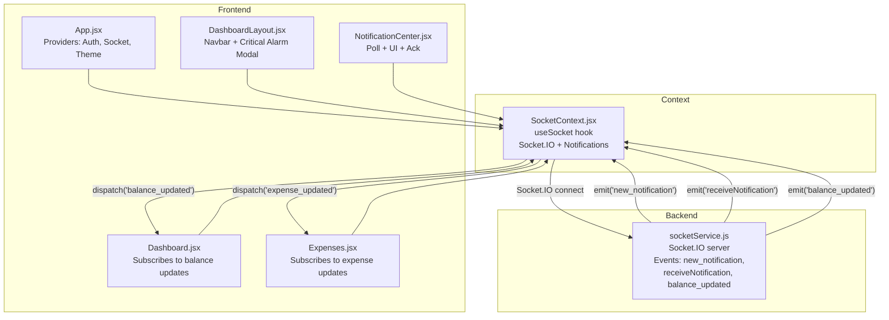
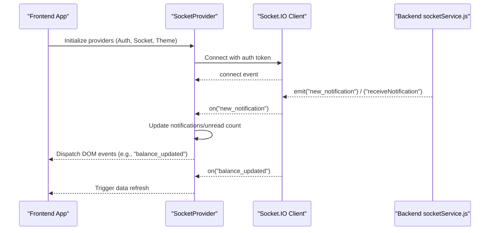
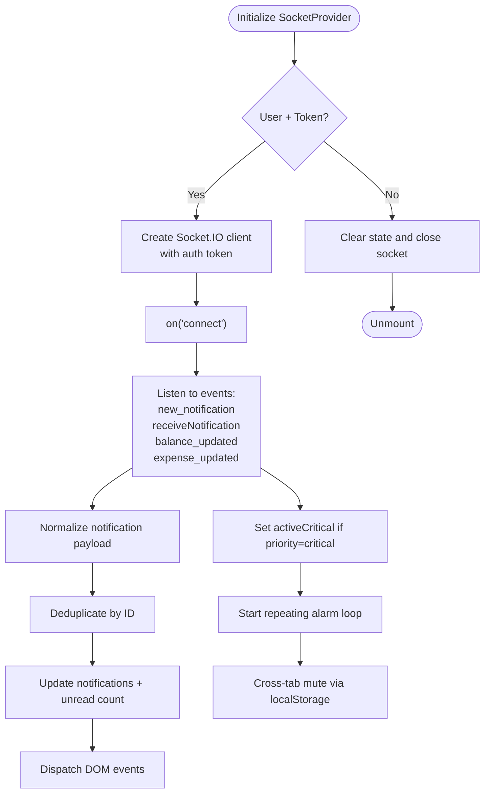
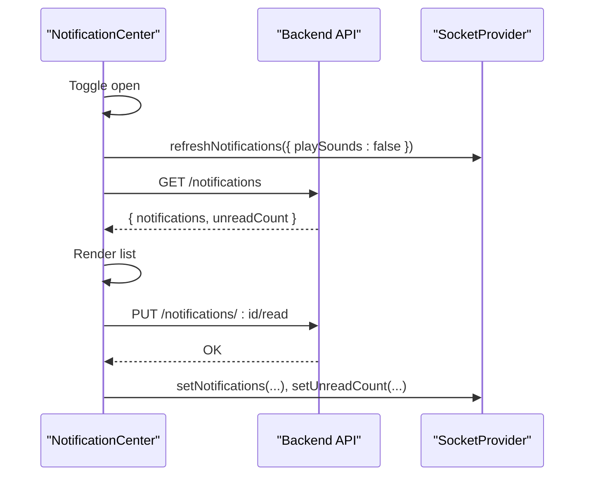
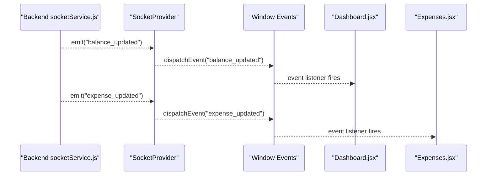
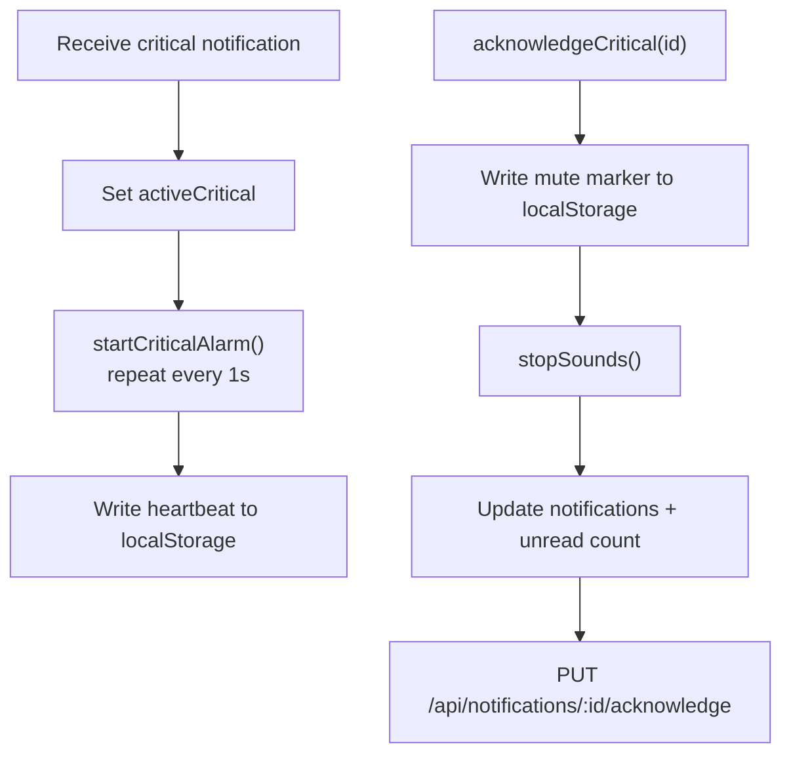
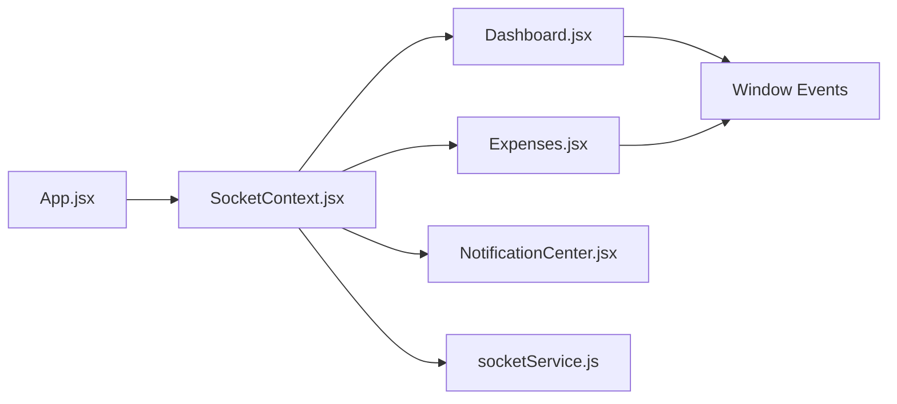

# Frontend Integration

<cite>
**Referenced Files in This Document**
- [SocketContext.jsx](file://frontend/src/context/SocketContext.jsx)
- [NotificationCenter.jsx](file://frontend/src/components/NotificationCenter.jsx)
- [App.jsx](file://frontend/src/App.jsx)
- [DashboardLayout.jsx](file://frontend/src/layouts/DashboardLayout.jsx)
- [Dashboard.jsx](file://frontend/src/pages/Dashboard.jsx)
- [Expenses.jsx](file://frontend/src/pages/Expenses.jsx)
- [socketService.js](file://backend/src/services/socketService.js)
</cite>

## Table of Contents
1. [Introduction](#introduction)
2. [Project Structure](#project-structure)
3. [Core Components](#core-components)
4. [Architecture Overview](#architecture-overview)
5. [Detailed Component Analysis](#detailed-component-analysis)
6. [Dependency Analysis](#dependency-analysis)
7. [Performance Considerations](#performance-considerations)
8. [Troubleshooting Guide](#troubleshooting-guide)
9. [Conclusion](#conclusion)

## Introduction
This document explains the frontend integration patterns for real-time communication in the petty cash management system. It covers the SocketContext provider, the useSocket hook, and how components integrate with the real-time pipeline. It also documents the notification center, real-time state management, and user interface updates. Guidance is included for connecting to socket services, handling incoming events, managing connection state, error handling, reconnection strategies, graceful degradation, and extending the notification system with custom real-time features.

## Project Structure
The frontend integrates real-time capabilities through a React Context provider that manages a Socket.IO client, notification state, and critical alert handling. Components consume the context via a custom hook and subscribe to window events and socket events to keep the UI synchronized with backend updates.

**Diagram sources**
- [App.jsx:45-124](file://frontend/src/App.jsx#L45-L124)
- [SocketContext.jsx:130-375](file://frontend/src/context/SocketContext.jsx#L130-L375)
- [DashboardLayout.jsx:56](file://frontend/src/layouts/DashboardLayout.jsx#L56)
- [Dashboard.jsx:78-111](file://frontend/src/pages/Dashboard.jsx#L78-L111)
- [Expenses.jsx:127-131](file://frontend/src/pages/Expenses.jsx#L127-L131)
- [NotificationCenter.jsx:10](file://frontend/src/components/NotificationCenter.jsx#L10)
- [socketService.js:29-72](file://backend/src/services/socketService.js#L29-L72)

**Section sources**
- [App.jsx:45-124](file://frontend/src/App.jsx#L45-L124)
- [SocketContext.jsx:130-375](file://frontend/src/context/SocketContext.jsx#L130-L375)

## Core Components
- SocketContext provider: Creates and manages a Socket.IO connection, tracks notifications and unread counts, plays sounds, triggers critical alarms, and exposes a useSocket hook for consumers.
- useSocket hook: Returns the socket instance and state/functions for notifications, unread count, critical alerts, and acknowledging critical notifications.
- Notification Center: A dropdown component that displays notifications, marks them read, and allows viewing activity.
- Dashboard and Expenses pages: Subscribe to window events and socket events to refresh data in real time.
- Backend socket service: Emits standardized events and supports a custom sendNotification flow.

**Section sources**
- [SocketContext.jsx:6-7](file://frontend/src/context/SocketContext.jsx#L6-L7)
- [SocketContext.jsx:130-375](file://frontend/src/context/SocketContext.jsx#L130-L375)
- [NotificationCenter.jsx:10](file://frontend/src/components/NotificationCenter.jsx#L10)
- [Dashboard.jsx:78-111](file://frontend/src/pages/Dashboard.jsx#L78-L111)
- [Expenses.jsx:127-131](file://frontend/src/pages/Expenses.jsx#L127-L131)
- [socketService.js:29-72](file://backend/src/services/socketService.js#L29-L72)

## Architecture Overview
The frontend establishes a Socket.IO connection when the user is authenticated. The provider listens for:
- Standardized events: new_notification, receiveNotification, balance_updated, expense_updated
- Window events: balance_updated, expense_updated for components that do not depend on the socket instance
- Local storage events: cross-tab synchronization for critical alarms

**Diagram sources**
- [SocketContext.jsx:209-290](file://frontend/src/context/SocketContext.jsx#L209-L290)
- [socketService.js:43-61](file://backend/src/services/socketService.js#L43-L61)
- [Dashboard.jsx:91-110](file://frontend/src/pages/Dashboard.jsx#L91-L110)

## Detailed Component Analysis

### SocketContext Provider
The provider encapsulates:
- Socket creation and lifecycle management
- Notification ingestion and deduplication
- Unread count and critical alert state
- Sound synthesis for different priorities
- Cross-tab critical alarm control
- Fallback polling for notifications
- Acknowledging critical alerts and updating backend state

Key behaviors:
- On authentication, creates a Socket.IO client with polling and websocket transports, reconnection attempts, and timeouts.
- Subscribes to new_notification and receiveNotification events, normalizes to a unified notification shape, and updates state.
- Emits browser notifications and dispatches DOM events for components that rely on window events.
- Manages a Set of seen notification IDs to avoid duplicates.
- Starts a repeating alarm loop for critical alerts and synchronizes across tabs via localStorage.
- Provides acknowledgeCritical to mute and persist critical acknowledgments.

**Diagram sources**
- [SocketContext.jsx:209-375](file://frontend/src/context/SocketContext.jsx#L209-L375)

**Section sources**
- [SocketContext.jsx:130-375](file://frontend/src/context/SocketContext.jsx#L130-L375)

### useSocket Hook
The hook returns:
- socket: The Socket.IO client instance
- notifications: Array of normalized notifications
- unreadCount: Number of unread notifications
- activeCritical: Current critical notification
- acknowledgeCritical(id): Function to acknowledge and mute critical alerts
- refreshNotifications(options): Function to poll and refresh notifications

Usage patterns:
- Components call useSocket to access state and functions.
- Pages subscribe to window events and/or socket events to refresh data.

**Section sources**
- [SocketContext.jsx:6-7](file://frontend/src/context/SocketContext.jsx#L6-L7)
- [Dashboard.jsx:78-111](file://frontend/src/pages/Dashboard.jsx#L78-L111)
- [Expenses.jsx:127-131](file://frontend/src/pages/Expenses.jsx#L127-L131)

### Notification Center Component
The notification center:
- Consumes useSocket to render notifications and unread counts.
- Toggles open/close and fetches fresh data on open.
- Supports marking individual notifications as read and marking all as read.
- Uses a dropdown UI with icons and priority-based styling.
- Integrates with the backend API for read/acknowledge actions.

**Diagram sources**
- [NotificationCenter.jsx:14-55](file://frontend/src/components/NotificationCenter.jsx#L14-L55)
- [SocketContext.jsx:162-193](file://frontend/src/context/SocketContext.jsx#L162-L193)

**Section sources**
- [NotificationCenter.jsx:10-183](file://frontend/src/components/NotificationCenter.jsx#L10-L183)

### Real-Time State Management and UI Updates
- Dashboard subscribes to both window events and socket events for balance updates to ensure reliability.
- Expenses page listens for expense_updated window events to refresh lists without requiring socket presence.
- Both pages clean up listeners on unmount.

**Diagram sources**
- [socketService.js:29-72](file://backend/src/services/socketService.js#L29-L72)
- [SocketContext.jsx:272-279](file://frontend/src/context/SocketContext.jsx#L272-L279)
- [Dashboard.jsx:91-110](file://frontend/src/pages/Dashboard.jsx#L91-L110)
- [Expenses.jsx:127-131](file://frontend/src/pages/Expenses.jsx#L127-L131)

**Section sources**
- [Dashboard.jsx:78-111](file://frontend/src/pages/Dashboard.jsx#L78-L111)
- [Expenses.jsx:127-131](file://frontend/src/pages/Expenses.jsx#L127-L131)

### Critical Alerts and Cross-Tab Synchronization
- When a critical notification arrives, the provider starts a repeating alarm loop using Web Audio API oscillators.
- A heartbeat is maintained in localStorage to keep the loop alive while active.
- Other tabs listen for localStorage changes to mute alarms when acknowledged elsewhere.
- Acknowledging a critical alert writes to localStorage for immediate cross-tab mute and calls the backend to persist the state.

**Diagram sources**
- [SocketContext.jsx:306-356](file://frontend/src/context/SocketContext.jsx#L306-L356)
- [DashboardLayout.jsx:286-329](file://frontend/src/layouts/DashboardLayout.jsx#L286-L329)

**Section sources**
- [SocketContext.jsx:292-356](file://frontend/src/context/SocketContext.jsx#L292-L356)
- [DashboardLayout.jsx:56](file://frontend/src/layouts/DashboardLayout.jsx#L56)

### Connecting to Socket Services and Handling Events
- The provider connects with an auth token and enables both polling and websocket transports.
- It listens for standardized events and dispatches window events for broad compatibility.
- Components can subscribe to either socket events or window events depending on availability.

Implementation references:
- Socket connection and event subscriptions
- Window event dispatchers for balance and expense updates

**Section sources**
- [SocketContext.jsx:209-290](file://frontend/src/context/SocketContext.jsx#L209-L290)
- [SocketContext.jsx:272-279](file://frontend/src/context/SocketContext.jsx#L272-L279)

### Error Handling, Reconnection, and Graceful Degradation
- Reconnection: The provider configures infinite reconnection attempts with incremental delays and a timeout.
- Fallback polling: Notifications are polled periodically when sockets are unavailable.
- Graceful degradation: Components listen to window events so they remain responsive even if the socket is down.
- Critical alerts: Cross-tab mute ensures consistent user experience across tabs.

**Section sources**
- [SocketContext.jsx:211-219](file://frontend/src/context/SocketContext.jsx#L211-L219)
- [SocketContext.jsx:196-207](file://frontend/src/context/SocketContext.jsx#L196-L207)
- [Dashboard.jsx:91-110](file://frontend/src/pages/Dashboard.jsx#L91-L110)
- [Expenses.jsx:127-131](file://frontend/src/pages/Expenses.jsx#L127-L131)

### Extending the Notification System and Implementing Custom Features
Guidelines:
- Emit a standardized new_notification event from the backend to integrate with the existing UI.
- Optionally emit a receiveNotification event for custom receivers.
- Use the acknowledgeCritical endpoint to persist acknowledgments and mute critical alerts.
- For custom real-time features, dispatch window events and subscribe in components that do not require socket instances.

References:
- Backend event emission and broadcasting
- Provider handling of custom events and normalization

**Section sources**
- [socketService.js:43-61](file://backend/src/services/socketService.js#L43-L61)
- [SocketContext.jsx:238-270](file://frontend/src/context/SocketContext.jsx#L238-L270)

## Dependency Analysis
The frontend depends on:
- SocketContext for centralized socket and notification state
- Backend socketService for emitting real-time events
- Window events for graceful fallback when sockets are unavailable

**Diagram sources**
- [App.jsx:54](file://frontend/src/App.jsx#L54)
- [SocketContext.jsx:130-375](file://frontend/src/context/SocketContext.jsx#L130-L375)
- [Dashboard.jsx:91-110](file://frontend/src/pages/Dashboard.jsx#L91-L110)
- [Expenses.jsx:127-131](file://frontend/src/pages/Expenses.jsx#L127-L131)
- [socketService.js:29-72](file://backend/src/services/socketService.js#L29-L72)

**Section sources**
- [App.jsx:54](file://frontend/src/App.jsx#L54)
- [SocketContext.jsx:130-375](file://frontend/src/context/SocketContext.jsx#L130-L375)
- [socketService.js:29-72](file://backend/src/services/socketService.js#L29-L72)

## Performance Considerations
- Prefer window events for frequent updates to reduce socket overhead when sockets are unstable.
- Use deduplication by notification ID to prevent redundant renders.
- Limit repeated audio oscillator creation and prune old oscillators to avoid memory leaks.
- Debounce UI-triggered refreshes (e.g., opening the notification center) to avoid excessive polling.

## Troubleshooting Guide
Common issues and resolutions:
- Socket fails to connect: Verify token presence and network connectivity. Check reconnection attempts and transport selection.
- Duplicate notifications: Confirm deduplication logic by ID and that seenNotificationIdsRef is properly initialized.
- Critical alarm not muting across tabs: Ensure localStorage keys are written and read consistently; verify heartbeat updates.
- UI not updating: Confirm window event listeners are attached and cleaned up on unmount; verify socket event handlers are registered.

**Section sources**
- [SocketContext.jsx:209-290](file://frontend/src/context/SocketContext.jsx#L209-L290)
- [SocketContext.jsx:139-159](file://frontend/src/context/SocketContext.jsx#L139-L159)
- [SocketContext.jsx:292-303](file://frontend/src/context/SocketContext.jsx#L292-L303)
- [Dashboard.jsx:91-110](file://frontend/src/pages/Dashboard.jsx#L91-L110)
- [Expenses.jsx:127-131](file://frontend/src/pages/Expenses.jsx#L127-L131)

## Conclusion
The frontend’s real-time integration centers on a robust SocketContext provider that manages socket connections, notifications, and critical alerts. Components leverage both socket and window event streams to maintain responsiveness and consistency. The design supports graceful degradation, cross-tab synchronization, and extensibility for custom real-time features.