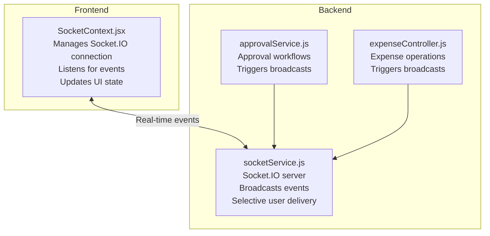
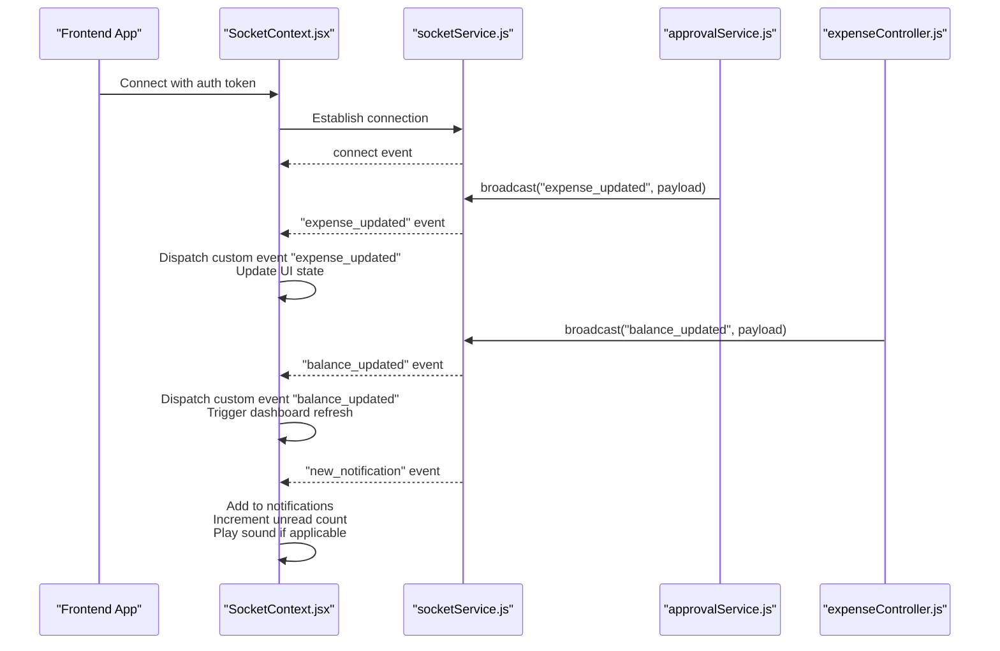
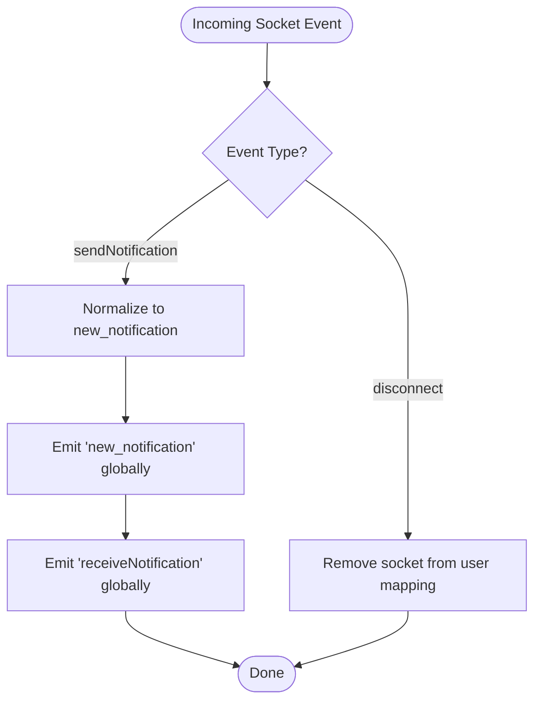
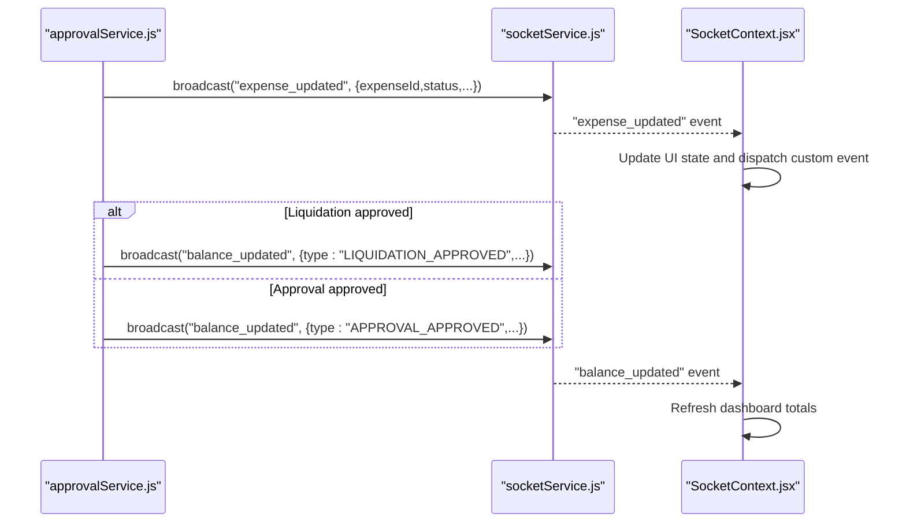
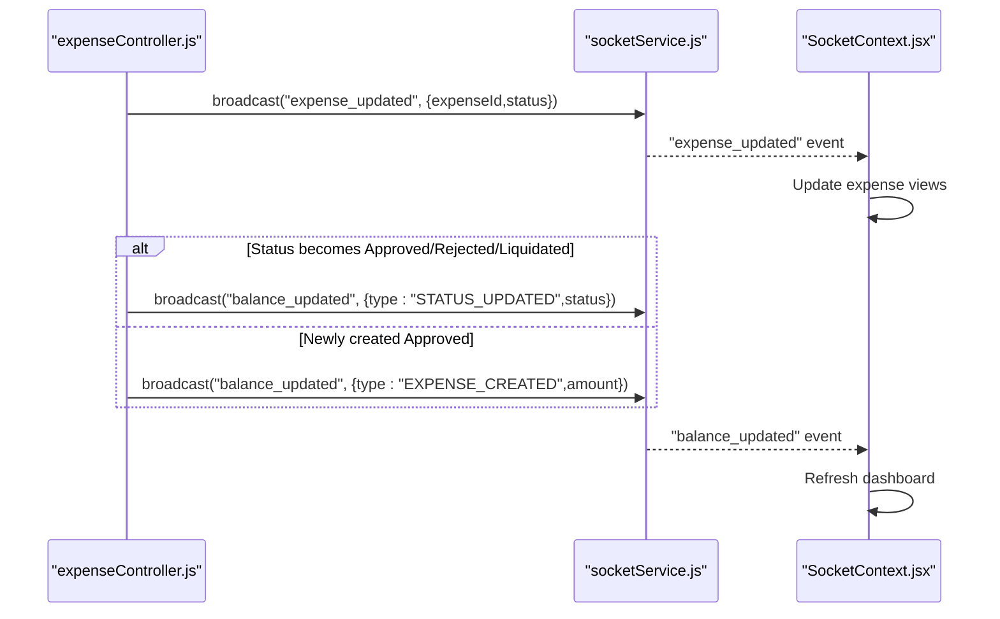
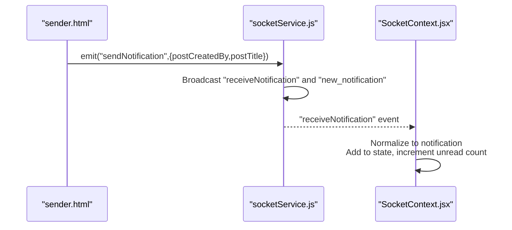
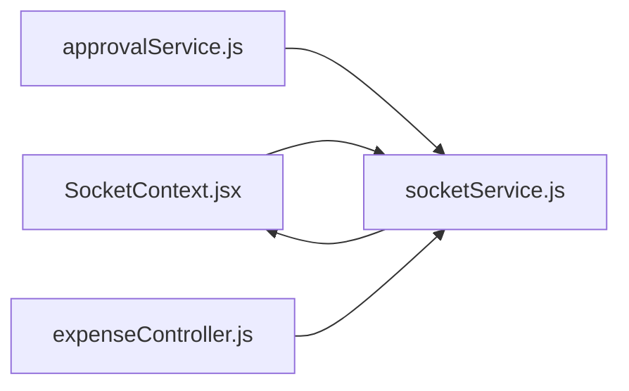

# Live Dashboard Updates

<cite>
**Referenced Files in This Document**
- [SocketContext.jsx](file://frontend/src/context/SocketContext.jsx)
- [socketService.js](file://backend/src/services/socketService.js)
- [approvalService.js](file://backend/src/services/approvalService.js)
- [expenseController.js](file://backend/src/controllers/expenseController.js)
- [sender.html](file://frontend/public/sender.html)
</cite>

## Table of Contents
1. [Introduction](#introduction)
2. [Project Structure](#project-structure)
3. [Core Components](#core-components)
4. [Architecture Overview](#architecture-overview)
5. [Detailed Component Analysis](#detailed-component-analysis)
6. [Dependency Analysis](#dependency-analysis)
7. [Performance Considerations](#performance-considerations)
8. [Troubleshooting Guide](#troubleshooting-guide)
9. [Conclusion](#conclusion)

## Introduction
This document explains how live dashboard updates and real-time data synchronization work in the system. It covers how expense status changes, approval notifications, and system alerts propagate to connected clients, the event-driven update mechanism, selective broadcasting to specific users, and global announcements. It also documents the integration between backend services and frontend components for real-time UI updates, including examples of expense status updates, notification broadcasts, and dashboard refresh triggers. Guidance is included for update frequency management, client-side caching strategies, and optimistic UI patterns to ensure a seamless user experience.

## Project Structure
The real-time functionality spans both frontend and backend:
- Frontend: A React context provider manages the Socket.IO connection, listens for server-sent events, and updates local state and UI.
- Backend: Socket service handles connections, supports selective user broadcasting, and emits events for notifications, balances, and expense updates.
- Controllers and services: Trigger broadcasts when key business events occur (e.g., expense creation, status updates, approvals).

**Diagram sources**
- [SocketContext.jsx:210-281](file://frontend/src/context/SocketContext.jsx#L210-L281)
- [socketService.js:42-101](file://backend/src/services/socketService.js#L42-L101)
- [approvalService.js:320-327](file://backend/src/services/approvalService.js#L320-L327)
- [expenseController.js:183-211](file://backend/src/controllers/expenseController.js#L183-L211)

**Section sources**
- [SocketContext.jsx:210-281](file://frontend/src/context/SocketContext.jsx#L210-L281)
- [socketService.js:42-101](file://backend/src/services/socketService.js#L42-L101)
- [approvalService.js:320-327](file://backend/src/services/approvalService.js#L320-L327)
- [expenseController.js:183-211](file://backend/src/controllers/expenseController.js#L183-L211)

## Core Components
- Socket.IO client in the frontend establishes a persistent connection, listens for real-time events, and updates notifications, unread counts, and critical alerts. It also falls back to periodic polling for notifications.
- Socket.IO server in the backend manages connections, supports selective per-user delivery, and broadcasts global events for balance and expense updates.
- Approval and expense services/controllers emit events when significant state changes occur, ensuring clients receive timely updates.

Key responsibilities:
- Real-time event reception and UI updates in the frontend.
- Selective and global event broadcasting in the backend.
- Business-triggered broadcasts for approvals and expense lifecycle events.

**Section sources**
- [SocketContext.jsx:195-207](file://frontend/src/context/SocketContext.jsx#L195-L207)
- [SocketContext.jsx:210-281](file://frontend/src/context/SocketContext.jsx#L210-L281)
- [socketService.js:77-101](file://backend/src/services/socketService.js#L77-L101)
- [approvalService.js:320-327](file://backend/src/services/approvalService.js#L320-L327)
- [expenseController.js:183-211](file://backend/src/controllers/expenseController.js#L183-L211)

## Architecture Overview
The system uses Socket.IO for real-time communication. The backend emits events for:
- Notifications: new_notification and receiveNotification for internal and custom use cases.
- Expense updates: expense_updated for status changes and approval progress.
- Balance updates: balance_updated for financial impact after approvals or liquidations.

The frontend listens for these events, updates state, and triggers UI refreshes. Periodic polling ensures notifications remain synchronized even if WebSocket connectivity is intermittent.

**Diagram sources**
- [SocketContext.jsx:210-281](file://frontend/src/context/SocketContext.jsx#L210-L281)
- [socketService.js:42-101](file://backend/src/services/socketService.js#L42-L101)
- [approvalService.js:320-327](file://backend/src/services/approvalService.js#L320-L327)
- [expenseController.js:183-211](file://backend/src/controllers/expenseController.js#L183-L211)

## Detailed Component Analysis

### Frontend: SocketContext (Real-Time Event Handling)
Responsibilities:
- Establishes a Socket.IO connection with authentication and transport preferences.
- Listens for real-time events: new_notification, receiveNotification, balance_updated, expense_updated.
- Manages notification state, unread counts, and critical alerts.
- Implements fallback polling for notifications to ensure resilience.
- Dispatches custom DOM events to trigger UI updates across components.

Real-time event listeners:
- new_notification: Adds incoming notifications, increments unread count, plays sounds if configured, and updates critical alert state.
- receiveNotification: Normalizes custom events into notification objects and applies the same update pipeline.
- balance_updated: Dispatches a custom event to refresh dashboard totals and summaries.
- expense_updated: Dispatches a custom event to update expense-related views.

Fallback polling:
- Periodic fetch of unread notifications every 30 seconds to maintain synchronization.

Optimistic UI patterns:
- Immediate state updates upon receiving events, followed by eventual consistency via polling.

Client-side caching strategies:
- Maintains a set of seen notification IDs to avoid duplicates.
- Stores critical notification acknowledgment state locally for cross-tab muting.

**Section sources**
- [SocketContext.jsx:195-207](file://frontend/src/context/SocketContext.jsx#L195-L207)
- [SocketContext.jsx:210-281](file://frontend/src/context/SocketContext.jsx#L210-L281)
- [SocketContext.jsx:334-356](file://frontend/src/context/SocketContext.jsx#L334-L356)

### Backend: Socket Service (Broadcasting and Selective Delivery)
Responsibilities:
- Initializes Socket.IO server and handles connection lifecycle.
- Supports selective per-user delivery using a user-to-socket mapping.
- Emits global events for notifications and dashboard updates.

Event handling:
- Custom sendNotification: Receives a custom event and broadcasts two normalized events for compatibility.
- Disconnect handling: Removes sockets from user mappings on disconnect.

Broadcasting helpers:
- broadcast: Emits events to all connected clients.
- sendToUser: Emits events to a specific user’s sockets.

**Diagram sources**
- [socketService.js:42-71](file://backend/src/services/socketService.js#L42-L71)

**Section sources**
- [socketService.js:42-101](file://backend/src/services/socketService.js#L42-L101)

### Backend: Approval Service (Approval Workflow and Broadcasts)
Responsibilities:
- Initiates approval workflows and transitions expense statuses.
- Sends approval emails and records audit trails.
- Emits real-time events when approval progresses or completes.

Key broadcasts:
- expense_updated: Emitted during approval submission and level progression.
- balance_updated: Emitted when liquidation or approval decisions impact balances.

**Diagram sources**
- [approvalService.js:320-327](file://backend/src/services/approvalService.js#L320-L327)
- [approvalService.js:468-472](file://backend/src/services/approvalService.js#L468-L472)
- [approvalService.js:486-504](file://backend/src/services/approvalService.js#L486-L504)
- [socketService.js:88-94](file://backend/src/services/socketService.js#L88-L94)
- [SocketContext.jsx:272-279](file://frontend/src/context/SocketContext.jsx#L272-L279)

**Section sources**
- [approvalService.js:292-327](file://backend/src/services/approvalService.js#L292-L327)
- [approvalService.js:458-504](file://backend/src/services/approvalService.js#L458-L504)
- [socketService.js:88-94](file://backend/src/services/socketService.js#L88-L94)
- [SocketContext.jsx:272-279](file://frontend/src/context/SocketContext.jsx#L272-L279)

### Backend: Expense Controller (Lifecycle Events and Broadcasts)
Responsibilities:
- Creates and updates expenses.
- Triggers notifications to relevant users.
- Emits balance and expense update events based on lifecycle actions.

Key broadcasts:
- expense_updated: Emitted after creation or status change.
- balance_updated: Emitted for newly created approved expenses and when status changes to approved/rejected/liquidated.

**Diagram sources**
- [expenseController.js:183-211](file://backend/src/controllers/expenseController.js#L183-L211)
- [expenseController.js:337-357](file://backend/src/controllers/expenseController.js#L337-L357)
- [socketService.js:88-94](file://backend/src/services/socketService.js#L88-L94)
- [SocketContext.jsx:272-279](file://frontend/src/context/SocketContext.jsx#L272-L279)

**Section sources**
- [expenseController.js:183-211](file://backend/src/controllers/expenseController.js#L183-L211)
- [expenseController.js:337-357](file://backend/src/controllers/expenseController.js#L337-L357)
- [socketService.js:88-94](file://backend/src/services/socketService.js#L88-L94)
- [SocketContext.jsx:272-279](file://frontend/src/context/SocketContext.jsx#L272-L279)

### Example: Custom Notification Flow (sender.html to Client)
The example HTML page demonstrates emitting a custom event to the server, which then broadcasts normalized events to clients.

**Diagram sources**
- [sender.html:15-33](file://frontend/public/sender.html#L15-L33)
- [socketService.js:42-61](file://backend/src/services/socketService.js#L42-L61)
- [SocketContext.jsx:238-270](file://frontend/src/context/SocketContext.jsx#L238-L270)

**Section sources**
- [sender.html:15-33](file://frontend/public/sender.html#L15-L33)
- [socketService.js:42-61](file://backend/src/services/socketService.js#L42-L61)
- [SocketContext.jsx:238-270](file://frontend/src/context/SocketContext.jsx#L238-L270)

## Dependency Analysis
- Frontend depends on SocketContext for connection management and event handling.
- Backend services depend on socketService for broadcasting and selective delivery.
- Approval and expense controllers depend on socketService to emit real-time updates.
- The system integrates loosely coupled components: controllers/services emit events, and the socket service distributes them.

**Diagram sources**
- [SocketContext.jsx:210-281](file://frontend/src/context/SocketContext.jsx#L210-L281)
- [socketService.js:77-101](file://backend/src/services/socketService.js#L77-L101)
- [approvalService.js:320-327](file://backend/src/services/approvalService.js#L320-L327)
- [expenseController.js:183-211](file://backend/src/controllers/expenseController.js#L183-L211)

**Section sources**
- [SocketContext.jsx:210-281](file://frontend/src/context/SocketContext.jsx#L210-L281)
- [socketService.js:77-101](file://backend/src/services/socketService.js#L77-L101)
- [approvalService.js:320-327](file://backend/src/services/approvalService.js#L320-L327)
- [expenseController.js:183-211](file://backend/src/controllers/expenseController.js#L183-L211)

## Performance Considerations
- Event volume management: Limit unnecessary broadcasts to critical state changes (e.g., approval progression, finalization).
- Client-side deduplication: Seen notification ID tracking prevents redundant UI updates.
- Polling cadence: Notifications poll every 30 seconds to reduce long-poll overhead while maintaining freshness.
- Transport selection: Prefer WebSocket with polling fallback to improve reliability.
- Optimistic UI: Apply immediate UI updates on the client and reconcile with server responses to minimize perceived latency.

## Troubleshooting Guide
Common issues and resolutions:
- No real-time updates:
  - Verify the Socket.IO connection is established and authenticated.
  - Confirm the backend emits the correct events and the frontend listens for them.
- Duplicate notifications:
  - Ensure seen notification IDs are tracked and used to skip duplicates.
- Missing balance updates:
  - Check that balance_updated events are emitted after approval/liquidation and status changes.
- Disconnections:
  - Use the built-in reconnection settings and verify user socket mapping cleanup on disconnect.

**Section sources**
- [SocketContext.jsx:210-281](file://frontend/src/context/SocketContext.jsx#L210-L281)
- [socketService.js:63-71](file://backend/src/services/socketService.js#L63-L71)
- [approvalService.js:486-504](file://backend/src/services/approvalService.js#L486-L504)
- [expenseController.js:347-349](file://backend/src/controllers/expenseController.js#L347-L349)

## Conclusion
The system achieves live dashboard updates through a robust event-driven architecture. Backend services emit targeted events for approvals, expense lifecycle changes, and financial impacts, while the frontend consumes these events to keep the UI fresh and responsive. Selective broadcasting and global announcements coexist, supported by resilient connection handling and fallback polling. Optimistic UI patterns and client-side caching further enhance the user experience by minimizing latency and preventing redundant updates.