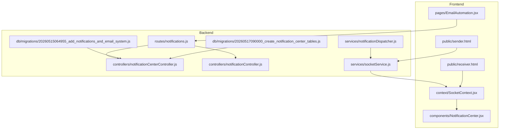
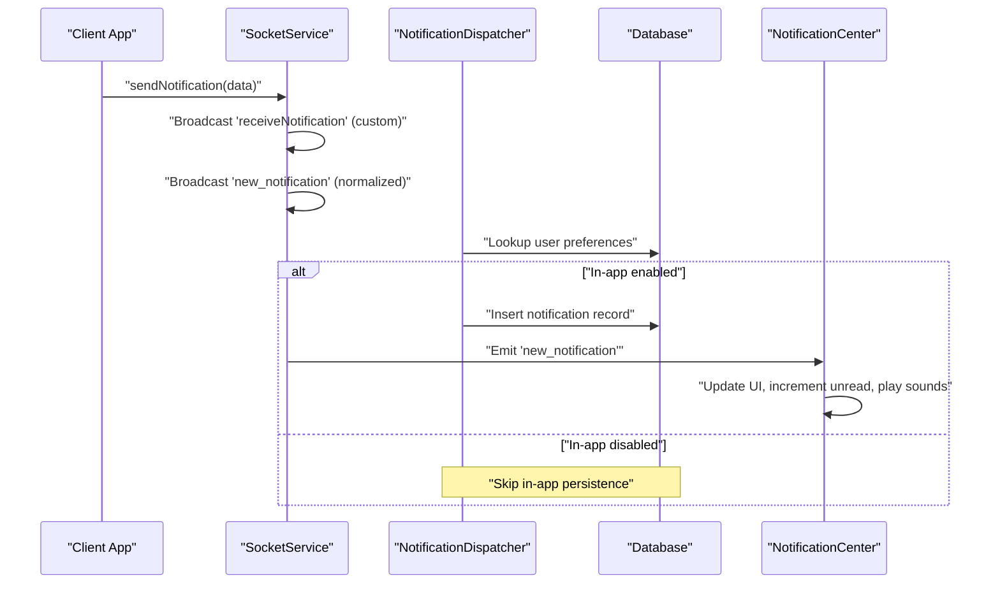
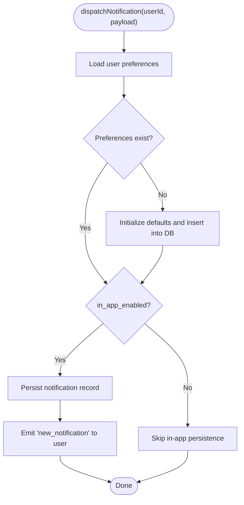
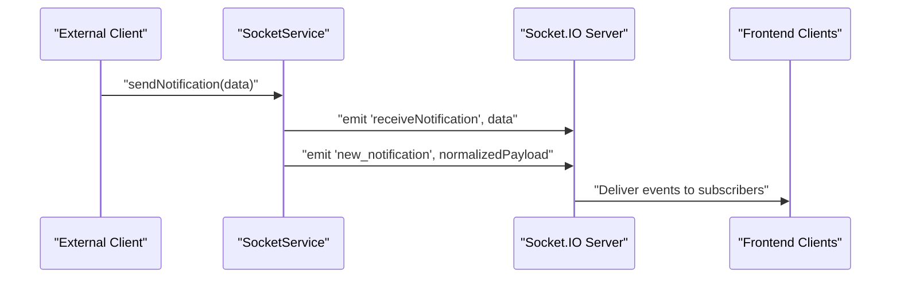
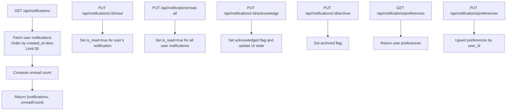
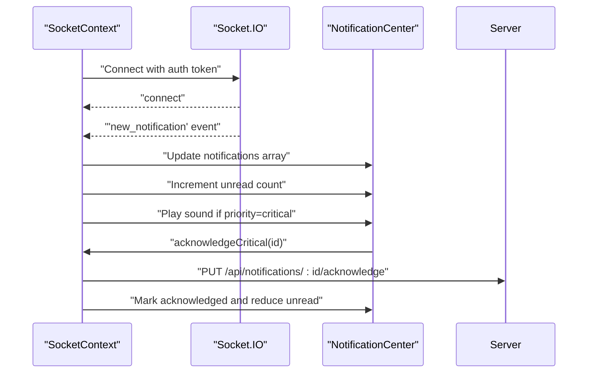
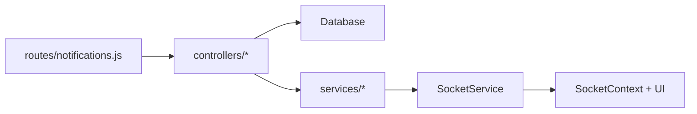

# Notification System

<cite>
**Referenced Files in This Document**
- [notificationDispatcher.js](file://backend/src/services/notificationDispatcher.js)
- [socketService.js](file://backend/src/services/socketService.js)
- [notificationController.js](file://backend/src/controllers/notificationController.js)
- [notifications.js](file://backend/src/routes/notifications.js)
- [notificationCenterController.js](file://backend/src/controllers/notificationCenterController.js)
- [20260515064955_add_notifications_and_email_system.js](file://backend/src/db/migrations/20260515064955_add_notifications_and_email_system.js)
- [20260517090000_create_notification_center_tables.js](file://backend/src/db/migrations/20260517090000_create_notification_center_tables.js)
- [NotificationCenter.jsx](file://frontend/src/components/NotificationCenter.jsx)
- [SocketContext.jsx](file://frontend/src/context/SocketContext.jsx)
- [receiver.html](file://frontend/public/receiver.html)
- [sender.html](file://frontend/public/sender.html)
- [EmailAutomation.jsx](file://frontend/src/pages/EmailAutomation.jsx)
</cite>

## Table of Contents
1. [Introduction](#introduction)
2. [Project Structure](#project-structure)
3. [Core Components](#core-components)
4. [Architecture Overview](#architecture-overview)
5. [Detailed Component Analysis](#detailed-component-analysis)
6. [Dependency Analysis](#dependency-analysis)
7. [Performance Considerations](#performance-considerations)
8. [Troubleshooting Guide](#troubleshooting-guide)
9. [Conclusion](#conclusion)

## Introduction
This document describes the notification system architecture for the Petty Cash application. It covers the notification dispatcher service, real-time broadcasting mechanisms, and the notification center. It documents notification types, priorities, categories, filtering options, user preferences, and notification history. It also explains the dual notification system supporting both custom sendNotification events and the standardized new_notification format, along with persistence, archiving, acknowledgment tracking, and user preference integration.

## Project Structure
The notification system spans backend services and controllers, database migrations, and frontend components and contexts. Key areas include:
- Backend services: notification dispatcher, socket service, controllers, and routes
- Database: migrations defining notification and preference schemas
- Frontend: notification center UI and Socket.IO context for real-time updates

**Diagram sources**
- [notifications.js:1-32](file://backend/src/routes/notifications.js#L1-L32)
- [notificationCenterController.js](file://backend/src/controllers/notificationCenterController.js)
- [notificationController.js:1-91](file://backend/src/controllers/notificationController.js#L1-L91)
- [notificationDispatcher.js:1-39](file://backend/src/services/notificationDispatcher.js#L1-L39)
- [socketService.js:42-101](file://backend/src/services/socketService.js#L42-L101)
- [20260515064955_add_notifications_and_email_system.js](file://backend/src/db/migrations/20260515064955_add_notifications_and_email_system.js)
- [20260517090000_create_notification_center_tables.js](file://backend/src/db/migrations/20260517090000_create_notification_center_tables.js)
- [SocketContext.jsx:176-375](file://frontend/src/context/SocketContext.jsx#L176-L375)
- [NotificationCenter.jsx](file://frontend/src/components/NotificationCenter.jsx)
- [receiver.html:1-37](file://frontend/public/receiver.html#L1-L37)
- [sender.html:1-35](file://frontend/public/sender.html#L1-L35)
- [EmailAutomation.jsx:831-965](file://frontend/src/pages/EmailAutomation.jsx#L831-L965)

**Section sources**
- [notifications.js:1-32](file://backend/src/routes/notifications.js#L1-L32)
- [notificationDispatcher.js:1-39](file://backend/src/services/notificationDispatcher.js#L1-L39)
- [socketService.js:42-101](file://backend/src/services/socketService.js#L42-L101)
- [notificationController.js:1-91](file://backend/src/controllers/notificationController.js#L1-L91)
- [20260515064955_add_notifications_and_email_system.js](file://backend/src/db/migrations/20260515064955_add_notifications_and_email_system.js)
- [20260517090000_create_notification_center_tables.js](file://backend/src/db/migrations/20260517090000_create_notification_center_tables.js)
- [SocketContext.jsx:176-375](file://frontend/src/context/SocketContext.jsx#L176-L375)
- [NotificationCenter.jsx](file://frontend/src/components/NotificationCenter.jsx)
- [receiver.html:1-37](file://frontend/public/receiver.html#L1-L37)
- [sender.html:1-35](file://frontend/public/sender.html#L1-L35)
- [EmailAutomation.jsx:831-965](file://frontend/src/pages/EmailAutomation.jsx#L831-L965)

## Core Components
- Notification Dispatcher Service: Handles user preferences lookup, persists in-app notifications, and emits real-time updates via Socket.IO.
- Socket Service: Manages Socket.IO connections, supports custom sendNotification event, and broadcasts both receiveNotification and normalized new_notification events.
- Notification Controllers: Provide endpoints for retrieving notifications, marking as read, acknowledging, archiving, and managing user preferences.
- Routes: Define protected endpoints for inbox operations, preferences, and administrative broadcast capabilities.
- Notification Center: Frontend component and context orchestrating real-time updates, sound feedback, critical notification handling, and acknowledgment workflows.
- Database Migrations: Establish notification and preference schemas, enabling persistence and history tracking.

**Section sources**
- [notificationDispatcher.js:5-39](file://backend/src/services/notificationDispatcher.js#L5-L39)
- [socketService.js:42-101](file://backend/src/services/socketService.js#L42-L101)
- [notificationController.js:1-91](file://backend/src/controllers/notificationController.js#L1-L91)
- [notifications.js:17-31](file://backend/src/routes/notifications.js#L17-L31)
- [SocketContext.jsx:176-375](file://frontend/src/context/SocketContext.jsx#L176-L375)
- [20260515064955_add_notifications_and_email_system.js](file://backend/src/db/migrations/20260515064955_add_notifications_and_email_system.js)
- [20260517090000_create_notification_center_tables.js](file://backend/src/db/migrations/20260517090000_create_notification_center_tables.js)

## Architecture Overview
The system combines a dual-event broadcasting mechanism with a centralized notification center:
- Custom Event: Clients emit sendNotification to trigger receiveNotification for custom receivers and a normalized new_notification for the main application.
- Real-time Delivery: Socket.IO delivers notifications instantly to connected clients, updating the notification center UI and triggering sound cues for critical alerts.
- Persistence and History: Notifications are stored in the database with read, acknowledgment, and archive flags, enabling history tracking and administrative oversight.
- User Preferences: Per-user preferences control whether in-app notifications are enabled and influence dispatcher behavior.

**Diagram sources**
- [socketService.js:42-61](file://backend/src/services/socketService.js#L42-L61)
- [notificationDispatcher.js:5-39](file://backend/src/services/notificationDispatcher.js#L5-L39)
- [SocketContext.jsx:225-236](file://frontend/src/context/SocketContext.jsx#L225-L236)

## Detailed Component Analysis

### Notification Dispatcher Service
Responsibilities:
- Fetches per-user notification preferences
- Persists in-app notifications when enabled
- Emits real-time updates via Socket.IO for immediate UI updates

Key behaviors:
- Defaults missing preferences to enable both email and in-app notifications
- Inserts notification records with metadata (type, link, timestamps)
- Sends real-time events to the specific user’s sockets

**Diagram sources**
- [notificationDispatcher.js:5-39](file://backend/src/services/notificationDispatcher.js#L5-L39)

**Section sources**
- [notificationDispatcher.js:5-39](file://backend/src/services/notificationDispatcher.js#L5-L39)

### Socket Service and Dual Event Broadcasting
Responsibilities:
- Manage Socket.IO connections and user socket mapping
- Support custom sendNotification event to broadcast receiveNotification for custom receivers
- Normalize and broadcast new_notification for the main application with fields like priority and category

Behavior highlights:
- On sendNotification, emits both custom and normalized events
- Provides sendToUser and broadcast utilities for targeted and global notifications
- Integrates with frontend SocketContext for real-time updates

**Diagram sources**
- [socketService.js:42-61](file://backend/src/services/socketService.js#L42-L61)

**Section sources**
- [socketService.js:42-101](file://backend/src/services/socketService.js#L42-L101)

### Notification Controllers and Routes
Endpoints:
- Inbox: GET /, PUT /:id/read, PUT /read-all, PUT /:id/acknowledge, PUT /:id/archive
- Preferences: GET /preferences, PUT /preferences
- Administration: POST /broadcast, GET /sent

Controllers:
- Retrieve paginated notifications with unread counts
- Mark individual or all notifications as read
- Acknowledge notifications (updates acknowledgment flag)
- Archive notifications (archive flag maintained in schema)
- CRUD for user notification preferences

**Diagram sources**
- [notificationController.js:3-91](file://backend/src/controllers/notificationController.js#L3-L91)
- [notifications.js:17-31](file://backend/src/routes/notifications.js#L17-L31)

**Section sources**
- [notificationController.js:1-91](file://backend/src/controllers/notificationController.js#L1-L91)
- [notifications.js:1-32](file://backend/src/routes/notifications.js#L1-L32)

### Notification Center Component and Real-time Pipeline
Frontend responsibilities:
- Establish Socket.IO connection with authentication and fallback polling
- Listen for new_notification and receiveNotification events
- Normalize and deduplicate incoming notifications
- Play sound cues for critical notifications and maintain active critical state
- Provide acknowledgment actions and update unread counts

Integration points:
- Uses SocketContext for shared socket lifecycle and state
- Supports critical notification handling with local storage-based muting
- Implements periodic polling to synchronize unread counts and catch missed events

**Diagram sources**
- [SocketContext.jsx:176-375](file://frontend/src/context/SocketContext.jsx#L176-L375)
- [NotificationCenter.jsx](file://frontend/src/components/NotificationCenter.jsx)

**Section sources**
- [SocketContext.jsx:176-375](file://frontend/src/context/SocketContext.jsx#L176-L375)
- [NotificationCenter.jsx](file://frontend/src/components/NotificationCenter.jsx)

### Database Schema and Migration Details
The migrations define:
- Initial notification and email system schema
- Notification center tables including notification records, preferences, and administrative sent notifications
- Fields supporting type, priority, category, acknowledgment, and archival flags

Implications:
- Enables robust persistence, filtering, and auditing
- Supports future extensions for categories and advanced routing

**Section sources**
- [20260515064955_add_notifications_and_email_system.js](file://backend/src/db/migrations/20260515064955_add_notifications_and_email_system.js)
- [20260517090000_create_notification_center_tables.js](file://backend/src/db/migrations/20260517090000_create_notification_center_tables.js)

### Message Format Specifications and Event Types
Normalized new_notification payload fields:
- id: Unique identifier
- title: Notification title
- message: Body content
- type: Notification type (e.g., info)
- priority: Normal, important, critical
- category: General, approval, system, etc.
- acknowledged: Boolean flag
- archived: Boolean flag
- created_at: Timestamp

Custom sendNotification event:
- Accepts arbitrary fields (e.g., postTitle, postCreatedBy)
- Triggers receiveNotification for custom receivers
- Normalizes to new_notification for the main application

Delivery confirmation:
- Acknowledgment endpoint updates acknowledgment flag
- Frontend acknowledges by calling server and updating local state

**Section sources**
- [socketService.js:42-61](file://backend/src/services/socketService.js#L42-L61)
- [SocketContext.jsx:225-236](file://frontend/src/context/SocketContext.jsx#L225-L236)
- [notificationController.js:65-83](file://backend/src/controllers/notificationController.js#L65-L83)

### Filtering Options and User Preferences Management
Filtering:
- Priority-based filtering (normal, important, critical)
- Category-based filtering (general, approval, system)
- Read/unread and acknowledged/archived flags support further filtering

Preferences:
- in_app_enabled controls whether in-app notifications are persisted and delivered
- email_enabled controls email delivery (default initialized to true)
- Preferences are upserted per user and merged on updates

**Section sources**
- [notificationDispatcher.js:9-17](file://backend/src/services/notificationDispatcher.js#L9-L17)
- [notificationController.js:49-83](file://backend/src/controllers/notificationController.js#L49-L83)
- [EmailAutomation.jsx:831-965](file://frontend/src/pages/EmailAutomation.jsx#L831-L965)

### Administrative Broadcast and History Tracking
Administrative endpoints:
- POST /api/notifications/broadcast enables super admins and accountants to push system-wide notifications
- GET /api/notifications/sent retrieves sent notifications for audit/tracking

History tracking:
- Notifications are persisted with timestamps and flags
- Acknowledgment and archive flags enable historical tracking and compliance

**Section sources**
- [notifications.js:28-31](file://backend/src/routes/notifications.js#L28-L31)
- [notificationCenterController.js](file://backend/src/controllers/notificationCenterController.js)

## Dependency Analysis
The notification system exhibits clear separation of concerns:
- Routes depend on controllers for business logic
- Controllers depend on database access and services
- Services depend on Socket.IO and database connectors
- Frontend depends on Socket.IO context and components for rendering and UX

**Diagram sources**
- [notifications.js:1-32](file://backend/src/routes/notifications.js#L1-L32)
- [notificationController.js:1-91](file://backend/src/controllers/notificationController.js#L1-L91)
- [notificationDispatcher.js:1-39](file://backend/src/services/notificationDispatcher.js#L1-L39)
- [socketService.js:42-101](file://backend/src/services/socketService.js#L42-L101)
- [SocketContext.jsx:176-375](file://frontend/src/context/SocketContext.jsx#L176-L375)

**Section sources**
- [notifications.js:1-32](file://backend/src/routes/notifications.js#L1-L32)
- [notificationController.js:1-91](file://backend/src/controllers/notificationController.js#L1-L91)
- [notificationDispatcher.js:1-39](file://backend/src/services/notificationDispatcher.js#L1-L39)
- [socketService.js:42-101](file://backend/src/services/socketService.js#L42-L101)
- [SocketContext.jsx:176-375](file://frontend/src/context/SocketContext.jsx#L176-L375)

## Performance Considerations
- Real-time delivery via Socket.IO minimizes latency for critical notifications
- Deduplication in the frontend prevents redundant UI updates
- Polling fallback ensures reliability when WebSocket connectivity is intermittent
- Limiting notification fetch to recent entries reduces payload sizes
- Acknowledgment and archive flags enable efficient filtering and reduced load

## Troubleshooting Guide
Common issues and resolutions:
- No real-time notifications: Verify Socket.IO connection and authentication token; check browser console for connection errors
- Duplicate notifications: Confirm deduplication logic and event emission uniqueness
- Missing ack/critical handling: Ensure acknowledgment endpoint is called and local storage muting keys are respected
- Preference not applied: Confirm preferences are upserted and in_app_enabled is checked before persisting notifications

**Section sources**
- [SocketContext.jsx:176-375](file://frontend/src/context/SocketContext.jsx#L176-L375)
- [notificationDispatcher.js:9-17](file://backend/src/services/notificationDispatcher.js#L9-L17)
- [notificationController.js:65-83](file://backend/src/controllers/notificationController.js#L65-L83)

## Conclusion
The notification system integrates a dual-event broadcasting model with robust persistence, user preferences, and a responsive frontend notification center. It supports critical-path real-time delivery, administrative broadcasting, and comprehensive history tracking while maintaining flexibility for future enhancements such as category-based routing and advanced filtering.