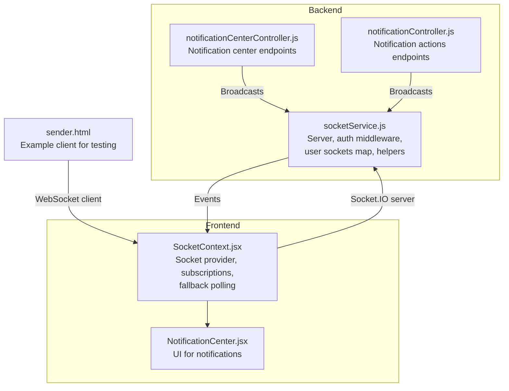
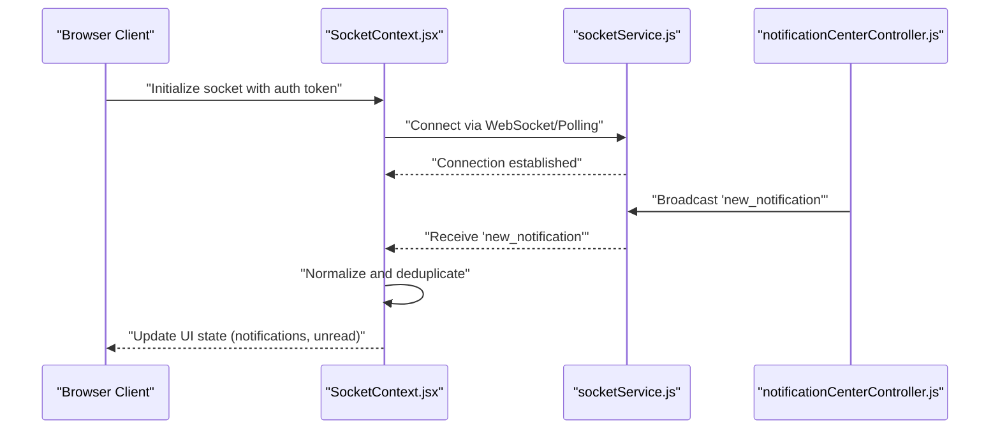
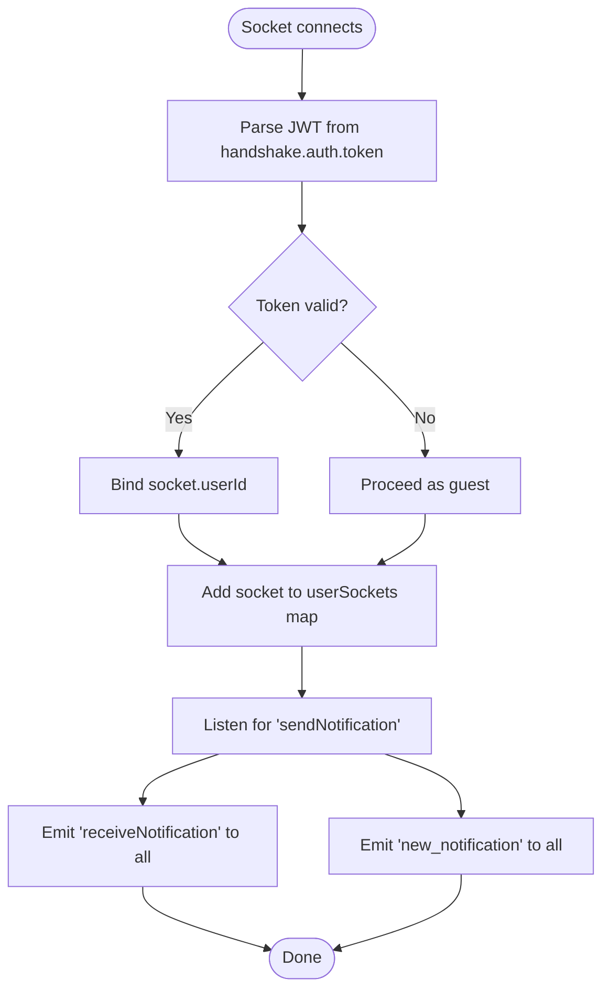
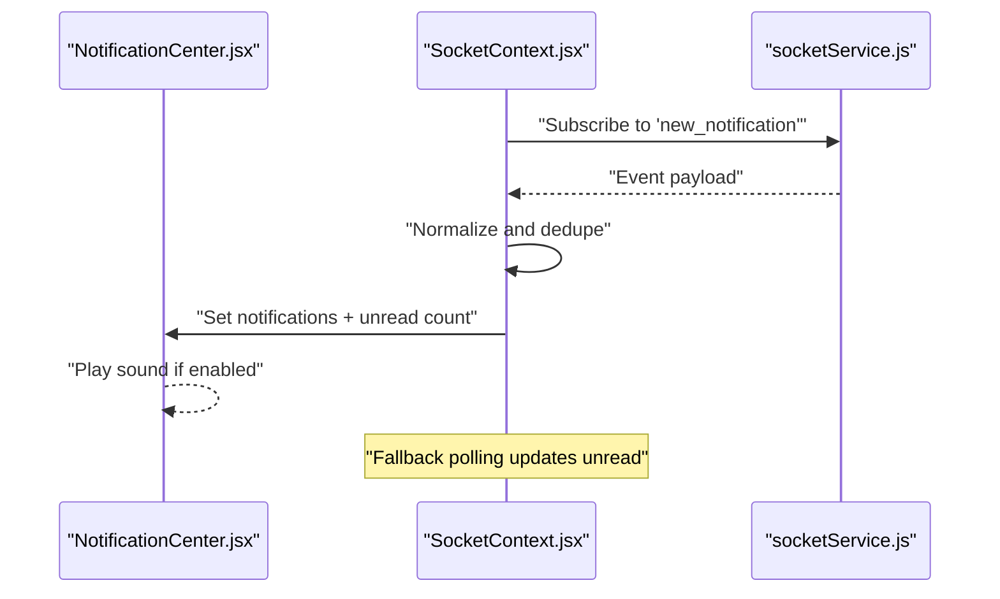
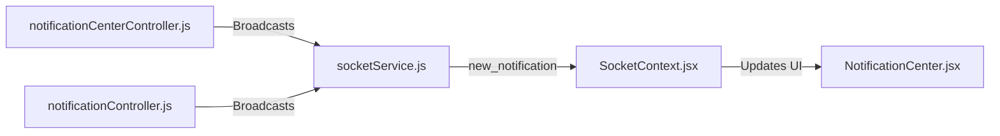
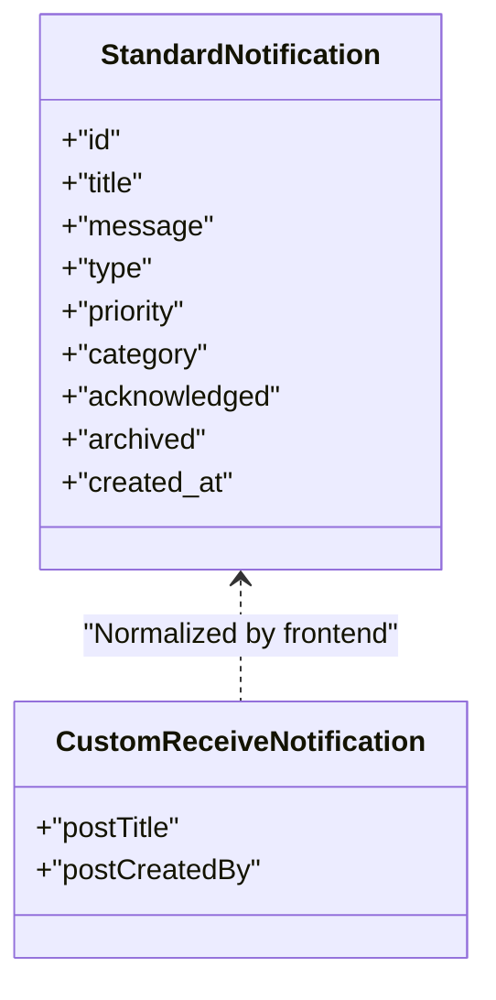
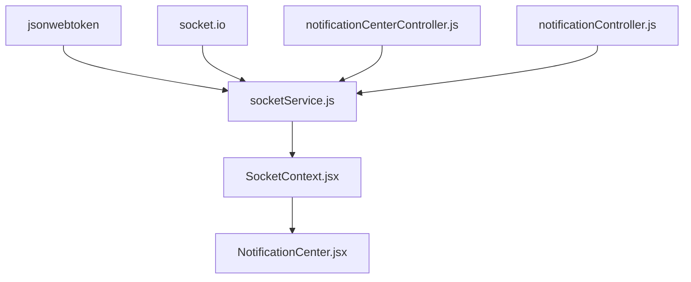

# Real-Time Communication

<cite>
**Referenced Files in This Document**
- [socketService.js](file://backend/src/services/socketService.js)
- [SocketContext.jsx](file://frontend/src/context/SocketContext.jsx)
- [NotificationCenter.jsx](file://frontend/src/components/NotificationCenter.jsx)
- [notificationCenterController.js](file://backend/src/controllers/notificationCenterController.js)
- [notificationController.js](file://backend/src/controllers/notificationController.js)
- [sender.html](file://frontend/public/sender.html)
</cite>

## Table of Contents
1. [Introduction](#introduction)
2. [Project Structure](#project-structure)
3. [Core Components](#core-components)
4. [Architecture Overview](#architecture-overview)
5. [Detailed Component Analysis](#detailed-component-analysis)
6. [Dependency Analysis](#dependency-analysis)
7. [Performance Considerations](#performance-considerations)
8. [Troubleshooting Guide](#troubleshooting-guide)
9. [Conclusion](#conclusion)

## Introduction
This document explains the real-time communication system built with WebSocket technology. It covers connection establishment, message broadcasting, and notification delivery. It also documents the notification center implementation, live dashboard updates, and real-time expense status changes. The document details message formats, event types, and subscription management, along with notification preferences, delivery confirmation, and fallback mechanisms. Scalability, connection pooling, and performance optimization are addressed, as well as the relationship between backend socket services and frontend context providers.

## Project Structure
The real-time system spans the backend and frontend:
- Backend: Socket service initialization, JWT-based authentication, per-user socket mapping, and broadcast helpers.
- Frontend: Socket provider managing connections, subscriptions, and fallback polling for notifications.
- Controllers: Notification center and notification APIs that integrate with the socket service.

**Diagram sources**
- [socketService.js](file://backend/src/services/socketService.js)
- [SocketContext.jsx](file://frontend/src/context/SocketContext.jsx)
- [NotificationCenter.jsx](file://frontend/src/components/NotificationCenter.jsx)
- [notificationCenterController.js](file://backend/src/controllers/notificationCenterController.js)
- [notificationController.js](file://backend/src/controllers/notificationController.js)
- [sender.html](file://frontend/public/sender.html)

**Section sources**
- [socketService.js](file://backend/src/services/socketService.js)
- [SocketContext.jsx](file://frontend/src/context/SocketContext.jsx)

## Core Components
- Backend socket service:
  - Initializes Socket.IO with CORS and flexible authentication.
  - Maintains a user-to-sockets map for targeted delivery.
  - Provides broadcast and per-user send helpers.
  - Emits standardized notification events to clients.
- Frontend socket provider:
  - Establishes connections with token-based auth and transport fallback.
  - Subscribes to real-time events and normalizes incoming notifications.
  - Implements fallback polling for notification unread counts.
  - Manages critical notification state and sound alerts.

**Section sources**
- [socketService.js](file://backend/src/services/socketService.js)
- [SocketContext.jsx](file://frontend/src/context/SocketContext.jsx)

## Architecture Overview
The system uses Socket.IO for bidirectional real-time messaging. Clients connect with optional JWT tokens. The backend authenticates tokens but allows guest connections. Notifications are broadcast to all clients or targeted to specific users. The frontend aggregates notifications, tracks unread counts, and provides fallback polling.

**Diagram sources**
- [SocketContext.jsx](file://frontend/src/context/SocketContext.jsx)
- [socketService.js](file://backend/src/services/socketService.js)
- [notificationCenterController.js](file://backend/src/controllers/notificationCenterController.js)

## Detailed Component Analysis

### Backend Socket Service
- Initialization and CORS:
  - Creates a Socket.IO server with permissive CORS for development and sets up a middleware to parse JWT tokens from handshake auth.
- Connection lifecycle:
  - On connection, associates the socket with the user ID if present and tracks multiple sockets per user.
  - On disconnect, removes the socket from the user’s set.
- Event handling:
  - Handles a custom sendNotification event, emitting two events:
    - A custom receiveNotification for arbitrary receivers.
    - A standardized new_notification for the main application.
- Delivery helpers:
  - sendToUser: emits an event to all sockets registered for a given user ID.
  - broadcast: emits an event to all connected clients.

**Diagram sources**
- [socketService.js](file://backend/src/services/socketService.js)

**Section sources**
- [socketService.js](file://backend/src/services/socketService.js)

### Frontend Socket Provider
- Connection setup:
  - Uses token-based authentication and supports both WebSocket and polling transports with exponential backoff and timeouts.
  - Logs synchronization status upon successful connection.
- Subscription and normalization:
  - Subscribes to new_notification and receiveNotification events.
  - Normalizes receiveNotification into a standardized notification object.
  - Deduplicates notifications using an in-memory set keyed by notification ID.
- State management:
  - Updates the notifications array and unread count.
  - Tracks critical notifications requiring immediate attention.
  - Plays sounds for new notifications when enabled.
- Fallback polling:
  - Fetches unread notifications periodically when real-time is unavailable.
  - Uses a 30-second interval and plays sounds on subsequent checks.

**Diagram sources**
- [SocketContext.jsx](file://frontend/src/context/SocketContext.jsx)
- [socketService.js](file://backend/src/services/socketService.js)

**Section sources**
- [SocketContext.jsx](file://frontend/src/context/SocketContext.jsx)

### Notification Center Implementation
- Backend controllers:
  - notificationCenterController.js exposes endpoints for the notification center.
  - notificationController.js exposes endpoints for notification actions.
  - These controllers can trigger broadcasts via the socket service to emit standardized events consumed by the frontend.
- Frontend UI:
  - NotificationCenter.jsx renders notifications, handles read/acknowledge actions, and integrates with the socket provider for live updates.

**Diagram sources**
- [notificationCenterController.js](file://backend/src/controllers/notificationCenterController.js)
- [notificationController.js](file://backend/src/controllers/notificationController.js)
- [socketService.js](file://backend/src/services/socketService.js)
- [SocketContext.jsx](file://frontend/src/context/SocketContext.jsx)
- [NotificationCenter.jsx](file://frontend/src/components/NotificationCenter.jsx)

**Section sources**
- [notificationCenterController.js](file://backend/src/controllers/notificationCenterController.js)
- [notificationController.js](file://backend/src/controllers/notificationController.js)
- [socketService.js](file://backend/src/services/socketService.js)
- [SocketContext.jsx](file://frontend/src/context/SocketContext.jsx)
- [NotificationCenter.jsx](file://frontend/src/components/NotificationCenter.jsx)

### Live Dashboard Updates and Expense Status Changes
- The frontend’s socket provider subscribes to real-time events and updates the UI state immediately.
- For expense-related updates, the backend can emit events through the same socket service, which the frontend consumes to refresh dashboards and lists without page reloads.
- Fallback polling ensures periodic refresh of unread counts and related metrics.

**Section sources**
- [SocketContext.jsx](file://frontend/src/context/SocketContext.jsx)

### Message Formats and Event Types
- Standardized notification event:
  - Fields include identifiers, title, message, type, priority, category, acknowledgment/archived flags, and timestamps.
- Custom user event:
  - receiveNotification is emitted by the backend and normalized into the standardized format on the frontend.
- Example client:
  - sender.html demonstrates emitting a custom sendNotification event with postTitle and postCreatedBy fields.

**Diagram sources**
- [socketService.js](file://backend/src/services/socketService.js)
- [SocketContext.jsx](file://frontend/src/context/SocketContext.jsx)
- [sender.html](file://frontend/public/sender.html)

**Section sources**
- [socketService.js](file://backend/src/services/socketService.js)
- [SocketContext.jsx](file://frontend/src/context/SocketContext.jsx)
- [sender.html](file://frontend/public/sender.html)

### Subscription Management
- Per-user targeting:
  - The backend maintains a map of user IDs to socket IDs and can emit to all sockets of a user.
- Broadcasting:
  - The broadcast helper emits events to all connected clients.
- Frontend subscriptions:
  - The provider listens to specific events and manages deduplication and state updates.

**Section sources**
- [socketService.js](file://backend/src/services/socketService.js)
- [SocketContext.jsx](file://frontend/src/context/SocketContext.jsx)

### Notification Preferences, Delivery Confirmation, and Fallback Mechanisms
- Preferences:
  - The frontend tracks whether to play sounds for new notifications and manages critical notifications.
- Delivery confirmation:
  - The backend emits events to all clients; the frontend acknowledges receipt and updates state.
- Fallback:
  - Periodic polling keeps unread counts current when real-time is unavailable.

**Section sources**
- [SocketContext.jsx](file://frontend/src/context/SocketContext.jsx)

## Dependency Analysis
- Backend depends on Socket.IO and JWT for authentication.
- Frontend depends on Socket.IO client and React context for state management.
- Controllers depend on the socket service to publish events.
- Frontend components depend on the socket provider for live updates.

**Diagram sources**
- [socketService.js](file://backend/src/services/socketService.js)
- [SocketContext.jsx](file://frontend/src/context/SocketContext.jsx)
- [notificationCenterController.js](file://backend/src/controllers/notificationCenterController.js)
- [notificationController.js](file://backend/src/controllers/notificationController.js)

**Section sources**
- [socketService.js](file://backend/src/services/socketService.js)
- [SocketContext.jsx](file://frontend/src/context/SocketContext.jsx)

## Performance Considerations
- Connection pooling and reuse:
  - Socket.IO manages persistent connections and multiplexes events efficiently.
- Transport selection:
  - Prefer WebSocket when available; fall back to long polling automatically.
- Backoff and timeouts:
  - Configured reconnection attempts, delays, and timeouts improve resilience under network issues.
- Deduplication:
  - Prevents redundant UI updates by tracking seen notification IDs.
- Polling cadence:
  - 30-second intervals balance freshness and load.

[No sources needed since this section provides general guidance]

## Troubleshooting Guide
- Connection issues:
  - Verify CORS settings on the server and ensure the client passes the auth token.
  - Check reconnection logs and delays in the provider.
- Missing notifications:
  - Confirm the backend emits the correct event names and the frontend subscribes to them.
  - Ensure deduplication logic does not suppress legitimate new notifications.
- Fallback polling:
  - If real-time fails, confirm the polling interval and endpoint availability.

**Section sources**
- [socketService.js](file://backend/src/services/socketService.js)
- [SocketContext.jsx](file://frontend/src/context/SocketContext.jsx)

## Conclusion
The real-time communication system leverages Socket.IO to deliver live updates and notifications. The backend provides flexible authentication, robust broadcasting, and per-user targeting. The frontend offers resilient subscriptions, normalization, and fallback polling. Together, they support live dashboards, notification centers, and real-time expense status updates with scalable and maintainable architecture.