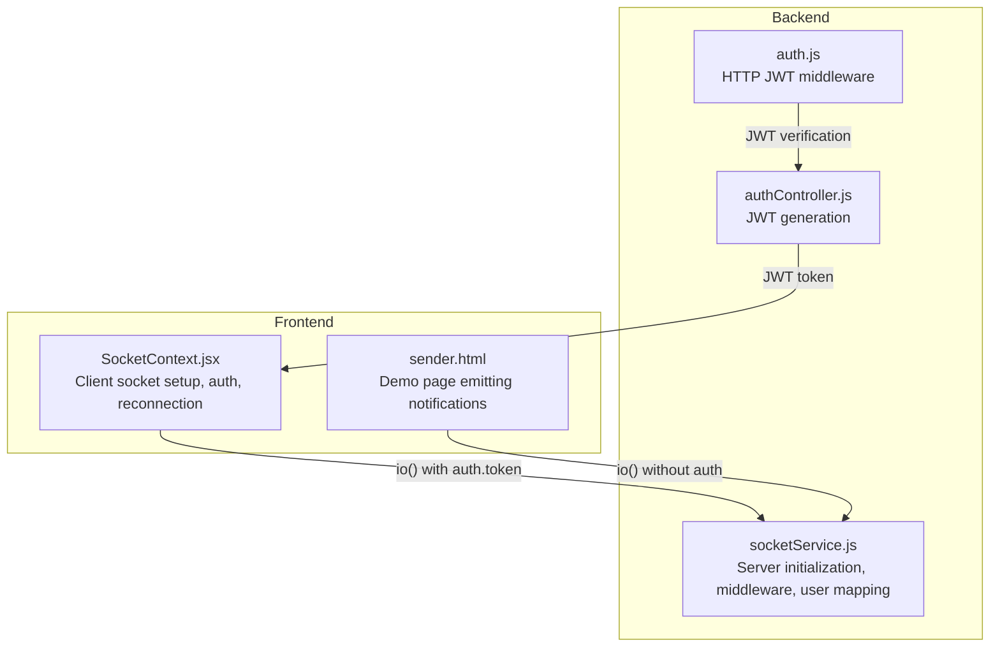
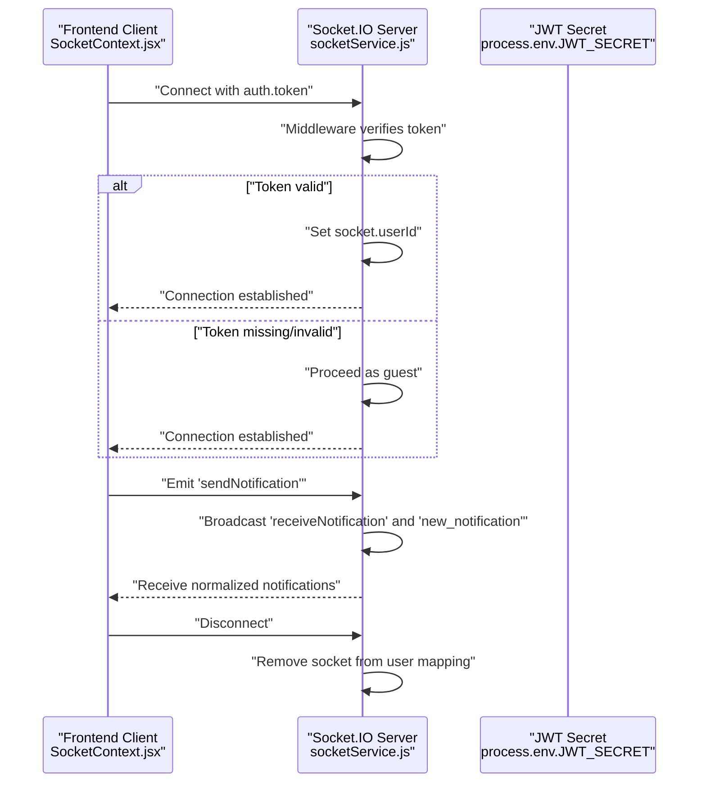
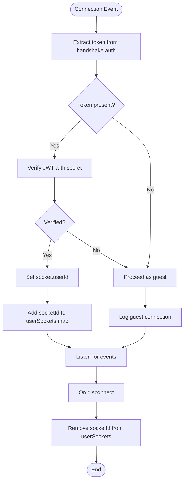
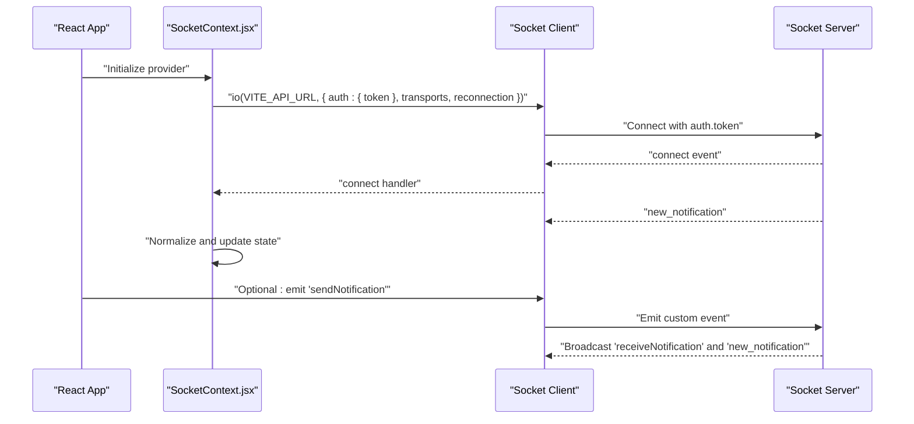
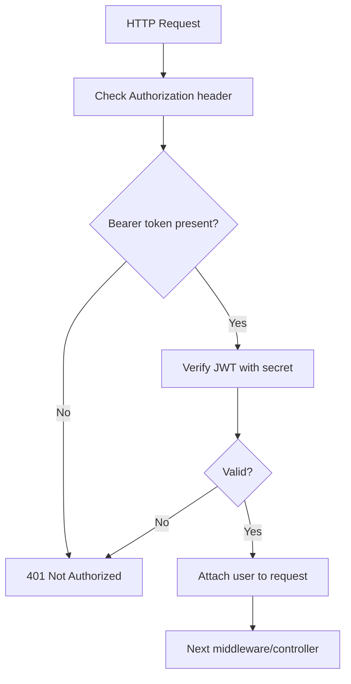
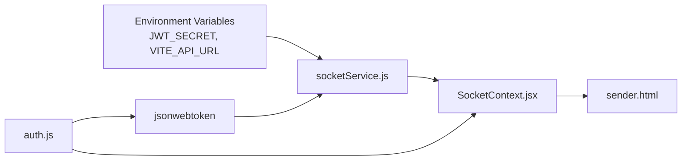

# WebSocket Implementation

<cite>
**Referenced Files in This Document**
- [socketService.js](file://backend/src/services/socketService.js)
- [SocketContext.jsx](file://frontend/src/context/SocketContext.jsx)
- [sender.html](file://frontend/public/sender.html)
- [auth.js](file://backend/src/middleware/auth.js)
- [authController.js](file://backend/src/controllers/authController.js)
</cite>

## Table of Contents
1. [Introduction](#introduction)
2. [Project Structure](#project-structure)
3. [Core Components](#core-components)
4. [Architecture Overview](#architecture-overview)
5. [Detailed Component Analysis](#detailed-component-analysis)
6. [Dependency Analysis](#dependency-analysis)
7. [Performance Considerations](#performance-considerations)
8. [Troubleshooting Guide](#troubleshooting-guide)
9. [Conclusion](#conclusion)

## Introduction
This document provides comprehensive documentation for the WebSocket implementation using Socket.IO. It covers connection establishment, flexible authentication with JWT tokens, user socket management, lifecycle handling, configuration options, security considerations, and performance/scalability guidance. The implementation supports both authenticated users and guest connections, enabling real-time notifications and extensible event broadcasting.

## Project Structure
The WebSocket implementation spans the backend and frontend:
- Backend: Socket.IO server initialization, middleware, and user mapping logic
- Frontend: Socket.IO client initialization with authentication, reconnection, and event handling
- Shared authentication: JWT-based protection for HTTP routes and optional JWT-based identification for sockets

**Diagram sources**
- [socketService.js:7-27](file://backend/src/services/socketService.js#L7-L27)
- [SocketContext.jsx:211-219](file://frontend/src/context/SocketContext.jsx#L211-L219)
- [auth.js:3-21](file://backend/src/middleware/auth.js#L3-L21)
- [authController.js](file://backend/src/controllers/authController.js#L24)

**Section sources**
- [socketService.js:7-27](file://backend/src/services/socketService.js#L7-L27)
- [SocketContext.jsx:211-219](file://frontend/src/context/SocketContext.jsx#L211-L219)

## Core Components
- Socket.IO Server Initialization: Creates the server with CORS configuration and attaches middleware and event handlers.
- Flexible Authentication Middleware: Parses JWT from handshake authentication; proceeds even if invalid, marking the connection as guest.
- User Socket Mapping: Maintains a map from user ID to active socket IDs for targeted messaging.
- Broadcasting Utilities: Provides functions to emit to specific users or globally.
- Client Socket Setup: Initializes the client with authentication, transport selection, and robust reconnection settings.

Key responsibilities:
- Establish connection and apply authentication policy
- Track user sessions and clean up on disconnect
- Normalize and broadcast notifications
- Expose APIs for targeted and broadcast emissions

**Section sources**
- [socketService.js:1-101](file://backend/src/services/socketService.js#L1-L101)
- [SocketContext.jsx:211-219](file://frontend/src/context/SocketContext.jsx#L211-L219)

## Architecture Overview
The system uses Socket.IO to enable bidirectional real-time communication. The backend enforces optional JWT-based user identification during connection, while the frontend authenticates by passing the token in the handshake. Events are normalized for the main application and optionally mirrored for custom receivers.

**Diagram sources**
- [socketService.js:15-27](file://backend/src/services/socketService.js#L15-L27)
- [socketService.js:29-61](file://backend/src/services/socketService.js#L29-L61)
- [SocketContext.jsx:211-219](file://frontend/src/context/SocketContext.jsx#L211-L219)
- [SocketContext.jsx:225-236](file://frontend/src/context/SocketContext.jsx#L225-L236)

## Detailed Component Analysis

### Backend Socket Service
Responsibilities:
- Initialize Socket.IO server with CORS
- Apply flexible authentication middleware
- Manage user-to-socket mapping
- Handle custom events and lifecycle cleanup

Implementation highlights:
- Server creation with CORS allowing GET/POST from any origin
- Middleware reads token from handshake.auth and validates it; on failure, continues as guest
- On connect, associates socket with user ID if available; logs connection state
- Emits two events on custom sendNotification: a custom event and a normalized event for the main application
- On disconnect, removes socket from user mapping and cleans up empty user entries

**Diagram sources**
- [socketService.js:15-27](file://backend/src/services/socketService.js#L15-L27)
- [socketService.js:29-72](file://backend/src/services/socketService.js#L29-L72)

**Section sources**
- [socketService.js:7-13](file://backend/src/services/socketService.js#L7-L13)
- [socketService.js:15-27](file://backend/src/services/socketService.js#L15-L27)
- [socketService.js:29-72](file://backend/src/services/socketService.js#L29-L72)
- [socketService.js:77-94](file://backend/src/services/socketService.js#L77-L94)

### Frontend Socket Context
Responsibilities:
- Initialize Socket.IO client with authentication, transport preferences, and reconnection settings
- Subscribe to normalized notification events
- Demonstrate custom event emission

Implementation highlights:
- Creates a new socket with auth.token, transports including polling and websocket, and reconnection parameters
- Listens for new_notification and mirrors it as a local notification
- Includes a demo HTML page that emits a custom sendNotification event

**Diagram sources**
- [SocketContext.jsx:211-219](file://frontend/src/context/SocketContext.jsx#L211-L219)
- [SocketContext.jsx:225-236](file://frontend/src/context/SocketContext.jsx#L225-L236)
- [sender.html:16-24](file://frontend/public/sender.html#L16-L24)

**Section sources**
- [SocketContext.jsx:211-219](file://frontend/src/context/SocketContext.jsx#L211-L219)
- [SocketContext.jsx:225-236](file://frontend/src/context/SocketContext.jsx#L225-L236)
- [sender.html:16-24](file://frontend/public/sender.html#L16-L24)

### Authentication Middleware and Controllers
While the socket middleware verifies JWT for optional user identification, HTTP routes enforce JWT-based protection and role checks. This ensures consistent authentication across the platform.

**Diagram sources**
- [auth.js:3-21](file://backend/src/middleware/auth.js#L3-L21)

**Section sources**
- [auth.js:3-21](file://backend/src/middleware/auth.js#L3-L21)
- [authController.js](file://backend/src/controllers/authController.js#L24)

## Dependency Analysis
- Socket.IO Server depends on:
  - CORS configuration for browser compatibility
  - JWT library for optional user identification
  - Internal event loop for connection, disconnection, and custom events
- Frontend Socket Client depends on:
  - Socket.IO client library bundled with the backend
  - Environment variable for API base URL
  - JWT token passed via handshake.auth

**Diagram sources**
- [socketService.js:1-2](file://backend/src/services/socketService.js#L1-L2)
- [SocketContext.jsx:211-219](file://frontend/src/context/SocketContext.jsx#L211-L219)
- [auth.js](file://backend/src/middleware/auth.js#L1)

**Section sources**
- [socketService.js:1-2](file://backend/src/services/socketService.js#L1-L2)
- [SocketContext.jsx:211-219](file://frontend/src/context/SocketContext.jsx#L211-L219)
- [auth.js](file://backend/src/middleware/auth.js#L1)

## Performance Considerations
- Transport selection: Prefer WebSocket when available; fall back to polling for broader compatibility. The frontend explicitly enables both transports.
- Reconnection strategy: Configure exponential backoff and max delays to reduce load during transient failures.
- Emission patterns: Use targeted emissions to specific users to minimize unnecessary broadcasts.
- Memory footprint: Maintain user-to-socket mapping efficiently; ensure cleanup on disconnect to prevent memory leaks.
- Scalability: For horizontal scaling, use a stateless server with shared state (e.g., Redis) to coordinate socket routing across instances.

[No sources needed since this section provides general guidance]

## Troubleshooting Guide
Common issues and resolutions:
- Token verification fails: The middleware logs a message and proceeds as guest. Ensure JWT_SECRET is configured and the token is valid.
- CORS errors: Confirm the backend CORS origin allows the frontend origin; adjust for production environments.
- No notifications received: Verify the client listens for the normalized event name and that the server emits it on the custom event.
- Disconnection cleanup: Ensure disconnect handlers remove sockets from the user mapping; check that empty user entries are deleted.

**Section sources**
- [socketService.js:15-27](file://backend/src/services/socketService.js#L15-L27)
- [socketService.js:63-71](file://backend/src/services/socketService.js#L63-L71)
- [SocketContext.jsx:225-236](file://frontend/src/context/SocketContext.jsx#L225-L236)

## Conclusion
The WebSocket implementation leverages Socket.IO to deliver real-time capabilities with a flexible authentication model. Connections are established securely when a valid JWT is provided, but guests are also supported. The backend maintains user-to-socket mappings for targeted messaging, while the frontend initializes sockets with robust reconnection and transport preferences. With proper CORS, transport configuration, and scalable state management, the system can support numerous concurrent connections reliably.