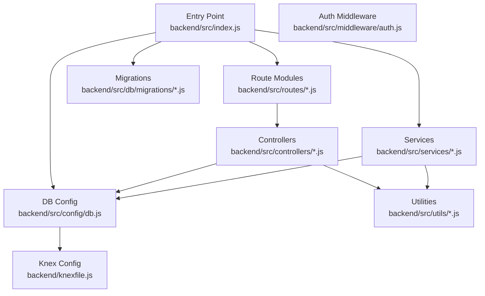
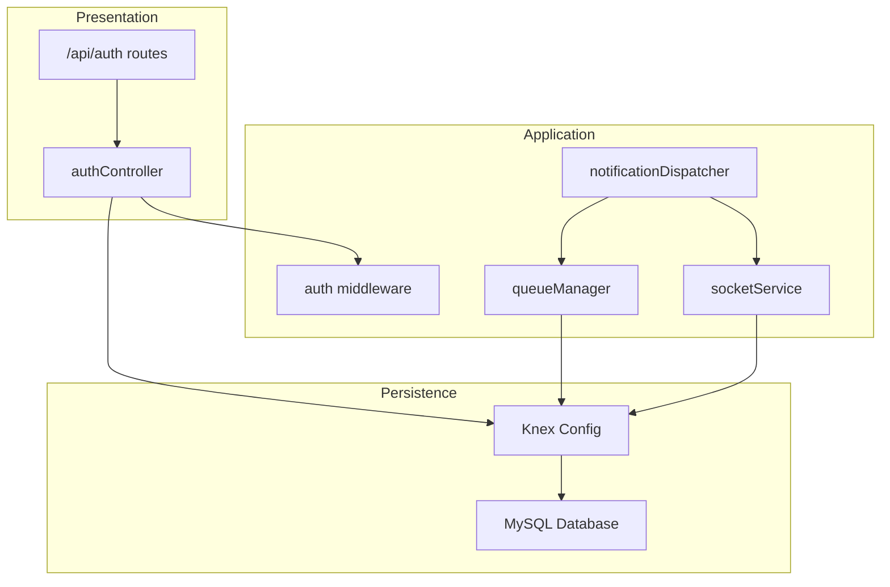
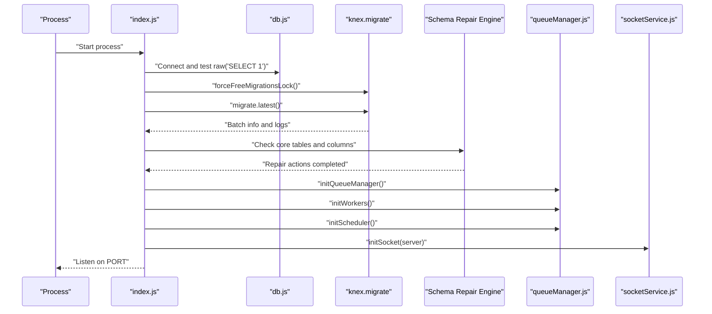
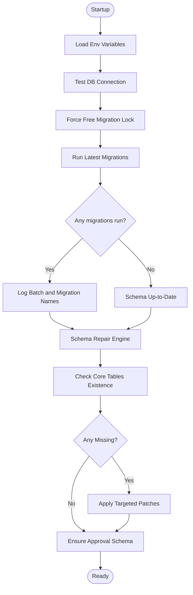
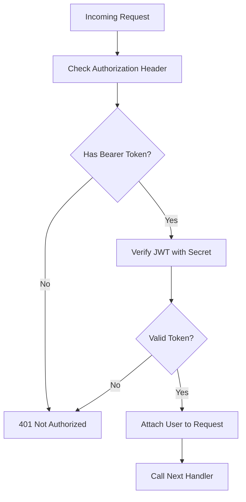
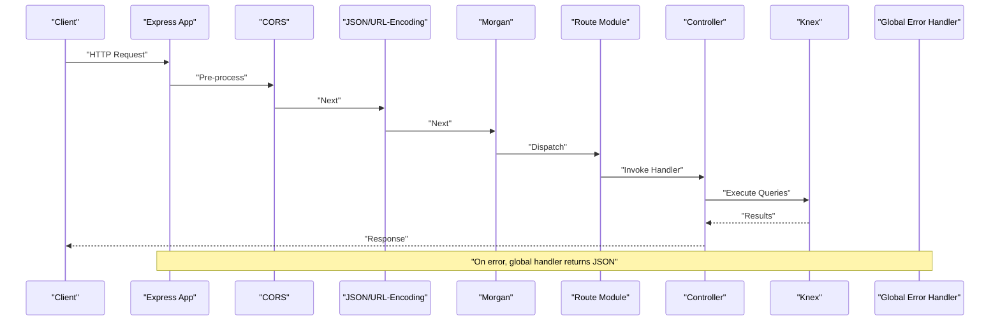
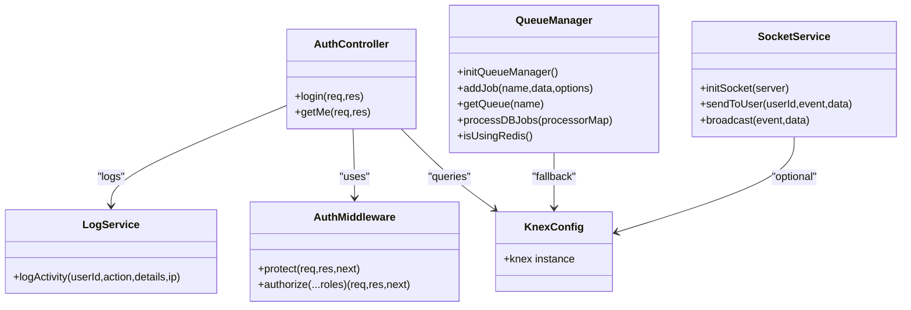
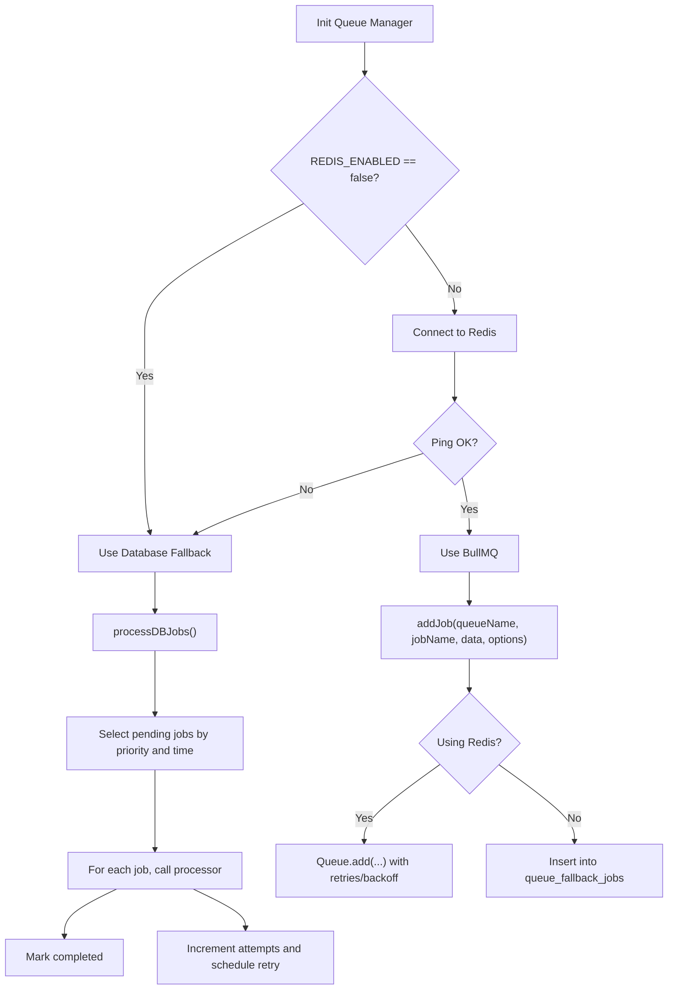
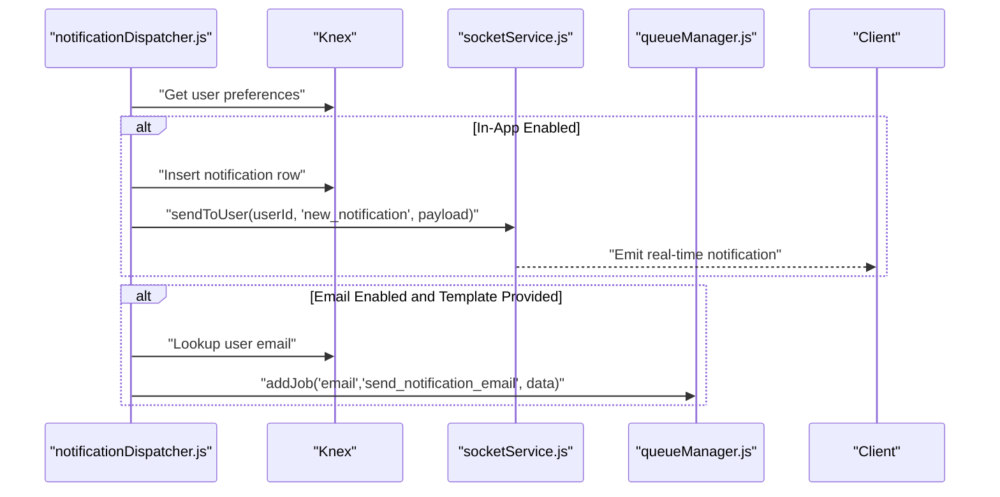
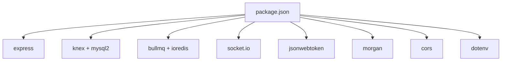

# Backend Architecture

<cite>
**Referenced Files in This Document**
- [index.js](file://backend/src/index.js)
- [db.js](file://backend/src/config/db.js)
- [auth.js](file://backend/src/middleware/auth.js)
- [knexfile.js](file://backend/knexfile.js)
- [authController.js](file://backend/src/controllers/authController.js)
- [auth.js](file://backend/src/routes/auth.js)
- [queueManager.js](file://backend/src/services/queueManager.js)
- [socketService.js](file://backend/src/services/socketService.js)
- [logService.js](file://backend/src/utils/logService.js)
- [run_migrations.js](file://backend/run_migrations.js)
- [20260512000000_initial_schema.js](file://backend/src/db/migrations/20260512000000_initial_schema.js)
- [20260512075907_create_funds_table.js](file://backend/src/db/migrations/20260512075907_create_funds_table.js)
- [notificationDispatcher.js](file://backend/src/services/notificationDispatcher.js)
- [package.json](file://backend/package.json)
</cite>

## Table of Contents
1. [Introduction](#introduction)
2. [Project Structure](#project-structure)
3. [Core Components](#core-components)
4. [Architecture Overview](#architecture-overview)
5. [Detailed Component Analysis](#detailed-component-analysis)
6. [Dependency Analysis](#dependency-analysis)
7. [Performance Considerations](#performance-considerations)
8. [Troubleshooting Guide](#troubleshooting-guide)
9. [Conclusion](#conclusion)

## Introduction
This document describes the backend architecture of a Node.js/Express-based petty cash management system. It focuses on server initialization, database connectivity and migrations, authentication middleware, layered architecture (controllers, services, database abstraction), middleware stack, error handling, request/response flow, configuration and environment management, dependency injection patterns, security, logging, and performance optimization.

## Project Structure
The backend follows a modular, layered structure:
- Entry point initializes services, runs migrations, sets up middleware, routes, and static assets.
- Configuration module encapsulates Knex database setup.
- Controllers handle HTTP endpoints and delegate to services.
- Services manage business logic, queueing, scheduling, and real-time communication.
- Utilities provide reusable helpers like logging.
- Knex migrations define and evolve the schema.
- Environment configuration is loaded via dotenv.

**Diagram sources**
- [index.js:1-240](file://backend/src/index.js#L1-L240)
- [db.js:1-8](file://backend/src/config/db.js#L1-L8)
- [knexfile.js:1-37](file://backend/knexfile.js#L1-L37)
- [auth.js:1-36](file://backend/src/middleware/auth.js#L1-L36)
- [auth.js:1-10](file://backend/src/routes/auth.js#L1-L10)
- [authController.js:1-66](file://backend/src/controllers/authController.js#L1-L66)
- [queueManager.js:1-126](file://backend/src/services/queueManager.js#L1-L126)
- [socketService.js:1-102](file://backend/src/services/socketService.js#L1-L102)
- [logService.js:1-24](file://backend/src/utils/logService.js#L1-L24)
- [20260512000000_initial_schema.js:1-159](file://backend/src/db/migrations/20260512000000_initial_schema.js#L1-L159)
- [20260512075907_create_funds_table.js:1-44](file://backend/src/db/migrations/20260512075907_create_funds_table.js#L1-L44)

**Section sources**
- [index.js:1-240](file://backend/src/index.js#L1-L240)
- [db.js:1-8](file://backend/src/config/db.js#L1-L8)
- [knexfile.js:1-37](file://backend/knexfile.js#L1-L37)

## Core Components
- Server Initialization and Lifecycle
  - Loads environment variables, initializes HTTP server, and registers middleware and routes.
  - Performs database diagnostics, runs migrations, and applies schema repair engine.
  - Initializes background services: queue manager, workers, scheduler, and Socket.IO.
  - Exposes admin UI for queue monitoring when Redis is enabled.
  - Serves frontend static assets in production and handles SPA fallback.
  - Registers global error handler and health check endpoint.
- Database Abstraction and Migration
  - Knex configured per environment with MySQL client.
  - Migration runner invoked during startup and via dedicated script.
  - Repair engine ensures critical tables and columns exist and are complete.
- Authentication Middleware
  - Validates JWT tokens from Authorization header and attaches user context.
  - Role-based authorization guard supports role checks.
- Layered Architecture
  - Controllers: route handlers for HTTP endpoints.
  - Services: business logic, queueing, scheduling, and real-time features.
  - Database Abstraction: Knex queries executed through centralized config.
  - Utilities: logging and other shared helpers.

**Section sources**
- [index.js:1-240](file://backend/src/index.js#L1-L240)
- [db.js:1-8](file://backend/src/config/db.js#L1-L8)
- [knexfile.js:1-37](file://backend/knexfile.js#L1-L37)
- [auth.js:1-36](file://backend/src/middleware/auth.js#L1-L36)
- [authController.js:1-66](file://backend/src/controllers/authController.js#L1-L66)

## Architecture Overview
The system uses a layered architecture with clear separation of concerns:
- Presentation Layer: Express routes and controllers.
- Application Layer: Services orchestrating business logic.
- Persistence Layer: Knex-based database abstraction.
- Infrastructure Layer: Background jobs, sockets, and environment configuration.

**Diagram sources**
- [index.js:160-178](file://backend/src/index.js#L160-L178)
- [auth.js:1-10](file://backend/src/routes/auth.js#L1-L10)
- [authController.js:1-66](file://backend/src/controllers/authController.js#L1-L66)
- [auth.js:1-36](file://backend/src/middleware/auth.js#L1-L36)
- [notificationDispatcher.js:1-68](file://backend/src/services/notificationDispatcher.js#L1-L68)
- [queueManager.js:1-126](file://backend/src/services/queueManager.js#L1-L126)
- [socketService.js:1-102](file://backend/src/services/socketService.js#L1-L102)
- [db.js:1-8](file://backend/src/config/db.js#L1-L8)

## Detailed Component Analysis

### Server Initialization and Startup Flow
The entry point coordinates:
- Environment loading and service initialization.
- Database connectivity test and migration execution.
- Schema repair engine to ensure completeness.
- Queue manager, workers, scheduler, and Socket.IO setup.
- Middleware registration (CORS, JSON parsing, Morgan logging).
- Route mounting and static asset serving.
- Global error handler and health check.

**Diagram sources**
- [index.js:28-149](file://backend/src/index.js#L28-L149)
- [db.js:1-8](file://backend/src/config/db.js#L1-L8)
- [run_migrations.js:1-21](file://backend/run_migrations.js#L1-L21)

**Section sources**
- [index.js:28-149](file://backend/src/index.js#L28-L149)
- [run_migrations.js:1-21](file://backend/run_migrations.js#L1-L21)

### Database Connection Management and Migration System
- Knex configuration is environment-driven and loaded from a central file.
- During startup, the system forces free migration locks, runs latest migrations, and logs results.
- A robust schema repair engine validates and reconstructs missing tables/columns, including specialized patches for expenses and notifications.
- A separate migration runner script is available for CI/CD or manual operations.

**Diagram sources**
- [index.js:32-118](file://backend/src/index.js#L32-L118)
- [db.js:1-8](file://backend/src/config/db.js#L1-L8)
- [knexfile.js:1-37](file://backend/knexfile.js#L1-L37)
- [20260512000000_initial_schema.js:1-159](file://backend/src/db/migrations/20260512000000_initial_schema.js#L1-L159)
- [20260512075907_create_funds_table.js:1-44](file://backend/src/db/migrations/20260512075907_create_funds_table.js#L1-L44)

**Section sources**
- [db.js:1-8](file://backend/src/config/db.js#L1-L8)
- [knexfile.js:1-37](file://backend/knexfile.js#L1-L37)
- [index.js:32-118](file://backend/src/index.js#L32-L118)

### Authentication Middleware Implementation
- Request protection verifies Authorization Bearer token and decodes JWT.
- Role-based authorization enforces allowed roles.
- On success, the authenticated user object is attached to the request for downstream use.

**Diagram sources**
- [auth.js:3-21](file://backend/src/middleware/auth.js#L3-L21)

**Section sources**
- [auth.js:1-36](file://backend/src/middleware/auth.js#L1-L36)

### Middleware Stack and Request/Response Flow
- Order of middleware: CORS, JSON body parsing, URL-encoded parsing, Morgan logging.
- Static upload serving and SPA fallback routing.
- Route modules import controllers and apply middleware where needed.
- Global error handler responds with structured JSON.

**Diagram sources**
- [index.js:151-178](file://backend/src/index.js#L151-L178)
- [auth.js:1-10](file://backend/src/routes/auth.js#L1-L10)
- [authController.js:1-66](file://backend/src/controllers/authController.js#L1-L66)

**Section sources**
- [index.js:151-178](file://backend/src/index.js#L151-L178)
- [auth.js:1-10](file://backend/src/routes/auth.js#L1-L10)
- [authController.js:1-66](file://backend/src/controllers/authController.js#L1-L66)

### Layered Architecture Pattern: Controllers, Services, Database Abstraction
- Controllers: Thin HTTP handlers that validate inputs, call services, and return responses.
- Services: Encapsulate business logic, integrate with queueing, scheduling, and real-time features.
- Database Abstraction: Centralized Knex configuration consumed by controllers and services.

**Diagram sources**
- [authController.js:1-66](file://backend/src/controllers/authController.js#L1-L66)
- [auth.js:1-36](file://backend/src/middleware/auth.js#L1-L36)
- [queueManager.js:1-126](file://backend/src/services/queueManager.js#L1-L126)
- [socketService.js:1-102](file://backend/src/services/socketService.js#L1-L102)
- [logService.js:1-24](file://backend/src/utils/logService.js#L1-L24)
- [db.js:1-8](file://backend/src/config/db.js#L1-L8)

**Section sources**
- [authController.js:1-66](file://backend/src/controllers/authController.js#L1-L66)
- [queueManager.js:1-126](file://backend/src/services/queueManager.js#L1-L126)
- [socketService.js:1-102](file://backend/src/services/socketService.js#L1-L102)
- [logService.js:1-24](file://backend/src/utils/logService.js#L1-L24)
- [db.js:1-8](file://backend/src/config/db.js#L1-L8)

### Background Jobs and Queue Management
- Queue manager supports Redis-backed BullMQ with graceful fallback to database-backed jobs.
- Automatic retry and exponential backoff for Redis jobs; database fallback persists pending jobs.
- Scheduler and workers are initialized at startup; optional Bull Board UI is exposed when Redis is enabled.

**Diagram sources**
- [queueManager.js:9-116](file://backend/src/services/queueManager.js#L9-L116)

**Section sources**
- [queueManager.js:1-126](file://backend/src/services/queueManager.js#L1-L126)

### Real-Time Notifications and Broadcasting
- Socket.IO server is initialized with JWT-based flexible authentication.
- Notification dispatcher writes in-app notifications and optionally enqueues emails via queue manager.
- Real-time updates are sent to connected clients per user session.

**Diagram sources**
- [notificationDispatcher.js:5-63](file://backend/src/services/notificationDispatcher.js#L5-L63)
- [socketService.js:77-86](file://backend/src/services/socketService.js#L77-L86)
- [queueManager.js:61-85](file://backend/src/services/queueManager.js#L61-L85)

**Section sources**
- [notificationDispatcher.js:1-68](file://backend/src/services/notificationDispatcher.js#L1-L68)
- [socketService.js:1-102](file://backend/src/services/socketService.js#L1-L102)
- [queueManager.js:1-126](file://backend/src/services/queueManager.js#L1-L126)

### Logging Strategy
- Activity logging utility inserts records into the activity logs table.
- Controllers leverage logging for audit trails (e.g., login events).
- Morgan provides HTTP request logging.

**Section sources**
- [logService.js:1-24](file://backend/src/utils/logService.js#L1-L24)
- [authController.js:20-47](file://backend/src/controllers/authController.js#L20-L47)
- [index.js:155-155](file://backend/src/index.js#L155-L155)

### Security Implementations
- JWT-based authentication with protected routes and role-based authorization.
- CORS enabled; Socket.IO handshake supports token-based identification.
- Environment variables for secrets and database credentials.

**Section sources**
- [auth.js:1-36](file://backend/src/middleware/auth.js#L1-L36)
- [socketService.js:16-27](file://backend/src/services/socketService.js#L16-L27)
- [knexfile.js:7-11](file://backend/knexfile.js#L7-L11)

### Environment Management and Dependency Injection
- Environment variables loaded via dotenv at startup.
- Knex instance injected as a singleton module for reuse across controllers and services.
- Services depend on the Knex module rather than hardcoding connections.

**Section sources**
- [index.js:3-5](file://backend/src/index.js#L3-L5)
- [db.js:1-8](file://backend/src/config/db.js#L1-L8)
- [package.json:1-50](file://backend/package.json#L1-L50)

## Dependency Analysis
External dependencies include Express, Knex, BullMQ, Socket.IO, Morgan, JWT, and others. The system uses a centralized Knex configuration and environment-driven setup.

**Diagram sources**
- [package.json:17-38](file://backend/package.json#L17-L38)

**Section sources**
- [package.json:1-50](file://backend/package.json#L1-L50)

## Performance Considerations
- Queueing: Prefer Redis-backed BullMQ for high throughput; fallback to database jobs for reliability.
- Database: Use Knex migrations to maintain schema consistency; repair engine prevents runtime failures due to missing tables/columns.
- Logging: Keep activity logs minimal and asynchronous where possible to reduce latency.
- Static Assets: Serve immutable assets with long cache lifetimes; disable caching for index.html to avoid stale SPAs.
- Health Checks: Use the /health endpoint for load balancer probes.

## Troubleshooting Guide
- Database Connectivity
  - Confirm environment variables for database host, user, password, and name.
  - Verify migrations ran successfully and schema repair did not report failures.
- Authentication Failures
  - Ensure JWT secret is set and consistent across deployments.
  - Confirm Authorization header format: Bearer <token>.
- Queue Issues
  - Check Redis availability if using BullMQ; fallback to database jobs is automatic.
  - Inspect queue_fallback_jobs for stuck or failing entries.
- Socket.IO
  - Validate token presence in handshake auth; ensure server CORS allows connections.

**Section sources**
- [index.js:32-125](file://backend/src/index.js#L32-L125)
- [auth.js:14-20](file://backend/src/middleware/auth.js#L14-L20)
- [queueManager.js:16-51](file://backend/src/services/queueManager.js#L16-L51)
- [socketService.js:16-27](file://backend/src/services/socketService.js#L16-L27)

## Conclusion
The backend employs a clean, layered architecture with strong separation between presentation, application, persistence, and infrastructure concerns. It leverages Knex for database operations, BullMQ for background tasks, Socket.IO for real-time updates, and JWT for secure access. Robust startup routines, migration orchestration, and schema repair ensure operational resilience. The documented patterns enable maintainability, scalability, and straightforward extension.