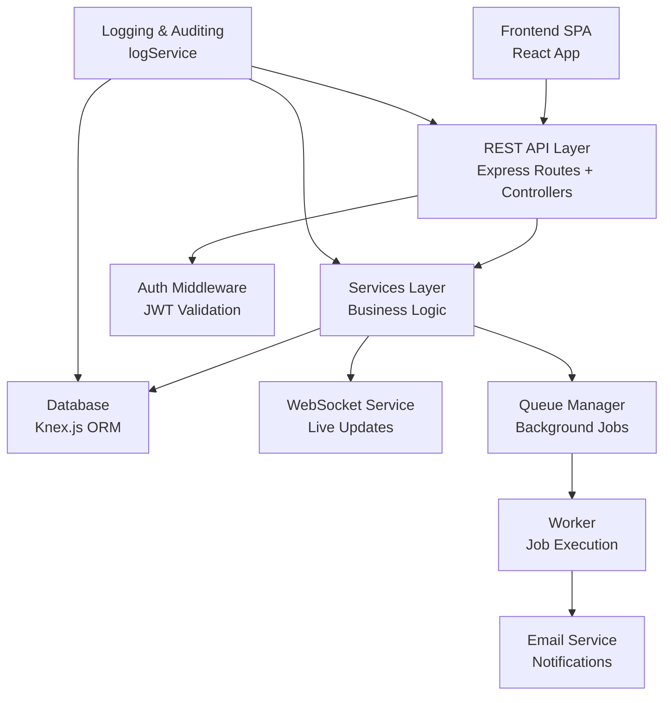
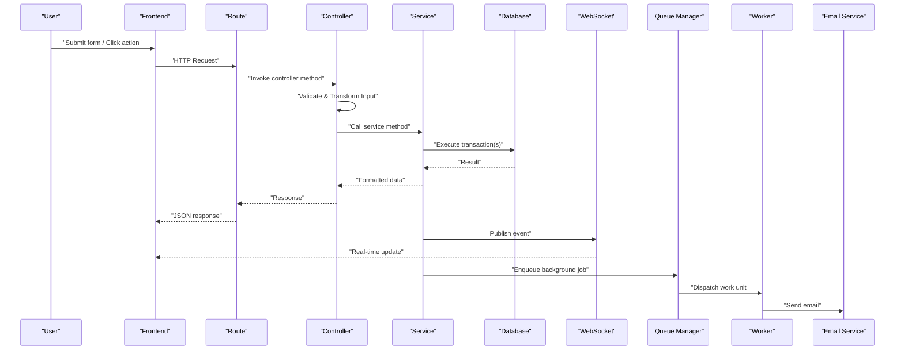
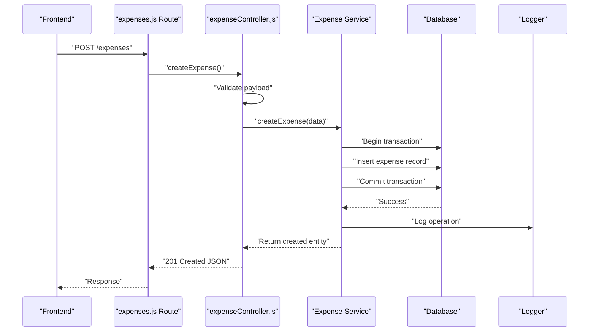
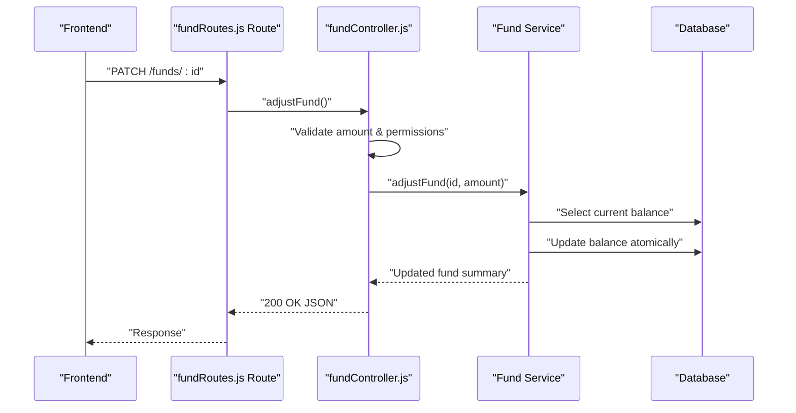
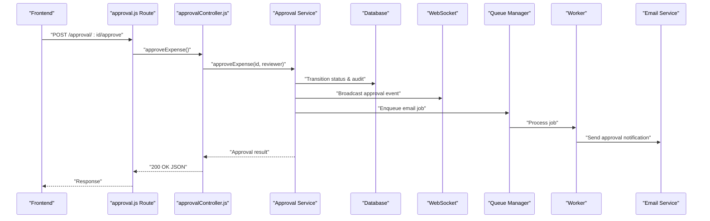
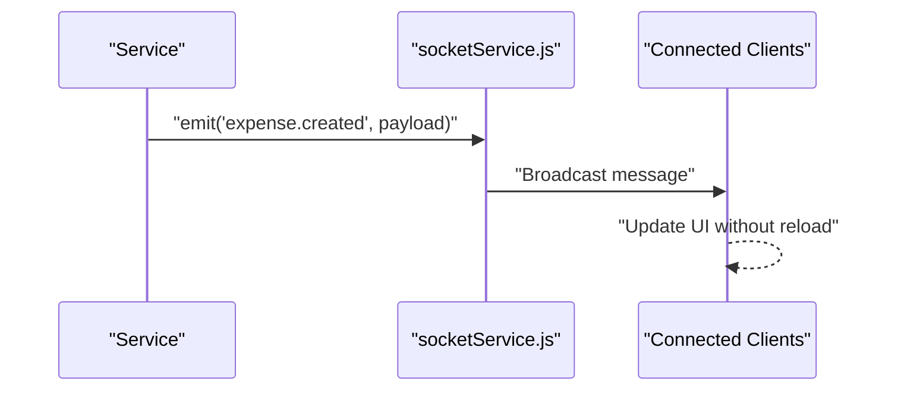
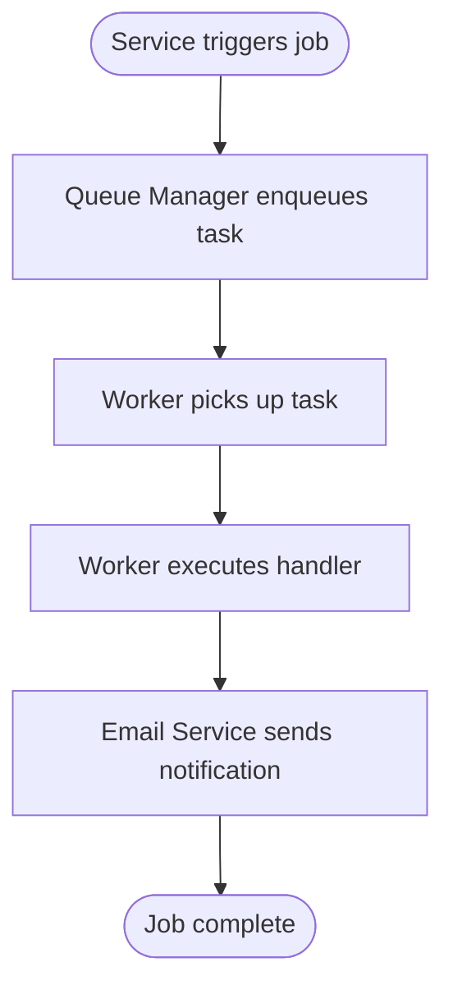
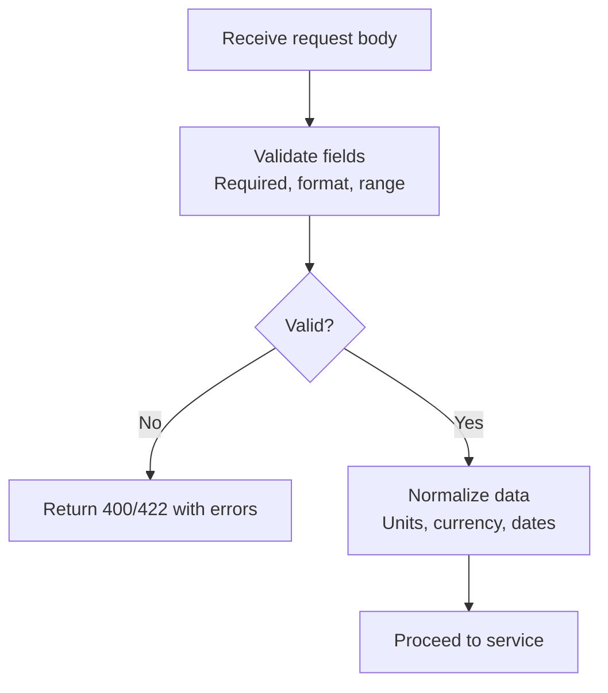
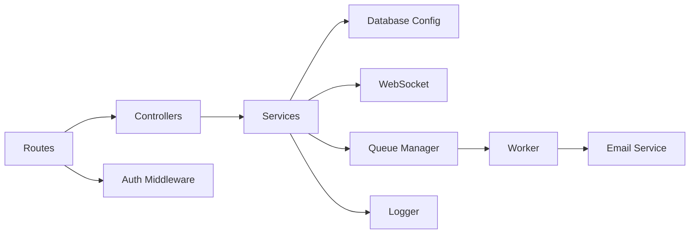

# Data Flow Architecture

<cite>
**Referenced Files in This Document**
- [index.js](file://backend/src/index.js)
- [db.js](file://backend/src/config/db.js)
- [knexfile.js](file://backend/knexfile.js)
- [auth.js](file://backend/src/middleware/auth.js)
- [expenseController.js](file://backend/src/controllers/expenseController.js)
- [fundController.js](file://backend/src/controllers/fundController.js)
- [approvalController.js](file://backend/src/controllers/approvalController.js)
- [notificationController.js](file://backend/src/controllers/notificationController.js)
- [socketService.js](file://backend/src/services/socketService.js)
- [queueManager.js](file://backend/src/services/queueManager.js)
- [worker.js](file://backend/src/services/worker.js)
- [emailService.js](file://backend/src/services/emailService.js)
- [expenses.js](file://backend/src/routes/expenses.js)
- [fundRoutes.js](file://backend/src/routes/fundRoutes.js)
- [approval.js](file://backend/src/routes/approval.js)
- [notifications.js](file://backend/src/routes/notifications.js)
- [logService.js](file://backend/src/utils/logService.js)
- [api.js](file://frontend/src/services/api.js)
- [SocketContext.jsx](file://frontend/src/context/SocketContext.jsx)
</cite>

## Table of Contents
1. [Introduction](#introduction)
2. [Project Structure](#project-structure)
3. [Core Components](#core-components)
4. [Architecture Overview](#architecture-overview)
5. [Detailed Component Analysis](#detailed-component-analysis)
6. [Dependency Analysis](#dependency-analysis)
7. [Performance Considerations](#performance-considerations)
8. [Troubleshooting Guide](#troubleshooting-guide)
9. [Conclusion](#conclusion)

## Introduction
This document explains the data flow architecture of the petty cash management system. It traces how user interactions in the frontend propagate through API endpoints, controllers, services, database operations, and real-time updates via WebSocket. It also covers validation, transformation, error propagation, transactions, logging, auditing, caching strategies, performance, consistency, and monitoring.

## Project Structure
The system follows a layered architecture:
- Frontend: React SPA with context providers for authentication and WebSocket connections
- Backend: Node.js server exposing REST APIs, organized by controllers, routes, services, middleware, and database configuration
- Database: Managed via Knex.js with migrations and seeds
- Real-time: WebSocket service for live updates
- Background jobs: Queue manager and worker for asynchronous tasks

**Diagram sources**
- [index.js](file://backend/src/index.js)
- [expenses.js](file://backend/src/routes/expenses.js)
- [socketService.js](file://backend/src/services/socketService.js)
- [queueManager.js](file://backend/src/services/queueManager.js)
- [worker.js](file://backend/src/services/worker.js)
- [emailService.js](file://backend/src/services/emailService.js)
- [logService.js](file://backend/src/utils/logService.js)

**Section sources**
- [index.js](file://backend/src/index.js)
- [knexfile.js](file://backend/knexfile.js)

## Core Components
- Entry point initializes Express app, loads routes, and starts server
- Database configuration integrates Knex.js for SQL operations
- Authentication middleware validates JWT tokens and attaches user context
- Controllers orchestrate request handling, validation, and response formatting
- Services encapsulate business logic, background job coordination, and external integrations
- WebSocket service enables real-time updates
- Queue manager and worker handle background tasks asynchronously
- Logging and auditing utilities track operations and errors

**Section sources**
- [index.js](file://backend/src/index.js)
- [db.js](file://backend/src/config/db.js)
- [auth.js](file://backend/src/middleware/auth.js)
- [logService.js](file://backend/src/utils/logService.js)

## Architecture Overview
The system implements a clean separation of concerns:
- Request lifecycle: Frontend → Route → Controller → Service → Model/DB → Response
- Validation occurs early in the pipeline (controller/service level)
- Transformation normalizes data for storage and presentation
- Real-time updates are broadcast via WebSocket after state changes
- Background jobs process non-blocking tasks (e.g., emails)

**Diagram sources**
- [expenses.js](file://backend/src/routes/expenses.js)
- [expenseController.js](file://backend/src/controllers/expenseController.js)
- [socketService.js](file://backend/src/services/socketService.js)
- [queueManager.js](file://backend/src/services/queueManager.js)
- [worker.js](file://backend/src/services/worker.js)
- [emailService.js](file://backend/src/services/emailService.js)

## Detailed Component Analysis

### Expense Management Data Path
This path demonstrates the controller-service-model pattern for expense CRUD operations.

**Diagram sources**
- [expenses.js](file://backend/src/routes/expenses.js)
- [expenseController.js](file://backend/src/controllers/expenseController.js)
- [logService.js](file://backend/src/utils/logService.js)

**Section sources**
- [expenses.js](file://backend/src/routes/expenses.js)
- [expenseController.js](file://backend/src/controllers/expenseController.js)

### Fund Management Data Path
Fund operations follow similar patterns with validation and transaction boundaries.

**Diagram sources**
- [fundRoutes.js](file://backend/src/routes/fundRoutes.js)
- [fundController.js](file://backend/src/controllers/fundController.js)

**Section sources**
- [fundRoutes.js](file://backend/src/routes/fundRoutes.js)
- [fundController.js](file://backend/src/controllers/fundController.js)

### Approval Workflow Data Path
Approvals involve state transitions, notifications, and potential liquidation workflows.

**Diagram sources**
- [approval.js](file://backend/src/routes/approval.js)
- [approvalController.js](file://backend/src/controllers/approvalController.js)
- [socketService.js](file://backend/src/services/socketService.js)
- [queueManager.js](file://backend/src/services/queueManager.js)
- [worker.js](file://backend/src/services/worker.js)
- [emailService.js](file://backend/src/services/emailService.js)

**Section sources**
- [approval.js](file://backend/src/routes/approval.js)
- [approvalController.js](file://backend/src/controllers/approvalController.js)

### Notification and Real-Time Updates
Real-time updates are published to connected clients upon state changes.

**Diagram sources**
- [socketService.js](file://backend/src/services/socketService.js)

**Section sources**
- [socketService.js](file://backend/src/services/socketService.js)

### Background Job Processing
Non-critical tasks (e.g., sending emails) are offloaded to workers.

**Diagram sources**
- [queueManager.js](file://backend/src/services/queueManager.js)
- [worker.js](file://backend/src/services/worker.js)
- [emailService.js](file://backend/src/services/emailService.js)

**Section sources**
- [queueManager.js](file://backend/src/services/queueManager.js)
- [worker.js](file://backend/src/services/worker.js)
- [emailService.js](file://backend/src/services/emailService.js)

### Data Validation and Transformation
Validation and transformation occur primarily in controllers and services:
- Input validation ensures required fields and type safety
- Transformation normalizes units, amounts, and timestamps
- Error responses are standardized across endpoints

**Section sources**
- [expenseController.js](file://backend/src/controllers/expenseController.js)
- [approvalController.js](file://backend/src/controllers/approvalController.js)

### Transaction Management
Database operations are wrapped in transactions to maintain consistency:
- Multi-step operations (e.g., fund adjustments) are atomic
- Rollback on errors prevents partial state changes
- Audit trails capture changes for compliance

**Section sources**
- [db.js](file://backend/src/config/db.js)

### Logging and Auditing
Logging captures:
- Request/response metadata
- Business events (approvals, fund adjustments)
- Errors and exceptions
- Audit trail entries for regulatory compliance

**Section sources**
- [logService.js](file://backend/src/utils/logService.js)

### Caching Strategies
While explicit caching is not observed in the analyzed files, recommended strategies include:
- Response caching for read-heavy endpoints (expenses, funds summaries)
- Redis-backed session cache for JWT refresh patterns
- In-memory caches for frequently accessed reference data (categories, departments)

[No sources needed since this section provides general guidance]

## Dependency Analysis
The backend exhibits clear layering with minimal cross-layer coupling:
- Routes depend on controllers
- Controllers depend on services
- Services depend on database configuration and external services
- Middleware (auth) is injected at route level
- Real-time and background job systems are loosely coupled via service interfaces

**Diagram sources**
- [expenses.js](file://backend/src/routes/expenses.js)
- [fundRoutes.js](file://backend/src/routes/fundRoutes.js)
- [approval.js](file://backend/src/routes/approval.js)
- [auth.js](file://backend/src/middleware/auth.js)
- [socketService.js](file://backend/src/services/socketService.js)
- [queueManager.js](file://backend/src/services/queueManager.js)
- [worker.js](file://backend/src/services/worker.js)
- [emailService.js](file://backend/src/services/emailService.js)
- [logService.js](file://backend/src/utils/logService.js)

**Section sources**
- [expenses.js](file://backend/src/routes/expenses.js)
- [fundRoutes.js](file://backend/src/routes/fundRoutes.js)
- [approval.js](file://backend/src/routes/approval.js)
- [auth.js](file://backend/src/middleware/auth.js)

## Performance Considerations
- Use pagination for list endpoints to limit payload sizes
- Apply database indexing on frequently filtered columns (status, date ranges, user IDs)
- Batch WebSocket updates for high-frequency events
- Implement connection pooling and query timeouts
- Cache static reference data and avoid N+1 queries
- Monitor slow endpoints and background job latency

[No sources needed since this section provides general guidance]

## Troubleshooting Guide
Common issues and resolutions:
- Authentication failures: Verify JWT token validity and middleware injection
- Validation errors: Inspect controller-level validators and error responses
- Transaction rollbacks: Check service-level error handling and rollback logic
- WebSocket disconnects: Confirm socket service initialization and client reconnection
- Background job failures: Review queue manager logs and worker error handling

**Section sources**
- [auth.js](file://backend/src/middleware/auth.js)
- [expenseController.js](file://backend/src/controllers/expenseController.js)
- [logService.js](file://backend/src/utils/logService.js)

## Conclusion
The petty cash system employs a robust, layered architecture ensuring clear data flow from frontend interactions to database persistence and real-time updates. Validation, transformation, transactions, logging, and background job processing collectively guarantee correctness, performance, and observability. Extending caching and monitoring further enhances scalability and operational reliability.