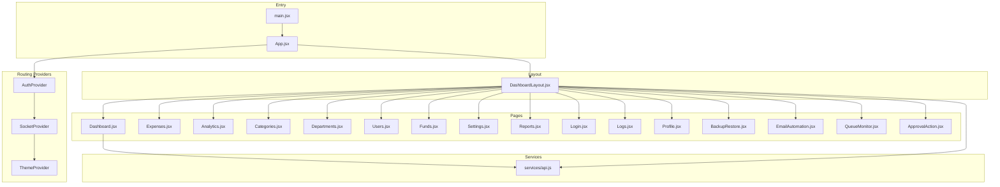
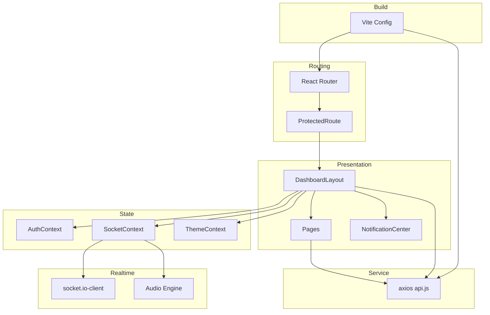
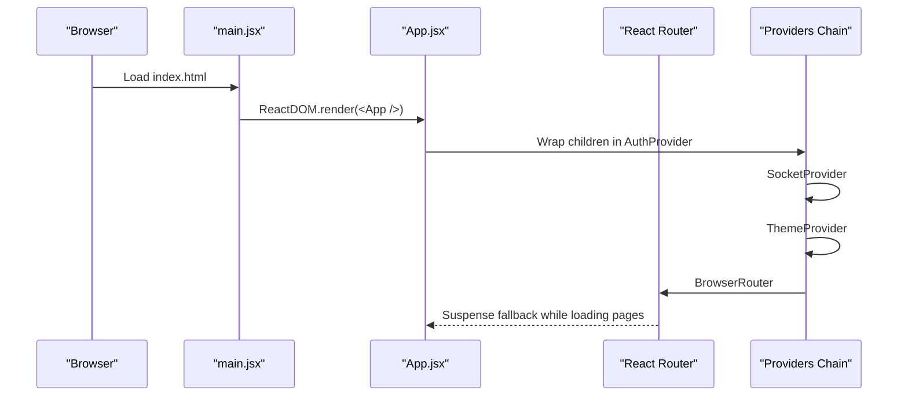
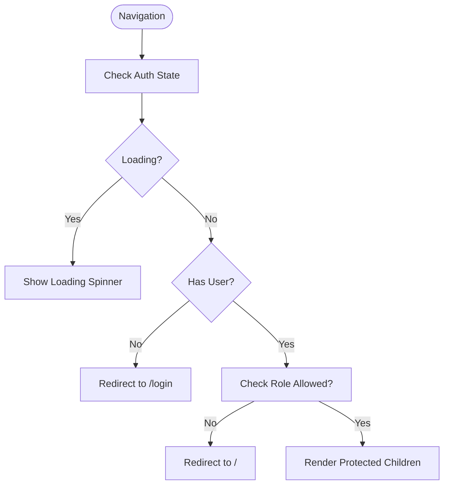
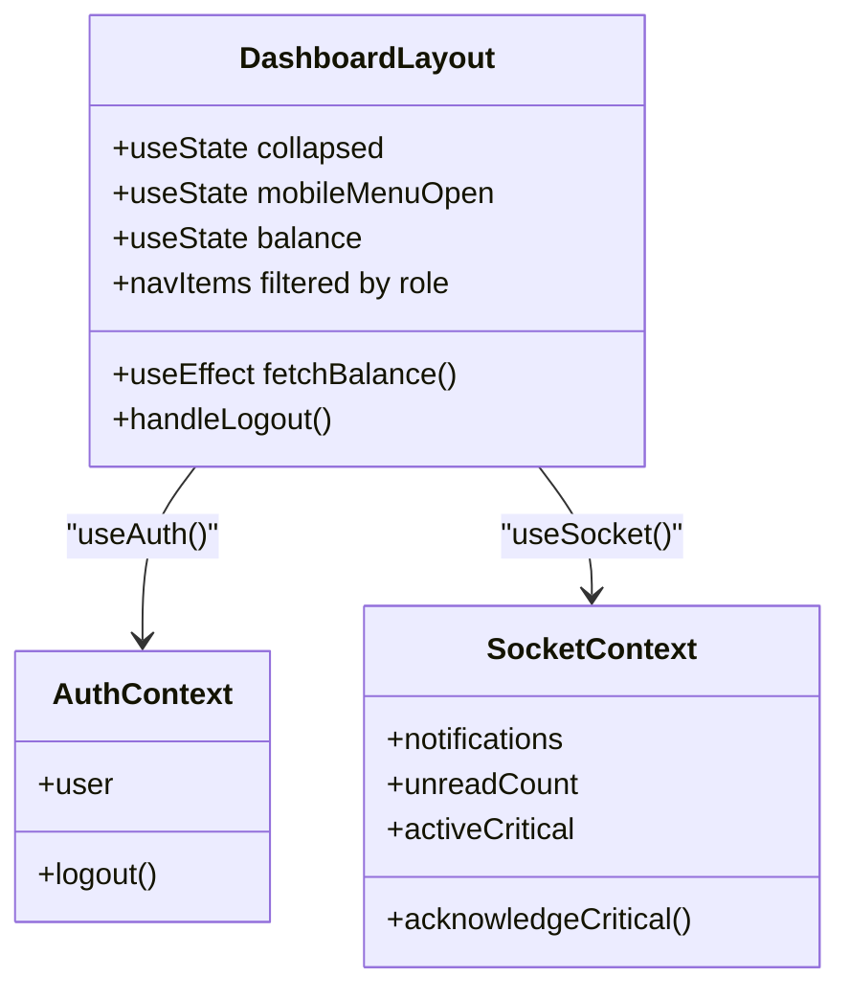
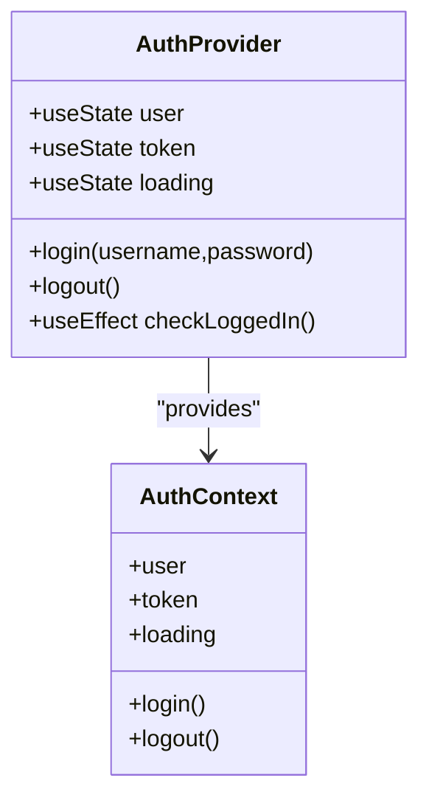
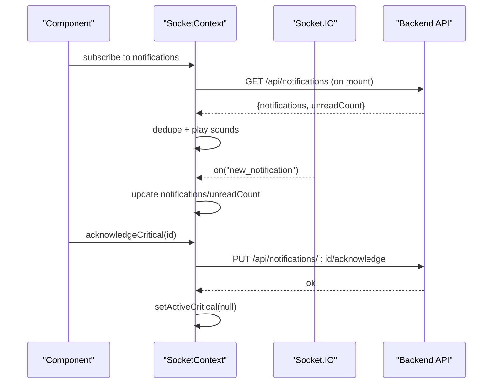
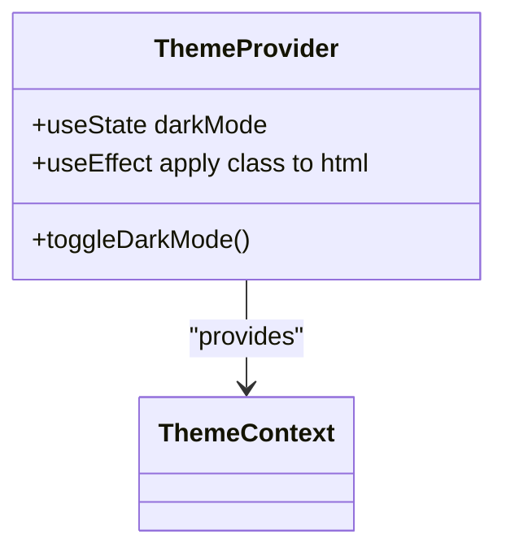
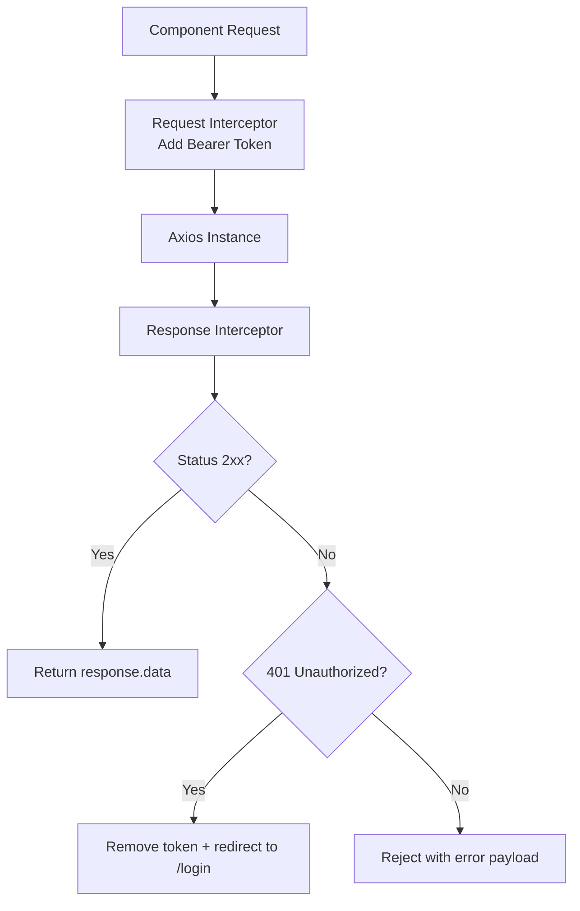
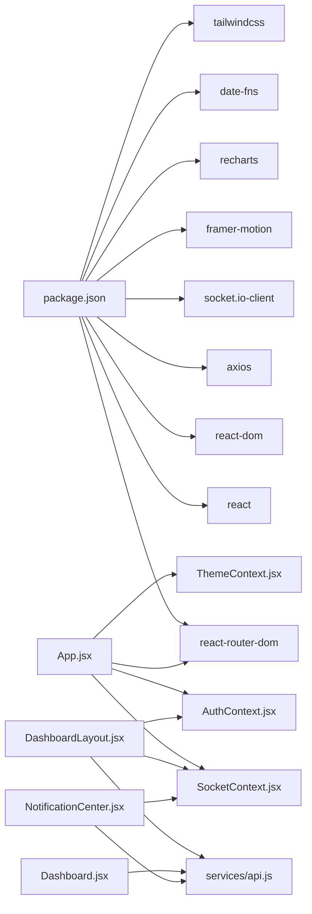

# Frontend Architecture

<cite>
**Referenced Files in This Document**
- [main.jsx](file://frontend/src/main.jsx)
- [App.jsx](file://frontend/src/App.jsx)
- [DashboardLayout.jsx](file://frontend/src/layouts/DashboardLayout.jsx)
- [AuthContext.jsx](file://frontend/src/context/AuthContext.jsx)
- [SocketContext.jsx](file://frontend/src/context/SocketContext.jsx)
- [ThemeContext.jsx](file://frontend/src/context/ThemeContext.jsx)
- [api.js](file://frontend/src/services/api.js)
- [vite.config.js](file://frontend/vite.config.js)
- [package.json](file://frontend/package.json)
- [tailwind.config.js](file://frontend/tailwind.config.js)
- [Dashboard.jsx](file://frontend/src/pages/Dashboard.jsx)
- [NotificationCenter.jsx](file://frontend/src/components/NotificationCenter.jsx)
- [exportUtils.js](file://frontend/src/utils/exportUtils.js)
</cite>

## Table of Contents
1. [Introduction](#introduction)
2. [Project Structure](#project-structure)
3. [Core Components](#core-components)
4. [Architecture Overview](#architecture-overview)
5. [Detailed Component Analysis](#detailed-component-analysis)
6. [Dependency Analysis](#dependency-analysis)
7. [Performance Considerations](#performance-considerations)
8. [Troubleshooting Guide](#troubleshooting-guide)
9. [Conclusion](#conclusion)

## Introduction
This document describes the frontend architecture of the React-based petty cash management system. It covers the component hierarchy starting from the entry points, the layout system, context provider architecture for authentication, real-time communication, and theming. It also documents the routing system, service layer for API communication, build configuration with Vite, component composition patterns, state management strategies, backend integration, performance optimizations, responsive design, and accessibility considerations.

## Project Structure
The frontend is organized around a clear separation of concerns:
- Entry points: main.jsx initializes the app; App.jsx defines routing and providers.
- Layouts: DashboardLayout.jsx provides the main shell with sidebar, navbar, and content area.
- Pages: Feature-specific views under pages/.
- Contexts: Authentication, Socket/realtime, and Theme contexts.
- Services: Centralized HTTP client with interceptors.
- Utilities: Export helpers and shared UI utilities.
- Build: Vite configuration with React plugin and custom chunk naming.

**Diagram sources**
- [main.jsx:1-11](file://frontend/src/main.jsx#L1-L11)
- [App.jsx:1-127](file://frontend/src/App.jsx#L1-L127)
- [DashboardLayout.jsx:1-335](file://frontend/src/layouts/DashboardLayout.jsx#L1-L335)
- [AuthContext.jsx:1-54](file://frontend/src/context/AuthContext.jsx#L1-L54)
- [SocketContext.jsx:1-376](file://frontend/src/context/SocketContext.jsx#L1-L376)
- [ThemeContext.jsx:1-30](file://frontend/src/context/ThemeContext.jsx#L1-L30)
- [api.js:1-29](file://frontend/src/services/api.js#L1-L29)

**Section sources**
- [main.jsx:1-11](file://frontend/src/main.jsx#L1-L11)
- [App.jsx:1-127](file://frontend/src/App.jsx#L1-L127)

## Core Components
- Entry point: main.jsx mounts the root React element with StrictMode and renders App.
- App container: Sets up routing with React Router, lazy-loads pages, wraps children in AuthProvider, SocketProvider, and ThemeProvider, and defines protected routes with role checks.
- Layout: DashboardLayout.jsx composes the sidebar, navbar, mobile menu, content area, and critical alert modal; integrates with AuthContext and SocketContext.
- Contexts: AuthContext manages user session and tokens; SocketContext handles real-time notifications and audio; ThemeContext toggles dark mode.
- Services: api.js centralizes HTTP requests with automatic token injection and 401 handling.
- Utilities: exportUtils.js provides PDF export functionality for reports.

**Section sources**
- [main.jsx:1-11](file://frontend/src/main.jsx#L1-L11)
- [App.jsx:1-127](file://frontend/src/App.jsx#L1-L127)
- [DashboardLayout.jsx:1-335](file://frontend/src/layouts/DashboardLayout.jsx#L1-L335)
- [AuthContext.jsx:1-54](file://frontend/src/context/AuthContext.jsx#L1-L54)
- [SocketContext.jsx:1-376](file://frontend/src/context/SocketContext.jsx#L1-L376)
- [ThemeContext.jsx:1-30](file://frontend/src/context/ThemeContext.jsx#L1-L30)
- [api.js:1-29](file://frontend/src/services/api.js#L1-L29)
- [exportUtils.js:1-77](file://frontend/src/utils/exportUtils.js#L1-L77)

## Architecture Overview
The system follows a layered architecture:
- Presentation Layer: React components and layouts.
- Routing Layer: React Router with lazy-loaded routes and protected route wrapper.
- State Management Layer: Context providers for auth, socket/notifications, and theme.
- Service Layer: Axios-based HTTP client with interceptors.
- Real-time Layer: Socket.IO client integrated with local audio engine and cross-tab synchronization.
- Build Layer: Vite with React plugin and deterministic chunk names.

**Diagram sources**
- [App.jsx:1-127](file://frontend/src/App.jsx#L1-L127)
- [DashboardLayout.jsx:1-335](file://frontend/src/layouts/DashboardLayout.jsx#L1-L335)
- [AuthContext.jsx:1-54](file://frontend/src/context/AuthContext.jsx#L1-L54)
- [SocketContext.jsx:1-376](file://frontend/src/context/SocketContext.jsx#L1-L376)
- [ThemeContext.jsx:1-30](file://frontend/src/context/ThemeContext.jsx#L1-L30)
- [api.js:1-29](file://frontend/src/services/api.js#L1-L29)
- [vite.config.js:1-31](file://frontend/vite.config.js#L1-L31)

## Detailed Component Analysis

### Entry Points and Application Bootstrap
- main.jsx creates the root and renders App inside React.StrictMode.
- App.jsx sets up providers in nested order: Auth → Socket → Theme → Router → Suspense → Routes.
- Uses lazy loading for all pages to improve initial load performance.

**Diagram sources**
- [main.jsx:1-11](file://frontend/src/main.jsx#L1-L11)
- [App.jsx:1-127](file://frontend/src/App.jsx#L1-L127)

**Section sources**
- [main.jsx:1-11](file://frontend/src/main.jsx#L1-L11)
- [App.jsx:1-127](file://frontend/src/App.jsx#L1-L127)

### Routing System and Protected Routes
- App.jsx defines routes for login and approval actions, plus a protected root route that renders DashboardLayout.
- ProtectedRoute enforces authentication and optional role-based access, with a spinner fallback during auth initialization.
- Nested routes under "/" map to feature pages with role restrictions for admin-only sections.

**Diagram sources**
- [App.jsx:26-43](file://frontend/src/App.jsx#L26-L43)

**Section sources**
- [App.jsx:26-43](file://frontend/src/App.jsx#L26-L43)

### Layout System: DashboardLayout
- Composes desktop sidebar, mobile drawer, navbar, and main content area.
- Integrates with AuthContext for user info and logout, and SocketContext for notifications and critical alerts.
- Dynamically computes sidebar items based on user role.
- Fetches real-time balance via API and displays it prominently.

**Diagram sources**
- [DashboardLayout.jsx:51-94](file://frontend/src/layouts/DashboardLayout.jsx#L51-L94)
- [AuthContext.jsx:1-54](file://frontend/src/context/AuthContext.jsx#L1-L54)
- [SocketContext.jsx:1-376](file://frontend/src/context/SocketContext.jsx#L1-L376)

**Section sources**
- [DashboardLayout.jsx:51-94](file://frontend/src/layouts/DashboardLayout.jsx#L51-L94)

### Context Provider Architecture

#### Authentication Context (AuthContext)
- Manages user, token, and loading state.
- On mount, validates stored token and fetches current user.
- Provides login and logout functions that persist tokens in localStorage.
- Exposes useAuth hook for consuming components.

**Diagram sources**
- [AuthContext.jsx:6-51](file://frontend/src/context/AuthContext.jsx#L6-L51)

**Section sources**
- [AuthContext.jsx:1-54](file://frontend/src/context/AuthContext.jsx#L1-L54)

#### Socket/Real-time Context (SocketContext)
- Initializes Socket.IO connection with auth token and robust reconnection settings.
- Handles notifications lifecycle: fetching unread, deduplication, sound synthesis, and browser notifications.
- Implements a multi-tab audio engine with heartbeat and cross-tab mute.
- Emits window events for balance updates to keep UI synchronized.
- Exposes acknowledgeCritical to resolve critical alerts and update backend.

**Diagram sources**
- [SocketContext.jsx:130-376](file://frontend/src/context/SocketContext.jsx#L130-L376)

**Section sources**
- [SocketContext.jsx:1-376](file://frontend/src/context/SocketContext.jsx#L1-L376)

#### Theme Context (ThemeContext)
- Persists dark mode preference in localStorage and applies class to documentElement.
- Provides toggleDarkMode for consumers.

**Diagram sources**
- [ThemeContext.jsx:5-27](file://frontend/src/context/ThemeContext.jsx#L5-L27)

**Section sources**
- [ThemeContext.jsx:1-30](file://frontend/src/context/ThemeContext.jsx#L1-L30)

### Service Layer and Backend Integration
- api.js creates an Axios instance with dynamic base URL from environment.
- Adds Authorization header automatically for outgoing requests.
- Intercepts responses to redirect unauthenticated users to login on 401.
- Used by pages and layout components to fetch analytics, notifications, and funds balance.

**Diagram sources**
- [api.js:3-26](file://frontend/src/services/api.js#L3-L26)

**Section sources**
- [api.js:1-29](file://frontend/src/services/api.js#L1-L29)

### Component Composition Patterns
- Layout-first composition: DashboardLayout wraps page content and provides shared UI (sidebar, navbar, notifications).
- Hook-driven composition: useAuth, useSocket, useTheme encapsulate cross-cutting concerns.
- Event-driven updates: window events and Socket.IO events trigger UI refreshes.
- Conditional rendering: role-based visibility of navigation items and protected routes.

**Section sources**
- [DashboardLayout.jsx:77-93](file://frontend/src/layouts/DashboardLayout.jsx#L77-L93)
- [App.jsx:63-114](file://frontend/src/App.jsx#L63-L114)

### State Management Strategies
- Context-based state: Auth, Socket, and Theme state lives in dedicated contexts.
- Local component state: Pages manage their own UI state (loading, charts, forms).
- Derived state: Dashboard calculates department percentages and formats currency.
- Event-based synchronization: Real-time events update UI without polling.

**Section sources**
- [Dashboard.jsx:76-111](file://frontend/src/pages/Dashboard.jsx#L76-L111)
- [DashboardLayout.jsx:50-70](file://frontend/src/layouts/DashboardLayout.jsx#L50-L70)

### Integration with Backend APIs
- Authentication: login endpoint stores token; /auth/me validates session.
- Notifications: GET /api/notifications, PUT /notifications/:id/read, PUT /notifications/read-all, PUT /notifications/:id/acknowledge.
- Analytics: GET /analytics/stats, /analytics/trends, /analytics/categories.
- Funds: GET /funds/balance.
- Approval: Dynamic routes for approval actions with token-based URLs.

**Section sources**
- [AuthContext.jsx:32-44](file://frontend/src/context/AuthContext.jsx#L32-L44)
- [SocketContext.jsx:162-193](file://frontend/src/context/SocketContext.jsx#L162-L193)
- [Dashboard.jsx:162-177](file://frontend/src/pages/Dashboard.jsx#L162-L177)
- [DashboardLayout.jsx:60-69](file://frontend/src/layouts/DashboardLayout.jsx#L60-L69)

### Build Configuration with Vite
- React plugin enabled.
- Base path set to "/".
- Rollup manualChunks configured with safe package chunk names for hosting compatibility.
- Environment variable VITE_API_URL drives the API base URL.

**Section sources**
- [vite.config.js:1-31](file://frontend/vite.config.js#L1-L31)
- [package.json:1-49](file://frontend/package.json#L1-L49)
- [api.js:4-4](file://frontend/src/services/api.js#L4-L4)

### Responsive Design Implementation
- Tailwind CSS v4 with dark mode support.
- Layout uses responsive breakpoints for sidebar collapse, mobile drawer, and grid layouts.
- Charts adapt via Recharts' ResponsiveContainer.
- Motion animations from Framer Motion enhance transitions.

**Section sources**
- [tailwind.config.js:1-29](file://frontend/tailwind.config.js#L1-L29)
- [DashboardLayout.jsx:96-165](file://frontend/src/layouts/DashboardLayout.jsx#L96-L165)
- [Dashboard.jsx:278-307](file://frontend/src/pages/Dashboard.jsx#L278-L307)

### Accessibility Considerations
- Semantic HTML and proper labeling in components.
- Focus states and keyboard navigability in interactive elements.
- Color contrast maintained via Tailwind palette and dark mode variants.
- ARIA-friendly button semantics and role usage in modals and menus.

[No sources needed since this section provides general guidance]

## Dependency Analysis
External dependencies include React, React Router, Axios, Socket.IO client, Framer Motion, Recharts, date-fns, and Tailwind CSS. Internal dependencies are structured around providers, services, and layout composition.

**Diagram sources**
- [package.json:12-48](file://frontend/package.json#L12-L48)
- [App.jsx:1-6](file://frontend/src/App.jsx#L1-L6)
- [DashboardLayout.jsx:25-29](file://frontend/src/layouts/DashboardLayout.jsx#L25-L29)
- [Dashboard.jsx:1-44](file://frontend/src/pages/Dashboard.jsx#L1-L44)
- [NotificationCenter.jsx:1-6](file://frontend/src/components/NotificationCenter.jsx#L1-L6)

**Section sources**
- [package.json:1-49](file://frontend/package.json#L1-L49)

## Performance Considerations
- Lazy loading: All pages are lazy-loaded to reduce initial bundle size.
- Suspense: Provides loading fallback while chunks are being fetched.
- Efficient re-renders: Context values are granular; avoid unnecessary provider wrapping.
- Chart optimization: Recharts components are responsive and efficient; avoid excessive re-renders by passing stable props.
- Network efficiency: Axios interceptors prevent redundant requests and handle auth globally.
- Build optimization: Vite with React plugin and deterministic chunk names improves caching and CDN friendliness.

[No sources needed since this section provides general guidance]

## Troubleshooting Guide
- Authentication issues: If redirected to login after 401, ensure token exists in localStorage and is not expired. Verify API base URL via VITE_API_URL.
- Real-time notifications not updating: Confirm Socket.IO connection is established and token is attached. Check browser notifications permission and audio engine availability.
- Critical alert not muting across tabs: Verify storage events and heartbeat intervals are active; ensure acknowledgeCritical is called.
- Dark mode not applying: Check localStorage key and Tailwind class application on documentElement.

**Section sources**
- [api.js:17-26](file://frontend/src/services/api.js#L17-L26)
- [SocketContext.jsx:209-290](file://frontend/src/context/SocketContext.jsx#L209-L290)
- [ThemeContext.jsx:11-18](file://frontend/src/context/ThemeContext.jsx#L11-L18)

## Conclusion
The frontend employs a clean, modular architecture centered on React Router, context providers, and a cohesive layout. Real-time updates, responsive design, and thoughtful performance optimizations deliver a robust user experience. The service layer and build configuration integrate seamlessly with the backend and modern development workflows.