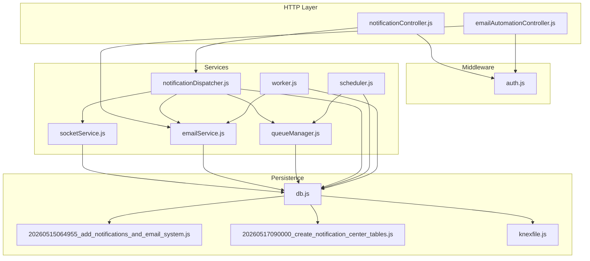
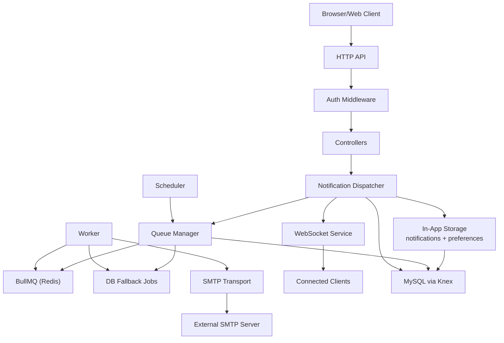
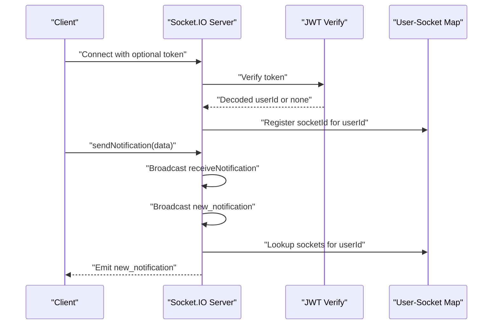
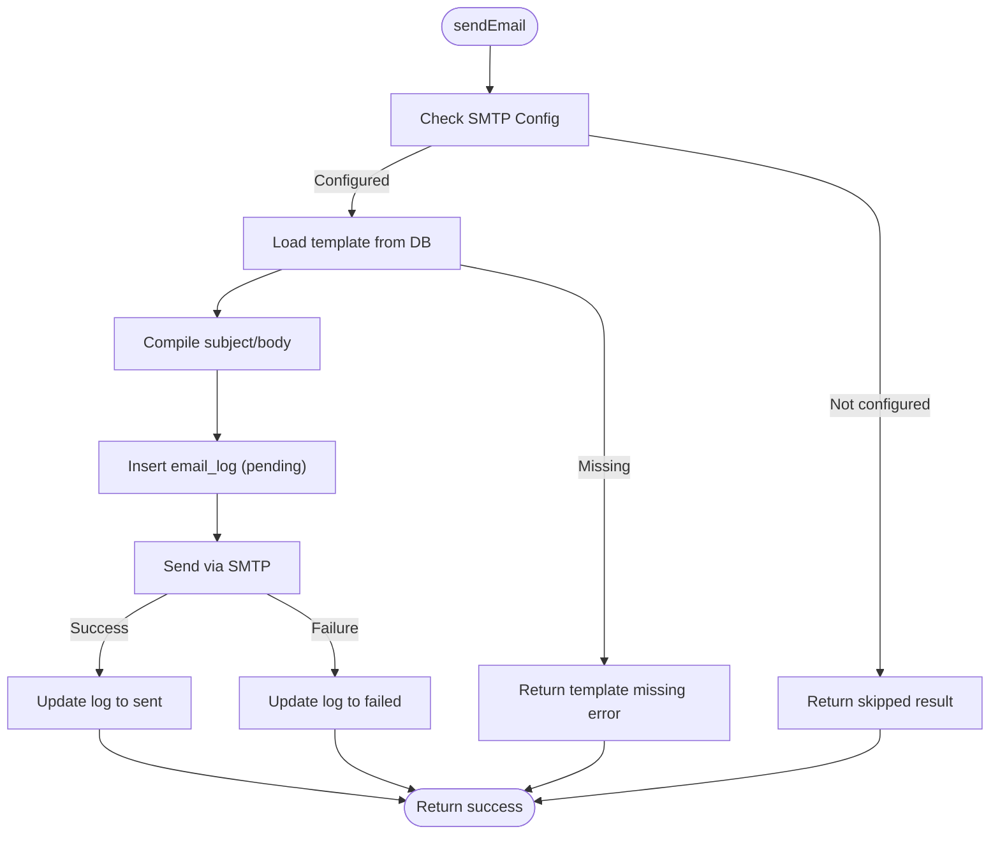
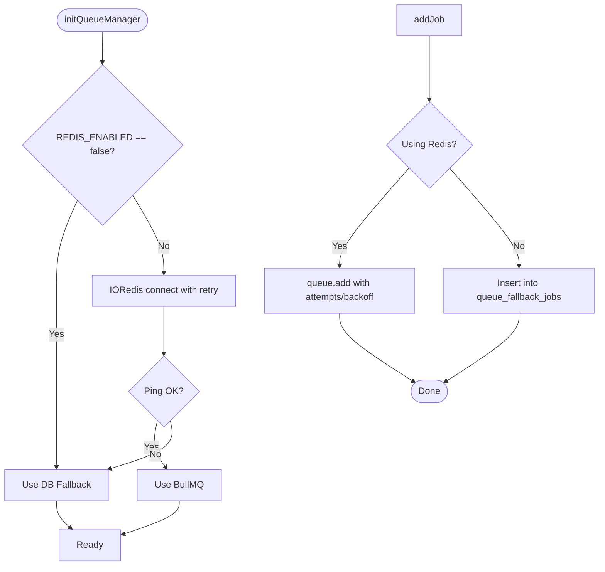
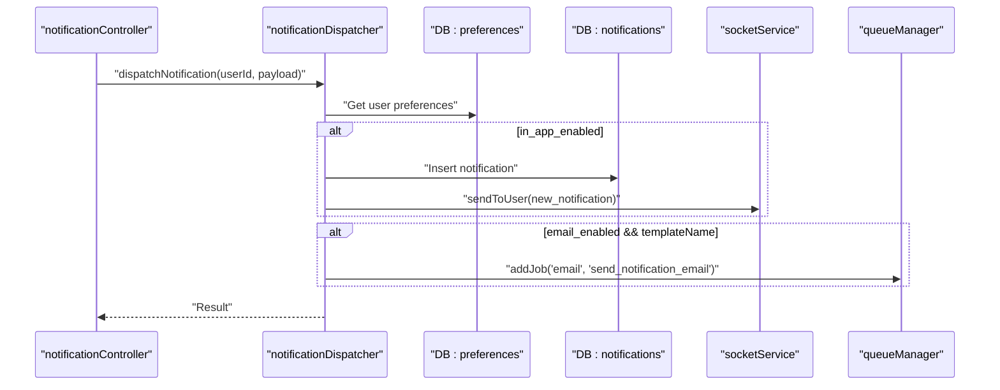
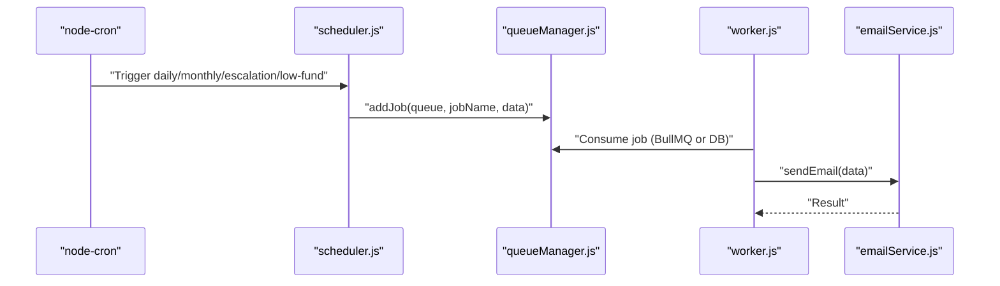
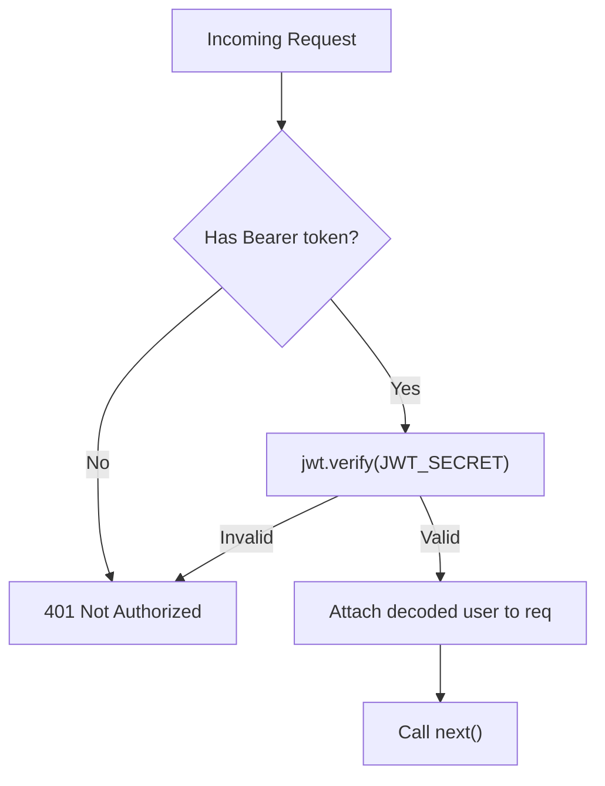
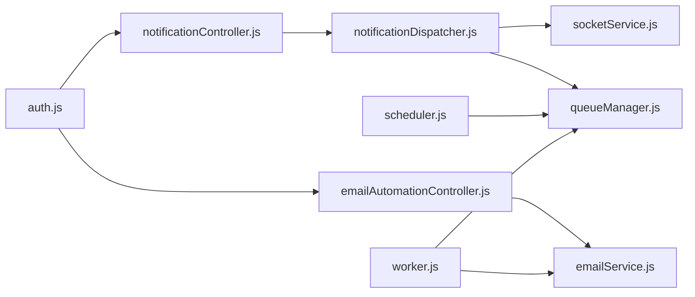

# Integration Patterns

<cite>
**Referenced Files in This Document**
- [socketService.js](file://backend/src/services/socketService.js)
- [emailService.js](file://backend/src/services/emailService.js)
- [queueManager.js](file://backend/src/services/queueManager.js)
- [notificationDispatcher.js](file://backend/src/services/notificationDispatcher.js)
- [scheduler.js](file://backend/src/services/scheduler.js)
- [worker.js](file://backend/src/services/worker.js)
- [auth.js](file://backend/src/middleware/auth.js)
- [notificationController.js](file://backend/src/controllers/notificationController.js)
- [emailAutomationController.js](file://backend/src/controllers/emailAutomationController.js)
- [logService.js](file://backend/src/utils/logService.js)
- [db.js](file://backend/src/config/db.js)
- [20260515064955_add_notifications_and_email_system.js](file://backend/src/db/migrations/20260515064955_add_notifications_and_email_system.js)
- [20260517090000_create_notification_center_tables.js](file://backend/src/db/migrations/20260517090000_create_notification_center_tables.js)
- [knexfile.js](file://backend/knexfile.js)
</cite>

## Table of Contents
1. [Introduction](#introduction)
2. [Project Structure](#project-structure)
3. [Core Components](#core-components)
4. [Architecture Overview](#architecture-overview)
5. [Detailed Component Analysis](#detailed-component-analysis)
6. [Dependency Analysis](#dependency-analysis)
7. [Performance Considerations](#performance-considerations)
8. [Troubleshooting Guide](#troubleshooting-guide)
9. [Conclusion](#conclusion)
10. [Appendices](#appendices)

## Introduction
This document describes the integration patterns for external system connections and internal service communication in the backend. It focuses on:
- Real-time notifications via WebSocket using socketService.js
- Automated email delivery via SMTP using emailService.js
- Background job processing via queueManager.js with BullMQ and a database fallback
- Notification dispatcher architecture and internal service communication
- Authentication integration patterns and middleware coordination
- Cross-service data sharing and persistence
- Error handling, retries, and fallback strategies
- Monitoring, logging, and health checks
- API gateway patterns, load balancing, and service discovery considerations

## Project Structure
The backend follows a layered architecture:
- Controllers handle HTTP requests and delegate to services
- Services encapsulate integration logic (WebSocket, SMTP, queues)
- Middleware enforces authentication and authorization
- Utilities provide shared logging and configuration
- Database migrations define the schema for notifications, emails, and scheduling



**Diagram sources**
- [notificationController.js:1-92](file://backend/src/controllers/notificationController.js#L1-L92)
- [emailAutomationController.js:1-78](file://backend/src/controllers/emailAutomationController.js#L1-L78)
- [auth.js:1-36](file://backend/src/middleware/auth.js#L1-L36)
- [socketService.js:1-102](file://backend/src/services/socketService.js#L1-L102)
- [emailService.js:1-122](file://backend/src/services/emailService.js#L1-L122)
- [queueManager.js:1-126](file://backend/src/services/queueManager.js#L1-L126)
- [notificationDispatcher.js:1-68](file://backend/src/services/notificationDispatcher.js#L1-L68)
- [scheduler.js:1-155](file://backend/src/services/scheduler.js#L1-L155)
- [worker.js:1-43](file://backend/src/services/worker.js#L1-L43)
- [db.js:1-8](file://backend/src/config/db.js#L1-L8)
- [20260515064955_add_notifications_and_email_system.js:1-110](file://backend/src/db/migrations/20260515064955_add_notifications_and_email_system.js#L1-L110)
- [20260517090000_create_notification_center_tables.js:1-119](file://backend/src/db/migrations/20260517090000_create_notification_center_tables.js#L1-L119)
- [knexfile.js:1-37](file://backend/knexfile.js#L1-L37)

**Section sources**
- [notificationController.js:1-92](file://backend/src/controllers/notificationController.js#L1-L92)
- [emailAutomationController.js:1-78](file://backend/src/controllers/emailAutomationController.js#L1-L78)
- [auth.js:1-36](file://backend/src/middleware/auth.js#L1-L36)
- [socketService.js:1-102](file://backend/src/services/socketService.js#L1-L102)
- [emailService.js:1-122](file://backend/src/services/emailService.js#L1-L122)
- [queueManager.js:1-126](file://backend/src/services/queueManager.js#L1-L126)
- [notificationDispatcher.js:1-68](file://backend/src/services/notificationDispatcher.js#L1-L68)
- [scheduler.js:1-155](file://backend/src/services/scheduler.js#L1-L155)
- [worker.js:1-43](file://backend/src/services/worker.js#L1-L43)
- [db.js:1-8](file://backend/src/config/db.js#L1-L8)
- [20260515064955_add_notifications_and_email_system.js:1-110](file://backend/src/db/migrations/20260515064955_add_notifications_and_email_system.js#L1-L110)
- [20260517090000_create_notification_center_tables.js:1-119](file://backend/src/db/migrations/20260517090000_create_notification_center_tables.js#L1-L119)
- [knexfile.js:1-37](file://backend/knexfile.js#L1-L37)

## Core Components
- WebSocket service: Initializes Socket.IO, authenticates optional JWT tokens, manages user-to-socket mapping, and supports broadcasting and targeted emits.
- SMTP service: Configures Nodemailer transport from environment variables, compiles templates from the database, logs sends, and verifies connectivity.
- Queue manager: Initializes BullMQ with Redis; falls back to database-backed jobs when Redis is unavailable; supports retries and exponential backoff.
- Notification dispatcher: Reads user preferences, persists in-app notifications, emits real-time updates, and enqueues email jobs.
- Scheduler: Uses cron to enqueue recurring tasks for reports, escalations, low fund alerts, and scheduled notifications.
- Worker: Processes queued jobs (emails, escalations) using BullMQ workers or polling fallback.
- Authentication middleware: Protects routes with bearer tokens and role-based authorization.
- Logging utility: Centralized activity logging to the database.

**Section sources**
- [socketService.js:1-102](file://backend/src/services/socketService.js#L1-L102)
- [emailService.js:1-122](file://backend/src/services/emailService.js#L1-L122)
- [queueManager.js:1-126](file://backend/src/services/queueManager.js#L1-L126)
- [notificationDispatcher.js:1-68](file://backend/src/services/notificationDispatcher.js#L1-L68)
- [scheduler.js:1-155](file://backend/src/services/scheduler.js#L1-L155)
- [worker.js:1-43](file://backend/src/services/worker.js#L1-L43)
- [auth.js:1-36](file://backend/src/middleware/auth.js#L1-L36)
- [logService.js:1-24](file://backend/src/utils/logService.js#L1-L24)

## Architecture Overview
The system integrates external systems (SMTP servers) and internal services (WebSocket, queue, scheduler, workers) around a central database. Controllers orchestrate requests, services encapsulate integrations, and middleware ensures secure access.



**Diagram sources**
- [socketService.js:1-102](file://backend/src/services/socketService.js#L1-L102)
- [emailService.js:1-122](file://backend/src/services/emailService.js#L1-L122)
- [queueManager.js:1-126](file://backend/src/services/queueManager.js#L1-L126)
- [notificationDispatcher.js:1-68](file://backend/src/services/notificationDispatcher.js#L1-L68)
- [scheduler.js:1-155](file://backend/src/services/scheduler.js#L1-L155)
- [worker.js:1-43](file://backend/src/services/worker.js#L1-L43)
- [auth.js:1-36](file://backend/src/middleware/auth.js#L1-L36)
- [db.js:1-8](file://backend/src/config/db.js#L1-L8)

## Detailed Component Analysis

### WebSocket Integration (socketService.js)
- Initialization: Creates a Socket.IO server with CORS and optional JWT-based user identification during handshake.
- Authentication: Parses token from handshake auth; sets socket.userId if valid; otherwise proceeds as guest.
- User mapping: Maintains a map from userId to socket IDs for targeted emits.
- Events:
  - Custom sendNotification: Broadcasts two events for compatibility.
  - disconnect: Removes socket from user mapping.
- Public APIs: sendToUser, broadcast, getIO.



**Diagram sources**
- [socketService.js:1-102](file://backend/src/services/socketService.js#L1-L102)

**Section sources**
- [socketService.js:1-102](file://backend/src/services/socketService.js#L1-L102)

### SMTP Integration (emailService.js)
- Configuration: Loads SMTP host/port/user/pass from environment variables; supports secure mode when port equals 465.
- Transport creation: Lazily creates a Nodemailer transport; caches it.
- Template compilation: Replaces placeholders in subject/body using data keys.
- Email sending: Resolves template from database, inserts a log record, sends via SMTP, updates log status.
- Health check: Provides verifyConnection to test SMTP connectivity.
- Safety: Returns early with skipped flag if SMTP is not configured.



**Diagram sources**
- [emailService.js:1-122](file://backend/src/services/emailService.js#L1-L122)

**Section sources**
- [emailService.js:1-122](file://backend/src/services/emailService.js#L1-L122)

### Queue Management (queueManager.js)
- Redis initialization: Creates IORedis connection with retry strategy; switches to fallback on errors.
- Queue creation: Uses BullMQ Queue when Redis is available; otherwise stores jobs in DB.
- Job addition: Adds jobs with retry attempts and exponential backoff; falls back to DB on Redis failure.
- Database fallback: Polls pending jobs, executes processors, tracks attempts and next run time.
- Health: Exposes isUsingRedis and getRedisConnection for diagnostics.



**Diagram sources**
- [queueManager.js:1-126](file://backend/src/services/queueManager.js#L1-L126)

**Section sources**
- [queueManager.js:1-126](file://backend/src/services/queueManager.js#L1-L126)

### Notification Dispatcher Architecture (notificationDispatcher.js)
- Reads user notification preferences from DB; initializes defaults if missing.
- Persists in-app notifications and emits real-time updates via socketService.
- Enqueues email jobs via queueManager when templateName is provided and user has email enabled.



**Diagram sources**
- [notificationDispatcher.js:1-68](file://backend/src/services/notificationDispatcher.js#L1-L68)
- [socketService.js:1-102](file://backend/src/services/socketService.js#L1-L102)
- [queueManager.js:1-126](file://backend/src/services/queueManager.js#L1-L126)

**Section sources**
- [notificationDispatcher.js:1-68](file://backend/src/services/notificationDispatcher.js#L1-L68)

### Scheduler and Worker (scheduler.js, worker.js)
- Scheduler: Uses node-cron to enqueue periodic jobs (reports, escalations, low fund checks, scheduled notifications).
- Worker: Initializes BullMQ workers when Redis is available; otherwise polls DB every 5 seconds to process fallback jobs.



**Diagram sources**
- [scheduler.js:1-155](file://backend/src/services/scheduler.js#L1-L155)
- [worker.js:1-43](file://backend/src/services/worker.js#L1-L43)
- [queueManager.js:1-126](file://backend/src/services/queueManager.js#L1-L126)
- [emailService.js:1-122](file://backend/src/services/emailService.js#L1-L122)

**Section sources**
- [scheduler.js:1-155](file://backend/src/services/scheduler.js#L1-L155)
- [worker.js:1-43](file://backend/src/services/worker.js#L1-L43)

### Authentication Integration and Middleware Coordination (auth.js)
- protect: Extracts Bearer token from Authorization header, verifies JWT, attaches user to request.
- authorize: Role-based guard enforcing allowed roles.
- Used by controllers to secure endpoints.



**Diagram sources**
- [auth.js:1-36](file://backend/src/middleware/auth.js#L1-L36)

**Section sources**
- [auth.js:1-36](file://backend/src/middleware/auth.js#L1-L36)

### Cross-Service Data Sharing and Persistence
- Controllers interact with DB via Knex to manage notifications, preferences, templates, logs, and schedules.
- Shared DB schema includes:
  - email_templates, email_logs, scheduled_emails
  - notification_rules, notifications, notification_preferences
  - queue_fallback_jobs
  - notification_templates, notification_recipients, notification_reads, notification_schedule

```mermaid
erDiagram
EMAIL_TEMPLATES {
int id PK
string name UK
string subject
text body
string type
timestamp created_at
timestamp updated_at
}
EMAIL_LOGS {
int id PK
string recipient
string subject
text body
enum status
text error_message
int retry_count
jsonb attachments
timestamp sent_at
timestamp created_at
}
NOTIFICATIONS {
int id PK
int user_id FK
string title
text message
enum type
boolean is_read
string link
timestamp created_at
}
NOTIFICATION_PREFERENCES {
int id PK
int user_id FK UK
boolean email_enabled
boolean in_app_enabled
timestamp updated_at
}
QUEUE_FALLBACK_JOBS {
int id PK
string queue_name
string job_name
jsonb data
int priority
int attempts
enum status
timestamp next_run_at
timestamp created_at
}
NOTIFICATION_SCHEDULE {
int id PK
int template_id FK
string title
text message
string priority
string recipients_type
text recipients_data
timestamp schedule_time
string frequency
string status
timestamp last_run
timestamp created_at
}
NOTIFICATION_TEMPLATES {
int id PK
string name
string subject
text body
string type
timestamp created_at
timestamp updated_at
}
NOTIFICATION_RECIPIENTS {
int id PK
int notification_id FK
int user_id FK
string status
timestamp created_at
}
NOTIFICATION_READS {
int id PK
int notification_id FK
int user_id FK
timestamp read_at
timestamp acknowledged_at
string status
timestamp created_at
}
USERS ||--o{ NOTIFICATIONS : "has"
USERS ||--o{ NOTIFICATION_PREFERENCES : "has"
NOTIFICATION_TEMPLATES ||--o{ NOTIFICATION_SCHEDULE : "used by"
```

**Diagram sources**
- [20260515064955_add_notifications_and_email_system.js:1-110](file://backend/src/db/migrations/20260515064955_add_notifications_and_email_system.js#L1-L110)
- [20260517090000_create_notification_center_tables.js:1-119](file://backend/src/db/migrations/20260517090000_create_notification_center_tables.js#L1-L119)

**Section sources**
- [20260515064955_add_notifications_and_email_system.js:1-110](file://backend/src/db/migrations/20260515064955_add_notifications_and_email_system.js#L1-L110)
- [20260517090000_create_notification_center_tables.js:1-119](file://backend/src/db/migrations/20260517090000_create_notification_center_tables.js#L1-L119)

## Dependency Analysis
- Controllers depend on services and middleware.
- Services share DB configuration and often collaborate (dispatcher → socket/email/queue).
- Scheduler and Worker depend on Queue Manager; Worker depends on SMTP service.
- Database configuration is centralized via Knex and environment variables.



**Diagram sources**
- [auth.js:1-36](file://backend/src/middleware/auth.js#L1-L36)
- [notificationController.js:1-92](file://backend/src/controllers/notificationController.js#L1-L92)
- [emailAutomationController.js:1-78](file://backend/src/controllers/emailAutomationController.js#L1-L78)
- [notificationDispatcher.js:1-68](file://backend/src/services/notificationDispatcher.js#L1-L68)
- [socketService.js:1-102](file://backend/src/services/socketService.js#L1-L102)
- [queueManager.js:1-126](file://backend/src/services/queueManager.js#L1-L126)
- [scheduler.js:1-155](file://backend/src/services/scheduler.js#L1-L155)
- [worker.js:1-43](file://backend/src/services/worker.js#L1-L43)
- [emailService.js:1-122](file://backend/src/services/emailService.js#L1-L122)

**Section sources**
- [auth.js:1-36](file://backend/src/middleware/auth.js#L1-L36)
- [notificationController.js:1-92](file://backend/src/controllers/notificationController.js#L1-L92)
- [emailAutomationController.js:1-78](file://backend/src/controllers/emailAutomationController.js#L1-L78)
- [notificationDispatcher.js:1-68](file://backend/src/services/notificationDispatcher.js#L1-L68)
- [socketService.js:1-102](file://backend/src/services/socketService.js#L1-L102)
- [queueManager.js:1-126](file://backend/src/services/queueManager.js#L1-L126)
- [scheduler.js:1-155](file://backend/src/services/scheduler.js#L1-L155)
- [worker.js:1-43](file://backend/src/services/worker.js#L1-L43)
- [emailService.js:1-122](file://backend/src/services/emailService.js#L1-L122)

## Performance Considerations
- WebSocket scaling: Use sticky sessions behind a load balancer if horizontal scaling is introduced; consider a dedicated Socket.IO cluster setup in production.
- Queue throughput: Prefer Redis-backed BullMQ for high concurrency; monitor queue backlog and worker lag.
- SMTP batching: Group recipients and reuse transports; avoid per-email transport creation.
- Database I/O: Index frequently queried columns (e.g., notifications.user_id, schedule_time); paginate controller responses.
- Scheduler cadence: Tune cron frequencies to balance responsiveness and resource usage.

## Troubleshooting Guide
- SMTP not configured:
  - Symptom: Email skipped with configuration message.
  - Action: Set SMTP_HOST, SMTP_USER, SMTP_PASS; verify verifyConnection.
- Redis unavailable:
  - Symptom: Automatic fallback to DB queue; warnings logged.
  - Action: Check Redis connectivity; restore or keep REDIS_ENABLED=false for DB-only mode.
- WebSocket authentication failures:
  - Symptom: Guest connections; userId not set.
  - Action: Validate JWT_SECRET and token validity.
- Email send failures:
  - Symptom: email_logs marked failed with error messages.
  - Action: Inspect logs and retry; ensure template exists and placeholders match data.
- Notification delivery gaps:
  - Symptom: Missing real-time updates or emails.
  - Action: Confirm user preferences, socket connections, and worker processing.

**Section sources**
- [emailService.js:42-102](file://backend/src/services/emailService.js#L42-L102)
- [queueManager.js:10-51](file://backend/src/services/queueManager.js#L10-L51)
- [socketService.js:16-27](file://backend/src/services/socketService.js#L16-L27)
- [notificationDispatcher.js:59-62](file://backend/src/services/notificationDispatcher.js#L59-L62)

## Conclusion
The system integrates real-time notifications, SMTP-based email automation, and robust background job processing with graceful fallbacks. Authentication middleware secures endpoints, while shared database schemas enable cross-service data exchange. Monitoring and logging utilities support operational visibility, and the architecture supports scaling considerations for load balancing and service discovery.

## Appendices

### API Gateway Patterns
- Route protection: Apply auth middleware to sensitive routes.
- Request shaping: Normalize payloads in controllers before delegating to services.
- Circuit breaker hints: Wrap external calls (SMTP) with timeouts and retries; surface degraded modes when external systems fail.

### Load Balancing and Service Discovery
- Sticky sessions: Required for WebSocket scaling if using stateful session affinity.
- Health checks: Expose lightweight endpoints to probe DB, Redis, and SMTP connectivity.
- Auto-scaling: Scale workers independently from API pods; ensure shared storage for persistent state.

### Environment Variables and Configuration
- Database: DB_HOST, DB_USER, DB_PASSWORD, DB_NAME, DB_PORT
- SMTP: SMTP_HOST, SMTP_PORT, SMTP_USER, SMTP_PASS, APP_NAME
- Redis: REDIS_HOST, REDIS_PORT, REDIS_ENABLED
- JWT: JWT_SECRET
- Scheduler thresholds: LOW_FUND_THRESHOLD

**Section sources**
- [knexfile.js:1-37](file://backend/knexfile.js#L1-L37)
- [emailService.js:4-9](file://backend/src/services/emailService.js#L4-L9)
- [queueManager.js:17-29](file://backend/src/services/queueManager.js#L17-L29)
- [auth.js:14-20](file://backend/src/middleware/auth.js#L14-L20)