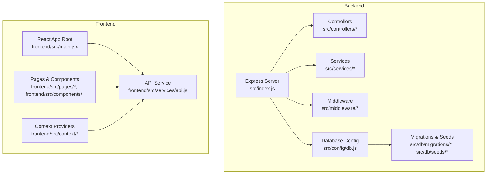
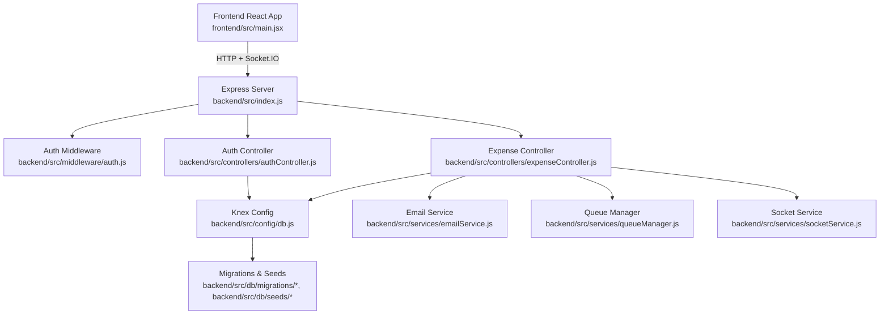
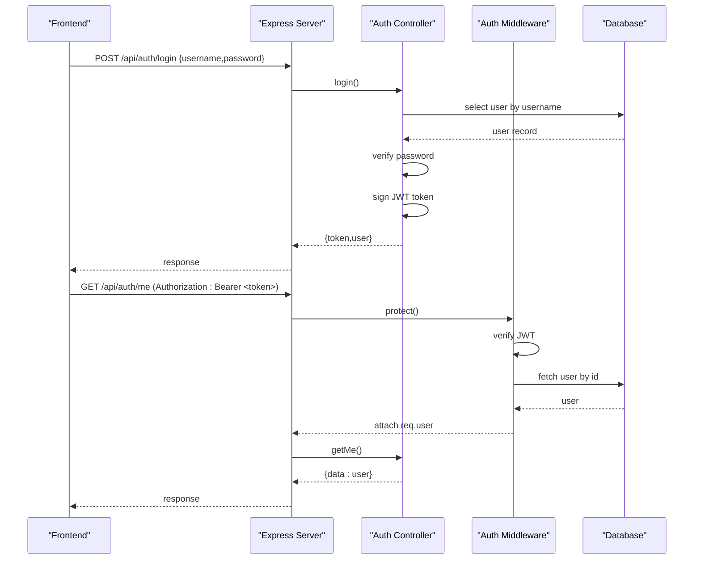
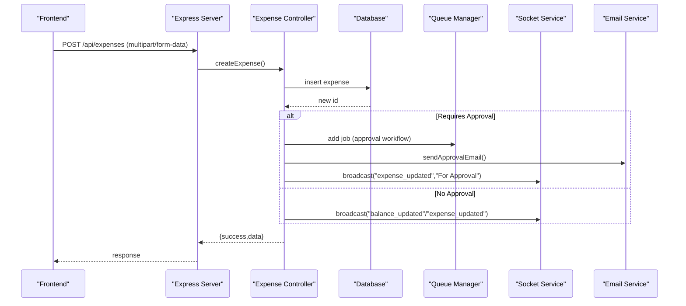
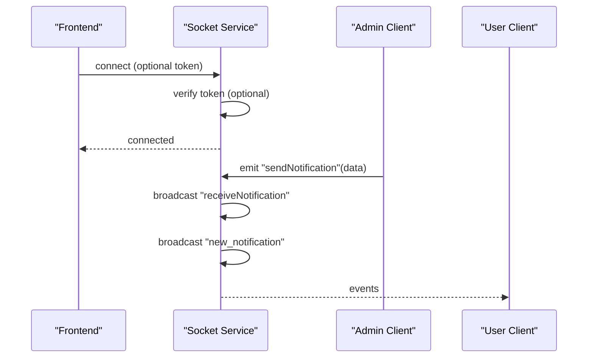
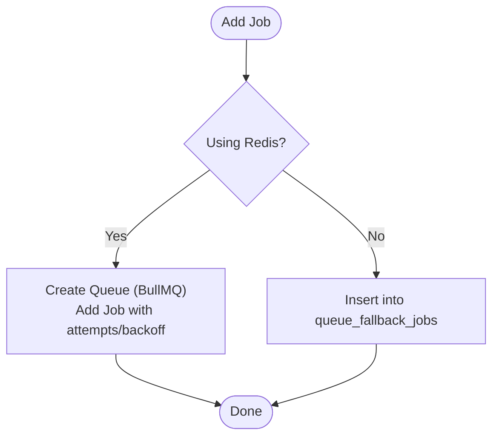
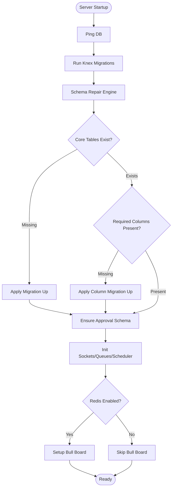
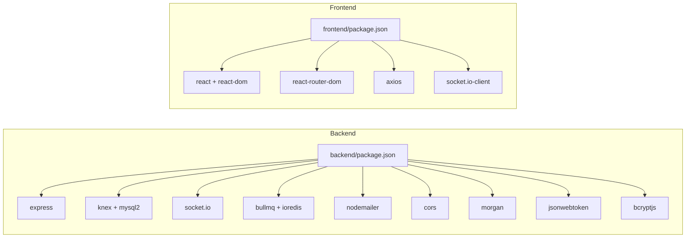

# System Architecture

<cite>
**Referenced Files in This Document**
- [backend/src/index.js](file://backend/src/index.js)
- [backend/knexfile.js](file://backend/knexfile.js)
- [backend/src/config/db.js](file://backend/src/config/db.js)
- [backend/src/middleware/auth.js](file://backend/src/middleware/auth.js)
- [backend/src/controllers/authController.js](file://backend/src/controllers/authController.js)
- [backend/src/routes/auth.js](file://backend/src/routes/auth.js)
- [backend/src/controllers/expenseController.js](file://backend/src/controllers/expenseController.js)
- [backend/src/routes/expenses.js](file://backend/src/routes/expenses.js)
- [backend/src/services/socketService.js](file://backend/src/services/socketService.js)
- [backend/src/services/queueManager.js](file://backend/src/services/queueManager.js)
- [backend/src/utils/logService.js](file://backend/src/utils/logService.js)
- [backend/src/services/emailService.js](file://backend/src/services/emailService.js)
- [frontend/src/main.jsx](file://frontend/src/main.jsx)
- [backend/package.json](file://backend/package.json)
- [frontend/package.json](file://frontend/package.json)
</cite>

## Table of Contents
1. [Introduction](#introduction)
2. [Project Structure](#project-structure)
3. [Core Components](#core-components)
4. [Architecture Overview](#architecture-overview)
5. [Detailed Component Analysis](#detailed-component-analysis)
6. [Dependency Analysis](#dependency-analysis)
7. [Performance Considerations](#performance-considerations)
8. [Troubleshooting Guide](#troubleshooting-guide)
9. [Conclusion](#conclusion)

## Introduction
This document describes the full-stack architecture of the petty cash management system. It covers the frontend React application, backend Node.js/Express server, database layer, and external integrations. The backend follows a layered architecture with controllers, services, middleware, and database abstraction. Real-time communication is implemented via Socket.IO, and background tasks leverage a queue system with Redis/BullMQ and a database fallback. Cross-cutting concerns include authentication, logging, error handling, and operational observability.

## Project Structure
The system is organized into two primary directories:
- backend: Express server, controllers, services, middleware, database configuration, migrations, and seeds
- frontend: React SPA with routing, context providers, and UI components

**Diagram sources**
- [backend/src/index.js](file://backend/src/index.js)
- [backend/src/config/db.js](file://backend/src/config/db.js)
- [frontend/src/main.jsx](file://frontend/src/main.jsx)

**Section sources**
- [backend/src/index.js](file://backend/src/index.js)
- [frontend/src/main.jsx](file://frontend/src/main.jsx)

## Core Components
- Express server initializes services, runs database migrations and schema repairs, sets up middleware, routes, static serving, and error handling.
- Controllers orchestrate request handling and delegate to services and database queries.
- Services encapsulate domain logic (e.g., notifications, email, sockets, queues, scheduling).
- Middleware enforces authentication and authorization.
- Database layer abstracted via Knex with MySQL2 client and migrations/seeds.
- Frontend is a React SPA using routing and context providers, communicating with the backend via HTTP and Socket.IO.

Key implementation references:
- Server bootstrap and middleware: [backend/src/index.js](file://backend/src/index.js)
- Database configuration: [backend/src/config/db.js](file://backend/src/config/db.js), [backend/knexfile.js](file://backend/knexfile.js)
- Auth middleware: [backend/src/middleware/auth.js](file://backend/src/middleware/auth.js)
- Auth controller: [backend/src/controllers/authController.js](file://backend/src/controllers/authController.js), [backend/src/routes/auth.js](file://backend/src/routes/auth.js)
- Expense controller and routes: [backend/src/controllers/expenseController.js](file://backend/src/controllers/expenseController.js), [backend/src/routes/expenses.js](file://backend/src/routes/expenses.js)
- Socket service: [backend/src/services/socketService.js](file://backend/src/services/socketService.js)
- Queue manager: [backend/src/services/queueManager.js](file://backend/src/services/queueManager.js)
- Logging utility: [backend/src/utils/logService.js](file://backend/src/utils/logService.js)
- Email service: [backend/src/services/emailService.js](file://backend/src/services/emailService.js)

**Section sources**
- [backend/src/index.js](file://backend/src/index.js)
- [backend/src/config/db.js](file://backend/src/config/db.js)
- [backend/knexfile.js](file://backend/knexfile.js)
- [backend/src/middleware/auth.js](file://backend/src/middleware/auth.js)
- [backend/src/controllers/authController.js](file://backend/src/controllers/authController.js)
- [backend/src/routes/auth.js](file://backend/src/routes/auth.js)
- [backend/src/controllers/expenseController.js](file://backend/src/controllers/expenseController.js)
- [backend/src/routes/expenses.js](file://backend/src/routes/expenses.js)
- [backend/src/services/socketService.js](file://backend/src/services/socketService.js)
- [backend/src/services/queueManager.js](file://backend/src/services/queueManager.js)
- [backend/src/utils/logService.js](file://backend/src/utils/logService.js)
- [backend/src/services/emailService.js](file://backend/src/services/emailService.js)

## Architecture Overview
The system employs a layered backend architecture with clear separation of concerns:
- Presentation Layer: Express routes and controllers
- Application Layer: Business logic in services
- Persistence Layer: Knex queries against MySQL
- Integration Layer: SMTP email, Redis/BullMQ queues, Socket.IO

**Diagram sources**
- [backend/src/index.js](file://backend/src/index.js)
- [backend/src/middleware/auth.js](file://backend/src/middleware/auth.js)
- [backend/src/controllers/authController.js](file://backend/src/controllers/authController.js)
- [backend/src/controllers/expenseController.js](file://backend/src/controllers/expenseController.js)
- [backend/src/services/emailService.js](file://backend/src/services/emailService.js)
- [backend/src/services/queueManager.js](file://backend/src/services/queueManager.js)
- [backend/src/services/socketService.js](file://backend/src/services/socketService.js)
- [backend/src/config/db.js](file://backend/src/config/db.js)

## Detailed Component Analysis

### Authentication Flow
The authentication flow uses JWT tokens passed via Authorization header. The middleware validates tokens and attaches user info to the request. Protected routes enforce roles where applicable.

**Diagram sources**
- [backend/src/controllers/authController.js](file://backend/src/controllers/authController.js)
- [backend/src/middleware/auth.js](file://backend/src/middleware/auth.js)
- [backend/src/routes/auth.js](file://backend/src/routes/auth.js)

**Section sources**
- [backend/src/controllers/authController.js](file://backend/src/controllers/authController.js)
- [backend/src/middleware/auth.js](file://backend/src/middleware/auth.js)
- [backend/src/routes/auth.js](file://backend/src/routes/auth.js)

### Expense Management Workflow
The expense module demonstrates CRUD operations, file uploads, approval workflows, notifications, and real-time updates.

**Diagram sources**
- [backend/src/controllers/expenseController.js](file://backend/src/controllers/expenseController.js)
- [backend/src/routes/expenses.js](file://backend/src/routes/expenses.js)
- [backend/src/services/queueManager.js](file://backend/src/services/queueManager.js)
- [backend/src/services/socketService.js](file://backend/src/services/socketService.js)
- [backend/src/services/emailService.js](file://backend/src/services/emailService.js)

**Section sources**
- [backend/src/controllers/expenseController.js](file://backend/src/controllers/expenseController.js)
- [backend/src/routes/expenses.js](file://backend/src/routes/expenses.js)

### Real-Time Communication Architecture
Socket.IO enables real-time notifications and broadcasts. Connections are optionally authenticated using JWT tokens passed during handshake. The service tracks per-user sockets and supports targeted and broadcast events.

**Diagram sources**
- [backend/src/services/socketService.js](file://backend/src/services/socketService.js)

**Section sources**
- [backend/src/services/socketService.js](file://backend/src/services/socketService.js)

### Background Task Queue and Fallback
The queue manager supports Redis-backed queues via BullMQ with automatic fallback to database-backed jobs when Redis is unavailable. Jobs are processed with retries and exponential backoff.

**Diagram sources**
- [backend/src/services/queueManager.js](file://backend/src/services/queueManager.js)

**Section sources**
- [backend/src/services/queueManager.js](file://backend/src/services/queueManager.js)

### Database Initialization, Migrations, and Schema Repair
On startup, the server ensures the database is reachable, runs migrations, and performs schema repair checks for critical tables and columns. It also initializes supporting services (sockets, queues, scheduler) and sets up Bull Board for queue monitoring when Redis is enabled.

**Diagram sources**
- [backend/src/index.js](file://backend/src/index.js)
- [backend/src/config/db.js](file://backend/src/config/db.js)

**Section sources**
- [backend/src/index.js](file://backend/src/index.js)
- [backend/src/config/db.js](file://backend/src/config/db.js)

## Dependency Analysis
External dependencies include Express, Knex, Socket.IO, BullMQ, Nodemailer, and others. The frontend uses React, React Router, Axios, and Socket.IO client. Build and dev scripts coordinate frontend and backend.

**Diagram sources**
- [backend/package.json](file://backend/package.json)
- [frontend/package.json](file://frontend/package.json)

**Section sources**
- [backend/package.json](file://backend/package.json)
- [frontend/package.json](file://frontend/package.json)

## Performance Considerations
- Database scaling: Use read replicas and optimize queries with proper indexing on frequently filtered columns (e.g., expenses.status, expenses.date, users.username).
- Queue throughput: Prefer Redis-backed queues for high concurrency; monitor queue backlog and adjust worker counts.
- Real-time load: Limit broadcast events to essential updates; use targeted user events where possible.
- Static assets: Serve frontend dist with cache headers; ensure CDN caching for immutable assets.
- Background jobs: Tune retry delays and limits; batch processing for large datasets.
- Logging: Offload logs to external systems; avoid synchronous disk writes in hot paths.

## Troubleshooting Guide
Common areas to inspect:
- Authentication failures: Verify JWT secret and token issuance; confirm middleware protection is applied to protected routes.
- Database connectivity: Confirm environment variables for host, user, password, and database; ensure migrations ran successfully.
- Email delivery: Check SMTP configuration; verify templates exist and transport verification passes.
- Queue issues: Validate Redis availability; review Bull Board for stalled jobs; inspect fallback queue entries.
- Real-time events: Ensure clients reconnect after token changes; verify socket handshake includes token.

Operational references:
- Server startup and error handling: [backend/src/index.js](file://backend/src/index.js)
- Auth middleware and protected routes: [backend/src/middleware/auth.js](file://backend/src/middleware/auth.js), [backend/src/routes/auth.js](file://backend/src/routes/auth.js)
- Database configuration and migrations: [backend/src/config/db.js](file://backend/src/config/db.js), [backend/knexfile.js](file://backend/knexfile.js)
- Activity logging: [backend/src/utils/logService.js](file://backend/src/utils/logService.js)
- Email service diagnostics: [backend/src/services/emailService.js](file://backend/src/services/emailService.js)
- Queue diagnostics: [backend/src/services/queueManager.js](file://backend/src/services/queueManager.js)
- Socket diagnostics: [backend/src/services/socketService.js](file://backend/src/services/socketService.js)

**Section sources**
- [backend/src/index.js](file://backend/src/index.js)
- [backend/src/middleware/auth.js](file://backend/src/middleware/auth.js)
- [backend/src/routes/auth.js](file://backend/src/routes/auth.js)
- [backend/src/config/db.js](file://backend/src/config/db.js)
- [backend/knexfile.js](file://backend/knexfile.js)
- [backend/src/utils/logService.js](file://backend/src/utils/logService.js)
- [backend/src/services/emailService.js](file://backend/src/services/emailService.js)
- [backend/src/services/queueManager.js](file://backend/src/services/queueManager.js)
- [backend/src/services/socketService.js](file://backend/src/services/socketService.js)

## Conclusion
The system is designed with clear separation of concerns, robust middleware for security, and scalable background processing. The layered architecture, combined with real-time capabilities and comprehensive logging, provides a solid foundation for a petty cash management platform. Proper configuration of external services (database, Redis, SMTP) and adherence to operational practices will ensure reliability and maintainability at scale.