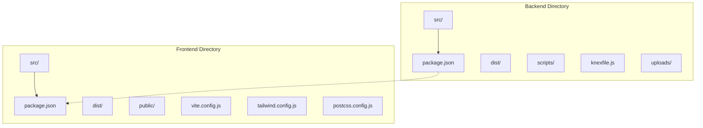
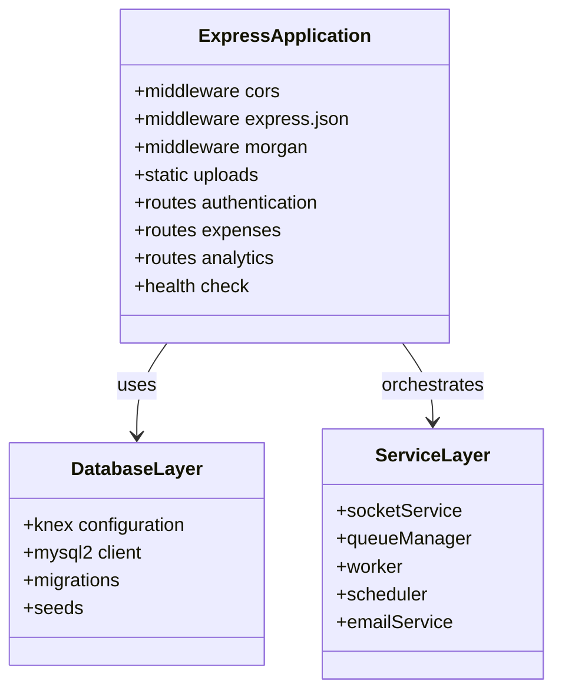
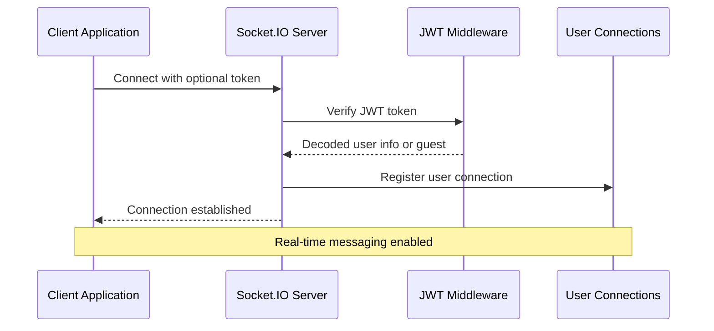
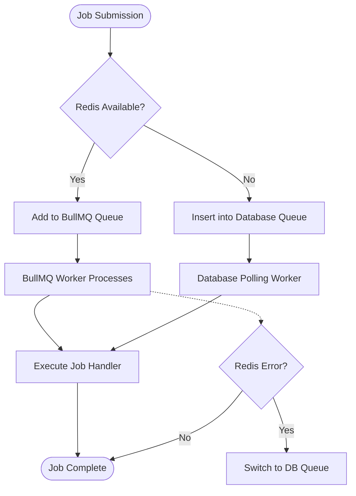
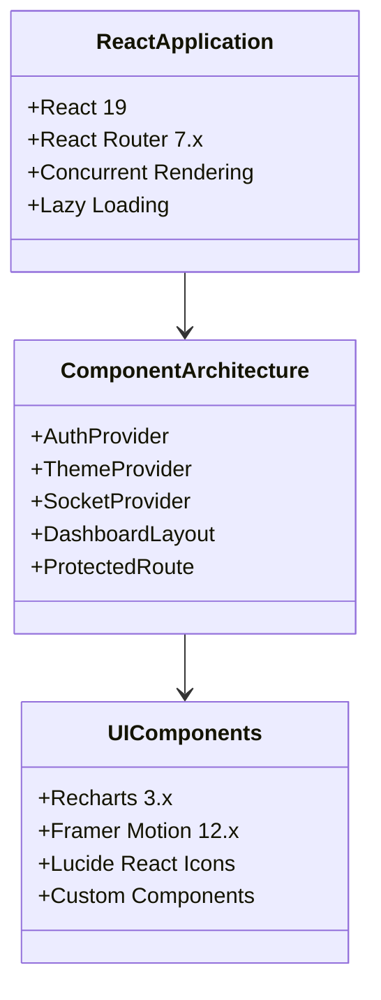
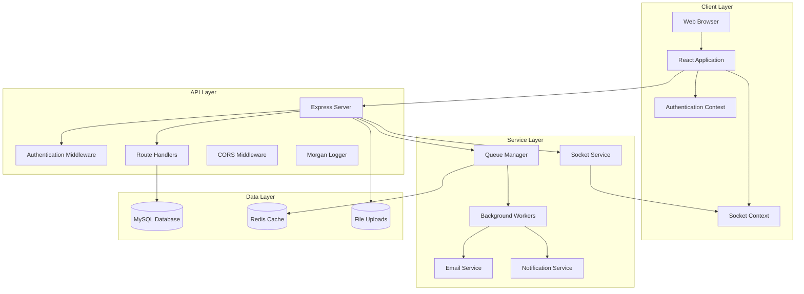

# Technology Stack & Dependencies

<cite>
**Referenced Files in This Document**
- [backend/package.json](file://backend/package.json)
- [frontend/package.json](file://frontend/package.json)
- [backend/knexfile.js](file://backend/knexfile.js)
- [backend/src/index.js](file://backend/src/index.js)
- [backend/src/config/db.js](file://backend/src/config/db.js)
- [backend/src/services/socketService.js](file://backend/src/services/socketService.js)
- [backend/src/services/queueManager.js](file://backend/src/services/queueManager.js)
- [backend/src/services/worker.js](file://backend/src/services/worker.js)
- [backend/src/middleware/auth.js](file://backend/src/middleware/auth.js)
- [backend/src/controllers/authController.js](file://backend/src/controllers/authController.js)
- [frontend/vite.config.js](file://frontend/vite.config.js)
- [frontend/tailwind.config.js](file://frontend/tailwind.config.js)
- [frontend/postcss.config.js](file://frontend/postcss.config.js)
- [frontend/src/main.jsx](file://frontend/src/main.jsx)
- [frontend/src/App.jsx](file://frontend/src/App.jsx)
- [frontend/src/context/AuthContext.jsx](file://frontend/src/context/AuthContext.jsx)
- [frontend/src/services/api.js](file://frontend/src/services/api.js)
</cite>

## Table of Contents
1. [Introduction](#introduction)
2. [Project Structure](#project-structure)
3. [Backend Technology Stack](#backend-technology-stack)
4. [Frontend Technology Stack](#frontend-technology-stack)
5. [Development Tools & Build Configuration](#development-tools--build-configuration)
6. [External Service Integrations](#external-service-integrations)
7. [Version Requirements & Compatibility Matrix](#version-requirements--compatibility-matrix)
8. [Upgrade Considerations](#upgrade-considerations)
9. [Architecture Overview](#architecture-overview)
10. [Conclusion](#conclusion)

## Introduction

The petty cash management system is a modern full-stack application built with Node.js and React technologies. It provides comprehensive financial management capabilities including expense tracking, fund management, approval workflows, and real-time notifications. The system leverages contemporary development practices with robust backend services, responsive frontend interfaces, and scalable infrastructure components.

## Project Structure

The project follows a clear separation of concerns with distinct backend and frontend directories, each containing their respective configurations, source code, and build artifacts.

**Diagram sources**
- [backend/package.json:1-50](file://backend/package.json#L1-L50)
- [frontend/package.json:1-49](file://frontend/package.json#L1-L49)

**Section sources**
- [backend/package.json:1-50](file://backend/package.json#L1-L50)
- [frontend/package.json:1-49](file://frontend/package.json#L1-L49)

## Backend Technology Stack

The backend is built on Node.js with Express.js serving as the primary web framework. It implements a comprehensive service-oriented architecture with specialized modules for database operations, authentication, real-time communication, and background job processing.

### Core Framework & Web Server

The backend utilizes Express.js 5.x as the foundational web framework, providing RESTful API capabilities and middleware support. The application initializes with automatic database migration and schema repair mechanisms to ensure data consistency.

**Diagram sources**
- [backend/src/index.js:23-178](file://backend/src/index.js#L23-L178)
- [backend/src/config/db.js:1-8](file://backend/src/config/db.js#L1-L8)

### Database Management with Knex.js

The system employs Knex.js 3.x as the SQL query builder and migration tool. It connects to MySQL databases through mysql2 driver, implementing comprehensive migration strategies and data seeding capabilities.

**Section sources**
- [backend/src/config/db.js:1-8](file://backend/src/config/db.js#L1-L8)
- [backend/knexfile.js:1-37](file://backend/knexfile.js#L1-L37)

### Real-time Communication with Socket.IO

Socket.IO 4.x enables real-time bidirectional communication between clients and server. The implementation includes JWT-based authentication for secure connections and flexible user session management.

**Diagram sources**
- [backend/src/services/socketService.js:15-27](file://backend/src/services/socketService.js#L15-L27)
- [backend/src/services/socketService.js:29-72](file://backend/src/services/socketService.js#L29-L72)

**Section sources**
- [backend/src/services/socketService.js:1-102](file://backend/src/services/socketService.js#L1-L102)

### Background Job Processing with BullMQ

BullMQ 5.x provides robust queue management with Redis-backed persistence. The system includes intelligent fallback mechanisms to database-based queues when Redis is unavailable, ensuring continuous operation.

**Diagram sources**
- [backend/src/services/queueManager.js:9-52](file://backend/src/services/queueManager.js#L9-L52)
- [backend/src/services/worker.js:22-37](file://backend/src/services/worker.js#L22-L37)

**Section sources**
- [backend/src/services/queueManager.js:1-126](file://backend/src/services/queueManager.js#L1-L126)
- [backend/src/services/worker.js:1-43](file://backend/src/services/worker.js#L1-L43)

### Authentication & Security

The backend implements JWT-based authentication with bcrypt password hashing. The authentication middleware validates tokens and enforces role-based access control.

**Section sources**
- [backend/src/middleware/auth.js:1-36](file://backend/src/middleware/auth.js#L1-L36)
- [backend/src/controllers/authController.js:1-66](file://backend/src/controllers/authController.js#L1-L66)

## Frontend Technology Stack

The frontend is built with React 19 and modern development tools, providing a responsive and interactive user interface with advanced styling and animation capabilities.

### Core Framework & Routing

React 19 provides the foundation for component-based architecture with concurrent rendering capabilities. The application uses React Router 7.x for client-side routing with protected route components and lazy loading for optimal performance.

**Diagram sources**
- [frontend/src/App.jsx:45-127](file://frontend/src/App.jsx#L45-L127)
- [frontend/src/main.jsx:1-11](file://frontend/src/main.jsx#L1-L11)

### Styling & Design System

Tailwind CSS 4.x provides utility-first styling with a custom color palette and dark mode support. PostCSS integration enables advanced CSS processing and autoprefixing.

**Section sources**
- [frontend/tailwind.config.js:1-29](file://frontend/tailwind.config.js#L1-L29)
- [frontend/postcss.config.js:1-7](file://frontend/postcss.config.js#L1-L7)

### Data Visualization & Animations

Recharts 3.x offers sophisticated charting capabilities for financial data visualization, while Framer Motion 12.x provides smooth animations and transitions for enhanced user experience.

**Section sources**
- [frontend/package.json:12-28](file://frontend/package.json#L12-L28)

### State Management & Context

The application implements React Context API for global state management, including authentication state, theme preferences, and real-time socket connections.

**Section sources**
- [frontend/src/context/AuthContext.jsx:1-54](file://frontend/src/context/AuthContext.jsx#L1-L54)
- [frontend/src/App.jsx:45-127](file://frontend/src/App.jsx#L45-L127)

## Development Tools & Build Configuration

Both backend and frontend environments utilize modern development toolchains optimized for productivity and performance.

### Backend Development Environment

The backend leverages nodemon for automatic server restarts during development, with comprehensive script automation for database operations and frontend synchronization.

**Section sources**
- [backend/package.json:6-12](file://backend/package.json#L6-L12)

### Frontend Build System

Vite 8.x provides lightning-fast development server and optimized production builds. The configuration includes custom chunk naming for hosting compatibility and React plugin integration.

**Section sources**
- [frontend/vite.config.js:1-31](file://frontend/vite.config.js#L1-L31)
- [frontend/package.json:6-11](file://frontend/package.json#L6-L11)

### Code Quality & Formatting

ESLint configuration ensures consistent code quality with React-specific rules and modern JavaScript standards. PostCSS processing automates vendor prefixing and optimization.

**Section sources**
- [frontend/package.json:29-42](file://frontend/package.json#L29-L42)

## External Service Integrations

The system integrates with several external services to enhance functionality and user experience.

### Database Layer

MySQL serves as the primary data storage with Knex.js providing ORM-like capabilities and migration management. The database configuration supports both development and production environments.

### Real-time Infrastructure

Socket.IO enables real-time communication with flexible authentication and connection management. The system supports both direct WebSocket connections and JWT-verified sessions.

### Queue Management

BullMQ provides distributed job processing with Redis-backed persistence. The system includes intelligent fallback mechanisms to ensure continuous operation even when Redis is unavailable.

### Email & Document Services

The backend integrates with Nodemailer for email automation and jsPDF for document generation, supporting automated reporting and notification systems.

## Version Requirements & Compatibility Matrix

### Backend Dependencies

| Package | Version | Minimum Node.js | Purpose |
|---------|---------|-----------------|---------|
| express | ^5.2.1 | 18.0+ | Web Framework |
| knex | ^3.2.10 | 18.0+ | SQL Query Builder |
| mysql2 | ^3.22.3 | 18.0+ | MySQL Driver |
| socket.io | ^4.8.3 | 18.0+ | Real-time Communication |
| bullmq | ^5.76.8 | 18.0+ | Queue Management |
| jsonwebtoken | ^9.0.3 | 18.0+ | Authentication |
| bcryptjs | ^3.0.3 | 18.0+ | Password Hashing |

### Frontend Dependencies

| Package | Version | React Version | Purpose |
|---------|---------|---------------|---------|
| react | ^19.2.6 | 19.x | UI Framework |
| react-dom | ^19.2.6 | 19.x | DOM Rendering |
| react-router-dom | ^7.15.0 | 7.x | Client Routing |
| recharts | ^3.8.1 | 19.x | Data Visualization |
| framer-motion | ^12.38.0 | 19.x | Animations |
| axios | ^1.16.0 | 19.x | HTTP Client |
| tailwindcss | ^4.3.0 | 19.x | Utility Styling |

### Compatibility Requirements

- **Node.js**: Requires version 18.0 or higher for optimal performance
- **MySQL**: Compatible with MySQL 5.7+ and MariaDB 10.2+
- **Redis**: Optional but recommended for production queue management
- **Browser Support**: Modern browsers with ES6+ support

## Upgrade Considerations

### Backend Upgrade Strategy

**Express.js Migration**: Plan for major version upgrades with breaking change assessment. Test middleware compatibility and update deprecated features.

**Knex.js Updates**: Monitor for database migration compatibility. Back up production data before migration updates.

**Socket.IO Evolution**: Review real-time communication APIs. Test authentication token handling and connection management.

**BullMQ Enhancement**: Evaluate queue processing improvements. Test Redis configuration changes and fallback mechanisms.

### Frontend Upgrade Approach

**React 19 Adoption**: Leverage concurrent rendering benefits. Update component patterns and test lazy loading functionality.

**Build Tool Optimization**: Vite 8.x introduces performance improvements. Benchmark build times and optimize configuration.

**Styling System Updates**: Tailwind CSS 4.x provides enhanced utility classes. Review custom configurations and color schemes.

### Database Migration Planning

Implement comprehensive testing procedures for schema changes. Schedule maintenance windows for production deployments. Monitor application performance during migration periods.

## Architecture Overview

The system follows a microservice-inspired architecture with clear separation between frontend presentation layer and backend service layer.

**Diagram sources**
- [backend/src/index.js:12-149](file://backend/src/index.js#L12-L149)
- [frontend/src/App.jsx:45-127](file://frontend/src/App.jsx#L45-L127)

## Conclusion

The petty cash management system demonstrates a well-architected modern full-stack application utilizing contemporary technologies and best practices. The backend provides robust service-oriented architecture with comprehensive real-time capabilities and scalable queue management. The frontend delivers responsive user experience with advanced styling and animation frameworks.

The technology stack emphasizes maintainability, scalability, and developer productivity through thoughtful tool selection and implementation patterns. Regular monitoring and strategic upgrades will ensure continued performance and security as requirements evolve.