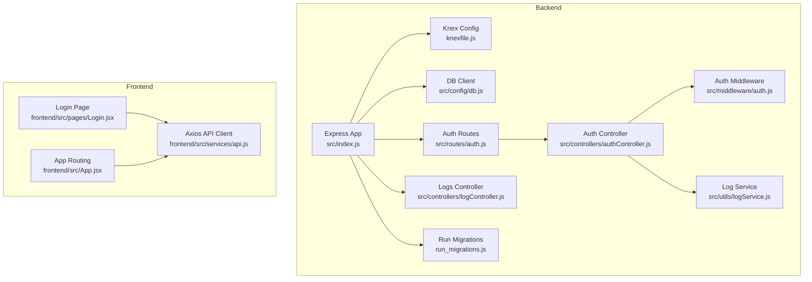
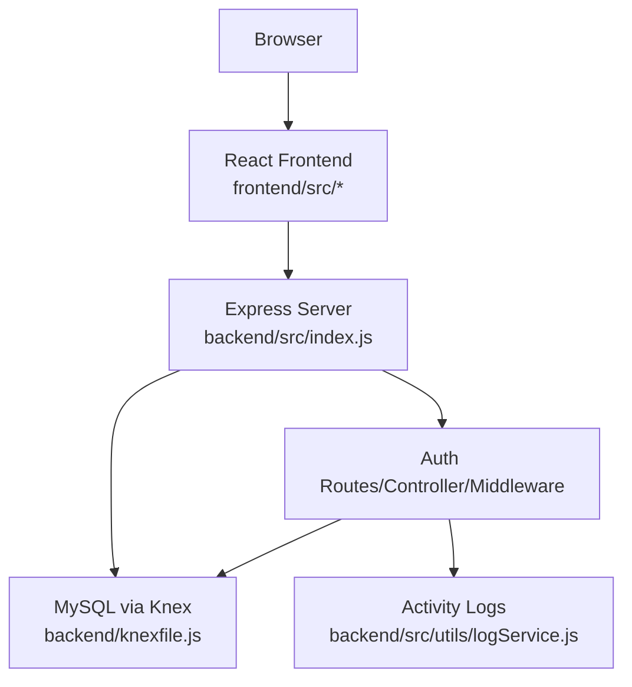
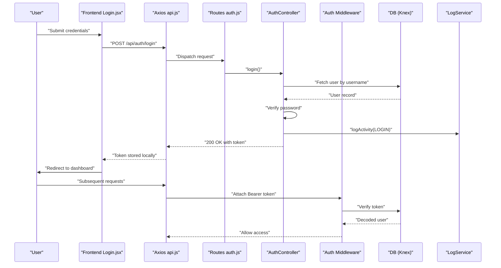
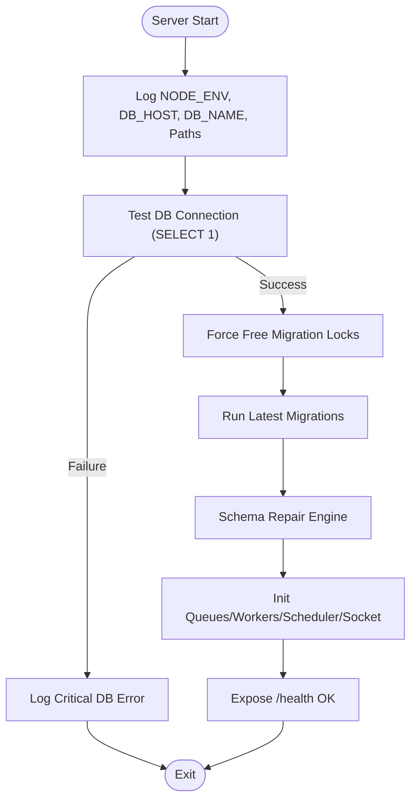
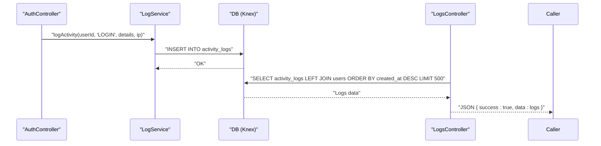
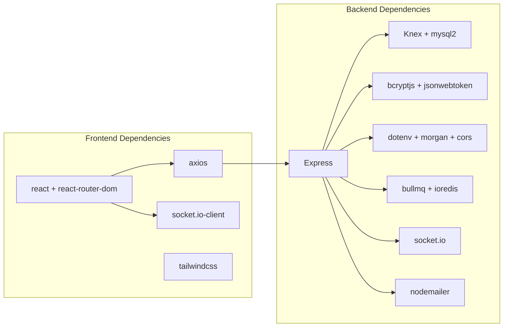

# Troubleshooting & FAQ

<cite>
**Referenced Files in This Document**
- [backend/src/index.js](file://backend/src/index.js)
- [backend/knexfile.js](file://backend/knexfile.js)
- [backend/run_migrations.js](file://backend/run_migrations.js)
- [backend/src/config/db.js](file://backend/src/config/db.js)
- [backend/src/controllers/authController.js](file://backend/src/controllers/authController.js)
- [backend/src/middleware/auth.js](file://backend/src/middleware/auth.js)
- [backend/src/utils/logService.js](file://backend/src/utils/logService.js)
- [backend/src/controllers/logController.js](file://backend/src/controllers/logController.js)
- [backend/src/routes/auth.js](file://backend/src/routes/auth.js)
- [frontend/src/services/api.js](file://frontend/src/services/api.js)
- [frontend/src/pages/Login.jsx](file://frontend/src/pages/Login.jsx)
- [frontend/src/App.jsx](file://frontend/src/App.jsx)
- [backend/package.json](file://backend/package.json)
- [frontend/package.json](file://frontend/package.json)
- [deployment_guide.md](file://deployment_guide.md)
</cite>

## Table of Contents
1. [Introduction](#introduction)
2. [Project Structure](#project-structure)
3. [Core Components](#core-components)
4. [Architecture Overview](#architecture-overview)
5. [Detailed Component Analysis](#detailed-component-analysis)
6. [Dependency Analysis](#dependency-analysis)
7. [Performance Considerations](#performance-considerations)
8. [Troubleshooting Guide](#troubleshooting-guide)
9. [Conclusion](#conclusion)
10. [Appendices](#appendices)

## Introduction
This document provides a comprehensive troubleshooting guide for the NKB Petty Cash system. It focuses on diagnosing and resolving installation issues, database connectivity problems, authentication failures, and performance concerns. It also covers log analysis, debugging tools, monitoring approaches, browser compatibility, mobile responsiveness, and integration challenges. Step-by-step procedures, preventive measures, best practices, and escalation paths are included to help administrators and developers maintain a stable and reliable system.

## Project Structure
The system comprises a Node.js/Express backend with MySQL via Knex, a React frontend built with Vite, and integrated services for queues, scheduling, and real-time updates. The backend initializes database migrations and schema repairs on startup, serves the frontend distribution, and exposes REST endpoints protected by JWT middleware.

**Diagram sources**
- [backend/src/index.js:1-240](file://backend/src/index.js#L1-L240)
- [backend/knexfile.js:1-37](file://backend/knexfile.js#L1-L37)
- [backend/src/config/db.js:1-8](file://backend/src/config/db.js#L1-L8)
- [backend/src/routes/auth.js:1-10](file://backend/src/routes/auth.js#L1-L10)
- [backend/src/controllers/authController.js:1-66](file://backend/src/controllers/authController.js#L1-L66)
- [backend/src/middleware/auth.js:1-36](file://backend/src/middleware/auth.js#L1-L36)
- [backend/src/utils/logService.js:1-24](file://backend/src/utils/logService.js#L1-L24)
- [backend/src/controllers/logController.js:1-21](file://backend/src/controllers/logController.js#L1-L21)
- [backend/run_migrations.js:1-21](file://backend/run_migrations.js#L1-L21)
- [frontend/src/services/api.js:1-29](file://frontend/src/services/api.js#L1-L29)
- [frontend/src/pages/Login.jsx:1-156](file://frontend/src/pages/Login.jsx#L1-L156)
- [frontend/src/App.jsx:1-127](file://frontend/src/App.jsx#L1-L127)

**Section sources**
- [backend/src/index.js:1-240](file://backend/src/index.js#L1-L240)
- [backend/knexfile.js:1-37](file://backend/knexfile.js#L1-L37)
- [frontend/src/services/api.js:1-29](file://frontend/src/services/api.js#L1-L29)

## Core Components
- Authentication pipeline: JWT-based login, protected routes, and role-based authorization.
- Database layer: Knex configuration for MySQL with environment-driven connection settings.
- Logging: Activity logging to the database and centralized error logging.
- Frontend API client: Axios instance with automatic token injection and 401 handling.
- Startup diagnostics: Migration execution, schema repair engine, and health checks.

Key implementation references:
- Authentication controller and middleware: [backend/src/controllers/authController.js:1-66](file://backend/src/controllers/authController.js#L1-L66), [backend/src/middleware/auth.js:1-36](file://backend/src/middleware/auth.js#L1-L36)
- Database configuration and Knex setup: [backend/src/config/db.js:1-8](file://backend/src/config/db.js#L1-L8), [backend/knexfile.js:1-37](file://backend/knexfile.js#L1-L37)
- Activity logging utilities: [backend/src/utils/logService.js:1-24](file://backend/src/utils/logService.js#L1-L24), [backend/src/controllers/logController.js:1-21](file://backend/src/controllers/logController.js#L1-L21)
- Frontend API client and login page: [frontend/src/services/api.js:1-29](file://frontend/src/services/api.js#L1-L29), [frontend/src/pages/Login.jsx:1-156](file://frontend/src/pages/Login.jsx#L1-L156)
- Startup diagnostics and migrations: [backend/src/index.js:27-149](file://backend/src/index.js#L27-L149), [backend/run_migrations.js:1-21](file://backend/run_migrations.js#L1-L21)

**Section sources**
- [backend/src/controllers/authController.js:1-66](file://backend/src/controllers/authController.js#L1-L66)
- [backend/src/middleware/auth.js:1-36](file://backend/src/middleware/auth.js#L1-L36)
- [backend/src/config/db.js:1-8](file://backend/src/config/db.js#L1-L8)
- [backend/knexfile.js:1-37](file://backend/knexfile.js#L1-L37)
- [backend/src/utils/logService.js:1-24](file://backend/src/utils/logService.js#L1-L24)
- [backend/src/controllers/logController.js:1-21](file://backend/src/controllers/logController.js#L1-L21)
- [frontend/src/services/api.js:1-29](file://frontend/src/services/api.js#L1-L29)
- [frontend/src/pages/Login.jsx:1-156](file://frontend/src/pages/Login.jsx#L1-L156)
- [backend/src/index.js:27-149](file://backend/src/index.js#L27-L149)
- [backend/run_migrations.js:1-21](file://backend/run_migrations.js#L1-L21)

## Architecture Overview
The system uses a layered architecture:
- Presentation: React SPA served by the backend in production.
- API: Express routes handled by controllers with JWT protection.
- Persistence: MySQL via Knex with migrations and seeds.
- Operations: Queue management, scheduler, and socket service initialization during startup.

**Diagram sources**
- [backend/src/index.js:1-240](file://backend/src/index.js#L1-L240)
- [backend/knexfile.js:1-37](file://backend/knexfile.js#L1-L37)
- [backend/src/controllers/authController.js:1-66](file://backend/src/controllers/authController.js#L1-L66)
- [backend/src/middleware/auth.js:1-36](file://backend/src/middleware/auth.js#L1-L36)
- [backend/src/utils/logService.js:1-24](file://backend/src/utils/logService.js#L1-L24)

**Section sources**
- [backend/src/index.js:1-240](file://backend/src/index.js#L1-L240)
- [backend/knexfile.js:1-37](file://backend/knexfile.js#L1-L37)

## Detailed Component Analysis

### Authentication Flow
The authentication flow involves login, token issuance, and route protection. On invalid credentials or disabled accounts, the backend responds with 401. The frontend’s API client handles 401 by clearing the token and redirecting to the login page.

**Diagram sources**
- [frontend/src/pages/Login.jsx:17-30](file://frontend/src/pages/Login.jsx#L17-L30)
- [frontend/src/services/api.js:8-26](file://frontend/src/services/api.js#L8-L26)
- [backend/src/routes/auth.js:1-10](file://backend/src/routes/auth.js#L1-L10)
- [backend/src/controllers/authController.js:6-52](file://backend/src/controllers/authController.js#L6-L52)
- [backend/src/middleware/auth.js:3-21](file://backend/src/middleware/auth.js#L3-L21)
- [backend/src/utils/logService.js:10-21](file://backend/src/utils/logService.js#L10-L21)

**Section sources**
- [frontend/src/pages/Login.jsx:17-30](file://frontend/src/pages/Login.jsx#L17-L30)
- [frontend/src/services/api.js:8-26](file://frontend/src/services/api.js#L8-L26)
- [backend/src/routes/auth.js:1-10](file://backend/src/routes/auth.js#L1-L10)
- [backend/src/controllers/authController.js:6-52](file://backend/src/controllers/authController.js#L6-L52)
- [backend/src/middleware/auth.js:3-21](file://backend/src/middleware/auth.js#L3-L21)
- [backend/src/utils/logService.js:10-21](file://backend/src/utils/logService.js#L10-L21)

### Database Connectivity and Migrations
On startup, the backend:
- Logs environment and migration paths for diagnostics.
- Verifies connectivity to MySQL.
- Forces free migration locks and runs latest migrations.
- Performs a schema repair engine to reconstruct missing tables/columns.
- Initializes queues, workers, scheduler, and sockets.

**Diagram sources**
- [backend/src/index.js:33-149](file://backend/src/index.js#L33-L149)
- [backend/run_migrations.js:3-18](file://backend/run_migrations.js#L3-L18)

**Section sources**
- [backend/src/index.js:33-149](file://backend/src/index.js#L33-L149)
- [backend/run_migrations.js:3-18](file://backend/run_migrations.js#L3-L18)

### Logging and Audit Trail
Activity logs are inserted upon login and via a dedicated controller endpoint. The log controller joins activity logs with user details and limits results for performance.

**Diagram sources**
- [backend/src/controllers/authController.js:20-47](file://backend/src/controllers/authController.js#L20-L47)
- [backend/src/utils/logService.js:10-21](file://backend/src/utils/logService.js#L10-L21)
- [backend/src/controllers/logController.js:3-20](file://backend/src/controllers/logController.js#L3-L20)

**Section sources**
- [backend/src/controllers/authController.js:20-47](file://backend/src/controllers/authController.js#L20-L47)
- [backend/src/utils/logService.js:10-21](file://backend/src/utils/logService.js#L10-L21)
- [backend/src/controllers/logController.js:3-20](file://backend/src/controllers/logController.js#L3-L20)

## Dependency Analysis
External dependencies relevant to troubleshooting:
- Backend: Express, Knex, mysql2, bcryptjs, jsonwebtoken, dotenv, morgan, cors, socket.io, bullmq, ioredis, nodemailer.
- Frontend: axios, react, react-router-dom, socket.io-client, tailwindcss ecosystem.

**Diagram sources**
- [backend/package.json:17-38](file://backend/package.json#L17-L38)
- [frontend/package.json:12-27](file://frontend/package.json#L12-L27)

**Section sources**
- [backend/package.json:17-38](file://backend/package.json#L17-L38)
- [frontend/package.json:12-27](file://frontend/package.json#L12-L27)

## Performance Considerations
- Database queries: Prefer indexed columns for joins (e.g., user_id) and limit log retrieval.
- Middleware overhead: Keep CORS and Morgan configurations appropriate for environment.
- Static serving: Ensure cache headers and asset paths are correct to avoid re-downloads.
- Queue and scheduler: Monitor queue backlogs and job durations; use Bull Board admin interface when Redis is enabled.
- Frontend bundle: Verify base path and caching headers for assets.

[No sources needed since this section provides general guidance]

## Troubleshooting Guide

### Installation Problems
Common symptoms and resolutions:
- Backend does not start or shows “Database initialization failed”:
  - Confirm environment variables are present and correct.
  - Verify MySQL connectivity and that SELECT 1 succeeds at startup.
  - Ensure migrations are executed and schema repair ran without critical failures.
  - References: [backend/src/index.js:33-125](file://backend/src/index.js#L33-L125), [backend/run_migrations.js:3-18](file://backend/run_migrations.js#L3-L18), [backend/knexfile.js:3-19](file://backend/knexfile.js#L3-L19)

- Frontend not loading after deployment:
  - Confirm the backend serves the dist directory and index.html is returned for non-API routes.
  - Check cache-control headers and MIME types for JS/CSS assets.
  - References: [backend/src/index.js:184-226](file://backend/src/index.js#L184-L226)

- ERR_HTTP2_PROTOCOL_ERROR or stale assets:
  - Clear browser cache or force refresh.
  - Ensure assets are built with the correct base path and cache headers are set.
  - References: [deployment_guide.md](file://deployment_guide.md#L66)

**Section sources**
- [backend/src/index.js:33-125](file://backend/src/index.js#L33-L125)
- [backend/run_migrations.js:3-18](file://backend/run_migrations.js#L3-L18)
- [backend/knexfile.js:3-19](file://backend/knexfile.js#L3-L19)
- [backend/src/index.js:184-226](file://backend/src/index.js#L184-L226)
- [deployment_guide.md](file://deployment_guide.md#L66)

### Database Connectivity Issues
Symptoms:
- 500 Internal Server Error during startup.
- “Unknown column” or missing table errors after updates.

Resolution steps:
- Validate DB_HOST, DB_USER, DB_NAME, DB_PASSWORD, and DB_PORT.
- Ensure the database server is reachable from the runtime environment.
- Run migrations to align schema with code.
- If “Unknown column” errors occur, temporarily switch the app entry point to run migrations, then revert.
- References: [deployment_guide.md:54-58](file://deployment_guide.md#L54-L58), [backend/run_migrations.js:3-18](file://backend/run_migrations.js#L3-L18), [backend/src/index.js:51-58](file://backend/src/index.js#L51-L58)

**Section sources**
- [deployment_guide.md:54-58](file://deployment_guide.md#L54-L58)
- [backend/run_migrations.js:3-18](file://backend/run_migrations.js#L3-L18)
- [backend/src/index.js:51-58](file://backend/src/index.js#L51-L58)

### Authentication Failures
Symptoms:
- 401 Unauthorized on login or protected routes.
- Immediate logout after login due to 401 response.

Diagnostic steps:
- Verify JWT_SECRET and expiration settings.
- Confirm credentials and account status (enabled/disabled).
- Check that the frontend stores and sends the Authorization header.
- Review activity logs for LOGIN actions.
- References: [backend/src/controllers/authController.js:6-52](file://backend/src/controllers/authController.js#L6-L52), [backend/src/middleware/auth.js:3-21](file://backend/src/middleware/auth.js#L3-L21), [frontend/src/services/api.js:8-26](file://frontend/src/services/api.js#L8-L26), [backend/src/utils/logService.js:10-21](file://backend/src/utils/logService.js#L10-L21)

**Section sources**
- [backend/src/controllers/authController.js:6-52](file://backend/src/controllers/authController.js#L6-L52)
- [backend/src/middleware/auth.js:3-21](file://backend/src/middleware/auth.js#L3-L21)
- [frontend/src/services/api.js:8-26](file://frontend/src/services/api.js#L8-L26)
- [backend/src/utils/logService.js:10-21](file://backend/src/utils/logService.js#L10-L21)

### Performance Problems
Symptoms:
- Slow page loads, long API responses, or queue backlog growth.

Actions:
- Inspect queue metrics at the Bull Board admin path when Redis is enabled.
- Review scheduler jobs and worker throughput.
- Enable appropriate logging levels and monitor logs for slow queries.
- Optimize frontend asset delivery and caching.
- References: [backend/src/index.js:133-148](file://backend/src/index.js#L133-L148)

**Section sources**
- [backend/src/index.js:133-148](file://backend/src/index.js#L133-L148)

### Browser Compatibility and Mobile Responsiveness
Guidance:
- Test across modern browsers and ensure polyfills if legacy support is required.
- Validate viewport meta tags and responsive breakpoints.
- Confirm touch-friendly controls and adequate tap targets.
- Verify HTTPS enforcement and mixed-content policies if applicable.
[No sources needed since this section provides general guidance]

### Integration Challenges
Common areas:
- SMTP/email automation for notifications.
- Real-time updates via WebSocket (Socket.IO).
- Redis-backed queues (BullMQ) for background tasks.

Recommendations:
- Validate SMTP settings and credentials.
- Ensure firewall allows WebSocket connections.
- Configure Redis properly if using Bull Board and queues.
- References: [backend/package.json:17-38](file://backend/package.json#L17-L38), [frontend/package.json:12-27](file://frontend/package.json#L12-L27)

**Section sources**
- [backend/package.json:17-38](file://backend/package.json#L17-L38)
- [frontend/package.json:12-27](file://frontend/package.json#L12-L27)

### Log Analysis Techniques
How to analyze logs:
- Backend startup logs: Look for NODE_ENV, DB_HOST, DB_NAME, migration paths, and repair engine messages.
- Activity logs: Use the logs endpoint to review recent activity with user details.
- Error logs: Check stderr.log on Hostinger and console output for stack traces.
- References: [backend/src/index.js:33-125](file://backend/src/index.js#L33-L125), [backend/src/controllers/logController.js:3-20](file://backend/src/controllers/logController.js#L3-L20), [deployment_guide.md](file://deployment_guide.md#L63)

**Section sources**
- [backend/src/index.js:33-125](file://backend/src/index.js#L33-L125)
- [backend/src/controllers/logController.js:3-20](file://backend/src/controllers/logController.js#L3-L20)
- [deployment_guide.md](file://deployment_guide.md#L63)

### Debugging Tools and Monitoring Approaches
Tools:
- Console logging during startup and migrations.
- Axios interceptors for request/response inspection.
- React DevTools and network tab for frontend issues.
- Bull Board admin UI for queue monitoring (when Redis is enabled).
- References: [frontend/src/services/api.js:16-26](file://frontend/src/services/api.js#L16-L26), [backend/src/index.js:133-148](file://backend/src/index.js#L133-L148)

**Section sources**
- [frontend/src/services/api.js:16-26](file://frontend/src/services/api.js#L16-L26)
- [backend/src/index.js:133-148](file://backend/src/index.js#L133-L148)

### Step-by-Step Troubleshooting Guides

#### Database Initialization Failure
1. Confirm environment variables are loaded and correct.
2. Verify MySQL connectivity and permissions.
3. Force-free migration locks and run migrations.
4. Review schema repair engine logs for missing tables/columns.
5. Restart the application and check logs again.
- References: [backend/src/index.js:33-125](file://backend/src/index.js#L33-L125), [backend/run_migrations.js:3-18](file://backend/run_migrations.js#L3-L18)

**Section sources**
- [backend/src/index.js:33-125](file://backend/src/index.js#L33-L125)
- [backend/run_migrations.js:3-18](file://backend/run_migrations.js#L3-L18)

#### Authentication 401 After Login
1. Check JWT_SECRET and expiration settings.
2. Verify user account status is enabled.
3. Ensure the frontend attaches the Authorization header.
4. Clear local storage token and retry login.
5. Review activity logs for LOGIN entries.
- References: [backend/src/controllers/authController.js:6-52](file://backend/src/controllers/authController.js#L6-L52), [frontend/src/services/api.js:8-26](file://frontend/src/services/api.js#L8-L26), [backend/src/utils/logService.js:10-21](file://backend/src/utils/logService.js#L10-L21)

**Section sources**
- [backend/src/controllers/authController.js:6-52](file://backend/src/controllers/authController.js#L6-L52)
- [frontend/src/services/api.js:8-26](file://frontend/src/services/api.js#L8-L26)
- [backend/src/utils/logService.js:10-21](file://backend/src/utils/logService.js#L10-L21)

#### Frontend Not Loading Assets
1. Confirm dist folder exists and is served by the backend.
2. Check cache-control headers and MIME types for JS/CSS.
3. Force refresh the browser (Ctrl+F5) to bypass cache.
4. Validate base path configuration for assets.
- References: [backend/src/index.js:184-226](file://backend/src/index.js#L184-L226), [deployment_guide.md](file://deployment_guide.md#L66)

**Section sources**
- [backend/src/index.js:184-226](file://backend/src/index.js#L184-L226)
- [deployment_guide.md](file://deployment_guide.md#L66)

#### Queue Backlog Growth
1. Access Bull Board admin UI at /admin/queues when Redis is enabled.
2. Inspect job statuses and retry failed jobs.
3. Scale workers or adjust concurrency settings.
4. Monitor scheduler jobs and cron schedules.
- References: [backend/src/index.js:133-148](file://backend/src/index.js#L133-L148)

**Section sources**
- [backend/src/index.js:133-148](file://backend/src/index.js#L133-L148)

### Preventive Measures and Best Practices
- Environment parity: Match development and production environment variables.
- Regular migrations: Keep migrations current and test locally before deploying.
- Token hygiene: Rotate JWT_SECRET periodically and enforce secure storage.
- Logging: Maintain structured logs and alert on critical errors.
- Security: Enforce HTTPS, CSP, and secure headers; keep dependencies updated.
- References: [deployment_guide.md:17-33](file://deployment_guide.md#L17-L33), [backend/package.json:17-38](file://backend/package.json#L17-L38), [frontend/package.json:12-27](file://frontend/package.json#L12-L27)

**Section sources**
- [deployment_guide.md:17-33](file://deployment_guide.md#L17-L33)
- [backend/package.json:17-38](file://backend/package.json#L17-L38)
- [frontend/package.json:12-27](file://frontend/package.json#L12-L27)

### Support Procedures and Escalation Paths
- Tier 1: Validate environment variables, connectivity, and basic health checks (/health).
- Tier 2: Review startup logs, migration status, and activity logs.
- Tier 3: Inspect queue/backlog metrics, scheduler jobs, and SMTP/email automation.
- Escalation: Collect logs from stderr.log and attach stack traces; coordinate with platform support (e.g., Hostinger) for infrastructure issues.
- References: [deployment_guide.md:63-67](file://deployment_guide.md#L63-L67), [backend/src/index.js:33-125](file://backend/src/index.js#L33-L125)

**Section sources**
- [deployment_guide.md:63-67](file://deployment_guide.md#L63-L67)
- [backend/src/index.js:33-125](file://backend/src/index.js#L33-L125)

## Conclusion
This guide consolidates actionable steps to diagnose and resolve common issues across installation, database connectivity, authentication, and performance. By leveraging startup diagnostics, structured logging, and the provided sequences and flows, teams can quickly isolate root causes, apply corrective actions, and maintain a robust system. For persistent or complex issues, escalate with detailed logs and environment context.

[No sources needed since this section summarizes without analyzing specific files]

## Appendices

### Quick Reference: Common Error Codes and Responses
- 401 Unauthorized: Invalid credentials, disabled account, or missing/invalid token.
- 403 Forbidden: Insufficient role for protected routes.
- 500 Internal Server Error: General server-side failure; inspect logs for stack traces.
- 404 Not Found: API route not found or missing static assets.

References:
- [backend/src/controllers/authController.js:12-18](file://backend/src/controllers/authController.js#L12-L18)
- [backend/src/middleware/auth.js:23-32](file://backend/src/middleware/auth.js#L23-L32)
- [backend/src/index.js:209-215](file://backend/src/index.js#L209-L215)

**Section sources**
- [backend/src/controllers/authController.js:12-18](file://backend/src/controllers/authController.js#L12-L18)
- [backend/src/middleware/auth.js:23-32](file://backend/src/middleware/auth.js#L23-L32)
- [backend/src/index.js:209-215](file://backend/src/index.js#L209-L215)