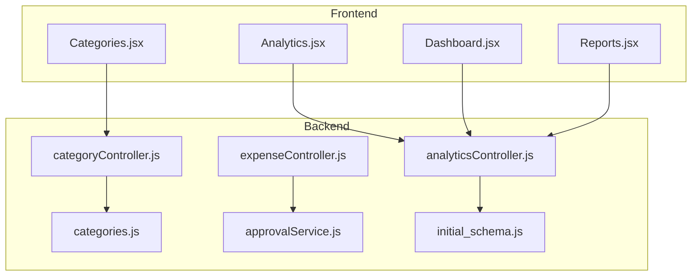
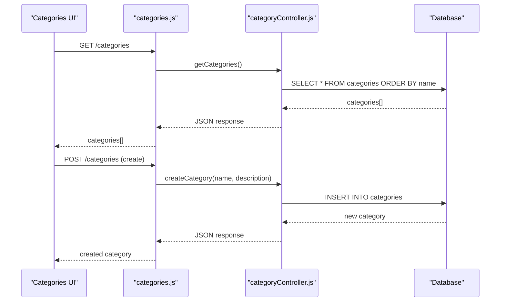
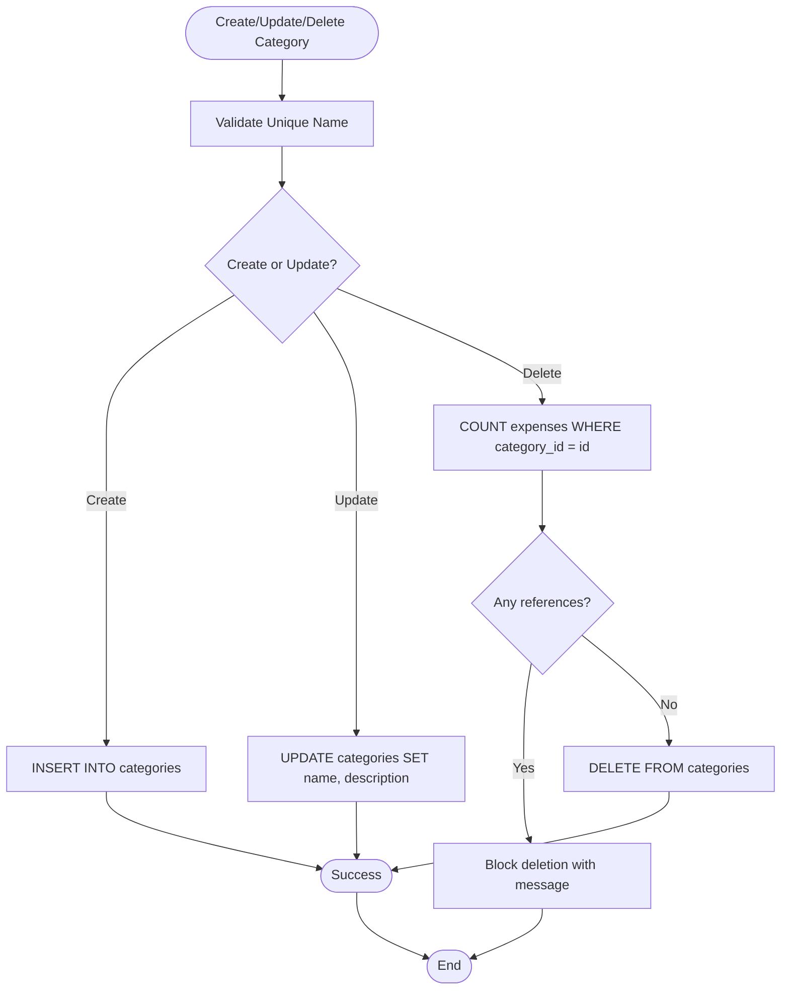
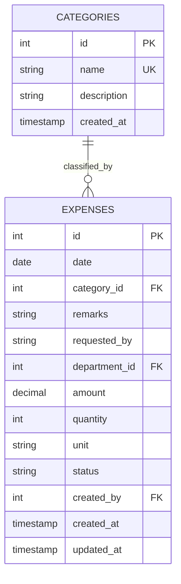
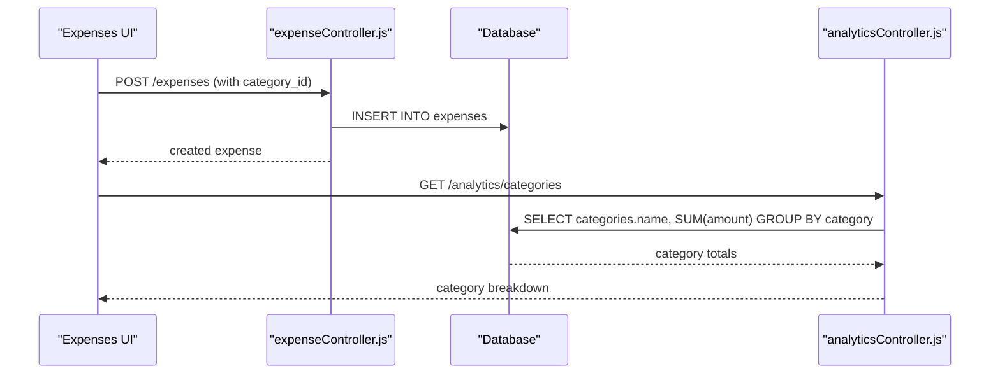
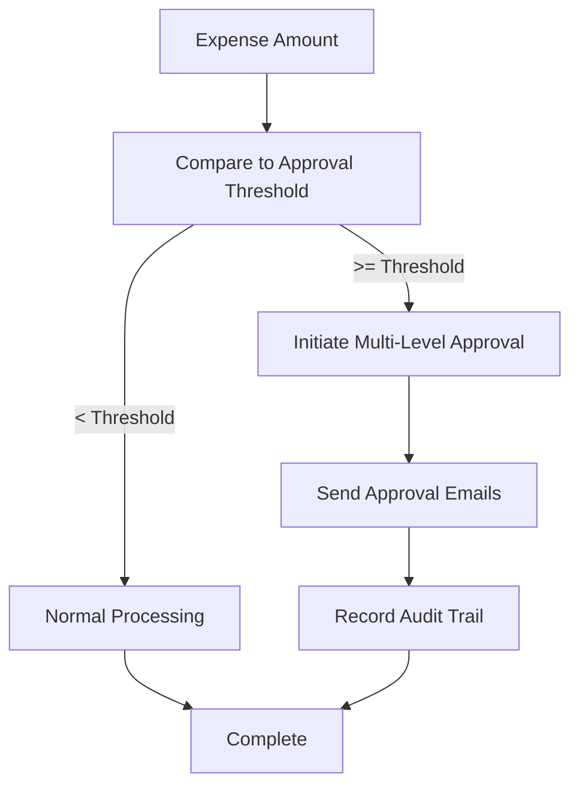
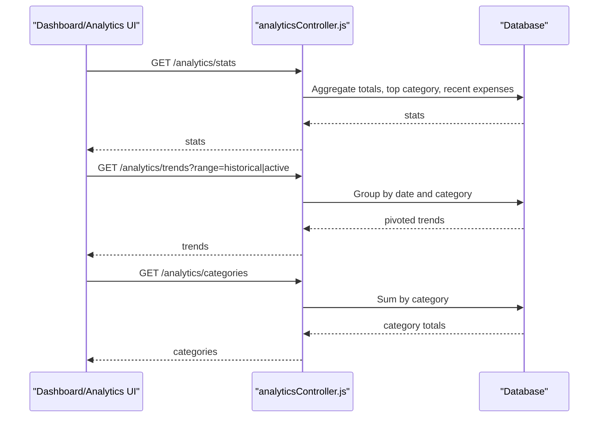
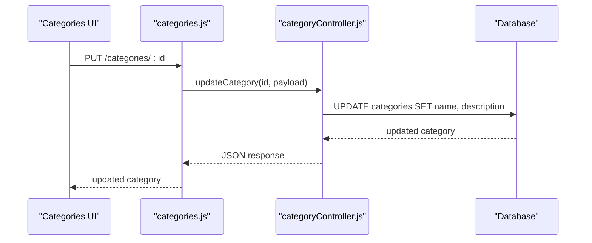
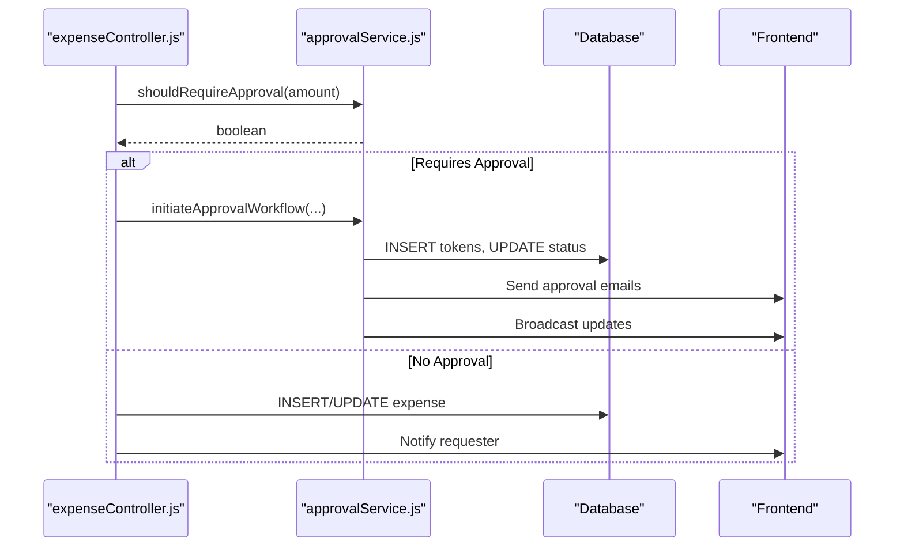
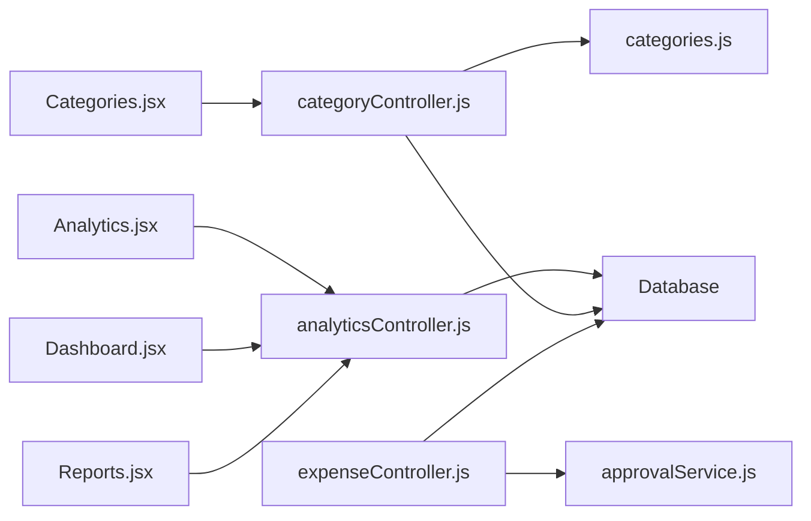

# Category Management

<cite>
**Referenced Files in This Document**
- [categoryController.js](file://backend/src/controllers/categoryController.js)
- [categories.js](file://backend/src/routes/categories.js)
- [Categories.jsx](file://frontend/src/pages/Categories.jsx)
- [initial_schema.js](file://backend/src/db/migrations/20260512000000_initial_schema.js)
- [analyticsController.js](file://backend/src/controllers/analyticsController.js)
- [analytics.jsx](file://frontend/src/pages/Analytics.jsx)
- [dashboard.jsx](file://frontend/src/pages/Dashboard.jsx)
- [reports.jsx](file://frontend/src/pages/Reports.jsx)
- [expenseController.js](file://backend/src/controllers/expenseController.js)
- [approvalService.js](file://backend/src/services/approvalService.js)
- [USER_MANUAL.md](file://USER_MANUAL.md)
</cite>

## Table of Contents
1. [Introduction](#introduction)
2. [Project Structure](#project-structure)
3. [Core Components](#core-components)
4. [Architecture Overview](#architecture-overview)
5. [Detailed Component Analysis](#detailed-component-analysis)
6. [Dependency Analysis](#dependency-analysis)
7. [Performance Considerations](#performance-considerations)
8. [Troubleshooting Guide](#troubleshooting-guide)
9. [Conclusion](#conclusion)
10. [Appendices](#appendices)

## Introduction
This document provides comprehensive documentation for the category management system within the petty cash application. It covers category creation and maintenance, classification schemes, hierarchical organization, assignment to expenses, reporting and analytics, budgeting and variance analysis, reclassification procedures, historical tracking, audit requirements, optimization recommendations, and integration with approval workflows. The system supports financial tracking, trend reporting, and forecasting capabilities through dedicated analytics endpoints and UI components.

## Project Structure
The category management system spans backend controllers and routes, frontend pages, database migrations, and analytics services. The backend exposes REST endpoints for category CRUD operations, while the frontend provides a user interface for managing categories and viewing analytics.

**Diagram sources**
- [categoryController.js:1-73](file://backend/src/controllers/categoryController.js#L1-L73)
- [categories.js:1-12](file://backend/src/routes/categories.js#L1-L12)
- [analyticsController.js:1-144](file://backend/src/controllers/analyticsController.js#L1-L144)
- [expenseController.js:1-358](file://backend/src/controllers/expenseController.js#L1-L358)
- [approvalService.js:1-590](file://backend/src/services/approvalService.js#L1-L590)
- [initial_schema.js:1-36](file://backend/src/db/migrations/20260512000000_initial_schema.js#L1-L36)
- [Categories.jsx:1-180](file://frontend/src/pages/Categories.jsx#L1-L180)
- [Analytics.jsx:1-326](file://frontend/src/pages/Analytics.jsx#L1-L326)
- [Dashboard.jsx:1-334](file://frontend/src/pages/Dashboard.jsx#L1-L334)
- [Reports.jsx:1-322](file://frontend/src/pages/Reports.jsx#L1-L322)

**Section sources**
- [categoryController.js:1-73](file://backend/src/controllers/categoryController.js#L1-L73)
- [categories.js:1-12](file://backend/src/routes/categories.js#L1-L12)
- [Categories.jsx:1-180](file://frontend/src/pages/Categories.jsx#L1-L180)
- [initial_schema.js:1-36](file://backend/src/db/migrations/20260512000000_initial_schema.js#L1-L36)

## Core Components
- Category Controller: Provides endpoints to list, create, update, and delete categories with validation and referential integrity checks.
- Category Routes: Defines protected endpoints with role-based authorization for category management.
- Frontend Categories Page: Manages category lifecycle via API calls and displays category cards with metadata.
- Analytics Controller: Aggregates spending by category for dashboard, analytics, and reporting views.
- Expense Controller: Integrates categories into expense records and participates in approval workflows.
- Approval Service: Manages multi-level approval workflows triggered by spending thresholds and supports audit trails.

**Section sources**
- [categoryController.js:1-73](file://backend/src/controllers/categoryController.js#L1-L73)
- [categories.js:1-12](file://backend/src/routes/categories.js#L1-L12)
- [Categories.jsx:1-180](file://frontend/src/pages/Categories.jsx#L1-L180)
- [analyticsController.js:1-144](file://backend/src/controllers/analyticsController.js#L1-L144)
- [expenseController.js:1-358](file://backend/src/controllers/expenseController.js#L1-L358)
- [approvalService.js:1-590](file://backend/src/services/approvalService.js#L1-L590)

## Architecture Overview
The category management architecture follows a layered design:
- Presentation Layer: React pages for category management, analytics, dashboard, and reports.
- Application Layer: Express routes delegate to category and analytics controllers.
- Domain Layer: Controllers coordinate database queries and service integrations.
- Persistence Layer: Knex migrations define category and related schema structures.
- Services: Approval service orchestrates multi-level approvals and audit logging.

**Diagram sources**
- [categories.js:1-12](file://backend/src/routes/categories.js#L1-L12)
- [categoryController.js:1-73](file://backend/src/controllers/categoryController.js#L1-L73)
- [initial_schema.js:18-36](file://backend/src/db/migrations/20260512000000_initial_schema.js#L18-L36)

**Section sources**
- [categories.js:1-12](file://backend/src/routes/categories.js#L1-L12)
- [categoryController.js:1-73](file://backend/src/controllers/categoryController.js#L1-L73)
- [initial_schema.js:18-36](file://backend/src/db/migrations/20260512000000_initial_schema.js#L18-L36)

## Detailed Component Analysis

### Category Creation and Maintenance
- Endpoint: GET /categories lists all categories ordered by name.
- Endpoint: POST /categories creates a new category with name and description.
- Endpoint: PUT /categories/:id updates an existing category with validation against duplicate names.
- Endpoint: DELETE /categories/:id removes a category only if not referenced by any expense records.

**Diagram sources**
- [categoryController.js:12-71](file://backend/src/controllers/categoryController.js#L12-L71)

**Section sources**
- [categoryController.js:1-73](file://backend/src/controllers/categoryController.js#L1-L73)
- [categories.js:1-12](file://backend/src/routes/categories.js#L1-L12)

### Classification Schemes and Hierarchical Organization
- Current schema defines categories with unique names and optional descriptions.
- Expenses are linked to categories via category_id, enabling classification of transactions.
- The system does not implement explicit parent-child hierarchy; categories are flat.

**Diagram sources**
- [initial_schema.js:18-36](file://backend/src/db/migrations/20260512000000_initial_schema.js#L18-L36)
- [expenseController.js:105-211](file://backend/src/controllers/expenseController.js#L105-L211)

**Section sources**
- [initial_schema.js:18-36](file://backend/src/db/migrations/20260512000000_initial_schema.js#L18-L36)
- [expenseController.js:105-211](file://backend/src/controllers/expenseController.js#L105-L211)

### Category Assignment to Expenses and Reporting
- Expense creation accepts category_id; if omitted, the field is set to null.
- Expense retrieval joins categories to display category_name alongside expense details.
- Analytics endpoints aggregate spending by category for dashboards and reports.

**Diagram sources**
- [expenseController.js:105-211](file://backend/src/controllers/expenseController.js#L105-L211)
- [analyticsController.js:105-123](file://backend/src/controllers/analyticsController.js#L105-L123)

**Section sources**
- [expenseController.js:105-211](file://backend/src/controllers/expenseController.js#L105-L211)
- [analyticsController.js:105-123](file://backend/src/controllers/analyticsController.js#L105-L123)

### Budgeting, Spending Limits, and Variance Analysis
- The system does not implement category-specific budgets or spending limits in the analyzed code.
- Variance analysis is not present; however, the analytics controller computes top categories and departmental breakdowns suitable for variance-style insights.
- Threshold-based approval triggers liquidation approvals when amounts meet or exceed a configurable threshold.

**Diagram sources**
- [approvalService.js:114-117](file://backend/src/services/approvalService.js#L114-L117)
- [approvalService.js:292-327](file://backend/src/services/approvalService.js#L292-L327)
- [approvalService.js:119-143](file://backend/src/services/approvalService.js#L119-L143)

**Section sources**
- [approvalService.js:114-117](file://backend/src/services/approvalService.js#L114-L117)
- [approvalService.js:292-327](file://backend/src/services/approvalService.js#L292-L327)
- [approvalService.js:119-143](file://backend/src/services/approvalService.js#L119-L143)

### Category Analytics, Trend Reporting, and Forecasting
- Dashboard statistics include top category, recent expenses, and departmental breakdowns.
- Trend data aggregates daily spending by category for stacked bar charts.
- Category intensity charts show time-series for selected categories.
- Reports provide category distribution and department allocation visuals.

**Diagram sources**
- [analyticsController.js:3-67](file://backend/src/controllers/analyticsController.js#L3-L67)
- [analyticsController.js:69-103](file://backend/src/controllers/analyticsController.js#L69-L103)
- [analyticsController.js:105-123](file://backend/src/controllers/analyticsController.js#L105-L123)
- [analytics.jsx:29-51](file://frontend/src/pages/Analytics.jsx#L29-L51)
- [dashboard.jsx:162-188](file://frontend/src/pages/Dashboard.jsx#L162-L188)

**Section sources**
- [analyticsController.js:3-67](file://backend/src/controllers/analyticsController.js#L3-L67)
- [analyticsController.js:69-103](file://backend/src/controllers/analyticsController.js#L69-L103)
- [analyticsController.js:105-123](file://backend/src/controllers/analyticsController.js#L105-L123)
- [analytics.jsx:29-51](file://frontend/src/pages/Analytics.jsx#L29-L51)
- [dashboard.jsx:162-188](file://frontend/src/pages/Dashboard.jsx#L162-L188)

### Category Reclassification Procedures and Historical Tracking
- Reclassification is performed via PUT /categories/:id to update category name/description.
- Expense records maintain historical category association through foreign keys.
- Audit trails capture activity logs and approval actions for transparency.

**Diagram sources**
- [categories.js:1-12](file://backend/src/routes/categories.js#L1-L12)
- [categoryController.js:23-47](file://backend/src/controllers/categoryController.js#L23-L47)

**Section sources**
- [categoryController.js:23-47](file://backend/src/controllers/categoryController.js#L23-L47)
- [approvalService.js:161-214](file://backend/src/services/approvalService.js#L161-L214)

### Compliance Reporting and Audit Requirements
- Approval workflows support multi-level approvals with email notifications and audit records.
- Audit trail includes creation, submission, approval, and decline events with actor details and IP addresses.
- Liquidation approvals trigger notifications and broadcast updates for compliance visibility.

**Diagram sources**
- [expenseController.js:105-211](file://backend/src/controllers/expenseController.js#L105-L211)
- [approvalService.js:114-117](file://backend/src/services/approvalService.js#L114-L117)
- [approvalService.js:292-327](file://backend/src/services/approvalService.js#L292-L327)
- [approvalService.js:161-214](file://backend/src/services/approvalService.js#L161-L214)

**Section sources**
- [expenseController.js:105-211](file://backend/src/controllers/expenseController.js#L105-L211)
- [approvalService.js:114-117](file://backend/src/services/approvalService.js#L114-L117)
- [approvalService.js:292-327](file://backend/src/services/approvalService.js#L292-L327)
- [approvalService.js:161-214](file://backend/src/services/approvalService.js#L161-L214)

### Examples of Category Configurations and Integration with Approval Workflows
- Category configuration: name and description define the classification scope; uniqueness ensures consistent reporting.
- Integration with approval workflows: when expense amounts exceed the threshold, the system initiates multi-level approvals and records audit events.

**Section sources**
- [categoryController.js:12-21](file://backend/src/controllers/categoryController.js#L12-L21)
- [approvalService.js:114-117](file://backend/src/services/approvalService.js#L114-L117)
- [approvalService.js:292-327](file://backend/src/services/approvalService.js#L292-L327)

## Dependency Analysis
The category management system exhibits clear separation of concerns:
- Routes depend on controllers for business logic.
- Controllers depend on database access and services for approvals and notifications.
- Frontend pages consume backend endpoints for category CRUD and analytics.

**Diagram sources**
- [categories.js:1-12](file://backend/src/routes/categories.js#L1-L12)
- [categoryController.js:1-73](file://backend/src/controllers/categoryController.js#L1-L73)
- [analyticsController.js:1-144](file://backend/src/controllers/analyticsController.js#L1-L144)
- [expenseController.js:1-358](file://backend/src/controllers/expenseController.js#L1-L358)
- [approvalService.js:1-590](file://backend/src/services/approvalService.js#L1-L590)
- [Categories.jsx:1-180](file://frontend/src/pages/Categories.jsx#L1-L180)
- [Analytics.jsx:1-326](file://frontend/src/pages/Analytics.jsx#L1-L326)
- [Dashboard.jsx:1-334](file://frontend/src/pages/Dashboard.jsx#L1-L334)
- [Reports.jsx:1-322](file://frontend/src/pages/Reports.jsx#L1-L322)

**Section sources**
- [categories.js:1-12](file://backend/src/routes/categories.js#L1-L12)
- [categoryController.js:1-73](file://backend/src/controllers/categoryController.js#L1-L73)
- [analyticsController.js:1-144](file://backend/src/controllers/analyticsController.js#L1-L144)
- [expenseController.js:1-358](file://backend/src/controllers/expenseController.js#L1-L358)
- [approvalService.js:1-590](file://backend/src/services/approvalService.js#L1-L590)
- [Categories.jsx:1-180](file://frontend/src/pages/Categories.jsx#L1-L180)
- [Analytics.jsx:1-326](file://frontend/src/pages/Analytics.jsx#L1-L326)
- [Dashboard.jsx:1-334](file://frontend/src/pages/Dashboard.jsx#L1-L334)
- [Reports.jsx:1-322](file://frontend/src/pages/Reports.jsx#L1-L322)

## Performance Considerations
- Indexing: Consider adding indexes on categories.name and expenses.category_id for improved query performance.
- Pagination: Analytics endpoints should enforce reasonable limits to prevent large result sets.
- Caching: Frequently accessed category lists can benefit from caching to reduce database load.
- Filtering: Analytics queries already apply grouping and ordering; ensure appropriate indices exist for date and category aggregations.

## Troubleshooting Guide
- Category deletion fails: Verify that no expense records reference the category; the controller prevents deletion if any references exist.
- Duplicate category name: Attempting to create or update a category with an existing name results in an error response.
- Approval workflow not triggering: Confirm approval threshold settings and that approvers are configured; check email notifications and audit logs.

**Section sources**
- [categoryController.js:49-71](file://backend/src/controllers/categoryController.js#L49-L71)
- [categoryController.js:33-38](file://backend/src/controllers/categoryController.js#L33-L38)
- [approvalService.js:23-57](file://backend/src/services/approvalService.js#L23-L57)
- [approvalService.js:161-214](file://backend/src/services/approvalService.js#L161-L214)

## Conclusion
The category management system provides robust CRUD operations for categories, seamless integration with expense records, and comprehensive analytics for financial tracking. While explicit category budgets and variance analysis are not implemented, the system supports threshold-based approvals and detailed audit trails essential for compliance. The architecture enables future enhancements such as hierarchical categories, budget controls, and advanced forecasting capabilities.

## Appendices
- User Manual references for category management and analytics workflows are available in the project documentation.

**Section sources**
- [USER_MANUAL.md:402-441](file://USER_MANUAL.md#L402-L441)
- [USER_MANUAL.md:319-356](file://USER_MANUAL.md#L319-L356)