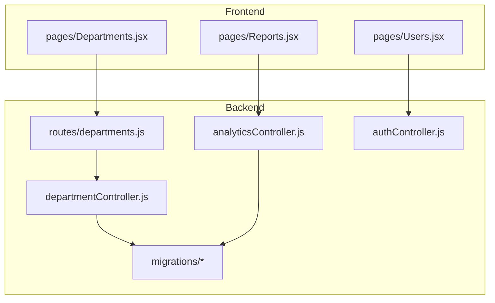
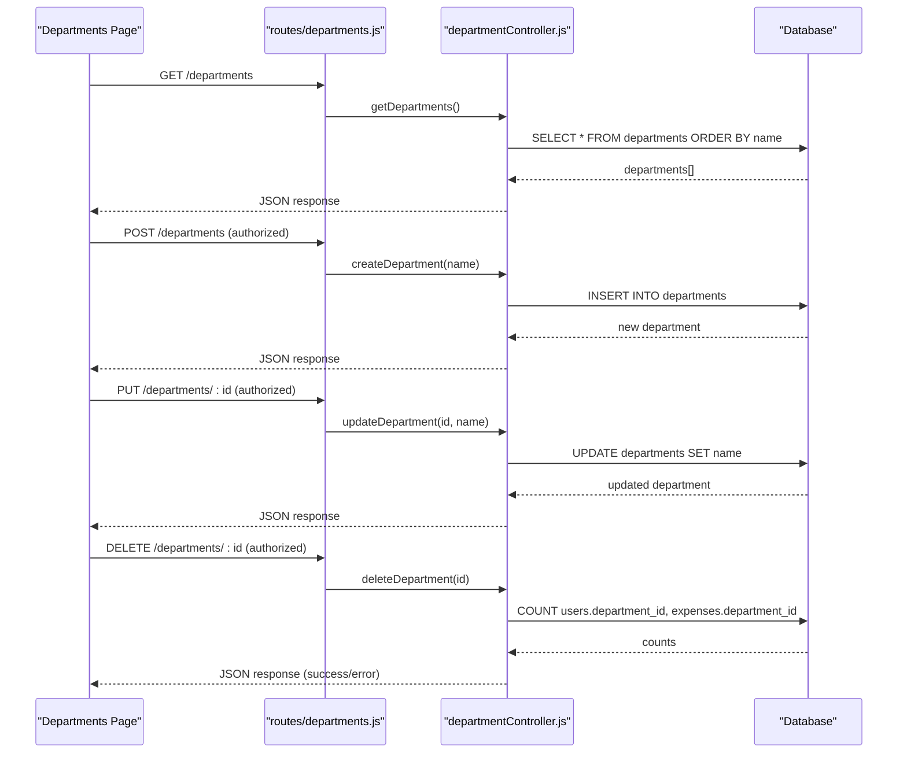
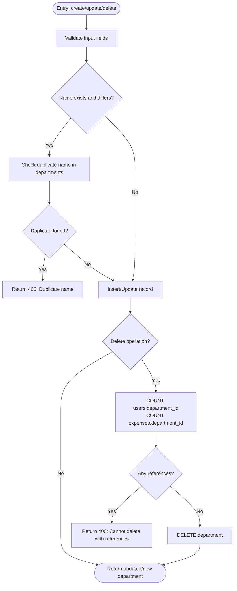
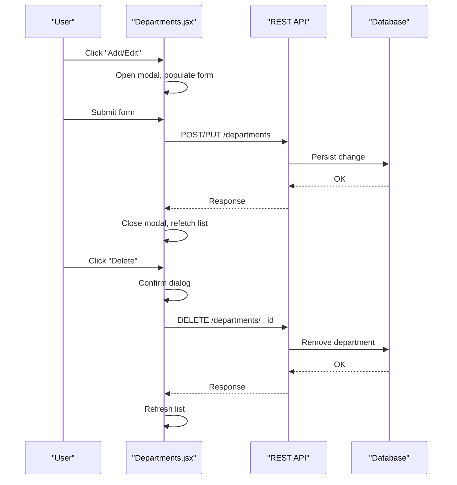
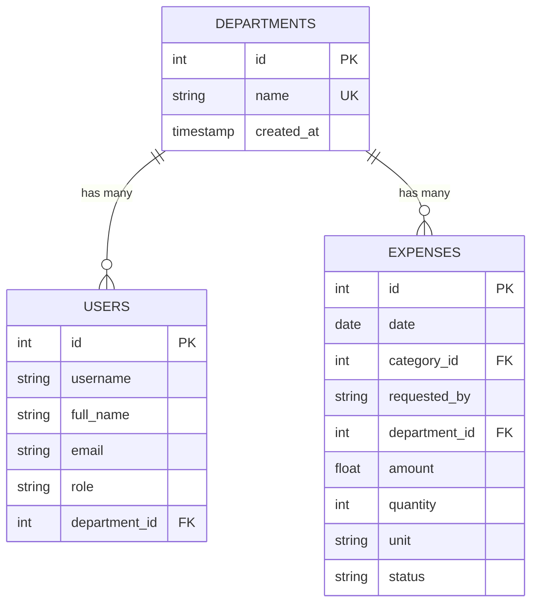
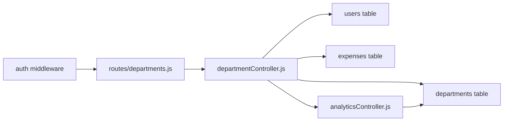

# Department Management

<cite>
**Referenced Files in This Document**
- [departmentController.js](file://backend/src/controllers/departmentController.js)
- [departments.js](file://backend/src/routes/departments.js)
- [Departments.jsx](file://frontend/src/pages/Departments.jsx)
- [20260512000000_initial_schema.js](file://backend/src/db/migrations/20260512000000_initial_schema.js)
- [20260529120000_add_expense_units_setting.js](file://backend/src/db/migrations/20260529120000_add_expense_units_setting.js)
- [Reports.jsx](file://frontend/src/pages/Reports.jsx)
- [analyticsController.js](file://backend/src/controllers/analyticsController.js)
- [authController.js](file://backend/src/controllers/authController.js)
- [Users.jsx](file://frontend/src/pages/Users.jsx)
- [approvalController.js](file://backend/src/controllers/approvalController.js)
- [approvalService.js](file://backend/src/services/approvalService.js)
- [approval.js](file://backend/src/routes/approval.js)
- [Reports.js](file://frontend/src/pages/Reports.js)
- [Expenses.jsx](file://frontend/src/pages/Expenses.jsx)
- [Reports.jsx](file://frontend/src/pages/Reports.jsx)
</cite>

## Table of Contents
1. [Introduction](#introduction)
2. [Project Structure](#project-structure)
3. [Core Components](#core-components)
4. [Architecture Overview](#architecture-overview)
5. [Detailed Component Analysis](#detailed-component-analysis)
6. [Dependency Analysis](#dependency-analysis)
7. [Performance Considerations](#performance-considerations)
8. [Troubleshooting Guide](#troubleshooting-guide)
9. [Conclusion](#conclusion)
10. [Appendices](#appendices)

## Introduction
This document explains the department management functionality within the petty cash system. It covers department creation and modification, organizational structure maintenance, cost center assignments, and how departments integrate with expense management, approvals, analytics, and reporting. It also outlines department head designation, approval authority delegation, workflow routing, analytics and utilization insights, and operational procedures for reorganization, data migration, and historical tracking.

## Project Structure
Department management spans three layers:
- Backend controller and route for CRUD operations on departments
- Frontend page for managing departments
- Database schema and migrations defining the departments table and its relationship to expenses and users

**Diagram sources**
- [departmentController.js:1-88](file://backend/src/controllers/departmentController.js#L1-L88)
- [departments.js:1-12](file://backend/src/routes/departments.js#L1-L12)
- [Departments.jsx:1-132](file://frontend/src/pages/Departments.jsx#L1-L132)
- [20260512000000_initial_schema.js:1-36](file://backend/src/db/migrations/20260512000000_initial_schema.js#L1-L36)
- [analyticsController.js:30-40](file://backend/src/controllers/analyticsController.js#L30-L40)

**Section sources**
- [departmentController.js:1-88](file://backend/src/controllers/departmentController.js#L1-L88)
- [departments.js:1-12](file://backend/src/routes/departments.js#L1-L12)
- [Departments.jsx:1-132](file://frontend/src/pages/Departments.jsx#L1-L132)
- [20260512000000_initial_schema.js:1-36](file://backend/src/db/migrations/20260512000000_initial_schema.js#L1-L36)

## Core Components
- Department controller: Implements GET/POST/PUT/DELETE endpoints for departments with validation and referential integrity checks against users and expenses.
- Department routes: Exposes endpoints protected by authentication and authorization middleware.
- Department page: Provides a UI to list, create, edit, and delete departments with loading states and modal forms.
- Database schema: Defines the departments table with unique name and created timestamp, and establishes foreign keys in dependent tables.

Key capabilities:
- Create departments with unique names
- Update department names ensuring uniqueness
- Delete departments only if unused by users and expenses
- List departments ordered by name
- Integrate with analytics and reporting by joining with expenses

**Section sources**
- [departmentController.js:3-87](file://backend/src/controllers/departmentController.js#L3-L87)
- [departments.js:6-9](file://backend/src/routes/departments.js#L6-L9)
- [Departments.jsx:13-52](file://frontend/src/pages/Departments.jsx#L13-L52)
- [20260512000000_initial_schema.js:4-16](file://backend/src/db/migrations/20260512000000_initial_schema.js#L4-L16)

## Architecture Overview
Department management follows a standard MVC pattern with explicit authorization controls and data integrity safeguards.

**Diagram sources**
- [departments.js:6-9](file://backend/src/routes/departments.js#L6-L9)
- [departmentController.js:3-87](file://backend/src/controllers/departmentController.js#L3-L87)

## Detailed Component Analysis

### Department Controller Logic
The controller enforces:
- Unique department names during creation and updates
- Prevents deletion if the department is referenced by users or expenses
- Returns structured success/error responses with appropriate HTTP status codes

**Diagram sources**
- [departmentController.js:12-87](file://backend/src/controllers/departmentController.js#L12-L87)

**Section sources**
- [departmentController.js:12-87](file://backend/src/controllers/departmentController.js#L12-L87)

### Department Routes and Authorization
- GET /departments: Publicly accessible via authentication middleware
- POST /departments, PUT /departments/:id, DELETE /departments/:id: Restricted to Super Admin and Accounting roles

**Section sources**
- [departments.js:6-9](file://backend/src/routes/departments.js#L6-L9)

### Frontend Department Management UI
The UI provides:
- Grid listing of departments with icons and creation date
- Modal forms for create/edit
- Confirmation prompt for deletion
- Real-time refresh after operations

**Diagram sources**
- [Departments.jsx:29-52](file://frontend/src/pages/Departments.jsx#L29-L52)

**Section sources**
- [Departments.jsx:13-52](file://frontend/src/pages/Departments.jsx#L13-L52)

### Database Schema and Migrations
- Initial schema creates departments with unique name and created timestamp
- Migration adds default departments and expense units, seeding department names
- Analytics queries join expenses with departments for reporting

**Diagram sources**
- [20260512000000_initial_schema.js:4-16](file://backend/src/db/migrations/20260512000000_initial_schema.js#L4-L16)
- [20260529120000_add_expense_units_setting.js:23-28](file://backend/src/db/migrations/20260529120000_add_expense_units_setting.js#L23-L28)

**Section sources**
- [20260512000000_initial_schema.js:4-16](file://backend/src/db/migrations/20260512000000_initial_schema.js#L4-L16)
- [20260529120000_add_expense_units_setting.js:5-28](file://backend/src/db/migrations/20260529120000_add_expense_units_setting.js#L5-L28)

### Department Budget Allocation and Expense Tracking
- Departments are linked to expenses via department_id, enabling per-department spend tracking
- Reports and analytics aggregate by department for budget oversight and utilization insights
- Expense form includes department selection, supporting cost center assignment

**Section sources**
- [Expenses.jsx:1-120](file://frontend/src/pages/Expenses.jsx#L1-L120)
- [analyticsController.js:30-40](file://backend/src/controllers/analyticsController.js#L30-L40)

### Department Head Designation and Approval Authority
- Users are associated with departments via department_id
- Approval thresholds and approvers are configured globally; while not department-specific, they enable delegation of approval authority across departments
- Multi-level approval chains can be established for high-value transactions

**Section sources**
- [authController.js:23-57](file://backend/src/controllers/authController.js#L23-L57)
- [approvalController.js:1-200](file://backend/src/controllers/approvalController.js#L1-L200)
- [approvalService.js:1-200](file://backend/src/services/approvalService.js#L1-L200)
- [approval.js:1-200](file://backend/src/routes/approval.js#L1-L200)

### Workflow Routing and Integration
- Expense submissions route through approval workflows when thresholds are exceeded
- Notifications and audits track approval actions, linking to departments via expense records
- Reports consolidate department-level summaries for oversight

**Section sources**
- [approvalController.js:1-200](file://backend/src/controllers/approvalController.js#L1-L200)
- [Reports.jsx:1-46](file://frontend/src/pages/Reports.jsx#L1-L46)

### Department Analytics and Utilization Reporting
- Analytics controller joins expenses with departments to compute totals and distributions
- Reports page supports filtering by department and exporting data for analysis

**Section sources**
- [analyticsController.js:127-130](file://backend/src/controllers/analyticsController.js#L127-L130)
- [Reports.jsx:1-46](file://frontend/src/pages/Reports.jsx#L1-L46)

### Department Reorganization, Data Migration, and Historical Tracking
- Reorganization: Rename departments via PUT endpoint; ensure no duplicate names
- Data migration: Use migrations to seed default departments and maintain schema consistency
- Historical tracking: Department created_at timestamps and audit trails in expenses support historical analysis

**Section sources**
- [departmentController.js:32-55](file://backend/src/controllers/departmentController.js#L32-L55)
- [20260529120000_add_expense_units_setting.js:5-28](file://backend/src/db/migrations/20260529120000_add_expense_units_setting.js#L5-L28)

## Dependency Analysis
Department management depends on:
- Authentication and authorization middleware for route protection
- Database integrity constraints for referential integrity
- Analytics and reporting modules for cross-module data aggregation

**Diagram sources**
- [departments.js:4-9](file://backend/src/routes/departments.js#L4-L9)
- [departmentController.js:1-88](file://backend/src/controllers/departmentController.js#L1-L88)
- [20260512000000_initial_schema.js:4-16](file://backend/src/db/migrations/20260512000000_initial_schema.js#L4-L16)

**Section sources**
- [departments.js:4-9](file://backend/src/routes/departments.js#L4-L9)
- [departmentController.js:1-88](file://backend/src/controllers/departmentController.js#L1-L88)

## Performance Considerations
- Indexing: Ensure unique index on departments.name for fast duplicate checks
- Pagination: For large datasets, implement pagination in department listing
- Caching: Cache department lists where feasible to reduce DB load
- Batch operations: Consolidate bulk department updates to minimize round trips

## Troubleshooting Guide
Common issues and resolutions:
- Duplicate department name: Ensure uniqueness before POST/PUT
- Cannot delete department: Remove users and expenses referencing the department first
- Unauthorized access: Verify role membership (Super Admin or Accounting) for write operations
- Empty department lists: Confirm database seeding and migration completion

**Section sources**
- [departmentController.js:18-22](file://backend/src/controllers/departmentController.js#L18-L22)
- [departmentController.js:66-80](file://backend/src/controllers/departmentController.js#L66-L80)
- [departments.js:7-9](file://backend/src/routes/departments.js#L7-L9)

## Conclusion
Department management in this system provides robust CRUD operations with strong referential integrity, integrates seamlessly with expense tracking and approvals, and supports comprehensive analytics and reporting. The modular design ensures clear separation of concerns, while migrations and schema definitions maintain data consistency across deployments.

## Appendices

### Examples of Department Configurations
- Default departments seeded via migration for common organizational units
- Expense units configured globally and applied to expense entries

**Section sources**
- [20260529120000_add_expense_units_setting.js:5-28](file://backend/src/db/migrations/20260529120000_add_expense_units_setting.js#L5-L28)

### Integration with Expense Management Systems
- Department selection in expense creation binds costs to departments
- Reporting aggregates by department for budget oversight

**Section sources**
- [Expenses.jsx:1-120](file://frontend/src/pages/Expenses.jsx#L1-L120)
- [Reports.jsx:1-46](file://frontend/src/pages/Reports.jsx#L1-L46)