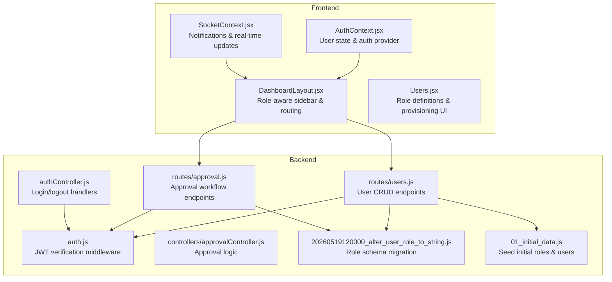
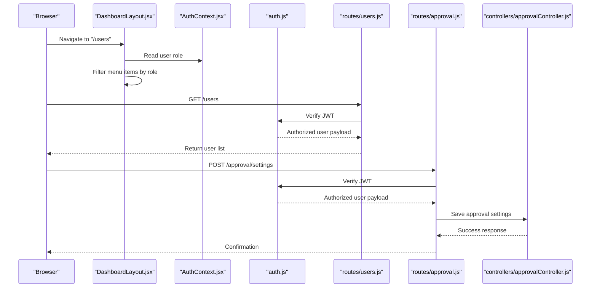
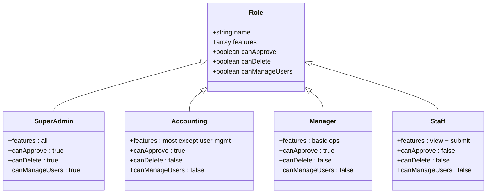
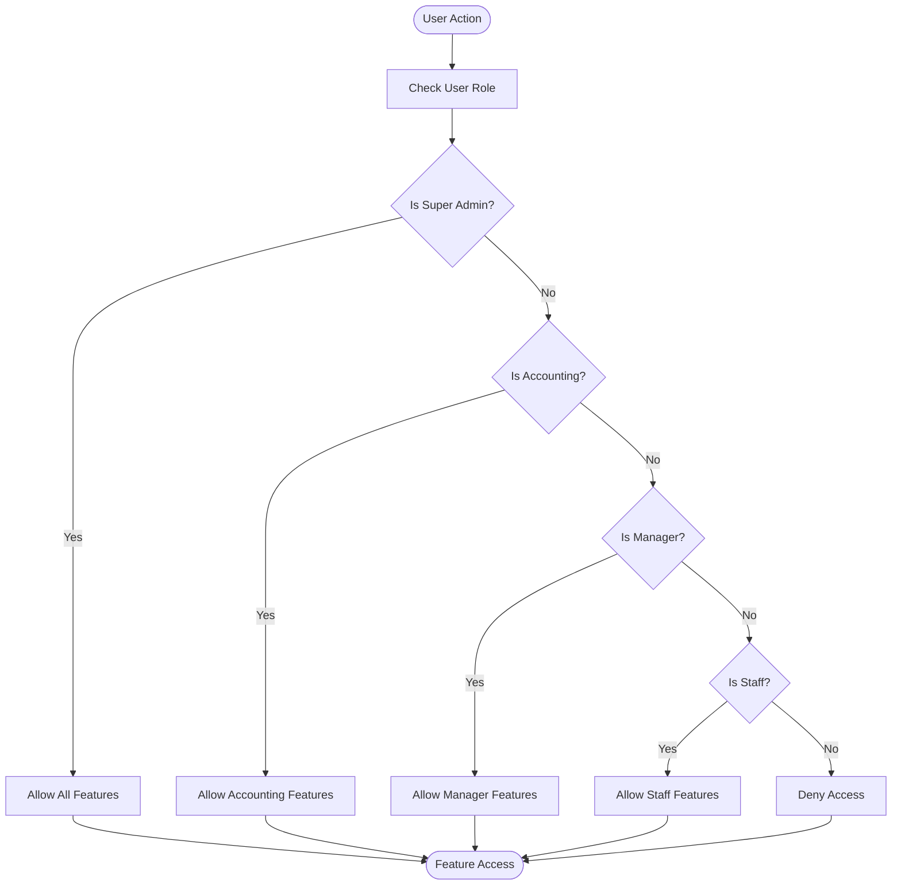
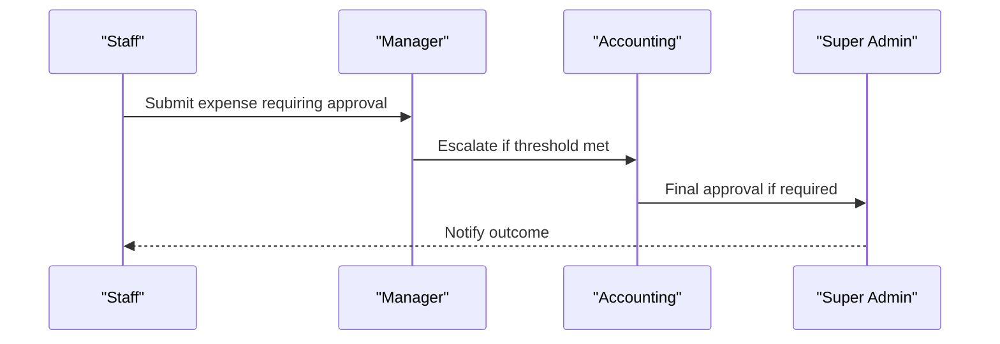
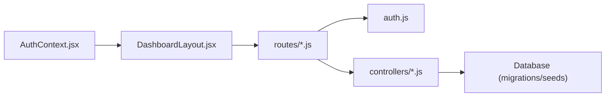

# Role & Permission System

<cite>
**Referenced Files in This Document**
- [Users.jsx](file://frontend/src/pages/Users.jsx)
- [USER_MANUAL.md](file://USER_MANUAL.md)
- [index.js](file://frontend/src/App.jsx)
- [AuthContext.jsx](file://frontend/src/context/AuthContext.jsx)
- [SocketContext.jsx](file://frontend/src/context/SocketContext.jsx)
- [DashboardLayout.jsx](file://frontend/src/layouts/DashboardLayout.jsx)
- [auth.js](file://backend/src/middleware/auth.js)
- [authController.js](file://backend/src/controllers/authController.js)
- [users.js](file://backend/src/routes/users.js)
- [approval.js](file://backend/src/routes/approval.js)
- [approvalController.js](file://backend/src/controllers/approvalController.js)
- [20260519120000_alter_user_role_to_string.js](file://backend/src/db/migrations/20260519120000_alter_user_role_to_string.js)
- [01_initial_data.js](file://backend/src/db/seeds/01_initial_data.js)
</cite>

## Table of Contents
1. [Introduction](#introduction)
2. [Project Structure](#project-structure)
3. [Core Components](#core-components)
4. [Architecture Overview](#architecture-overview)
5. [Detailed Component Analysis](#detailed-component-analysis)
6. [Dependency Analysis](#dependency-analysis)
7. [Performance Considerations](#performance-considerations)
8. [Troubleshooting Guide](#troubleshooting-guide)
9. [Conclusion](#conclusion)

## Introduction
This document describes the Role-Based Access Control (RBAC) system implemented in the petty cash management application. It covers role definitions, permission assignments, access control enforcement, user role hierarchy, privilege escalation pathways, and security policies. It also documents role-based navigation, feature access, and data visibility controls, along with role assignment workflows, permission inheritance, dynamic access control, audit logging, compliance reporting, security monitoring, conflict resolution, and integration with approval workflows.

## Project Structure
The RBAC system spans both frontend and backend components:
- Frontend: Authentication context, layout-based navigation filtering, and role-aware UI rendering
- Backend: Authentication middleware, user route handlers, approval workflows, and database schema supporting roles

**Diagram sources**
- [AuthContext.jsx](file://frontend/src/context/AuthContext.jsx)
- [SocketContext.jsx](file://frontend/src/context/SocketContext.jsx)
- [DashboardLayout.jsx](file://frontend/src/layouts/DashboardLayout.jsx)
- [Users.jsx](file://frontend/src/pages/Users.jsx)
- [auth.js](file://backend/src/middleware/auth.js)
- [authController.js](file://backend/src/controllers/authController.js)
- [users.js](file://backend/src/routes/users.js)
- [approval.js](file://backend/src/routes/approval.js)
- [approvalController.js](file://backend/src/controllers/approvalController.js)
- [20260519120000_alter_user_role_to_string.js](file://backend/src/db/migrations/20260519120000_alter_user_role_to_string.js)
- [01_initial_data.js](file://backend/src/db/seeds/01_initial_data.js)

**Section sources**
- [AuthContext.jsx](file://frontend/src/context/AuthContext.jsx)
- [DashboardLayout.jsx](file://frontend/src/layouts/DashboardLayout.jsx)
- [Users.jsx](file://frontend/src/pages/Users.jsx)
- [auth.js](file://backend/src/middleware/auth.js)
- [authController.js](file://backend/src/controllers/authController.js)
- [users.js](file://backend/src/routes/users.js)
- [approval.js](file://backend/src/routes/approval.js)
- [approvalController.js](file://backend/src/controllers/approvalController.js)
- [20260519120000_alter_user_role_to_string.js](file://backend/src/db/migrations/20260519120000_alter_user_role_to_string.js)
- [01_initial_data.js](file://backend/src/db/seeds/01_initial_data.js)

## Core Components
- Role definitions: Four-tier RBAC model with explicit role names used across UI and backend
- Permission matrix: Feature-level permissions per role documented in the user manual
- Authentication context: Centralized user state and token management
- Navigation filtering: Sidebar and route-level access control based on roles
- Approval workflows: Multi-level escalation for high-value transactions
- Audit and logging: Real-time notifications and persistent logs for compliance

**Section sources**
- [Users.jsx](file://frontend/src/pages/Users.jsx)
- [USER_MANUAL.md](file://USER_MANUAL.md)
- [AuthContext.jsx](file://frontend/src/context/AuthContext.jsx)
- [DashboardLayout.jsx](file://frontend/src/layouts/DashboardLayout.jsx)
- [approval.js](file://backend/src/routes/approval.js)
- [approvalController.js](file://backend/src/controllers/approvalController.js)

## Architecture Overview
The RBAC architecture integrates frontend role-aware rendering with backend middleware and route guards. Approval escalations are enforced through dedicated endpoints and workflows.

**Diagram sources**
- [DashboardLayout.jsx](file://frontend/src/layouts/DashboardLayout.jsx)
- [AuthContext.jsx](file://frontend/src/context/AuthContext.jsx)
- [auth.js](file://backend/src/middleware/auth.js)
- [users.js](file://backend/src/routes/users.js)
- [approval.js](file://backend/src/routes/approval.js)
- [approvalController.js](file://backend/src/controllers/approvalController.js)

## Detailed Component Analysis

### Role Definitions and Hierarchy
- Roles: Super Admin, Accounting, Manager, Staff
- Hierarchy: Super Admin > Accounting > Manager > Staff
- Enforcement: UI filtering, route guards, and backend middleware

**Diagram sources**
- [Users.jsx](file://frontend/src/pages/Users.jsx)
- [USER_MANUAL.md](file://USER_MANUAL.md)

**Section sources**
- [Users.jsx](file://frontend/src/pages/Users.jsx)
- [USER_MANUAL.md](file://USER_MANUAL.md)

### Permission Assignments and Access Control Mechanisms
- Frontend access control: Sidebar and route filtering based on user role
- Backend access control: JWT middleware validates tokens and enforces route-level permissions
- Feature-level permissions: Explicitly defined in the user manual permission matrix

**Diagram sources**
- [DashboardLayout.jsx](file://frontend/src/layouts/DashboardLayout.jsx)
- [auth.js](file://backend/src/middleware/auth.js)
- [USER_MANUAL.md](file://USER_MANUAL.md)

**Section sources**
- [DashboardLayout.jsx](file://frontend/src/layouts/DashboardLayout.jsx)
- [auth.js](file://backend/src/middleware/auth.js)
- [USER_MANUAL.md](file://USER_MANUAL.md)

### User Role Hierarchy and Privilege Escalation
- Hierarchical privileges: Higher roles inherit lower-role capabilities plus additional permissions
- Escalation path: Approval thresholds trigger multi-level approval chain managed by backend controllers

**Diagram sources**
- [approval.js](file://backend/src/routes/approval.js)
- [approvalController.js](file://backend/src/controllers/approvalController.js)
- [USER_MANUAL.md](file://USER_MANUAL.md)

**Section sources**
- [approval.js](file://backend/src/routes/approval.js)
- [approvalController.js](file://backend/src/controllers/approvalController.js)
- [USER_MANUAL.md](file://USER_MANUAL.md)

### Security Policies and Data Visibility Controls
- Token-based authentication: JWT verified by middleware
- Role-based data visibility: UI components and API responses filtered by role
- Real-time notifications: Critical events surfaced to authorized users

**Section sources**
- [auth.js](file://backend/src/middleware/auth.js)
- [AuthContext.jsx](file://frontend/src/context/AuthContext.jsx)
- [SocketContext.jsx](file://frontend/src/context/SocketContext.jsx)

### Role-Based Navigation and Feature Access
- Sidebar navigation: Items rendered conditionally based on role
- Route protection: Protected routes enforce role checks
- Feature toggles: UI components enable/disable based on role capabilities

**Section sources**
- [DashboardLayout.jsx](file://frontend/src/layouts/DashboardLayout.jsx)
- [index.js](file://frontend/src/App.jsx)

### Role Assignment Workflows and Dynamic Access Control
- Provisioning UI: Role selection during user creation/editing
- Dynamic updates: Role changes reflected immediately in UI and backend validations

**Section sources**
- [Users.jsx](file://frontend/src/pages/Users.jsx)
- [users.js](file://backend/src/routes/users.js)

### Audit Logging, Compliance Reporting, and Security Monitoring
- Real-time alerts: Critical and important notifications with priority levels
- Persistent logs: Audit trails for financial actions
- Compliance-ready: Structured logs support regulatory requirements

**Section sources**
- [SocketContext.jsx](file://frontend/src/context/SocketContext.jsx)
- [USER_MANUAL.md](file://USER_MANUAL.md)

### Role Conflicts Resolution and Permission Conflicts
- Conflict detection: Role-aware UI prevents invalid actions
- Permission inheritance: Clear precedence reduces ambiguity
- Escalation workflows: Defined approval paths resolve conflicting requests

**Section sources**
- [DashboardLayout.jsx](file://frontend/src/layouts/DashboardLayout.jsx)
- [approval.js](file://backend/src/routes/approval.js)

### Examples of Role Configurations and Approval Workflow Integration
- Initial roles: Seeded during database initialization
- Approval thresholds: Configurable limits with email notifications
- Multi-level approvers: Chain of authority for high-value transactions

**Section sources**
- [20260519120000_alter_user_role_to_string.js](file://backend/src/db/migrations/20260519120000_alter_user_role_to_string.js)
- [01_initial_data.js](file://backend/src/db/seeds/01_initial_data.js)
- [approval.js](file://backend/src/routes/approval.js)
- [approvalController.js](file://backend/src/controllers/approvalController.js)

## Dependency Analysis
The RBAC system depends on:
- Authentication context for user state
- Middleware for token validation
- Route handlers for role-enforced endpoints
- Database migrations for role schema
- Seed data for initial roles

**Diagram sources**
- [AuthContext.jsx](file://frontend/src/context/AuthContext.jsx)
- [DashboardLayout.jsx](file://frontend/src/layouts/DashboardLayout.jsx)
- [auth.js](file://backend/src/middleware/auth.js)
- [users.js](file://backend/src/routes/users.js)
- [approval.js](file://backend/src/routes/approval.js)
- [approvalController.js](file://backend/src/controllers/approvalController.js)
- [20260519120000_alter_user_role_to_string.js](file://backend/src/db/migrations/20260519120000_alter_user_role_to_string.js)
- [01_initial_data.js](file://backend/src/db/seeds/01_initial_data.js)

**Section sources**
- [AuthContext.jsx](file://frontend/src/context/AuthContext.jsx)
- [DashboardLayout.jsx](file://frontend/src/layouts/DashboardLayout.jsx)
- [auth.js](file://backend/src/middleware/auth.js)
- [users.js](file://backend/src/routes/users.js)
- [approval.js](file://backend/src/routes/approval.js)
- [approvalController.js](file://backend/src/controllers/approvalController.js)
- [20260519120000_alter_user_role_to_string.js](file://backend/src/db/migrations/20260519120000_alter_user_role_to_string.js)
- [01_initial_data.js](file://backend/src/db/seeds/01_initial_data.js)

## Performance Considerations
- Minimal overhead: Role checks are lightweight and cached via context
- Efficient filtering: UI renders only permitted items
- Scalable approval workflows: Asynchronous notifications and database-backed audit trails

## Troubleshooting Guide
- Authentication failures: Verify JWT presence and validity
- Role mismatches: Confirm seed data and migration status
- Approval workflow errors: Check threshold settings and approver configuration
- UI not reflecting role changes: Refresh context and reload affected views

**Section sources**
- [auth.js](file://backend/src/middleware/auth.js)
- [20260519120000_alter_user_role_to_string.js](file://backend/src/db/migrations/20260519120000_alter_user_role_to_string.js)
- [01_initial_data.js](file://backend/src/db/seeds/01_initial_data.js)
- [approval.js](file://backend/src/routes/approval.js)

## Conclusion
The RBAC system provides a clear, hierarchical, and enforceable framework for access control across the petty cash application. It combines frontend role-aware UI with robust backend middleware and approval workflows, ensuring strong security, compliance readiness, and operational efficiency.