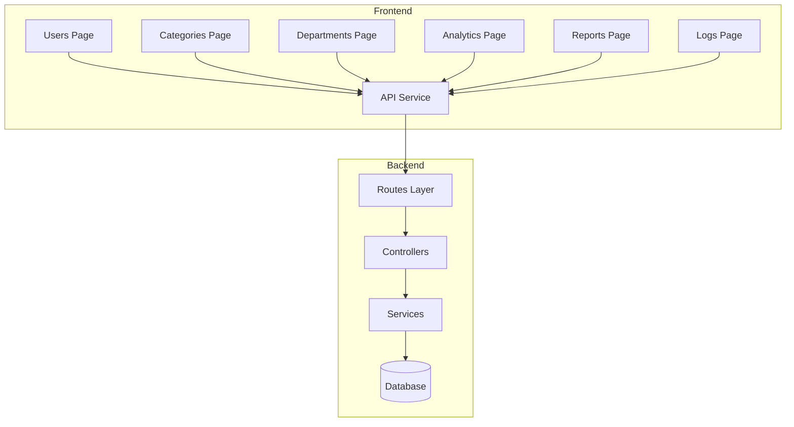
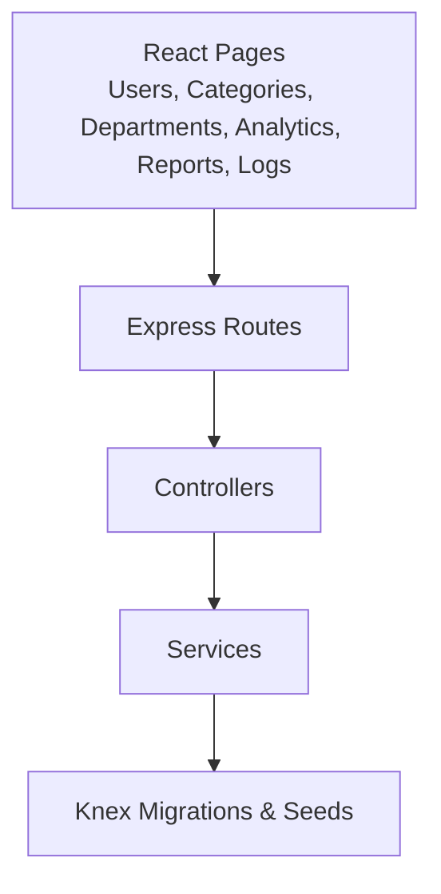
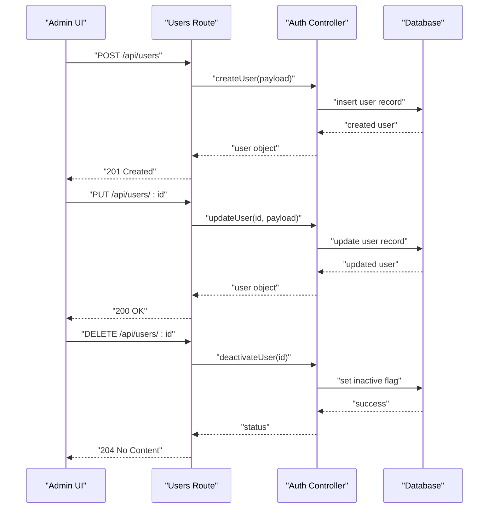
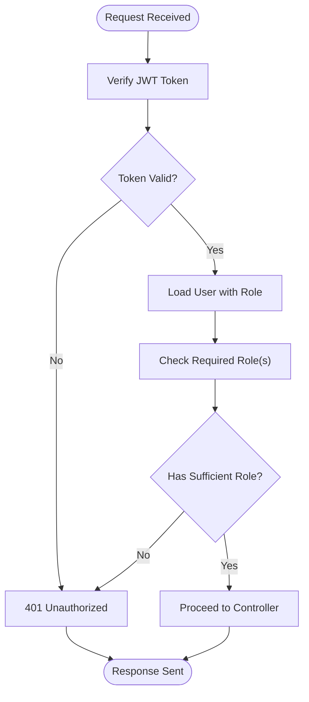
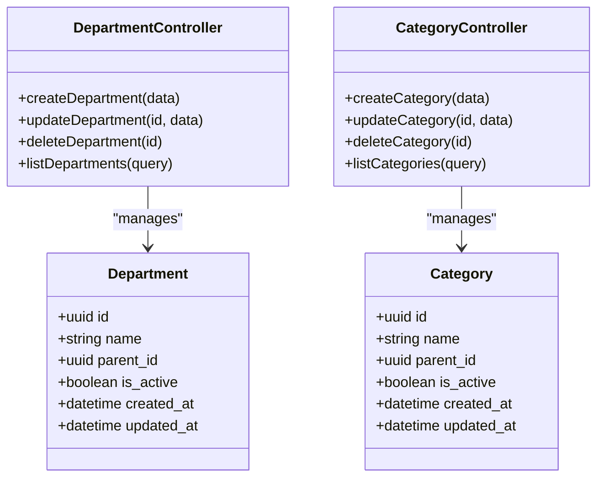
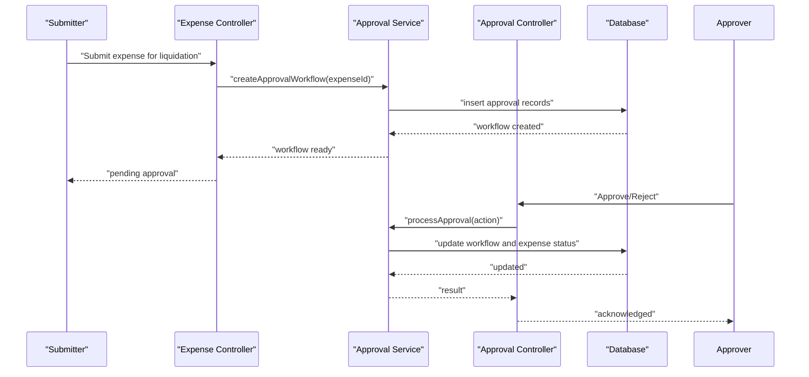
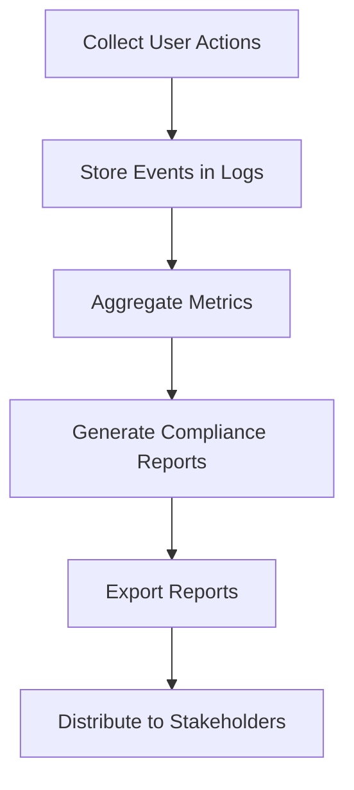
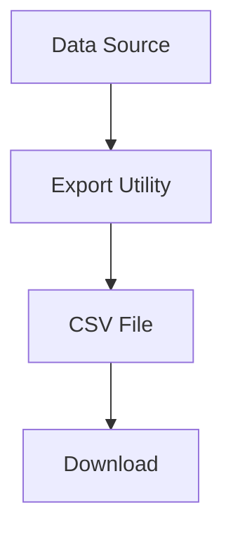
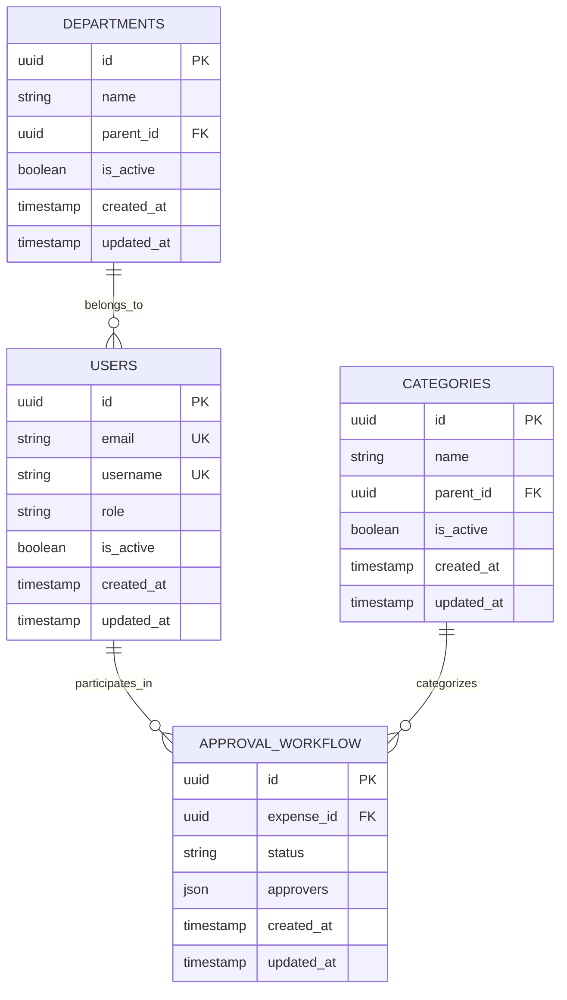
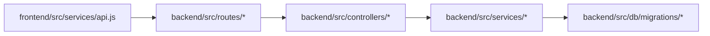

# User Administration

<cite>
**Referenced Files in This Document**
- [README.md](file://README.md)
- [USER_MANUAL.md](file://USER_MANUAL.md)
- [deployment_guide.md](file://deployment_guide.md)
- [backend/src/routes/users.js](file://backend/src/routes/users.js)
- [backend/src/controllers/authController.js](file://backend/src/controllers/authController.js)
- [backend/src/middleware/auth.js](file://backend/src/middleware/auth.js)
- [backend/src/db/migrations/20260519120000_alter_user_role_to_string.js](file://backend/src/db/migrations/20260519120000_alter_user_role_to_string.js)
- [backend/src/db/migrations/20260512000000_initial_schema.js](file://backend/src/db/migrations/20260512000000_initial_schema.js)
- [backend/src/db/migrations/20260611000000_add_liquidation_approval_workflow.js](file://backend/src/db/migrations/20260611000000_add_liquidation_approval_workflow.js)
- [backend/src/services/approvalService.js](file://backend/src/services/approvalService.js)
- [backend/src/controllers/approvalController.js](file://backend/src/controllers/approvalController.js)
- [backend/src/controllers/categoryController.js](file://backend/src/controllers/categoryController.js)
- [backend/src/controllers/departmentController.js](file://backend/src/controllers/departmentController.js)
- [backend/src/controllers/analyticsController.js](file://backend/src/controllers/analyticsController.js)
- [backend/src/controllers/logController.js](file://backend/src/controllers/logController.js)
- [backend/src/utils/create_db.js](file://backend/src/utils/create_db.js)
- [backend/knexfile.js](file://backend/knexfile.js)
- [frontend/src/pages/Users.jsx](file://frontend/src/pages/Users.jsx)
- [frontend/src/pages/Categories.jsx](file://frontend/src/pages/Categories.jsx)
- [frontend/src/pages/Departments.jsx](file://frontend/src/pages/Departments.jsx)
- [frontend/src/pages/Reports.jsx](file://frontend/src/pages/Reports.jsx)
- [frontend/src/pages/Analytics.jsx](file://frontend/src/pages/Analytics.jsx)
- [frontend/src/pages/Logs.jsx](file://frontend/src/pages/Logs.jsx)
- [frontend/src/services/api.js](file://frontend/src/services/api.js)
</cite>

## Table of Contents
1. [Introduction](#introduction)
2. [Project Structure](#project-structure)
3. [Core Components](#core-components)
4. [Architecture Overview](#architecture-overview)
5. [Detailed Component Analysis](#detailed-component-analysis)
6. [Dependency Analysis](#dependency-analysis)
7. [Performance Considerations](#performance-considerations)
8. [Troubleshooting Guide](#troubleshooting-guide)
9. [Conclusion](#conclusion)
10. [Appendices](#appendices)

## Introduction
This document provides comprehensive user administration documentation for the petty cash management system. It covers user account lifecycle management, role configuration, and organizational structure. It also documents role-based access control, permissions, security policies, department and category management, reporting structures, user provisioning, bulk operations, import/export capabilities, user analytics and activity monitoring, compliance reporting, and integrations with approval workflows and expense management systems.

## Project Structure
The system comprises a backend built with Node.js and a frontend built with React. The backend exposes REST endpoints for user management, approvals, categories, departments, analytics, logs, and other administrative functions. The frontend provides user-facing pages for managing users, categories, departments, reports, analytics, and logs. Database migrations define the schema and evolve the system over time.

**Section sources**
- [README.md](file://README.md)
- [USER_MANUAL.md](file://USER_MANUAL.md)

## Core Components
- User Management: Endpoints and controllers for creating, updating, deactivating, and provisioning users.
- Role-Based Access Control (RBAC): String-based roles and middleware enforcement for secure access.
- Organizational Structure: Departments and categories as hierarchical entities supporting reporting and categorization.
- Approvals and Expense Workflows: Liquidation approval workflow integrated with user roles and permissions.
- Analytics and Compliance: Activity monitoring, logs, and reporting for compliance and auditing.
- Provisioning and Bulk Operations: Seed data and database initialization utilities for onboarding new environments.
- Import/Export: Frontend utilities for exporting data to CSV and related reporting pages.

**Section sources**
- [backend/src/routes/users.js](file://backend/src/routes/users.js)
- [backend/src/controllers/authController.js](file://backend/src/controllers/authController.js)
- [backend/src/middleware/auth.js](file://backend/src/middleware/auth.js)
- [backend/src/db/migrations/20260519120000_alter_user_role_to_string.js](file://backend/src/db/migrations/20260519120000_alter_user_role_to_string.js)
- [backend/src/db/migrations/20260611000000_add_liquidation_approval_workflow.js](file://backend/src/db/migrations/20260611000000_add_liquidation_approval_workflow.js)
- [backend/src/controllers/analyticsController.js](file://backend/src/controllers/analyticsController.js)
- [backend/src/controllers/logController.js](file://backend/src/controllers/logController.js)
- [backend/src/utils/create_db.js](file://backend/src/utils/create_db.js)
- [frontend/src/pages/Users.jsx](file://frontend/src/pages/Users.jsx)
- [frontend/src/pages/Categories.jsx](file://frontend/src/pages/Categories.jsx)
- [frontend/src/pages/Departments.jsx](file://frontend/src/pages/Departments.jsx)
- [frontend/src/pages/Reports.jsx](file://frontend/src/pages/Reports.jsx)
- [frontend/src/pages/Analytics.jsx](file://frontend/src/pages/Analytics.jsx)
- [frontend/src/pages/Logs.jsx](file://frontend/src/pages/Logs.jsx)
- [frontend/src/services/api.js](file://frontend/src/services/api.js)

## Architecture Overview
The user administration architecture follows a layered pattern:
- Presentation Layer: React pages for user, categories, departments, analytics, reports, and logs.
- API Layer: Express routes delegating to controllers.
- Business Logic Layer: Controllers implementing domain-specific logic; services encapsulating reusable operations.
- Persistence Layer: Knex.js migrations and seed data define schema and initial datasets.

**Diagram sources**
- [backend/src/routes/users.js](file://backend/src/routes/users.js)
- [backend/src/controllers/authController.js](file://backend/src/controllers/authController.js)
- [backend/src/controllers/analyticsController.js](file://backend/src/controllers/analyticsController.js)
- [backend/src/controllers/logController.js](file://backend/src/controllers/logController.js)
- [backend/src/db/migrations/20260519120000_alter_user_role_to_string.js](file://backend/src/db/migrations/20260519120000_alter_user_role_to_string.js)
- [backend/src/db/migrations/20260611000000_add_liquidation_approval_workflow.js](file://backend/src/db/migrations/20260611000000_add_liquidation_approval_workflow.js)
- [backend/src/utils/create_db.js](file://backend/src/utils/create_db.js)
- [frontend/src/pages/Users.jsx](file://frontend/src/pages/Users.jsx)
- [frontend/src/pages/Categories.jsx](file://frontend/src/pages/Categories.jsx)
- [frontend/src/pages/Departments.jsx](file://frontend/src/pages/Departments.jsx)
- [frontend/src/pages/Analytics.jsx](file://frontend/src/pages/Analytics.jsx)
- [frontend/src/pages/Reports.jsx](file://frontend/src/pages/Reports.jsx)
- [frontend/src/pages/Logs.jsx](file://frontend/src/pages/Logs.jsx)

## Detailed Component Analysis

### User Account Lifecycle
- Creation: Endpoint accepts user data and persists validated records.
- Modification: Endpoint updates user attributes with validation and audit logging.
- Deactivation: Endpoint toggles active status and revokes access tokens.
- Provisioning: Seed data initializes admin and sample users; database initialization script supports clean deployments.
- Bulk Operations: Seed files provide sample datasets for testing and onboarding.

**Diagram sources**
- [backend/src/routes/users.js](file://backend/src/routes/users.js)
- [backend/src/controllers/authController.js](file://backend/src/controllers/authController.js)
- [backend/src/utils/create_db.js](file://backend/src/utils/create_db.js)

**Section sources**
- [backend/src/routes/users.js](file://backend/src/routes/users.js)
- [backend/src/controllers/authController.js](file://backend/src/controllers/authController.js)
- [backend/src/utils/create_db.js](file://backend/src/utils/create_db.js)

### Role-Based Access Control (RBAC)
- Roles are stored as strings in the database, enabling flexible role definitions.
- Authentication middleware enforces protected routes and validates tokens.
- Controllers enforce role checks for sensitive operations (e.g., user management, approvals).

**Diagram sources**
- [backend/src/middleware/auth.js](file://backend/src/middleware/auth.js)
- [backend/src/db/migrations/20260519120000_alter_user_role_to_string.js](file://backend/src/db/migrations/20260519120000_alter_user_role_to_string.js)

**Section sources**
- [backend/src/middleware/auth.js](file://backend/src/middleware/auth.js)
- [backend/src/db/migrations/20260519120000_alter_user_role_to_string.js](file://backend/src/db/migrations/20260519120000_alter_user_role_to_string.js)

### Organizational Structure: Departments and Categories
- Departments: Hierarchical units used for reporting and budget allocation.
- Categories: Expense classification system supporting categorization and analytics.
- Both resources support CRUD operations via dedicated controllers and routes.

**Diagram sources**
- [backend/src/controllers/departmentController.js](file://backend/src/controllers/departmentController.js)
- [backend/src/controllers/categoryController.js](file://backend/src/controllers/categoryController.js)

**Section sources**
- [backend/src/controllers/departmentController.js](file://backend/src/controllers/departmentController.js)
- [backend/src/controllers/categoryController.js](file://backend/src/controllers/categoryController.js)

### Approvals and Expense Workflows
- Liquidation approval workflow integrates with user roles to route requests to approvers.
- Approval service coordinates state transitions and notifications.
- Approval controller handles actions (approve/reject) and updates related expense records.

**Diagram sources**
- [backend/src/db/migrations/20260611000000_add_liquidation_approval_workflow.js](file://backend/src/db/migrations/20260611000000_add_liquidation_approval_workflow.js)
- [backend/src/services/approvalService.js](file://backend/src/services/approvalService.js)
- [backend/src/controllers/approvalController.js](file://backend/src/controllers/approvalController.js)

**Section sources**
- [backend/src/db/migrations/20260611000000_add_liquidation_approval_workflow.js](file://backend/src/db/migrations/20260611000000_add_liquidation_approval_workflow.js)
- [backend/src/services/approvalService.js](file://backend/src/services/approvalService.js)
- [backend/src/controllers/approvalController.js](file://backend/src/controllers/approvalController.js)

### User Analytics, Activity Monitoring, and Compliance Reporting
- Analytics controller aggregates metrics for user activity and system usage.
- Logs controller provides audit trails and event logs for compliance.
- Reports page surfaces compliance-ready summaries and trends.

**Diagram sources**
- [backend/src/controllers/analyticsController.js](file://backend/src/controllers/analyticsController.js)
- [backend/src/controllers/logController.js](file://backend/src/controllers/logController.js)
- [frontend/src/pages/Analytics.jsx](file://frontend/src/pages/Analytics.jsx)
- [frontend/src/pages/Reports.jsx](file://frontend/src/pages/Reports.jsx)
- [frontend/src/pages/Logs.jsx](file://frontend/src/pages/Logs.jsx)

**Section sources**
- [backend/src/controllers/analyticsController.js](file://backend/src/controllers/analyticsController.js)
- [backend/src/controllers/logController.js](file://backend/src/controllers/logController.js)
- [frontend/src/pages/Analytics.jsx](file://frontend/src/pages/Analytics.jsx)
- [frontend/src/pages/Reports.jsx](file://frontend/src/pages/Reports.jsx)
- [frontend/src/pages/Logs.jsx](file://frontend/src/pages/Logs.jsx)

### Import/Export Capabilities
- Frontend export utilities enable CSV exports for categories, departments, and analytics data.
- Reports and logs pages integrate with export functions to produce compliance artifacts.

**Diagram sources**
- [frontend/src/utils/exportUtils.js](file://frontend/src/utils/exportUtils.js)
- [frontend/src/pages/Categories.jsx](file://frontend/src/pages/Categories.jsx)
- [frontend/src/pages/Departments.jsx](file://frontend/src/pages/Departments.jsx)
- [frontend/src/pages/Analytics.jsx](file://frontend/src/pages/Analytics.jsx)
- [frontend/src/pages/Reports.jsx](file://frontend/src/pages/Reports.jsx)
- [frontend/src/pages/Logs.jsx](file://frontend/src/pages/Logs.jsx)

**Section sources**
- [frontend/src/utils/exportUtils.js](file://frontend/src/utils/exportUtils.js)
- [frontend/src/pages/Categories.jsx](file://frontend/src/pages/Categories.jsx)
- [frontend/src/pages/Departments.jsx](file://frontend/src/pages/Departments.jsx)
- [frontend/src/pages/Analytics.jsx](file://frontend/src/pages/Analytics.jsx)
- [frontend/src/pages/Reports.jsx](file://frontend/src/pages/Reports.jsx)
- [frontend/src/pages/Logs.jsx](file://frontend/src/pages/Logs.jsx)

### Database Schema and Initialization
- Initial schema defines core entities including users, departments, categories, and related tables.
- Subsequent migrations evolve the schema to support approvals, roles, and additional features.
- Database initialization script and seed files support clean deployments and onboarding.

**Diagram sources**
- [backend/src/db/migrations/20260512000000_initial_schema.js](file://backend/src/db/migrations/20260512000000_initial_schema.js)
- [backend/src/db/migrations/20260519120000_alter_user_role_to_string.js](file://backend/src/db/migrations/20260519120000_alter_user_role_to_string.js)
- [backend/src/db/migrations/20260611000000_add_liquidation_approval_workflow.js](file://backend/src/db/migrations/20260611000000_add_liquidation_approval_workflow.js)

**Section sources**
- [backend/src/db/migrations/20260512000000_initial_schema.js](file://backend/src/db/migrations/20260512000000_initial_schema.js)
- [backend/src/db/migrations/20260519120000_alter_user_role_to_string.js](file://backend/src/db/migrations/20260519120000_alter_user_role_to_string.js)
- [backend/src/db/migrations/20260611000000_add_liquidation_approval_workflow.js](file://backend/src/db/migrations/20260611000000_add_liquidation_approval_workflow.js)
- [backend/src/utils/create_db.js](file://backend/src/utils/create_db.js)
- [backend/knexfile.js](file://backend/knexfile.js)

## Dependency Analysis
- Routes depend on controllers for business logic.
- Controllers depend on services for reusable operations.
- Services depend on database migrations and seed data for persistence.
- Frontend pages depend on the API service for data operations.

**Diagram sources**
- [frontend/src/services/api.js](file://frontend/src/services/api.js)
- [backend/src/routes/users.js](file://backend/src/routes/users.js)
- [backend/src/controllers/authController.js](file://backend/src/controllers/authController.js)
- [backend/src/controllers/analyticsController.js](file://backend/src/controllers/analyticsController.js)
- [backend/src/controllers/logController.js](file://backend/src/controllers/logController.js)
- [backend/src/db/migrations/20260519120000_alter_user_role_to_string.js](file://backend/src/db/migrations/20260519120000_alter_user_role_to_string.js)
- [backend/src/db/migrations/20260611000000_add_liquidation_approval_workflow.js](file://backend/src/db/migrations/20260611000000_add_liquidation_approval_workflow.js)

**Section sources**
- [frontend/src/services/api.js](file://frontend/src/services/api.js)
- [backend/src/routes/users.js](file://backend/src/routes/users.js)
- [backend/src/controllers/authController.js](file://backend/src/controllers/authController.js)
- [backend/src/controllers/analyticsController.js](file://backend/src/controllers/analyticsController.js)
- [backend/src/controllers/logController.js](file://backend/src/controllers/logController.js)
- [backend/src/db/migrations/20260519120000_alter_user_role_to_string.js](file://backend/src/db/migrations/20260519120000_alter_user_role_to_string.js)
- [backend/src/db/migrations/20260611000000_add_liquidation_approval_workflow.js](file://backend/src/db/migrations/20260611000000_add_liquidation_approval_workflow.js)

## Performance Considerations
- Use pagination and filtering in list endpoints to limit response sizes.
- Index frequently queried columns (e.g., user email, department parent_id, category parent_id).
- Batch operations for bulk provisioning to reduce round trips.
- Cache non-sensitive metadata (e.g., department and category lists) to improve UI responsiveness.
- Monitor approval workflow throughput and scale workers accordingly.

## Troubleshooting Guide
- Authentication failures: Verify JWT token validity and role claims; check middleware enforcement.
- Database connectivity: Confirm Knex configuration and migration status; ensure seeds are applied after migrations.
- Approval workflow errors: Inspect workflow state transitions and approver assignments; validate permissions.
- Export issues: Ensure export utilities are invoked with correct data sources and file formats.

**Section sources**
- [backend/src/middleware/auth.js](file://backend/src/middleware/auth.js)
- [backend/knexfile.js](file://backend/knexfile.js)
- [backend/src/db/migrations/20260519120000_alter_user_role_to_string.js](file://backend/src/db/migrations/20260519120000_alter_user_role_to_string.js)
- [backend/src/db/migrations/20260611000000_add_liquidation_approval_workflow.js](file://backend/src/db/migrations/20260611000000_add_liquidation_approval_workflow.js)
- [frontend/src/utils/exportUtils.js](file://frontend/src/utils/exportUtils.js)

## Conclusion
The user administration system provides a robust foundation for managing users, enforcing RBAC, organizing departments and categories, and integrating approvals with expense workflows. Analytics, logs, and reporting support compliance needs, while import/export capabilities streamline operational tasks. The layered architecture ensures maintainability and scalability for future enhancements.

## Appendices
- Deployment guide outlines environment setup, migrations, and seed data application.
- User manual provides operational guidance for administrators and end users.

**Section sources**
- [deployment_guide.md](file://deployment_guide.md)
- [USER_MANUAL.md](file://USER_MANUAL.md)