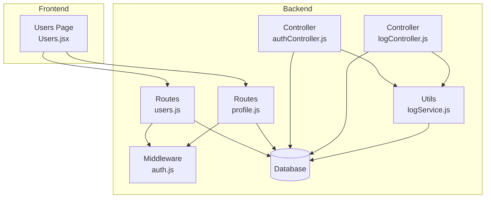
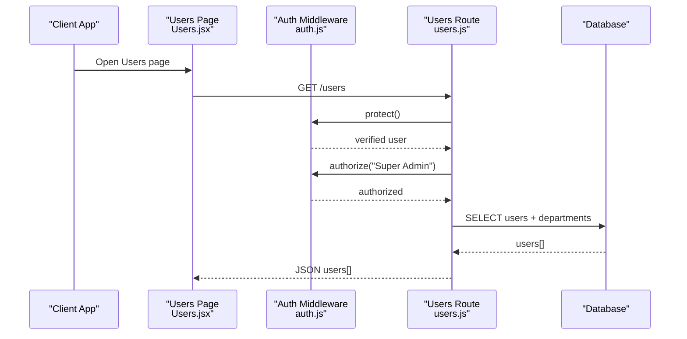
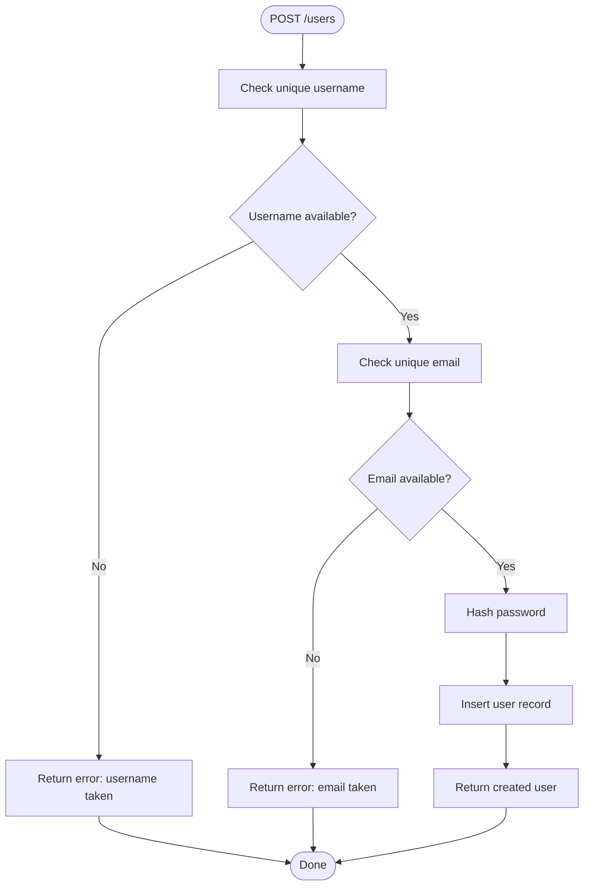
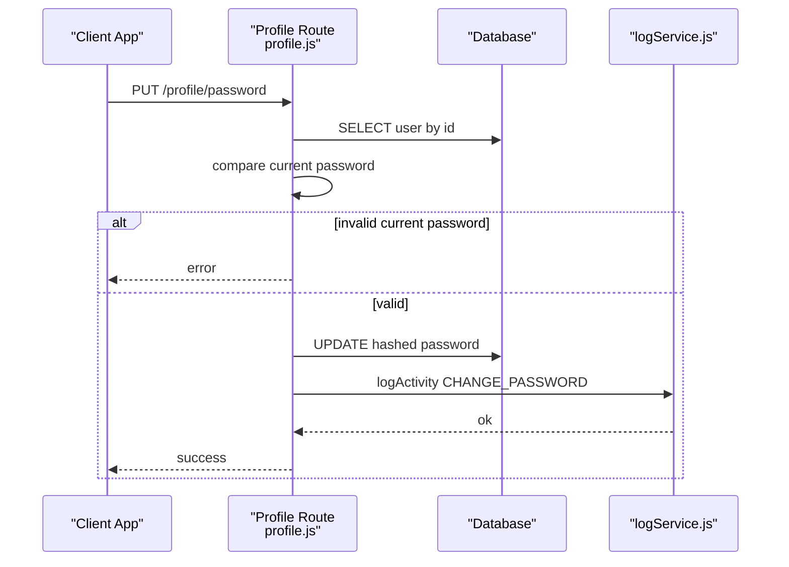
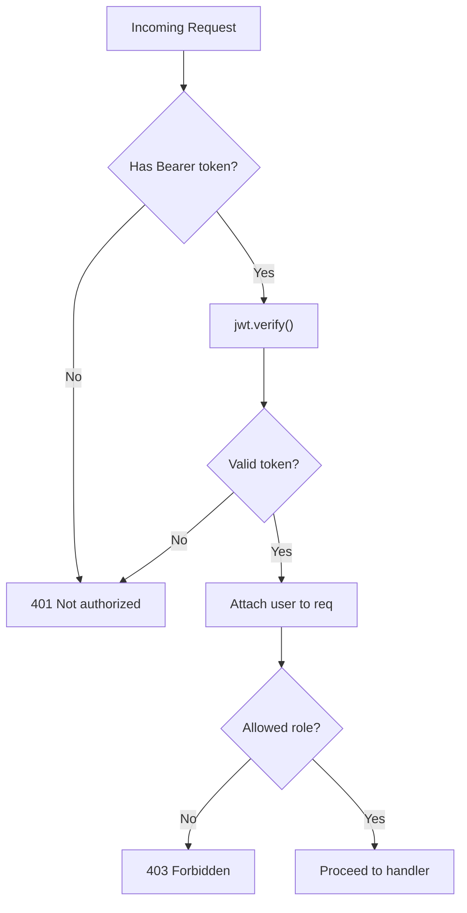
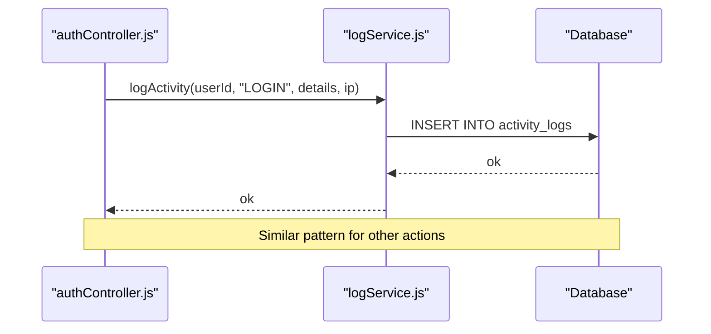
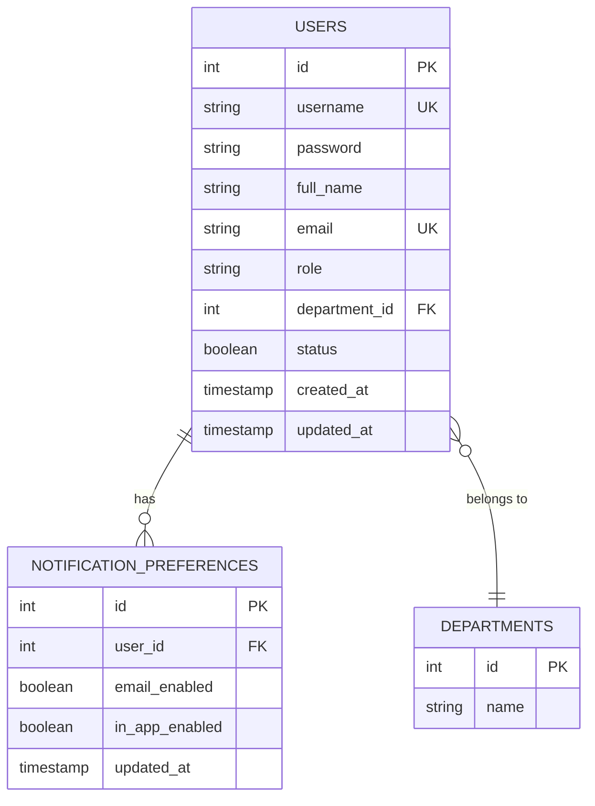
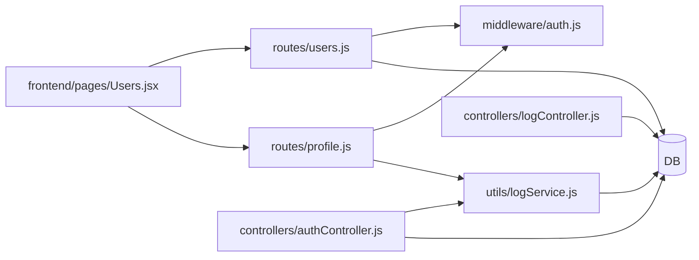

# User Management

<cite>
**Referenced Files in This Document**
- [users.js](file://backend/src/routes/users.js)
- [profile.js](file://backend/src/routes/profile.js)
- [auth.js](file://backend/src/middleware/auth.js)
- [authController.js](file://backend/src/controllers/authController.js)
- [Users.jsx](file://frontend/src/pages/Users.jsx)
- [logService.js](file://backend/src/utils/logService.js)
- [logController.js](file://backend/src/controllers/logController.js)
- [20260512000000_initial_schema.js](file://backend/src/db/migrations/20260512000000_initial_schema.js)
- [20260519120000_alter_user_role_to_string.js](file://backend/src/db/migrations/20260519120000_alter_user_role_to_string.js)
- [20260515064955_add_notifications_and_email_system.js](file://backend/src/db/migrations/20260515064955_add_notifications_and_email_system.js)
</cite>

## Table of Contents
1. [Introduction](#introduction)
2. [Project Structure](#project-structure)
3. [Core Components](#core-components)
4. [Architecture Overview](#architecture-overview)
5. [Detailed Component Analysis](#detailed-component-analysis)
6. [Dependency Analysis](#dependency-analysis)
7. [Performance Considerations](#performance-considerations)
8. [Troubleshooting Guide](#troubleshooting-guide)
9. [Conclusion](#conclusion)
10. [Appendices](#appendices)

## Introduction
This document describes the user management functionality implemented in the system. It covers account lifecycle operations (creation, modification, deletion), profile management, password handling, role-based access control, and audit logging. It also outlines search and filtering capabilities, bulk operations, provisioning workflows, import/export considerations, analytics and activity monitoring, compliance reporting via audit trails, deactivation procedures, and integration points with authentication and notifications.

## Project Structure
User management spans backend routes and controllers, middleware for authentication and authorization, database migrations defining the user schema, and a frontend page for provisioning and viewing users. Audit logging is centralized and reused across controllers.

**Diagram sources**
- [Users.jsx:1-312](file://frontend/src/pages/Users.jsx#L1-L312)
- [users.js:1-111](file://backend/src/routes/users.js#L1-L111)
- [profile.js:1-31](file://backend/src/routes/profile.js#L1-L31)
- [auth.js:1-36](file://backend/src/middleware/auth.js#L1-L36)
- [authController.js:1-66](file://backend/src/controllers/authController.js#L1-L66)
- [logController.js:1-20](file://backend/src/controllers/logController.js#L1-L20)
- [logService.js:1-24](file://backend/src/utils/logService.js#L1-L24)

**Section sources**
- [users.js:1-111](file://backend/src/routes/users.js#L1-L111)
- [profile.js:1-31](file://backend/src/routes/profile.js#L1-L31)
- [auth.js:1-36](file://backend/src/middleware/auth.js#L1-L36)
- [authController.js:1-66](file://backend/src/controllers/authController.js#L1-L66)
- [Users.jsx:1-312](file://frontend/src/pages/Users.jsx#L1-L312)
- [logService.js:1-24](file://backend/src/utils/logService.js#L1-L24)
- [logController.js:1-20](file://backend/src/controllers/logController.js#L1-L20)

## Core Components
- Authentication and Authorization Middleware
  - Token verification and role-based authorization are enforced via middleware applied to user management routes.
- User Management Routes
  - Listing, creating, updating, and deleting users with validation and uniqueness checks.
- Profile Management Routes
  - Password change endpoint with current-password verification and activity logging.
- Authentication Controller
  - Login flow validates credentials, checks account status, and emits login activity logs.
- Audit Logging Utilities
  - Centralized logging function for activity records with reuse across controllers.
- Frontend User Provisioning UI
  - CRUD operations for users, department selection, and modal-based editing/provisioning.

**Section sources**
- [auth.js:1-36](file://backend/src/middleware/auth.js#L1-L36)
- [users.js:1-111](file://backend/src/routes/users.js#L1-L111)
- [profile.js:1-31](file://backend/src/routes/profile.js#L1-L31)
- [authController.js:1-66](file://backend/src/controllers/authController.js#L1-L66)
- [logService.js:1-24](file://backend/src/utils/logService.js#L1-L24)
- [Users.jsx:1-312](file://frontend/src/pages/Users.jsx#L1-L312)

## Architecture Overview
The user management architecture enforces JWT-based authentication and role-based access control. Requests flow from the frontend to backend routes, which apply middleware protection and authorization. Controllers perform business logic, interact with the database, and log activities. Audit logs are stored separately and can be retrieved for compliance reporting.

**Diagram sources**
- [Users.jsx:31-41](file://frontend/src/pages/Users.jsx#L31-L41)
- [users.js:10-20](file://backend/src/routes/users.js#L10-L20)
- [auth.js:3-33](file://backend/src/middleware/auth.js#L3-L33)

## Detailed Component Analysis

### User Account Lifecycle
- Creation
  - Endpoint: POST /users
  - Validation: Unique username and email checks; password is hashed before storage.
  - Persistence: Inserts into users table with defaults for role and timestamps.
- Modification
  - Endpoint: PUT /users/:id
  - Validation: Enforces unique username/email across users; optional password re-hash.
  - Persistence: Updates user record with optional status field and updated_at timestamp.
- Deletion
  - Endpoint: DELETE /users/:id
  - Safety: Prohibits self-deletion; deletes the target user.
- Search and Filtering
  - Current GET /users returns all users ordered by creation date; no explicit filters are implemented in the route.
- Bulk Operations
  - No dedicated bulk endpoints are present; bulk actions would require adding batch endpoints and UI controls.

**Diagram sources**
- [users.js:22-54](file://backend/src/routes/users.js#L22-L54)

**Section sources**
- [users.js:22-108](file://backend/src/routes/users.js#L22-L108)
- [Users.jsx:52-65](file://frontend/src/pages/Users.jsx#L52-L65)

### Profile Management and Password Policies
- Password Change
  - Endpoint: PUT /profile/password
  - Validation: Compares current password against stored hash; rejects incorrect current password.
  - Enforcement: On success, hashes and updates the password; logs activity.
- Password Policy Notes
  - The implementation hashes passwords but does not enforce minimum length, complexity, or rotation policies. These can be added by extending validation and hashing flows.

**Diagram sources**
- [profile.js:9-28](file://backend/src/routes/profile.js#L9-L28)
- [logService.js:10-21](file://backend/src/utils/logService.js#L10-L21)

**Section sources**
- [profile.js:9-28](file://backend/src/routes/profile.js#L9-L28)
- [authController.js:16-18](file://backend/src/controllers/authController.js#L16-L18)

### Role-Based Access Control and Authorization
- Middleware
  - protect(): Extracts Bearer token, verifies JWT, attaches user info to request.
  - authorize(...roles): Ensures requesting user has one of the allowed roles.
- Route Protection
  - User management routes apply protect() and authorize("Super Admin") to restrict access.

**Diagram sources**
- [auth.js:3-33](file://backend/src/middleware/auth.js#L3-L33)

**Section sources**
- [auth.js:1-36](file://backend/src/middleware/auth.js#L1-L36)
- [users.js:7-8](file://backend/src/routes/users.js#L7-L8)

### Account Activation and Status Management
- Status Field
  - The users table includes a boolean status flag with a default of true.
- Login Behavior
  - Authentication controller checks user.status and blocks login for disabled accounts.
- Activation Workflow
  - The current implementation does not include an email-based activation flow; enabling/disabling is handled via user updates.

**Section sources**
- [20260512000000_initial_schema.js:48-48](file://backend/src/db/migrations/20260512000000_initial_schema.js#L48-L48)
- [authController.js:16-18](file://backend/src/controllers/authController.js#L16-L18)
- [users.js:75-82](file://backend/src/routes/users.js#L75-L82)

### Audit Trails and Compliance Reporting
- Activity Logging
  - Centralized logActivity utility inserts records into activity_logs with user_id, action, details, and optional IP.
  - Used in authentication controller for login events and in profile route for password changes.
- Audit Retrieval
  - Controller endpoint retrieves recent activity logs joined with user details for display.

**Diagram sources**
- [authController.js:21-47](file://backend/src/controllers/authController.js#L21-L47)
- [profile.js:21-21](file://backend/src/routes/profile.js#L21-L21)
- [logService.js:10-21](file://backend/src/utils/logService.js#L10-L21)

**Section sources**
- [logService.js:1-24](file://backend/src/utils/logService.js#L1-L24)
- [logController.js:1-20](file://backend/src/controllers/logController.js#L1-L20)
- [authController.js:21-47](file://backend/src/controllers/authController.js#L21-L47)
- [profile.js:21-21](file://backend/src/routes/profile.js#L21-L21)

### User Provisioning, Import/Export, and Synchronization
- Provisioning
  - The frontend Users page supports creating and editing users via modal forms and API calls to backend routes.
- Import/Export
  - No dedicated import/export endpoints are present. Data exchange can be achieved by building CSV/JSON handlers and integrating with the existing user schema.
- Synchronization
  - No external identity provider synchronization is implemented. Future integrations can be added by extending routes and services.

**Section sources**
- [Users.jsx:52-89](file://frontend/src/pages/Users.jsx#L52-L89)
- [users.js:22-54](file://backend/src/routes/users.js#L22-L54)

### User Analytics and Activity Monitoring
- Analytics
  - While analytics endpoints exist for expenses, user-specific analytics are not implemented. They can be added by aggregating activity logs and user actions.
- Activity Monitoring
  - Activity logs are available via a dedicated endpoint and can be filtered and paginated.

**Section sources**
- [logController.js:1-20](file://backend/src/controllers/logController.js#L1-L20)

### Notifications and Preferences
- Notification Preferences
  - A notification preferences table references users with per-user toggles for email and in-app notifications.
- Integration
  - User provisioning and updates can trigger preference creation or updates.

**Section sources**
- [20260515064955_add_notifications_and_email_system.js:74-82](file://backend/src/db/migrations/20260515064955_add_notifications_and_email_system.js#L74-L82)

### Data Model Overview
The user table and related entities are defined by migrations. Roles are represented as a string with a default, and departments are linked via foreign key.

**Diagram sources**
- [20260512000000_initial_schema.js:38-81](file://backend/src/db/migrations/20260512000000_initial_schema.js#L38-L81)
- [20260515064955_add_notifications_and_email_system.js:74-82](file://backend/src/db/migrations/20260515064955_add_notifications_and_email_system.js#L74-L82)
- [20260519120000_alter_user_role_to_string.js:1-13](file://backend/src/db/migrations/20260519120000_alter_user_role_to_string.js#L1-L13)

## Dependency Analysis
- Route-layer dependencies
  - users.js depends on auth middleware and database access; applies protect() and authorize("Super Admin").
  - profile.js depends on auth middleware and logService for activity logging.
- Controller-layer dependencies
  - authController.js depends on logService for activity logging and interacts with the database for user queries.
- Utility dependencies
  - logService encapsulates activity logging and is reused across controllers.
- Frontend dependencies
  - Users.jsx consumes /users and /departments endpoints and triggers CRUD operations.

**Diagram sources**
- [users.js:1-111](file://backend/src/routes/users.js#L1-L111)
- [profile.js:1-31](file://backend/src/routes/profile.js#L1-L31)
- [auth.js:1-36](file://backend/src/middleware/auth.js#L1-L36)
- [authController.js:1-66](file://backend/src/controllers/authController.js#L1-L66)
- [logService.js:1-24](file://backend/src/utils/logService.js#L1-L24)
- [logController.js:1-20](file://backend/src/controllers/logController.js#L1-L20)
- [Users.jsx:1-312](file://frontend/src/pages/Users.jsx#L1-L312)

**Section sources**
- [users.js:1-111](file://backend/src/routes/users.js#L1-L111)
- [profile.js:1-31](file://backend/src/routes/profile.js#L1-L31)
- [auth.js:1-36](file://backend/src/middleware/auth.js#L1-L36)
- [authController.js:1-66](file://backend/src/controllers/authController.js#L1-L66)
- [logService.js:1-24](file://backend/src/utils/logService.js#L1-L24)
- [logController.js:1-20](file://backend/src/controllers/logController.js#L1-L20)
- [Users.jsx:1-312](file://frontend/src/pages/Users.jsx#L1-L312)

## Performance Considerations
- Indexing
  - Ensure unique indexes exist on username and email for efficient lookup during creation/update validations.
- Pagination
  - For large user bases, implement pagination in GET /users to avoid heavy payloads.
- Hashing Cost
  - bcrypt cost can be tuned for balancing security and performance.
- Logging Volume
  - Activity logs can grow quickly; consider archival or retention policies.

## Troubleshooting Guide
- Authentication Failures
  - Missing or invalid Bearer token leads to 401; verify client-side token storage and header injection.
- Authorization Failures
  - Non-Super Admin attempts to access user management receive 403; confirm requester role.
- Account Disabled
  - Login attempts with disabled accounts fail with 401; enable account via update endpoint.
- Self-Deletion Attempt
  - Deleting the authenticated user fails; select another target for deletion.
- Duplicate Username/Email
  - Creation/Update errors indicate existing records; choose unique identifiers.

**Section sources**
- [auth.js:10-20](file://backend/src/middleware/auth.js#L10-L20)
- [users.js:26-38](file://backend/src/routes/users.js#L26-L38)
- [users.js:99-102](file://backend/src/routes/users.js#L99-L102)
- [authController.js:16-18](file://backend/src/controllers/authController.js#L16-L18)

## Conclusion
The user management subsystem provides secure CRUD operations for users, robust authentication and authorization, and comprehensive audit logging. Enhancements such as password policy enforcement, search/filtering, bulk operations, import/export, and user analytics can be incrementally integrated while maintaining the current modular architecture.

## Appendices

### Practical Examples of User Management Operations
- Provision a New User
  - Use the frontend Users page to open the modal and submit form data to POST /users.
  - Backend validates uniqueness and stores a hashed password.
- Modify User Details
  - Select Edit on a user card; update fields and submit to PUT /users/:id.
  - Backend enforces uniqueness and optionally updates the password.
- Change Own Password
  - Navigate to the profile password endpoint and provide current/new passwords.
  - Backend verifies current password and updates to a new hash.
- Disable/Enable Account
  - Update the user’s status field via the edit form; disabled accounts cannot log in.
- View Audit Logs
  - Retrieve recent activity logs via the logs controller endpoint for compliance reporting.

**Section sources**
- [Users.jsx:52-89](file://frontend/src/pages/Users.jsx#L52-L89)
- [users.js:56-95](file://backend/src/routes/users.js#L56-L95)
- [profile.js:9-28](file://backend/src/routes/profile.js#L9-L28)
- [authController.js:16-18](file://backend/src/controllers/authController.js#L16-L18)
- [logController.js:1-20](file://backend/src/controllers/logController.js#L1-L20)