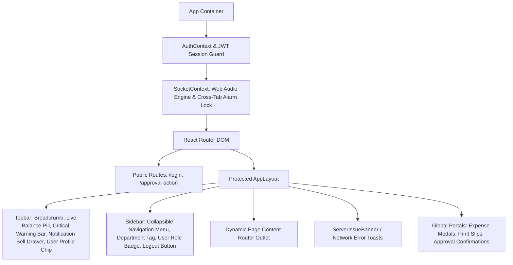
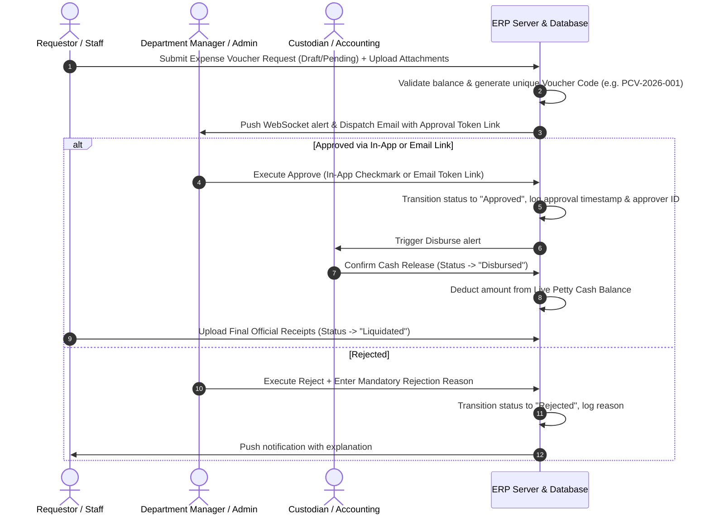
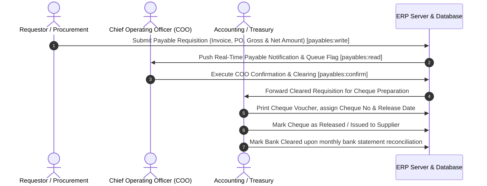
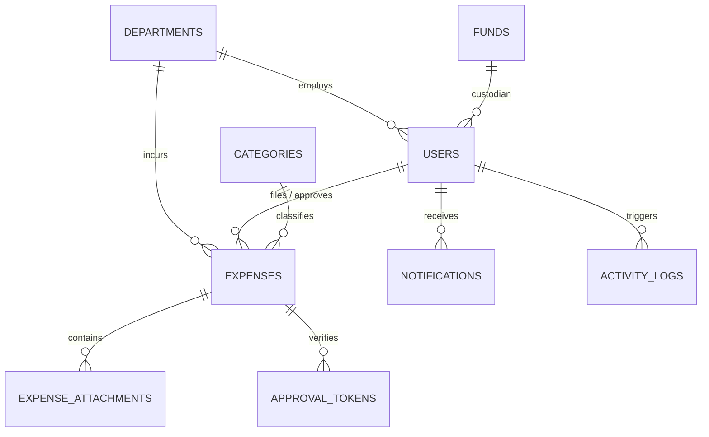

# NKB PETTY CASH ERP SYSTEM — COMPLETE MASTER BLUEPRINT

---

## 1. Complete UI Structure & Layout Architecture

### Layout Components Hierarchy
- **`AppLayout.jsx`**: Global master shell wrapping all authenticated routes.
  - **Header / Topbar**: Live system status, current Petty Cash balance counter, real-time unread notification bell with badge counter, active user profile preview, dark/light theme accents.
  - **Sidebar Navigation**: Role-filtered navigation links, active route highlight, collapsed/expanded toggle state persisted in `localStorage`.
  - **Main View Area**: Responsive viewport with container constraints, animated page transitions (`framer-motion`), breadcrumb hierarchy.
  - **Notification Drawer**: Sliding side panel displaying real-time priority-classified notifications (Normal, Important, Critical), acknowledge action buttons, and clear all.
  - **System Banner Layer**: Top-floating sticky banners for server connectivity degradation, maintenance, or high-priority cash replenishment alerts.

---

## 2. Complete Catalog of Every Page

| # | Route | Page Component | Allowed Roles | Primary Function |
|---|---|---|---|---|
| 1 | `/login` | `Login.jsx` | Public | Authentication via Username OR Email and password with enterprise branding. |
| 2 | `/` or `/dashboard` | `Dashboard.jsx` | All Roles | Real-time financial KPI cards, quick analytics, recent vouchers, replenishment alerts. |
| 3 | `/expenses` | `Expenses.jsx` | All Roles | Petty cash vouchers ledger, submission, approval, filtering, attachment inspection, editing, liquidation. |
| 4 | `/funds` | `Funds.jsx` | Super Admin, Accounting | Allocation, replenishment records, cash influx tracking, initial float management. |
| 5 | `/analytics` | `Analytics.jsx` | All Roles | Expense charts, monthly burn rates, departmental cost distributions, category trends. |
| 6 | `/reports` | `Reports.jsx` | Super Admin, Accounting, Manager | Formal liquidation statements, audit summaries, custom date-range CSV/PDF exports. |
| 7 | `/notes` | `Notes.jsx` | All Roles | Internal scratchpad, operational audit memos, custodian handover logs. |
| 8 | `/email-automation` | `EmailAutomation.jsx` | Super Admin | Outgoing SMTP settings, email templates, auto-escalation rules, instant dispatch testing. |
| 9 | `/queue-monitor` | `QueueMonitor.jsx` | Super Admin | Real-time status of outgoing notification queue, retry engine, delivery logs. |
| 10 | `/categories` | `Categories.jsx` | Super Admin, Accounting | Management of expense categories, budget tagging, active status toggles. |
| 11 | `/departments` | `Departments.jsx` | Super Admin, Accounting | Organizational business unit configuration, department budget allocations. |
| 12 | `/users` | `Users.jsx` | Super Admin | Access governance, user account provisioning, role assignments, admin password resets. |
| 13 | `/logs` | `Logs.jsx` | Super Admin | Immutable activity logs, security audit trails, IP timestamps, system events. |
| 14 | `/backup` | `BackupRestore.jsx` | Super Admin | Database SQL dumps, snapshot creation, single-click restoration, disaster recovery. |
| 15 | `/settings` | `Settings.jsx` | Super Admin | System thresholds, minimum balance alarm triggers, currency formatting, company profile. |
| 16 | `/manual` | `UserManual.jsx` | All Roles | Interactive documentation, standard operating procedures, role-based workflows. |
| 17 | `/profile` | `Profile.jsx` | All Roles | Personal information update (Name & Email), secret authentication password change. |
| 18 | `/approval-action` | `ApprovalAction.jsx` | Public (Tokenized) | One-click email approval/rejection handler for external managers with token validation. |
| 19 | `/payables` | `Payables.jsx` | Super Admin, COO, Accounting, Manager | Cheque payables ledger, requisition submission, COO clearing, cheque issuance tracking. |

---

## 3. Detailed Component Architecture

1. **`NotificationCenter.jsx`**:
   - Handles real-time websocket and polling notification feeds.
   - Categorizes alerts by priority: `Normal` (Blue), `Important` (Amber), `Critical` (Red).
   - Features single-click acknowledgment, mark-as-read, and navigation to target vouchers.
2. **`ReceiptManager.jsx`**:
   - Supporting document and receipt attachment inspector.
   - Provides full-screen lightbox preview, rotation, zoom, direct image rendering, and document download.
3. **`ApprovalSettingsPanel.jsx`**:
   - Configures multi-tier approval rules (Amount thresholds requiring Manager vs Super Admin approval).
   - Configures auto-reminder cron triggers and token expiry durations.
4. **`ServerIssueBanner.jsx` & `ServiceUnavailable.jsx`**:
   - Detects API disconnects (HTTP 502/503/504 or network timeout).
   - Displays non-intrusive reconnection retry bar without unmounting user UI state.
5. **`AppErrorBoundary.jsx`**:
   - Top-level React error boundary preventing white-screen crashes on runtime JavaScript exceptions.
6. **Web Audio Alarm Synthesizer Engine**:
   - Direct browser `AudioContext` oscillator synthesis (Sine, Triangle, Sawtooth waveforms).
   - Cross-tab lock using `localStorage` heartbeat (`nkb_active_alarm_tab`) preventing audio duplication across multiple open browser tabs.
7. **`PayableRequisitionModal.jsx` & `ChequeClearingDrawer.jsx`**:
   - Management modal for submitting large supplier cheque requisitions with attached invoices.
   - Drawer for COO Clearing confirmation, cheque number assignment, and bank release tracking.

---

## 4. Complete Inventory of Every Button & Control

### Global Topbar & Navigation Controls
- `Sidebar Toggle Button`: Collapses/expands sidebar navigation width.
- `Quick Replenish Button`: Direct shortcut to fund replenishment modal (Admin/Accounting).
- `Notification Bell Icon`: Toggles notification slider drawer; badge displays unread count.
- `User Profile Pill`: Navigates to `/profile` page.
- `Logout Button`: Clears local JWT tokens, invalidates cache, redirects to `/login`.

### Expenses Page (`Expenses.jsx`) Controls
- `+ Create Expense Voucher`: Opens the multi-field voucher creation modal.
- `Search Input Filter`: Real-time query search across description, payee, voucher code, category, and department.
- `Status Filter Dropdown`: Filters by `All`, `Pending`, `Approved`, `Rejected`, `Disbursed`, `Liquidated`.
- `Date Range Picker`: Custom start/end date filter.
- `Department & Category Filter`: Narrow ledger by specific business units.
- `View Details (Eye Icon)`: Opens comprehensive voucher preview modal with attachments and approval timeline.
- `Quick Approve (Green Check Icon)`: Direct 1-click approval for authorized managers/admins.
- `Quick Reject (Red X Icon)`: Opens rejection reason prompt modal.
- `Edit Voucher (Pencil Icon)`: Opens editing modal for draft/pending requests (or admin override).
- `Delete Voucher (Trash Icon)`: Soft/hard delete voucher record with confirmation prompt.
- `Print Slip (Printer Icon)`: Generates formal printable Petty Cash Voucher (PCV) slip.
- `Export to CSV / Excel`: Downloads filtered voucher table into spreadsheet format.
- `Batch Selection Checkboxes`: Select multiple vouchers for bulk approval or export.

### Cheque Payables Page (`Payables.jsx`) Controls
- `+ New Payable Requisition`: Opens the requisition creation modal (`payables:write`).
- `COO Confirm & Clear (Stamp Icon)`: Confirms payable and authorizes cheque preparation (`payables:confirm`).
- `Issue Cheque (Checkbook Icon)`: Assigns bank account, cheque number, and release date (`payables:confirm`, `Accounting`).
- `Mark Cleared (Bank Check Icon)`: Marks cheque as negotiated/cleared with bank statement reconciliation (`payables:confirm`).
- `Print Cheque Voucher (CV Printer Icon)`: Generates printable Cheque Voucher with breakdown and BIR 2307 withholding fields.
- `Export Payables Ledger`: Exports pending/cleared cheque payables to CSV/Excel (`payables:read`).

### Funds Management (`Funds.jsx`) Controls
- `+ Add Cash Replenishment`: Opens allocation modal (Amount, Source, Reference No, Notes).
- `Adjustment Override Button`: Admin balance recalibration tool.
- `Fund History Export`: Exports historical balance replenishments.

### User Management (`Users.jsx`) Controls
- `+ Provision User`: Opens user creation modal (Username, Full Name, Email, Role, Department, Initial Password).
- `Edit User`: Updates existing user information and provides a **Reset Password** input field.
- `Delete User`: Removes user access (guards against self-deletion).
- `Toggle Active Status`: Deactivates account without deleting historical audit links.

### Profile Page (`Profile.jsx`) Controls
- `Update Profile Details Button`: Submits updated Full Name and Email Address.
- `Save New Password Button`: Validates current password and updates to new secure password.

---

## 5. Comprehensive Form Specifications

### 1. Expense Voucher Creation / Edit Form
- **Fields**:
  - `Payee / Requestor Name`: Text (Required).
  - `Department`: Select Dropdown (Required, maps to `departments.id`).
  - `Category`: Select Dropdown (Required, maps to `categories.id`).
  - `Item Description`: Textarea (Required, specific reason for expense).
  - `Quantity`: Number (Default: `1`, min: `0.01`).
  - `Unit`: Select Dropdown / Free text (`pcs`, `box`, `kg`, `lot`, `unit`, `service`, etc.).
  - `Unit Price / Amount`: Decimal Currency (Required, min: `0.01`).
  - `Brand / Specifications`: Text (Optional).
  - `Quotation / Official Receipt Attachment`: Multi-file Upload (`.jpg`, `.jpeg`, `.png`, `.pdf`, max 10MB per file).
  - `Remarks / Notes`: Textarea (Optional).

### 2. Fund Allocation / Replenishment Form
- **Fields**:
  - `Replenishment Amount`: Decimal Currency (Required).
  - `Disbursing Source`: Text (e.g., Main Treasury Bank, Check No, Cash Inflow).
  - `Reference / Check Number`: Text (Required for audit).
  - `Date Allocated`: Date-Time Picker (Default: Current timestamp).
  - `Custodian Notes`: Textarea.

### 3. User Account Provisioning & Reset Form
- **Fields**:
  - `Username`: Alphanumeric (Required, Unique, trimmed).
  - `Legal Full Name`: Text (Required).
  - `Official Email Address`: Email Format (Required, Unique).
  - `Role`: Dropdown (`Super Admin`, `Accounting`, `Manager`, `Staff`).
  - `Assigned Department`: Dropdown (Optional for Global Admin, Required for Staff/Manager).
  - `Password / Reset Password`: Password (Required on create, optional on edit).

### 4. Outgoing SMTP & Email Automation Form
- **Fields**:
  - `SMTP Host`: Text (e.g., `smtp.hostinger.com` or `smtp.gmail.com`).
  - `SMTP Port`: Number (`465` for SSL, `587` for TLS).
  - `Encryption`: Toggle (`SSL/TLS` vs `STARTTLS`).
  - `SMTP Username / Email`: Email string.
  - `SMTP Password / App Password`: Secret Password string.
  - `Sender Name`: Text (e.g., `NKB Petty Cash ERP`).
  - `Escalation Timeout Hours`: Number (Default: `24` hours).
  - `Test Recipient Email`: Action input to trigger live test dispatch.

### 5. Cheque Payable Requisition & Clearing Form
- **Form Layout**:
  - **Company**: Select Dropdown (*NKB Manufacturing Corporation, Norvin Bella (COOP), NKB Cosmetics Manufacturing, NKB Cosmetic Products Trading, New Yra Enterprises, Vyuceutical*) with `+ Add` custom company action.
  - **Invoice Number**: Text (e.g. `239683`).
  - **Date Created**: Read-only current date (`MM/DD/YYYY`).
  - **Payable Number**: Sequential code (`PB-Auto` / `PB-YYYYMM-XXXX`).
  - **Payable Category**: Text/Select (Default: `Trade payable`).
  - **Invoice Date**: Date Picker (Default: Current date).
  - **Created By**: Read-only user name / role (`Accountant`).
  - **Control Number**: Text (e.g. `1993`).
  - **Vendor \***: Payee text (Required, e.g. `MARK JOSEPH Q. REALUYO`).
  - **Term**: Select Dropdown (`Net 30`, `Net 15`, `Net 45`, `Net 60`, `COD`, `Immediate`).
  - **Due Date**: Date Picker (Auto-computed from `Invoice Date + Term`).
  - **Status**: Read-only state (`Submitted For Approval`).
  - **Description**: Summary text (e.g. `RAW MATERIALS`).
  - **Bank to use for check \***: Target disbursement account with live available balances:
    - *BDO: Norvin Bella (COOP) - 0080-5801-0563 (Avail: ₱650,000.00)*
    - *BDO: NKB Manufacturing Corporation - 0080-5801-0547 (Avail: ₱950,000.00)*
    - *BDO: NKB Cosmetics Manufacturing - 0105-4800-4829 (Avail: ₱800,000.00)*
    - *BDO: NKB Cosmetic Products Trading - 0105-4800-3245 (Avail: ₱700,000.00)*
    - *BDO: New Yra Enterprises - 0036-8801-3196 (Avail: ₱600,000.00)*
    - *BDO: Vyuceutical - 0080-5801-0717 (Avail: ₱550,000.00)*
    - *Security Bank: NKB Manufacturing Corporation - 0000079720871 (Avail: ₱500,000.00)*
    - *Metrobank: NKB Manufacturing Corporation - 788-7-78803245-1 (Avail: ₱750,000.00)*
  - **Itemized Items Table (Repeater)**:
    - `Description`: Item description text.
    - `Expense Category`: Dropdown (`Raw Materials`, `Packaging Materials`, `Office Supplies`, `Utilities`, `Maintenance`, `Logistics`, `Marketing`, `Professional Fees`, `Taxes & Licenses`).
    - `Quantity`: Number (min: 1).
    - `Cost`: Decimal (PHP).
    - `Subtotal`: Read-only computed $\text{Quantity} \times \text{Cost}$.
    - `+ Add` / `Delete` controls per line item.
  - **Comments**: Upper-case formatted check instructions / details.
  - **Files**: Supporting Invoices, Quotations, and Delivery Receipts upload.
  - **Calculation Summary**: Real-time compute for `Subtotal`, `Total`, and `Amount Due`.
  - **COO Confirmation & Clearing**: Stamp authorization for cheque preparation.

---

## 6. End-to-End Business Workflows

### 1. Standard Petty Cash Request-to-Liquidation Lifecycle

### 2. Cheque Payables & Requisitions Lifecycle (COO Clearing)

### 3. Low-Balance & Replenishment Alarm Workflow
1. Every time a voucher is disbursed or fund updated, the system evaluates:
   $$\text{Current Balance} \le \text{Minimum Safe Threshold}$$
2. If true:
   - System flags `is_low_balance = true`.
   - Generates a **`Critical`** priority notification.
   - Pushes websocket event triggering continuous Web Audio alarm synthesizer in active browser tab.
   - Sends automated alert email to Accounting Custodians.
3. Custodian submits **Fund Replenishment**.
4. Balance recalculates, alarm mutes automatically across all open tabs via `localStorage` sync.

---

## 7. Complete Validation Rules

| Validation Target | Rule Definition | Failure Response |
|---|---|---|
| **Voucher Amount** | Must be numeric, positive $> 0.00$, max $\le$ current available petty cash fund. | `400 Bad Request: Amount exceeds available cash float or invalid.` |
| **Voucher Description** | Non-empty string, min length 3 characters, max 1000 characters. | `400 Bad Request: Description is mandatory.` |
| **Attachment Files** | Allowed extensions: `.png`, `.jpg`, `.jpeg`, `.webp`, `.pdf`. Max size 10MB/file. | `422 Unprocessable: Invalid file type or file size exceeds 10MB limit.` |
| **User Sign-in** | Case-insensitive matching on `Username` OR `Email`. Password verification via `bcrypt.compare`. | `401 Unauthorized: Invalid username/email or password.` |
| **New User Creation** | Unique `username`, unique `email`, password min 6 characters. | `400 Bad Request: Username/Email already taken.` |
| **Password Change** | Correct `currentPassword`, `newPassword` $\ge 6$ chars, `newPassword === confirmPassword`. | `400 Bad Request: Incorrect current password or password mismatch.` |
| **Rejection Reason** | Mandatory non-empty string when rejecting a voucher. | `400 Bad Request: A valid rejection reason is required.` |
| **Approval Token** | Must exist in `approval_tokens`, matching token string, `expires_at > NOW()`, `used = 0`. | `400 Bad Request: Approval link is invalid or expired.` |

---

## 8. Complete System Calculations & Mathematical Formulas

1. **Current Available Petty Cash Balance**:
   $$\text{Available Balance} = \sum \text{Funds (Allocated/Replenished)} - \sum \text{Expenses (Disbursed/Approved)}$$

2. **Total Voucher Line Amount**:
   $$\text{Voucher Total} = \text{Quantity} \times \text{Unit Price}$$
   *(Note: Decimal precision is enforced to 2 decimal places using `DECIMAL(12,2)` without floating-point rounding errors).*

3. **Burn Rate & Runway Calculation**:
   $$\text{Daily Burn Rate} = \frac{\sum \text{Disbursed Expenses (Last 30 Days)}}{30}$$
   $$\text{Estimated Cash Runway (Days)} = \frac{\text{Current Available Balance}}{\text{Daily Burn Rate}}$$

4. **Liquidation Variance (Cash Advance vs Actual Receipts)**:
   $$\Delta \text{Variance} = \text{Cash Advance Amount} - \sum \text{Verified Liquidated Receipts}$$
   - If $\Delta > 0$: Cash Return due to Custodian.
   - If $\Delta < 0$: Reimbursement Payable to Employee.

---

## 9. Role & Permission Matrix & Granular Permission Scopes

### Granular Permission Scopes
- **`payables:read`** — View Cheque Payables & Requisitions
- **`payables:confirm`** — COO Confirmation & Clearing
- **`payables:write`** — Submit New Payable Requisitions

### Feature / Action Matrix by Role

| Feature / Action | Scope Key | Super Admin | COO | Accounting | Manager | Staff |
|---|:---:|:---:|:---:|:---:|:---:|:---:|
| **Create Expense Voucher** | `expenses:write` | ✅ | ✅ | ✅ | ✅ | ✅ |
| **Edit Own Pending Expense** | `expenses:write_own` | ✅ | ✅ | ✅ | ✅ | ✅ |
| **Edit Any Expense** | `expenses:write_all` | ✅ | ✅ | ✅ | ❌ | ❌ |
| **Direct Approve / Reject Expense** | `expenses:approve` | ✅ | ✅ | ✅ (Disburse) | ✅ (Dept Only) | ❌ |
| **Delete Expense** | `expenses:delete` | ✅ | ❌ | ❌ | ❌ | ❌ |
| **Submit Fund Replenishment** | `funds:write` | ✅ | ✅ | ✅ | ❌ | ❌ |
| **View Analytics & Reports** | `reports:read` | ✅ | ✅ | ✅ | ✅ | ✅ (Own Dept) |
| **Export Reports to PDF/Excel** | `reports:export` | ✅ | ✅ | ✅ | ✅ | ❌ |
| **View Cheque Payables & Requisitions** | `payables:read` | ✅ | ✅ | ✅ | ✅ | ❌ |
| **COO Confirmation & Clearing** | `payables:confirm` | ✅ | ✅ | ❌ | ❌ | ❌ |
| **Submit New Payable Requisitions** | `payables:write` | ✅ | ✅ | ✅ | ✅ | ❌ |
| **Access User Access Governance (`/users`)** | `users:manage` | ✅ | ❌ | ❌ | ❌ | ❌ |
| **Access Email Automation & SMTP Settings** | `settings:manage` | ✅ | ❌ | ❌ | ❌ | ❌ |
| **Database Backup & Restoration** | `system:backup` | ✅ | ❌ | ❌ | ❌ | ❌ |
| **View System Audit Logs** | `logs:read` | ✅ | ✅ | ❌ | ❌ | ❌ |
| **Update Own Profile & Change Password** | `profile:write` | ✅ | ✅ | ✅ | ✅ | ✅ |

---

## 10. Complete API Reference Directory

### Authentication & Profile (`/api/auth`, `/api/users/profile`, `/api/profile`)
- `POST /api/auth/login`: Authenticate by username/email and password. Returns JWT token and user info.
- `GET /api/auth/me`: Retrieve currently logged-in user profile from JWT session.
- `PUT /api/users/profile/info`: Update Full Name and Email Address for logged-in user.
- `PUT /api/users/profile/password`: Change password for logged-in user (validates current password).

### Expenses & Vouchers (`/api/expenses`)
- `GET /api/expenses`: List all expense vouchers with filtering, search, and pagination.
- `GET /api/expenses/:id`: Retrieve single expense voucher details with attachments and timeline.
- `POST /api/expenses`: Create new expense voucher (supports multipart `FormData` for attachments).
- `PUT /api/expenses/:id`: Update expense voucher details and append new attachments.
- `DELETE /api/expenses/:id`: Delete expense voucher (Super Admin only).
- `PUT /api/expenses/:id/approve`: Approve voucher and trigger balance deduction/disbursement.
- `PUT /api/expenses/:id/reject`: Reject voucher with mandatory reason payload.
- `PUT /api/expenses/:id/liquidate`: Complete liquidation and receipt reconciliation.

### Cheque Payables & Requisitions (`/api/payables`)
- `GET /api/payables`: List all payable requisitions and cheque statuses (`payables:read`).
- `GET /api/payables/:id`: View specific payable voucher details and supporting invoices (`payables:read`).
- `POST /api/payables`: Submit new payable requisition with supplier quotation/invoice (`payables:write`).
- `PUT /api/payables/:id/confirm`: Execute COO Confirmation & Clearing for cheque issuance (`payables:confirm`).
- `PUT /api/payables/:id/clear`: Final clearing and cheque release acknowledgement (`payables:confirm`).

### Funds & Balance (`/api/funds`)
- `GET /api/funds`: Fetch fund ledger, initial allocation, replenishment history, and current balance.
- `POST /api/funds/replenish`: Record new petty cash fund replenishment.
- `GET /api/funds/summary`: High-level summary of total in/out cash flows.

### User Management (`/api/users`)
- `GET /api/users`: List all users with department names and roles (Super Admin only).
- `POST /api/users`: Provision new user account.
- `PUT /api/users/:id`: Update user role, department, info, or reset password.
- `DELETE /api/users/:id`: Delete user account (prevents self-deletion).

### Master Data (`/api/departments`, `/api/categories`)
- `GET /api/departments` & `POST /api/departments` & `PUT /api/departments/:id`: Manage departments.
- `GET /api/categories` & `POST /api/categories` & `PUT /api/categories/:id`: Manage expense categories.

### Notifications & Email Engine (`/api/notifications`, `/api/email-automation`, `/api/approval`)
- `GET /api/notifications`: Retrieve user's unread notifications.
- `PUT /api/notifications/:id/read`: Mark notification as read.
- `PUT /api/notifications/:id/acknowledge`: Acknowledge critical alarm (stops audio alert).
- `GET /api/email-automation/settings` & `PUT /api/email-automation/settings`: View/save SMTP config.
- `POST /api/email-automation/test`: Dispatch live test email.
- `GET /api/approval/action`: Process tokenized email approval/rejection link.

### System, Reports & Maintenance (`/api/reports`, `/api/analytics`, `/api/logs`, `/api/backup`, `/health`)
- `GET /api/analytics/dashboard`: Aggregate KPI metrics, category breakdown, burn rate.
- `GET /api/reports/liquidation`: Generate formal liquidation report data.
- `GET /api/logs`: Query immutable system activity logs.
- `POST /api/backup/export`: Create full SQL database backup archive.
- `POST /api/backup/restore`: Restore database from uploaded snapshot.
- `GET /health`: Uptime and service health check probe.

---

## 11. Database Architecture & Complete Table Schemas

### Table 1: `users`
| Column | Type | Nullable | Attributes / Constraints |
|---|---|---|---|
| `id` | `INT AUTO_INCREMENT` | No | `PRIMARY KEY` |
| `username` | `VARCHAR(100)` | No | `UNIQUE`, Indexed |
| `password` | `VARCHAR(255)` | No | Hashed bcrypt string |
| `full_name` | `VARCHAR(150)` | No | Text |
| `email` | `VARCHAR(150)` | Yes | `UNIQUE`, Indexed |
| `role` | `VARCHAR(50)` | No | `Super Admin`, `Accounting`, `Manager`, `Staff` |
| `department_id` | `INT` | Yes | `FOREIGN KEY` $\to$ `departments.id` |
| `status` | `BOOLEAN` | No | Default: `1` (Active) |
| `created_at` | `TIMESTAMP` | No | Default: `CURRENT_TIMESTAMP` |
| `updated_at` | `TIMESTAMP` | Yes | Default: `CURRENT_TIMESTAMP ON UPDATE` |

### Table 2: `departments`
| Column | Type | Nullable | Description |
|---|---|---|---|
| `id` | `INT AUTO_INCREMENT` | No | `PRIMARY KEY` |
| `name` | `VARCHAR(100)` | No | `UNIQUE` department name |
| `description` | `TEXT` | Yes | Description / Purpose |
| `created_at` | `TIMESTAMP` | No | Default: `CURRENT_TIMESTAMP` |

### Table 3: `categories`
| Column | Type | Nullable | Description |
|---|---|---|---|
| `id` | `INT AUTO_INCREMENT` | No | `PRIMARY KEY` |
| `name` | `VARCHAR(100)` | No | `UNIQUE` expense category |
| `description` | `TEXT` | Yes | Category description |
| `created_at` | `TIMESTAMP` | No | Default: `CURRENT_TIMESTAMP` |

### Table 4: `expenses`
| Column | Type | Nullable | Attributes / Constraints |
|---|---|---|---|
| `id` | `INT AUTO_INCREMENT` | No | `PRIMARY KEY` |
| `voucher_no` | `VARCHAR(50)` | Yes | Unique voucher tracking code |
| `user_id` | `INT` | No | `FOREIGN KEY` $\to$ `users.id` (Creator) |
| `department_id` | `INT` | No | `FOREIGN KEY` $\to$ `departments.id` |
| `category_id` | `INT` | No | `FOREIGN KEY` $\to$ `categories.id` |
| `payee` | `VARCHAR(150)` | No | Payee / Requestor name |
| `description` | `TEXT` | No | Detailed justification |
| `quantity` | `DECIMAL(10,2)` | No | Default: `1.00` |
| `unit` | `VARCHAR(50)` | Yes | Measurement unit (`pcs`, `lot`, etc.) |
| `brand` | `VARCHAR(100)` | Yes | Brand / Model info |
| `amount` | `DECIMAL(12,2)` | No | Total amount in PHP |
| `status` | `VARCHAR(50)` | No | `Pending`, `Approved`, `Rejected`, `Disbursed`, `Liquidated` |
| `approved_by` | `INT` | Yes | `FOREIGN KEY` $\to$ `users.id` |
| `approved_at` | `DATETIME` | Yes | Timestamp of approval |
| `rejection_reason` | `TEXT` | Yes | Explanation if rejected |
| `remarks` | `TEXT` | Yes | Custodian / Audit remarks |
| `created_at` | `TIMESTAMP` | No | Default: `CURRENT_TIMESTAMP` |
| `updated_at` | `TIMESTAMP` | Yes | On update timestamp |

### Table 5: `expense_attachments`
| Column | Type | Nullable | Description |
|---|---|---|---|
| `id` | `INT AUTO_INCREMENT` | No | `PRIMARY KEY` |
| `expense_id` | `INT` | No | `FOREIGN KEY` $\to$ `expenses.id` (`ON DELETE CASCADE`) |
| `file_name` | `VARCHAR(255)` | No | Original upload filename |
| `file_path` | `VARCHAR(255)` | No | Relative path in `uploads/` |
| `file_size` | `INT` | Yes | File size in bytes |
| `file_type` | `VARCHAR(100)` | Yes | MIME type |
| `created_at` | `TIMESTAMP` | No | Default: `CURRENT_TIMESTAMP` |

### Table 6: `funds`
| Column | Type | Nullable | Description |
|---|---|---|---|
| `id` | `INT AUTO_INCREMENT` | No | `PRIMARY KEY` |
| `amount` | `DECIMAL(12,2)` | No | Replenishment / Inflow amount |
| `source` | `VARCHAR(150)` | No | Originating fund / Check number |
| `reference_no` | `VARCHAR(100)` | Yes | Bank / Check reference |
| `user_id` | `INT` | No | `FOREIGN KEY` $\to$ `users.id` (Custodian) |
| `notes` | `TEXT` | Yes | Audit notes |
| `created_at` | `TIMESTAMP` | No | Default: `CURRENT_TIMESTAMP` |

### Table 7: `notifications`
| Column | Type | Nullable | Description |
|---|---|---|---|
| `id` | `INT AUTO_INCREMENT` | No | `PRIMARY KEY` |
| `user_id` | `INT` | Yes | Target user (or `NULL` for global broadcast) |
| `title` | `VARCHAR(200)` | No | Notification headline |
| `message` | `TEXT` | No | Body text |
| `type` | `VARCHAR(50)` | No | `expense`, `fund`, `system`, `security` |
| `priority` | `VARCHAR(20)` | No | `normal`, `important`, `critical` |
| `is_read` | `BOOLEAN` | No | Default: `0` |
| `acknowledged` | `BOOLEAN` | No | Default: `0` (Mutes audible alarms) |
| `created_at` | `TIMESTAMP` | No | Default: `CURRENT_TIMESTAMP` |

### Table 8: `approval_tokens`
| Column | Type | Nullable | Description |
|---|---|---|---|
| `id` | `INT AUTO_INCREMENT` | No | `PRIMARY KEY` |
| `expense_id` | `INT` | No | `FOREIGN KEY` $\to$ `expenses.id` |
| `token` | `VARCHAR(255)` | No | `UNIQUE` cryptographically secure token string |
| `action` | `VARCHAR(50)` | No | `APPROVE` or `REJECT` |
| `approver_id` | `INT` | No | Target authorized manager ID |
| `expires_at` | `DATETIME` | No | Expiration timestamp |
| `used` | `BOOLEAN` | No | Default: `0` |
| `created_at` | `TIMESTAMP` | No | Default: `CURRENT_TIMESTAMP` |

### Table 9: `activity_logs`
| Column | Type | Nullable | Description |
|---|---|---|---|
| `id` | `INT AUTO_INCREMENT` | No | `PRIMARY KEY` |
| `user_id` | `INT` | Yes | `FOREIGN KEY` $\to$ `users.id` |
| `action` | `VARCHAR(100)` | No | Action code (`LOGIN`, `APPROVE`, `CREATE_EXPENSE`) |
| `details` | `TEXT` | Yes | Action parameters / JSON metadata |
| `ip_address` | `VARCHAR(50)` | Yes | Request client IP |
| `created_at` | `TIMESTAMP` | No | Default: `CURRENT_TIMESTAMP` |

### Table 10: `system_settings`
| Column | Type | Nullable | Description |
|---|---|---|---|
| `id` | `INT AUTO_INCREMENT` | No | `PRIMARY KEY` |
| `setting_key` | `VARCHAR(100)` | No | `UNIQUE` key (e.g. `min_balance_threshold`, `currency`) |
| `setting_value` | `TEXT` | No | Serialized configuration string / JSON |
| `updated_at` | `TIMESTAMP` | Yes | Timestamp of last modification |

### Table 11: `payables`
| Column | Type | Nullable | Description |
|---|---|---|---|
| `id` | `INT AUTO_INCREMENT` | No | `PRIMARY KEY` |
| `requisition_no` | `VARCHAR(50)` | No | `UNIQUE` requisition tracking number (e.g., `PR-2026-001`) |
| `supplier_name` | `VARCHAR(150)` | No | Supplier / Vendor legal entity |
| `invoice_no` | `VARCHAR(100)` | Yes | Sales Invoice / Billing Reference |
| `department_id` | `INT` | No | `FOREIGN KEY` $\to$ `departments.id` |
| `user_id` | `INT` | No | `FOREIGN KEY` $\to$ `users.id` (Requestor) |
| `gross_amount` | `DECIMAL(12,2)` | No | Total invoice gross amount |
| `ewt_rate` | `DECIMAL(5,2)` | No | Default `0.00` (E.g. 1%, 2%, 5% Withholding Tax) |
| `ewt_amount` | `DECIMAL(12,2)` | No | Computed tax withheld |
| `net_amount` | `DECIMAL(12,2)` | No | Net cheque payable amount |
| `due_date` | `DATE` | No | Payment deadline |
| `status` | `VARCHAR(50)` | No | `Pending`, `Confirmed`, `Cheque Issued`, `Cleared`, `Cancelled` |
| `coo_confirmed_by` | `INT` | Yes | `FOREIGN KEY` $\to$ `users.id` (COO user) |
| `coo_confirmed_at` | `DATETIME` | Yes | Timestamp of COO Clearing |
| `remarks` | `TEXT` | Yes | Requisition notes / justification |
| `created_at` | `TIMESTAMP` | No | Default: `CURRENT_TIMESTAMP` |
| `updated_at` | `TIMESTAMP` | Yes | On update timestamp |

### Table 12: `payable_attachments`
| Column | Type | Nullable | Description |
|---|---|---|---|
| `id` | `INT AUTO_INCREMENT` | No | `PRIMARY KEY` |
| `payable_id` | `INT` | No | `FOREIGN KEY` $\to$ `payables.id` (`ON DELETE CASCADE`) |
| `file_name` | `VARCHAR(255)` | No | Original filename |
| `file_path` | `VARCHAR(255)` | No | File location in `uploads/` |
| `file_size` | `INT` | Yes | File size |
| `file_type` | `VARCHAR(100)` | Yes | MIME type |
| `created_at` | `TIMESTAMP` | No | Default: `CURRENT_TIMESTAMP` |

### Table 13: `cheque_issuances`
| Column | Type | Nullable | Description |
|---|---|---|---|
| `id` | `INT AUTO_INCREMENT` | No | `PRIMARY KEY` |
| `payable_id` | `INT` | No | `FOREIGN KEY` $\to$ `payables.id` |
| `bank_name` | `VARCHAR(100)` | No | Bank Account (BDO, BPI, Metrobank, etc.) |
| `cheque_number` | `VARCHAR(100)` | No | Official cheque booklet serial number |
| `cheque_date` | `DATE` | No | Date printed on cheque |
| `released_to` | `VARCHAR(150)` | Yes | Representative or courier name |
| `released_at` | `DATETIME` | Yes | Date/time released |
| `cleared_at` | `DATETIME` | Yes | Bank statement clearing timestamp |
| `issued_by` | `INT` | No | `FOREIGN KEY` $\to$ `users.id` (Treasury/Accounting) |
| `created_at` | `TIMESTAMP` | No | Default: `CURRENT_TIMESTAMP` |

---

## 12. Database Relationships & Referential Integrity

- **`expenses.user_id` $\to$ `users.id`**: Tracks who submitted the voucher (`ON DELETE RESTRICT`).
- **`expenses.approved_by` $\to$ `users.id`**: Tracks which manager or admin approved the disbursement.
- **`expenses.department_id` $\to$ `departments.id`**: Direct departmental cost mapping.
- **`expenses.category_id` $\to$ `categories.id`**: Budget category tracking.
- **`expense_attachments.expense_id` $\to$ `expenses.id`**: Linked attachments with `ON DELETE CASCADE`.
- **`approval_tokens.expense_id` $\to$ `expenses.id`**: One-time email links with `ON DELETE CASCADE`.
- **`funds.user_id` $\to$ `users.id`**: Custodian accountability for replenishment inflows.

---

## 13. Integrations Architecture

1. **MySQL / MariaDB Connection Pool**:
   - Managed via `Knex.js` query builder with automatic connection recycling, reconnect timeouts, and parameterized queries.
2. **Socket.IO Real-Time Messaging Cluster**:
   - Bi-directional websocket connection between Express backend and React client.
   - Synchronizes balance changes (`balance_updated`), voucher approvals (`expense_updated`), and audible alarms.
3. **Nodemailer SMTP Email System**:
   - Transports automated voucher approval notifications, liquidation notices, and tokenized direct-action links.
4. **Hostinger Apache & Passenger Proxy Architecture**:
   - Canonical persistent attachment storage (`shared_uploads`).
   - High-performance static routing bypassing SPA rewrites (`RewriteRule ^uploads/ - [L]`).
   - Reverse proxy routing for API (`RewriteRule ^api - [L]`).

---

## 14. Standard Reports Catalog

1. **Monthly Petty Cash Liquidation Statement**:
   - Chronological itemization of all disbursed expenses with receipt references, payees, and total sum.
2. **Departmental Budget Consumption Breakdown**:
   - Spending distribution across Manufacturing, Quality Assurance, Sales, Admin, and Operations.
3. **Category Spending Pareto Report**:
   - Identifies highest expenditure categories (e.g., Tools, Travel, Office Supplies, Meals).
4. **Cash Replenishment & Custodian Flow Audit**:
   - Detailed ledger of starting float, all replenishments received, total disbursements, and ending on-hand balance.
5. **Security & User Action Audit Log Report**:
   - Timeline of logins, password updates, voucher approvals, rejections, and permission modifications.

---

## 15. Print & Export Functionalities

1. **Formal Petty Cash Voucher (PCV) Printable Slip**:
   - Generates official company-formatted A4/Letter printable voucher with:
     - Official NKB Manufacturing header and logo.
     - PCV Number, Date, Department, Payee.
     - Itemized table with Quantity, Unit, Brand, Description, Amount.
     - Signature blocks: *Requested By*, *Approved By*, *Received By (Payee)*, *Disbursed By (Custodian)*.
2. **Excel / CSV Data Export**:
   - Converts active filtered ledger into clean tabular CSV/Excel files with sanitized headers.
3. **Client-Side PDF Document Compilation**:
   - Utilizes `jsPDF` and `jsPDF-AutoTable` to compile vector-sharp liquidation summaries directly in the browser.

---

## 16. Special, Advanced & Hidden Behaviors

1. **Persistent Uploads via Server Symlinks (`shared_uploads`)**:
   - Prevents file loss during CI/CD or host deployments by keeping uploaded receipts in `/home/u335953510/domains/pc.nkbmanufacturing.com/shared_uploads`, symlinked to `public_html/uploads` and `nodejs/uploads`.
2. **Dual-Identifier Flexible Authentication**:
   - Users can log in using either their `Username` (e.g., `Norvin`) or `Email Address` (`norvin.bella@nkbmanufacturing.com`).
   - Inputs are automatically trimmed of stray whitespace and matched case-insensitively.
3. **Cross-Tab Web Audio Synthesizer Mutex**:
   - When a critical balance alarm triggers, all open tabs coordinate using `localStorage` heartbeat locks so the audio chime only plays from one tab at a time.
4. **Tokenized Direct Email Approvals**:
   - Managers receive a direct link in their email containing a 64-character cryptographic token. Clicking the link approves/rejects the voucher instantly without requiring full manual login.
5. **Express Route Shadowing Guard**:
   - Profile routes (`/api/users/profile` and `/api/profile`) are explicitly mounted **before** `/api/users` to allow standard staff users to update credentials without triggering Super Admin 403 Forbidden blockers.

---

## 17. Historical Pitfalls & Bugs That Must NEVER Be Reproduced

1. **DO NOT store uploads inside volatile deployment folders**:
   - *Reason*: Hostinger and Git deployments overwrite build directories, deleting user receipt attachments. Always link to `shared_uploads`.
2. **DO NOT place `/api/users` before `/api/users/profile` in `index.js`**:
   - *Reason*: Express evaluates routes sequentially. Placing the Admin-guarded `/api/users` first blocks non-admin employees with HTTP 403 when trying to change passwords.
3. **DO NOT enforce strict case or single-identifier login**:
   - *Reason*: Mobile autofill or email-based logins will fail if the backend strictly searches `where('username', username)`. Always check both username and email case-insensitively.
4. **DO NOT use JavaScript floating-point numbers for money calculations**:
   - *Reason*: `0.1 + 0.2 = 0.30000000000000004`. Always use `DECIMAL(12,2)` in SQL and exact string or fixed decimal arithmetic (`.toFixed(2)` or `decimal.js`) for currency.
5. **DO NOT permit default Socket.IO polling-first on reverse proxy hosts**:
   - *Reason*: Apache Passenger proxy returns HTTP 503 on polling requests. Always prioritize `websocket` transport (`transports: ['websocket', 'polling']`).
6. **DO NOT omit `.htaccess` static bypass for uploads**:
   - *Reason*: Without `RewriteRule ^uploads/ - [L]`, requests for static images get trapped by Vite's SPA index router, returning HTML instead of the image.
